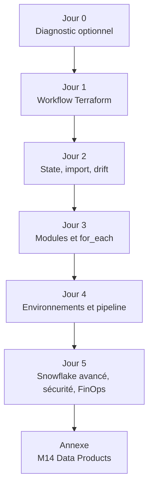

# Formation Terraform & Snowflake — Parcours officiel

**Format :** 5 jours × 6 heures = **30 heures**
**Public :** 11 participants hétérogènes — data analysts, data engineers, business developers, BI engineers
**Prérequis apprenant :** aucun. Le parcours ne suppose ni Azure, ni Azure DevOps, ni PowerShell, ni expérience de programmation.
**Résultat visé :** chaque participant sait configurer le provider Snowflake, déployer des objets Snowflake avec Terraform, lire un plan, détecter une dérive, factoriser avec des modules et livrer une preuve de cleanup.

> Azure n'est pas un sujet de cours. Les ressources nécessaires au state distant, au pipeline et à l'ingestion externe sont **préprovisionnées par le formateur**. Les apprenants consomment les paramètres fournis ; ils ne créent ni subscription, ni service principal, ni agent, ni Key Vault, ni storage account.

---

## Objectifs d'apprentissage

À la fin de la formation, un participant peut :

1. Expliquer le modèle `code → plan → apply → state → preuve`.
2. Authentifier Terraform au provider Snowflake sans écrire de secret dans Git.
3. Exécuter `init`, `fmt`, `validate`, `plan`, `apply`, `output` et `state list`.
4. Utiliser `variables`, `locals`, `outputs`, validations et conventions de nommage.
5. Expliquer le rôle du state, du backend distant et du locking.
6. Détecter une dérive, importer un objet existant et utiliser `moved`.
7. Créer et appeler un module Snowflake réutilisable.
8. Piloter des ressources stables avec `for_each` et des maps.
9. Comprendre une pipeline Terraform `validate → plan → approbation → apply`.
10. Déployer une petite plateforme Snowflake sécurisée, vérifier le zero-drift et nettoyer uniquement ses ressources préfixées.

---

## Architecture pédagogique



| Bloc | Jours | Intention |
|---|---:|---|
| Préparation | J0 optionnel | Éliminer les incidents d'outillage avant la formation |
| Initiation | J1–J3 | Construire les gestes Terraform essentiels sur Snowflake |
| Avancé | J4–J5 | CI/CD Terraform, environnements, RBAC, FinOps et Capstone zero-drift |
| Approfondissement | Après J5 | M14 Data products en option, hors critère de réussite du parcours 3+2 |

---

## Carte des modules

| Jour | Module | Objectif | Dossier officiel | Espace de travail |
|---:|---|---|---|---|
| 0 | M00 — Environnement | `SELECT 1`, préfixe, secrets hors Git | [module-00-setup](day-00/module-00-setup/course.md) | `labs/m00-setup/` |
| 1 | M01 — Workflow IaC | provider Snowflake, database/schema/warehouse, apply, second plan | [module-01-iac-workflow](day-01/module-01-iac-workflow/course.md) | `labs/m01-iac-workflow/` |
| 1 | M04 — Variables & outputs | contrats typés, `locals`, validations, naming | [module-04-variables-outputs](day-01/module-04-variables-outputs/course.md) | `labs/m04-variables-outputs/` |
| 2 | M02 — State | state local → distant, locking, `state list/show`, `detailed-exitcode` | [module-02-state-management](day-02/module-02-state-management/course.md) | `labs/m02-state-management/` |
| 2 | M03 — Brownfield | import, drift contrôlé, adoption sans recréation | [module-03-import-brownfield](day-02/module-02-state-management/module-03-import-brownfield/course.md) | `labs/m03-import-brownfield/` |
| 3 | M05 — Modules | contrat module, landing-zone Snowflake, `moved` | [module-05-modules](day-03/module-05-modules/course.md) | `labs/m05-modules/` |
| 3 | M06 — Logique dynamique | maps, `for_each`, `dynamic`, ajout par données | [module-06-dynamic-logic](day-03/module-06-dynamic-logic/course.md) | `labs/m06-dynamic-logic/` |
| 4 | M08 — Environnements | DEV/UAT/PROD par répertoires, isolation du state | [module-08-environments](day-04/module-08-environments/course.md) | `labs/m08-environments/` |
| 4 | M07 — Pipeline | pipeline Terraform : fmt/validate/plan/artifact/approval/apply/audit | [module-07-cicd-pipeline](day-04/module-07-cicd-pipeline/course.md) | `labs/m07-cicd-pipeline/` |
| 5 | M09 — Snowflake avancé | stages, file formats, `COPY INTO`, connectivité | [module-09-snowflake-advanced](day-05/module-09-snowflake-advanced/course.md) | `labs/m09-snowflake-advanced/` |
| 5 | M10 — Auth & secrets | PAT → RSA/JWT, provider aliases, gestion des secrets | [module-10-security-auth](day-05/module-10-security-auth/course.md) | `labs/m10-security-auth/` |
| 5 | M11 — RBAC | rôles fonctionnels, grants, future grants, action refusée | [module-11-rbac](day-05/module-11-rbac/course.md) | `labs/m11-rbac/` |
| 5 | M13 — FinOps | monitors, quotas, auto-suspend, cost tagging, observabilité | [module-13-finops-observability](day-05/module-13-finops-observability/course.md) | `labs/m13-finops-observability/` |
| 5 | M12 — Capstone | plateforme gouvernée complète, review, zero-drift, cleanup | [module-12-capstone](day-05/module-12-capstone/course.md) | `labs/m12-capstone/` |
| Annexe | M14 — Data products | extension facultative, packaging data mesh | [module-14-data-products](day-05/module-14-data-products/course.md) | `labs/m14-data-products/` |

> Les dossiers `courses/day-XX` reflètent l'emplacement actuel du dépôt, pas nécessairement le numéro pédagogique affiché. Utilisez la table ci-dessus comme source de vérité.

---

## Modalité des labs

Chaque lab est **autonome** et suit le même contrat :

1. mission métier et modèle mental ;
2. préflight non destructif ;
3. étapes guidées avec checkpoints ;
4. incident contrôlé ou diagnostic ;
5. défi à trois niveaux ;
6. validation automatique ou manuelle ;
7. cleanup limité au préfixe du participant.

### Préparer un espace de travail

```powershell
# Depuis la racine du dépôt
.\scripts\Reset-Lab.ps1 -LearnerPrefix APP01 -Lab M01
```

ou, de façon équivalente :

```powershell
.\scripts\New-StudentWorkspace.ps1 -Module 1 -LearnerPrefix APP01
```

Le workspace attendu est `labs/mXX-<nom>/`. Les validateurs self-paced sont lancés par :

```powershell
.\scripts\SelfPacedLab.ps1 -Module 1 -All
.\scripts\SelfPacedLab.ps1 -Module 1 -All -Report
```

### Preuve attendue

Chaque participant doit pouvoir montrer :

- `terraform fmt -check` : vert ;
- `terraform validate` : vert ;
- `terraform plan` : actions comprises avant `apply` ;
- `terraform state list` : objets uniquement préfixés `APPxx_Mxx` ;
- `SHOW ... LIKE 'APPxx_Mxx_%'` : preuve côté Snowflake ;
- second `terraform plan -detailed-exitcode` : `0` après cleanup ou après apply stable.

---

## Sécurité et coûts

- Aucun PAT, mot de passe, clé privée ou secret ne doit être écrit dans un fichier `.tf`, `terraform.tfvars`, rapport ou capture.
- Le PAT sert de mécanisme d'amorçage. L'authentification RSA/JWT est introduite au Jour 5.
- `ACCOUNTADMIN` n'est jamais une solution de dépannage.
- Les warehouses de formation restent `X-SMALL`, `initially_suspended = true`, avec `auto_suspend` court.
- Le state est une donnée sensible : il n'est pas commité et le backend distant est préparé par le formateur.
- `terraform destroy` est toujours précédé d'un plan et limité au périmètre `APPxx` + `Mxx`.

---

## Documents transverses

- [Préparation initiation](shared/docs/preparation-initiation.md)
- [Préparation avancé](shared/docs/preparation-avance.md)
- [Guide formateur](shared/docs/guide-formateur.md)
- [Grille d'autonomie](shared/docs/grille-autonomie.md)
- [Troubleshooting](shared/docs/guide-troubleshooting.md)
- [Reprise après incident](shared/docs/guide-reprise.md)
- [Architecture de référence](shared/docs/architecture-reference.md)
- [Conventions de nommage](shared/docs/naming-conventions.md)

## Jours

- [Jour 0 — Diagnostic](day-00/README.md)
- [Jour 1 — Workflow](day-01/README.md)
- [Jour 2 — State](day-02/README.md)
- [Jour 3 — Modules](day-03/README.md)
- [Jour 4 — Industrialisation](day-04/README.md)
- [Jour 5 — Sécurité & capstone](day-05/README.md)
