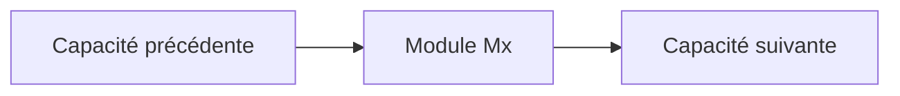
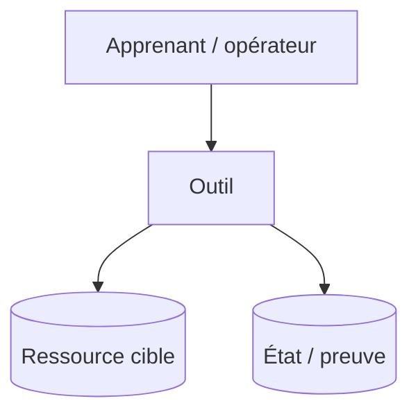

# Cours Mx — <Capacité professionnelle>

**Durée de lecture :** <durée>  
**Piste :** `[CORE]` / `[AZURE]` / `[AWS]` / `[GCP]`  
**Prérequis :** <checkpoint observable>

## Scénario professionnel

<Acteur, situation, tâche à accomplir, risque et valeur attendue.>

## Objectifs mesurables

À l’issue de ce module, vous serez capable de :

- <verbe observable + objet + condition>;
- <verbe observable + objet + condition>;
- <preuve finale attendue>.

## Position dans le fil rouge

## Modèle mental

<Expliquer le concept avec un modèle simple avant la syntaxe.>

### Vocabulaire FR/EN

| Terme officiel | Explication dans ce cours |
|---|---|
| <English term> | <explication française> |

## Concepts indispensables

### <Concept 1>

<Pourquoi il existe, fonctionnement, contraintes et erreur fréquente.>

### <Concept 2>

<Pourquoi il existe, fonctionnement, contraintes et erreur fréquente.>

## Architecture et flux

Décrire chaque nœud et chaque flux. Ne pas transmettre une information uniquement par couleur ou logo.

## Décisions d’architecture

| Décision | Choix du lab | Alternative | Compromis |
|---|---|---|---|
| <décision> | <choix> | <alternative> | <forces/limites> |

## Training versus Production

| Dimension | Training | Production |
|---|---|---|
| Identité | <simplification sûre> | <cible> |
| Secrets | <stockage local protégé> | <secret manager/rotation> |
| State | <cible du lab> | <backend sécurisé> |
| Coût | <limite> | <gouvernance> |
| Exploitation | <preuve manuelle> | <automatisation/monitoring> |

## Sécurité et coûts

- **Secret manipulé :** <oui/non et garde-fou>;
- **Privilège minimal :** <rôle requis>;
- **Ressource facturable :** <type et borne>;
- **Cleanup :** <ce qui devra être supprimé ou conservé>.

## Préparation au lab

Avant de continuer, l’apprenant doit pouvoir expliquer :

1. <question sur le modèle mental>;
2. <question sur le choix d’architecture>;
3. <question sur le risque sécurité/coût>.

## Synthèse

- <décision essentielle>;
- <commande ou concept essentiel>;
- <preuve qui sera produite dans le lab>.

## Références officielles

- <documentation produit officielle, version ou date de consultation>;
- <référence provider/CLI officielle>.
