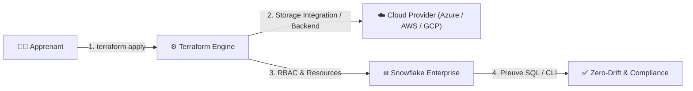

# 🧪 Lab Mx — <Titre Métier Actionnable>

| Élément | Valeur |
|---|---|
| **Durée** | <45 à 90 minutes, troubleshooting inclus> |
| **Piste** | `[CORE]` / `[AZURE]` / `[AWS]` / `[GCP]` |
| **Workspace** | `labs/mXX-<name>/` |
| **Coût Estimé** | < $0.05 (Warehouse X-SMALL auto-suspendu) |
| **Certifications** | HashiCorp Terraform Associate · Snowflake SnowPro · Azure/AWS/GCP |
| **Cleanup** | <Obligatoire / Conservation pour module suivant> |

---

## 🎯 1. Mission Métier & User Story

> **En tant que :** <Rôle d'ingénierie : Cloud Data Engineer / DevOps Platform Engineer>  
> **Je veux :** <Automatiser et sécuriser tel composant de la plateforme Snowflake>  
> **Afin de :** <Garantir la conformité de production, l'auditabilité et le zéro dérive manuelle>

---

## 🏗️ 2. Architecture & Modèle Mental



---

## 🎯 3. Objectifs Pédagogiques Vérifiables

- ✅ <Objectif 1 : verbe d'action + ressource créée>;
- ✅ <Objectif 2 : validation et preuve fonctionnelle>;
- ✅ <Objectif 3 : incident diagnostiqué et résolu>;
- ✅ <Objectif 4 : challenge autonome complété sans la solution>.

---

## 🚀 4. Pre-Flight Diagnostic (Vérification Initiale)

Assurez-vous que la session est initialisée et que le workspace est propre :

<details open>
<summary>🪟 <b>Windows (PowerShell)</b></summary>

```powershell
cd "$HOME\Data2AI-Labs\data-platform"
.\scripts\Learner-Login.ps1 -LearnerPrefix <PREFIXE>
.\scripts\Reset-Lab.ps1 -LearnerPrefix <PREFIXE> -Lab Mxx
cd labs\mxx-<name>
..\..\scripts\Test-TerraformReady.ps1
```
</details>

<details>
<summary>🐧 <b>Linux/macOS (Bash)</b></summary>

```bash
cd "$HOME/Data2AI-Labs/data-platform"
./scripts/learner-login.sh --learner-prefix <PREFIXE>
./scripts/reset-lab.sh --learner-prefix <PREFIXE> --lab Mxx
cd labs/mxx-<name>
../../scripts/test-terraform-ready.sh
```
</details>

✅ **Checkpoint 0 :** La commande affiche `Toolchain: READY`, `Snowflake Connection: READY`, `Workspace: CLEAN`.

---

## 📝 5. Étapes d'Implémentation Pas-à-Pas (80% Hands-On)

### 📝 Étape 5.1 — Déclaration des Entrées & Contraintes (`variables.tf`)

**Objectif :** Définir les variables d'entrée avec des règles de validation strictes.

Ouvrez `variables.tf` et ajoutez le bloc de validation :

```hcl
variable "<variable_name>" {
  type        = string
  description = "<Description précise>"
  validation {
    condition     = <expression_booléenne>
    error_message = "<Message d'erreur guidant la correction>"
  }
}
```

*Explication de l'architecture :*
1. `<attribut>` : Expliquer pourquoi cette option est nécessaire.
2. `validation` : Empêche les déploiements hors standard dès la phase de `plan`.

---

### 📝 Étape 5.2 — Déclaration des Ressources Cibles (`main.tf`)

**Objectif :** Écrire la configuration HCL pour instancier la ressource sur Snowflake / Cloud.

<details open>
<summary>🔵 <b>Implémentation Standard (Azure / Snowflake)</b></summary>

```hcl
resource "snowflake_<resource_type>" "<resource_name>" {
  name    = local.<computed_name>
  comment = "Managed by Terraform for ${var.learner_prefix}"
  # Attributs FinOps obligatoires
}
```
</details>

<details>
<summary>🟠 <b>Variante AWS (si parcours AWS)</b></summary>

```hcl
# Ressource équivalente AWS (ex: aws_s3_bucket, aws_iam_role)
```
</details>

<details>
<summary>🟢 <b>Variante GCP (si parcours GCP)</b></summary>

```hcl
# Ressource équivalente GCP (ex: google_storage_bucket)
```
</details>

---

### 📝 Étape 5.3 — Formatage, Initialisation & Validation Statique

```powershell
terraform fmt
terraform validate
```

<details>
<summary>📋 <b>Sortie console attendue</b></summary>

```text
Success! The configuration is valid.
```
</details>

---

### 📝 Étape 5.4 — Planification & Décryptage Différentiel

Générez le plan spéculatif :

```powershell
terraform plan -out "mxx.tfplan"
```

> 🔍 **Grille de lecture du Plan :**
> - `+` Vert : Création nette de ressource.
> - `~` Jaune : Modification in-place sans perte de données.
> - `-` Rouge : Destruction pure.
> - `-/+` Rouge/Vert : Remplacement destructif (*destroy then create*). **Attention requise !**

---

### 📝 Étape 5.5 — Déploiement Approuvé & Preuve SQL / CLI

Appliquez le plan :

```powershell
terraform apply "mxx.tfplan"
```

Produisez la **preuve fonctionnelle indiscutable** en interrogeant Snowflake :

```powershell
snow sql -q "SHOW <OBJECTS> LIKE '<PATTERN>';" -c training
```

<details>
<summary>📊 <b>Sortie attendue (Preuve)</b></summary>

```text
+-------------------+---------+-----------------------+
| name              | state   | comment               |
|-------------------+---------+-----------------------|
| APP01_MXX_...     | STARTED | Managed by Terraform  |
+-------------------+---------+-----------------------+
```
</details>

---

### 🌐 Étape 5.6 — Vérification Graphique via les Consoles Web

L'ingénierie moderne combine automatisation au terminal et contrôle visuel dans les interfaces de gestion :

#### ❄️ Console Snowflake Snowsight (`https://app.snowflake.com`)
1. Connectez-vous avec vos identifiants apprenant (`<PREFIXE_APPRENANT>` / mot de passe ou PAT).
2. Vérifiez le rôle actif en haut à droite (ex: `SYSADMIN`).
3. Naviguez vers l'objet créé (*Data > Databases* ou *Admin > Warehouses*).
4. Vérifiez que la ressource apparaît exactement avec la configuration déclarée dans Terraform (ex: Warehouse *Suspended*, taille *X-Small*).

#### 🔵 Portail Microsoft Azure (`https://portal.azure.com`)
*(Selon le module : M02 State, M09 Ingestion, M10 Secrets)*
1. Connectez-vous avec votre compte Azure de formation.
2. Naviguez vers votre groupe de ressources :
   - *Pour M02* : Ouvrez le compte de stockage > Conteneurs > `tfstate` > vérifier le fichier `.tfstate` et le bail (*Lease status*).
   - *Pour M09* : Ouvrez ADLS Gen2 > Conteneur de données > vérifier les fichiers Parquet.
   - *Pour M10* : Ouvrez Azure Key Vault > Secrets > vérifier la présence de la clé RSA privée.

#### 🚀 Console Azure DevOps (`https://dev.azure.com`)
*(Pour M07 CI/CD et M12 Capstone)*
1. Ouvrez le projet Azure DevOps > *Pipelines*.
2. Ouvrez la dernière exécution du pipeline ou la Pull Request en cours.
3. Vérifiez les étapes : `Validate` (vert), `Plan` (rapport lisible), et **cliquez sur "Approve" sur l'Environment Gate** pour autoriser le déploiement en PROD.

---

## 🐛 6. Incident Contrôlé (*Chaos Engineering Lab*)

*Pour devenir un ingénieur chevronné, apprenez à diagnostiquer une panne réelle de production provoquée par une action manuelle.*

### Symptôme & Injection de Dérive Manuelle (via Snowsight UI)
1. Ouvrez **Snowflake Snowsight**, sélectionnez votre ressource (ex: Warehouse ou Database) et cliquez sur **Edit** (ou exécutez un `ALTER` direct dans une worksheet).
2. Modifiez un paramètre géré par Terraform (ex: passez la taille à `Small` ou modifiez le commentaire à `'Modifié manuellement dans Snowsight'`).
3. Revenez dans votre terminal et lancez `terraform plan`.

### Diagnostic & Observation
Observez comment Terraform compare l'état réel et le fichier `.tfstate` pour détecter la dérive (*drift*) :
```text
~ comment = "Modifié manuellement dans Snowsight" -> "Managed by Terraform for APP01"
```

### Remédiation
Exécutez `terraform apply` pour réaligner immédiatement l'infrastructure réelle sur la vérité du code versionné, sans toucher aux autres composants.

---

## 🤖 7. Validation Automatisée (*Check My Progress*)

Validez votre avancement avec le moteur d'auto-évaluation du cours :

```powershell
.\scripts\SelfPacedLab.ps1 -Module <ModuleNumber> -All -Report
```

<details>
<summary>✅ <b>Exemple de Rapport de Validation</b></summary>

```text
[PASS] T1 versions.tf and provider pinned correctly
[PASS] T2 Variables and naming conventions validated
[PASS] T3 Resource configured with FinOps rules
[PASS] T4 Functional proof verified in Snowflake
[PASS] T5 Idempotent plan (0 to add, 0 to change, 0 to destroy)
Result: 5/5 Tasks Passed.
Report written to: student-track/_reports/module-XX-APP01.md
```
</details>

---

## 🏆 8. Défi Autonome (*Unguided Challenge*)

> **Scénario :** <Nouvelle demande client / contrainte de sécurité à implémenter>  
> **Contraintes :**  
> - <Contrainte 1 : pas de secrets en dur>;  
> - <Contrainte 2 : zéro dérive au second plan>;  
> - Ne consultez pas le dossier `solution/` avant d'avoir atteint le score de 100%.

| Critère d'Évaluation | Points |
|---|---:|
| Syntaxe HCL et respect des standards | 30 pts |
| Preuve d'exécution fonctionnelle | 30 pts |
| Idempotence (`0 to add, 0 to change, 0 to destroy`) | 20 pts |
| Respect des budgets FinOps & Sécurité | 20 pts |
| **Total** | **100 pts** |

---

## 🧹 9. Nettoyage Contrôlé (*FinOps Teardown*)

Pour éviter toute consommation inutile de crédits :

```powershell
terraform destroy -auto-approve
```

Vérifiez que la ressource a bien disparu :
```powershell
snow sql -q "SHOW <OBJECTS> LIKE '<PATTERN>';" -c training
```

✅ **Checkpoint Final :** `0 rows returned`.
