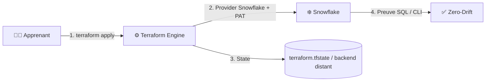

# 🧪 Lab Mx — <Titre Métier Actionnable>

| Élément | Valeur |
|---|---|
| **Durée** | <45 à 90 minutes, troubleshooting inclus> |
| **Piste** | `[CORE]` |
| **Workspace** | `labs/mXX-<name>/` |
| **Coût Estimé** | < $0.05 (Warehouse X-SMALL auto-suspendu) |
| **Certifications** | HashiCorp Terraform Associate · Snowflake SnowPro |
| **Cleanup** | <Obligatoire / Conservation pour module suivant> |

---

## 🎯 1. Mission Métier & User Story

> **En tant que :** <Rôle : Data Engineer / BI Engineer / Data Analyst / Business Developer>
> **Je veux :** <Automatiser et vérifier un objet Snowflake>
> **Afin de :** <Comprendre et prouver le workflow Terraform sans dépendre d'Azure ou de programmation>

---

## 🏗️ 2. Architecture & Modèle Mental



---

## 🎯 3. Objectifs Pédagogiques Vérifiables

- ✅ <Objectif 1 : verbe d'action + ressource créée>;
- ✅ <Objectif 2 : validation et preuve fonctionnelle>;
- ✅ <Objectif 3 : incident diagnostiqué et résolu>;
- ✅ <Objectif 4 : challenge autonome complété sans la solution>.

---

## 🚀 4. Pre-Flight Diagnostic (Vérification Initiale)

Assurez-vous que la session est initialisée et que le workspace est propre :

**Windows (PowerShell)**

```powershell
cd "$HOME\Data2AI-Labs\data-platform"
.\scripts\New-SnowflakeConnection.ps1
.\scripts\Reset-Lab.ps1 -LearnerPrefix <PREFIXE> -Lab Mxx
cd labs\mxx-<name>
.\..\..\scripts\Test-TerraformReady.ps1
```

**Linux/macOS (Bash)**

```bash
cd "$HOME/Data2AI-Labs/data-platform"
./scripts/new-snowflake-connection.sh
./scripts/reset-lab.sh --learner-prefix <PREFIXE> --lab Mxx
cd labs/mxx-<name>
../../scripts/test-terraform-ready.sh
```

✅ **Checkpoint 0 :** La commande affiche `Toolchain: READY`, `Snowflake Connection: READY`, `Workspace: CLEAN`.

---

## 📝 5. Étapes d'Implémentation Pas-à-Pas

### 📝 Étape 5.1 — Déclaration des Entrées & Contraintes (`variables.tf`)

**Objectif :** Définir les variables d'entrée avec des règles de validation strictes.

Ouvrez `variables.tf` et ajoutez le bloc de validation :

```hcl
variable "<variable_name>" {
  type        = string
  description = "<Description précise>"
  validation {
    condition     = <expression_booléenne>
    error_message = "<Message d'erreur guidant la correction>"
  }
}
```

*Explication de l'architecture :*
1. `<attribut>` : Expliquer pourquoi cette option est nécessaire.
2. `validation` : Empêche les déploiements hors standard dès la phase de `plan`.

---

### 📝 Étape 5.2 — Déclaration des Ressources Cibles (`main.tf`)

**Objectif :** Écrire la configuration HCL pour instancier la ressource Snowflake.

```hcl
resource "snowflake_<resource_type>" "<resource_name>" {
  name    = local.<computed_name>
  comment = "Managed by Terraform for ${var.learner_prefix}"
  # Attributs FinOps obligatoires
}
```

---

### 📝 Étape 5.3 — Formatage, Initialisation & Validation Statique

```powershell
terraform fmt
terraform validate
```

**Sortie console attendue :**

```text
Success! The configuration is valid.
```

---

### 📝 Étape 5.4 — Planification & Décryptage Différentiel

Générez le plan spéculatif :

```powershell
terraform plan -out "mxx.tfplan"
```

> 🔍 **Grille de lecture du Plan :**
> - `+` Vert : Création nette de ressource.
> - `~` Jaune : Modification in-place sans perte de données.
> - `-` Rouge : Destruction pure.
> - `-/+` Rouge/Vert : Remplacement destructif (*destroy then create*). **Attention requise !**

---

### 📝 Étape 5.5 — Déploiement Approuvé & Preuve SQL / CLI

Appliquez le plan :

```powershell
terraform apply "mxx.tfplan"
```

Produisez la **preuve fonctionnelle indiscutable** en interrogeant Snowflake :

```powershell
snow sql -q "SHOW <OBJECTS> LIKE '<PATTERN>';" -c training
```

**Sortie attendue (Preuve) :**

```text
+-------------------+---------+-----------------------+
| name              | state   | comment               |
|-------------------+---------+-----------------------|
| APP01_MXX_...     | STARTED | Managed by Terraform  |
+-------------------+---------+-----------------------+
```

---

### 🌐 Étape 5.6 — Vérification Graphique via Snowsight

1. Connectez-vous à `https://app.snowflake.com` avec vos identifiants apprenant.
2. Vérifiez le rôle actif en haut à droite (ex: `SYSADMIN`).
3. Naviguez vers l'objet créé (*Data > Databases* ou *Admin > Warehouses*).
4. Vérifiez que la ressource apparaît exactement avec la configuration déclarée dans Terraform.

---

## 🐛 6. Incident Contrôlé (*Chaos Engineering Lab*)

*Pour devenir autonome, apprenez à diagnostiquer une dérive provoquée par une action manuelle.*

### Symptôme & Injection de Dérive Manuelle (via Snowsight UI)

1. Ouvrez **Snowflake Snowsight**, sélectionnez votre ressource et cliquez sur **Edit** (ou exécutez un `ALTER` direct dans une worksheet).
2. Modifiez un paramètre géré par Terraform (ex: passez la taille à `Small` ou modifiez le commentaire à `'Modifié manuellement dans Snowsight'`).
3. Revenez dans votre terminal et lancez `terraform plan`.

### Diagnostic & Observation

Observez comment Terraform compare l'état réel et le fichier `.tfstate` pour détecter la dérive (*drift*) :

```text
~ comment = "Modifié manuellement dans Snowsight" -> "Managed by Terraform for APP01"
```

### Remédiation

Exécutez `terraform apply` pour réaligner immédiatement l'infrastructure réelle sur la vérité du code versionné, sans toucher aux autres composants.

---

## 🤖 7. Validation Automatisée (*Check My Progress*)

Validez votre avancement avec le moteur d'auto-évaluation du cours :

```powershell
.\scripts\SelfPacedLab.ps1 -Module <ModuleNumber> -All -Report
```

**Exemple de Rapport de Validation :**

```text
[PASS] T1 versions.tf and provider pinned correctly
[PASS] T2 Variables and naming conventions validated
[PASS] T3 Resource configured with FinOps rules
[PASS] T4 Functional proof verified in Snowflake
[PASS] T5 Idempotent plan (0 to add, 0 to change, 0 to destroy)
Result: 5/5 Tasks Passed.
Report written to: student-track/_reports/module-XX-APP01.md
```

---

## 🏆 8. Défi Autonome (*Unguided Challenge*)

> **Scénario :** <Nouvelle demande client / contrainte de sécurité à implémenter>
> **Contraintes :**
> - <Contrainte 1 : pas de secrets en dur>;
> - <Contrainte 2 : zéro dérive au second plan>;
> - Ne consultez pas le dossier `solution/` avant d'avoir atteint le score de 100%.

| Critère d'Évaluation | Points |
|---|---|---:|
| Syntaxe HCL et respect des standards | 30 pts |
| Preuve d'exécution fonctionnelle | 30 pts |
| Idempotence (`0 to add, 0 to change, 0 to destroy`) | 20 pts |
| Respect des budgets FinOps & Sécurité | 20 pts |
| **Total** | **100 pts** |

---

## 🧹 9. Nettoyage Contrôlé (*FinOps Teardown*)

Pour éviter toute consommation inutile de crédits :

```powershell
terraform destroy -auto-approve
```

Vérifiez que la ressource a bien disparu :

```powershell
snow sql -q "SHOW <OBJECTS> LIKE '<PATTERN>';" -c training
```

✅ **Checkpoint Final :** `0 rows returned`.
