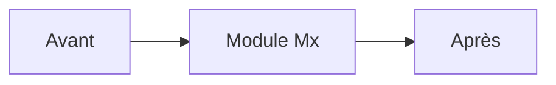
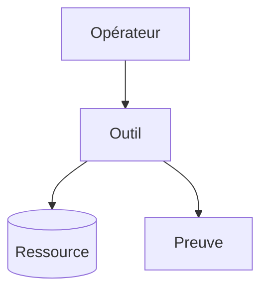

# Slides Mx — <Capacité professionnelle>

> Durée cible de présentation : 10 à 15 minutes avant le lab.

---

## Mission du module

- **Acteur :** <persona>;
- **Problème :** <risque concret>;
- **Résultat :** <preuve observable>.

---

## Où sommes-nous ?

---

## Modèle mental

<Une idée principale, une analogie utile et une limite de l’analogie.>

---

## Architecture

Ajouter une légende textuelle. Les logos officiels ne sont utilisés que si leur source et leurs droits figurent dans le registre d’attribution.

---

## Décision d’architecture

| Choix | Pourquoi | Compromis |
|---|---|---|
| <choix> | <bénéfice> | <limite> |

---

## Training versus Production

| Training | Production |
|---|---|
| <simplification sûre> | <cible industrielle> |

---

## Démonstration courte

1. <action visible>;
2. <résultat attendu>;
3. <ce que l’apprenant construira lui-même>.

Ne pas dérouler le lab complet et ne pas afficher la solution finale.

---

## Sécurité et coût

- **Identité/privilège :** <règle>;
- **Secret :** <garde-fou>;
- **Coût :** <borne>;
- **Cleanup :** <portée>.

---

## Checkpoint final

- <preuve Terraform>;
- <preuve Snowflake/CLI/dbt>;
- <critère d’idempotence>;
- <critère de sécurité>.

---

## Votre prochaine action

Créez `<premier dossier ou fichier>` dans `<workspace>` et exécutez le préflight du lab.
