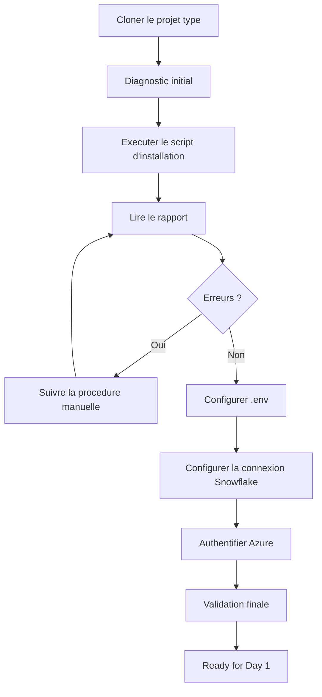

# Jour 0 — Preparer votre environnement

**Duree totale : 1 h 30**

**Resultat final : `Ready for Day 1`**

> **Contexte GlobalBank :** Le Jour 0 est la preparation. Le lendemain, on attaque le vrai sujet :
> reconstruire la plateforme de donnees en tant que code.

Bienvenue dans le point de depart de la formation. Le Jour 0 est **automatise** : vous clonez le projet type, executez les scripts qu'il contient, puis comprenez ce qu'ils ont fait. Aucune ressource Cloud n'est creee.

## Les 3 Regles d'Or (a retenir des demain)

> **Regle 1 :** Jamais une ligne de Terraform avant d'avoir clique le meme objet dans Snowsight.
>
> **Regle 2 :** Jamais de `terraform destroy` sans plan prealable ni confirmation.
>
> **Regle 3 :** Jamais de secret dans Git, les captures ou les rapports.

## Deux chemins selon votre poste

| Chemin | Quand | Duree estimee |
|---|---|---|
| **A — VM préconfigurée** (recommandé) | Le formateur a provisionné une VM Windows pour vous via Terraform | ~15 min |
| **B — Installation locale** | Vous utilisez votre propre poste (Windows/Linux/macOS) | ~1 h 30 |

> `[NOTE]` Si vous recevez une IP RDP et des identifiants `apprenantXX` / `SnowflakeLearner2026@XX`,
> vous êtes sur le **Chemin A**. Sinon, suivez le **Chemin B**.

## Votre mission

A la fin du Jour 0, vous devez disposer de :

- le **projet type** clone sous `$HOME/Data2AI-Labs/data-platform` — c'est votre racine de travail pour toute la formation;
- Git, Terraform, Snowflake CLI, Azure CLI et dbt disponibles dans le terminal;
- une connexion Snowflake `training` testee via PAT saisi de facon securisee;
- un rapport de validation sans erreur ni secret.

## Le projet type est votre racine

Le projet type `data-platform-starter` contient :

- les **scripts** d'installation, de connexion et de validation;
- la **structure** de dossiers (`labs/`, `modules/`, `docs/`);
- la **gouvernance** (`.gitignore`, `.tflint.hcl`, `azure-pipelines.yml`, `CODEOWNERS`).

Il **ne contient pas** de fichiers `.tf` de ressource. Vous les creerez au fil des modules.



## Progression obligatoire

Le lab est un seul module avec 7 etapes :

| Etape | Temps | Action | Preuve pour continuer |
|---:|---:|---|---|
| 1 | 5 min | Cloner le projet type | Clone present, scripts visibles |
| 2 | 20 min | Installer et verifier les outils | `Toolchain status: READY` |
| 3 | 10 min | Configurer `.env` | `git check-ignore .env` retourne `.env` |
| 4 | 10 min | Authentifier Azure + recuperer les secrets KV | `az account show` affiche la souscription + `secrets/` crees |
| 5 | 20 min | Configurer la connexion Snowflake | `snow sql -q 'SELECT 1' -c training` retourne un resultat |
| 6 | 10 min | Inspecter la structure du projet type | Dossiers `labs/`, `modules/`, `docs/` presents |
| 7 | 10 min | Validation finale | `Toolchain status: READY` + Snowflake + Azure |
| **Total** | **1 h 30** | | |

> Le lab detaille est dans [module-00-setup/lab.md](module-00-setup/lab.md).

## Avant de commencer

### 1. Votre systeme

- [ ] **Windows 10/11** avec PowerShell 5.1 ou 7;
- [ ] **Linux** avec Bash;
- [ ] **macOS** avec Bash ou Zsh.

> `[NOTE]` **Python 3.12** est la version requise par la politique de versions.
> Si votre système a une version plus récente (3.13, 3.14), le script `Install-Tools.ps1`
> installe automatiquement Python 3.12 en parallèle via `winget` et l'utilise pour
> créer l'environnement virtuel. Vous n'avez rien à faire manuellement.

### 2. Votre URL de projet type

Le depot du projet type est : `https://github.com/msellamiTN/data-platform-starter.git`

> `[IMPORTANT] Windows` : utilisez `$HOME` entre guillemets, pas `~` :
> ```powershell
> git clone https://github.com/msellamiTN/data-platform-starter.git "$HOME\Data2AI-Labs\data-platform"
> ```

> `[WINDOWS]` Si l'execution de scripts `.ps1` est bloquee, autorisez les scripts locaux :
> ```powershell
> Set-ExecutionPolicy -Scope CurrentUser -ExecutionPolicy RemoteSigned
> ```
> `RemoteSigned` est le parametre standard pour un poste de formation.

### 3. Vos identifiants Snowflake

Le formateur a pre-rempli le fichier `.env.example` du projet type avec :

- l'identifiant d'organisation Snowflake;
- l'identifiant de compte Snowflake;
- le nom d'utilisateur Snowflake;
- le role (generalement `SYSADMIN`);
- les parametres Azure et Azure DevOps.

Vous copiez `.env.example` en `.env`, puis vous ajoutez uniquement :

- votre **prefixe apprenant** unique (3 a 5 lettres);
- votre **PAT** temporaire.

Le formateur vous fournit egalement un **username + password Snowflake** individuel
pour acceder a l'interface web (https://app.snowflake.com).

> `[NOTE]` Le PAT est utilise par la CLI et Terraform. Le password est utilise pour
> l'interface web uniquement. Les deux sont individuels.

### 4. Vos identifiants Azure (service principal partage)

Le formateur vous fournit un fichier `secrets/shared-sp.txt` contenant les identifiants
d'un **service principal partage** (app ID, secret, tenant, subscription).

> `[SECURITY]` Ce fichier est gitignored. Ne le commitez jamais.
> Ne le partagez pas en dehors de la formation.

Ce service principal **contourne l'authentification MFA** d'Azure.
Vous l'utilisez via le script `Learner-Login` (voir Etape 4 du lab).

L'isolation entre apprenants se fait via votre `LEARNER_PREFIX` :
vos ressources Snowflake et votre state Terraform sont uniques.

## Chemin A — VM préconfigurée (recommandé)

Si le formateur a provisionné une VM Windows pour vous (via le module Terraform
`08-learner-vms`), les outils sont **déjà installés**, le dépôt est **déjà cloné**,
et un script de première connexion se lance automatiquement au login.

### Connexion RDP

1. Ouvrez le client RDP (Connexion Bureau à distance).
2. Saisissez l'IP RDP fournie par le formateur.
3. Connectez-vous avec vos **identifiants unifiés** :
   - Utilisateur : `apprenantXX` (ex. `apprenant01`)
   - Mot de passe : `SnowflakeLearner2026@XX` (ex. `SnowflakeLearner2026@01`)

> `[NOTE]` Ces identifiants sont les mêmes que pour Snowflake — un seul couple à retenir.

### Première connexion

Au premier login, le script de première connexion se lance automatiquement et :

1. Exécute `Learner-Login.ps1` (authentification AAD → Key Vault → Service Principal)
2. Exécute `Test-VMReadiness.ps1` (vérification des outils)
3. Ouvre VS Code sur le dépôt cloné (`C:\Data2AI-Labs\data-platform`)

Si le script ne se lance pas automatiquement, exécutez-le manuellement :

```powershell
cd C:\Data2AI-Labs\data-platform
.\scripts\first-logon.ps1
```

### Vérification manuelle (si besoin)

Si vous devez relancer la vérification :

```powershell
cd C:\Data2AI-Labs\data-platform
.\scripts\Test-VMReadiness.ps1 -LearnerPrefix APPxx
```

> Remplacez `APPxx` par le préfixe qui vous a été assigné (APP01, APP02, etc.).

**Résultat attendu :**

```text
Status: READY
Ready for Day 1
```

Si un outil est en `FAIL` (catégorie `learner-tool`) :

```powershell
.\scripts\Install-Tools.ps1 -InstallRoot C:\data2ai -Force
```

Puis relancez le préflight.

Si une connectivité est en `FAIL` :

| Catégorie | Cause probable | Action |
|---|---|---|
| `credential` (Snowflake) | PAT ou connexion Snowflake invalide | `.\scripts\New-SnowflakeConnection.ps1` |
| `credential` (Azure) | Service principal non configuré | `.\scripts\Learner-Login.ps1 -LearnerPrefix APPxx` |
| `learner-config` | `.env` ou `.gitignore` incorrect | Corrigez `.env` |
| `instructor-side` | RBAC Blob/Key Vault manquant | **Contactez le formateur** (problème infrastructure) |

### Rapport

Le préflight écrit un rapport consolidé dans `reports/vm-readiness.md` et `reports/vm-readiness.json`.
Ce rapport contient : le nom de la VM, le préfixe apprenant, le statut par phase, la classification
des échecs et l'action recommandée. **Aucun secret n'y apparaît.**

> `[IMPORTANT]` Le préflight ne remplace pas la validation finale.
> Même si le préflight affiche `READY`, exécutez l'étape 7 du lab (`Test-LabConnectivity.ps1`)
> pour confirmer la connectivité complète.

---

## Chemin B — Installation locale

Si vous utilisez votre propre poste, suivez les étapes ci-dessous. Le lab détaillé est dans
[module-00-setup/lab.md](module-00-setup/lab.md).

## Regles de securite

1. Le PAT est saisi via une invite masquee — jamais affiche, jamais colle dans une commande.
2. Aucun PAT, mot de passe ou cle privee n'est place dans un fichier du depot.
3. Le script de connexion efface le token de l'environnement des que possible.
4. N'ajoutez pas `ACCOUNTADMIN` pour resoudre une erreur de privilege.
5. Ne créez pas de network policy, utilisateur global ou ressource Cloud pendant ce module.
6. Arretez-vous si `git check-ignore .env` ne retourne pas `.env`.

## Formateur — Preparation

> Si vous etes formateur, consultez le [guide de preparation](instructor-setup.md)
> avant la formation. Il decrit la creation du SP partage, des utilisateurs Snowflake,
> des PAT, et la configuration d'Azure DevOps.

## Besoin d'aide ?

Utilisez cette sequence, sans recommencer tout le module :

1. relisez le dernier resultat attendu;
2. confirmez votre repertoire courant (`pwd`);
3. ouvrez le [guide de troubleshooting](module-00-setup/troubleshooting.md);
4. executez uniquement le diagnostic non destructif indique;
5. corrigez puis rejouez le dernier checkpoint.

## Critere de fin

Le Jour 0 est termine uniquement lorsque :

```text
Toolchain status: READY
Test-LabConnectivity.ps1 → Status: READY (0 FAIL)
```

et que la connexion Snowflake repond a `snow sql -q 'SELECT 1' -c training`.

## Preuves individuelles

Avant de passer au Jour 1, verifiez que vous pouvez cocher CHAQUE ligne :

- [ ] `terraform version` affiche 1.14.x
- [ ] `snow sql -q 'SELECT 1' -c training` retourne un resultat
- [ ] `git status` fonctionne dans le projet clone
- [ ] Votre prefixe apprenant est identifie (APP01 a APP11)
- [ ] Le fichier `.env` est present et gitignore
- [ ] VS Code ouvre le projet sans erreur

> Si `Blob write access` est en FAIL, c'est un probleme RBAC cote formateur.
> Le role `Storage Blob Data Contributor` doit etre attribue au SP avec
> l'**object ID** (pas l'appId). Voir le [troubleshooting](module-00-setup/troubleshooting.md) entree 15.

## Suite

Passez a [M1 — Premier deploiement Terraform Snowflake](../day-01/module-01-iac-workflow/lab.md). M1 vous fera creer chaque fichier Terraform depuis le projet type clone, en mode manuel pas a pas. **Chaque module possede son propre repertoire de travail** sous `labs/mXX-name/` (ex. `labs/m01-iac-workflow/` pour M1). Chaque lab est autonome, possede ses propres fichiers template (`provider.tf`, `versions.tf`, `variables.tf`) et commence par `Reset-Lab.ps1` pour un environnement propre.
