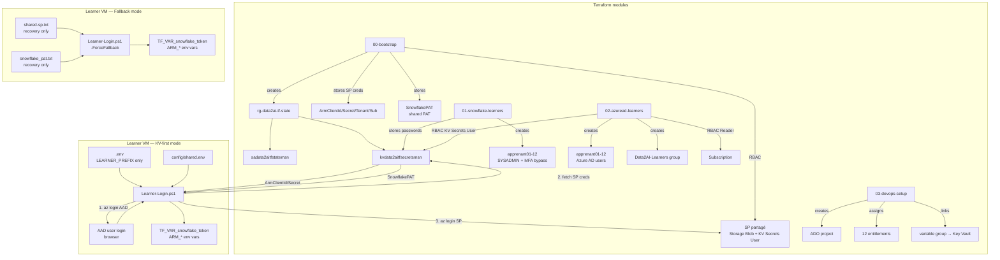
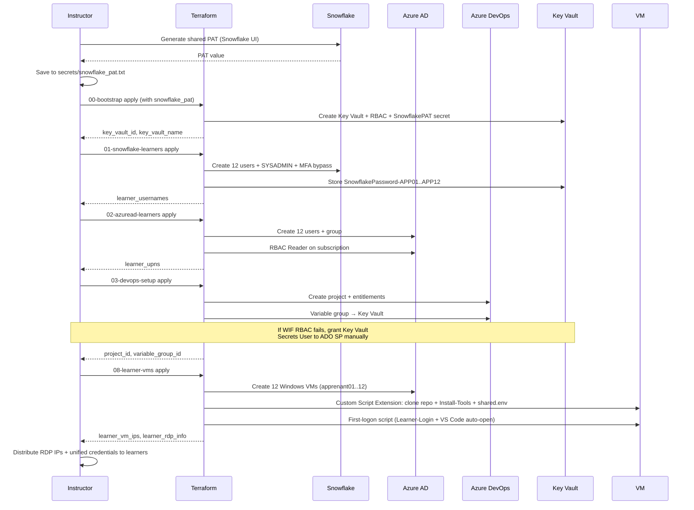
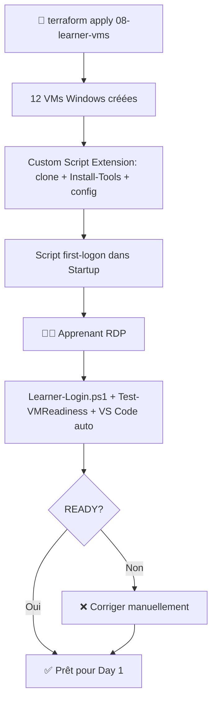

# Guide formateur — Préparation de l'environnement

> Ce document est destiné **uniquement au formateur**. Il décrit toutes les opérations
> administratives à effectuer **avant** le Jour 0 pour que les apprenants puissent
> démarrer sans friction.

**Retour au parcours :** [Jour 0 — Commencer ici](README.md)

## Vue d'ensemble

Le formateur prépare trois environnements à l'aide de **4 modules Terraform** et **1 script PowerShell** :

| Étape | Module / Script | Ressources créées |
|---|---|---|
| **Step 1** | `project/00-bootstrap` | Azure : Resource Group, Storage Account, Key Vault, RBAC, secrets (incl. PAT partagé) |
| **Step 2** | `project/01-snowflake-learners` | Snowflake : 12 utilisateurs, rôles SYSADMIN, MFA bypass, mots de passe → KV |
| **Step 3** | `project/02-azuread-learners` | Azure AD : 12 utilisateurs, groupe de sécurité, RBAC Reader |
| **Step 4** | `project/03-devops-setup` | Azure DevOps : projet, entitlements, variable group → Key Vault |
| **Step 5** | Distribution manuelle | Copier `secrets/shared-sp.txt` + `secrets/snowflake_pat.txt` sur les VMs apprenants. Distribuer individuellement `secrets/learner-azure-passwords.txt` et `secrets/learner-snowflake-passwords.txt` |

> `[IaC]` **Tout est Infrastructure as Code.** Les 4 modules Terraform sont versionnés,
> idempotents, et offrent un audit trail complet via Git + Terraform state.
>
> `[PAT]` **PAT partagé.** Tous les apprenants utilisent le même PAT Snowflake
> (utilisateur `DATA2AI`, rôle `SYSADMIN`). L'isolation se fait via `LEARNER_PREFIX`
> et les states Terraform séparés. Le PAT est stocké dans Key Vault sous le nom
> `SnowflakePAT` et distribué via `secrets/snowflake_pat.txt`.
> La génération de per-learner PATs via `Set-SnowflakePATs.ps1` (archivé dans `scripts/_archive/`) n'est plus nécessaire
> car la syntaxe `ALTER USER ... ADD PROGRAMMATIC_ACCESS_TOKEN` n'est pas supportée
> sur toutes les éditions Snowflake.

## 1. Préparer le service principal partagé (une seule fois)

### 1.1 — Créer le SP partagé

```powershell
$subscriptionId = "8c42d5b2-ab70-4051-ab0e-a96877557f6a"
$spName = "sp-data2ai-learners"

az ad sp create-for-rbac --name $spName --role Contributor --scopes /subscriptions/$subscriptionId
```

Sauvegarder la sortie dans `secrets/shared-sp.txt` :

```text
ARM_CLIENT_ID=<appId>
ARM_CLIENT_SECRET=<password>
ARM_TENANT_ID=<tenant>
ARM_SUBSCRIPTION_ID=8c42d5b2-ab70-4051-ab0e-a96877557f6a
```

Récupérer l'**object ID** du SP :

```powershell
# --id expects the appId (UUID from the create output), NOT the display name
$appId = "ab35eee0-5d09-4c4d-b41c-f536ce7dbdf0"
$spObjectId = az ad sp show --id $appId --query id -o tsv
Write-Host "SP object ID (for 00-bootstrap): $spObjectId"

# Alternative: query by display name
$spObjectId = az ad sp list --filter "displayName eq 'sp-data2ai-learners'" --query '[0].id' -o tsv
```

> `[IMPORTANT]` `az ad sp show --id` expects the **appId** (UUID), not the display name.
> Using the display name returns "Service principal doesn't exist".

> `[IMPORTANT]` Le SP a **deux identifiants distincts** :
> - **appId** (`ARM_CLIENT_ID`) : utilisé pour `az login --service-principal`.
> - **object ID** : utilisé pour les **attributions de rôles RBAC** dans `00-bootstrap`.

### 1.2 — Accorder les permissions API au SP

Le SP doit avoir les permissions Microsoft Graph suivantes pour `02-azuread-learners` :

- `User.ReadWrite.All` (ou `Directory.ReadWrite.All`)

```powershell
# Via le portail Azure : App registrations > sp-data2ai-learners > API permissions
# Ajouter Microsoft Graph > Application permissions > User.ReadWrite.All
# Puis : Grant admin consent
```

## 2. Step 1 — Exécuter `00-bootstrap`

```powershell
cd project/00-bootstrap

# If terraform.tfvars doesn't exist yet:
# Copy-Item terraform.tfvars.example terraform.tfvars

# If terraform.tfvars already exists, just edit it with updated SP credentials:
code terraform.tfvars
```

`terraform.tfvars` minimal :

```hcl
arm_subscription_id = "8c42d5b2-ab70-4051-ab0e-a96877557f6a"
arm_tenant_id       = "55fca982-2372-4352-8b7e-c28ac00ae8e3"
arm_client_id       = "<appId du SP partagé>"
arm_client_secret   = "<password du SP partagé>"

snowflake_organization = "ZVFXOZW"
snowflake_account      = "PM71247"
snowflake_user         = "DATA2AI"
snowflake_role         = "SYSADMIN"
snowflake_pat          = "<votre PAT DATA2AI partagé>"

state_blob_contributor_object_ids = ["<object ID du SP partagé>"]
wif_service_principal_object_id   = ""
snowflake_learner_prefixes        = ["APP01", "APP02", "APP03", "APP04", "APP05", "APP06", "APP07", "APP08", "APP09", "APP10", "APP11", "APP12"]
```

Exécuter :

```powershell
terraform init
terraform plan -out bootstrap.tfplan
terraform apply bootstrap.tfplan
```

Récupérer les outputs pour les modules suivants :

```powershell
terraform output -raw key_vault_id          # → pour 01-snowflake-learners
terraform output -raw key_vault_name        # → pour 03-devops-setup
terraform output -raw shared_env_snippet    # → pour config/shared.env
```

Générer `config/shared.env` (deux emplacements) :

```powershell
# Pour le starter template (commité dans le dépôt)
terraform output -raw shared_env_snippet > ../../templates/data-platform-starter/config/shared.env

# Pour les scripts au niveau racine (Learner-Login.ps1, etc.)
New-Item -ItemType Directory -Path ../../config -Force | Out-Null
terraform output -raw shared_env_snippet > ../../config/shared.env
```

> `[IMPORTANT]` Le fichier `config/shared.env` à la racine est nécessaire pour
> que les scripts (`Learner-Login.ps1`, etc.) puissent résoudre
> `KEY_VAULT_NAME` sans paramètre explicite.

> `[IMPORTANT]` La propagation RBAC peut prendre **jusqu'à 10 minutes**.

## 3. Step 2 — Exécuter `01-snowflake-learners`

Ce module crée les 12 utilisateurs Snowflake, accorde le rôle SYSADMIN,
définit le MFA bypass (240 min), et stocke les mots de passe web dans Key Vault.

```powershell
cd ../01-snowflake-learners
Copy-Item terraform.tfvars.example terraform.tfvars
code terraform.tfvars
```

`terraform.tfvars` :

```hcl
learner_count = 12
default_role  = "SYSADMIN"
mins_to_bypass_mfa = 240
must_change_password = false

snowflake_organization = "ZVFXOZW"
snowflake_account      = "PM71247"
snowflake_user         = "DATA2AI"
snowflake_role         = "ACCOUNTADMIN"
snowflake_token        = "<votre PAT ACCOUNTADMIN>"

key_vault_id       = "<output de 00-bootstrap>"
store_passwords_in_kv = true
```

Exécuter :

```powershell
terraform init
terraform plan -out snowflake-learners.tfplan
terraform apply snowflake-learners.tfplan
```

Vérifier :

```powershell
terraform output learner_usernames
terraform output role_grants
```

> `[MFA]` Le `mins_to_bypass_mfa = 240` expire après 4 heures.
> Pour rafraîchir, relancez `terraform apply` — il mettra à jour la valeur
> pour tous les utilisateurs de façon idempotente.

## 4. Step 3 — Exécuter `02-azuread-learners`

Ce module crée les 12 utilisateurs Azure AD, un groupe de sécurité,
et assigne le rôle RBAC Reader au groupe.

```powershell
cd ../02-azuread-learners
Copy-Item terraform.tfvars.example terraform.tfvars
code terraform.tfvars
```

`terraform.tfvars` :

```hcl
learner_count = 12
domain        = "mokhtarsellamigmail.onmicrosoft.com"
force_password_change = false
group_name    = "Data2AI-Learners"

subscription_id = "8c42d5b2-ab70-4051-ab0e-a96877557f6a"
rbac_role       = "Reader"
assign_rbac     = true
```

Exécuter :

```powershell
terraform init
terraform plan -out azuread-learners.tfplan
terraform apply azuread-learners.tfplan
```

Récupérer les UPNs pour `03-devops-setup` :

```powershell
terraform output -json learner_upns
```

## 5. Step 4 — Exécuter `03-devops-setup`

Ce module crée le projet Azure DevOps, assigne les apprenants (entitlements),
les ajoute au groupe Contributors, crée un service connection Azure (WIF),
et lie un variable group au Key Vault.

```powershell
cd ../03-devops-setup
Copy-Item terraform.tfvars.example terraform.tfvars
code terraform.tfvars
```

`terraform.tfvars` :

```hcl
project_name   = "terraform-snowflake"
learner_upns   = ["apprenant01@mokhtarsellamigmail.onmicrosoft.com", ...]  # depuis 02 output
license_type   = "express"

key_vault_name    = "kvdata2aitfsecretsmsn"
subscription_id   = "8c42d5b2-ab70-4051-ab0e-a96877557f6a"
subscription_name = "Azure subscription 1"
tenant_id         = "55fca982-2372-4352-8b7e-c28ac00ae8e3"
auth_scheme       = "WorkloadIdentityFederation"

variable_group_name  = "data-platform-secrets"
kv_secret_variables  = ["SnowflakePAT", "ArmClientSecret"]
```

Exécuter :

```powershell
terraform init
terraform plan -out devops-setup.tfplan
terraform apply devops-setup.tfplan
```

Vérifier :

```powershell
terraform output project_id
terraform output variable_group_id
```

> `[WIF]` **Si le `terraform apply` échoue sur le variable group avec
> `ForbiddenByRbac` ou `AADSTS70025`**, c'est que le service principal ADO
> créé automatiquement par la service connection n'a pas encore le RBAC
> `Key Vault Secrets User` sur le Key Vault. Procédure de remédiation :
>
> ```powershell
> # 1. Récupérer l'appId du SP ADO depuis le message d'erreur
> #    (ex: 7bd1c174-bd87-4930-bc66-13c4ad01cf91)
> # 2. Récupérer son object ID
> $spAppId = "<appId depuis l'erreur>"
> $spObjectId = (az ad sp show --id $spAppId --query id -o tsv)
>
> # 3. Lui accorder Key Vault Secrets User
> az role assignment create `
>   --role "Key Vault Secrets User" `
>   --scope "/subscriptions/8c42d5b2-ab70-4051-ab0e-a96877557f6a/resourceGroups/rg-data2ai-tf-state/providers/Microsoft.KeyVault/vaults/kvdata2aitfsecretsmsn" `
>   --assignee-object-id $spObjectId `
>   --assignee-principal-type ServicePrincipal
>
> # 4. Attendre ~30s pour la propagation RBAC, puis relancer
> terraform plan -out devops-setup.tfplan
> terraform apply devops-setup.tfplan
> ```
>
> Ce problème survient car le provider Azure DevOps crée la federated identity
> credential automatiquement, mais ne peut pas accorder le RBAC Key Vault
> (le SP ADO est créé dynamiquement et son object ID n'est pas connu à l'avance).

## 6. Step 5 — Stocker le PAT partagé dans Key Vault

> `[PAT]` **PAT partagé.** Tous les apprenants utilisent le même PAT Snowflake
> (utilisateur `DATA2AI`, rôle `SYSADMIN`). Ce PAT doit être généré depuis
> l'interface web Snowflake (Programmatic Access Tokens) avec une durée de
> validité suffisante (30 jours recommandés).
>
> La génération de per-learner PATs via `Set-SnowflakePATs.ps1` (archivé) n'est plus
> nécessaire car la syntaxe `ALTER USER ... ADD PROGRAMMATIC_ACCESS_TOKEN`
> n'est pas supportée sur toutes les éditions Snowflake.

### 6.1 — Générer le PAT depuis Snowflake UI

1. Se connecter à `https://app.snowflake.com` avec `DATA2AI` / `ACCOUNTADMIN`
2. Aller dans **Admin → Users → DATA2AI → Programmatic access tokens**
3. Créer un token nommé `training_pat` avec `DAYS_TO_EXPIRY = 30`
4. Copier la valeur du token

### 6.2 — Stocker le PAT dans le fichier local

```powershell
# Sauvegarder le PAT dans secrets/snowflake_pat.txt (gitignored)
$pat = "<valeur du PAT copiée depuis Snowflake UI>"
Set-Content -Path "secrets/snowflake_pat.txt" -Value $pat.Trim() -NoNewline
```

### 6.3 — Stocker le PAT dans Key Vault

Le module `00-bootstrap` crée déjà le secret `SnowflakePAT` dans Key Vault
à partir de la variable `snowflake_pat` du `terraform.tfvars`. Si vous avez
mis à jour le PAT après le bootstrap, mettez à jour le secret :

```powershell
$pat = (Get-Content "secrets/snowflake_pat.txt" -Raw).Trim()
az keyvault secret set --vault-name kvdata2aitfsecretsmsn --name SnowflakePAT --value $pat
```

Vérifier :

```powershell
az keyvault secret list --vault-name kvdata2aitfsecretsmsn --query "[?name=='SnowflakePAT'].name" -o tsv
```

**Expected :** `SnowflakePAT`

### 6.4 — Configurer la connexion Snowflake CLI `training`

Vérifier que `~/.snowflake/config.toml` contient :

```toml
[connections.training]
account = "ZVFXOZW-PM71247"
user = "DATA2AI"
host = "ZVFXOZW-PM71247.snowflakecomputing.com"
role = "SYSADMIN"
authenticator = "PROGRAMMATIC_ACCESS_TOKEN"
token_file_path = "D:\\Data2AI Academy\\Snowflake-terraform\\secrets\\snowflake_pat.txt"
```

Tester :

```powershell
snow sql -c training -q "SELECT CURRENT_USER(), CURRENT_ROLE(), CURRENT_ACCOUNT()"
```

**Expected :** `DATA2AI` / `SYSADMIN` / `HQ33884`

## 7. Step 6 — Autoriser les apprenants au Key Vault (KV-first)

> `[KV-FIRST]` **Modèle d'authentification KV-first.** Les apprenants
> n'ont **pas besoin** de fichiers `secrets/` distribués manuellement.
> Ils se connectent avec leur compte AAD, récupèrent tous les secrets
> depuis Key Vault, puis s'authentifient avec le SP partagé.

### 7.1 — Accorder Key Vault Secrets User au groupe learners

Cette étape est gérée par Terraform dans `02-azuread-learners` (variable
`grant_kv_access = true` et `key_vault_id = "..."`). Si vous devez le faire
manuellement :

```powershell
# Login avec un compte Owner (pas le SP)
az login

# Récupérer l'object ID du groupe Data2AI-Learners
$groupObjectId = (az ad group show --group "Data2AI-Learners" --query id -o tsv)

# Accorder Key Vault Secrets User
az role assignment create `
  --role "Key Vault Secrets User" `
  --scope "/subscriptions/8c42d5b2-ab70-4051-ab0e-a96877557f6a/resourceGroups/rg-data2ai-tf-state/providers/Microsoft.KeyVault/vaults/kvdata2aitfsecretsmsn" `
  --assignee-object-id $groupObjectId `
  --assignee-principal-type Group
```

### 7.2 — Vérifier que les secrets sont présents dans Key Vault

```powershell
az keyvault secret list --vault-name kvdata2aitfsecretsmsn --query "[].name" -o tsv | Sort-Object
```

**Expected :** au minimum `ArmClientId`, `ArmClientSecret`, `ArmTenantId`,
`ArmSubscriptionId`, `SnowflakePAT`, `SnowflakePassword-APP01` à `SnowflakePassword-APP12`.

### 7.3 — Flux d'authentification apprenant (KV-first)

```text
1. Apprenant lance: .\scripts\Learner-Login.ps1 -LearnerPrefix APP01
2. Login AAD interactif (navigateur, compte apprenant)
3. Fetch ArmClientId, ArmClientSecret, ArmTenantId, ArmSubscriptionId depuis KV
4. Fetch SnowflakePAT depuis KV
5. Login SP (pour Terraform provider)
6. Set ARM_* + TF_VAR_snowflake_token + LEARNER_PREFIX
7. Ready for labs
```

### 7.4 — Fallback local (recovery uniquement)

Si un apprenant n'a pas accès au Key Vault (RBAC non propagé, réseau bloqué,
compte AAD non configuré), il peut utiliser les fichiers locaux :

```powershell
.\scripts\Learner-Login.ps1 -LearnerPrefix APP01 -ForceFallback
```

Cette mode utilise `secrets/shared-sp.txt` et `secrets/snowflake_pat.txt`.
Le formateur peut distribuer ces fichiers en secours uniquement.

> `[SECURITY]` Les fichiers `secrets/` sont gitignored et ne doivent être
> distribués qu'en cas de secours. Le modèle KV-first est préférable car :
> - aucun secret n'est stocké sur les VMs apprenants
> - les secrets sont centralisés et rotatables dans Key Vault
> - l'accès est révocable via RBAC
> - l'audit trail est complet (Azure Activity Log)

## 8. Checklist formateur

### Azure (via `00-bootstrap`)

- [ ] SP `sp-data2ai-learners` créé avec rôle `Contributor`
- [ ] SP a les permissions API `User.ReadWrite.All` (Microsoft Graph)
- [ ] `secrets/shared-sp.txt` généré
- [ ] `project/00-bootstrap/terraform.tfvars` configuré
- [ ] `terraform apply` exécuté avec succès
- [ ] Resource Group, Storage Account, Key Vault créés
- [ ] RBAC `Storage Blob Data Contributor` + `Key Vault Secrets User` attribués au SP
- [ ] `config/shared.env` généré dans le starter ET à la racine du dépôt
- [ ] Secret `SnowflakePAT` créé dans Key Vault (valeur du PAT partagé)

### Snowflake (via `01-snowflake-learners`)

- [ ] `project/01-snowflake-learners/terraform.tfvars` configuré
- [ ] `terraform apply` exécuté avec succès
- [ ] 12 utilisateurs Snowflake créés (`apprenant01` à `apprenant12`)
- [ ] Rôle `SYSADMIN` accordé à chaque utilisateur
- [ ] MFA bypass configuré (240 min)
- [ ] Mots de passe web stockés dans Key Vault (`SnowflakePassword-APP01` etc.)

### Azure AD (via `02-azuread-learners`)

- [ ] `project/02-azuread-learners/terraform.tfvars` configuré
- [ ] `terraform apply` exécuté avec succès
- [ ] 12 utilisateurs Azure AD créés
- [ ] Groupe `Data2AI-Learners` créé avec les 12 membres
- [ ] Rôle `Reader` attribué au groupe sur la subscription
- [ ] Rôle `Key Vault Secrets User` attribué au groupe sur le Key Vault (KV-first)

### Azure DevOps (via `03-devops-setup`)

- [ ] `project/03-devops-setup/terraform.tfvars` configuré
- [ ] `terraform apply` exécuté avec succès
- [ ] Projet `terraform-snowflake` créé
- [ ] 12 entitlements assignés (license `express`)
- [ ] Apprenants ajoutés au groupe `Contributors`
- [ ] Service connection Azure créé (WIF)
- [ ] Variable group `data-platform-secrets` lié au Key Vault

### PAT partagé (via Snowflake UI + Key Vault)

- [ ] PAT généré depuis Snowflake UI (DATA2AI, ACCOUNTADMIN)
- [ ] `secrets/snowflake_pat.txt` créé avec la valeur du PAT
- [ ] `project/00-bootstrap/terraform.tfvars` — `snowflake_pat` renseigné
- [ ] Secret `SnowflakePAT` présent dans Key Vault
- [ ] Connexion Snowflake CLI `training` configurée et testée
- [ ] `snow sql -c training -q "SELECT CURRENT_USER()"` retourne `DATA2AI`

### Distribution (KV-first)

- [ ] Security Defaults Entra ID **désactivés** (voir section 12.0)
- [ ] Key Vault Secrets User accordé au groupe `Data2AI-Learners`
- [ ] Secrets `ArmClientId`, `ArmClientSecret`, `ArmTenantId`, `ArmSubscriptionId` présents dans KV
- [ ] Secret `ArmClientSecret` **valide et non expiré** (vérifier avec `az ad app credential list`)
- [ ] Secret `SnowflakePAT` présent dans Key Vault
- [ ] Secrets `SnowflakePassword-APP01` à `SnowflakePassword-APP12` présents dans KV
- [ ] SP a le role `Storage Blob Data Contributor` sur le storage account
- [ ] Apprenants peuvent s'authentifier via `Learner-Login.ps1` (mode KV-first)
- [ ] `az account show --query "user.name"` retourne l'appId du SP (pas l'utilisateur AAD)
- [ ] Fallback : `secrets/shared-sp.txt` + `secrets/snowflake_pat.txt` disponibles en secours
- [ ] `.env.example` : ligne `SNOWFLAKE_PRIVATE_KEY_FILE` commentée (Day 4+ uniquement)
- [ ] Identifiants AAD distribués individuellement (`secrets/learner-azure-passwords.txt`)
- [ ] Identifiants Snowflake distribués individuellement (`secrets/learner-snowflake-passwords.txt`)
- [ ] Dépôt `data-platform-starter` poussé sur GitHub
- [ ] `config/shared.env` commité (starter + racine)

## 9. Architecture d'authentification



## 10. Flux d'exécution complet



## 11. Rotation et cleanup

### Rotation du PAT partagé

```powershell
# 1. Générer un nouveau PAT depuis Snowflake UI (DATA2AI → Programmatic Access Tokens)
# 2. Mettre à jour le fichier local
Set-Content -Path "secrets/snowflake_pat.txt" -Value "<nouveau PAT>" -NoNewline

# 3. Mettre à jour le secret Key Vault
$pat = (Get-Content "secrets/snowflake_pat.txt" -Raw).Trim()
az keyvault secret set --vault-name kvdata2aitfsecretsmsn --name SnowflakePAT --value $pat

# 4. Mettre à jour terraform.tfvars et relancer terraform apply (optionnel, pour cohérence state)
#    Éditer project/00-bootstrap/terraform.tfvars → snowflake_pat = "<nouveau PAT>"
cd project/00-bootstrap
terraform apply

# 5. Distribuer le nouveau secrets/snowflake_pat.txt sur les VMs apprenants
```

### Rotation du secret du Service Principal

> `[IMPORTANT]` Si les apprenants obtiennent l'erreur `AADSTS7000215: Invalid client secret
> provided` lors du login SP, le secret a expire ou est invalide. Suivez cette procedure.

```powershell
# 1. Login avec un compte Owner (pas le SP)
az login

# 2. Reinitialiser le secret et recuperer la VALEUR (pas le Secret ID)
az ad app credential reset --id ab35eee0-5d09-4c4d-b41c-f536ce7dbdf0

# 3. Stocker la VALEUR dans Key Vault (utiliser le mot de passe genere, pas l'ID)
az keyvault secret set --vault-name kvdata2aitfsecretsmsn --name ArmClientSecret --value "<password-genere-etape-2>"

# 4. Verifier que la valeur stockee est correcte (10 premiers caracteres)
az keyvault secret show --vault-name kvdata2aitfsecretsmsn --name ArmClientSecret --query "value" -o tsv | ForEach-Object { $_.Substring(0, [Math]::Min(10, $_.Length)) }

# 5. Les apprenants peuvent relancer Learner-Login.ps1 (pas de redistribution manuelle necessaire)
```

### Refresh MFA bypass (toutes les 4 heures)

```powershell
cd project/01-snowflake-learners
terraform apply
```

### Cleanup fin de formation

> `[IMPORTANT]` Le module `00-bootstrap` a `lifecycle.prevent_destroy = true`
> sur la storage account. Pour détruire complètement l'infrastructure,
> il faut temporairement passer `prevent_destroy = false` dans
> `project/00-bootstrap/main.tf`, détruire, puis restaurer `prevent_destroy = true`.

```powershell
# 1. Détruire les modules dans l'ordre inverse
cd project/03-devops-setup && terraform destroy -auto-approve
cd ../02-azuread-learners && terraform destroy -auto-approve
cd ../01-snowflake-learners && terraform destroy -auto-approve

# 2. Pour 00-bootstrap : temporairement désactiver prevent_destroy
#    Éditer project/00-bootstrap/main.tf → prevent_destroy = false
cd ../00-bootstrap && terraform destroy -auto-approve
#    Restaurer prevent_destroy = true dans main.tf

# 3. Détruire les VMs apprenants
cd ../08-learner-vms && terraform destroy -auto-approve
```

## 12. Provisionner les VMs apprenants (Terraform — automatisé)

> `[NOTE]` Cette section est désormais **automatisée** via le module Terraform
> `project/08-learner-vms`. Les VMs Windows sont créées avec tous les outils
> pré-installés, le dépôt cloné, et un script de première connexion qui lance
> automatiquement `Learner-Login.ps1` et ouvre VS Code.

### 12.0 — Désactiver les Security Defaults Entra ID (OBLIGATOIRE avant distribution)

> `[IMPORTANT]` Par défaut, tous les nouveaux tenants Entra ID ont les **Security Defaults**
> activés, ce qui force l'authentification MFA pour tous les utilisateurs. Les comptes
> apprenants créés par `02-azuread-learners` seront bloqués par un prompt Microsoft Authenticator
> lors du login AAD dans `Learner-Login.ps1`.

Pour désactiver les Security Defaults :

1. Connectez-vous au portail Entra ID : `https://entra.microsoft.com`
2. Allez dans **Identity > Overview > Properties**
3. Cliquez sur **Manage security defaults** (en bas de page)
4. Basculez **Security defaults** sur **Disabled**
5. Cliquez **Save**

> `[SECURITY]` Cette action désactive MFA pour **tout le tenant**. À ne faire que sur un
> tenant dédié à la formation, jamais sur un tenant de production.
> Si vous ne pouvez pas désactiver les Security Defaults, informez les apprenants qu'ils
> devront configurer Microsoft Authenticator sur leur smartphone (voir `troubleshooting.md`
> entrée 32).

### 12.1 — Configurer et appliquer le module 08-learner-vms

```powershell
cd project/08-learner-vms

# Copier le template tfvars
copy terraform.tfvars.example terraform.tfvars

# Éditer terraform.tfvars :
#   - rdp_allowed_source_prefixes : restreindre aux IPs de la salle/VPN
#   - snowflake_account, azure_tenant_id, key_vault_name, arm_subscription_id
#   - learner_count : nombre d'apprenants

terraform init
terraform plan -out learner-vms.tfplan
terraform apply learner-vms.tfplan
```

Le module provisionne automatiquement pour chaque apprenant :

- **1 VM Windows Server 2022** (Standard_D2s_v5 par défaut)
- **1 Public IP** pour l'accès RDP
- **NSG** restreignant RDP aux IPs autorisées
- **Custom Script Extension** qui :
  - Clone le dépôt `data-platform-starter`
  - Installe tous les outils via `Install-Tools.ps1 -InstallRoot C:\data2ai`
  - Écrit `config/shared.env` (config sans secrets)
  - Écrit `.env` avec `LEARNER_PREFIX`
  - Déploie un script de première connexion dans le dossier Startup
- **Auto-shutdown** à 19:00 CET (configurable)

### 12.2 — Récupérer les IPs et identifiants RDP

```powershell
# Afficher les IPs publiques
terraform output learner_vm_ips

# Afficher les identifiants RDP (sensible)
terraform output -raw learner_rdp_info
```

**Identifiants unifiés** — les credentials RDP sont identiques aux credentials Snowflake :

| Apprenant | Username RDP | Password RDP | IP RDP |
|---|---|---|---|
| APP01 | `apprenant01` | `SnowflakeLearner2026@01` | (IP depuis terraform output) |
| APP02 | `apprenant02` | `SnowflakeLearner2026@02` | (IP depuis terraform output) |
| ... | ... | ... | ... |

> `[SECURITY]` Les mots de passe ne sont pas stockés en clair sur la VM ni dans
> les scripts. L'authentification Snowflake et Azure se fait via Key Vault au
> moment du login interactif (Learner-Login.ps1).

### 12.3 — Première connexion de l'apprenant

Lors de la première connexion RDP :

1. L'apprenant se connecte avec ses identifiants unifiés (`apprenantXX` / `SnowflakeLearner2026@XX`)
2. Le script de première connexion se lance automatiquement (dossier Startup) :
   - Exécute `Learner-Login.ps1` (authentification AAD → Key Vault → SP)
   - Exécute `Test-VMReadiness.ps1` (vérification des outils)
   - Ouvre VS Code sur le dépôt cloné
3. L'apprenant peut commencer les labs immédiatement

### 12.4 — Vérifier la readiness (manuellement si besoin)

Si l'apprenant doit relancer la vérification :

```powershell
cd C:\Data2AI-Labs\data-platform
.\scripts\Test-VMReadiness.ps1 -LearnerPrefix APPxx
```

**Résultat attendu :**

```text
Status: READY
Ready for Day 1
```



> `[IMPORTANT]` Même sur une VM provisionnée automatiquement, l'apprenant doit
> vérifier l'installation au début du Jour 0 avec `Test-VMReadiness.ps1`. Le
> préflight est non destructif et confirme que rien n'a été cassé entre le
> provisionning et le début de la formation.

## Suite

Une fois cette préparation terminée, les apprenants peuvent suivre le
[Jour 0](README.md) de façon autonome.
