# 🧪 Lab M00 — Préparer votre environnement de formation

> [<- Jour 0](../README.md) · **M00 Setup** · [Jour 1 ->](../../day-01/module-01-iac-workflow/lab.md)

| Élément | Valeur |
|---|---|
| **Durée** | 1 h 30 |
| **Piste** | `[CORE]` |
| **Workspace** | `$HOME/Data2AI-Labs/data-platform` (le clone du projet type) |
| **Coût Estimé** | $0 (aucune ressource cloud créée) |
| **Certifications** | HashiCorp Terraform Associate · Snowflake SnowPro · Azure AZ-104 |
| **Cleanup** | Conservation obligatoire — base de tous les modules suivants |

---

## 🎯 1. Mission Métier & User Story

> **En tant que :** Cloud Data Engineer en formation
> **Je veux :** préparer et valider mon environnement de travail (toolchain, credentials, connexions)
> **Afin de :** garantir que tous les labs M01 à M14 s'exécutent sans friction technique

---

## 🏗️ 2. Architecture & Modèle Mental

```mermaid
flowchart LR
    DEV["🧑‍💻 Apprenant"] -->|"1. git clone"| REPO["📦 data-platform-starter"]
    REPO -->|"2. Install-Tools"| TOOLS["⚙️ Toolchain: Terraform, Snow CLI, Azure CLI, dbt"]
    REPO -->|"3. Learner-Login"| AZURE["☁️ Azure SP + Key Vault PAT"]
    REPO -->|"4. New-SnowflakeConnection"| SNOW["❄️ Snowflake CLI -c training"]
    TOOLS --> VERIFY["✅ Test-LabConnectivity: READY"]
    SNOW --> VERIFY
    AZURE --> VERIFY
```



---

## 🎯 3. Objectifs Pédagogiques Vérifiables

- ✅ le **projet type** est cloné sous `$HOME/Data2AI-Labs/data-platform`;
- ✅ Git, Terraform, Snowflake CLI, Azure CLI et dbt sont disponibles dans le terminal;
- ✅ la connexion Snowflake `training` répond à `snow sql -q 'SELECT 1' -c training`;
- ✅ Azure est authentifié via le service principal partagé;
- ✅ la connexion aux consoles web (Snowsight + Azure Portal) est confirmée;
- ✅ la validation finale affiche `Toolchain status: READY`.

---

## 🚀 4. Pre-Flight Diagnostic (Vérification Initiale)

> **Toutes les commandes s'exécutent depuis la racine du clone** (`$HOME/Data2AI-Labs/data-platform`).

### Si votre VM a des outils préinstallés (vérification rapide)

> `[IMPORTANT]` Si vous travaillez sur une **VM préconfigurée** (outils déjà installés
> par le formateur), commencez par vérifier l'installation existante **avant** de
> lancer l'installation. Le préflight est **non destructif** : il n'installe rien.

```powershell
# Vérification des outils uniquement (avant configuration .env / Azure / Snowflake)
.\scripts\Test-VMReadiness.ps1 -SkipConnectivity
```

**Résultat attendu si les outils sont corrects :**

```text
Status: READY
```

- ✅ Si tous les outils sont en `PASS` → **sautez l'étape 5.1** (installation) et passez directement à l'étape 5.2 (configuration `.env`).
- ❌ Si un ou plusieurs outils sont en `FAIL` → suivez l'étape 5.1 normale ci-dessous (`Install-Tools.ps1`), puis relancez le préflight.

Une fois `.env` configuré et `Learner-Login` exécuté, lancez le préflight complet :

```powershell
.\scripts\Test-VMReadiness.ps1 -LearnerPrefix APP01
```

> Remplacez `APP01` par votre préfixe. Le rapport consolidé est écrit dans
> `reports/vm-readiness.md`. Aucun secret n'y apparaît.

### Cloner le projet type (5 min)

Le projet type est le dépôt `data-platform-starter`. Il contient les scripts d'installation, la structure de gouvernance et les validateurs. **C'est votre racine de travail pour toute la formation.**

Le dépôt du projet type est : `https://github.com/msellamiTN/data-platform-starter.git`

<details>
<summary>🪟 <b>Windows (PowerShell)</b></summary>

```powershell
New-Item -ItemType Directory -Path "$HOME\Data2AI-Labs" -Force | Out-Null
git clone https://github.com/msellamiTN/data-platform-starter.git "$HOME\Data2AI-Labs\data-platform"
cd "$HOME\Data2AI-Labs\data-platform"
```

> **IMPORTANT** Sous Windows, ne pas utiliser `~` (tilde) dans le chemin de clone.
> PowerShell ne l'interprete pas comme le dossier personnel. Utilisez `$HOME` entre guillemets.
> Si le repertoire contient des espaces (ex. `Formation Terraform`), encadrez toujours le chemin.
</details>

<details>
<summary>Linux/macOS (Bash)</summary>

```bash
mkdir -p "$HOME/Data2AI-Labs"
git clone https://github.com/msellamiTN/data-platform-starter.git "$HOME/Data2AI-Labs/data-platform"
cd "$HOME/Data2AI-Labs/data-platform"
```
</details>

### Vérifier que les scripts sont présents

```bash
Get-ChildItem scripts/
```

✅ **Checkpoint 0 :**

```text
Install-Tools.ps1
install-tools.sh
New-SnowflakeConnection.ps1
new-snowflake-connection.sh
Learner-Login.ps1
learner-login.sh
Test-LabConnectivity.ps1
test-lab-connectivity.sh
validate.ps1
validate.sh
```

> À partir d'ici, **toutes les commandes s'exécutent depuis la racine du clone**.

---

### Ordre d'exécution des scripts

> `[IMPORTANT]` L'ordre des scripts est important. Suivez cette séquence exacte.

| # | Script | Quand | Action |
|---|---|---|---|
| 0 | `Set-ExecutionPolicy` | Une seule fois | Autorise les scripts PowerShell (Windows) |
| 1 | `Install-Tools.ps1` | Une seule fois | Installe Terraform, Snow CLI, dbt, tflint |
| 2 | `Learner-Login.ps1` | **Chaque session** | Login Azure + récupère le PAT depuis Key Vault + écrit `secrets/shared-sp.txt` + `secrets/snowflake_pat.txt` + set `TF_VAR_snowflake_token` |
| 3 | `New-SnowflakeConnection.ps1` | Une seule fois | Configure Snow CLI (lit le PAT depuis `secrets/snowflake_pat.txt` créé par Learner-Login) |
| 4 | `Test-LabConnectivity.ps1` | Vérification | Valide tous les accès (Snowflake + Azure + Git + Terraform) |
| - | `Test-VMReadiness.ps1` | Diagnostic | Vérifie outils + config + connectivité (non destructif, voir Pre-Flight ci-dessus) |

```powershell
# 0. Autoriser les scripts (une seule fois, Windows seulement)
Set-ExecutionPolicy -Scope CurrentUser -ExecutionPolicy RemoteSigned

# 1. Installer les outils (une seule fois)
.\scripts\Install-Tools.ps1

# 2. Login Azure + récupérer les secrets depuis Key Vault (chaque session)
.\scripts\Learner-Login.ps1 -LearnerPrefix APP01

# 3. Configurer Snowflake (une seule fois, après Learner-Login)
.\scripts\New-SnowflakeConnection.ps1

# 4. Vérifier tout
.\scripts\Test-LabConnectivity.ps1 -SkipDevOps
```

> `[IMPORTANT]` `Learner-Login.ps1` récupère le PAT depuis **Azure Key Vault**
> (secret partagé `SnowflakePAT`) et l'écrit dans `secrets/snowflake_pat.txt`.
> Si Key Vault est inaccessible, le PAT peut être saisi manuellement via `New-SnowflakeConnection.ps1`.
> Sans cela, `terraform plan` vous demandera `var.snowflake_token` manuellement.

> `[WINDOWS]` Si vous obtenez l'erreur `l'exécution de scripts est désactivée`,
> autorisez les scripts locaux une seule fois :
>
> ```powershell
> Set-ExecutionPolicy -Scope CurrentUser -ExecutionPolicy RemoteSigned
> ```
>
> `RemoteSigned` est le paramètre standard pour un poste de formation.
> Il autorise les scripts locaux mais bloque les scripts téléchargés non signés.
>
> `[NOTE]` Si vous voyez le message *"ce paramétrage est remplacé par une stratégie
> définie dans un contexte plus spécifique"* et que votre stratégie actuelle est
> `Bypass`, **c'est normal et sans conséquence**. La VM de formation a déjà
> `Bypass` actif (qui autorise tout). La commande `Set-ExecutionPolicy` n'a aucun
> effet dans ce cas, mais vous n'en avez pas besoin — vos scripts fonctionneront.
> Vérifiez avec :
> ```powershell
> Get-ExecutionPolicy -List
> ```

---

## 📝 5. Étapes d'Implémentation Pas-à-Pas (80% Hands-On)

### 📝 Étape 5.1 — Installer et vérifier les outils (20 min)

Le Jour 0 est **automatise**. Vous executez les scripts qui se trouvent dans le clone, puis vous lisez le rapport.

- **Windows** : `scripts/Install-Tools.ps1`
- **Linux/macOS** : `scripts/install-tools.sh`

Les deux scripts ont le même contrat : mêmes versions, mêmes vérifications, même format de rapport.

#### Diagnostic initial

Executez le script en mode `Check` pour voir l'etat actuel sans rien installer :

<details>
<summary>🪟 <b>Windows (PowerShell)</b></summary>

```powershell
powershell -ExecutionPolicy Bypass -File .\scripts\Install-Tools.ps1 -Check -ReportPath .\preflight
```
</details>

<details>
<summary>🐧 <b>Linux/macOS (Bash)</b></summary>

```bash
chmod +x scripts/install-tools.sh
./scripts/install-tools.sh --check --report-path ./preflight
```
</details>

**Checkpoint** : un rapport s'affiche et deux fichiers sont crees (`preflight.md` et `preflight.json`). Les outils deja installes sont en `PASS`, les autres en `FAIL` ou `WARN`.

#### Installation

> `[NOTE]` Le script installe automatiquement Python 3.12 via `winget` si nécessaire.
> Si votre système a Python 3.13+ ou 3.14, le script installe Python 3.12 en parallèle
> et l'utilise pour créer le venv. Vous n'avez pas besoin d'installer Python 3.12 manuellement.
> Si un ancien venv existe avec la mauvaise version de Python, le script le détecte,
> le supprime et le recrée avec Python 3.12.

<details>
<summary>🪟 <b>Windows (PowerShell)</b></summary>

```powershell
powershell -ExecutionPolicy Bypass -File .\scripts\Install-Tools.ps1 -ReportPath .\preflight
```
</details>

<details>
<summary>🐧 <b>Linux/macOS (Bash)</b></summary>

```bash
./scripts/install-tools.sh --report-path ./preflight
```
</details>

**Checkpoint** : le script installe les outils manquants sous `$HOME/.data2ai`. Les outils Python (Snow CLI, dbt) sont installes dans un environnement virtuel isole **avec Python 3.12**. Le rapport final indique `Toolchain status: READY`.

> Si le rapport affiche `WARN` pour Python (ex. "Found Python 3.14, policy requires 3.12"),
> ce n'est pas bloquant : le script a installé Python 3.12 en parallèle et l'utilise
> pour le venv. Le `WARN` indique seulement que `python` (sans version) pointe encore
> vers 3.14. Pour corriger, rouvrez le terminal ou réinstallez Python 3.12 avec
> l'option "Add python.exe to PATH".

#### Corriger les échecs

Si un outil est en `FAIL`, le rapport affiche la procedure manuelle officielle. Suivez-la, puis relancez :

<details>
<summary>🪟 <b>Windows (PowerShell)</b></summary>

```powershell
powershell -ExecutionPolicy Bypass -File .\scripts\Install-Tools.ps1 -Check
```
</details>

<details>
<summary>🐧 <b>Linux/macOS (Bash)</b></summary>

```bash
./scripts/install-tools.sh --check
```
</details>

#### Rouvrir le terminal

Si une commande reste introuvable apres l'installation, fermez et rouvrez le terminal pour rafraichir le `PATH`.

<details>
<summary>🐧 <b>Linux/macOS — si le PATH ne persiste pas</b></summary>

```bash
export PATH="$HOME/.data2ai/bin:$HOME/.data2ai/venv/bin:$PATH"
```

Ajoutez cette ligne a votre `~/.bashrc` ou `~/.zshrc` pour la persistence.
</details>

#### Vérifier les versions

<details>
<summary>🪟 <b>Windows (PowerShell)</b></summary>

```powershell
terraform version
snow --version
az version
python --version
dbt --version
```
</details>

<details>
<summary>🐧 <b>Linux/macOS (Bash)</b></summary>

```bash
terraform version
snow --version
az version
python3 --version
dbt --version
```
</details>

**Checkpoint** : chaque commande retourne une version. Les versions doivent correspondre a la [politique de versions](../../../docs/version-policy.md).

#### Comprendre ce que le script a fait

Repondez a ces questions pour valider votre comprehension :

1. **Ou sont installes Terraform et tflint ?**
   - Windows : `$HOME\.data2ai\bin`
   - Linux/macOS : `$HOME/.data2ai/bin`

2. **Ou sont installes Snow CLI et dbt ?**
   - Dans un environnement virtuel Python isole sous `$HOME/.data2ai/venv`.

3. **Comment le PATH a-t-il ete modifie ?**
   - Windows : le dossier `$HOME\.data2ai\bin` a ete ajoute au PATH utilisateur.
   - Linux/macOS : le script affiche l'instruction `export PATH=...` a ajouter a votre profil shell.

4. **Pourquoi un environnement virtuel isole avec Python 3.12 ?**
   - Pour eviter les conflits avec d'autres projets Python sur votre poste et garantir des versions reproductibles.
   - Python 3.12 est la version requise par la politique de versions. Les packages comme `cffi` et `pyyaml` n'ont pas de wheels pre-compilés pour Python 3.14 sur Windows — utiliser 3.12 evite les echecs de compilation.

---

### 📝 Étape 5.2 — Configurer votre fichier `.env` (10 min)

> `[IMPORTANT]` **Cette étape DOIT être terminée AVANT les étapes 5.3 et 5.4.**
> Les scripts `New-SnowflakeConnection.ps1` et `Learner-Login.ps1` lisent `.env`.
> Sans `.env`, ils affichent un avertissement et ne fonctionnent pas correctement.

Le formateur a pré-rempli `.env.example` avec les paramètres d'accès Snowflake, Azure et Azure DevOps. Vous copiez ce fichier en `.env` et vous ajoutez uniquement vos valeurs personnelles.

**Suivez ces étapes dans l'ordre :**

**1.** Copiez `.env.example` en `.env` :

<details>
<summary>🪟 <b>Windows (PowerShell)</b></summary>

```powershell
Copy-Item .env.example .env
```
</details>

<details>
<summary>🐧 <b>Linux/macOS (Bash)</b></summary>

```bash
cp .env.example .env
```
</details>

**2.** Ouvrez `.env` dans VS Code :

```powershell
code .env
```

**3.** Mettez à jour **uniquement** votre préfixe apprenant dans le fichier :

| Variable | Valeur |
|---|---|
| `LEARNER_PREFIX` | Votre préfixe apprenant (ex. `APP01`, fourni par le formateur) |
| `ENVIRONMENT` | `DEV` (par défaut, ne pas changer) |

> Les autres valeurs (organisation, compte, utilisateur, Azure, Key Vault) sont dans
> `config/shared.env` (commitée, chargée automatiquement par les scripts).
> **Ne modifiez pas** les valeurs partagées dans `.env` — seul `LEARNER_PREFIX` est personnel.

**4.** Sauvegardez le fichier (`Ctrl+S`) et fermez l'éditeur.

**5.** Vérifiez que `.env` existe et contient votre préfixe :

```powershell
# Windows
Test-Path .env
Get-Content .env | Select-String 'LEARNER_PREFIX'
```
```bash
# Linux/macOS
Test-Path .env
Select-String -Path .env -Pattern LEARNER_PREFIX
```

**Résultat attendu :** `True` / `OK` et `LEARNER_PREFIX=APP01` (ou votre préfixe).

**6.** Vérifiez que `.env` est ignoré par Git :

```bash
git check-ignore .env
```

**Résultat attendu :** `.env` — Git confirme qu'il ignore le fichier.

> `.env` est gitignored. Il ne sera jamais committé.

**7.** Vérifiez que `config/shared.env` existe (configuration partagée chargée par les scripts) :

```powershell
# Windows
Test-Path config/shared.env
```
```bash
# Linux/macOS
Test-Path config/shared.env
```

**Résultat attendu :** `True` / `OK`.

> `config/shared.env` est commité dans le dépôt. Il contient les paramètres partagés
> (organisation Snowflake, compte, Key Vault, IDs Azure). Les scripts le chargent
> automatiquement. S'il est absent, `Learner-Login.ps1` ne pourra pas résoudre
> `KEY_VAULT_NAME` et le mode KV-first ne fonctionnera pas.

---

### 📝 Étape 5.3 — Authentifier Azure et récupérer les secrets (10 min)

> `[IMPORTANT]` **Prérequis :** l'étape 5.2 (`.env`) doit être terminée.
> Le script `Learner-Login.ps1` lit `.env` pour récupérer votre préfixe apprenant.

> `[IMPORTANT]` **Vous devez relancer cette étape au début de chaque session**
> (nouveau terminal, redémarrage VM). Les variables d'environnement ne persistent
> pas entre les sessions.

Cette étape vous connecte à Azure, récupère **tous les secrets** depuis Key Vault
(identifiants SP + PAT Snowflake) et les persiste dans `secrets/` pour les sessions futures.
Il existe **deux modes** — choisissez selon votre situation :

#### Quel mode utiliser ?

| Situation | Mode | Commande |
|---|---|---|
| Vous avez un compte AAD apprenant (fourni par le formateur) | **KV-first** (recommandé) | Étape A ci-dessous |
| Le compte AAD n'est pas configuré, ou vous n'avez pas de navigateur | **Fallback** | Étape B ci-dessous |

---

#### Étape A — Mode KV-first (recommandé, aucun fichier secret requis)

**1.** Lancez le script **sans** `-ForceFallback` :

<details>
<summary>🪟 <b>Windows (PowerShell)</b></summary>

```powershell
.\scripts\Learner-Login.ps1 -LearnerPrefix APP01
```
</details>

<details>
<summary>🐧 <b>Linux/macOS (Bash)</b></summary>

```bash
./scripts/learner-login.sh --learner-prefix APP01
```
</details>

> Remplacez `APP01` par **votre** préfixe apprenant fourni par le formateur.

**2.** Une fenêtre de navigateur s'ouvre automatiquement.

> `[IMPORTANT]` **C'est normal !** Le navigateur s'ouvre pour vous authentifier
> avec votre compte AAD (work/school account). C'est le mode KV-first.
> Si aucun navigateur ne s'ouvre, copiez l'URL affichée dans le terminal
> et collez-la dans votre navigateur manuellement.

Connectez-vous avec votre compte apprenant (ex: `apprenant01@mokhtarsellamigmail.onmicrosoft.com`).

> `[IMPORTANT]` **Mot de passe AAD :** le formateur vous fournit individuellement votre
> mot de passe AAD (format: `AzureLearner2026@XX` où `XX` est votre numéro apprenant).
> Ce mot de passe est **différent** du mot de passe Snowflake (utilisé pour l'interface web).
> Si vous n'avez pas reçu vos identifiants AAD, demandez-les au formateur avant de continuer.

> `[MFA]` **Si Azure AD affiche « Sécurisons votre compte »** et vous demande d'installer
> Microsoft Authenticator, c'est que les Security Defaults sont activés sur le tenant.
> Deux options :
> - **Option A (recommandée) :** le formateur désactive les Security Defaults dans Entra ID
>   (voir `troubleshooting.md` entrée 32), puis vous relancez le script.
> - **Option B :** vous configurez Microsoft Authenticator sur votre smartphone (une seule fois).
>   Voir `troubleshooting.md` entrée 32 pour les étapes détaillées.

**3.** Le script récupère automatiquement les secrets depuis Key Vault, puis **se reconnecte
avec le service principal** (SP) pour que la session Azure soit authentifiée en tant que SP.
Ceci est nécessaire car seul le SP a le rôle `Storage Blob Data Contributor` (accès data-plane
au storage account). L'utilisateur AAD n'a que le rôle `Reader`.

**Résultat attendu :**

```text
[PASS] AAD login successful
[INFO] Fetching SP credentials from Key Vault...
[PASS] SP credentials retrieved from Key Vault
[PASS] SP credentials persisted to secrets/shared-sp.txt
[PASS] Snowflake PAT retrieved from Key Vault
[PASS] Snowflake PAT persisted to secrets/snowflake_pat.txt
[INFO] Logging in with shared service principal...
[PASS] Logged in to Azure
       Subscription: Azure subscription 1 (...)
       Learner prefix: APP01
[PASS] Environment variables set:
       ARM_CLIENT_ID
       ARM_CLIENT_SECRET (hidden)
       ARM_TENANT_ID
       ARM_SUBSCRIPTION_ID
       LEARNER_PREFIX = APP01
       TF_VAR_snowflake_token (hidden)
============================================================
 Ready for labs
============================================================
```

> `[IMPORTANT]` **Verifiez que la session est bien le SP** (et non l'utilisateur AAD) :
> ```powershell
> az account show --query "user.name" -o tsv
> ```
> Le resultat doit etre l'appId du SP (`ab35eee0-...`), pas `apprenantXX@...`.
> Si vous voyez l'utilisateur AAD, voir `troubleshooting.md` entree 34.

**Si le navigateur ne s'ouvre pas ou si la connexion AAD échoue**, passez à l'Étape B.

---

#### Étape A-bis — Configurer Microsoft Authenticator (si MFA demandée)

> Si Azure AD affiche **« Sécurisons votre compte »** lors de l'Étape A, suivez ces étapes.
> Sinon, sautez cette section et passez à la vérification des secrets ci-dessous.

**Prérequis :** un smartphone (iOS ou Android) avec accès à Internet.

**1.** Téléchargez l'application **Microsoft Authenticator** :
- **iOS** : App Store → recherchez « Microsoft Authenticator »
- **Android** : Google Play → recherchez « Microsoft Authenticator »

**2.** Ouvrez l'application et sélectionnez **Ajouter un compte** → **Compte professionnel ou scolaire**.

**3.** Sur l'écran « Sécurisons votre compte » dans votre navigateur, cliquez sur **Suivant**.

**4.** Un **QR code** s'affiche dans le navigateur. Scannez-le avec l'application Microsoft Authenticator.

**5.** L'application affiche un code à 6 chiffres. Saisissez ce code dans le navigateur pour valider l'enregistrement.

**6.** Une fois validé, le login AAD se poursuit automatiquement — le script récupère les secrets depuis Key Vault.

> `[NOTE]` Cette configuration MFA n'est nécessaire qu'**une seule fois** par compte apprenant.
> Les logins suivants demanderont uniquement une approbation sur le téléphone (notification push).

> `[NOTE]` Si le formateur a désactivé les Security Defaults (recommandé), vous ne verrez **jamais**
> cet écran MFA. Voir `troubleshooting.md` entrée 32 pour plus de détails.

---

#### Vérifier que tous les secrets sont stockés localement

> `[IMPORTANT]` En mode KV-first, `Learner-Login.ps1` récupère **tous** les secrets depuis Key Vault
> et les persiste dans `secrets/` pour les sessions futures. Vérifiez que les fichiers sont bien présents.

**1.** Vérifiez que `secrets/shared-sp.txt` existe et contient les 4 variables SP :

```powershell
# Windows
Test-Path secrets\shared-sp.txt
Get-Content secrets\shared-sp.txt | Select-String 'ARM_'
```
```bash
# Linux/macOS
Test-Path secrets/shared-sp.txt
Select-String -Path secrets/shared-sp.txt -Pattern 'ARM_'
```

**Résultat attendu :** `True` / `OK` et 4 lignes :
```text
ARM_CLIENT_ID=...
ARM_CLIENT_SECRET=...
ARM_TENANT_ID=...
ARM_SUBSCRIPTION_ID=...
```

**2.** Vérifiez que `secrets/snowflake_pat.txt` existe et contient le PAT :

```powershell
# Windows
Test-Path secrets\snowflake_pat.txt
```
```bash
# Linux/macOS
Test-Path secrets/snowflake_pat.txt
```

**Résultat attendu :** `True` / `OK`.

> `[SECURITY]` Ces fichiers sont **gitignored**. Ne les commitez jamais.
> Ils sont régénérés automatiquement à chaque login KV-first réussi.

**3.** Vérifiez que les variables d'environnement sont définies dans la session courante :

```powershell
# Windows
$env:ARM_CLIENT_ID
$env:ARM_TENANT_ID
$env:ARM_SUBSCRIPTION_ID
$env:LEARNER_PREFIX
$env:TF_VAR_snowflake_token
```
```bash
# Linux/macOS
$env:ARM_CLIENT_ID
$env:ARM_TENANT_ID
$env:ARM_SUBSCRIPTION_ID
$env:LEARNER_PREFIX
$env:TF_VAR_snowflake_token
```

**Résultat attendu :** chaque variable affiche une valeur non vide (le token est une longue chaîne JWT).

> `[NOTE]` Les variables d'environnement ne persistent pas entre les sessions PowerShell.
> Les fichiers `secrets/` persistent, mais vous devez relancer `Learner-Login.ps1` au début
> de chaque nouvelle session pour recharger les variables d'environnement.

---

#### Étape B — Mode fallback (si KV-first échoue)

> `[IMPORTANT]` Le mode fallback nécessite les fichiers `secrets/shared-sp.txt` et
> `secrets/snowflake_pat.txt`. Ces fichiers sont soit :
> - **auto-générés** par un login KV-first réussi précédent (Étape A), soit
> - **distribués par le formateur** en secours.
>
> **S'ils ne sont pas présents, le fallback échouera.** Demandez-les au formateur.

**1.** Vérifiez que les fichiers secrets existent :

```powershell
# Windows
Test-Path secrets\shared-sp.txt
Test-Path secrets\snowflake_pat.txt
```
```bash
# Linux/macOS
Test-Path secrets/shared-sp.txt
Test-Path secrets/snowflake_pat.txt
```

**Si le résultat n'est pas `True` / `OK`**, demandez ces fichiers au formateur.
Ne continuez pas sans eux.

**2.** Lancez le script avec `-ForceFallback` :

<details>
<summary>🪟 <b>Windows (PowerShell)</b></summary>

```powershell
.\scripts\Learner-Login.ps1 -LearnerPrefix APP01 -ForceFallback
```
</details>

<details>
<summary>🐧 <b>Linux/macOS (Bash)</b></summary>

```bash
./scripts/learner-login.sh --learner-prefix APP01 --force-fallback
```
</details>

> Remplacez `APP01` par **votre** préfixe apprenant fourni par le formateur.

**Résultat attendu :**

```text
[INFO] Fallback mode: using local secrets files...
[PASS] Logged in to Azure
       Subscription: Azure subscription 1 (...)
       Learner prefix: APP01
[PASS] Environment variables set
============================================================
 Ready for labs
============================================================
```

---

#### Vérifier la connexion Azure

**Après l'Étape A ou B**, vérifiez que vous êtes connecté :

```bash
az account show --query 'name' -o tsv
```

**Résultat attendu :** le nom de la souscription Azure (ex: `Azure subscription 1`).

#### Vérifier le préfixe apprenant

```powershell
# Windows
$env:LEARNER_PREFIX
```
```bash
# Linux/macOS
$env:LEARNER_PREFIX
```

**Résultat attendu :** votre préfixe (ex: `APP01`).

> `[SECURITY]` Les fichiers `secrets/` sont gitignored. Ne les commitez jamais.
> Préférez le mode KV-first (Étape A) qui ne stocke aucun secret sur votre VM.

---

### 📝 Étape 5.4 — Configurer la connexion Snowflake (20 min)

> `[IMPORTANT]` **Prérequis :** l'étape 5.3 (Learner-Login) doit être terminée.
> Le script `New-SnowflakeConnection.ps1` lit `.env` et `secrets/snowflake_pat.txt`
> (créé par Learner-Login en mode KV-first). Si le PAT n'est pas disponible, il vous le demande.

**Avant de continuer, vérifiez que `.env` existe :**

```powershell
# Windows
Test-Path .env
```
```bash
# Linux/macOS
Test-Path .env
```

**Si le résultat n'est pas `True` / `OK`, revenez à l'étape 5.2.**

> `[IMPORTANT]` Cette étape configure Snow CLI et crée un fichier PAT local (`secrets/snowflake_pat.txt`).
> En mode KV-first (étape 5.3 Étape A), le PAT est récupéré automatiquement depuis Key Vault —
> cette étape est donc principalement nécessaire pour le mode fallback, ou pour vérifier la connexion Snowflake.
> Le fichier `secrets/snowflake_pat.txt` créé ici sert de **fallback** si Key Vault est inaccessible.

Le script de connexion lit `.env` automatiquement. Si `SNOWFLAKE_PAT` est vide dans `.env`, il vous le demande de façon masquée.

**Suivez ces étapes dans l'ordre :**

**1.** Lancez le script de connexion :

<details>
<summary>🪟 <b>Windows (PowerShell)</b></summary>

```powershell
.\scripts\New-SnowflakeConnection.ps1
```
</details>

<details>
<summary>🐧 <b>Linux/macOS (Bash)</b></summary>

```bash
chmod +x scripts/new-snowflake-connection.sh
./scripts/new-snowflake-connection.sh
```
</details>

**2.** Si le script demande un PAT, saisissez-le (il ne s'affiche pas à l'écran) :

```text
Snowflake PAT (token): ********
```

Le PAT vous a été fourni par le formateur.

> `[NOTE]` Le PAT est partagé entre tous les apprenants (utilisateur `DATA2AI`, rôle `SYSADMIN`).
> L'isolation se fait via votre `LEARNER_PREFIX`, pas via le PAT.

**3.** Vérifiez que la connexion fonctionne :

```bash
snow sql -q 'SELECT CURRENT_USER(), CURRENT_ROLE(), CURRENT_ACCOUNT()' -c training
```

**Résultat attendu :** une ligne avec `DATA2AI`, `SYSADMIN` et votre compte.

> `[NOTE]` Le script a créé `secrets/snowflake_pat.txt`. Ce fichier sera utilisé
> automatiquement par `Learner-Login.ps1` en mode fallback (étape 5.3 Étape B).

**Si vous voyez `[WARN] No .env file found`**, revenez à l'étape 5.2.

#### Accéder à l'interface web Snowflake (optionnel)

Le formateur vous a fourni un **identifiant Snowflake individuel** (username + password)
pour acceder a l'interface web.

1. Ouvrez **https://app.snowflake.com**
2. Connectez-vous avec :
   - **Username :** `apprenant01` (votre identifiant apprenant)
   - **Password :** fourni par le formateur (14+ caracteres)

> Le PAT (utilise par CLI et Terraform) ne fonctionne pas pour l'interface web.
> L'interface web necessite un username + password.
> Le formateur vous distribue votre password individuel de facon securisee.

---

### 📝 Étape 5.5 — Inspecter la structure du projet type (10 min)

#### Lister les dossiers

```bash
Get-ChildItem -Force
Get-ChildItem environments/
Get-ChildItem modules/
Get-ChildItem docs/
Get-ChildItem scripts/
```

**Checkpoint** :

```text
environments/
  dev/
  uat/
  prod/
modules/
docs/
  architecture.md
  naming-conventions.md
  runbook.md
  adr/
scripts/
  Install-Tools.ps1
  install-tools.sh
  New-SnowflakeConnection.ps1
  new-snowflake-connection.sh
  validate.ps1
  validate.sh
azure-pipelines.yml
CODEOWNERS
.gitignore
.gitattributes
.editorconfig
.tflint.hcl
```

#### Vérifier l'absence de code de ressource

```bash
find . -name '*.tf' -type f
```

**Checkpoint** : aucun resultat. Le squelette ne contient aucun fichier `.tf`. Vous les creerez a partir du Jour 1.

#### Comprendre le rôle du squelette

| Element | Role |
|---|---|
| `labs/m01-iac-workflow/` ... `m14-data-products/` | Chaque lab a son propre dossier isole |
| `labs/_templates/` | Modeles de fichiers (provider.tf, versions.tf, variables.tf) |
| `environments/` | Reserve pour M8 (deploiement multi-environnement) |
| `modules/` | Modules reutilisables (cree dans M5, M12, M14) |
| `docs/` | Architecture, conventions de nommage, runbook, decisions |
| `azure-pipelines.yml` | Pipeline CI/CD Azure DevOps |
| `.gitignore` | Exclut state, plans, secrets, tfvars |
| `.tflint.hcl` | Configuration du linter |
| `CODEOWNERS` | Propriete du code et revue obligatoire |
| `scripts/` | Installation, connexion, validation et `Reset-Lab.ps1` |

#### Renommer l'origine (optionnel)

Pour eviter d'ecraser le template, renommez l'origine et ajoutez votre propre depot apprenant :

```bash
git remote rename origin template
git remote add origin <VOTRE_REPO_APPRENANT>
```

> Si vous n'avez pas encore de depot apprenant, ignorez cette etape pour l'instant. Vous le creerez au Jour 1.

---

### 📝 Étape 5.6 — Validation finale (10 min)

> `[IMPORTANT]` **Exécutez chaque commande une par une.**
> Ne copiez pas plusieurs commandes sur la même ligne.
> Chaque commande ci-dessous est séparée — exécutez-les individuellement.

**1.** Relancez le diagnostic des outils :

<details>
<summary>🪟 <b>Windows (PowerShell)</b></summary>

```powershell
powershell -ExecutionPolicy Bypass -File .\scripts\Install-Tools.ps1 -Check
```
</details>

<details>
<summary>🐧 <b>Linux/macOS (Bash)</b></summary>

```bash
./scripts/install-tools.sh --check
```
</details>

**Résultat attendu :** `Toolchain status: READY`.

**2.** Vérifiez la connexion Snowflake :

```bash
snow sql -q 'SELECT 1' -c training
```

**Résultat attendu :** un résultat contenant `1`.

> Si vous obtenez `Private Key authentication requires authenticator set to SNOWFLAKE_JWT`,
> la variable `SNOWFLAKE_PRIVATE_KEY_FILE` est définie dans votre session.
> Voir `troubleshooting.md` entrée 33.

**3.** Vérifiez le projet Git :

```bash
git status
```

**Résultat attendu :** branche propre, aucun fichier modifié (sauf `preflight.md` et `preflight.json` qui sont ignorés).

**3b.** Vérifiez que la session Azure est le service principal :

```powershell
az account show --query "user.name" -o tsv
```

**Résultat attendu :** l'appId du SP (`ab35eee0-5d09-4c4d-b41c-f536ce7dbdf0`), pas `apprenantXX@...`.

> Si vous voyez l'utilisateur AAD, relancez `Learner-Login.ps1` et vérifiez le message d'erreur.
> Voir `troubleshooting.md` entrée 34.

**4.** Lancez le test de connectivité complet :

<details>
<summary>🪟 <b>Windows (PowerShell)</b></summary>

```powershell
.\scripts\Test-LabConnectivity.ps1 -SkipDevOps
```
</details>

<details>
<summary>🐧 <b>Linux/macOS (Bash)</b></summary>

```bash
./scripts/test-lab-connectivity.sh --skip-devops
```
</details>

**Résultat attendu :** `Status: READY` avec 0 FAIL.

> Si `Blob write access` est en FAIL, c'est un probleme RBAC cote formateur.
> Le role `Storage Blob Data Contributor` n'a pas ete attribue au SP ou
> la propagation n'est pas encore effective (jusqu'a 10 minutes).
> Consultez le [guide de troubleshooting](troubleshooting.md) entree 15.
>
> Si `Blob write access` est en FAIL **et** `az account show --query "user.name" -o tsv`
> retourne `apprenantXX@...` au lieu de l'appId du SP, le login SP a echoue.
> Consultez le [guide de troubleshooting](troubleshooting.md) entree 34.
>
> Si `Snowflake query` est en FAIL avec `Private Key authentication requires
> authenticator set to SNOWFLAKE_JWT`, la variable `SNOWFLAKE_PRIVATE_KEY_FILE`
> est definie dans la session. Consultez le [guide de troubleshooting](troubleshooting.md)
> entree 33.

---

### 🌐 Étape 5.7 — Vérification Graphique via les Consoles Web

L'apprentissage professionnel associe les commandes du terminal à la maîtrise des interfaces graphiques d'administration.

#### ❄️ Console Snowflake Snowsight (`https://app.snowflake.com`)

1. Ouvrez votre navigateur et accédez à : `https://app.snowflake.com`
2. Saisissez votre identifiant de compte Snowflake : `<ORGANIZATION>-<ACCOUNT>` (valeur présente dans votre `.env`).
3. Connectez-vous avec vos identifiants apprenant :
   - **Nom d'utilisateur :** `apprenant01` (votre identifiant apprenant, **différent** de votre préfixe `APP01`)
   - **Mot de passe :** fourni individuellement par le formateur (voir étape 5.4).
4. Vérifiez en haut à droite que votre rôle actif est **`SYSADMIN`** (et non `ACCOUNTADMIN`).
5. Cliquez sur **Worksheets > + SQL Worksheet**, collez et exécutez (`Ctrl + Enter`) :
   ```sql
   SELECT CURRENT_USER(), CURRENT_ROLE(), CURRENT_ACCOUNT(), CURRENT_REGION();
   ```
6. Vous devez voir votre identifiant apprenant et le rôle `SYSADMIN`.

#### 🔵 Portail Microsoft Azure (`https://portal.azure.com`)

1. Accédez au portail officiel : `https://portal.azure.com`
2. Vérifiez votre accès à la souscription de formation indiquée par :
   ```powershell
   az account show --query "name" -o tsv
   ```
3. Naviguez vers le groupe de ressources de la formation et repérez :
   - Le compte de stockage Azure Blob Storage qui hébergera votre state Terraform distant (étudié au Jour 1).
   - Le coffre **Azure Key Vault** contenant le secret PAT Snowflake partagé (`SnowflakePAT`).

---

## 🐛 6. Incident Contrôlé (*Chaos Engineering Lab*)

*Pour apprendre à dépanner sans stress, simulez une anomalie courante de configuration :*

### Symptôme & Injection de l'Anomalie
1. Ouvrez votre `.env` et modifiez temporairement `LEARNER_PREFIX` avec un nom non conforme contenant un tiret et des minuscules :
   ```text
   LEARNER_PREFIX=app-01-test
   ```

### Diagnostic & Observation
Lancez la vérification d'environnement :

```powershell
.\scripts\SelfPacedLab.ps1 -Module 0 -All
```

```bash
./scripts/self-paced-lab.sh --module 0 --all
```

Le validateur signale un échec immédiat sur la conformité de l'identifiant (la regex de validation impose `^[A-Z0-9]{2,10}$`).

### Remédiation
Restaurez votre préfixe officiel (ex: `APP01`), ré-exécutez le script et vérifiez le retour au statut `PASS`.

---

## 🤖 7. Validation Automatisée (*Check My Progress*)

Validez votre avancement avec le moteur d'auto-évaluation du cours :

<details>
<summary>🪟 <b>Windows (PowerShell)</b></summary>

```powershell
.\scripts\SelfPacedLab.ps1 -Module 0 -All -Report
```
</details>

<details>
<summary>🐧 <b>Linux/macOS (Bash)</b></summary>

```bash
./scripts/self-paced-lab.sh --module 0 --all --report
```
</details>

<details>
<summary>✅ <b>Exemple de Rapport de Validation</b></summary>

```text
[PASS] T1 Git installed and configured
[PASS] T2 Terraform installed and pinned correctly
[PASS] T3 Snow CLI connection 'training' operational
[PASS] T4 Azure CLI authenticated with service principal
[PASS] T5 Project structure validated (no .tf files)
Result: 5/5 Tasks Passed.
Report written to: student-track/_reports/module-00-APP01.md
```
</details>

✅ **Checkpoint Final :** Les conditions suivantes doivent être réunies :

1. `Toolchain status: READY`
2. `az account show --query 'name' -o tsv` affiche la souscription Azure
3. `az account show --query 'user.name' -o tsv` affiche l'appId du SP (`ab35eee0-...`), pas l'utilisateur AAD
4. `snow sql -q 'SELECT 1' -c training` retourne un résultat
5. Connexion confirmée dans **Snowflake Snowsight Web UI** avec le rôle `SYSADMIN`
6. `Test-LabConnectivity.ps1` affiche `Status: READY` (0 FAIL)
7. Le projet type est cloné et ne contient aucun fichier `.tf`
8. `secrets/shared-sp.txt` et `secrets/snowflake_pat.txt` sont présents (persistés depuis KV)
9. `$env:TF_VAR_snowflake_token` est défini (non vide)

```text
Ready for Day 1
```

---

## 🏆 8. Défi Autonome (*Unguided Challenge*)

> **Scénario :** Votre équipe vous demande de préparer un second environnement de test avec un préfixe différent.
> **Contraintes :**
> - Créez un fichier `.env.test` avec un préfixe `APP01TEST` (conforme à la regex);
> - Vérifiez que `git check-ignore .env.test` confirme l'ignorance du fichier;
> - Lancez `Learner-Login.ps1 -LearnerPrefix APP01TEST` et vérifiez que les variables d'environnement sont correctement définies;
> - Ne modifiez jamais le fichier `.env` principal.

| Critère d'Évaluation | Points |
|---|---:|
| Fichier `.env.test` créé avec préfixe conforme | 30 pts |
| `git check-ignore` confirme l'ignorance | 20 pts |
| `Learner-Login` réussit avec le nouveau préfixe | 30 pts |
| Aucune modification du `.env` principal | 20 pts |
| **Total** | **100 pts** |

---

## 🧹 9. Conservation & Point de Reprise (*FinOps Teardown*)

> **M00 est un module de conservation obligatoire.** Ne détruisez rien — l'environnement est la base de tous les labs M01 à M14.

### Point de reprise pour les sessions suivantes

À partir du Jour 1, **tous les fichiers `.tf` que vous créerez** iront dans le dossier du lab correspondant :

- `labs/m01-iac-workflow/main.tf`, `locals.tf`, `outputs.tf`... pour M1;
- `labs/m05-modules/modules/landing-zone/` pour M5;
- `labs/m08-environments/dev/`, `uat/`, `prod/` pour M8;
- etc.

Chaque lab est **isolé** : il a son propre dossier, son propre state et ses propres ressources (préfixées par le numéro de module, ex. `APP01_M01_RAW_DEV`). Utilisez `Reset-Lab.ps1` pour nettoyer avant/après un lab :

```powershell
.\scripts\Reset-Lab.ps1 -LearnerPrefix APP01 -Lab M01
```

Les scripts `validate.ps1` et `validate.sh` dans `scripts/` vérifient votre travail localement avant de pousser.

> ⚠️ **WARNING** : Vous devez relancer `Learner-Login` au début de chaque session (nouveau terminal, redémarrage VM). Les variables d'environnement ne persistent pas entre les sessions.

Passez à [M1 — Premier déploiement Terraform Snowflake](../../day-01/module-01-iac-workflow/lab.md).

---

## Navigation

[<- Jour 0](../README.md) · **Lab M00** · [Lab M1 ->](../../day-01/module-01-iac-workflow/lab.md)
