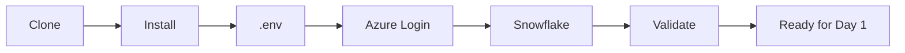
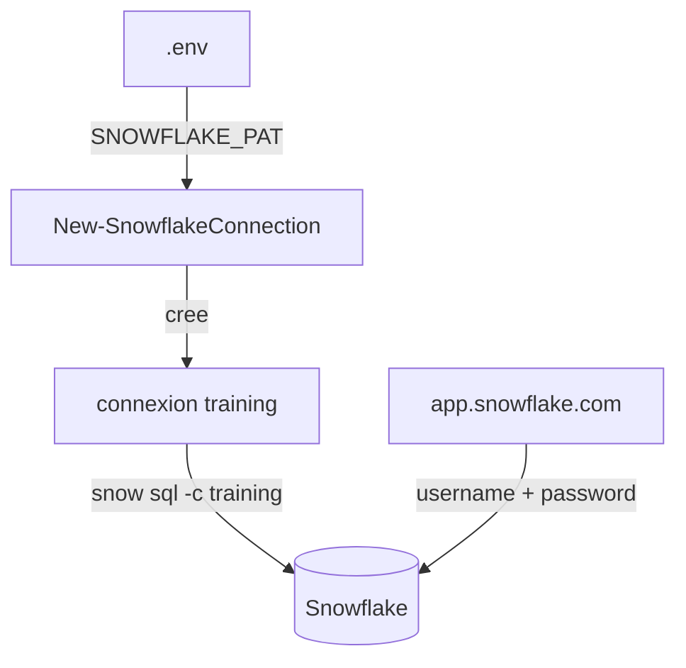
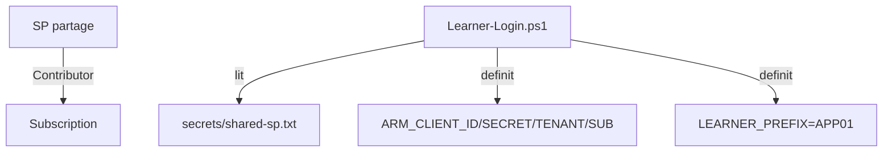

# Slides — Jour 0 : Preparer votre environnement

**Duree : 15 min (presentation) + 1 h 15 (lab)**

**Retour au parcours :** [Jour 0 — Commencer ici](../README.md)

---

## Slide 1 — Objectif du Jour 0

> **Jour 0 = `Ready for Day 1`**

- Preparer le poste de travail pour 5 jours de pratique
- Automatiser l'installation des outils
- Configurer les connexions Snowflake et Azure
- Aucune ressource Cloud creee



---

## Slide 2 — La chaine d'outils

| Outil | Version | Niveau |
|---|---|---|
| Git | latest | Core |
| Terraform | 1.14.5 | Core |
| Python | 3.12 | Core |
| Snowflake CLI | latest | Core |
| Azure CLI | 2.83.0 | Course |
| dbt | < 3.0.0 | Course |
| tflint | 0.50.0 | Optional |

- Installation sous le profil utilisateur (`$HOME/.data2ai/`)
- Pas de privileges administrateur
- Environnement virtuel Python isole pour Snow CLI et dbt

---

## Slide 3 — Le projet type

```text
data-platform-starter/
├── environments/   ← vous creerez les .tf ici
├── modules/        ← modules reutilisables
├── docs/           ← architecture, conventions
├── scripts/        ← install, login, validate
├── azure-pipelines.yml
├── CODEOWNERS
└── .gitignore      ← exclut secrets, state, plans
```

> Le projet type **ne contient pas** de fichiers `.tf`.
> Vous les creerez au fil des modules.

---

## Slide 4 — Authentification Snowflake

| Methode | Usage | Ou |
|---|---|---|
| PAT (Programmatic Access Token) | CLI et Terraform | `.env` / `secrets/snowflake_pat.txt` |
| Username + Password | Interface web | fourni par le formateur |



> Le PAT n'est jamais affiche, jamais commite, jamais passe en argument.

---

## Slide 5 — Authentification Azure

**Probleme :** Azure enforce MFA depuis septembre 2025 → `az login -u -p` bloque.

**Solution :** Service principal partage `sp-data2ai-learners`



> Relancer `Learner-Login` au debut de chaque session.

---

## Slide 6 — Progression d'authentification

| Periode | Snowflake | Azure | CI/CD |
|---|---|---|---|
| Jour 0-3 | PAT temporaire | SP partage | - |
| Jour 4+ | JWT key-pair | Key Vault | - |
| CI/CD | JWT key-pair | WIF (federation) | Aucun secret |

---

## Slide 7 — Regles de securite

1. Aucun secret dans le depot (`.gitignore` exclut `.env`, `secrets/`, `tfvars`)
2. Le PAT est temporaire → rotation apres formation
3. `SYSADMIN` suffit → pas d'`ACCOUNTADMIN`
4. Aucune ressource Cloud au Jour 0

---

## Slide 8 — Les 7 etapes du lab

| Etape | Duree | Action |
|---:|---:|---|
| 1 | 5 min | Cloner le projet type |
| 2 | 20 min | Installer et verifier les outils |
| 3 | 10 min | Configurer `.env` |
| 4 | 10 min | Authentifier Azure (Learner-Login) |
| 5 | 20 min | Configurer Snowflake (New-SnowflakeConnection) |
| 6 | 10 min | Inspecter la structure du projet type |
| 7 | 10 min | Validation finale |

**Total : 1 h 30**

---

## Slide 9 — Critere de fin

```text
Toolchain status: READY
Test-LabConnectivity.ps1 → Status: READY (0 FAIL)
```

```bash
snow sql -q 'SELECT 1' -c training  # → 1
az account show --query 'name' -o tsv  # → Azure subscription 1
find . -name '*.tf' -type f  # → (vide)
```

> Si tout passe, vous etes `Ready for Day 1`.
>
> Si `Blob write access` est en FAIL, c'est un probleme RBAC formateur —
> le role `Storage Blob Data Contributor` doit etre attribue au SP
> avec l'**object ID** (pas l'appId). Voir troubleshooting entree 15.

---

## Slide 10 — Ce que le script a fait

1. Verifie les outils deja installes
2. Telecharge et installe les outils manquants sous `$HOME/.data2ai/`
3. Cree un environnement virtuel Python isole
4. Ajoute les dossiers au PATH
5. Verifie les versions attendues
6. Genere un rapport Markdown + JSON sans secret

---

## Slide 11 — La suite

A partir du Jour 1, **tous les fichiers `.tf`** que vous creerez iront dans le clone :

- `environments/dev/` pour M1 a M4
- `modules/` pour M5
- `environments/uat/` et `prod/` pour M8

> Chaque atelier indique le chemin exact depuis la racine du clone.
