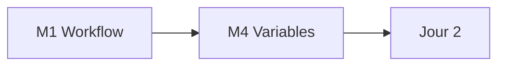

# Jour 1 — Fondations IaC et Variables

**Objectif :** Maitriser le cycle de vie Terraform et les contrats typés.

> [<- Catalogue](../README.md) · [Jour 0](../day-00/README.md) · **Jour 1** · [Jour 2 ->](../day-02/README.md)

---

## Contexte GlobalBank

> **Email Sofia Almeida (Head of Data Platform) :**
>
> *"Le predecesseur a tout construit a la main dans Snowsight. L'Inspection Generale
> demande qui a cree quoi, quand, et pourquoi. Personne ne peut repondre.*
>
> *Notre mission : reconstruire la plateforme en tant que code."*

**Aujourd'hui :** vous creez votre premiere ressource Snowflake, d'abord a la main
dans Snowsight, puis en Terraform. Vous comprenez pourquoi l'infrastructure en code
remplace le clic.

---

## La Tableau de Correspondance (votre pont ClickOps → IaC)

| Champ Snow SQL | Argument Terraform | Exemple |
|----------------|-------------------|---------|
| `NAME` | `name` | `WH_APP01_INGEST_DEV` |
| `WAREHOUSE_SIZE` | `warehouse_size` | `X-SMALL` |
| `AUTO_SUSPEND` | `auto_suspend` | `60` (en secondes) |
| `AUTO_RESUME` | `auto_resume` | `true` |
| `INITIALLY_SUSPENDED` | `initially_suspended` | `true` |
| `COMMENT` | `comment` | `Managed by Terraform` |

> **Regle 1 :** Jamais une ligne de Terraform avant d'avoir clique le meme objet dans Snowsight.

---

## Progression



## Modules

| Module | Duree | Repertoire de travail | Lab | Course | Troubleshooting | Resultat attendu |
|---|---:|---|---|---|---|---|
| [M1 — IaC Workflow](module-01-iac-workflow/lab.md) | 3h | `labs/m01-iac-workflow/` | [lab](module-01-iac-workflow/lab.md) | [cours](module-01-iac-workflow/course.md) | [guide](module-01-iac-workflow/troubleshooting.md) | [output](module-01-iac-workflow/expected-output.md) |
| [M4 — Variables & Outputs](module-04-variables-outputs/lab.md) | 50 min | `labs/m04-variables-outputs/` | [lab](module-04-variables-outputs/lab.md) | [cours](module-04-variables-outputs/course.md) | [guide](module-04-variables-outputs/troubleshooting.md) | [output](module-04-variables-outputs/expected-output.md) |

## Workflow du jour

1. **Lisez** le `course.md` du module (concepts, 15-20 min)
2. **Realisez** le `lab.md` pas a pas ( Creation de fichiers, execution, checkpoints )
3. **Comparez** avec `expected-output.md`
4. **Consultez** `troubleshooting.md` en cas d'erreur
5. **Passez** au module suivant

> Chaque module possede son propre repertoire de travail sous `labs/mXX-name/` (ex. `labs/m01-iac-workflow/` pour M1). Chaque lab est **autonome** : il demarre par `Reset-Lab.ps1` pour un environnement propre, possede ses propres fichiers template (`provider.tf`, `versions.tf`, `variables.tf`) et se termine par `terraform destroy`. Les ressources sont nommees par module (ex. `APP01_M01_RAW_DEV`, `APP01_M05_RAW_DEV`).

> `[WINDOWS]` Si l'execution de scripts `.ps1` est bloquee, autorisez les scripts locaux :
> ```powershell
> Set-ExecutionPolicy -Scope CurrentUser -ExecutionPolicy RemoteSigned
> ```

## Livrable du jour

Database, schema et warehouse Snowflake cres par un projet ecrit par l'apprenant.
Variables, locals, outputs et lifecycle gouvernant le contrat typé.

---

## Preuves individuelles

Avant de passer au Jour 2, verifiez que vous pouvez cocher CHAQUE ligne :

- [ ] `terraform plan` affiche `No changes.` apres l'apply
- [ ] Preuve SQL : `SHOW WAREHOUSES LIKE '<PREFIX>%';` retourne votre objet
- [ ] Vous pouvez expliquer la difference entre `resource`, `variable` et `local`
- [ ] Vous avez modifie un attribut dans Snowsight et observe la derive dans `terraform plan`
- [ ] Vous comprenez pourquoi `auto_suspend` est en secondes, pas en minutes

## Point de convergence (15 min)

Le formateur projette une requete SQL montrant tous les objets crees par le groupe.
Trois observations sont extraites de la journee.

**Questions de convergence :**
1. Qu'est-ce qu'un `plan` Terraform et pourquoi est-il indispensable ?
2. Quelle est la difference entre `variable` et `local` ?
3. Que se passe-t-il quand vous modifiez un objet dans Snowsight ?

---

## Anti-seche Jour 1

### Commandes essentielles

```bash
terraform init          # Initialiser le provider
terraform fmt           # Formater le code
terraform validate      # Valider la syntaxe
terraform plan          # Voir les actions
terraform apply         # Appliquer les changements
terraform state list    # Lister les ressources gerees
```

### Erreurs courantes

| Message | Cause | Solution |
|---------|-------|----------|
| `Error: Provider produced inconsistent result` | Attribut non supporte | Verifiez la documentation du provider |
| `Error: Invalid for_each argument` | Cle non unique dans la map | Verifiez les cles de votre map |
| `Error: Reference to undeclared resource` | Ressource non definie | Ajoutez la ressource dans main.tf |
| `Warning: Value not set` | Variable sans default | Ajoutez une valeur dans terraform.tfvars |

## Navigation

[<- Catalogue](../README.md) · [Jour 0](../day-00/README.md) · **Jour 1** · [Jour 2 ->](../day-02/README.md)
