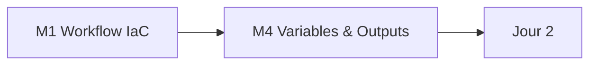

# Jour 1 — Workflow Terraform et contrats typés

**Objectif :** Maîtriser le cycle de vie Terraform sur Snowflake et les contrats typés.
**Durée :** 6 heures (2 h concepts · 4 h pratique)

> [<- Catalogue](../README.md) · [Jour 0](../day-00/README.md) · **Jour 1** · [Jour 2 ->](../day-02/README.md)

---

## Contexte GlobalBank

> *"Le prédécesseur a tout construit à la main dans Snowsight. L'Inspection Générale demande qui a créé quoi, quand et pourquoi. Personne ne peut répondre. Notre mission : reconstruire la plateforme en tant que code."*

**Aujourd'hui :** vous créez votre première ressource Snowflake — d'abord à la main dans Snowsight, puis en Terraform. Vous comprenez pourquoi l'infrastructure en code remplace le clic.

> **Votre équipe GlobalBank :** chaque apprenant applique les mêmes concepts sur les objets de son équipe — 🔵 Platform (warehouses/rôles), 🟢 Data Engineering (zones RAW/Staging), 🟠 Business Data (domaines), 🟣 BI (datamarts). Voir [personas-globalbank.md](../shared/docs/personas-globalbank.md).

---

## Tableau de correspondance ClickOps → IaC

| Champ Snow SQL | Argument Terraform | Exemple |
|---|---|---|
| `NAME` | `name` | `WH_APP01_M01_ETL_DEV` |
| `WAREHOUSE_SIZE` | `warehouse_size` | `X-SMALL` |
| `AUTO_SUSPEND` | `auto_suspend` | `60` (secondes) |
| `AUTO_RESUME` | `auto_resume` | `true` |
| `INITIALLY_SUSPENDED` | `initially_suspended` | `true` |
| `COMMENT` | `comment` | `Managed by Terraform` |

> **Règle 1 :** Jamais une ligne de Terraform avant d'avoir cliqué le même objet dans Snowsight.

---

## Progression



## Modules

| Module | Durée | Dossier de travail | Lab | Cours | Troubleshooting | Output attendu |
|---|---:|---|---|---|---|---|
| [M1 — IaC Workflow](module-01-iac-workflow/lab.md) | 3 h | `labs/m01-iac-workflow/` | [lab](module-01-iac-workflow/lab.md) | [cours](module-01-iac-workflow/course.md) | [guide](module-01-iac-workflow/troubleshooting.md) | [output](module-01-iac-workflow/expected-output.md) |
| [M4 — Variables & Outputs](module-04-variables-outputs/lab.md) | 50 min | `labs/m04-variables-outputs/` | [lab](module-04-variables-outputs/lab.md) | [cours](module-04-variables-outputs/course.md) | [guide](module-04-variables-outputs/troubleshooting.md) | [output](module-04-variables-outputs/expected-output.md) |

## Workflow du jour

1. **Lisez** le `course.md` du module (concepts, 15–20 min)
2. **Réalisz** le `lab.md` pas à pas (création de fichiers, exécution, checkpoints)
3. **Comparez** avec `expected-output.md`
4. **Consultez** `troubleshooting.md` en cas d'erreur
5. **Passez** au module suivant

> Chaque module possède son propre dossier de travail sous `labs/mXX-name/`. Chaque lab est **autonome** : il démarre par `Reset-Lab.ps1` pour un environnement propre, possède ses propres fichiers template et se termine par un cleanup contrôlé. Les ressources sont nommées par module (ex. `APP01_M01_RAW_DEV`).

---

## Livrable du jour

Database, schema et warehouse Snowflake créés par un projet écrit par l'apprenant. Variables, locals, outputs et validations gouvernant le contrat typé.

---

## Preuves individuelles

Avant de passer au Jour 2, vérifiez que vous pouvez cocher chaque ligne :

- [ ] `terraform plan` affiche `No changes.` après l'apply
- [ ] Preuve SQL : `SHOW WAREHOUSES LIKE 'APP01_M01_%';` retourne votre objet
- [ ] Vous pouvez expliquer la différence entre `resource`, `variable` et `local`
- [ ] Vous avez modifié un attribut dans Snowsight et observé la dérive dans `terraform plan`
- [ ] Vous comprenez pourquoi `auto_suspend` est en secondes, pas en minutes

---

## Point de convergence (15 min)

Le formateur projette une requête SQL montrant tous les objets créés par le groupe. Trois observations sont extraites de la journée.

**Questions de convergence :**
1. Qu'est-ce qu'un `plan` Terraform et pourquoi est-il indispensable ?
2. Quelle est la différence entre `variable` et `local` ?
3. Que se passe-t-il quand vous modifiez un objet dans Snowsight ?

---

## Anti-sèche Jour 1

### Commandes essentielles

```bash
terraform init          # Initialiser le provider
terraform fmt           # Formater le code
terraform validate      # Valider la syntaxe
terraform plan          # Voir les actions
terraform apply         # Appliquer les changements
terraform state list    # Lister les ressources gérées
terraform output        # Afficher les sorties
```

### Erreurs courantes

| Message | Cause | Solution |
|---|---|---|
| `Error: Provider produced inconsistent result` | Attribut non supporté | Vérifiez la documentation du provider |
| `Error: Reference to undeclared resource` | Ressource non définie | Ajoutez la ressource dans `main.tf` |
| `Warning: Value not set` | Variable sans default | Ajoutez une valeur dans `terraform.tfvars` |

---

## Navigation

[<- Catalogue](../README.md) · [Jour 0](../day-00/README.md) · **Jour 1** · [Jour 2 ->](../day-02/README.md)
