# 🎓 Atelier Jour 1 — Les fondations de Terraform

## *Anatomie d'une configuration, langage HCL et workflow de déploiement — avec le provider Snowflake*

> **Parcours :** Industrialisation d'une Data Platform · **Jour 1 / 5**
> **Modules couverts :** M01 (Premier projet IaC) + M04 (Variables, locals, outputs, lifecycle)
> **Durée :** 6 heures (2 h de concepts guidés · 4 h de pratique)
> **Niveau :** Débutant Terraform · **Prérequis Terraform : aucun**
> **Alignement certification :** HashiCorp *Terraform Associate (003)* — Objectifs 1, 2, 3, 6, 7, 8
> **Prérequis Azure :** Aucun — la connexion se fait via PAT Snowflake.

---

## 📖 Comment lire cet atelier

Cet atelier suit la pédagogie des tutoriels **HashiCorp Developer / HashiCorp Academy** : chaque notion est d'abord **expliquée** (le *quoi* et le *pourquoi*), puis **immédiatement pratiquée** (le *comment*), puis **prouvée** (le *checkpoint*).

| Pictogramme | Signification |
|:---:|---|
| 🧠 | **Concept** — théorie, modèle mental, diagramme |
| ❓ | **La question de l'apprenant** — une question réelle, posée en formation, et sa réponse |
| 🔬 | **Sous le capot** — ce que fait Terraform réellement |
| 📝 | **Action** — vous tapez quelque chose |
| ✅ | **Checkpoint** — preuve vérifiable que ça marche |
| ⚠️ | **Piège classique** — l'erreur que 80 % des débutants commettent |
| 🔒 | **Sécurité** |
| 💰 | **Coût (FinOps)** |
| 🎓 | **Point d'examen** — tombe à la certification Terraform Associate |

---

## 🧭 Le fil directeur de la journée

Vous n'apprenez pas « des commandes ». Vous construisez **une histoire cohérente**, du problème métier vers la solution technique.

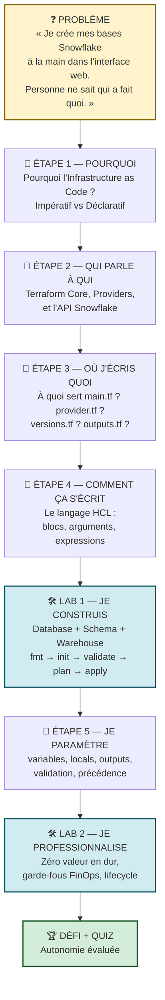

**La promesse de fin de journée :** vous saurez expliquer, ligne par ligne, à un collègue, ce que fait chacun des six fichiers `.tf` de votre projet — et pourquoi il existe.

---

---

# PARTIE A — 🧠 LES CONCEPTS

*Durée : 2 h · Ne sautez pas cette partie. Chaque minute investie ici vous évite 30 minutes de débogage cet après-midi.*

---

## A.1 — Pourquoi Terraform ? Le passage de l'impératif au déclaratif

### A.1.1 Le point de départ : le « ClickOps »

Aujourd'hui, pour créer une base de données Snowflake, vous ouvrez Snowsight, vous cliquez sur *Data → Databases → + Database*, vous tapez un nom, vous validez. C'est le **ClickOps**.

Ça fonctionne très bien… **une fois**. Puis viennent les vraies questions d'entreprise :

| Question du métier | Réponse en ClickOps | Réponse en IaC |
|---|---|---|
| « Qui a créé cette base et quand ? » | On cherche dans les logs d'audit | `git log` sur le fichier |
| « Peux-tu recréer le même environnement en UAT ? » | On reclique tout, en espérant ne rien oublier | On change une variable, on relance |
| « Pourquoi le warehouse de PROD est en LARGE ? » | Personne ne sait | La *pull request* qui l'a changé |
| « Peux-tu tout supprimer proprement vendredi ? » | On cherche à la main, on en oublie | `terraform destroy` |
| « Est-ce que DEV est identique à PROD ? » | On compare visuellement, écran par écran | `terraform plan` → *No changes* |

> 🎓 **Point d'examen** — L'examen Terraform Associate teste explicitement ce raisonnement (*Objectif 1 : Understand Infrastructure as Code concepts*). Les bénéfices attendus sont : **reproductibilité**, **versionnement**, **automatisation**, **collaboration**, **documentation vivante**.

### A.1.2 Impératif vs déclaratif : la différence fondamentale

C'est **le** concept qui change tout. Comparons deux façons de demander la même chose.

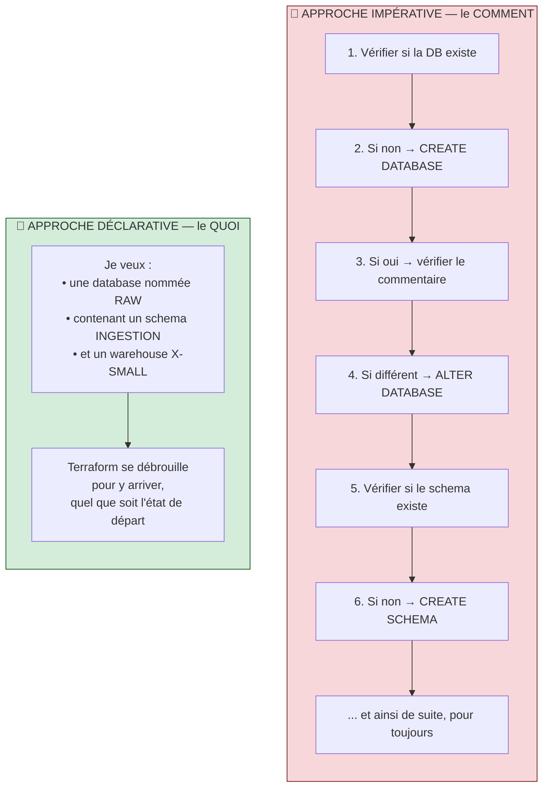

**En impératif** (un script Bash, un notebook SQL, un script PowerShell), vous décrivez **la suite d'actions**. Vous devez gérer vous-même tous les cas : « et si ça existe déjà ? », « et si quelqu'un l'a modifié ? ». Le script n'est pas rejouable sans précaution.

**En déclaratif** (Terraform), vous décrivez **le résultat souhaité**. Terraform compare ce que vous voulez à ce qui existe, et calcule tout seul la liste des actions minimales.

> 🧠 **Analogie du GPS.**
> — *Impératif* : « Tourne à droite, puis 200 m, puis à gauche au feu, puis… ». Si vous ratez une sortie, tout le script est faux.
> — *Déclaratif* : « Emmène-moi au 12 rue de la Paix ». Le GPS recalcule depuis n'importe quel point de départ.
> Terraform est le GPS. `terraform plan` est l'itinéraire proposé avant de démarrer.

### A.1.3 La conséquence directe : l'idempotence

**Idempotence** = appliquer la même configuration 2, 5 ou 100 fois produit exactement le même résultat, sans effet de bord.

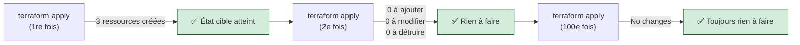

C'est **la preuve d'un travail bien fait**. Dans cette formation, chaque lab se termine par un second `terraform plan` qui doit afficher `No changes.` Si ce n'est pas le cas, quelque chose n'est pas maîtrisé.

---

## A.2 — L'architecture de Terraform : qui parle à qui ?

### A.2.1 Terraform Core + Providers

Terraform n'a **aucune connaissance native** de Snowflake, d'Azure ou d'AWS. Le binaire `terraform.exe` que vous avez installé est un moteur générique. Toute la connaissance métier vit dans des **providers** : des plugins téléchargés à la demande.

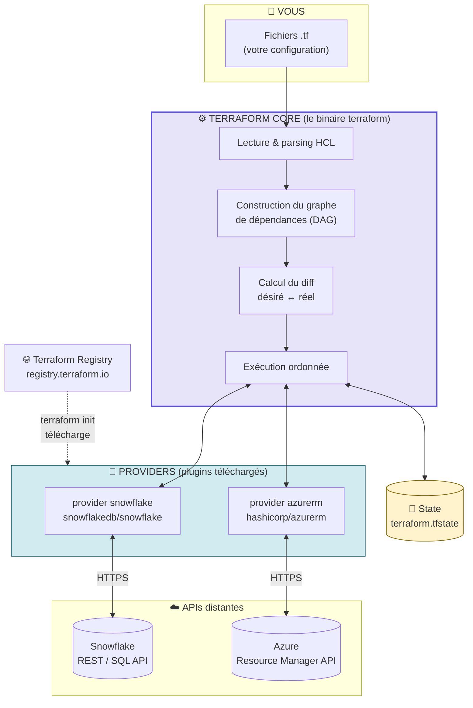

**Ce qu'il faut retenir :**

| Composant | Rôle | Où il vit |
|---|---|---|
| **Terraform Core** | Lit le HCL, construit le graphe, calcule le diff, orchestre | Le binaire `terraform` |
| **Provider** | Traduit « je veux une database » en appels d'API Snowflake | `.terraform/providers/…` (téléchargé) |
| **Registry** | Catalogue public des providers et modules | `registry.terraform.io` |
| **State** | Mémoire de ce que Terraform a créé | `terraform.tfstate` (Jour 2) |

> 🔬 **Sous le capot.** Core et provider sont **deux processus séparés** qui communiquent en gRPC sur localhost. C'est pourquoi `terraform init` doit *télécharger* le provider : sans lui, Core ne sait pas ce qu'est un `snowflake_database`.

> 🎓 **Point d'examen.** Le provider Snowflake officiel est publié par **Snowflake** (`snowflakedb/snowflake`), pas par HashiCorp. Les providers `hashicorp/*` sont dits *officiels*, les autres sont *partner* (vérifiés) ou *community*. L'adresse complète d'un provider est `registry.terraform.io/<NAMESPACE>/<TYPE>`.

### A.2.2 Le triangle fondamental : Code, State, Réel

C'est le modèle mental le plus important de toute la formation. Terraform manipule en permanence **trois** représentations de votre infrastructure.

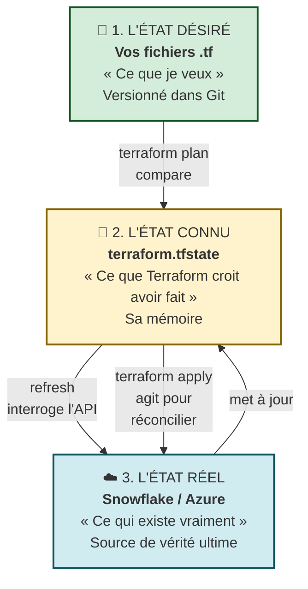

**Toutes les commandes Terraform se décrivent avec ce triangle :**

| Commande | Ce qu'elle fait dans le triangle |
|---|---|
| `terraform plan` | Rafraîchit 2 depuis 3, compare 1 et 2, **affiche** le diff. **N'écrit rien.** |
| `terraform apply` | Fait le plan puis **exécute** les actions pour que 3 = 1, et met à jour 2 |
| `terraform destroy` | Supprime dans 3 tout ce qui est dans 2, puis vide 2 |
| `terraform import` | Ajoute dans 2 une ressource qui existe déjà dans 3 (Jour 2) |
| *Dérive (drift)* | Quelqu'un modifie 3 à la main → 2 et 3 divergent → `plan` le détecte |

> ⚠️ **Piège classique n°1.** Un débutant croit que Terraform « lit Snowflake ». Faux : Terraform lit **son state**, et le rafraîchit depuis l'API. Une ressource créée à la main dans Snowsight **n'existe pas** pour Terraform tant qu'elle n'est pas importée. C'est tout l'objet du Jour 2.

---

## A.3 — ❓ « À quoi sert `main.tf` ? Et `provider.tf` ? » — L'anatomie d'un projet Terraform

*Voici la question la plus fréquente en formation. Prenons le temps d'y répondre complètement.*

### A.3.1 La révélation qui débloque tout le monde

> 🔬 **Terraform ne connaît PAS le nom de vos fichiers.**
>
> Quand vous lancez une commande, Terraform lit **tous les fichiers `.tf` du répertoire courant**, dans l'ordre alphabétique, et les **concatène mentalement en un seul gros document**. Il ne descend pas dans les sous-dossiers (sauf modules explicites). Il ne lit pas les fichiers `.tf` du dossier parent.

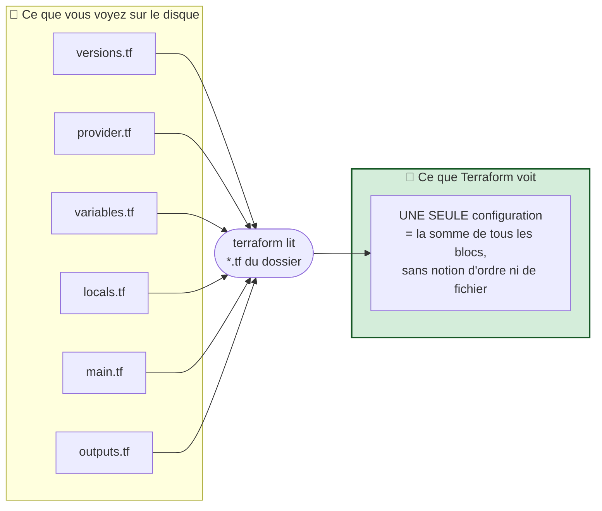

**Conséquence directe :** vous *pourriez* tout écrire dans un seul fichier `infra.tf` de 800 lignes. Ça marcherait à l'identique.

**Alors pourquoi découper ?** Pour **les humains**, pas pour la machine. Le découpage est une **convention communautaire** (celle des tutoriels HashiCorp et des modules du Registry) qui répond à une question simple : *« où je vais chercher quand je veux modifier X ? »*

> ❓ **La question de l'apprenant : « Puis-je renommer `main.tf` en `ressources.tf` ? »**
> Oui, techniquement. Mais **non, ne le faites pas** : toute la communauté, toute la documentation HashiCorp et tous vos futurs collègues cherchent `main.tf`. Le nommage standard est une forme de politesse professionnelle.

### A.3.2 La carte du projet : un fichier = une responsabilité

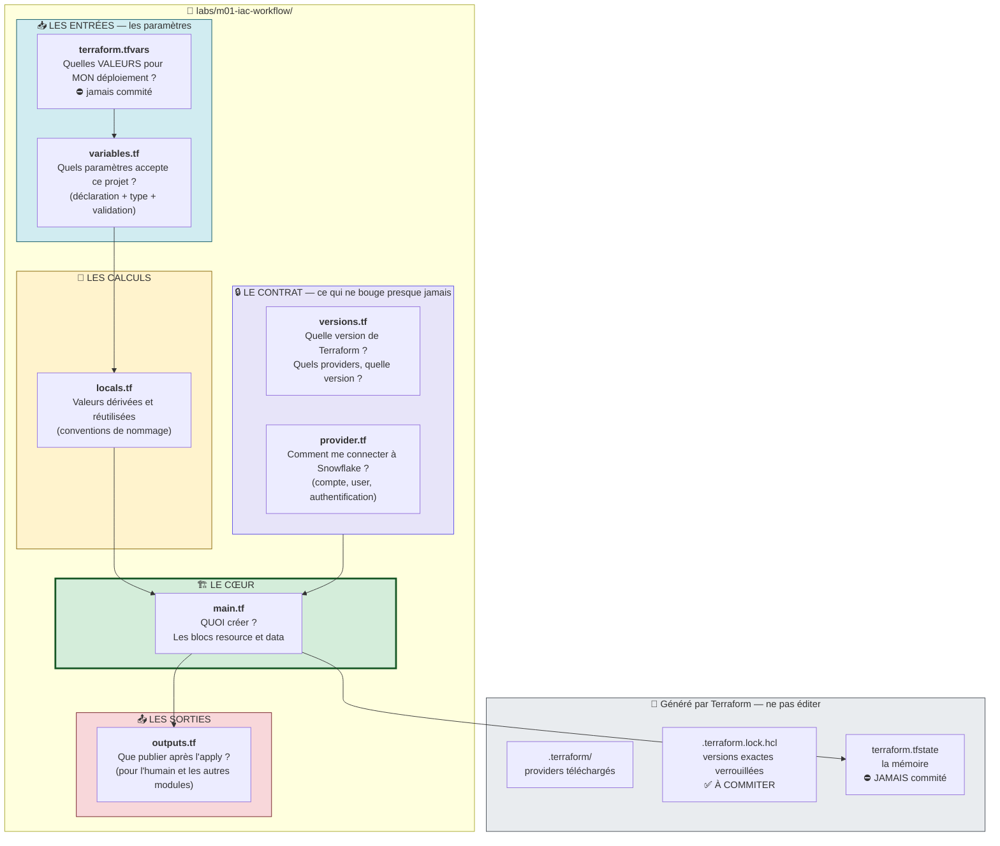

### A.3.3 Fiche d'identité de chaque fichier

---

#### 📄 `versions.tf` — *« Le contrat de compatibilité »*

**Ce qu'il contient :** le bloc `terraform {}` avec `required_version` et `required_providers`.

```hcl
terraform {
  required_version = "= 1.14.5"

  required_providers {
    snowflake = {
      source  = "snowflakedb/snowflake"
      version = "= 2.14.0"
    }
  }
}
```

**À quoi ça sert concrètement :** garantir que **vous, votre collègue et le pipeline CI/CD** utilisez exactement le même moteur et le même plugin. Sans cela, un `apply` qui marche sur votre poste peut échouer en CI parce que le provider a changé de comportement entre deux versions mineures.

| Argument | Rôle | Analogie |
|---|---|---|
| `required_version` | Version du binaire Terraform | La version du moteur de la voiture |
| `required_providers.<nom>.source` | Adresse du plugin dans le Registry | La marque de la pièce détachée |
| `required_providers.<nom>.version` | Contrainte de version du plugin | La référence exacte de la pièce |

> 🎓 **Point d'examen — les opérateurs de contrainte de version.**
>
> | Écriture | Signification | Accepte |
> |---|---|---|
> | `= 2.14.0` | Exactement cette version | 2.14.0 uniquement |
> | `>= 2.14.0` | Au moins | 2.14.0, 2.15.0, 3.0.0… |
> | `~> 2.14.0` | *Pessimistic constraint* — dernier chiffre libre | 2.14.0 → 2.14.99, **pas** 2.15.0 |
> | `~> 2.14` | Dernier chiffre libre au niveau mineur | 2.14 → 2.99, **pas** 3.0 |
> | `>= 2.14, < 3.0` | Intervalle | 2.x uniquement |
>
> **Dans cette formation, nous épinglons avec `=`** : en salle, tous les apprenants doivent avoir un comportement strictement identique. En entreprise, `~> 2.14` est plus courant, complété par le fichier `.terraform.lock.hcl`.

> ⚠️ **Piège classique n°2.** `required_version` **n'installe rien**. Si votre Terraform local est en 1.13, la commande échoue avec un message d'erreur — elle ne télécharge pas la 1.14.5 pour vous. Le binaire Terraform s'installe séparément (tfenv, chocolatey, apt…).

---

#### 📄 `provider.tf` — *« Le badge d'accès »*

**Ce qu'il contient :** le bloc `provider "snowflake" {}` — **comment** se connecter et **avec quelle identité**.

```hcl
locals {
  pat_file        = "${path.module}/../../secrets/snowflake_pat.txt"
  snowflake_token = try(trim(file(local.pat_file), "\n\r"), var.snowflake_token, "")
}

provider "snowflake" {
  organization_name = var.snowflake_organization
  account_name      = var.snowflake_account
  user              = var.snowflake_user
  authenticator     = "PROGRAMMATIC_ACCESS_TOKEN"
  token             = local.snowflake_token
}
```

**La distinction qui compte :**

| | `versions.tf` | `provider.tf` |
|---|---|---|
| Répond à | *« Quel plugin, quelle version ? »* | *« Quel compte, quelle identité ? »* |
| Bloc utilisé | `terraform { required_providers {} }` | `provider "snowflake" {}` |
| Change-t-il entre DEV et PROD ? | Non | **Oui** (compte, rôle, credentials) |
| Analogie | Le modèle de la clé | La serrure qu'elle ouvre |

**Ligne par ligne :**

| Argument | Rôle |
|---|---|
| `organization_name` | L'organisation Snowflake (ex. `ZVFXOZW`) |
| `account_name` | Le compte dans l'organisation (ex. `PM71247`) |
| `user` | L'utilisateur Snowflake au nom duquel Terraform agit |
| `authenticator` | La **méthode** d'authentification. `PROGRAMMATIC_ACCESS_TOKEN` = PAT |
| `token` | Le secret, **lu depuis un fichier hors dépôt** |

> 🔒 **Sécurité — la règle non négociable.** Le PAT n'est **jamais** écrit dans un fichier `.tf`. Ici, la fonction `file()` va le lire dans `secrets/snowflake_pat.txt`, qui est dans `.gitignore`. Le code peut être poussé publiquement sans risque.
>
> **Trois façons d'injecter un secret, de la pire à la meilleure :**
>
> | Méthode | Verdict |
> |---|---|
> | `token = "eyJhbGc..."` en dur dans le `.tf` | ⛔ **Interdit.** Fuite garantie dans Git |
> | Variable d'environnement `TF_VAR_snowflake_token` | ✅ Acceptable, standard CI/CD |
> | Fichier hors dépôt lu par `file()` (notre cas) | ✅ Acceptable en formation |
> | Coffre-fort (Azure Key Vault + identité fédérée) | 🏆 Cible production — **Jour 4** |

> ❓ **La question de l'apprenant : « Pourquoi un `locals` dans `provider.tf` et pas dans `locals.tf` ? »**
> Parce que ce `locals` ne sert **qu'au** provider : le garder à côté rend le fichier auto-suffisant et lisible. Rappelez-vous : Terraform s'en moque totalement. C'est un choix de lisibilité humaine.

> 🔬 **Sous le capot — l'ordre de résolution du provider.** Le provider Snowflake cherche ses paramètres dans cet ordre : (1) arguments du bloc `provider`, (2) variables d'environnement `SNOWFLAKE_*`, (3) fichier de configuration `~/.snowflake/config.toml`. C'est pourquoi une variable d'environnement résiduelle comme `SNOWFLAKE_PRIVATE_KEY_FILE` peut faire échouer une authentification par PAT — voir la section Troubleshooting.

---

#### 📄 `variables.tf` — *« Les boutons de la façade »*

**Ce qu'il contient :** la **déclaration** des paramètres d'entrée. Attention : la déclaration, **pas** les valeurs.

```hcl
variable "warehouse_size" {
  type        = string
  description = "Training warehouse size"
  default     = "X-SMALL"

  validation {
    condition     = contains(["X-SMALL", "SMALL"], var.warehouse_size)
    error_message = "Training warehouses must be X-SMALL or SMALL."
  }
}
```

**Analogie du four.** `variables.tf` déclare qu'il **existe** un bouton « température », qu'il accepte un **nombre** entre 50 et 250, et qu'il est sur 180 par défaut. `terraform.tfvars` dit que **ce soir**, vous le mettez sur 200.

| Argument | Obligatoire ? | Rôle |
|---|:---:|---|
| `type` | recommandé | `string`, `number`, `bool`, `list(…)`, `map(…)`, `object({…})`, `set(…)` |
| `description` | recommandé | Documentation, affichée par `terraform-docs` et dans les prompts |
| `default` | non | Si absent → variable **obligatoire**, Terraform la demandera interactivement |
| `validation` | non | Garde-fou évalué **localement**, avant tout appel réseau |
| `sensitive` | non | Masque la valeur dans les logs et les sorties (`(sensitive value)`) |
| `nullable` | non | Autorise ou non la valeur `null` |

> 💰 **FinOps as code.** Le bloc `validation` ci-dessus est un contrôle de coût : un apprenant ne peut **pas** créer un warehouse `4X-LARGE` par erreur de frappe. Terraform refuse **avant** d'appeler Snowflake — zéro crédit consommé. C'est le principe de la *policy as code* à l'échelle du module.

---

#### 📄 `terraform.tfvars` — *« Les valeurs de MON déploiement »*

```hcl
snowflake_organization = "ZVFXOZW"
snowflake_account      = "PM71247"
snowflake_user         = "DATA2AI"
learner_prefix         = "APP01"
environment            = "DEV"
warehouse_size         = "X-SMALL"
```

**Chargé automatiquement** s'il s'appelle exactement `terraform.tfvars` ou `*.auto.tfvars` et se trouve dans le dossier courant. Sinon, il faut le passer explicitement : `terraform plan -var-file="prod.tfvars"`.

> ⚠️ **Piège classique n°3 — LE piège de cette formation.** Terraform ne lit **jamais** votre fichier `.env`. Si vous changez `LEARNER_PREFIX` dans `.env`, vous devez **aussi** le changer dans `terraform.tfvars`. Les deux fichiers ne communiquent pas. Le `.env` sert aux scripts PowerShell/Bash ; le `.tfvars` sert à Terraform.

---

#### 📄 `locals.tf` — *« Les variables internes »*

```hcl
locals {
  database_name  = "${var.learner_prefix}_M01_RAW_${var.environment}"
  schema_name    = "INGESTION"
  warehouse_name = "WH_${var.learner_prefix}_M01_ETL_${var.environment}"
  common_comment = "Managed by Terraform | Training | ${var.learner_prefix}"
}
```

**La différence variable / local, en une phrase :**

> Une **variable** est un paramètre que l'**extérieur** peut fixer. Un **local** est une valeur que le module **calcule pour lui-même** et que personne ne peut surcharger.

| | `variable` | `local` |
|---|---|---|
| Surchargeable de l'extérieur ? | ✅ Oui (`-var`, `.tfvars`, `TF_VAR_*`) | ❌ Non, jamais |
| Référencée par | `var.nom` | `local.nom` |
| Peut référencer d'autres valeurs ? | Non (le `default` doit être littéral) | ✅ Oui (`var.*`, autres `local.*`, fonctions) |
| Usage typique | Compte, environnement, taille | Conventions de nommage, tags communs, calculs |

**Pourquoi c'est indispensable ici :** la convention `<PREFIXE>_<ZONE>_<ENV>` est écrite **une seule fois**. Si demain la convention devient `<PREFIXE>-<ZONE>-<ENV>`, vous changez une ligne, pas quinze.

> 🔬 **Sous le capot.** `"${var.a}_${var.b}"` est de l'**interpolation de chaîne**. Depuis Terraform 0.12, quand l'expression est *seule*, les guillemets sont inutiles : écrivez `var.a` et non `"${var.a}"`. `terraform fmt` ne le corrige pas, mais `terraform validate` émet un avertissement. C'est un marqueur de code moderne vs code hérité de Terraform 0.11.

---

#### 📄 `main.tf` — *« Le cœur : QUOI créer »*

**C'est le fichier qui décrit l'infrastructure elle-même.** Tout le reste (versions, provider, variables, locals) n'existe que pour le servir.

```hcl
resource "snowflake_database" "raw" {
  name                        = local.database_name
  comment                     = local.common_comment
  data_retention_time_in_days = 1
}
```

**Décortiquons ce bloc — c'est la structure la plus importante de tout Terraform :**

```
  resource   "snowflake_database"   "raw"   {
     ▲               ▲                ▲
     │               │                └── 3. NOM LOCAL (vous le choisissez)
     │               │                     Interne à Terraform. N'apparaît
     │               │                     jamais dans Snowflake.
     │               │
     │               └── 2. TYPE DE RESSOURCE (imposé par le provider)
     │                    Le préfixe « snowflake_ » indique quel provider
     │                    doit gérer ce bloc.
     │
     └── 1. TYPE DE BLOC (mot-clé Terraform)

  ➡️  ADRESSE COMPLÈTE : snowflake_database.raw
      C'est la clé unique de cette ressource dans le state et le graphe.
```

> ❓ **La question de l'apprenant : « `"raw"`, c'est le nom de la base dans Snowflake ? »**
> **Non**, et c'est LA confusion n°1. `"raw"` est un **libellé interne** à Terraform, comme un nom de variable. Le vrai nom Snowflake est la valeur de l'argument `name`, soit `local.database_name`, soit `APP01_M01_RAW_DEV`.
> Vous pourriez écrire `resource "snowflake_database" "pizza"` : Snowflake créerait toujours `APP01_M01_RAW_DEV`. Mais votre collègue vous en voudrait.

**Les types de blocs que vous rencontrerez :**

| Bloc | Rôle | Vu au |
|---|---|---|
| `terraform {}` | Versions, backend, providers requis | J1 + J2 |
| `provider "x" {}` | Configuration d'une connexion | J1 |
| `resource "type" "nom" {}` | **Crée et gère** un objet | J1 |
| `data "type" "nom" {}` | **Lit** un objet existant (lecture seule) | J2 |
| `variable "nom" {}` | Déclare une entrée | J1 |
| `output "nom" {}` | Déclare une sortie | J1 |
| `locals {}` | Valeurs calculées (pluriel, pas de nom) | J1 |
| `module "nom" {}` | Appelle un composant réutilisable | J3 |
| `moved {}` | Renomme dans le state sans détruire | J2 |
| `import {}` | Adopte une ressource existante | J2 |

> 🎓 **Point d'examen — `resource` vs `data`.** Un bloc `resource` **crée, modifie, détruit**. Un bloc `data` **lit uniquement** — il n'apparaît jamais dans un plan comme « to add ». Question piège classique : « Que fait Terraform lors d'un `destroy` sur une `data source` ? » → Rien, il la retire simplement du state.

---

#### 📄 `outputs.tf` — *« La vitrine »*

```hcl
output "database_name" {
  value       = snowflake_database.raw.name
  description = "Database created by the learner"
}
```

**Trois usages, par ordre d'importance croissante :**

1. **Afficher** une information utile à la fin de l'`apply` (le nom généré, une URL…).
2. **Exposer** une valeur à un module parent (Jour 3).
3. **Publier** une valeur consommable par un **autre projet Terraform** via `terraform_remote_state` (Jour 2). C'est le mécanisme de composition entre équipes.

| Argument | Rôle |
|---|---|
| `value` | L'expression à publier |
| `description` | Documentation |
| `sensitive = true` | Masque à l'affichage (⚠️ **reste en clair dans le state**) |
| `depends_on` | Dépendance explicite, rare |

> ⚠️ **Piège classique n°4.** `sensitive = true` ne **chiffre rien**. La valeur est en clair dans `terraform.tfstate`. C'est un masque d'affichage, pas une protection. D'où la règle du Jour 2 : le state se traite comme un secret.

---

#### 📁 Les fichiers générés — ne jamais éditer à la main

| Fichier / dossier | Créé par | Rôle | Git ? |
|---|---|---|:---:|
| `.terraform/` | `init` | Providers téléchargés, cache des modules | ⛔ ignoré |
| `.terraform.lock.hcl` | `init` | **Verrouille les versions exactes + empreintes SHA256** | ✅ **à commiter** |
| `terraform.tfstate` | `apply` | La mémoire de Terraform | ⛔ **jamais** |
| `terraform.tfstate.backup` | `apply` | Copie de l'avant-dernier state | ⛔ jamais |
| `*.tfplan` | `plan -out` | Plan binaire figé | ⛔ jamais (contient des valeurs sensibles) |
| `terraform.tfvars` | vous | Vos valeurs, souvent sensibles | ⛔ jamais |
| `terraform.tfvars.example` | l'équipe | Modèle sans secret | ✅ à commiter |

> 🎓 **Point d'examen — `.terraform.lock.hcl`.** Introduit en Terraform 0.14, il joue le rôle de `package-lock.json`. Il **doit** être commité : c'est lui qui garantit que la CI télécharge exactement le même binaire de provider que votre poste, empreinte cryptographique à l'appui. `terraform init -upgrade` est la commande qui le met à jour volontairement.

---

## A.4 — Le langage HCL en 10 minutes

### A.4.1 La grammaire complète

**HCL** (*HashiCorp Configuration Language*) tient en trois constructions.

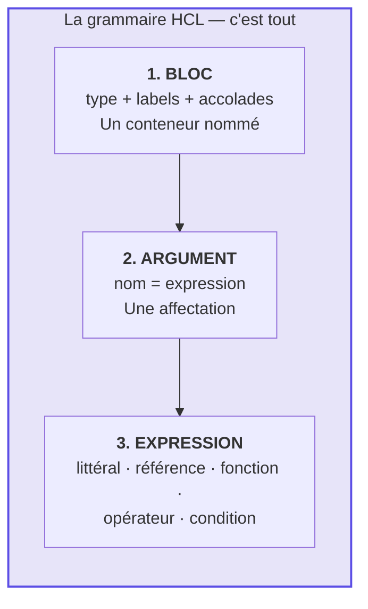

```hcl
# ── un BLOC ────────────────────────────────────────────
resource "snowflake_warehouse" "etl" {
# ▲         ▲                    ▲    ▲
# type      label 1              label 2   accolade ouvrante

  # ── des ARGUMENTS ────────────────────────────────────
  name           = local.warehouse_name   # référence à un local
  warehouse_size = var.warehouse_size     # référence à une variable
  auto_suspend   = 60                     # littéral numérique
  auto_resume    = true                   # littéral booléen
  comment        = "Géré par Terraform"   # littéral string

  # ── un BLOC IMBRIQUÉ ─────────────────────────────────
  lifecycle {
    prevent_destroy = true
  }
}
```

### A.4.2 Les types d'expressions à connaître dès aujourd'hui

| Expression | Exemple | Ce que ça fait |
|---|---|---|
| Littéral | `"X-SMALL"`, `60`, `true` | Une valeur figée |
| Référence variable | `var.environment` | Lit une variable d'entrée |
| Référence local | `local.database_name` | Lit une valeur calculée |
| **Référence ressource** | `snowflake_database.raw.name` | Lit un attribut d'une **autre ressource** ➜ **crée une dépendance** |
| Interpolation | `"${var.prefix}_RAW"` | Insère une valeur dans une chaîne |
| Fonction | `upper(var.env)`, `file(path)` | Appel de fonction intégrée |
| Conditionnel | `var.env == "PROD" ? "LARGE" : "X-SMALL"` | Ternaire |
| Objet / map | `{ a = 1, b = 2 }` | Structure de données |
| Liste | `["DEV", "UAT", "PROD"]` | Collection ordonnée |

### A.4.3 Les valeurs et fonctions utiles dès le Jour 1

| Élément | Rôle | Exemple |
|---|---|---|
| `path.module` | Chemin du dossier du module courant | `"${path.module}/../../secrets/pat.txt"` |
| `path.root` | Chemin du module racine | — |
| `file(chemin)` | Lit un fichier texte | `file(local.pat_file)` |
| `trim(s, cars)` | Retire des caractères aux extrémités | `trim(s, "\n\r")` |
| `try(a, b, c)` | Renvoie la 1re expression qui ne plante pas | `try(file(x), var.y, "")` |
| `contains(liste, v)` | Test d'appartenance | validation `warehouse_size` |
| `upper()` / `lower()` | Casse | `upper(var.env)` |
| `can(expr)` | Renvoie un booléen au lieu d'échouer | validations regex |

> 🎓 **Point d'examen.** Les fonctions Terraform sont **pures** : pas d'écriture disque, pas d'appel réseau, pas de fonctions définies par l'utilisateur (jusqu'à Terraform 1.8 qui introduit les *provider-defined functions*). `terraform console` permet de les tester interactivement — un excellent réflexe de débogage.

---

## A.5 — Le workflow Terraform : les 5 commandes du quotidien

### A.5.1 Le cycle complet

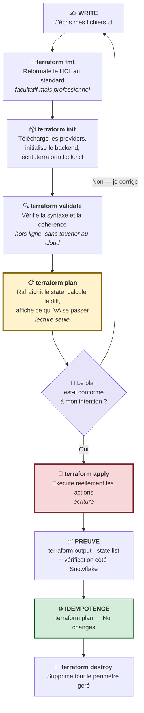

### A.5.2 Ce que fait chaque commande, précisément

| Commande | Réseau ? | Écrit ? | Ce qu'elle fait exactement |
|---|:---:|:---:|---|
| `terraform fmt` | ❌ | fichiers `.tf` | Indentation 2 espaces, alignement des `=`, ordre canonique. `-check` = mode CI (échoue si mal formaté), `-recursive` = sous-dossiers |
| `terraform init` | ✅ Registry | `.terraform/`, `.terraform.lock.hcl` | Télécharge les providers, configure le backend, installe les modules. **Obligatoire après tout changement de `required_providers` ou de `backend`** |
| `terraform validate` | ❌ | rien | Syntaxe HCL, types d'arguments, références existantes. **Ne vérifie pas** que le compte Snowflake existe. Nécessite un `init` préalable |
| `terraform plan` | ✅ Snowflake | rien (sauf `-out`) | Refresh du state depuis l'API, comparaison, affichage du diff |
| `terraform apply` | ✅ Snowflake | state + cloud | Exécute le plan. Sans argument il replanifie et demande confirmation |
| `terraform destroy` | ✅ Snowflake | state + cloud | Équivaut à `apply -destroy` |
| `terraform output` | ❌ | rien | Relit les outputs depuis le state |
| `terraform show` | ❌ | rien | Affiche le state ou un plan en lisible / JSON |
| `terraform state list` | ❌ | rien | Liste les adresses gérées |
| `terraform console` | ✅ | rien | REPL pour tester des expressions |

### A.5.3 Lire un plan Terraform — la compétence clé

Le plan utilise une symbolique inspirée de `diff`. **Sachez la lire par cœur :**

| Symbole | Couleur | Action | Danger |
|:---:|---|---|---|
| `+` | vert | **create** — nouvelle ressource | Faible |
| `~` | orange | **update in-place** — modification sans recréation | Faible |
| `-` | rouge | **destroy** — suppression | 🔴 **Élevé** |
| `-/+` | rouge+vert | **replace** — détruire **puis** recréer | 🔴🔴 **Critique — perte de données possible** |
| `+/-` | vert+rouge | **replace** — créer **puis** détruire (`create_before_destroy`) | 🟠 Élevé |
| `<=` | cyan | **read** — lecture d'une data source | Nul |
| (aucun) | | **no-op** — rien à faire | Nul |

```text
Terraform will perform the following actions:

  # snowflake_warehouse.etl will be updated in-place
  ~ resource "snowflake_warehouse" "etl" {
        id                  = "WH_APP01_M01_ETL_DEV"
        name                = "WH_APP01_M01_ETL_DEV"
      ~ warehouse_size      = "X-SMALL" -> "SMALL"
        # (6 unchanged attributes hidden)
    }

Plan: 0 to add, 1 to change, 0 to destroy.
        ▲            ▲            ▲
        │            │            └── ⚠️ LA LIGNE À LIRE EN PREMIER
        │            │                Tout ce qui n'est pas 0 ici
        │            │                exige une justification.
        └────────────┴── création / modification
```

> ⚠️ **Piège classique n°5.** Un `-/+ replace` sur une database Snowflake **détruit les données**. Toujours chercher la mention `# forces replacement` dans le plan avant de valider. La cause est presque toujours la modification d'un attribut immuable (souvent `name`).

### A.5.4 Ce qui se passe vraiment pendant un `plan`

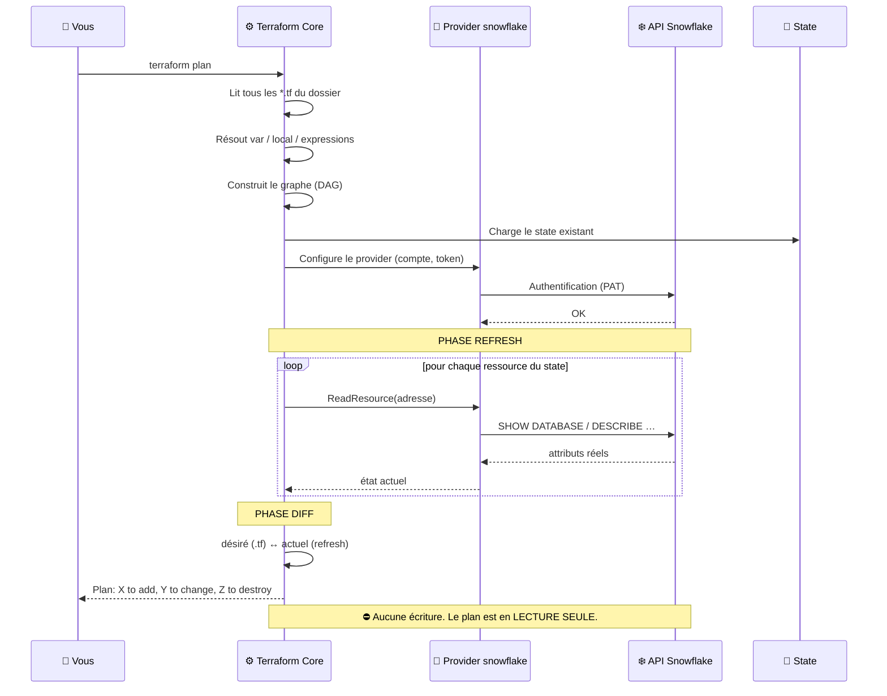

> 🎓 **Point d'examen.** `terraform plan -refresh=false` saute la phase de rafraîchissement : plus rapide, mais le plan repose alors sur un state potentiellement périmé. `terraform apply -refresh-only` fait l'inverse : il met à jour le state depuis le réel **sans modifier l'infrastructure** — c'est la commande moderne qui remplace `terraform refresh` (déprécié).

### A.5.5 Le graphe de dépendances (DAG)

Terraform ne lit pas votre `main.tf` de haut en bas. Il construit un **graphe orienté acyclique** et parallélise tout ce qui peut l'être (10 opérations simultanées par défaut).

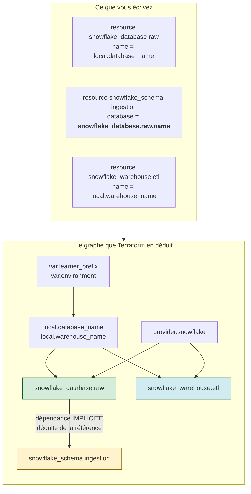

**Deux temps d'exécution :**
- **Temps 1 (parallèle) :** `snowflake_database.raw` **et** `snowflake_warehouse.etl` — aucune dépendance entre eux.
- **Temps 2 :** `snowflake_schema.ingestion` — il **attend** la database, parce qu'il la référence.

> ❓ **La question de l'apprenant : « Comment Terraform sait-il l'ordre ? »**
> Par les **références**. Écrire `database = snowflake_database.raw.name` crée une **dépendance implicite**. C'est la bonne façon de faire. Écrire `database = "APP01_M01_RAW_DEV"` en dur casserait le lien : Terraform pourrait tenter de créer le schema avant la database, et échouerait.

| Type de dépendance | Comment | Quand l'utiliser |
|---|---|---|
| **Implicite** | Une ressource en référence une autre | **Toujours par défaut** — 95 % des cas |
| **Explicite** | `depends_on = [snowflake_database.raw]` | Uniquement quand la dépendance existe côté API mais n'apparaît dans aucune référence (ex. un grant qui doit exister avant un accès) |

> ⚠️ **Piège classique n°6.** Abuser de `depends_on` sérialise le graphe et ralentit tout. Si vous en avez besoin partout, c'est le signe que vous n'utilisez pas assez les références.

---

## A.6 — Variables, locals, outputs : le flux de données complet

### A.6.1 Le trajet d'une valeur, de bout en bout

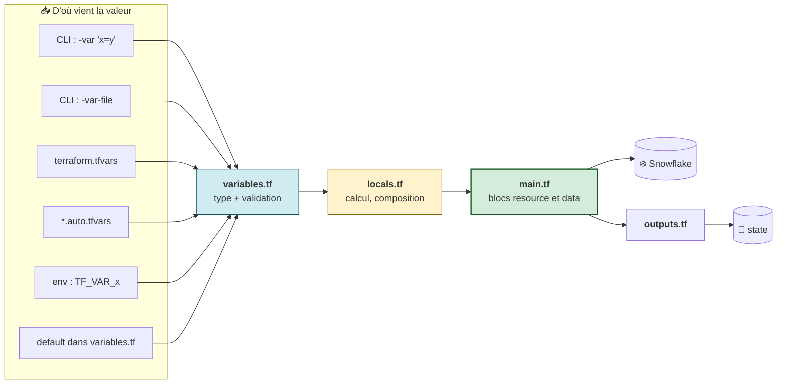

### A.6.2 🎓 La précédence des variables — question quasi certaine à l'examen

Quand la même variable est définie à plusieurs endroits, **le plus proche de la ligne de commande gagne**.

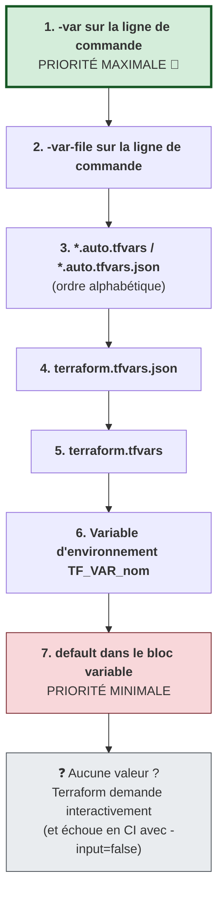

> 🎓 **À mémoriser.** Retenez le sens : **plus c'est explicite et proche de l'appel, plus c'est prioritaire.** Le `default` est le dernier recours. Vous le vérifierez expérimentalement au Lab 2 (étape 2.4).

### A.6.3 Le bloc `lifecycle` — le comportement de la ressource

`lifecycle` est un **méta-argument** : il ne concerne pas Snowflake, mais la façon dont **Terraform** traite la ressource.

| Argument | Effet | Cas d'usage |
|---|---|---|
| `prevent_destroy = true` | Terraform **refuse de planifier** une destruction et lève une erreur | Base de données de production, bucket d'archives |
| `create_before_destroy = true` | Inverse l'ordre du remplacement : crée le nouveau avant de détruire l'ancien | Éviter une coupure de service |
| `ignore_changes = [comment]` | Ignore la dérive sur ces attributs | Un champ modifié par un autre outil |
| `replace_triggered_by = [...]` | Force le remplacement quand une autre ressource change | Dépendances non déclarées côté API |
| `precondition` / `postcondition` | Assertions vérifiées au plan / à l'apply | Garde-fous métier |

> ⚠️ **Piège classique n°7.** `prevent_destroy = true` bloque **aussi** `terraform destroy` sur l'ensemble du projet. En formation, on l'ajoute pour l'observer, puis **on le retire** pour permettre le nettoyage FinOps. En production, on le laisse.

---

## A.7 — Récapitulatif visuel de la Partie A

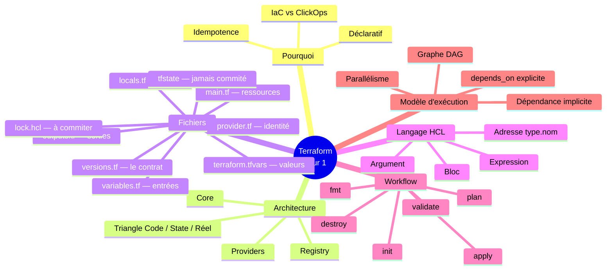

**Auto-évaluation avant de passer à la pratique.** Sans regarder, sauriez-vous répondre ?

1. Que se passe-t-il si je renomme `main.tf` en `zzz.tf` ?
2. Quelle est la différence entre `versions.tf` et `provider.tf` ?
3. Dans `resource "snowflake_database" "raw"`, quel est le nom créé dans Snowflake ?
4. Pourquoi `terraform validate` ne détecte-t-il pas un mauvais mot de passe ?
5. Quelle valeur gagne : `-var "env=UAT"` ou `environment = "DEV"` dans `terraform.tfvars` ?

*(Réponses en fin de document, section Quiz.)*

---
---
# PARTIE B — 🛠️ LABORATOIRE 1

## *Mon premier projet Terraform : Database + Schema + Warehouse*

> **Module source :** M01 — `labs/m01-iac-workflow/` · **Durée : 2 h 15** · Piste `[CORE]`

| Élément | Valeur |
|---|---|
| **Workspace** | `$HOME/Data2AI-Labs/data-platform` (le clone du Jour 0) |
| **Dossier de travail** | `labs/m01-iac-workflow/` |
| **Coût** | 1 warehouse X-SMALL, **initialement suspendu** — ≈ 0,00 $ |
| **Cleanup** | Conserver (`Reset-Lab.ps1` nettoie au redémarrage) |
| **Ressources créées** | 3 |

---

## B.0 — Mission métier

> **En tant que :** Data Platform Engineer
> **Je veux :** créer une zone RAW minimale (database + schema + warehouse) via Terraform
> **Afin de :** garantir un déploiement reproductible, relisible et sans credential exposé

**Architecture cible du lab :**

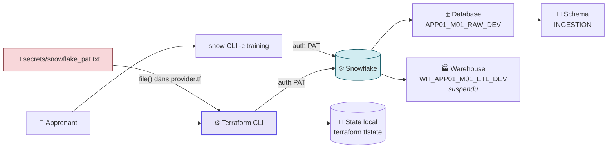

**Objectifs pédagogiques vérifiables :**

- ✅ créer une configuration Terraform depuis le clone du projet type ;
- ✅ authentifier le provider Snowflake avec un PAT sans placer de secret dans le code ;
- ✅ expliquer les blocs `terraform`, `required_providers`, `provider` et `resource` ;
- ✅ lire un plan avant application ;
- ✅ prouver la création des trois ressources ;
- ✅ vérifier l'idempotence avec un second plan.

---

## B.1 — 🚦 Pre-flight : préparer la session

> ⚠️ **Le point de friction n°1 de cette formation.** Les variables d'environnement **ne survivent pas** à la fermeture d'un terminal. Chaque **nouveau** terminal exige de rejouer `Learner-Login`. 90 % des messages « ça ne marche pas » viennent de là.

### Étape B.1.1 — Se connecter (mode Snowflake-only)

<details open>
<summary>🪟 <b>Windows (PowerShell)</b></summary>

```powershell
cd "$HOME\Data2AI-Labs\data-platform"
.\scripts\Learner-Login.ps1 -LearnerPrefix APP01 -SnowflakeOnly
```
</details>

<details>
<summary>🐧 <b>Linux/macOS (Bash)</b></summary>

```bash
cd "$HOME/Data2AI-Labs/data-platform"
source ./scripts/learner-login.sh APP01 --snowflake-only
```
</details>

**Ce que le script fait pour vous (Jours 1-3) :**

| Action | Pourquoi |
|---|---|
| Charge `TF_VAR_snowflake_token` depuis `secrets/snowflake_pat.txt` | Le PAT n'est jamais tapé à la main |
| Exporte `LEARNER_PREFIX` | Isolation entre apprenants dans le compte partagé |
| Ajoute `$HOME/.data2ai/bin` au `PATH` de la session | Rend `terraform` et `snow` appelables |
| **Ne touche pas à Azure** | Le backend Azure et Key Vault sont préconfigurés par le formateur et ne deviennent nécessaires qu'au Jour 2 (state distant) — le mode complet sans `-SnowflakeOnly` sera utilisé à ce moment-là |

### Étape B.1.2 — Repartir d'un état propre

```powershell
.\scripts\Reset-Lab.ps1 -LearnerPrefix APP01 -Lab M01
```

### Étape B.1.3 — Diagnostic pré-vol

```powershell
cd labs\m01-iac-workflow
..\..\scripts\Test-TerraformReady.ps1
```

✅ **Checkpoint 0 :** `Toolchain: READY`, `Snowflake Connection: READY`, `Workspace: CLEAN`.

> 💡 **`[WARN] TF_VAR_snowflake_token not set` est normal** : `provider.tf` lit le PAT directement depuis le fichier via `file()`. Ce WARN n'empêche pas `terraform plan` de fonctionner. Les `[WARN] ARM_* not set` sont également **normaux en Jours 1-3** : Azure n'est requis qu'à partir du backend distant (Jour 2).
>
> ⛔ En revanche, `[FAIL] LEARNER_PREFIX not set` signifie que **`Learner-Login -SnowflakeOnly` n'a pas été joué dans CE terminal**. Retournez à la racine et rejouez-le.

---

## B.2 — Étape 1 : explorer le terrain avant de construire

### 📝 Action 1.1 — Se placer dans le dossier du lab

<details open>
<summary>🪟 <b>Windows (PowerShell)</b></summary>

```powershell
cd "$HOME\Data2AI-Labs\data-platform\labs\m01-iac-workflow"
Get-ChildItem -Force
```
</details>

<details>
<summary>🐧 <b>Linux/macOS (Bash)</b></summary>

```bash
cd "$HOME/Data2AI-Labs/data-platform/labs/m01-iac-workflow"
ls -la
```
</details>

✅ **Checkpoint 1 :** vous voyez

```text
provider.tf                 ← pré-rempli, à examiner
versions.tf                 ← pré-rempli, à examiner
variables.tf                ← pré-rempli, à COMPLÉTER
terraform.tfvars.example    ← modèle à copier
main.tf                     ← stub vide, À ÉCRIRE
outputs.tf                  ← stub vide, À ÉCRIRE
.gitignore
```

> 🧠 **Rappel de la Partie A.** Terraform va concaténer **tous** ces `.tf` en une seule configuration. Il n'existe pas de fichier « principal » au sens technique.

**Votre plan de travail visualisé :**

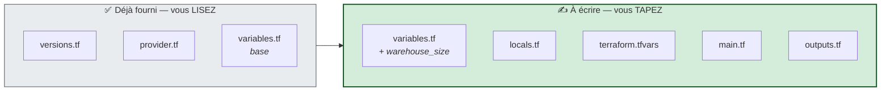

---

## B.3 — Étape 2 : lire le contrat (`versions.tf` et `provider.tf`)

### 📝 Action 2.1 — Examiner `versions.tf`

```powershell
code versions.tf
```

```hcl
terraform {
  required_version = "= 1.14.5"

  required_providers {
    snowflake = {
      source  = "snowflakedb/snowflake"
      version = "= 2.14.0"
    }
  }
}
```

**Lecture guidée — répondez mentalement :**

| Question | Réponse |
|---|---|
| Quelle version de Terraform est exigée ? | Exactement 1.14.5 |
| Qui publie le provider ? | Snowflake (`snowflakedb`), pas HashiCorp |
| Que se passe-t-il si j'ai Terraform 1.13 ? | Erreur bloquante dès `init` |
| Pourquoi `=` et pas `~>` ? | En salle, tous les apprenants doivent avoir un comportement identique. Voir `docs/version-policy.md` |
| Le mot `snowflake` à gauche de `= {` est-il imposé ? | Non, c'est un **alias local**. Mais il doit correspondre au préfixe des types de ressources (`snowflake_database`) |

### 📝 Action 2.2 — Examiner `provider.tf`

```powershell
code provider.tf
```

```hcl
locals {
  pat_file        = "${path.module}/../../secrets/snowflake_pat.txt"
  snowflake_token = try(trim(file(local.pat_file), "\n\r"), var.snowflake_token, "")
}

provider "snowflake" {
  organization_name = var.snowflake_organization
  account_name      = var.snowflake_account
  user              = var.snowflake_user
  authenticator     = "PROGRAMMATIC_ACCESS_TOKEN"
  token             = local.snowflake_token
}
```

**Lecture guidée du chemin du secret :**

```text
${path.module}/../../secrets/snowflake_pat.txt
      │          │  │
      │          │  └── remonte au dossier « labs/ »
      │          └───── remonte au dossier du lab
      └──────────────── = labs/m01-iac-workflow/

  ➡️  résultat : $HOME/Data2AI-Labs/data-platform/secrets/snowflake_pat.txt
```

**Le rôle de `try()` — une cascade de replis :**

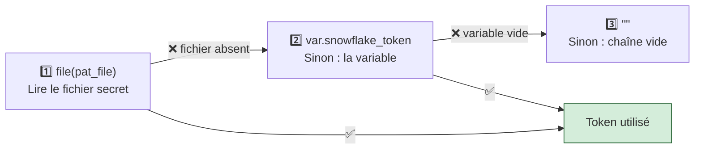

> 🔒 **Sécurité — vérifiez vous-même.** Le PAT n'apparaît nulle part dans le code. Faites la preuve :
> ```powershell
> Select-String -Path *.tf -Pattern "eyJ" 
> ```
> Aucun résultat attendu. C'est le contrôle que fera la CI au Jour 5.

### 📝 Action 2.3 — Examiner `variables.tf`

```powershell
code variables.tf
```

Le fichier contient déjà les variables partagées : `snowflake_organization`, `snowflake_account`, `snowflake_user`, `snowflake_token` (avec `sensitive = true` et `default = ""`), `learner_prefix` (avec validation regex) et `environment` (validé sur `DEV`/`UAT`/`PROD`).

### 📝 Action 2.4 — Initialiser et valider

```powershell
terraform fmt
terraform init
terraform validate
```

✅ **Checkpoint 2 :** `Terraform has been successfully initialized!` puis `Success! The configuration is valid.`

> 🔬 **Que vient-il de se passer ?** Observez le nouveau contenu du dossier :
> ```powershell
> Get-ChildItem -Force -Name
> ```
> Deux nouveautés :
> - `.terraform/` → le binaire du provider Snowflake, téléchargé depuis le Registry (plusieurs dizaines de Mo) ;
> - `.terraform.lock.hcl` → les versions exactes et leurs empreintes SHA256. **Ce fichier se commit.**
>
> Ouvrez-le : `code .terraform.lock.hcl`. Vous y lirez `version = "2.14.0"` et une liste de `hashes`. C'est le garant de la reproductibilité binaire.

---

## B.4 — Étape 3 : déclarer les paramètres et les noms

### 📝 Action 3.1 — Ajouter `warehouse_size` dans `variables.tf`

**Ajoutez à la fin du fichier** (ne modifiez pas les variables existantes) :

```hcl
variable "warehouse_size" {
  type        = string
  description = "Training warehouse size"
  default     = "X-SMALL"

  validation {
    condition     = contains(["X-SMALL", "SMALL"], var.warehouse_size)
    error_message = "Training warehouses must be X-SMALL or SMALL."
  }
}
```

> 💰 **Pourquoi cette validation ?** Un warehouse `4X-LARGE` coûte **128 fois** plus cher qu'un `X-SMALL` par seconde de calcul. Ce bloc `validation` est votre première **policy as code** : Terraform refuse la valeur **localement**, avant tout appel réseau. Zéro crédit consommé sur une faute de frappe.

### 📝 Action 3.2 — Créer `locals.tf`

```powershell
code locals.tf
```

```hcl
locals {
  database_name  = "${var.learner_prefix}_M01_RAW_${var.environment}"
  schema_name    = "INGESTION"
  warehouse_name = "WH_${var.learner_prefix}_M01_ETL_${var.environment}"
  common_comment = "Managed by Terraform | Training | ${var.learner_prefix}"
}
```

**Décomposition d'un nom généré :**

```text
  local.database_name  =  "${var.learner_prefix}_M01_RAW_${var.environment}"
                              │                   │    │      │
                              │                   │    │      └── DEV | UAT | PROD
                              │                   │    └───────── zone fonctionnelle
                              │                   └────────────── isolation par module
                              └────────────────────────────────── isolation par apprenant

  ➡️  avec learner_prefix = "APP01" et environment = "DEV" :
      APP01_M01_RAW_DEV
```

> 🧠 **Le modèle d'isolation à deux niveaux.** Tous les apprenants partagent **un seul compte Snowflake**. Le préfixe apprenant évite les collisions entre personnes ; le suffixe d'environnement reproduit l'isolation de production. Le segment `M01` isole en plus les labs entre eux, pour que M02 puisse être rejoué sans toucher M01.

### 📝 Action 3.3 — Créer `terraform.tfvars`

<details open>
<summary>🪟 <b>Windows (PowerShell)</b></summary>

```powershell
Copy-Item terraform.tfvars.example terraform.tfvars
code terraform.tfvars
```
</details>

<details>
<summary>🐧 <b>Linux/macOS (Bash)</b></summary>

```bash
cp terraform.tfvars.example terraform.tfvars
code terraform.tfvars
```
</details>

```hcl
snowflake_organization = "ZVFXOZW"
snowflake_account      = "PM71247"
snowflake_user         = "DATA2AI"
learner_prefix         = "APP01"
environment            = "DEV"
warehouse_size         = "X-SMALL"
```

**Remplacez `APP01` par VOTRE préfixe** (celui de votre `.env`).

> ⚠️ **Piège n°3, rappel.** Terraform lit `terraform.tfvars`, **pas** `.env`. Les deux fichiers vivent leur vie séparément. Si vous changez l'un, changez l'autre.

> 💡 **Où est le PAT ?** Nulle part ici. `provider.tf` le lit depuis `secrets/snowflake_pat.txt`. La variable `snowflake_token` reste à `""` — c'est voulu.

### 📝 Action 3.4 — Formater et valider

```powershell
terraform fmt
terraform validate
```

✅ **Checkpoint 3 :** `Success! The configuration is valid.`

> 🔬 **Expérience à faire (30 secondes).** Cassez volontairement une valeur pour voir la validation à l'œuvre :
> ```powershell
> terraform plan -var "warehouse_size=MEDIUM"
> ```
> Terraform refuse **avant** de contacter Snowflake, avec votre message d'erreur personnalisé. C'est le principe du *fail fast*.

---

## B.5 — Étape 4 : décrire l'infrastructure (`main.tf`)

### 📝 Action 4.1 — Écrire `main.tf`

**Remplacez tout le contenu du stub** par :

```hcl
resource "snowflake_database" "raw" {
  name                        = local.database_name
  comment                     = local.common_comment
  data_retention_time_in_days = 1
}

resource "snowflake_schema" "ingestion" {
  database = snowflake_database.raw.name
  name     = local.schema_name
  comment  = local.common_comment
}

resource "snowflake_warehouse" "etl" {
  name                = local.warehouse_name
  comment             = local.common_comment
  warehouse_size      = var.warehouse_size
  auto_suspend        = 60
  auto_resume         = true
  initially_suspended = true
}
```

### 🧠 Lecture guidée, argument par argument

**Ressource 1 — la database :**

| Argument | Valeur | Effet |
|---|---|---|
| `name` | `local.database_name` | Le nom réel dans Snowflake : `APP01_M01_RAW_DEV` |
| `comment` | `local.common_comment` | Traçabilité — permet de repérer les objets gérés par Terraform |
| `data_retention_time_in_days` | `1` | *Time Travel* limité à 1 jour → **coût de stockage minimal** |

**Ressource 2 — le schema, et LA ligne importante :**

```hcl
database = snowflake_database.raw.name
           └────────┬─────────┘ └┬─┘ └┬─┘
                    │            │    └── l'attribut lu
                    │            └─────── le nom local
                    └──────────────────── le type de ressource
```

> 🧠 **C'est ici que naît la dépendance implicite.** Terraform lit cette référence, en déduit que le schema **a besoin** de la database, et impose l'ordre de création. Si vous aviez écrit `database = "APP01_M01_RAW_DEV"` en dur, le lien serait invisible et Terraform pourrait tenter les deux en parallèle — échec garanti.

**Ressource 3 — le warehouse, et les trois arguments FinOps :**

| Argument | Valeur | 💰 Impact financier |
|---|---|---|
| `warehouse_size` | `X-SMALL` | 1 crédit/heure — la taille minimale |
| `auto_suspend` | `60` | Se met en veille après 60 s d'inactivité. **Snowflake facture à la seconde de calcul** |
| `auto_resume` | `true` | Se réveille automatiquement à la première requête |
| `initially_suspended` | `true` | **Naît endormi** — la création elle-même ne consomme rien |

> 💰 **Le calcul concret.** Sans `initially_suspended` et `auto_suspend`, un warehouse oublié tourne 24 h = 24 crédits ≈ **48 $**. Avec ces trois arguments, ce lab coûte **moins de 0,01 $**. C'est la différence entre une formation viable et une facture surprise.

### 📝 Action 4.2 — Écrire `outputs.tf`

```hcl
output "database_name" {
  value       = snowflake_database.raw.name
  description = "Database created by the learner"
}

output "schema_name" {
  value       = snowflake_schema.ingestion.name
  description = "Schema created inside the database"
}

output "warehouse_name" {
  value       = snowflake_warehouse.etl.name
  description = "Cost-controlled training warehouse"
}
```

> ❓ **« Pourquoi ne pas simplement afficher `local.database_name` ? »**
> Excellente question. `local.database_name` est ce que vous **vouliez**. `snowflake_database.raw.name` est ce que Snowflake a **effectivement** créé, lu depuis le state après l'apply. Pour une preuve, on lit toujours l'attribut de la ressource, jamais la variable d'entrée. Certains providers normalisent les noms (majuscules, troncature) — seul l'attribut dit la vérité.

### 📝 Action 4.3 — Formater et valider

```powershell
terraform fmt
terraform validate
```

✅ **Checkpoint 4 :** `Success! The configuration is valid.`

---

## B.6 — Étape 5 : planifier sans rien modifier

### 📝 Action 5.1 — Vérifier le pre-flight

```powershell
..\..\scripts\Test-TerraformReady.ps1
```

✅ **Checkpoint :** `READY`.

### 📝 Action 5.2 — Générer le plan

<details open>
<summary>🪟 <b>Windows (PowerShell)</b></summary>

```powershell
terraform plan -out "m01.tfplan"
```
</details>

<details>
<summary>🐧 <b>Linux/macOS (Bash)</b></summary>

```bash
terraform plan -out=m01.tfplan
```
</details>

> ⚠️ **Piège PowerShell.** Sous PowerShell, écrivez `-out "m01.tfplan"` (espace + guillemets). La forme `-out=m01.tfplan` déclenche une erreur de parsing du shell.

### 🧠 Lecture guidée du plan

```text
Terraform used the selected providers to generate the following execution
plan. Resource actions are indicated with the following symbols:
  + create

Terraform will perform the following actions:

  # snowflake_database.raw will be created
  + resource "snowflake_database" "raw" {
      + comment                     = "Managed by Terraform | Training | APP01"
      + data_retention_time_in_days = 1
      + id                          = (known after apply)     ← ①
      + name                        = "APP01_M01_RAW_DEV"     ← ②
    }

  # snowflake_schema.ingestion will be created
  + resource "snowflake_schema" "ingestion" {
      + database = "APP01_M01_RAW_DEV"                        ← ③
      + name     = "INGESTION"
    }

  # snowflake_warehouse.etl will be created
  + resource "snowflake_warehouse" "etl" {
      + auto_resume         = true
      + auto_suspend        = 60
      + initially_suspended = true
      + name                = "WH_APP01_M01_ETL_DEV"
      + warehouse_size      = "X-SMALL"
    }

Plan: 3 to add, 0 to change, 0 to destroy.                    ← ④
```

| Repère | Ce que ça vous apprend |
|:---:|---|
| ① | `(known after apply)` = valeur générée par Snowflake, inconnue avant l'exécution. **Normal**, pas une erreur |
| ② | L'interpolation a bien fonctionné : le préfixe et l'environnement sont résolus. **Vérifiez que c'est VOTRE préfixe** |
| ③ | Ici la valeur est **connue** avant l'apply, parce qu'elle dérive de `local.database_name`, une valeur statique |
| ④ | **La ligne à lire en premier.** `3 to add, 0 to change, 0 to destroy` — exactement ce qu'on attend |

✅ **Checkpoint 5 :** `Plan: 3 to add, 0 to change, 0 to destroy.`

> 🔒 **Sécurité.** Le fichier `m01.tfplan` est un binaire contenant **toutes** les valeurs résolues, y compris les valeurs sensibles. Il est couvert par `*.tfplan` dans `.gitignore`. Ne le commitez jamais et ne le partagez pas par e-mail.
>
> Pour l'inspecter en lisible : `terraform show m01.tfplan` ou `terraform show -json m01.tfplan`.

---

## B.7 — Étape 6 : appliquer après revue

> 🛑 **Rituel professionnel.** Avant tout `apply`, posez-vous trois questions :
> 1. Le nombre de ressources correspond-il à mon intention ?
> 2. Y a-t-il un `destroy` ou un `replace` que je n'ai pas demandé ?
> 3. Les noms contiennent-ils bien **mon** préfixe (et pas celui du voisin) ?

```powershell
terraform apply m01.tfplan
```

> 🔬 **Pourquoi aucune confirmation n'est demandée ?** Parce que vous appliquez un **plan déjà enregistré**. Terraform sait exactement quoi faire — la revue a eu lieu à l'étape précédente. C'est le mode utilisé en CI/CD : `plan` dans une étape, approbation humaine, puis `apply` du plan **figé** dans une autre. Un `terraform apply` sans argument, lui, replanifie et demande `yes`.

✅ **Checkpoint 6 :**

```text
Apply complete! Resources: 3 added, 0 changed, 0 destroyed.

Outputs:

database_name  = "APP01_M01_RAW_DEV"
schema_name    = "INGESTION"
warehouse_name = "WH_APP01_M01_ETL_DEV"
```

---

## B.8 — Étape 7 : prouver le résultat

> 🧠 **Principe pédagogique du parcours.** Une ressource n'est réputée créée que si vous en apportez la **preuve**, par au moins deux canaux indépendants : Terraform **et** Snowflake.

### 📝 Preuve 1 — Côté Terraform

```powershell
terraform output
terraform state list
```

✅ Trois adresses listées :

```text
snowflake_database.raw
snowflake_schema.ingestion
snowflake_warehouse.etl
```

> 🧠 Vous voyez ici les **adresses Terraform**, pas les noms Snowflake. Faites le rapprochement mental : `snowflake_database.raw` ↔ `APP01_M01_RAW_DEV`.

Pour voir le détail complet d'une ressource telle que Terraform la connaît :

```powershell
terraform state show snowflake_warehouse.etl
```

### 📝 Preuve 2 — Côté Snowflake (CLI)

Remplacez `APP01` par votre préfixe :

```powershell
snow sql -c training -q "SHOW DATABASES LIKE 'APP01_M01_RAW_DEV'"
snow sql -c training -q "SHOW SCHEMAS LIKE 'INGESTION' IN DATABASE APP01_M01_RAW_DEV"
snow sql -c training -q "SHOW WAREHOUSES LIKE 'WH_APP01_M01_ETL_DEV'"
```

### 📝 Preuve 3 — Côté Snowflake (interface Snowsight)

Connectez-vous à **https://app.snowflake.com** avec votre **username + password individuel** (fourni par le formateur — différent du PAT).

| # | Où regarder | Ce que vous devez voir |
|---|---|---|
| 1 | **Data → Databases** | `APP01_M01_RAW_DEV` |
| 2 | Cliquer sur la database | Le schema `INGESTION` |
| 3 | **Admin → Warehouses** | `WH_APP01_M01_ETL_DEV`, statut **`Suspended`** |

> 💰 Le statut `Suspended` est la **preuve visuelle** que `initially_suspended = true` a fonctionné. Un warehouse `Started` que personne n'utilise, c'est de l'argent qui brûle.

### 📝 Preuve 4 — L'idempotence

```powershell
terraform plan
```

✅ **Checkpoint 7 :**

```text
No changes. Your infrastructure matches the configuration.
```

> 🏆 **C'est LA preuve qui compte.** Elle démontre que :
> - votre code décrit fidèlement la réalité ;
> - le state est cohérent ;
> - vous pouvez rejouer ce projet autant de fois que vous voulez.
>
> **Aucun lab n'est considéré comme terminé sans ce `No changes.`**

---

## B.9 — 🐛 Chaos Lab : la dérive manuelle

> *En entreprise, quelqu'un finit toujours par « corriger vite fait » un objet dans l'interface web. Simulons-le.*

### Symptôme — injecter la dérive via Snowsight

1. Dans **Snowsight → Admin → Warehouses** ;
2. Sur `WH_APP01_M01_ETL_DEV` → **… (Options) → Edit** ;
3. Modifiez le champ **Comment** en `Modifié manuellement hors Terraform` ;
4. **Save**.

### Diagnostic — laisser Terraform détecter

```powershell
terraform plan
```

```text
  # snowflake_warehouse.etl will be updated in-place
  ~ resource "snowflake_warehouse" "etl" {
      ~ comment = "Modifié manuellement hors Terraform" -> "Managed by Terraform | Training | APP01"
        # (7 unchanged attributes hidden)
    }

Plan: 0 to add, 1 to change, 0 to destroy.
```

**Lisez le sens de la flèche :**

```text
  ~ comment = "valeur RÉELLE actuelle"  ->  "valeur DÉSIRÉE (votre code)"
                      ▲                              ▲
                      │                              │
             ce que Terraform a TROUVÉ     ce que Terraform va IMPOSER
             en interrogeant Snowflake     parce que c'est dans le code
```

> 🧠 **Le code fait autorité.** Terraform ne demande pas « qui a raison ? ». Le fichier `.tf` versionné dans Git **est** la vérité. Toute divergence est une anomalie à réconcilier. C'est le fondement du **GitOps**.

### Remédiation

```powershell
terraform apply -auto-approve
```

Rafraîchissez Snowsight : le commentaire est revenu à sa valeur officielle, **sans interruption de service**.

```powershell
terraform plan
```

✅ `No changes.` — la dérive est corrigée et l'idempotence rétablie.

> 🧠 **Ce que vous venez de découvrir** est le sujet central du **Jour 2** : la dérive, sa détection et sa correction — y compris quand la ressource n'a **jamais** été créée par Terraform.

---

## B.10 — 🤖 Validation automatisée

```powershell
cd "$HOME\Data2AI-Labs\data-platform"
.\scripts\SelfPacedLab.ps1 -Module 1 -All -Report
```

✅ **Résultat attendu :**

```text
[PASS] T1 versions.tf exists
[PASS] T1 Snowflake provider pinned
[PASS] T1 provider.tf uses profile
[PASS] T2 Required variables
[PASS] T3 Database resource
[PASS] T3 Schema resource
[PASS] T3 Cost-controlled warehouse
[PASS] T4 terraform fmt & validate
[PASS] T5 Idempotent plan evidence
Result: 5/5 Tasks Passed.
```

---

## B.11 — 🏆 Défi autonome (guidage 10 %)

> **Scénario :** ajoutez un output `resource_summary` qui regroupe les trois noms dans un **seul objet**.
>
> **Contraintes :**
> - `terraform fmt -check` réussit ;
> - `terraform validate` réussit ;
> - `terraform output resource_summary` affiche vos trois noms ;
> - `terraform plan` reste sans changement ;
> - aucun credential dans les `.tf` ni les `.tfvars`.

<details>
<summary>💡 <b>Indice</b> (ouvrez seulement si vous bloquez)</summary>

En HCL, un objet s'écrit avec des accolades et des paires `clé = valeur`. La valeur d'un `output` peut être n'importe quelle expression, y compris une structure de données.
</details>

<details>
<summary>✅ <b>Solution de référence</b></summary>

```hcl
output "resource_summary" {
  value = {
    database  = snowflake_database.raw.name
    schema    = snowflake_schema.ingestion.name
    warehouse = snowflake_warehouse.etl.name
  }
  description = "Vue consolidée des ressources M01"
}
```

```powershell
terraform apply -auto-approve
terraform output resource_summary
```

> 🔬 Notez que `terraform apply` est nécessaire : les outputs sont **stockés dans le state**, et n'existent qu'après une application.
</details>

| Critère d'évaluation | Points |
|---|---:|
| Syntaxe HCL et respect des standards | 30 |
| Preuve d'exécution fonctionnelle | 30 |
| Idempotence (`0 to add, 0 to change, 0 to destroy`) | 20 |
| Respect des budgets FinOps & Sécurité | 20 |
| **Total** | **100** |

---

## B.12 — 🧹 Nettoyage

> **M01 est un module de conservation.** N'exécutez **pas** `terraform destroy` : ces ressources servent de référence pour la suite.

Pour reprendre plus tard dans un nouveau terminal :

```powershell
cd "$HOME\Data2AI-Labs\data-platform"
.\scripts\Learner-Login.ps1 -LearnerPrefix APP01 -SnowflakeOnly
cd labs\m01-iac-workflow
terraform init
terraform plan
```

Pour repartir d'un état propre :

```powershell
.\scripts\Reset-Lab.ps1 -LearnerPrefix APP01 -Lab M01
```

---
---

# PARTIE C — 🛠️ LABORATOIRE 2

## *Professionnaliser : variables validées, locals, outputs structurés et `lifecycle`*

> **Module source :** M04 — `labs/m04-variables-outputs/` · **Durée : 1 h 45** · Piste `[CORE]`

| Élément | Valeur |
|---|---|
| **Dossier de travail** | `labs/m04-variables-outputs/` |
| **Autonomie** | ✅ Ce lab **ne dépend pas** de M01 — il crée ses propres ressources `M04` |
| **Coût** | Aucune nouvelle ressource persistante |
| **Cleanup** | Conserver |

---

## C.0 — Mission métier

> **En tant que :** Data Platform Engineer
> **Je veux :** structurer les variables Terraform avec validations, locals et outputs exploitables
> **Afin de :** garantir des environnements cohérents et reproductibles

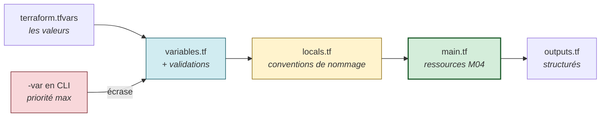

**Objectifs vérifiables :**

- ✅ ajouter des validations de variables pour rejeter les configurations invalides ;
- ✅ utiliser des `locals` pour centraliser les conventions de nommage ;
- ✅ exposer des outputs exploitables par d'autres modules ;
- ✅ **démontrer expérimentalement** la précédence des variables ;
- ✅ tester `lifecycle` et `prevent_destroy`.

---

## C.1 — Étape 1 : la base de départ

### 📝 Action 1.1 — Se placer dans le lab

<details open>
<summary>🪟 <b>Windows (PowerShell)</b></summary>

```powershell
cd "$HOME\Data2AI-Labs\data-platform"
.\scripts\Reset-Lab.ps1 -LearnerPrefix APP01 -Lab M04
cd labs\m04-variables-outputs
Get-ChildItem -Force
```
</details>

<details>
<summary>🐧 <b>Linux/macOS (Bash)</b></summary>

```bash
cd "$HOME/Data2AI-Labs/data-platform"
./scripts/reset-lab.sh APP01 M04
cd labs/m04-variables-outputs
ls -la
```
</details>

### 📝 Action 1.2 — Reproduire la base M01, en version M04

Vous refaites volontairement les mêmes gestes qu'au Lab 1 : **la répétition espacée est le meilleur ancrage mémoriel**. Cette fois, allez plus vite.

**`variables.tf` — ajoutez à la fin :**

```hcl
variable "warehouse_size" {
  type        = string
  description = "Training warehouse size"
  default     = "X-SMALL"

  validation {
    condition     = contains(["X-SMALL", "SMALL"], var.warehouse_size)
    error_message = "Training warehouses must be X-SMALL or SMALL."
  }
}
```

**`locals.tf` — créez :**

```hcl
locals {
  database_name  = "${var.learner_prefix}_M04_RAW_${var.environment}"
  schema_name    = "INGESTION"
  warehouse_name = "WH_${var.learner_prefix}_M04_ETL_${var.environment}"
  common_comment = "Managed by Terraform | Training | ${var.learner_prefix}"
}
```

**`terraform.tfvars` — copiez l'exemple puis complétez :**

```hcl
snowflake_organization = "ZVFXOZW"
snowflake_account      = "PM71247"
snowflake_user         = "DATA2AI"
learner_prefix         = "APP01"
environment            = "DEV"
warehouse_size         = "X-SMALL"
```

**`main.tf` :**

```hcl
resource "snowflake_database" "raw" {
  name                        = local.database_name
  comment                     = local.common_comment
  data_retention_time_in_days = 1
}

resource "snowflake_schema" "ingestion" {
  database = snowflake_database.raw.name
  name     = local.schema_name
  comment  = local.common_comment
}

resource "snowflake_warehouse" "etl" {
  name                = local.warehouse_name
  comment             = local.common_comment
  warehouse_size      = var.warehouse_size
  auto_suspend        = 60
  auto_resume         = true
  initially_suspended = true
}
```

**`outputs.tf` :**

```hcl
output "database_name" {
  value       = snowflake_database.raw.name
  description = "Database created by the learner"
}

output "schema_name" {
  value       = snowflake_schema.ingestion.name
  description = "Schema created inside the database"
}

output "warehouse_name" {
  value       = snowflake_warehouse.etl.name
  description = "Cost-controlled training warehouse"
}
```

### 📝 Action 1.3 — Dérouler le workflow

```powershell
terraform fmt
terraform init
terraform validate
terraform plan -out "m04.tfplan"
terraform apply m04.tfplan
terraform state list
```

✅ **Checkpoint 1 :** `Apply complete! Resources: 3 added, 0 changed, 0 destroyed.` puis 3 adresses listées.

---

## C.2 — Étape 2 : enrichir les variables (les valeurs en dur disparaissent)

### 🧠 Le problème à résoudre

Relisez votre `main.tf`. Deux valeurs sont **en dur** :

```hcl
data_retention_time_in_days = 1     # ← magie noire : pourquoi 1 ?
auto_suspend                = 60    # ← magie noire : pourquoi 60 ?
```

Ces « nombres magiques » sont un anti-pattern : impossible à ajuster par environnement, impossible à documenter, impossible à contraindre.

**Objectif :** les transformer en variables **typées, documentées et validées**.

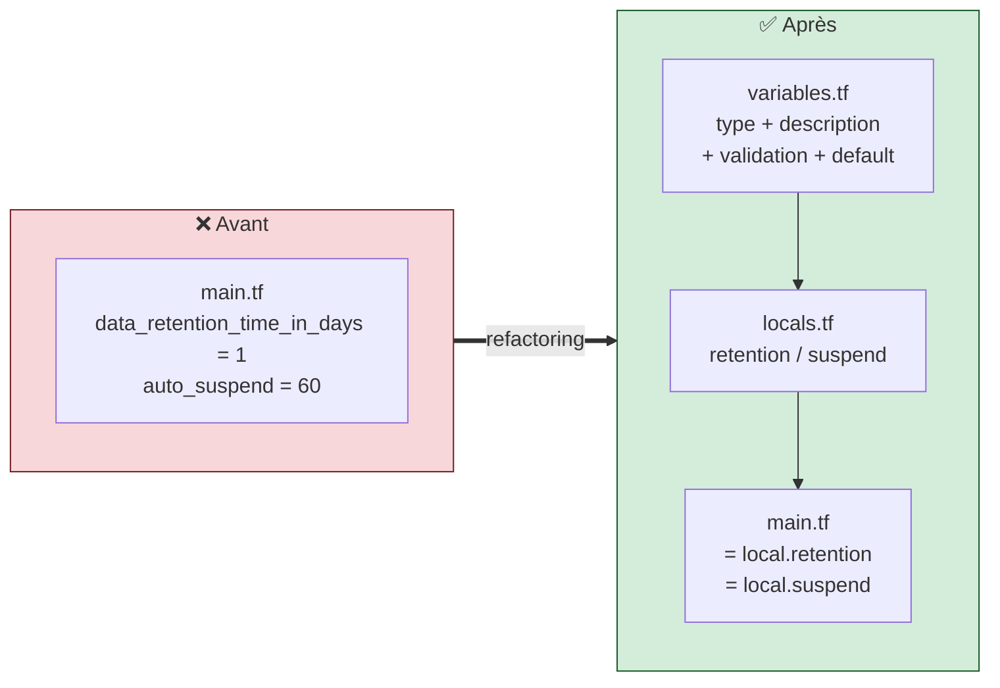

### 📝 Action 2.1 — Ajouter trois variables dans `variables.tf`

**Ajoutez à la fin** (ne touchez pas aux existantes) :

```hcl
variable "data_retention_days" {
  type        = number
  description = "Number of days to retain data for time travel"
  default     = 1

  validation {
    condition     = var.data_retention_days >= 0 && var.data_retention_days <= 90
    error_message = "data_retention_days must be between 0 and 90."
  }
}

variable "auto_suspend_seconds" {
  type        = number
  description = "Seconds of inactivity before the warehouse auto-suspends"
  default     = 60

  validation {
    condition     = var.auto_suspend_seconds >= 60 && var.auto_suspend_seconds <= 3600
    error_message = "auto_suspend_seconds must be between 60 and 3600."
  }
}

variable "tags" {
  type        = map(string)
  description = "Resource tags for cost allocation"
  default = {
    project     = "data-platform"
    managed_by  = "terraform"
    environment = "DEV"
  }
}
```

**Analyse des trois nouvelles variables :**

| Variable | Type | Validation | Pourquoi cette borne ? |
|---|---|---|---|
| `data_retention_days` | `number` | 0 à 90 | 💰 Le *Time Travel* Snowflake facture le stockage historique. 90 j est le maximum en édition Enterprise |
| `auto_suspend_seconds` | `number` | 60 à 3600 | 💰 En dessous de 60 s, le warehouse redémarre en permanence (mauvaises performances). Au-dessus d'1 h, il brûle des crédits pour rien |
| `tags` | `map(string)` | — | Première **structure de données** : un dictionnaire clé → valeur, pour l'allocation de coûts |

> 🎓 **Point d'examen — les types.** `string`, `number`, `bool` sont les types **primitifs**. `list(T)`, `set(T)`, `map(T)` sont les types **collection**. `object({...})` et `tuple([...])` sont les types **structurels**. `any` désactive la vérification — à éviter.

### 📝 Action 2.2 — Remplacer `locals.tf`

**Remplacez tout le contenu** par :

```hcl
locals {
  database_name  = "${var.learner_prefix}_M04_RAW_${var.environment}"
  schema_name    = "INGESTION"
  warehouse_name = "WH_${var.learner_prefix}_M04_ETL_${var.environment}"
  common_comment = "Managed by Terraform | Training | ${var.learner_prefix}"

  retention = var.data_retention_days
  suspend   = var.auto_suspend_seconds
}
```

> ❓ **« Pourquoi passer par un local si le local ne fait que recopier la variable ? »**
> Bonne objection, et elle mérite une réponse honnête : **ici, ce local n'apporte rien de plus qu'un alias.** Sa valeur est pédagogique et anticipatrice : le jour où la règle devient conditionnelle, vous ne modifiez que `locals.tf`, jamais `main.tf` :
> ```hcl
> retention = var.environment == "PROD" ? 30 : var.data_retention_days
> suspend   = var.environment == "PROD" ? 300 : var.auto_suspend_seconds
> ```
> **La règle de conception :** `main.tf` décrit *quoi* créer. `locals.tf` porte la *logique*. Séparer les deux, c'est ce qui rendra le Jour 3 (modules) possible.

### 📝 Action 2.3 — Remplacer `main.tf`

```hcl
resource "snowflake_database" "raw" {
  name                        = local.database_name
  comment                     = local.common_comment
  data_retention_time_in_days = local.retention
}

resource "snowflake_schema" "ingestion" {
  database = snowflake_database.raw.name
  name     = local.schema_name
  comment  = local.common_comment
}

resource "snowflake_warehouse" "etl" {
  name                = local.warehouse_name
  comment             = local.common_comment
  warehouse_size      = var.warehouse_size
  auto_suspend        = local.suspend
  auto_resume         = true
  initially_suspended = true
}
```

### 📝 Action 2.4 — Vérifier le refactoring

```powershell
terraform fmt
terraform validate
terraform plan
```

✅ **Checkpoint 2 :** `No changes.`

> 🏆 **C'est le résultat le plus important de cette étape.** Vous venez de **refactorer** votre code — le rendre plus propre et plus paramétrable — **sans aucun impact sur l'infrastructure**. Les `default` (1 et 60) reproduisent exactement les anciennes valeurs en dur.
>
> **C'est la définition professionnelle d'un refactoring réussi : le comportement ne change pas.**
>
> ⚠️ Si le plan montre des changements, vos `default` ne correspondent pas aux anciennes valeurs. Corrigez-les.

---

## C.3 — Étape 3 : des outputs exploitables

### 📝 Action 3.1 — Remplacer `outputs.tf`

```hcl
output "database_name" {
  value       = snowflake_database.raw.name
  description = "Database created by the learner"
}

output "schema_name" {
  value       = snowflake_schema.ingestion.name
  description = "Schema created inside the database"
}

output "warehouse_name" {
  value       = snowflake_warehouse.etl.name
  description = "Cost-controlled training warehouse"
}

output "resource_summary" {
  value = {
    database  = snowflake_database.raw.name
    schema    = snowflake_schema.ingestion.name
    warehouse = snowflake_warehouse.etl.name
  }
  description = "Summary of all created resources"
}

output "connection_info" {
  value = {
    organization = var.snowflake_organization
    account      = var.snowflake_account
    user         = var.snowflake_user
    role         = "SYSADMIN"
  }
  description = "Snowflake connection used for this deployment"
  sensitive   = false
}
```

### 🧠 Trois niveaux de maturité d'un output

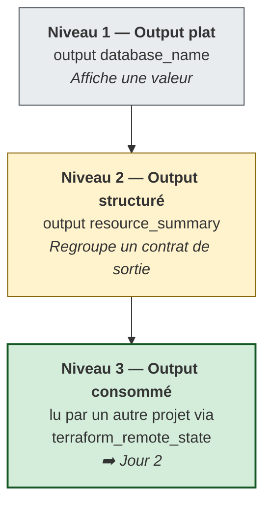

> 🔒 **Attention à `connection_info`.** Il expose l'organisation, le compte et l'utilisateur. Ce ne sont pas des secrets, mais ce sont des **informations d'identification d'infrastructure**. En production, on ne publierait pas cela dans un output non protégé. Ici, `sensitive = false` est un choix **explicite et assumé**, pas un oubli — c'est la différence entre une décision et une négligence.

### 📝 Action 3.2 — Appliquer et lire

```powershell
terraform fmt
terraform validate
terraform apply -auto-approve
terraform output
terraform output resource_summary
terraform output -json | ConvertFrom-Json
```

✅ **Checkpoint 3 :** `resource_summary` et `connection_info` s'affichent avec vos valeurs.

> 🔬 `terraform output -json` est la forme **machine** : c'est ainsi qu'un pipeline CI/CD récupère une valeur pour l'étape suivante. Vous l'utiliserez au Jour 5.

---

## C.4 — Étape 4 : 🎓 démontrer la précédence des variables

> **C'est l'étape la plus « examen » de la journée.** Vous n'allez pas apprendre la précédence par cœur : vous allez la **prouver expérimentalement**.

**Le classement à valider (du plus fort au plus faible) :**

| Rang | Source | Vous allez le tester ? |
|---:|---|:---:|
| 1 | `-var` en ligne de commande | ✅ |
| 2 | `-var-file` en ligne de commande | — (Jour 3) |
| 3 | `*.auto.tfvars` | — |
| 4 | `terraform.tfvars.json` | — |
| 5 | `terraform.tfvars` | ✅ (référence) |
| 6 | `TF_VAR_<nom>` (environnement) | — |
| 7 | `default` du bloc `variable` | ✅ |

### 📝 Action 4.1 — Établir la référence

```powershell
terraform plan
```

✅ `No changes.` — la valeur active vient de `terraform.tfvars` (`X-SMALL`).

### 📝 Action 4.2 — `-var` écrase `terraform.tfvars`

```powershell
terraform plan -var "warehouse_size=SMALL"
```

✅ **Checkpoint :**

```text
  ~ resource "snowflake_warehouse" "etl" {
      ~ warehouse_size = "X-SMALL" -> "SMALL"
    }
Plan: 0 to add, 1 to change, 0 to destroy.
```

> 🧠 **Vous venez de prouver le rang 1 > rang 5.** `terraform.tfvars` contient `X-SMALL`, mais `-var` a gagné.
> ⚠️ Vous n'avez **rien appliqué** — c'est un plan, en lecture seule. Le warehouse est toujours en `X-SMALL`.

### 📝 Action 4.3 — `-var` écrase aussi un `default`

```powershell
terraform plan -var "data_retention_days=7"
```

✅ Le plan propose `data_retention_time_in_days = 1 -> 7`.

> 🧠 **Vous venez de prouver le rang 1 > rang 7.** La variable `data_retention_days` n'est **pas** dans `terraform.tfvars` : sa valeur active venait donc de son `default = 1`.

### 📝 Action 4.4 — Vérifier que rien n'a changé

```powershell
terraform plan
```

✅ **Checkpoint 4 :** `No changes.`

> 🔬 **La leçon.** L'option `-var` est **éphémère** : elle ne vaut que pour cette invocation. Elle ne modifie aucun fichier. C'est un outil de test, **pas** un moyen de configurer un environnement. Les fichiers `.tfvars` par environnement (DEV/UAT/PROD) arrivent au **Jour 3 / M08**.

> ⚠️ **Piège classique n°8 — le plus dangereux en équipe.** Un collègue lance `terraform apply -var "warehouse_size=LARGE"` pour « tester ». L'infrastructure change, mais **le dépôt Git ne le reflète pas**. Au prochain `apply` de quelqu'un d'autre, Terraform ramène la valeur du fichier — et le mystère commence. **Règle d'or : `-var` pour planifier, jamais pour appliquer en production.**

---

## C.5 — Étape 5 : le méta-argument `lifecycle`

### 📝 Action 5.1 — Protéger le warehouse

Dans `main.tf`, ajoutez un bloc `lifecycle` **à l'intérieur** de la ressource warehouse :

```hcl
resource "snowflake_warehouse" "etl" {
  name                = local.warehouse_name
  comment             = local.common_comment
  warehouse_size      = var.warehouse_size
  auto_suspend        = local.suspend
  auto_resume         = true
  initially_suspended = true

  lifecycle {
    prevent_destroy = true
  }
}
```

### 📝 Action 5.2 — Tenter la destruction

```powershell
terraform plan -destroy
```

✅ **Checkpoint :**

```text
Error: Instance cannot be destroyed

  on main.tf line 16:
  16: resource "snowflake_warehouse" "etl" {

Resource snowflake_warehouse.etl has lifecycle.prevent_destroy set, but the
plan calls for this resource to be destroyed. To avoid this error and continue
with the plan, either disable lifecycle.prevent_destroy or reduce the scope of
the plan using the -target option.
```

> 🧠 **Observez la nature de l'erreur.** Terraform **refuse de produire le plan**. Il n'a même pas appelé Snowflake. `prevent_destroy` est un garde-fou **côté configuration**, évalué localement.
>
> 🔬 **Nuance importante à connaître :** `prevent_destroy` ne protège pas contre tout. Si vous **supprimez le bloc `resource`** de votre code, Terraform ne peut plus lire son `lifecycle` — et la ressource est détruite sans avertissement. Le garde-fou protège contre un `destroy` ou un `replace` **de la ressource déclarée**, pas contre la suppression du code lui-même.

### 📝 Action 5.3 — Retirer la protection

Pour permettre le nettoyage de fin de formation, **supprimez le bloc `lifecycle`** :

```hcl
resource "snowflake_warehouse" "etl" {
  name                = local.warehouse_name
  comment             = local.common_comment
  warehouse_size      = var.warehouse_size
  auto_suspend        = local.suspend
  auto_resume         = true
  initially_suspended = true
}
```

```powershell
terraform fmt
terraform validate
terraform plan
```

✅ **Checkpoint 5 :** `No changes.`

### 🧠 Les autres arguments de `lifecycle` — à connaître pour l'examen

| Argument | Comportement | Exemple concret |
|---|---|---|
| `create_before_destroy = true` | Crée le remplaçant **avant** de détruire l'ancien | Éviter une coupure lors du remplacement d'un warehouse |
| `ignore_changes = [comment]` | Terraform cesse de « corriger » cet attribut | Un champ que le tag manager modifie légitimement |
| `ignore_changes = all` | Ignore toute dérive | ⚠️ À réserver aux migrations, jamais en régime permanent |
| `replace_triggered_by = [x]` | Force le remplacement quand `x` change | Dépendance non exprimable côté API |
| `precondition { }` | Assertion vérifiée **au plan** | « ce module exige un warehouse X-SMALL en DEV » |
| `postcondition { }` | Assertion vérifiée **après l'apply** | « l'ID retourné n'est pas vide » |

---

## C.6 — 🐛 Chaos Lab : la validation comme garde-fou FinOps

### Symptôme — injecter une valeur interdite

```powershell
terraform plan -var "warehouse_size=MEDIUM"
```

### Diagnostic — observer où le blocage se produit

```text
Error: Invalid value for variable

  on variables.tf line 42:
  42: variable "warehouse_size" {

Training warehouses must be X-SMALL or SMALL.

This was checked by the validation rule at variables.tf:47,3-13.
```

```mermaid
flowchart LR
    U["👤 terraform plan<br/>-var warehouse_size=MEDIUM"]
    V{"🛡️ Bloc validation<br/>évalué LOCALEMENT"}
    ERR["❌ Erreur immédiate<br/>0 appel réseau<br/>0 crédit consommé"]
    NET["🌐 Appel API Snowflake"]

    U --> V
    V -->|"❌ MEDIUM hors liste autorisée"| ERR
    V -->|"✅ valeur admise"| NET

    style ERR fill:#f8d7da,stroke:#721c24,stroke-width:2px
    style V fill:#fff3cd,stroke:#856404,stroke-width:2px
```

> 💰 **La leçon FinOps.** Le blocage a lieu **avant** tout appel réseau. C'est le principe du *shift-left* : détecter l'erreur au plus tôt, au plus près du développeur, au coût le plus faible. Au Jour 5, ce même principe s'applique à l'échelle de l'organisation avec la *policy as code* (OPA / Sentinel).

### Remédiation — un second test

```powershell
terraform plan -var "environment=STAGING"
```

La validation regex de `environment` rejette toute valeur hors de `DEV`, `UAT`, `PROD`.

> 🧠 **Le message d'erreur est votre documentation.** Un `error_message` bien rédigé dit **quoi faire**, pas seulement ce qui est faux. Comparez :
> - ❌ `"Invalid value"` — l'utilisateur reste bloqué ;
> - ✅ `"Training warehouses must be X-SMALL or SMALL."` — l'utilisateur corrige seul en 5 secondes.

---

## C.7 — 🤖 Validation automatisée

```powershell
cd "$HOME\Data2AI-Labs\data-platform"
.\scripts\SelfPacedLab.ps1 -Module 4 -All -Report
```

✅ **Résultat attendu :**

```text
[PASS] T1 variables.tf with strict types
[PASS] T2 Validation blocks (warehouse_size, environment)
[PASS] T3 locals.tf naming convention
[PASS] T4 outputs.tf structured
[PASS] T5 terraform fmt & validate
Result: 5/5 Tasks Passed.
```

---

## C.8 — 🏆 Défi autonome (guidage 10 %)

> **Scénario :** ajoutez une variable `enable_monitoring` (booléen, défaut `false`) et un output `monitoring_enabled` qui reflète sa valeur. Ajoutez une **validation croisée** qui refuse `true` en PROD si le warehouse est `X-SMALL`.
>
> **Contraintes :**
> - `terraform validate` réussit ;
> - `terraform output monitoring_enabled` affiche `false` en DEV ;
> - `terraform plan -var "enable_monitoring=true"` fonctionne en DEV ;
> - la validation refuse `enable_monitoring=true` **avec** `warehouse_size=X-SMALL` **en** PROD.

<details>
<summary>💡 <b>Indice n°1</b></summary>

Un bloc `validation` classique ne peut référencer **que sa propre variable** (`var.enable_monitoring`). Pour croiser plusieurs variables, il faut un autre mécanisme : le bloc `lifecycle { precondition { … } }` d'une ressource, ou une `check` block (Terraform ≥ 1.5).
</details>

<details>
<summary>💡 <b>Indice n°2</b></summary>

Écrivez la condition en français d'abord : *« il est interdit d'avoir simultanément monitoring activé ET environnement PROD ET warehouse X-SMALL »*. Puis traduisez : `!(A && B && C)`.
</details>

<details>
<summary>✅ <b>Solution de référence</b></summary>

**`variables.tf` :**

```hcl
variable "enable_monitoring" {
  type        = bool
  description = "Enable resource monitoring on the training warehouse"
  default     = false
}
```

**`main.tf` — precondition sur le warehouse :**

```hcl
resource "snowflake_warehouse" "etl" {
  name                = local.warehouse_name
  comment             = local.common_comment
  warehouse_size      = var.warehouse_size
  auto_suspend        = local.suspend
  auto_resume         = true
  initially_suspended = true

  lifecycle {
    precondition {
      condition = !(
        var.enable_monitoring &&
        var.environment == "PROD" &&
        var.warehouse_size == "X-SMALL"
      )
      error_message = "Un warehouse X-SMALL ne peut pas porter le monitoring en PROD. Passez en SMALL ou désactivez enable_monitoring."
    }
  }
}
```

**`outputs.tf` :**

```hcl
output "monitoring_enabled" {
  value       = var.enable_monitoring
  description = "Indique si le monitoring est activé sur ce déploiement"
}
```

**Tests de validation :**

```powershell
terraform validate
terraform apply -auto-approve
terraform output monitoring_enabled                          # → false
terraform plan -var "enable_monitoring=true"                 # → OK en DEV
terraform plan -var "enable_monitoring=true" -var "environment=PROD" -var "warehouse_size=X-SMALL"
# → Error: Resource precondition failed
```

> ⚠️ Pensez à **retirer** la `precondition` (ou à repasser en DEV) avant le nettoyage.
</details>

| Critère d'évaluation | Points |
|---|---:|
| Syntaxe HCL et respect des standards | 30 |
| Preuve d'exécution fonctionnelle | 30 |
| Idempotence | 20 |
| Respect des budgets FinOps & Sécurité | 20 |
| **Total** | **100** |

---

## C.9 — 🧹 Nettoyage

Conservez les ressources pour inspection. Pour repartir d'un état propre :

```powershell
cd "$HOME\Data2AI-Labs\data-platform"
.\scripts\Reset-Lab.ps1 -LearnerPrefix APP01 -Lab M04
```

---
---
# PARTIE D — 📚 CONSOLIDATION

---

## D.1 — 🎓 Quiz de fin de journée (style Terraform Associate 003)

*Répondez sans regarder vos notes. Corrigé juste après.*

---

**Q1.** Terraform lit les fichiers de configuration :

- A. uniquement `main.tf`
- B. tous les fichiers `.tf` du répertoire courant, sans récursion
- C. tous les fichiers `.tf` du répertoire courant **et** de ses sous-répertoires
- D. les fichiers listés dans `terraform.tfvars`

---

**Q2.** Dans `resource "snowflake_database" "raw" { name = "APP01_RAW" }`, le nom de la base créée dans Snowflake est :

- A. `raw`
- B. `snowflake_database.raw`
- C. `APP01_RAW`
- D. `snowflake_database`

---

**Q3.** Quelle commande **doit** être relancée après avoir ajouté un nouveau provider dans `required_providers` ?

- A. `terraform validate`
- B. `terraform plan`
- C. `terraform init`
- D. `terraform fmt`

---

**Q4.** Parmi ces sources, laquelle a la **plus haute** priorité pour une variable ?

- A. `terraform.tfvars`
- B. `TF_VAR_environment`
- C. `-var "environment=UAT"` sur la ligne de commande
- D. `default` dans le bloc `variable`

---

**Q5.** Que signifie `-/+` dans la sortie d'un `terraform plan` ?

- A. La ressource sera modifiée sur place
- B. La ressource sera détruite **puis** recréée
- C. La ressource sera créée **puis** l'ancienne détruite
- D. La ressource sera lue seulement

---

**Q6.** Quel fichier **doit** être commité dans Git ?

- A. `terraform.tfstate`
- B. `.terraform.lock.hcl`
- C. `terraform.tfvars`
- D. `m01.tfplan`

---

**Q7.** Terraform crée une dépendance implicite entre deux ressources lorsque :

- A. elles sont déclarées dans le même fichier
- B. l'une référence un attribut de l'autre
- C. elles utilisent le même provider
- D. `depends_on` est déclaré

---

**Q8.** `terraform validate` détecte :

- A. qu'un mot de passe Snowflake est incorrect
- B. qu'un nom de database existe déjà côté Snowflake
- C. qu'un argument obligatoire est absent d'un bloc `resource`
- D. que le warehouse va coûter trop cher

---

**Q9.** Un bloc `validation` dans une `variable` est évalué :

- A. après l'appel à l'API du provider
- B. localement, avant tout appel réseau
- C. uniquement pendant `terraform apply`
- D. uniquement en CI/CD

---

**Q10.** `sensitive = true` sur un output :

- A. chiffre la valeur dans le state
- B. masque la valeur à l'affichage, mais elle reste en clair dans le state
- C. empêche l'écriture de la valeur dans le state
- D. supprime la valeur après l'apply

---

**Q11.** Que fait `terraform plan` sur l'infrastructure réelle ?

- A. Il crée les ressources manquantes
- B. Il ne modifie rien : il lit et compare
- C. Il détruit les ressources non déclarées
- D. Il met à jour uniquement les tags

---

**Q12.** Quelle contrainte de version accepte `2.14.7` mais **pas** `2.15.0` ?

- A. `>= 2.14.0`
- B. `~> 2.14.0`
- C. `~> 2.14`
- D. `!= 2.15.0`

---

**Q13.** `lifecycle { prevent_destroy = true }` :

- A. empêche toute modification de la ressource
- B. fait échouer le plan si celui-ci prévoit de détruire la ressource
- C. crée une sauvegarde avant destruction
- D. supprime la ressource du state sans la détruire

---

**Q14.** La différence entre `variable` et `local` :

- A. aucune, ce sont des synonymes
- B. un `local` peut être surchargé par `-var`, pas une `variable`
- C. une `variable` est un paramètre d'entrée surchargeable ; un `local` est une valeur interne calculée
- D. un `local` est stocké dans le state, pas une `variable`

---

**Q15.** Où se trouve le nom du provider Snowflake officiel ?

- A. `hashicorp/snowflake`
- B. `snowflakedb/snowflake`
- C. `terraform/snowflake`
- D. `snowflake/terraform`

---

### ✅ Corrigé détaillé

| # | Réponse | Explication |
|:---:|:---:|---|
| **1** | **B** | Terraform charge tous les `.tf` du dossier courant et les concatène. Il **ne descend pas** dans les sous-dossiers — ceux-ci ne sont lus que via un bloc `module`. |
| **2** | **C** | `"raw"` est le **nom local** Terraform, un simple libellé. Le nom réel est la valeur de l'argument `name`. |
| **3** | **C** | `init` télécharge les plugins et met à jour `.terraform.lock.hcl`. Sans lui, Core ignore le nouveau type de ressource. |
| **4** | **C** | La ligne de commande est prioritaire sur tout : `-var` > `-var-file` > `*.auto.tfvars` > `terraform.tfvars` > `TF_VAR_*` > `default`. |
| **5** | **B** | `-/+` = *destroy then create* (remplacement). `+/-` = *create then destroy* (avec `create_before_destroy`). 🔴 Risque de perte de données. |
| **6** | **B** | Le lock file garantit la reproductibilité binaire des providers. Les trois autres contiennent des secrets ou de l'état. |
| **7** | **B** | La référence à un attribut (`snowflake_database.raw.name`) crée l'arête du graphe. `depends_on` sert aux dépendances **explicites**, quand aucune référence n'existe. |
| **8** | **C** | `validate` est une vérification **hors ligne** : syntaxe, types, références internes. Il ne contacte aucune API. |
| **9** | **B** | C'est tout l'intérêt : *fail fast*, zéro appel réseau, zéro crédit consommé. |
| **10** | **B** | `sensitive` est un masque d'affichage. Le state contient toujours la valeur en clair — d'où la nécessité de le protéger (Jour 2). |
| **11** | **B** | `plan` est en **lecture seule**. Il rafraîchit le state en mémoire et affiche un diff. |
| **12** | **B** | `~> 2.14.0` libère le **dernier** chiffre : 2.14.x uniquement. `~> 2.14` libère le mineur : 2.x. |
| **13** | **B** | Terraform refuse de **produire le plan**, avec une erreur, avant tout appel réseau. |
| **14** | **C** | Un `local` n'est jamais surchargeable de l'extérieur ; il peut référencer variables, autres locals et fonctions. |
| **15** | **B** | Le provider Snowflake est publié par Snowflake (*partner tier*), pas par HashiCorp. |

**Barème :** 12/15 ou plus → vous êtes prêt pour le Jour 2. Moins de 10 → relisez la Partie A avant de continuer.

---

### ✅ Réponses aux 5 questions d'auto-évaluation de la Partie A

1. **Renommer `main.tf` en `zzz.tf`** → rien ne change. Terraform lit tous les `.tf`. C'est une convention humaine, pas une contrainte technique.
2. **`versions.tf` vs `provider.tf`** → `versions.tf` dit *quel plugin et quelle version*. `provider.tf` dit *quel compte et quelle identité*. Le premier change rarement, le second change entre DEV et PROD.
3. **Le nom Snowflake** → la valeur de l'argument `name`, pas le label `"raw"`.
4. **Pourquoi `validate` ne voit pas un mauvais mot de passe** → parce qu'il ne fait **aucun appel réseau**. Seul `plan` authentifie réellement.
5. **`-var "env=UAT"` gagne** → la ligne de commande est au rang 1, `terraform.tfvars` au rang 5.

---

## D.2 — 🃏 Anti-sèche Jour 1

### Les commandes

```bash
# ── Cycle quotidien ──────────────────────────────────────────
terraform fmt                       # reformate au standard
terraform fmt -check -recursive     # mode CI : échoue si mal formaté
terraform init                      # providers + backend + modules
terraform init -upgrade             # met à jour le lock file
terraform validate                  # syntaxe & cohérence (hors ligne)
terraform plan                      # aperçu du diff
terraform plan -out "x.tfplan"      # plan figé (PowerShell : espace + guillemets)
terraform apply x.tfplan            # applique un plan figé, sans confirmation
terraform apply                     # replanifie + demande « yes »
terraform apply -auto-approve       # ⚠️ sans confirmation
terraform destroy                   # supprime tout le périmètre géré

# ── Inspection ───────────────────────────────────────────────
terraform state list                     # adresses gérées
terraform state show <adresse>           # détail d'une ressource
terraform output                         # tous les outputs
terraform output -json                   # forme machine
terraform show                           # state en lisible
terraform show -json <plan>              # plan en JSON
terraform console                        # REPL d'expressions
terraform providers                      # arbre des providers utilisés
terraform version                        # versions core + providers

# ── Variables ────────────────────────────────────────────────
terraform plan -var "k=v"                # une variable
terraform plan -var-file="uat.tfvars"    # un fichier
$env:TF_VAR_k = "v"                      # PowerShell
export TF_VAR_k="v"                      # Bash
```

### Les symboles du plan

| `+` create · `~` update in-place · `-` destroy · `-/+` replace (destroy→create) · `+/-` replace (create→destroy) · `<=` read |
|---|

### La structure d'un projet

```text
labs/mXX-nom/
├── versions.tf        terraform {} + required_providers   → LE CONTRAT
├── provider.tf        provider "snowflake" {}             → L'IDENTITÉ
├── variables.tf       variable "x" {}                     → LES ENTRÉES
├── locals.tf          locals {}                           → LES CALCULS
├── main.tf            resource / data                     → LE CŒUR
├── outputs.tf         output "x" {}                       → LES SORTIES
├── terraform.tfvars   x = "valeur"                        → ⛔ jamais commité
├── .terraform.lock.hcl                                    → ✅ à commiter
├── .terraform/                                            → ⛔ ignoré
└── terraform.tfstate                                      → ⛔ jamais commité
```

### La précédence des variables

```text
-var  >  -var-file  >  *.auto.tfvars  >  terraform.tfvars.json
      >  terraform.tfvars  >  TF_VAR_*  >  default
```

---

## D.3 — 🔧 Troubleshooting Jour 1

| Symptôme | Cause probable | Solution |
|---|---|---|
| `Unsupported argument: connection_name` | Le provider 2.14.0 n'a pas cet argument | Utilisez `organization_name`, `account_name`, `user`, `authenticator`, `token` |
| `Password is empty` / `token is empty` | Le PAT n'est pas chargé | Vérifiez que `secrets/snowflake_pat.txt` existe à la racine du projet |
| `Invalid account identifier` | Organisation/compte mal formés | Vérifiez `snowflake_organization` et `snowflake_account` dans `terraform.tfvars` |
| `Insufficient privileges` | Le rôle n'a pas les droits de création | Vérifiez `SNOWFLAKE_ROLE=SYSADMIN` dans `.env` |
| `Private Key authentication requires authenticator set to SNOWFLAKE_JWT` | `SNOWFLAKE_PRIVATE_KEY_FILE` résiduelle dans la session | `Remove-Item Env:\SNOWFLAKE_PRIVATE_KEY_FILE` puis relancez |
| `[FAIL] LEARNER_PREFIX not set` | `Learner-Login -SnowflakeOnly` non joué **dans ce terminal** | Retournez à la racine et rejouez-le |
| `[WARN] ARM_* not set` | Normal en Jours 1-3 — Azure requis seulement au Jour 2 (backend) | Aucune action |
| `[FAIL] Terraform found but 'terraform version' failed` | `PATH` de session incomplet | Relancez `Learner-Login.ps1 -SnowflakeOnly`, ou appelez `& "$HOME\.data2ai\bin\terraform.exe"` |
| `terraform plan` demande interactivement `var.snowflake_token` | Fichier PAT manquant ou vide | Recréez `secrets/snowflake_pat.txt` (Jour 0) |
| `Too many command line arguments` | Sous PowerShell, `-out=fichier` | Écrivez `-out "fichier"` |
| Le plan utilise le **mauvais préfixe** | `.env` modifié mais pas `terraform.tfvars` | Alignez les deux fichiers |
| `Error acquiring the state lock` | Une autre opération est en cours | Attendez, ou voir Jour 2 (`force-unlock`) |
| `Provider produced inconsistent result` | Bug ou décalage de version du provider | Vérifiez que `.terraform.lock.hcl` est bien commité et identique en CI |
| `snow sql` échoue hors du script | Connexion `training` absente | Relancez `New-SnowflakeConnection.ps1` |

**Méthode de diagnostic en 6 questions** (à appliquer avant d'appeler le formateur) :

| Étape | Question à se poser |
|---|---|
| **Symptôme** | Qu'affiche exactement le terminal ? (copiez le message, ne le paraphrasez pas) |
| **Portée** | Quelle commande, quel dossier, quel compte, quel rôle ? |
| **Diagnostic** | Quelle commande **non destructive** confirme mon hypothèse ? (`terraform validate`, `terraform state list`, `snow sql -q "SELECT 1"`) |
| **Correction** | Quelle est l'action **minimale** qui restaure le lab ? |
| **Validation** | Comment prouver que c'est résolu ? (`terraform plan` → `No changes.`) |
| **Prévention** | Quel contrôle évite la répétition ? |

> 🔬 **Le mode verbeux, quand rien d'autre ne marche :**
> ```powershell
> $env:TF_LOG = "DEBUG"
> terraform plan
> $env:TF_LOG = ""     # ⚠️ pensez à le désactiver
> ```
> ⚠️ Les logs `DEBUG` peuvent contenir des jetons d'authentification. Ne les partagez jamais tels quels.

---

## D.4 — 📖 Glossaire Jour 1 (FR / EN)

| Terme | Définition |
|---|---|
| **IaC** (*Infrastructure as Code*) | Décrire l'infrastructure dans des fichiers versionnés plutôt qu'en cliquant |
| **Déclaratif** | On décrit le résultat souhaité, pas la suite d'opérations |
| **Idempotence** | Rejouer la même configuration produit le même résultat, sans effet de bord |
| **HCL** | *HashiCorp Configuration Language* — le langage des fichiers `.tf` |
| **Bloc** (*block*) | `type "label" "label" { … }` — l'unité de base du HCL |
| **Argument** | `nom = expression` à l'intérieur d'un bloc |
| **Provider** | Plugin qui traduit les intentions Terraform en appels d'API |
| **Registry** | Catalogue public des providers et modules (`registry.terraform.io`) |
| **Resource** | Objet **créé et géré** par Terraform |
| **Data source** | Objet **lu** par Terraform, jamais modifié |
| **Adresse de ressource** | `type.nom_local`, ex. `snowflake_database.raw` — la clé unique dans le state |
| **Nom local** (*resource name*) | Le second label d'un bloc `resource` ; interne à Terraform |
| **State** | Fichier JSON contenant la mémoire de ce que Terraform gère |
| **Plan** | Diff calculé entre code désiré et état réel, avant exécution |
| **Apply** | Exécution du plan |
| **Dérive** (*drift*) | Divergence entre l'état réel et le state Terraform |
| **DAG** | Graphe orienté acyclique des dépendances entre ressources |
| **Dépendance implicite** | Déduite d'une référence entre ressources |
| **Dépendance explicite** | Déclarée avec `depends_on` |
| **Interpolation** | Insertion d'une expression dans une chaîne : `"${var.x}_SUFFIX"` |
| **Méta-argument** | Argument compris par Terraform lui-même, pas par le provider (`count`, `for_each`, `depends_on`, `lifecycle`, `provider`) |
| **Lock file** | `.terraform.lock.hcl` — versions et empreintes des providers |
| **PAT** | *Programmatic Access Token* — jeton d'authentification Snowflake |
| **Warehouse** | Cluster de calcul Snowflake, facturé à la seconde d'activité |
| **Time Travel** | Fonction Snowflake d'accès aux données historiques ; facturée au stockage |
| **FinOps** | Discipline de maîtrise des coûts cloud |

---

## D.5 — ✅ Definition of Done du Jour 1

Cochez avant de passer au Jour 2 :

- [ ] Je sais expliquer, sans notes, ce que contient chacun des 6 fichiers `.tf` et pourquoi il existe.
- [ ] Je sais distinguer le **nom local** Terraform du **nom réel** de l'objet Snowflake.
- [ ] Je sais lire les symboles `+`, `~`, `-`, `-/+` dans un plan et évaluer le risque.
- [ ] J'ai créé 3 ressources en M01 et obtenu `Apply complete! Resources: 3 added`.
- [ ] J'ai obtenu `No changes.` sur un second plan (idempotence) dans **les deux** labs.
- [ ] J'ai provoqué une dérive dans Snowsight et je l'ai corrigée avec Terraform.
- [ ] J'ai prouvé expérimentalement que `-var` est prioritaire sur `terraform.tfvars`.
- [ ] J'ai vu `prevent_destroy` bloquer un plan de destruction, puis je l'ai retiré.
- [ ] Aucun secret n'apparaît dans mes fichiers `.tf` ou `.tfvars` (`Select-String -Path *.tf -Pattern "eyJ"` ne renvoie rien).
- [ ] `SelfPacedLab.ps1 -Module 1` et `-Module 4` affichent `5/5 Tasks Passed`.
- [ ] J'ai obtenu au moins 12/15 au quiz.

---

## D.6 — 🔮 Ce que le Jour 1 laisse en suspens

Vous maîtrisez le code. Mais trois questions restent **sans réponse** — et ce sont exactement celles du Jour 2.

```mermaid
flowchart TB
    Q1["❓ <b>Où vit la mémoire de Terraform ?</b><br/>Le fichier terraform.tfstate est sur MON poste.<br/>Comment mon collègue travaille-t-il<br/>sur la même infrastructure ?"]
    Q2["❓ <b>Que se passe-t-il si deux personnes<br/>lancent apply en même temps ?</b><br/>Qui gagne ? Le state est-il corrompu ?"]
    Q3["❓ <b>Et les ressources créées AVANT Terraform ?</b><br/>Mon entreprise a 200 bases Snowflake existantes.<br/>Dois-je tout détruire pour recommencer ?"]

    J2["📅 <b>JOUR 2 — LE STATE</b><br/>Backend distant Azure Blob Storage · Verrouillage ·<br/>Import brownfield · Dérive · Bloc moved"]

    Q1 --> J2
    Q2 --> J2
    Q3 --> J2

    style Q1 fill:#fff3cd,stroke:#856404
    style Q2 fill:#fff3cd,stroke:#856404
    style Q3 fill:#fff3cd,stroke:#856404
    style J2 fill:#d4edda,stroke:#155724,stroke-width:3px
```

---

## Navigation

**Jour 1 — Fondations** · [Jour 2 — Le State →](../day-02/atelier-jour-02.md)

*Ateliers sources : `labs/m01-iac-workflow/lab.md` · `labs/m04-variables-outputs/lab.md`*
