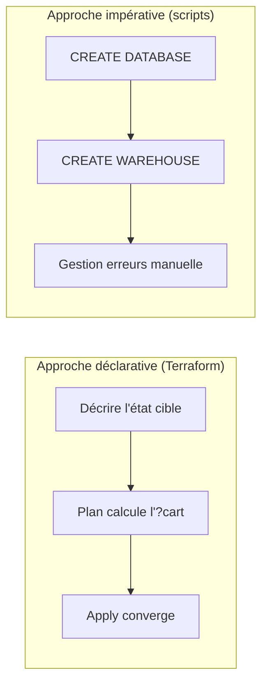
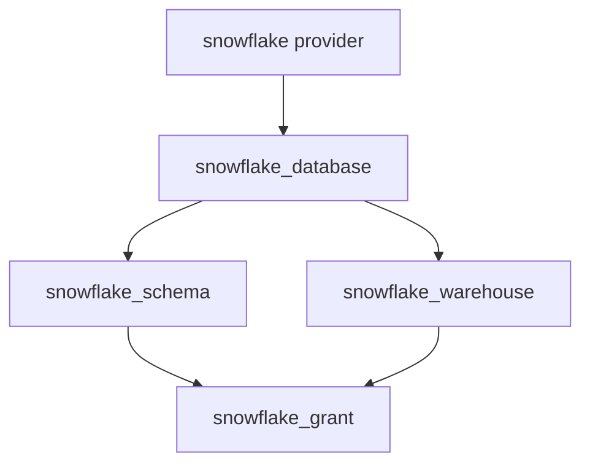
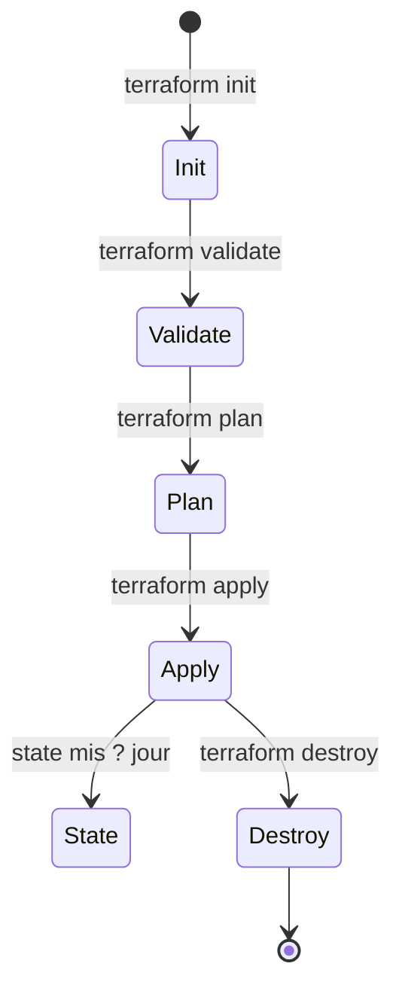

# Module 1 ? Slides : IaC et Workflow Terraform

---

## Slide 1 ? Titre

**Industrialisation Data Platform**  
Module 1 : Infrastructure as Code & Workflow Terraform  
*Durée : 1h30*

---

## Slide 2 ? Pourquoi l'IaC ?

- Reproductibilité entre environnements
- Traçabilité? (Git = historique des changements)
- Revue de code avant déploiement
- Réduction de la dérive de configuration (*drift*)

---

## Slide 3 ? Déclaratif vs Impératif



| | Déclaratif | Impératif |
|---|------------|-----------|
| Idempotence | Oui | Non garanti |
| Preview | `terraform plan` | Difficile |
| Rollback | State + Git | Scripts ad hoc |

---

## Slide 4 ? Idempotence

> Appliquer deux fois la même configuration produit le même résultat.

Exemple : `snowflake_warehouse` avec `warehouse_size = "X-SMALL"`  
? 1er apply : création  
? 2e apply : **no changes**

---

## Slide 5 ? Graphe de dépendances



Terraform construit un **DAG** (Directed Acyclic Graph) avant l'exécution.

---

## Slide 6 ? Cycle de vie Terraform



---

## Slide 7 ? Structure projet minimal

```
project/
??? versions.tf      # terraform + providers
??? provider.tf      # config snowflake
??? variables.tf     # entrées
??? main.tf            # ressources
??? outputs.tf         # sorties
```

---

## Slide 8 ? Provider Snowflake

```hcl
terraform {
  required_providers {
    snowflake = {
      source  = "snowflakedb/snowflake"
      version = "~> 1.0"
    }
  }
}
```

Authentification : **Key Pair JWT** (recommandé production)

---

## Slide 9 ? Atelier M1

1. Cloner le dépôt formation
2. Configurer variables d'environnement
3. `terraform init` + `terraform plan`
4. Analyser le graphe : `terraform graph | dot -Tpng > graph.png`

? Lab : [lab.md](lab.md)

---

## Slide 10 ? Points clés ? retenir

- Terraform = déclaratif, idempotent, planifiable
- Le provider traduit HCL ? API Snowflake
- Toujours `plan` avant `apply` en production
- Versionner le code, **jamais** le `.tfstate` en clair dans Git

---

## Patterns IaC

| Pattern | Application |
|---------|-------------|
| Déclaratif | Code = état désir?, pas des actions |
| Idempotent | `apply` répét? = `No changes` |
| DAG | Ordre d'exécution automatique |
| Séparation fichiers | versions / provider / variables / main / outputs |

