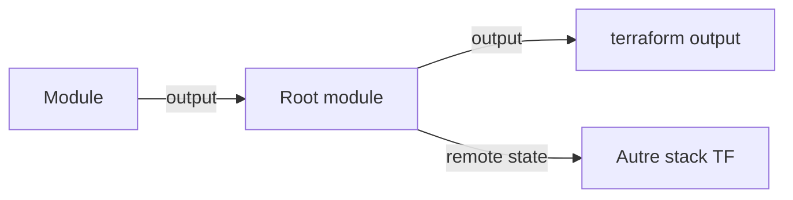
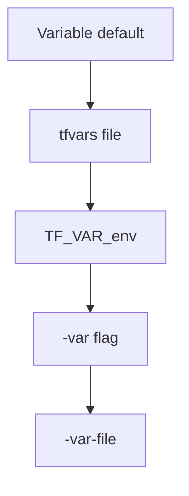

# Module 4 ? Slides : Variables et Outputs

---

## Slide 1 ? Variables, Locals, Outputs

**Module 4** ? *1h30*

---

## Slide 2 ? Input Variables

```hcl
variable "environment" {
  type        = string
  description = "DEV, TEST or PROD"
  validation {
    condition     = contains(["DEV", "TEST", "PROD"], var.environment)
    error_message = "Invalid environment."
  }
}
```

---

## Slide 3 ? Types avancés

```hcl
variable "schemas" {
  type = map(object({
    comment = optional(string, "")
  }))
}
```

---

## Slide 4 ? Locals

```hcl
locals {
  prefix = "DB_${var.zone}_${var.environment}"
  tags   = { ManagedBy = "Terraform", Env = var.environment }
}
```

? Éviter duplication, centraliser la logique de nommage

---

## Slide 5 ? Outputs

```hcl
output "warehouse_name" {
  value       = snowflake_warehouse.etl.name
  description = "ETL warehouse for pipelines"
}
```



---

## Slide 6 ? Priorité des valeurs



La priorité la plus haute gagne (CLI > env > tfvars > default).

---

## Slide 7 ? Atelier

Paramètrer multi-env via `dev.tfvars` / `prod.tfvars  
? [lab.md](lab.md)

---

## Patterns Variables

| Pattern | Application |
|---------|-------------|
| Validation | `validation { condition = contains(...) }` |
| Locals | Naming centralisé, pas de noms en dur |
| Outputs = Contrat | Interface publique du module |
| Précédence | `default < tfvars < TF_VAR_* < -var` |
| Sensitive | `sensitive = true` pour les secrets |

