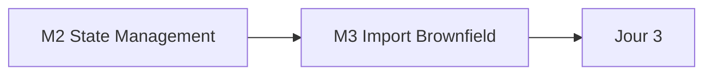

# Jour 2 — State, import et brownfield

**Objectif :** Sécuriser le state, intégrer l'existant sans recréation, détecter la dérive.
**Durée :** 6 heures (2 h concepts · 4 h pratique)

> [<- Catalogue](../README.md) · [Jour 1](../day-01/README.md) · **Jour 2** · [Jour 3 ->](../day-03/README.md)

---

## Contexte GlobalBank

> *"Où est écrite votre convention de nommage ? Mon `terraform.tfstate` est sur mon portable. Si mon PC casse, la plateforme est orpheline. Et mon entreprise a déjà 200 bases créées avant Terraform."*

**Aujourd'hui :** vous passez d'un state local à un state distant préparé par le formateur. Vous apprenez le verrouillage, l'import d'objets existants, la détection de dérive et le réalignement.

> **Votre équipe GlobalBank :** les 4 équipes appliquent state/import sur leurs propres objets — 🔵 warehouses, 🟢 zones d'ingestion, 🟠 domaines, 🟣 datamarts. Voir [personas-globalbank.md](../shared/docs/personas-globalbank.md).

> Le backend Azure Blob Storage est **préconfiguré par le formateur**. Vous consommez les paramètres fournis ; vous ne créez ni storage account, ni resource group, ni service principal.

---

## Les 4 rôles du state

| Rôle | Description |
|---|---|
| **Mapping** | Lie le code Terraform aux ressources réelles |
| **Métadonnées** | Stocke les IDs et attributs des ressources |
| **Performance** | Évite d'interroger l'API à chaque plan |
| **Syncing** | Empêche les conflits entre utilisateurs via le verrouillage |

> 🔒 Le state contient les valeurs en clair, y compris les attributs sensibles. Il est traité comme un fichier de mots de passe : jamais dans Git, toujours chiffré au repos.

---

## Progression



## Modules

| Module | Durée | Dossier de travail | Lab | Cours | Troubleshooting | Output attendu |
|---|---:|---|---|---|---|---|
| [M2 — State Management](module-02-state-management/lab.md) | 2 h 30 | `labs/m02-state-management/` | [lab](module-02-state-management/lab.md) | [cours](module-02-state-management/course.md) | [guide](module-02-state-management/troubleshooting.md) | [output](module-02-state-management/expected-output.md) |
| [M3 — Import Brownfield](module-02-state-management/module-03-import-brownfield/lab.md) | 1 h 30 | `labs/m03-import-brownfield/` | [lab](module-02-state-management/module-03-import-brownfield/lab.md) | [cours](module-02-state-management/module-03-import-brownfield/course.md) | [guide](module-02-state-management/module-03-import-brownfield/troubleshooting.md) | [output](module-02-state-management/module-03-import-brownfield/expected-output.md) |

## Workflow du jour

1. **Lisez** le `course.md` du module (concepts, 15–20 min)
2. **Réalisez** le `lab.md` pas à pas (création de fichiers, exécution, checkpoints)
3. **Comparez** avec `expected-output.md`
4. **Consultez** `troubleshooting.md` en cas d'erreur
5. **Passez** au module suivant

> Chaque module possède son propre dossier de travail sous `labs/mXX-name/`. Chaque lab est **autonome** : il démarre par `Reset-Lab.ps1` pour un environnement propre et se termine par un cleanup contrôlé. Les ressources sont nommées par module (ex. `APP01_M02_RAW_DEV`).

---

## Livrable du jour

State distant sur Azure Blob Storage avec locking natif (backend préconfiguré). Ressource brownfield importée sans recréation. Dérive détectée et corrigée.

---

## Preuves individuelles

- [ ] `terraform state list` affiche vos ressources après migration
- [ ] `terraform plan` affiche `No changes.` après migration du state
- [ ] Un objet existant est importé sans recréation
- [ ] Vous pouvez expliquer les 4 rôles du state
- [ ] Vous avez détecté une dérive via `terraform plan` et corrigé
- [ ] Vous comprenez pourquoi le state ne se commit pas dans Git

---

## [CHAOS LAB] — State lock (par paires)

> ⚠️ Exercice de rupture contrôlée. Deux personnes collaborent.

**Objectif :** Découvrir le verrouillage du state distant.

1. Deux personnes partagent la même clé de state (même backend Azure Blob)
2. Personne A exécute `terraform apply`
3. Personne B exécute `terraform plan` en même temps
4. Observez : un des deux reçoit un message de lock

**Question :** Que se passerait-il sans mécanisme de locking ?

> 🔴 `terraform force-unlock` n'est utilisé qu'en dernier recours, après vérification que le processus qui posé le verrou est mort.

---

## Anti-sèche Jour 2

### Commandes de state

```bash
terraform state list                # Lister les ressources gérées
terraform state show <RESOURCE>     # Afficher les détails d'une ressource
terraform state mv <OLD> <NEW>      # Renommer dans le state
terraform import <RESOURCE> <ID>   # Importer une ressource existante
terraform plan -detailed-exitcode   # 0 = pas de drift, 2 = drift détecté
```

### Backend azurerm (préconfiguré)

```hcl
terraform {
  backend "azurerm" {
    resource_group_name  = "rg-data2ai-tf-state"
    storage_account_name = "sadata2aitfstatemsn"
    container_name       = "tfstate"
    key                  = "training/APP01/m02/terraform.tfstate"
    use_azuread_auth     = true
  }
}
```

> Le resource group, le storage account et le conteneur sont créés par le formateur. Vous ne faites que référencer ces paramètres et lancer `terraform init -migrate-state`.

### Codes de sortie `plan -detailed-exitcode`

| Code | Signification |
|---:|---|
| 0 | Aucun changement — pas de drift |
| 1 | Erreur (auth, syntaxe, réseau) |
| 2 | Changements en attente — drift détecté |

---

## Point de convergence (15 min)

- Projection SQL montrant tous les objets
- Trois observations de la journée
- Justification du Jour 3

## Concepts officiels touchés

- Backend distant Azure Blob, locking, migration de state (D3)
- `terraform state` subcommands, workspaces CLI, lock file & `init -upgrade` (D1/D3)
- Import brownfield, `moved`, drift (`plan -refresh-only`), `-target` (D1)
- `terraform_remote_state` — partage d'outputs entre stacks (D3)
- Voir la matrice complète : [certification-coverage.md](../shared/docs/certification-coverage.md)

---

## Navigation

[<- Catalogue](../README.md) · [Jour 1](../day-01/README.md) · **Jour 2** · [Jour 3 ->](../day-03/README.md)
