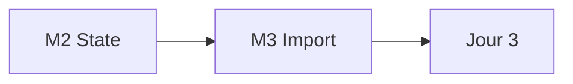

# Jour 2 — State et Import Brownfield

**Objectif :** Seécuriser le state distant et intégrer l'existant sans recréation.

> [<- Catalogue](../README.md) · [Jour 1](../day-01/README.md) · **Jour 2** · [Jour 3 ->](../day-03/README.md)

---

## Contexte GlobalBank

> **Email Sofia Almeida :**
>
> *"Ou est ecrite votre convention de nommage ? Qui empeche un ingenieur de creer
> un warehouse 4X-LARGE par erreur ? Aujourd'hui, vos parametres doivent etre
> declares, tyres, bornes — et vos conventions ecrites a UN seul endroit."*

**Aujourd'hui :** vous passez d'un objet a une collection. Vous centralisez la
naming convention dans `locals`, ajoutez des garde-fous avec `validation`, et
creez 3 objets d'un coup avec `for_each`.

---

## La Puissance de `for_each`

| Methode | Ajout d'un 4e objet | Risque |
|---------|---------------------|--------|
| `count` | Reindexe tout → destruction et recreation | ⚠️ Eleve |
| `for_each` | Ajoute uniquement l'objet manquant | ✅ Faible |

> **Regle d'or :** `for_each` sur une map est le standard enterprise. `count` est un piege.

---

## Progression



## Modules

| Module | Duree | Repertoire de travail | Lab | Course | Troubleshooting | Resultat attendu |
|---|---:|---|---|---|---|---|
| [M2 — State Management](module-02-state-management/lab.md) | 1h10 | `labs/m02-state-management/` | [lab](module-02-state-management/lab.md) | [cours](module-02-state-management/course.md) | [guide](module-02-state-management/troubleshooting.md) | [output](module-02-state-management/expected-output.md) |
| [M3 — Import Brownfield](module-03-import-brownfield/lab.md) | 1h | `labs/m03-import-brownfield/` | [lab](module-03-import-brownfield/lab.md) | [cours](module-03-import-brownfield/course.md) | [guide](module-03-import-brownfield/troubleshooting.md) | [output](module-03-import-brownfield/expected-output.md) |

## Workflow du jour

1. **Lisez** le `course.md` du module (concepts, 15-20 min)
2. **Realisez** le `lab.md` pas a pas (creation de fichiers, execution, checkpoints)
3. **Comparez** avec `expected-output.md`
4. **Consultez** `troubleshooting.md` en cas d'erreur
5. **Passez** au module suivant

> Chaque module possede son propre repertoire de travail sous `labs/mXX-name/` (ex. `labs/m02-state-management/` pour M2). Chaque lab est **autonome** : il demarre par `Reset-Lab.ps1` pour un environnement propre, possede ses propres fichiers template et se termine par `terraform destroy`. Les ressources sont nommees par module (ex. `APP01_M02_RAW_DEV`).

> `[WINDOWS]` Si l'execution de scripts `.ps1` est bloquee, autorisez les scripts locaux :
> ```powershell
> Set-ExecutionPolicy -Scope CurrentUser -ExecutionPolicy RemoteSigned
> ```

## Livrable du jour

State distant sur Azure Blob Storage avec locking natif.
Ressource brownfield importee sans recreation.

---

## Preuves individuelles

- [ ] `terraform plan` affiche `No changes.` apres l'ajout d'un local
- [ ] Ajout d'une entree sans toucher au code → `Plan: 1 to add`
- [ ] Preuve Snowsight : les 3 objets visibles
- [ ] Vous pouvez expliquer les 4 roles du state (mapping, metadata, performance, syncing)

---

## [CHAOS LAB] — Casser une collection

> ⚠️ Exercice de rupture controlee. Pas de panic si le plan affiche des destructions.

**Objectif :** Comprendre pourquoi `for_each` est plus sur que `count`.

1. Ouvrez `terraform.tfvars`
2. Supprimez la **cle du milieu** de votre map (pas la premiere, pas la derniere)
3. Executez `terraform plan`
4. Observez : seul l'objet correspondant est cible (pas de reindexation)

**Question :** Que se passerait-il si vous aviez utilise `count` au lieu de `for_each` ?

---

## [DEFI] — Ajout sans toucher au code

**Temps :** 10 minutes

1. Ajoutez une 4e entree dans `terraform.tfvars` (pas dans `main.tf` !)
2. Executez `terraform plan`
3. Le plan doit afficher `Plan: 1 to add` — sans aucune destruction

**Validation :** Le formateur verifie que vous n'avez pas modifie `main.tf`.

---

## Anti-seche Jour 2

### Les 4 roles du state

| Role | Description |
|------|-------------|
| **Mapping** | Lie le code Terraform aux ressources reelles |
| **Metadata** | Stocke les IDs et attributs des ressources |
| **Performance** | Evite de interroger l'API a chaque plan |
| **Syncing** | Empeche les conflits entre utilisateurs |

### Commandes essentielles

```bash
terraform state list                # Lister les ressources gerees
terraform state show <RESOURCE>     # Afficher les details d'une ressource
terraform state mv <OLD> <NEW>      # Renommer une ressource dans le state
terraform import <RESOURCE> <ID>    # Importer une ressource existante
```

## Point de convergence (15 min)

- Projection SQL montrant tous les objets
- Trois observations de la journee
- Justification du Jour 3

## Navigation

[<- Catalogue](../README.md) · [Jour 1](../day-01/README.md) · **Jour 2** · [Jour 3 ->](../day-03/README.md)
