# 🎓 Atelier Jour 2 — Le State Terraform

## *La mémoire, le backend distant, le verrouillage, l'import brownfield et la dérive*

> **Parcours :** Industrialisation d'une Data Platform · **Jour 2 / 5**
> **Modules couverts :** M02 (State distant Azure Blob Storage) + M03 (Import brownfield et alignement)
> **Durée :** 6 heures (2 h de concepts guidés · 4 h de pratique)
> **Prérequis :** Jour 1 terminé — vous savez écrire et appliquer une configuration Terraform
> **Alignement certification :** HashiCorp *Terraform Associate (003)* — Objectifs 4, 5, 7, 9

---

## 📖 Rappel de la convention de lecture

| Pictogramme | Signification |
|:---:|---|
| 🧠 | **Concept** — théorie, modèle mental, diagramme |
| ❓ | **La question de l'apprenant** |
| 🔬 | **Sous le capot** |
| 📝 | **Action** |
| ✅ | **Checkpoint** |
| ⚠️ | **Piège classique** |
| 🔒 | **Sécurité** |
| 💰 | **Coût (FinOps)** |
| 🎓 | **Point d'examen** |

---

## 🧭 Le fil directeur de la journée

Hier, vous avez appris à **écrire** de l'infrastructure. Aujourd'hui, vous apprenez à **la posséder dans la durée, en équipe, et sur un existant qui vous préexiste.**

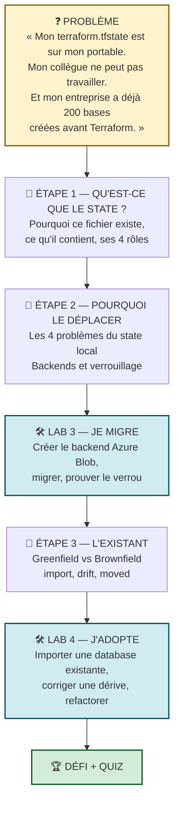

**La promesse de fin de journée :** vous saurez expliquer à un architecte pourquoi le state est le **cœur névralgique** d'une plateforme Terraform, comment le protéger, et comment adopter une infrastructure existante sans détruire une seule ligne de données.

---
---

# PARTIE A — 🧠 LES CONCEPTS

*Durée : 2 h*

---

## A.1 — Qu'est-ce que le state, et pourquoi existe-t-il ?

### A.1.1 L'expérience de pensée qui rend le state évident

Imaginons un instant que le state **n'existe pas**. Vous lancez `terraform apply` avec ce code :

```hcl
resource "snowflake_database" "raw" {
  name = "APP01_M02_RAW_DEV"
}
```

Puis vous **renommez** la base dans votre code :

```hcl
resource "snowflake_database" "raw" {
  name = "APP01_M02_BRONZE_DEV"
}
```

Que doit faire Terraform au prochain `apply` ?

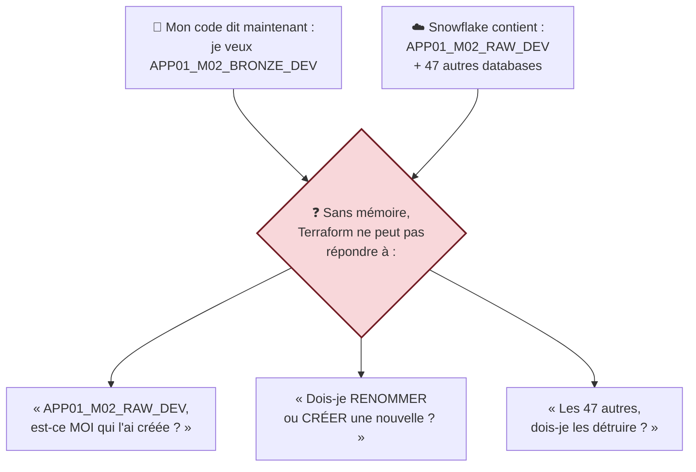

**Sans mémoire, Terraform est aveugle.** Le state est ce qui lui permet de dire : *« Je sais que l'objet `snowflake_database.raw` de mon code correspond à la database `APP01_M02_RAW_DEV` dans Snowflake, parce que c'est moi qui l'ai créée le 7 septembre à 14h32. »*

### A.1.2 Le state : définition et rôles

> **Le state est un fichier JSON qui établit la correspondance entre les objets de votre configuration (les adresses `type.nom`) et les objets réels de votre infrastructure (les identifiants côté API).**

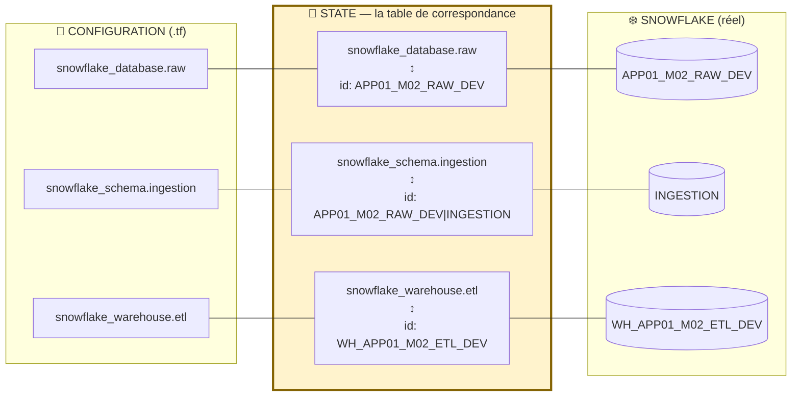

**Les quatre rôles du state — à savoir citer à l'examen :**

| # | Rôle | Ce que ça permet concrètement |
|:---:|---|---|
| 1 | **Mapping (correspondance)** | Relier `snowflake_database.raw` à l'objet réel. C'est le rôle fondamental, celui sans lequel rien ne fonctionne |
| 2 | **Métadonnées** | Mémoriser les **dépendances** entre ressources, même après la suppression du code — indispensable pour détruire dans le bon ordre |
| 3 | **Performance** | Servir de cache. Sur 500 ressources, rafraîchir chacune via l'API prendrait des minutes. `-refresh=false` s'appuie sur ce cache |
| 4 | **Synchronisation** | Servir de point de rendez-vous à l'équipe, avec **verrouillage** pour empêcher deux écritures simultanées |

> 🎓 **Point d'examen.** Ces quatre rôles (*mapping, metadata, performance, syncing*) sont énoncés tels quels dans la documentation HashiCorp *« Purpose of Terraform State »*. Une question de l'examen demande souvent lequel n'est **pas** un rôle du state — la réponse piège est typiquement « stocker les credentials » ou « chiffrer les secrets ».

### A.1.3 Anatomie d'un fichier `terraform.tfstate`

```json
{
  "version": 4,
  "terraform_version": "1.14.5",
  "serial": 3,
  "lineage": "7f3a2b91-4c8e-11ef-9c2d-0242ac120002",
  "outputs": {
    "database_name": {
      "value": "APP01_M02_RAW_DEV",
      "type": "string"
    }
  },
  "resources": [
    {
      "mode": "managed",
      "type": "snowflake_database",
      "name": "raw",
      "provider": "provider[\"registry.terraform.io/snowflakedb/snowflake\"]",
      "instances": [
        {
          "schema_version": 1,
          "attributes": {
            "id": "APP01_M02_RAW_DEV",
            "name": "APP01_M02_RAW_DEV",
            "comment": "Managed by Terraform | Training | APP01",
            "data_retention_time_in_days": 1
          },
          "dependencies": []
        }
      ]
    }
  ]
}
```

| Champ | Rôle | Pourquoi c'est important |
|---|---|---|
| `version` | Version du **format** de state (4 depuis TF 0.12) | Une version supérieure signifie qu'un Terraform plus récent a écrit le fichier |
| `terraform_version` | Version du binaire qui a écrit | ⚠️ Un Terraform plus **ancien** refusera d'ouvrir un state écrit par un plus récent |
| `serial` | Compteur incrémenté à **chaque** écriture | Le mécanisme anti-écrasement : Terraform refuse de pousser un state dont le `serial` est inférieur |
| `lineage` | UUID généré à la création du state | Empêche de mélanger deux states différents. Un `lineage` qui change = un state recréé |
| `outputs` | Valeurs publiées | C'est ce que `terraform output` relit, et ce que `terraform_remote_state` consomme |
| `resources[].mode` | `managed` (resource) ou `data` | Distingue ce que Terraform gère de ce qu'il lit |
| `resources[].instances[].attributes` | **Tous** les attributs réels | 🔒 **C'est ici que se cachent les secrets** |
| `dependencies` | Arêtes du graphe mémorisées | Permet un `destroy` ordonné même si le code a changé |

> 🔒 **La règle de sécurité n°1 du state.** Le champ `attributes` contient **toutes** les valeurs, y compris celles marquées `sensitive`, **en clair**. Un mot de passe généré, une clé d'accès, une chaîne de connexion : tout est là.
>
> **Conséquence :** un fichier `terraform.tfstate` doit être traité **exactement comme un fichier de mots de passe**. Jamais dans Git. Jamais en pièce jointe. Toujours chiffré au repos et en transit.

> ⚠️ **Piège classique n°9.** N'éditez **jamais** `terraform.tfstate` à la main. Une modification manuelle casse le `serial`, la cohérence des dépendances, ou pire, passe inaperçue jusqu'à un `destroy` catastrophique. Les commandes `terraform state mv`, `rm`, `pull`, `push` existent précisément pour cela.

---

## A.2 — Pourquoi déplacer le state ? Les quatre problèmes du state local

### A.2.1 Le tableau des symptômes

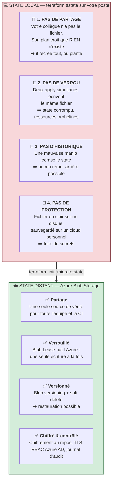

### A.2.2 Le scénario catastrophe, en détail

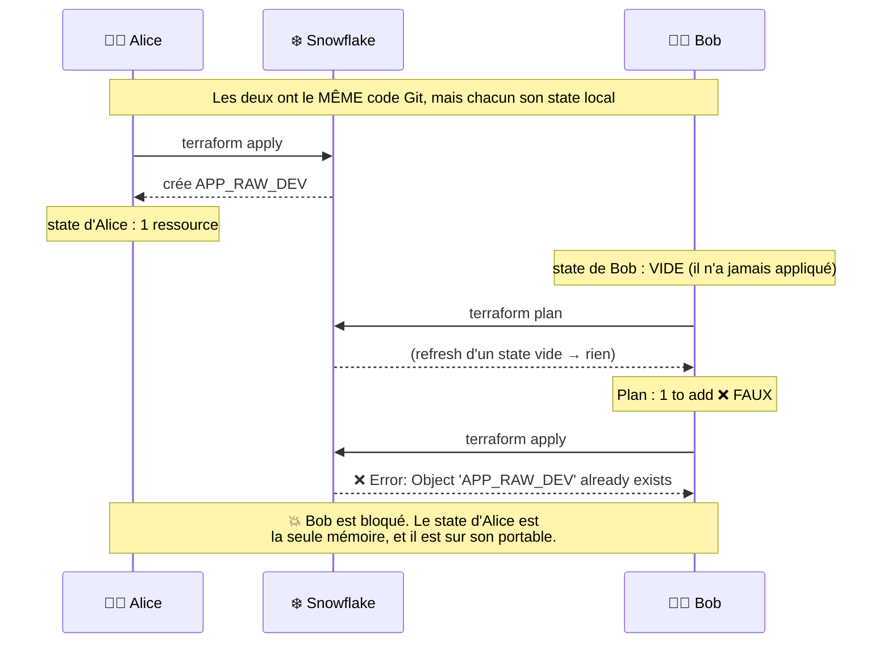

> ❓ **« Et si on commitait le `terraform.tfstate` dans Git ? »**
> C'est le premier réflexe de beaucoup de débutants, et c'est une **très mauvaise idée**, pour trois raisons :
> 1. 🔒 **Sécurité** — le state contient les secrets en clair. Git conserve l'historique **à jamais**, même après suppression du fichier ;
> 2. 🔐 **Pas de verrouillage** — Git ne bloque pas deux `apply` simultanés. Il produit un conflit de fusion sur un JSON de 3000 lignes, impossible à résoudre à la main ;
> 3. ⏱️ **Décalage** — le state change à chaque `apply`, y compris quand personne n'a modifié le code. Vous auriez un commit par exécution.
>
> **Le state n'est pas du code : c'est de la donnée d'exécution.** Sa place est dans un magasin de données versionné et verrouillable, pas dans un système de contrôle de source.

### A.2.3 Les backends : le catalogue

Un **backend** définit *où* le state est stocké et *comment* les opérations sont exécutées.

| Backend | Verrouillage | Cas d'usage |
|---|---|---|
| `local` (défaut) | Fichier `.terraform.tfstate.lock.info` | Poste isolé, apprentissage |
| **`azurerm`** | ✅ **Blob Lease natif** | 🔵 **Notre choix** — Azure |
| `s3` | ✅ Lock file S3 natif (ou table DynamoDB, historique) | 🟠 AWS |
| `gcs` | ✅ Natif | 🟢 GCP |
| `http` | Selon l'implémentation | GitLab, serveurs custom |
| `remote` / `cloud` | ✅ | HCP Terraform (ex Terraform Cloud) |
| `consul`, `kubernetes`, `pg` | ✅ | Contextes spécifiques |

> 🎓 **Point d'examen — les *enhanced backends*.** Historiquement, Terraform distinguait les backends *standard* (stockage seul) des backends *enhanced* (`remote`, `local`) qui exécutent aussi les opérations. Le bloc `cloud {}` a remplacé `backend "remote"` pour HCP Terraform. Retenez : **tous les backends stockent le state ; seuls `local` et `remote`/`cloud` exécutent des opérations.**

> 🎓 **Point d'examen — les limites du bloc `backend`.** Le bloc `backend` **n'accepte aucune variable, aucun local, aucune expression.** Il est évalué avant tout le reste, à l'initialisation.
> ```hcl
> backend "azurerm" {
>   key = "training/${var.learner_prefix}/terraform.tfstate"   # ❌ INTERDIT
> }
> ```
> La solution est un **backend partiel** : laisser le bloc vide (ou partiellement rempli) et compléter à l'init avec `-backend-config`.

### A.2.4 Le backend `azurerm` en détail

```hcl
terraform {
  backend "azurerm" {
    resource_group_name  = "rg-data2ai-tf-state"
    storage_account_name = "sadata2aitfstatemsn"
    container_name       = "tfstate"
    key                  = "training/APP01/m02/terraform.tfstate"
    use_azuread_auth     = true
  }
}
```

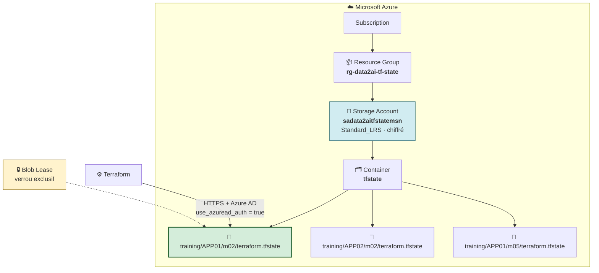

| Argument | Rôle |
|---|---|
| `resource_group_name` | Le groupe de ressources Azure qui contient le compte de stockage |
| `storage_account_name` | Le compte de stockage (nom **globalement unique** dans Azure) |
| `container_name` | Le conteneur Blob, comparable à un bucket |
| `key` | **Le chemin du blob** — c'est lui qui isole les states les uns des autres |
| `use_azuread_auth = true` | 🔒 Authentification par identité Azure AD (RBAC), **et non** par clé d'accès partagée |

> 🔒 **Pourquoi `use_azuread_auth = true` est important.** Sans cette option, Terraform utilise une *account key* — un secret unique qui donne un accès total au compte de stockage, difficile à faire tourner et impossible à tracer par utilisateur. Avec Azure AD, chaque identité (le Service Principal ici) reçoit un rôle RBAC précis (`Storage Blob Data Contributor`), et chaque accès est journalisé.

> 🧠 **La convention de `key` est une décision d'architecture.** Le chemin `training/<PREFIXE>/<module>/terraform.tfstate` reproduit à petite échelle ce que font les entreprises : `<produit>/<environnement>/<couche>/terraform.tfstate`. **Un state par périmètre de responsabilité.** Un state gigantesque qui contient tout est le premier symptôme d'une plateforme qui ne passera pas à l'échelle : chaque `plan` devient lent, chaque `apply` verrouille tout le monde, et le rayon d'explosion d'une erreur est maximal.

### A.2.5 Le paradoxe du bootstrapping

> ❓ **« Pourquoi crée-t-on le Storage Account avec Azure CLI, et pas avec Terraform ? »**

C'est **la** question qui distingue un débutant d'un praticien. Elle mérite un schéma.

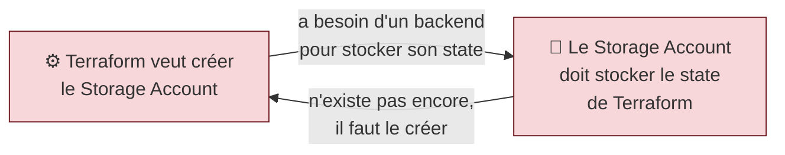

**C'est le problème de l'œuf et de la poule.** Terraform ne peut pas gérer son propre backend, parce qu'il lui faudrait un backend pour se souvenir qu'il l'a créé.

**Les trois solutions du monde réel :**

| Stratégie | Comment | Quand |
|---|---|---|
| 🥇 **Bootstrap manuel** *(notre choix)* | Créer le RG, le Storage Account et le conteneur avec Azure CLI, une fois pour toutes. Les documenter comme *ressources de socle* | Le plus courant. Simple, explicite, robuste |
| 🥈 **Terraform à deux temps** | Un projet Terraform à state **local** crée le backend, puis on migre son propre state dedans | Élégant mais réflexif : demande de la rigueur |
| 🥉 **Provisionné par une autre équipe** | L'équipe Cloud fournit le backend en libre-service | Grandes organisations |

> 🎓 **La formulation à retenir pour l'examen ou un entretien :** *« Le backend est une ressource de socle (bootstrap). Il est créé hors du cycle de vie Terraform qu'il sert, parce qu'une ressource ne peut pas être gérée par le système dont elle est le prérequis. »*

---

## A.3 — Le verrouillage : empêcher deux écritures simultanées

### A.3.1 Le mécanisme du Blob Lease

Azure Blob Storage offre un mécanisme natif de **bail exclusif** (*lease*). Terraform s'en sert avant toute opération qui écrit le state.

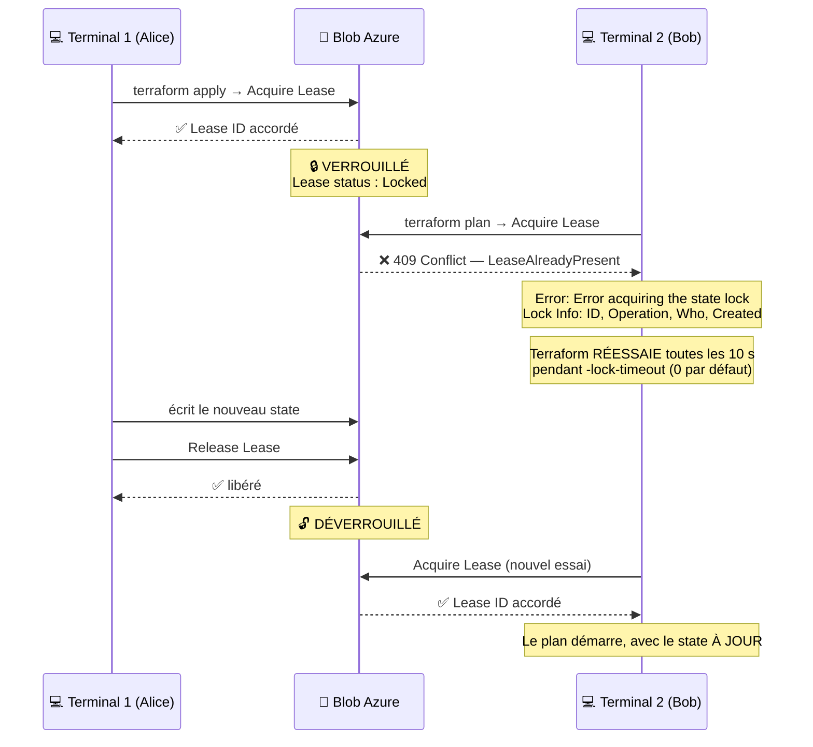

**Ce que le message d'erreur vous dit :**

```text
Error: Error acquiring the state lock

Error message: state blob is already locked
Lock Info:
  ID:        1a2b3c4d-...
  Path:      tfstate/training/APP01/m02/terraform.tfstate
  Operation: OperationTypeApply          ← quelle opération bloque
  Who:       APP01@LAPTOP-ALICE          ← QUI bloque
  Version:   1.14.5
  Created:   2026-09-07 14:32:11 UTC     ← DEPUIS QUAND
```

> 🧠 **Un verrou n'est pas une panne.** C'est le système qui fonctionne. Le bon réflexe est de lire `Who` et `Created`, puis d'aller **parler à la personne**. Le mauvais réflexe est de forcer.

### A.3.2 Les options de verrouillage

| Option | Effet | Usage |
|---|---|---|
| *(défaut)* | Attend indéfiniment ? Non — échoue immédiatement | Interactif |
| `-lock-timeout=5m` | Réessaie pendant 5 minutes avant d'abandonner | ✅ **Recommandé en CI/CD** |
| `-lock-timeout=0s` | Échoue immédiatement | Tests, diagnostic |
| `-lock=false` | ⛔ **Désactive le verrou** | Presque jamais. Risque de corruption |
| `terraform force-unlock <ID>` | Supprime le verrou de force | 🔴 **Dernier recours** |

> 🔴 **`force-unlock` : la commande la plus dangereuse de Terraform.**
>
> **N'utilisez `force-unlock` que si les TROIS conditions sont réunies :**
> 1. Vous avez la **certitude** que le processus qui a posé le verrou est mort (machine éteinte, pipeline annulé, `Ctrl+C` brutal) ;
> 2. Vous avez **vérifié auprès de la personne** nommée dans `Who` ;
> 3. Vous avez noté le `Lock ID` exact affiché dans le message d'erreur.
>
> Forcer le déverrouillage pendant une opération **active** peut produire un state corrompu et des ressources orphelines — l'incident le plus coûteux qu'une équipe Terraform puisse s'infliger.

---

## A.4 — Les commandes de manipulation du state

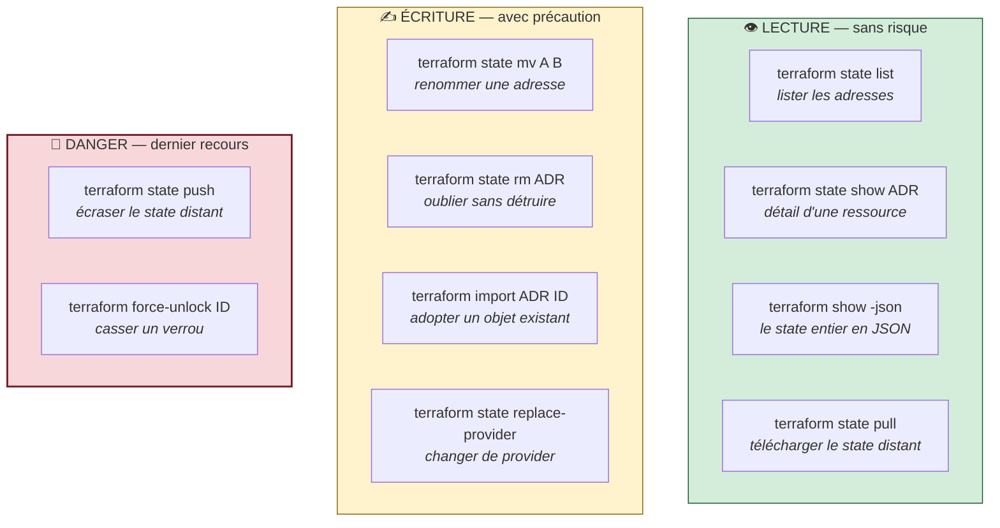

> 🎓 **Point d'examen — la nuance `state rm` vs `destroy`.**
>
> | Commande | Effet sur le state | Effet sur Snowflake |
> |---|---|---|
> | `terraform destroy` | La ressource disparaît | 🔴 **L'objet est SUPPRIMÉ** |
> | `terraform state rm` | La ressource disparaît | ✅ **L'objet reste intact, il devient orphelin** |
>
> `state rm` sert à *« Terraform, oublie cette ressource, quelqu'un d'autre s'en occupe désormais »*. C'est l'opération inverse d'`import`.

> ⚠️ **Piège classique n°10.** Depuis Terraform 1.1, `state mv` est **remplacé** par le bloc `moved {}` dans le code pour les renommages. La différence est majeure : `state mv` est une commande impérative jouée par une seule personne sur son poste ; `moved {}` est une déclaration **versionnée dans Git**, rejouée automatiquement par tous les collègues et par la CI. Vous le pratiquerez au Lab 4.

---

## A.5 — Composer entre projets : `terraform_remote_state`

### A.5.1 Le besoin

Une plateforme réelle n'est pas un seul projet Terraform. Elle est découpée en couches, souvent gérées par des équipes différentes.

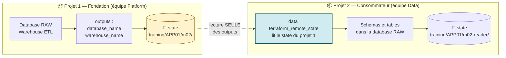

```hcl
data "terraform_remote_state" "m02" {
  backend = "azurerm"
  config = {
    resource_group_name  = "rg-data2ai-tf-state"
    storage_account_name = "sadata2aitfstatemsn"
    container_name       = "tfstate"
    key                  = "training/APP01/m02/terraform.tfstate"
    use_azuread_auth     = true
  }
}

output "raw_database_name" {
  value = data.terraform_remote_state.m02.outputs.database_name
}
```

### A.5.2 Les règles à connaître

| Règle | Explication |
|---|---|
| C'est une **data source**, pas une resource | Lecture seule. Le projet consommateur ne peut **rien** modifier dans l'autre state |
| **Seuls les `outputs` sont accessibles** | On ne peut pas lire un attribut arbitraire d'une ressource. Le producteur choisit **explicitement** ce qu'il expose |
| L'accès est celui du **backend** | Il faut les droits de lecture sur le blob. Le RBAC Azure s'applique |
| Cela crée un **couplage** | Si le producteur renomme un output, le consommateur casse |

> 🧠 **Le contrat d'interface.** Les `outputs` d'un projet Terraform sont son **API publique**. Tout ce qui n'est pas dans un output est un détail d'implémentation, libre de changer. C'est exactement la même discipline que les interfaces en programmation.
>
> **Alternative moins couplante :** utiliser une *data source* du provider (`data "snowflake_database" "raw" { name = "…" }`), qui interroge Snowflake directement plutôt que le state d'un tiers. Moins couplé au découpage Terraform, mais dépendant d'une convention de nommage.

---

## A.6 — Greenfield, Brownfield et l'adoption de l'existant

### A.6.1 La réalité de l'entreprise

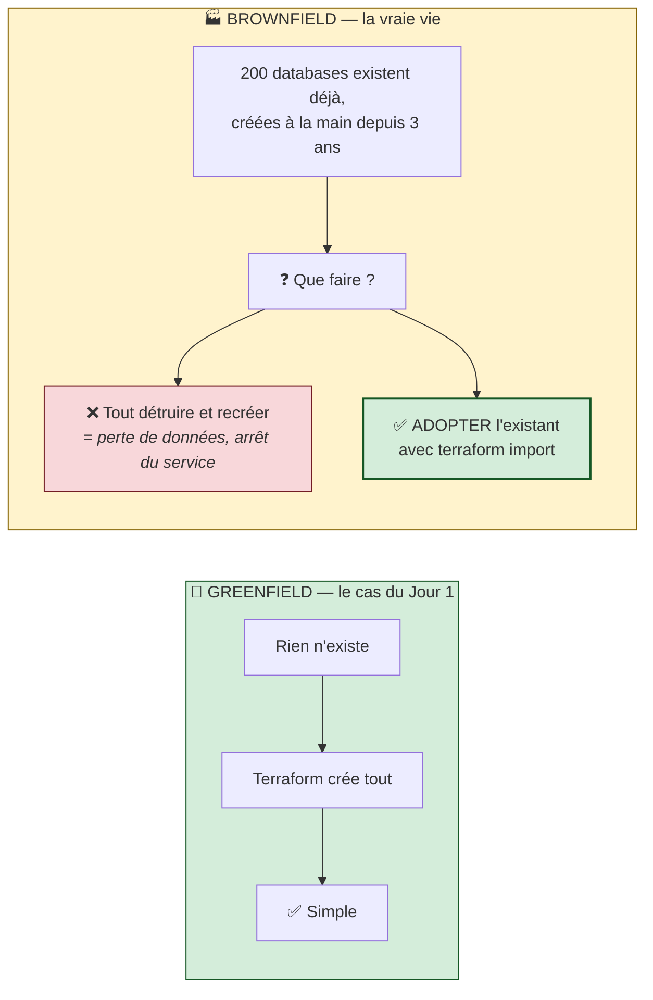

> 🧠 **La règle d'or de l'adoption.** *Une entreprise ne remplace pas sa plateforme pour adopter Terraform. Elle l'intègre sans interruption.* La compétence « import brownfield » est celle qui sépare la démo du projet réel — et c'est celle que les recruteurs testent.

### A.6.2 Ce que fait vraiment `terraform import`

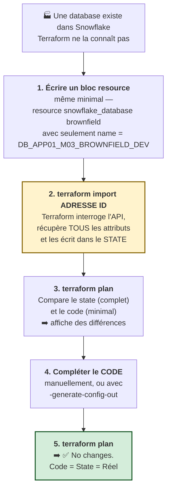

> ⚠️ **Piège classique n°11 — LE malentendu sur `import`.**
> **`terraform import` remplit UNIQUEMENT le state. Il n'écrit PAS votre code.**
> C'est pourquoi l'étape 1 (écrire un bloc `resource`, même vide) est **obligatoire** : sans adresse cible, Terraform ne sait pas où ranger ce qu'il importe. Et c'est pourquoi l'étape 4 est indispensable : après l'import, votre code est plus pauvre que le state, et le plan proposera d'« effacer » les attributs absents du code.

### A.6.3 Les deux syntaxes d'import

| | Commande `terraform import` | Bloc `import {}` (Terraform ≥ 1.5) |
|---|---|---|
| Forme | `terraform import snowflake_database.bf "DB_X"` | un bloc `import` déclarant `to = snowflake_database.bf` et `id = "DB_X"` |
| Versionné dans Git ? | ❌ Non, c'est une commande | ✅ **Oui, c'est du code** |
| Visible dans un `plan` ? | ❌ Non, l'effet est immédiat | ✅ **Oui — on peut relire avant d'appliquer** |
| Rejouable par la CI ? | ❌ Non | ✅ Oui |
| Génération de config | — | ✅ `-generate-config-out=fichier.tf` |
| Après usage | — | On supprime le bloc une fois appliqué |

> 🎓 **Point d'examen.** Le bloc `import {}` est la méthode **moderne et recommandée**. Il rend l'adoption *déclarative* et *reviewable* : l'import apparaît dans le plan, passe par une pull request, et s'exécute pendant l'`apply`. La commande CLI reste utile pour un import ponctuel ou en dépannage — c'est celle que vous pratiquerez d'abord au Lab 4, avant de découvrir la forme déclarative.

### A.6.4 La dérive (*drift*) : détection et correction

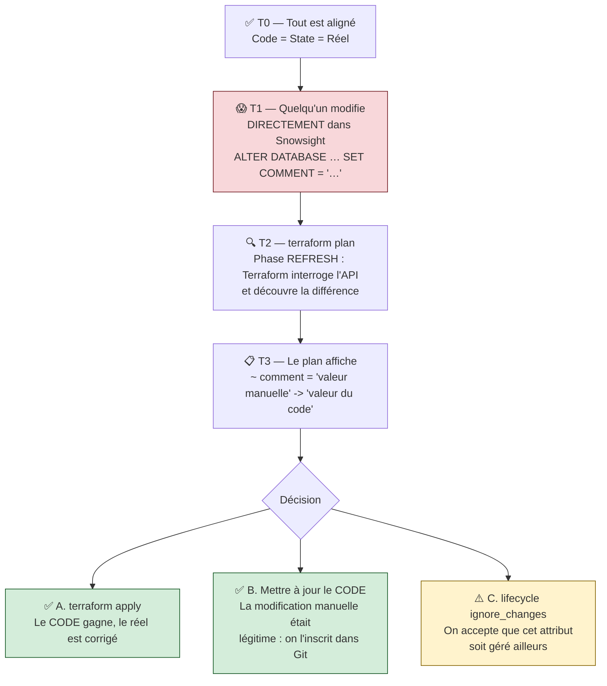

**Les trois réponses possibles à une dérive — c'est une décision d'ingénierie, pas un réflexe :**

| Réponse | Quand | Commande |
|---|---|---|
| **Réconcilier vers le code** | La modification manuelle était une erreur ou un contournement | `terraform apply` |
| **Réconcilier vers le réel** | La modification était légitime et doit devenir la norme | Éditer le `.tf`, puis `terraform apply` (`No changes.`) |
| **Accepter la divergence** | L'attribut est légitimement géré par un autre système | `lifecycle { ignore_changes = [attr] }` |

> 🔬 **La commande dédiée : `terraform plan -refresh-only`.** Elle ne propose **aucune** modification d'infrastructure : elle montre uniquement les écarts détectés entre le state et le réel. C'est la commande d'**audit de dérive**, celle qu'on programme la nuit en CI pour détecter les modifications hors processus. `terraform apply -refresh-only` met alors le state à jour **sans toucher** à l'infrastructure.

### A.6.5 Le bloc `moved` : refactorer sans détruire

**Le problème.** Vous voulez renommer `snowflake_database.brownfield` en `snowflake_database.imported` — un simple renommage **dans le code**, sans aucun changement d'infrastructure.

**Sans `moved`, voilà ce que Terraform comprend :**

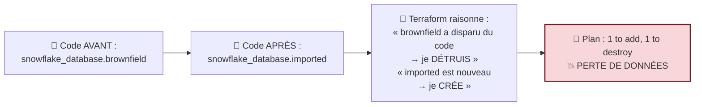

**Avec `moved`, vous expliquez le renommage à Terraform :**

```hcl
moved {
  from = snowflake_database.brownfield
  to   = snowflake_database.imported
}
```

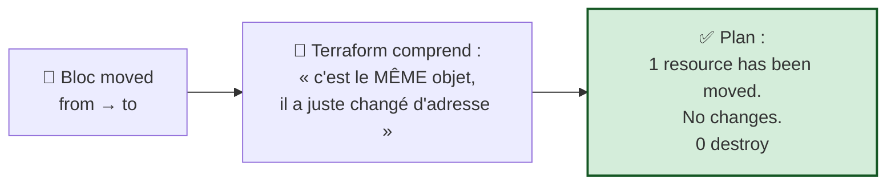

| Ce que `moved` sait faire | Exemple |
|---|---|
| Renommer un nom local | `snowflake_database.old` → `snowflake_database.new` |
| Déplacer vers un module | `snowflake_database.raw` → `module.landing.snowflake_database.raw` |
| Sortir d'un module | l'inverse |
| Passer à `count` / `for_each` | `snowflake_schema.s` → `snowflake_schema.s["INGESTION"]` |

**Ce que `moved` ne sait PAS faire :** changer le **type** de ressource. `snowflake_database` → `snowflake_schema` est impossible : ce sont deux objets différents.

> 🧠 **Le cycle de vie d'un bloc `moved`.** Il s'écrit, il est commité, il est appliqué par tous les collègues et par la CI, **puis il se supprime** — une fois que tous les states ont été migrés. Le laisser indéfiniment n'est pas dangereux, mais alourdit le code. En pratique : on le supprime au sprint suivant.

> 🎓 **Point d'examen.** `moved {}` (déclaratif, versionné, rejouable par toute l'équipe) est **préféré** à `terraform state mv` (impératif, joué une fois sur un seul poste). Question fréquente : *« Comment renommer une ressource sans la détruire, dans un dépôt partagé ? »* → bloc `moved`.

---

## A.7 — Récapitulatif visuel de la Partie A

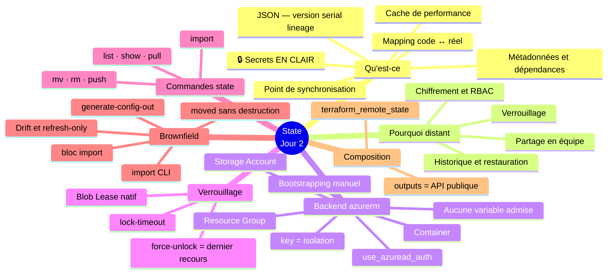

**Auto-évaluation avant la pratique :**

1. Citez les quatre rôles du state.
2. Pourquoi ne commite-t-on jamais `terraform.tfstate` ?
3. Pourquoi ne peut-on pas mettre `var.prefix` dans un bloc `backend` ?
4. Quelle est la différence entre `terraform destroy` et `terraform state rm` ?
5. Après `terraform import`, pourquoi `terraform plan` affiche-t-il encore des différences ?

*(Réponses en Partie D.)*

---
---
# PARTIE B — 🛠️ LABORATOIRE 3

## *Migrer le state vers Azure Blob Storage et prouver le verrouillage*

> **Module source :** M02 — `labs/m02-state-management/` · **Durée : 2 h** · Piste `[CORE]`

| Élément | Valeur |
|---|---|
| **Dossier de travail** | `labs/m02-state-management/` |
| **Autonomie** | ✅ Ce lab **ne dépend pas** de M01 — il crée ses propres ressources `M02` |
| **Coût** | 💰 Storage Account `Standard_LRS` — le state pèse quelques Ko, coût négligeable |
| **Cleanup** | Conserver pour inspection |

---

## B.0 — Mission métier

> **En tant que :** Data Platform Engineer
> **Je veux :** migrer le state Terraform local vers Azure Blob Storage avec verrouillage natif
> **Afin de :** permettre le travail en équipe avec verrou, historique et partage du state

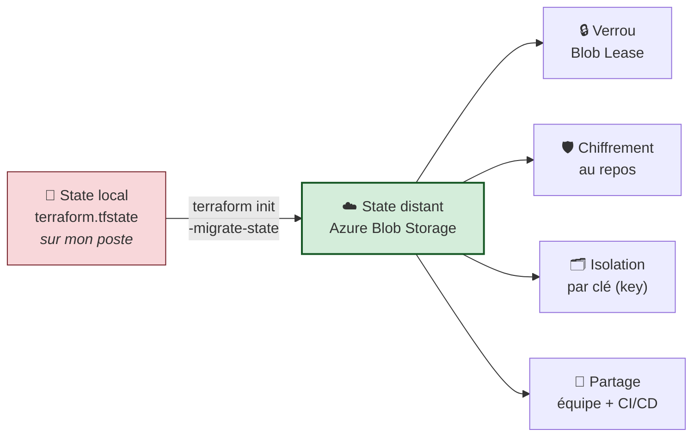

**Objectifs vérifiables :**

- ✅ créer des ressources Snowflake avec un state local ;
- ✅ créer un backend Azure Blob Storage pour le state Terraform ;
- ✅ **expliquer** le paradoxe du bootstrapping ;
- ✅ migrer un state local vers un backend distant ;
- ✅ **provoquer et observer** un conflit de verrouillage ;
- ✅ analyser la structure du fichier `terraform.tfstate` ;
- ✅ utiliser `terraform_remote_state` pour lire les outputs d'un autre projet.

---

## B.1 — 🚦 Pre-flight

### Prérequis à cocher

- [ ] Jour 0 terminé : `Toolchain status: READY` ;
- [ ] `snow sql -q 'SELECT 1' -c training` réussit ;
- [ ] Azure CLI installé ;
- [ ] `Learner-Login` exécuté **dans ce terminal** ;
- [ ] `az account show --query 'name' -o tsv` affiche la souscription ;
- [ ] les variables Azure sont dans `.env` : `ARM_SUBSCRIPTION_ID`, `ARM_TENANT_ID`, `ARM_RESOURCE_GROUP`, `ARM_STORAGE_ACCOUNT`, `ARM_CONTAINER`, `ARM_LOCATION` ;
- [ ] le Service Principal partagé porte le rôle `Storage Blob Data Contributor` sur le Storage Account.

<details open>
<summary>🪟 <b>Windows (PowerShell)</b></summary>

```powershell
cd "$HOME\Data2AI-Labs\data-platform"
.\scripts\Learner-Login.ps1 -LearnerPrefix APP01
.\scripts\Reset-Lab.ps1 -LearnerPrefix APP01 -Lab M02
cd labs\m02-state-management
..\..\scripts\Test-TerraformReady.ps1
```
</details>

<details>
<summary>🐧 <b>Linux/macOS (Bash)</b></summary>

```bash
cd "$HOME/Data2AI-Labs/data-platform"
source ./scripts/learner-login.sh APP01
./scripts/reset-lab.sh APP01 M02
cd labs/m02-state-management
../../scripts/test-terraform-ready.sh
```
</details>

✅ **Checkpoint 0 :** `READY`.

---

## B.2 — Étape 1 : créer des ressources avec un state **local**

> 🧠 **Pourquoi commencer en local ?** Pour **vivre le problème avant la solution**. Vous allez d'abord créer un state local, le regarder, comprendre ses limites — puis le migrer. Migrer un state existant est aussi le scénario réel : personne ne démarre un projet en pensant au backend, on l'ajoute quand l'équipe s'agrandit.

### 📝 Action 1.1 — Vérifier le contenu du dossier

```powershell
Get-ChildItem -Force
```

✅ `provider.tf`, `versions.tf`, `variables.tf`, `terraform.tfvars.example`, `main.tf` (stub), `outputs.tf` (stub), `.gitignore`.

### 📝 Action 1.2 — Compléter la configuration

**`variables.tf` — ajoutez à la fin :**

```hcl
variable "warehouse_size" {
  type        = string
  description = "Training warehouse size"
  default     = "X-SMALL"

  validation {
    condition     = contains(["X-SMALL", "SMALL"], var.warehouse_size)
    error_message = "Training warehouses must be X-SMALL or SMALL."
  }
}
```

**`locals.tf` — créez :**

```hcl
locals {
  database_name  = "${var.learner_prefix}_M02_RAW_${var.environment}"
  schema_name    = "INGESTION"
  warehouse_name = "WH_${var.learner_prefix}_M02_ETL_${var.environment}"
  common_comment = "Managed by Terraform | Training | ${var.learner_prefix}"
}
```

**`terraform.tfvars` — copiez l'exemple puis complétez :**

<details open>
<summary>🪟 <b>Windows (PowerShell)</b></summary>

```powershell
Copy-Item terraform.tfvars.example terraform.tfvars
code terraform.tfvars
```
</details>

<details>
<summary>🐧 <b>Linux/macOS (Bash)</b></summary>

```bash
cp terraform.tfvars.example terraform.tfvars
code terraform.tfvars
```
</details>

```hcl
snowflake_organization = "ZVFXOZW"
snowflake_account      = "PM71247"
snowflake_user         = "DATA2AI"
learner_prefix         = "APP01"
environment            = "DEV"
warehouse_size         = "X-SMALL"
```

**`main.tf` :**

```hcl
resource "snowflake_database" "raw" {
  name                        = local.database_name
  comment                     = local.common_comment
  data_retention_time_in_days = 1
}

resource "snowflake_schema" "ingestion" {
  database = snowflake_database.raw.name
  name     = local.schema_name
  comment  = local.common_comment
}

resource "snowflake_warehouse" "etl" {
  name                = local.warehouse_name
  comment             = local.common_comment
  warehouse_size      = var.warehouse_size
  auto_suspend        = 60
  auto_resume         = true
  initially_suspended = true
}
```

**`outputs.tf` :**

```hcl
output "database_name" {
  value       = snowflake_database.raw.name
  description = "Database created by the learner"
}

output "schema_name" {
  value       = snowflake_schema.ingestion.name
  description = "Schema created inside the database"
}

output "warehouse_name" {
  value       = snowflake_warehouse.etl.name
  description = "Cost-controlled training warehouse"
}
```

### 📝 Action 1.3 — Dérouler le workflow

```powershell
terraform fmt
terraform init
terraform validate
terraform plan -out "m02.tfplan"
terraform apply m02.tfplan
```

✅ **Checkpoint 1 :** `Apply complete! Resources: 3 added, 0 changed, 0 destroyed.`

### 📝 Action 1.4 — 🔬 Observer le state local, en vrai

C'est le moment le plus instructif du lab. **Regardez la mémoire de Terraform.**

<details open>
<summary>🪟 <b>Windows (PowerShell)</b></summary>

```powershell
terraform state list
Get-Item terraform.tfstate | Select-Object Name, Length, LastWriteTime
code terraform.tfstate
```
</details>

<details>
<summary>🐧 <b>Linux/macOS (Bash)</b></summary>

```bash
terraform state list
ls -lh terraform.tfstate
code terraform.tfstate
```
</details>

**Repérez dans le fichier, l'un après l'autre :**

| Cherchez | Ce que vous devez comprendre |
|---|---|
| `"version": 4` | Le format de state |
| `"terraform_version": "1.14.5"` | Le binaire qui l'a écrit |
| `"serial": 1` | Le compteur d'écritures. **Notez sa valeur** |
| `"lineage": "…"` | L'UUID unique de ce state |
| `"resources": [ … ]` | Vos trois ressources |
| `"attributes": { … }` | Tous les attributs réels, **en clair** |
| `"dependencies": ["snowflake_database.raw"]` | Le graphe mémorisé sur le schema |

> 🔒 **Faites l'expérience.** Cherchez le mot `comment` dans le fichier : la valeur y est en clair. Si un attribut était un mot de passe, il serait tout aussi lisible. **C'est la démonstration pratique de la règle « le state est un secret ».**

> 🔬 **Expérience du `serial`.** Relancez un `terraform apply -auto-approve` (qui ne changera rien), puis relisez le `serial`. Il a été incrémenté à chaque écriture du state. C'est ce compteur qui empêche un state ancien d'écraser un state récent.

### 📝 Action 1.5 — Constater le problème

```powershell
Get-Location
```

**Le state est un fichier dans VOTRE dossier, sur VOTRE poste.**

> 🧠 **Posez-vous les quatre questions :**
> 1. Comment mon collègue accède-t-il à ce fichier ?
> 2. Que se passe-t-il si nous lançons `apply` en même temps ?
> 3. Comment revenir à la version d'hier si je me trompe ?
> 4. Que se passe-t-il si mon disque tombe en panne ?
>
> Ces quatre questions n'ont **aucune réponse satisfaisante** en local. D'où la suite.

---

## B.3 — Étape 2 : vérifier le backend Azure préconfiguré

> 🧠 **Rappel du paradoxe.** Le Storage Account ne peut pas être créé par Terraform — Terraform ne peut pas gérer le magasin où il range sa propre mémoire. Dans cette formation, **le formateur a déjà bootstrapé le backend** (Resource Group, Storage Account, conteneur `tfstate`, rôle `Storage Blob Data Contributor` pour votre identité). Vous le **consommez**, vous ne l'administrez pas.

### 📝 Action 2.1 — Vérifier les variables Azure

<details open>
<summary>🪟 <b>Windows (PowerShell)</b></summary>

```powershell
cd "$HOME\Data2AI-Labs\data-platform"
Write-Host "Subscription:    $env:ARM_SUBSCRIPTION_ID"
Write-Host "Resource Group:  $env:ARM_RESOURCE_GROUP"
Write-Host "Storage Account: $env:ARM_STORAGE_ACCOUNT"
Write-Host "Container:       $env:ARM_CONTAINER"
Write-Host "Location:        $env:ARM_LOCATION"
```

> 💡 Sous PowerShell, les variables d'environnement s'écrivent `$env:NOM`. N'utilisez ni `source .env` ni `$ARM_SUBSCRIPTION_ID`. Si une variable est vide, vérifiez `.env` et rejouez `Learner-Login.ps1`.
</details>

<details>
<summary>🐧 <b>Linux/macOS (Bash)</b></summary>

```bash
cd "$HOME/Data2AI-Labs/data-platform"
source .env 2>/dev/null || export $(grep -v '^#' .env | xargs)
echo "Subscription:    $ARM_SUBSCRIPTION_ID"
echo "Resource Group:  $ARM_RESOURCE_GROUP"
echo "Storage Account: $ARM_STORAGE_ACCOUNT"
echo "Container:       $ARM_CONTAINER"
echo "Location:        $ARM_LOCATION"
```
</details>

### 📝 Action 2.2 — Vérifier le Resource Group

<details open>
<summary>🪟 <b>Windows (PowerShell)</b></summary>

```powershell
az group show `
    --name $env:ARM_RESOURCE_GROUP `
    --query "{name:name, location:location, state:properties.provisioningState}" `
    --output table
```
</details>

<details>
<summary>🐧 <b>Linux/macOS (Bash)</b></summary>

```bash
az group show \
    --name "$ARM_RESOURCE_GROUP" \
    --query "{name:name, location:location, state:properties.provisioningState}" \
    --output table
```
</details>

✅ **Checkpoint :** `state : Succeeded`. Si `ResourceGroupNotFound`, le backend n'est pas provisionné — contactez le formateur.

### 📝 Action 2.3 — Vérifier le Storage Account

<details open>
<summary>🪟 <b>Windows (PowerShell)</b></summary>

```powershell
az storage account show `
    --name $env:ARM_STORAGE_ACCOUNT `
    --resource-group $env:ARM_RESOURCE_GROUP `
    --query "{name:name, sku:sku.name, tls:minimumTlsVersion}" `
    --output table
```
</details>

<details>
<summary>🐧 <b>Linux/macOS (Bash)</b></summary>

```bash
az storage account show \
    --name "$ARM_STORAGE_ACCOUNT" \
    --resource-group "$ARM_RESOURCE_GROUP" \
    --query "{name:name, sku:sku.name, tls:minimumTlsVersion}" \
    --output table
```
</details>

✅ **Checkpoint :** le nom du Storage Account s'affiche.

> 🔒 **Comment le formateur l'a durci (à retenir pour la production) :**
> - `Standard_LRS` — SKU le moins cher, suffisant pour la formation (en prod : `ZRS`/`GRS` — un state perdu est une catastrophe) ;
> - chiffrement au repos activé — le state contient des secrets ;
> - TLS 1.2 minimum, accès public aux blobs désactivé, versioning + soft delete pour restaurer un state écrasé.

### 📝 Action 2.4 — Vérifier le conteneur `tfstate`

<details open>
<summary>🪟 <b>Windows (PowerShell)</b></summary>

```powershell
az storage container show `
    --name $env:ARM_CONTAINER `
    --account-name $env:ARM_STORAGE_ACCOUNT `
    --auth-mode login `
    --query "name" -o tsv
```
</details>

<details>
<summary>🐧 <b>Linux/macOS (Bash)</b></summary>

```bash
az storage container show \
    --name "$ARM_CONTAINER" \
    --account-name "$ARM_STORAGE_ACCOUNT" \
    --auth-mode login \
    --query "name" -o tsv
```
</details>

✅ **Checkpoint 2 :** `tfstate` s'affiche.

> 🔒 **`--auth-mode login` est important.** Il force Azure CLI à utiliser l'identité de la session (le Service Principal) plutôt qu'une *account key*. Sans lui, Azure CLI tente de récupérer une clé partagée et affiche un avertissement.
> Si vous obtenez `AuthorizationPermissionMismatch`, demandez au formateur de vérifier le rôle `Storage Blob Data Contributor` du SP.

---

## B.4 — Étape 3 : déclarer le backend

> ⚠️ **Choisissez UNE SEULE méthode. Ne les mélangez pas.**
>
> | | Méthode A — **recommandée** | Méthode B — optionnelle |
> |---|---|---|
> | `backend.tf` | Contient **toutes** les valeurs | Contient `backend "azurerm" {}` **vide** |
> | Fichier annexe | aucun | `backend.hcl` avec les valeurs |
> | Commande d'init | `terraform init -migrate-state` | `terraform init -migrate-state -backend-config="backend.hcl"` |
> | Avantage | Simple, tout est visible | Le même code sert plusieurs environnements |

### 📝 Action 3.1 — Se placer et vérifier l'état de départ

<details open>
<summary>🪟 <b>Windows (PowerShell)</b></summary>

```powershell
cd "$HOME\Data2AI-Labs\data-platform\labs\m02-state-management"
Get-Location
Get-ChildItem backend.tf, terraform.tfstate -ErrorAction SilentlyContinue
```
</details>

<details>
<summary>🐧 <b>Linux/macOS (Bash)</b></summary>

```bash
cd "$HOME/Data2AI-Labs/data-platform/labs/m02-state-management"
pwd
ls -l backend.tf terraform.tfstate 2>/dev/null
```
</details>

✅ **Checkpoint :** le répertoire courant se termine par `labs/m02-state-management` et `terraform.tfstate` est **présent** (state local, avant migration).

### 📝 Action 3.2 — Méthode A : créer `backend.tf`

<details open>
<summary>🪟 <b>Windows (PowerShell)</b></summary>

```powershell
New-Item -ItemType File -Path backend.tf | Out-Null
code backend.tf
```
</details>

<details>
<summary>🐧 <b>Linux/macOS (Bash)</b></summary>

```bash
touch backend.tf
code backend.tf
```
</details>

```hcl
terraform {
  backend "azurerm" {
    resource_group_name  = "rg-data2ai-tf-state"
    storage_account_name = "sadata2aitfstatemsn"
    container_name       = "tfstate"
    key                  = "training/APP01/m02/terraform.tfstate"
    use_azuread_auth     = true
  }
}
```

**Remplacez `APP01` par VOTRE préfixe.** Adaptez les autres valeurs à votre `.env` si nécessaire.

> ⚠️ **Piège classique n°12 — le plus fréquent de ce lab.** Si deux apprenants utilisent la **même** `key`, ils partagent le même blob et écrasent mutuellement leur state. La `key` est votre **espace de nommage**. Vérifiez-la deux fois.

> 🎓 **Rappel d'examen.** Vous ne pouvez **pas** écrire `key = "training/${var.learner_prefix}/…"`. Le bloc `backend` est évalué avant toute variable. C'est exactement pour cette raison que la Méthode B (backend partiel + `-backend-config`) existe.

### 📝 Action 3.3 — Vérifier le fichier

<details open>
<summary>🪟 <b>Windows (PowerShell)</b></summary>

```powershell
Get-Content backend.tf
Test-Path backend.hcl
```
</details>

<details>
<summary>🐧 <b>Linux/macOS (Bash)</b></summary>

```bash
cat backend.tf
test -f backend.hcl && echo "backend.hcl exists" || echo "backend.hcl absent"
```
</details>

✅ **Checkpoint 3 :** `backend.tf` contient les cinq paramètres. Avec la Méthode A, `backend.hcl` doit être **absent**.

<details>
<summary>🧭 <b>Méthode B (optionnelle) — backend partiel avec backend.hcl</b></summary>

À n'utiliser que si votre formateur le demande.

**`backend.tf` :**

```hcl
terraform {
  backend "azurerm" {}
}
```

**`backend.hcl` — dans le même dossier :**

```hcl
resource_group_name  = "rg-data2ai-tf-state"
storage_account_name = "sadata2aitfstatemsn"
container_name       = "tfstate"
key                  = "training/APP01/m02/terraform.tfstate"
use_azuread_auth     = true
```

```powershell
Test-Path backend.hcl     # doit retourner True
terraform init -migrate-state -backend-config="backend.hcl"
```

> 🔒 `backend.hcl` est dans `.gitignore`. Ne le commitez jamais.
>
> 🧠 **Pourquoi cette méthode existe.** Le même code sert DEV, UAT et PROD : `terraform init -backend-config="dev.hcl"` puis `-backend-config="prod.hcl"`. C'est le mécanisme standard de la CI/CD multi-environnements — vous le reverrez au Jour 3.
</details>

### 📝 Action 3.4 — Formater (mais **ne pas** valider)

```powershell
terraform fmt
terraform fmt -check
```

✅ **Checkpoint :** aucune erreur.

> ⚠️ **N'exécutez pas encore `terraform validate`.** Après l'ajout d'un backend, Terraform exige un `init` avant toute autre commande. `validate` échouerait avec `Backend initialization required`.

---

## B.5 — Étape 4 : migrer le state

### 📝 Action 4.1 — Lancer la migration

<details open>
<summary>🪟 <b>Windows (PowerShell)</b></summary>

```powershell
terraform init -migrate-state
```
</details>

<details>
<summary>🐧 <b>Linux/macOS (Bash)</b></summary>

```bash
terraform init -migrate-state
```
</details>

> ⚠️ **Méthode A : n'ajoutez PAS `-backend-config`.** Si vous le faites alors que `backend.tf` est déjà complet, vous obtiendrez `Too many command line arguments`.

**Terraform vous demande confirmation :**

```text
Initializing the backend...
Terraform detected that the backend type changed from "local" to "azurerm".

Do you want to copy existing state to the new backend?
  Pre-existing state was found while migrating the previous "local" backend to the
  newly configured "azurerm" backend. No existing state was found in the newly
  configured "azurerm" backend. Do you want to copy this state to the new "azurerm"
  backend? Enter "yes" to copy and "no" to start with an empty state.

  Enter a value:
```

> 🛑 **Avant de taper `yes`, relisez :** Resource Group, Storage Account, conteneur et surtout la **`key`**. Une `key` erronée écrase le state d'un collègue.

Répondez `yes`.

✅ **Checkpoint 4 :**

```text
Successfully configured the backend "azurerm"!
Terraform has automatically migrated your state from "local" to "azurerm".
```

### 📝 Action 4.2 — Valider la configuration

```powershell
terraform validate
```

✅ `Success! The configuration is valid.`

### 📝 Action 4.3 — Comprendre ce qui reste en local

<details open>
<summary>🪟 <b>Windows (PowerShell)</b></summary>

```powershell
Get-Item terraform.tfstate* -ErrorAction SilentlyContinue
```
</details>

<details>
<summary>🐧 <b>Linux/macOS (Bash)</b></summary>

```bash
ls -l terraform.tfstate* 2>/dev/null
```
</details>

> 💡 **Terraform conserve souvent `terraform.tfstate` et/ou `terraform.tfstate.backup` en local après migration.** Leur présence **ne signifie pas** qu'il les utilise encore. Ce sont des vestiges de sécurité. Ne les supprimez pas avant d'avoir validé le state distant aux actions 4.4 et 4.5.
>
> 🔬 **La preuve de qui fait autorité** est dans `.terraform/terraform.tfstate` — un petit fichier qui mémorise la configuration du backend actif :
> ```powershell
> Get-Content .terraform\terraform.tfstate
> ```
> Vous y lirez `"type": "azurerm"` et vos paramètres de backend.

### 📝 Action 4.4 — Vérifier le state depuis Terraform

```powershell
terraform state list
```

✅ **Checkpoint :**

```text
snowflake_database.raw
snowflake_schema.ingestion
snowflake_warehouse.etl
```

> 🔬 **Ces trois lignes viennent maintenant d'Azure**, pas de votre disque. Pour en avoir la preuve absolue, téléchargez le state distant :
> ```powershell
> terraform state pull | Set-Content remote-state.json
> code remote-state.json
> ```
> Comparez le `lineage` avec celui de l'ancien `terraform.tfstate` : **identique**. C'est bien le même state, déplacé, pas recréé.

### 📝 Action 4.5 — Vérifier le blob dans Azure

<details open>
<summary>🪟 <b>Windows (PowerShell)</b></summary>

```powershell
az storage blob list `
    --account-name $env:ARM_STORAGE_ACCOUNT `
    --container-name $env:ARM_CONTAINER `
    --auth-mode login `
    --query "[].name" -o tsv
```
</details>

<details>
<summary>🐧 <b>Linux/macOS (Bash)</b></summary>

```bash
az storage blob list \
    --account-name "$ARM_STORAGE_ACCOUNT" \
    --container-name "$ARM_CONTAINER" \
    --auth-mode login \
    --query "[].name" -o tsv
```
</details>

✅ **Checkpoint 5 :** `training/APP01/m02/terraform.tfstate` (avec **votre** préfixe).

### 📝 Action 4.6 — Vérification visuelle dans le portail Azure

Pour ancrer la compréhension de l'infrastructure cloud :

1. Ouvrez **[portal.azure.com](https://portal.azure.com)** ;
2. Recherchez le compte de stockage indiqué par `$env:ARM_STORAGE_ACCOUNT` ;
3. Menu de gauche → **Conteneurs (Containers)** → ouvrez **`tfstate`** ;
4. Naviguez dans `training/APP01/m02/` ;
5. Cliquez sur `terraform.tfstate` et observez les métadonnées :

| Métadonnée à observer | Ce qu'elle prouve |
|---|---|
| **Chiffrement au repos** (*Microsoft-managed key*) | 🔒 Le state est chiffré sur disque |
| **Taille** | Quelques Ko — 💰 coût négligeable |
| **Statut du bail** (*Lease status*) : `Unlocked` / `Available` | 🔓 Aucune opération Terraform en cours **actuellement** |
| **Date de dernière modification** | Correspond à votre `apply` |

> 🧠 **Gardez cet onglet ouvert.** Au Chaos Lab, vous allez voir ce `Lease status` passer à **`Locked`** en direct.

---

## B.6 — 🐛 Chaos Lab : provoquer un conflit de verrouillage

> *Vous allez déclencher volontairement le mécanisme de bail exclusif d'Azure Storage et observer le refus d'accès concurrent.*

### Préparation — deux terminaux

> ⚠️ Chaque terminal a **ses propres** variables d'environnement. Faites la préparation dans **les deux**.

<details open>
<summary>🪟 <b>Windows (PowerShell)</b> — à faire dans le terminal 1 ET le terminal 2</summary>

```powershell
cd "$HOME\Data2AI-Labs\data-platform"
.\scripts\Learner-Login.ps1 -LearnerPrefix APP01
cd .\labs\m02-state-management
```
</details>

<details>
<summary>🐧 <b>Linux/macOS (Bash)</b> — à faire dans le terminal 1 ET le terminal 2</summary>

```bash
cd "$HOME/Data2AI-Labs/data-platform"
source ./scripts/learner-login.sh APP01
cd ./labs/m02-state-management
```
</details>

### Injection — maintenir le verrou dans le terminal 1

**Terminal 1 :**

```powershell
terraform apply
```

Quand Terraform affiche le plan et demande :

```text
Do you want to perform these actions?
  Terraform will perform the actions described above.
  Only 'yes' will be accepted to approve.

  Enter a value:
```

> 🛑 **Ne tapez RIEN. Laissez le terminal en attente.**
> Le verrou est posé sur le blob **pendant** que Terraform attend votre réponse.

### Observation — voir le verrou dans le portail Azure

Rafraîchissez la page du blob dans le portail Azure.

✅ **Checkpoint :** le **Lease status** est passé de `Unlocked` à **`Locked`**.

> 🧠 **Vous voyez le verrou de vos propres yeux.** Ce n'est plus un concept abstrait : c'est un attribut du blob Azure, posé par Terraform et visible dans le portail.

### Confirmation — tenter un accès concurrent depuis le terminal 2

**Terminal 2 :**

```powershell
terraform plan -lock-timeout=0s
```

✅ **Checkpoint 6 :**

```text
╷
│ Error: Error acquiring the state lock
│
│ Error message: state blob is already locked
│ Lock Info:
│   ID:        1a2b3c4d-5e6f-7890-abcd-ef1234567890
│   Path:      tfstate/training/APP01/m02/terraform.tfstate
│   Operation: OperationTypeApply
│   Who:       APP01@LAPTOP-XXXX
│   Version:   1.14.5
│   Created:   2026-09-07 14:32:11.123456 +0000 UTC
│
│ Terraform acquires a state lock to protect the state from being written by
│ multiple users at the same time.
╵
```

**Lisez le message comme un professionnel :**

| Champ | Ce qu'il vous apprend | Ce que vous en faites |
|---|---|---|
| `Operation` | `OperationTypeApply` — quelqu'un **écrit** | Attendre est obligatoire |
| `Who` | L'utilisateur et la machine | **Aller lui parler** |
| `Created` | Depuis quand | Depuis 30 s → j'attends. Depuis 3 h → le processus est probablement mort |
| `ID` | L'identifiant du bail | Requis pour `force-unlock` |

> 🧠 **Ce n'est pas un bug, c'est la protection qui fonctionne.** Sans elle, les deux terminaux écriraient le même blob et le state serait incohérent.

### 📝 Bonus — le bon réflexe en CI/CD

**Terminal 2**, avec le terminal 1 toujours en attente :

```powershell
terraform plan -lock-timeout=2m
```

Terraform **réessaie** au lieu d'échouer immédiatement. C'est le réglage à utiliser dans un pipeline, où plusieurs jobs peuvent se chevaucher légèrement.

### Remédiation — libérer proprement

**Terminal 1 :** appuyez sur `Ctrl+C` (ou tapez `no`) pour annuler l'opération. Attendez le retour du prompt.

**Terminal 2 :**

```powershell
terraform plan
```

✅ **Checkpoint 7 :** le plan fonctionne de nouveau et affiche `No changes.`

Rafraîchissez le portail Azure : le **Lease status** est revenu à `Unlocked`.

> 🔴 **Sur `force-unlock`.** Terraform propose parfois `terraform force-unlock <ID>`. **Ne l'utilisez que si :**
> 1. le processus qui détient le verrou est réellement mort ;
> 2. vous avez vérifié auprès de la personne nommée dans `Who` ;
> 3. vous disposez du `Lock ID` exact.
>
> Forcer pendant une opération **active** peut corrompre le state. C'est l'incident le plus coûteux qu'une équipe Terraform puisse s'infliger.

---

## B.7 — Étape 5 : analyser le state distant

### 📝 Action 5.1 — Lister et inspecter

```powershell
terraform state list
terraform state show snowflake_database.raw
```

### 📝 Action 5.2 — Extraire le state en JSON

<details open>
<summary>🪟 <b>Windows (PowerShell)</b></summary>

```powershell
terraform show -json | Set-Content state.json
code state.json
```
</details>

<details>
<summary>🐧 <b>Linux/macOS (Bash)</b></summary>

```bash
terraform show -json > state.json
code state.json
```
</details>

**Retrouvez les champs de la Partie A :**

| Champ | Rôle |
|---|---|
| `format_version` / `terraform_version` | Versions du format et du binaire |
| `values.root_module.resources[]` | Vos ressources |
| `values.outputs` | Vos outputs publiés |

> 🔬 **`terraform show -json` vs `terraform state pull`.**
> - `show -json` produit une vue **normalisée**, faite pour être consommée par des outils (OPA, scripts de conformité, tests) ;
> - `state pull` télécharge le **fichier brut**, tel qu'il est stocké dans Azure.
>
> Pour un audit automatisé, utilisez `show -json`. Pour une manipulation de bas niveau, `state pull`.

> 🔒 `state.json` est ignoré par Git. **Ne le commitez jamais.**

---

## B.8 — Étape 6 : composer avec `terraform_remote_state`

> 🧠 **Le scénario.** Une autre équipe veut connaître le nom de votre database sans avoir accès à votre code ni le droit de la modifier. Elle va lire vos **outputs** depuis votre state distant.

### 📝 Action 6.1 — Créer un projet consommateur

<details open>
<summary>🪟 <b>Windows (PowerShell)</b></summary>

```powershell
cd "$HOME\Data2AI-Labs\data-platform"
New-Item -ItemType Directory -Path labs\m02-state-management\reader -Force | Out-Null
cd labs\m02-state-management\reader
```
</details>

<details>
<summary>🐧 <b>Linux/macOS (Bash)</b></summary>

```bash
cd "$HOME/Data2AI-Labs/data-platform"
mkdir -p labs/m02-state-management/reader
cd labs/m02-state-management/reader
```
</details>

### 📝 Action 6.2 — Créer `main.tf`

**Remplacez `APP01` par votre préfixe (aux deux endroits) :**

```hcl
terraform {
  required_version = "= 1.14.5"

  required_providers {
    snowflake = {
      source  = "snowflakedb/snowflake"
      version = "= 2.14.0"
    }
  }

  backend "azurerm" {
    resource_group_name  = "rg-data2ai-tf-state"
    storage_account_name = "sadata2aitfstatemsn"
    container_name       = "tfstate"
    key                  = "training/APP01/m02-reader/terraform.tfstate"
    use_azuread_auth     = true
  }
}

data "terraform_remote_state" "m02" {
  backend = "azurerm"
  config = {
    resource_group_name  = "rg-data2ai-tf-state"
    storage_account_name = "sadata2aitfstatemsn"
    container_name       = "tfstate"
    key                  = "training/APP01/m02/terraform.tfstate"
    use_azuread_auth     = true
  }
}

output "raw_database_name" {
  value = data.terraform_remote_state.m02.outputs.database_name
}
```

> 🧠 **Repérez les DEUX `key` — c'est le point clé du lab.**
>
> ```text
> backend { key = "training/APP01/m02-reader/…" }   ← MON state, où j'écris
> data    { key = "training/APP01/m02/…" }          ← LE state de l'autre, que je LIS
> ```
>
> Deux states distincts, dans le même conteneur. Le premier m'appartient. Le second est en **lecture seule** pour moi.

### 📝 Action 6.3 — Initialiser et appliquer

```powershell
terraform init
terraform apply -auto-approve
```

✅ **Checkpoint 8 :**

```text
Outputs:

raw_database_name = "APP01_M02_RAW_DEV"
```

> 🏆 **Ce que vous venez de démontrer.** Un projet Terraform **totalement indépendant**, avec son **propre state**, a lu une valeur produite par un autre projet — sans copier-coller, sans variable codée en dur, sans accès à son code source. **C'est le mécanisme de composition des plateformes d'entreprise.**

> 🔬 **Testez la limite du contrat.** Essayez d'accéder à un attribut qui n'est **pas** un output :
> ```hcl
> output "test" {
>   value = data.terraform_remote_state.m02.outputs.comment   # ❌ n'existe pas
> }
> ```
> ```powershell
> terraform plan
> ```
> Erreur : cet output n'existe pas. **Seuls les `outputs` déclarés sont accessibles.** Tout le reste est un détail d'implémentation, invisible de l'extérieur. C'est exactement le rôle d'une interface publique.

### 📝 Action 6.4 — Nettoyer le projet consommateur

<details open>
<summary>🪟 <b>Windows (PowerShell)</b></summary>

```powershell
terraform destroy -auto-approve
cd "$HOME\Data2AI-Labs\data-platform"
Remove-Item -Recurse -Force labs\m02-state-management\reader
```
</details>

<details>
<summary>🐧 <b>Linux/macOS (Bash)</b></summary>

```bash
terraform destroy -auto-approve
cd "$HOME/Data2AI-Labs/data-platform"
rm -rf labs/m02-state-management/reader
```
</details>

> 💡 Le `destroy` ne détruit rien côté Snowflake (ce projet ne gère aucune `resource`), mais il nettoie le blob `m02-reader` dans Azure. Bonne hygiène.

---

## B.9 — 🤖 Validation automatisée

```powershell
cd "$HOME\Data2AI-Labs\data-platform"
.\scripts\SelfPacedLab.ps1 -Module 2 -All -Report
```

✅ **Résultat attendu :**

```text
[PASS] T1 backend.tf exists
[PASS] T1 backend "azurerm" declared
[PASS] T2 terraform init succeeded
[PASS] T3 Remote state migrated to Azure Blob
[PASS] T4 terraform fmt & validate
[PASS] T5 Locking configuration compliant
Result: 5/5 Tasks Passed.
```

---

## B.10 — 🏆 Défi autonome

> **Scénario :** ajoutez un output `state_metadata` dans `labs/m02-state-management/outputs.tf` qui expose les informations du backend.
>
> **Contraintes :**
> - `terraform fmt -check` réussit ;
> - `terraform validate` réussit ;
> - `terraform output state_metadata` affiche les informations du backend ;
> - `terraform plan` reste sans changement ;
> - le blob `training/APP01/m02/terraform.tfstate` existe dans Azure ;
> - Terraform utilise toujours le backend distant après **fermeture et réouverture** du terminal.

<details>
<summary>✅ <b>Solution de référence</b></summary>

```hcl
output "state_metadata" {
  value = {
    backend   = "azurerm"
    container = "tfstate"
    key       = "training/APP01/m02/terraform.tfstate"
  }
  description = "Emplacement du state distant de ce projet"
}
```

**Le test le plus important — la persistance du backend :**

```powershell
# Fermez complètement le terminal, ouvrez-en un nouveau
cd "$HOME\Data2AI-Labs\data-platform"
.\scripts\Learner-Login.ps1 -LearnerPrefix APP01
cd labs\m02-state-management
terraform state list
```

Les trois ressources apparaissent **sans** `terraform init`, parce que `.terraform/terraform.tfstate` mémorise la configuration du backend.
</details>

| Critère d'évaluation | Points |
|---|---:|
| Syntaxe HCL et respect des standards | 30 |
| Preuve d'exécution fonctionnelle | 30 |
| Idempotence | 20 |
| Respect des budgets FinOps & Sécurité | 20 |
| **Total** | **100** |

---

## B.11 — 🧹 Nettoyage

Conservez les ressources pour inspecter le state distant.

```powershell
cd "$HOME\Data2AI-Labs\data-platform"
.\scripts\Reset-Lab.ps1 -LearnerPrefix APP01 -Lab M02
```

> ⚠️ `Reset-Lab.ps1` détruit les ressources Snowflake et nettoie le state local. **Le blob dans Azure reste présent** — supprimez-le manuellement si nécessaire :
> ```powershell
> az storage blob delete `
>     --account-name $env:ARM_STORAGE_ACCOUNT `
>     --container-name $env:ARM_CONTAINER `
>     --name "training/APP01/m02/terraform.tfstate" `
>     --auth-mode login
> ```

---
---

# PARTIE C — 🛠️ LABORATOIRE 4

## *Adopter l'existant : import brownfield, dérive et refactoring sans destruction*

> **Module source :** M03 — `labs/m03-import-brownfield/` · **Durée : 1 h 45** · Piste `[CORE]`

| Élément | Valeur |
|---|---|
| **Dossier de travail** | `labs/m03-import-brownfield/` |
| **Autonomie** | ✅ Ne dépend ni de M01 ni de M02 |
| **Coût** | Aucune ressource persistante |
| **Cleanup** | `terraform destroy -auto-approve` à la fin |

---

## C.0 — Mission métier

> **En tant que :** Data Platform Engineer
> **Je veux :** importer une ressource Snowflake existante (brownfield) dans Terraform
> **Afin de :** aligner l'infrastructure réelle avec le code versionné **sans interruption de service**

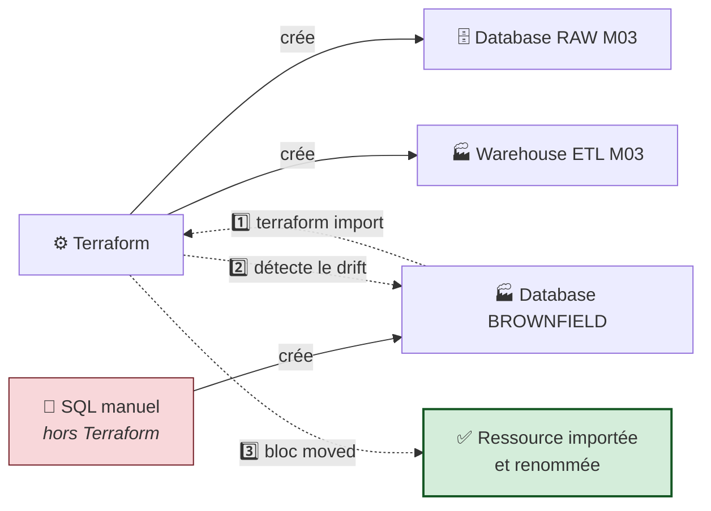

**Objectifs vérifiables :**

- ✅ créer des ressources Snowflake avec Terraform ;
- ✅ importer une ressource Snowflake existante dans Terraform ;
- ✅ générer la configuration à partir de l'import ;
- ✅ détecter et corriger une dérive intentionnelle ;
- ✅ utiliser un bloc `moved` pour refactorer **sans destruction**.

---

## C.1 — 🚦 Pre-flight et base de départ

```powershell
cd "$HOME\Data2AI-Labs\data-platform"
.\scripts\Learner-Login.ps1 -LearnerPrefix APP01
.\scripts\Reset-Lab.ps1 -LearnerPrefix APP01 -Lab M03
cd labs\m03-import-brownfield
Get-ChildItem -Force
```

### 📝 Action 1.1 — Compléter la configuration (comme aux labs précédents)

**`variables.tf` — ajoutez à la fin :**

```hcl
variable "warehouse_size" {
  type        = string
  description = "Training warehouse size"
  default     = "X-SMALL"

  validation {
    condition     = contains(["X-SMALL", "SMALL"], var.warehouse_size)
    error_message = "Training warehouses must be X-SMALL or SMALL."
  }
}
```

**`locals.tf` :**

```hcl
locals {
  database_name  = "${var.learner_prefix}_M03_RAW_${var.environment}"
  schema_name    = "INGESTION"
  warehouse_name = "WH_${var.learner_prefix}_M03_ETL_${var.environment}"
  common_comment = "Managed by Terraform | Training | ${var.learner_prefix}"
}
```

**`terraform.tfvars` :**

```hcl
snowflake_organization = "ZVFXOZW"
snowflake_account      = "PM71247"
snowflake_user         = "DATA2AI"
learner_prefix         = "APP01"
environment            = "DEV"
warehouse_size         = "X-SMALL"
```

**`main.tf` :**

```hcl
resource "snowflake_database" "raw" {
  name                        = local.database_name
  comment                     = local.common_comment
  data_retention_time_in_days = 1
}

resource "snowflake_schema" "ingestion" {
  database = snowflake_database.raw.name
  name     = local.schema_name
  comment  = local.common_comment
}

resource "snowflake_warehouse" "etl" {
  name                = local.warehouse_name
  comment             = local.common_comment
  warehouse_size      = var.warehouse_size
  auto_suspend        = 60
  auto_resume         = true
  initially_suspended = true
}
```

**`outputs.tf` :**

```hcl
output "database_name" {
  value       = snowflake_database.raw.name
  description = "Database created by the learner"
}

output "schema_name" {
  value       = snowflake_schema.ingestion.name
  description = "Schema created inside the database"
}

output "warehouse_name" {
  value       = snowflake_warehouse.etl.name
  description = "Cost-controlled training warehouse"
}
```

### 📝 Action 1.2 — Appliquer

```powershell
terraform fmt
terraform init
terraform validate
terraform plan -out "m03.tfplan"
terraform apply m03.tfplan
terraform state list
```

✅ **Checkpoint 1 :** `Apply complete! Resources: 3 added` puis 3 adresses listées.

---

## C.2 — Étape 2 : simuler l'existant de l'entreprise

> 🧠 **Le scénario.** Vous arrivez dans une entreprise qui utilise Snowflake depuis trois ans. Des centaines d'objets existent, créés à la main. Vous devez les faire entrer dans Terraform **sans rien détruire**.
> Nous allons simuler cet existant en créant une database **hors Terraform**, en SQL.

### 📝 Action 2.1 — Créer une database à la main

<details open>
<summary>🪟 <b>Windows (PowerShell)</b></summary>

```powershell
$brownfieldDb = "DB_${env:LEARNER_PREFIX}_M03_BROWNFIELD_DEV"
snow sql -c training -q "CREATE DATABASE $brownfieldDb COMMENT = 'Created manually outside Terraform'"
```
</details>

<details>
<summary>🐧 <b>Linux/macOS (Bash)</b></summary>

```bash
brownfield_db="DB_${LEARNER_PREFIX}_M03_BROWNFIELD_DEV"
snow sql -c training -q "CREATE DATABASE ${brownfield_db} COMMENT = 'Created manually outside Terraform'"
```
</details>

### 📝 Action 2.2 — Vérifier son existence

<details open>
<summary>🪟 <b>Windows (PowerShell)</b></summary>

```powershell
snow sql -c training -q "SHOW DATABASES LIKE 'DB_${env:LEARNER_PREFIX}_M03_BROWNFIELD_DEV'"
```
</details>

<details>
<summary>🐧 <b>Linux/macOS (Bash)</b></summary>

```bash
snow sql -c training -q "SHOW DATABASES LIKE 'DB_${LEARNER_PREFIX}_M03_BROWNFIELD_DEV'"
```
</details>

✅ **Checkpoint 2 :** une ligne avec `DB_APP01_M03_BROWNFIELD_DEV`.

### 📝 Action 2.3 — 🔬 Constater l'aveuglement de Terraform

```powershell
terraform state list
terraform plan
```

✅ **Observez :** la database brownfield **n'apparaît nulle part**. `terraform plan` affiche `No changes.`

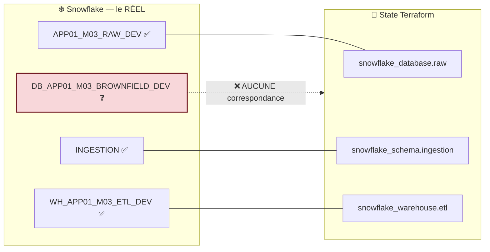

> 🧠 **La leçon fondamentale.** Terraform ne gère **que** ce qui est dans son state. Une ressource qu'il n'a pas créée lui est totalement invisible — il ne la détruira pas, mais il ne la gérera pas non plus. C'est une **ressource orpheline**.

---

## C.3 — Étape 3 : importer

### 📝 Action 3.1 — Écrire un bloc `resource` cible

> ⚠️ **Cette étape est OBLIGATOIRE avant l'import.** Sans adresse de destination, Terraform ne sait pas où ranger la ressource importée.

Dans `main.tf`, **ajoutez à la fin** (remplacez `APP01` par votre préfixe) :

```hcl
resource "snowflake_database" "brownfield" {
  name = "DB_APP01_M03_BROWNFIELD_DEV"
}
```

> 🧠 **Un bloc minimal suffit pour l'import.** Terraform n'a besoin que de l'adresse. Il complétera le state depuis l'API. Vous compléterez le **code** ensuite.

```powershell
terraform fmt
terraform validate
```

✅ `Success! The configuration is valid.`

### 📝 Action 3.2 — Lancer l'import

<details open>
<summary>🪟 <b>Windows (PowerShell)</b></summary>

```powershell
terraform import snowflake_database.brownfield "DB_${env:LEARNER_PREFIX}_M03_BROWNFIELD_DEV"
```
</details>

<details>
<summary>🐧 <b>Linux/macOS (Bash)</b></summary>

```bash
terraform import snowflake_database.brownfield "DB_${LEARNER_PREFIX}_M03_BROWNFIELD_DEV"
```
</details>

**Décomposition de la commande :**

```text
  terraform import   snowflake_database.brownfield   "DB_APP01_M03_BROWNFIELD_DEV"
        │                       │                              │
        │                       │                              └── L'IDENTIFIANT côté Snowflake
        │                       │                                  (format défini par le provider,
        │                       │                                   documenté pour chaque ressource)
        │                       └───────────────────────────────── L'ADRESSE Terraform de destination
        └───────────────────────────────────────────────────────── La commande
```

✅ **Checkpoint 3 :**

```text
snowflake_database.brownfield: Importing from ID "DB_APP01_M03_BROWNFIELD_DEV"...
snowflake_database.brownfield: Import prepared!
  Prepared snowflake_database for import
snowflake_database.brownfield: Refreshing state...

Import successful!
```

> 🎓 **Point d'examen — le format de l'ID.** Il est **spécifique à chaque type de ressource** et documenté dans le Registry, section *Import*. Pour une database Snowflake, c'est le nom. Pour un schema, c'est `DATABASE|SCHEMA`. Pour un grant, c'est une chaîne composite longue. **Toujours consulter la doc du provider** avant un import.

### 📝 Action 3.3 — Vérifier le state

```powershell
terraform state list
terraform state show snowflake_database.brownfield
```

✅ **Checkpoint :** `snowflake_database.brownfield` apparaît, **avec tous ses attributs réels** — y compris `comment = "Created manually outside Terraform"`, que vous n'avez jamais écrit dans le code.

### 📝 Action 3.4 — 🔬 Découvrir le décalage code / state

```powershell
terraform plan
```

**Ce que vous voyez :** Terraform propose de **modifier** la ressource — parce que votre code ne contient que `name`, alors que le state contient tous les attributs.

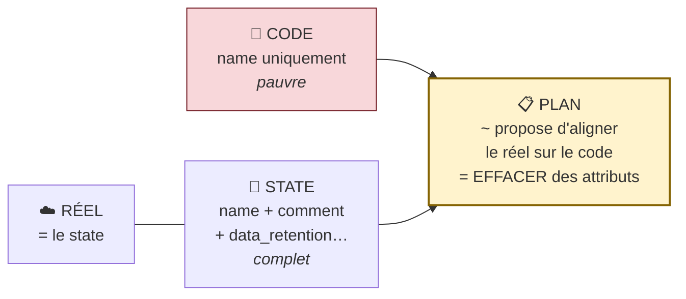

> ⚠️ **Piège classique n°11, illustré en direct.** `terraform import` remplit le **state**, jamais le **code**. Tant que le code n'est pas complété, chaque `plan` proposera de « corriger » le réel vers un code incomplet. **Ne surtout pas appliquer à ce stade.**

### 📝 Action 3.5 — Générer la configuration automatiquement

<details open>
<summary>🪟 <b>Windows (PowerShell)</b></summary>

```powershell
terraform plan -generate-config-out=generated.tf
```
</details>

<details>
<summary>🐧 <b>Linux/macOS (Bash)</b></summary>

```bash
terraform plan -generate-config-out=generated.tf
```
</details>

```powershell
code generated.tf
```

> 🔬 **Ce que Terraform vient de faire.** Il a lu les attributs réels et généré le HCL correspondant. C'est un **gain de temps considérable** sur un import de masse — imaginez 200 databases à décrire à la main.
>
> ⚠️ **Mais le fichier généré est un BROUILLON, pas un livrable.** Il contient souvent des attributs vides, des valeurs par défaut redondantes, des champs en lecture seule. Vous devez le **relire et le nettoyer** avant intégration. Le code généré par une machine n'est pas du code de production tant qu'un humain ne l'a pas revu.

### 📝 Action 3.6 — Intégrer et nettoyer

Copiez les attributs **pertinents** de `generated.tf` dans le bloc `snowflake_database.brownfield` de `main.tf`, puis supprimez le fichier généré :

<details open>
<summary>🪟 <b>Windows (PowerShell)</b></summary>

```powershell
Remove-Item generated.tf
```
</details>

<details>
<summary>🐧 <b>Linux/macOS (Bash)</b></summary>

```bash
rm generated.tf
```
</details>

**Votre `main.tf` doit maintenant contenir (avec votre préfixe) :**

```hcl
resource "snowflake_database" "brownfield" {
  name                        = "DB_APP01_M03_BROWNFIELD_DEV"
  comment                     = "Created manually outside Terraform"
  data_retention_time_in_days = 1
}
```

### 📝 Action 3.7 — Prouver l'alignement

```powershell
terraform fmt
terraform validate
terraform plan
```

✅ **Checkpoint 4 :**

```text
No changes. Your infrastructure matches the configuration.
```

> 🏆 **L'adoption est réussie.** Les trois représentations sont alignées :
>
> ```text
>   📜 CODE   =   📄 STATE   =   ☁️ RÉEL
> ```
>
> Une ressource créée à la main, hors Terraform, est désormais **gérée par Terraform**, sans avoir été détruite ni recréée une seule fois. **C'est la compétence brownfield.**

---

## C.4 — Étape 4 : détecter et corriger une dérive

### 📝 Action 4.1 — Provoquer la dérive

<details open>
<summary>🪟 <b>Windows (PowerShell)</b></summary>

```powershell
snow sql -c training -q "ALTER DATABASE DB_${env:LEARNER_PREFIX}_M03_BROWNFIELD_DEV SET COMMENT = 'Modified outside Terraform'"
```
</details>

<details>
<summary>🐧 <b>Linux/macOS (Bash)</b></summary>

```bash
snow sql -c training -q "ALTER DATABASE DB_${LEARNER_PREFIX}_M03_BROWNFIELD_DEV SET COMMENT = 'Modified outside Terraform'"
```
</details>

### 📝 Action 4.2 — Détecter avec `-refresh-only` (l'audit)

```powershell
terraform plan -refresh-only
```

> 🔬 **C'est la commande d'audit de dérive.** Elle affiche uniquement les écarts détectés entre le state et le réel, **sans proposer** de modifier l'infrastructure. C'est celle qu'on planifie la nuit en CI pour surveiller les modifications hors processus. Vous la retrouverez au **Jour 5**, dans le pipeline Azure DevOps.

### 📝 Action 4.3 — Détecter avec un plan classique

```powershell
terraform plan
```

✅ **Checkpoint :**

```text
  # snowflake_database.brownfield will be updated in-place
  ~ resource "snowflake_database" "brownfield" {
      ~ comment = "Modified outside Terraform" -> "Created manually outside Terraform"
        id      = "DB_APP01_M03_BROWNFIELD_DEV"
        name    = "DB_APP01_M03_BROWNFIELD_DEV"
    }

Plan: 0 to add, 1 to change, 0 to destroy.
```

> 🧠 **Rappel du sens de la flèche :** `~ attribut = "RÉEL actuel" -> "DÉSIRÉ (votre code)"`.

### 📝 Action 4.4 — Décider, puis corriger

> 🛑 **Ce n'est pas un réflexe, c'est une décision.** Rappelez-vous les trois réponses possibles (Partie A.6.4) :
>
> | Option | Ce que ça signifie | Action |
> |---|---|---|
> | **A. Le code gagne** | La modification manuelle était une erreur | `terraform apply` |
> | **B. Le réel gagne** | La modification était légitime | Éditer le `.tf` puis appliquer |
> | **C. On ignore** | Un autre système gère cet attribut | `lifecycle { ignore_changes = [comment] }` |
>
> **Ici, nous choisissons A** : le code versionné fait autorité.

```powershell
terraform apply
```

Tapez `yes` après relecture du plan.

✅ **Checkpoint :** le commentaire est revenu à la valeur du code.

### 📝 Action 4.5 — Prouver l'idempotence

```powershell
terraform plan
```

✅ **Checkpoint 5 :** `No changes.`

---

## C.5 — Étape 5 : refactorer avec un bloc `moved`

> 🧠 **Le besoin.** Le nom `brownfield` désignait l'*origine* de la ressource. Maintenant qu'elle est gérée par Terraform, un nom comme `imported` est plus juste. C'est un **renommage de code**, sans aucun changement d'infrastructure.

### 📝 Action 5.1 — 🔬 Expérience : ce qui se passe SANS `moved`

> Cette expérience est **facultative mais très instructive**. Faites-la : elle grave le concept.

Dans `main.tf`, renommez **temporairement** la ressource :

```hcl
resource "snowflake_database" "imported" {
  name                        = "DB_APP01_M03_BROWNFIELD_DEV"
  comment                     = "Created manually outside Terraform"
  data_retention_time_in_days = 1
}
```

```powershell
terraform plan
```

⚠️ **Observez le désastre :**

```text
  # snowflake_database.brownfield will be destroyed
  # (because snowflake_database.brownfield is not in configuration)
  - resource "snowflake_database" "brownfield" { … }

  # snowflake_database.imported will be created
  + resource "snowflake_database" "imported" { … }

Plan: 1 to add, 0 to change, 1 to destroy.
```

> 🔴 **Terraform veut DÉTRUIRE puis RECRÉER.** Sur une base de production, cela signifierait **la perte de toutes les données**. Terraform n'a aucun moyen de deviner qu'il s'agit du même objet renommé : pour lui, une adresse a disparu et une autre est apparue.
>
> ⛔ **N'appliquez surtout pas.**

### 📝 Action 5.2 — Ajouter le bloc `moved`

**En haut de `main.tf`**, ajoutez :

```hcl
moved {
  from = snowflake_database.brownfield
  to   = snowflake_database.imported
}
```

### 📝 Action 5.3 — Replanifier

```powershell
terraform fmt
terraform plan
```

✅ **Checkpoint 6 :**

```text
Terraform will perform the following actions:

  # snowflake_database.brownfield has moved to snowflake_database.imported
    resource "snowflake_database" "imported" {
        id   = "DB_APP01_M03_BROWNFIELD_DEV"
        name = "DB_APP01_M03_BROWNFIELD_DEV"
        # (2 unchanged attributes hidden)
    }

Plan: 0 to add, 0 to change, 0 to destroy.
```

> 🏆 **`0 to destroy`.** Vous venez de renommer une ressource **sans y toucher**. La différence entre les deux plans, à une seule déclaration près :
>
> | | Sans `moved` | Avec `moved` |
> |---|---|---|
> | Plan | `1 to add, 1 to destroy` | `0 to add, 0 to destroy` |
> | Données | 🔴 **perdues** | ✅ **intactes** |
> | Interruption | 🔴 oui | ✅ aucune |

### 📝 Action 5.4 — Appliquer

```powershell
terraform apply
terraform state list
```

✅ Le state contient désormais `snowflake_database.imported` (et plus `…brownfield`).

### 📝 Action 5.5 — Supprimer le bloc `moved`

Une fois le déplacement appliqué **par tout le monde**, le bloc devient inutile. Supprimez-le de `main.tf`.

```powershell
terraform fmt
terraform validate
terraform plan
```

✅ **Checkpoint 7 :** `No changes.`

> 🧠 **Le cycle de vie complet d'un `moved` :**
>
> ```text
>   1. Écrire le bloc  →  2. Commit + PR  →  3. Chaque collègue et la CI appliquent
>                                          →  4. Supprimer le bloc au sprint suivant
> ```
>
> C'est toute la supériorité de `moved {}` sur `terraform state mv` : le premier est **du code partagé**, le second est **une commande jouée par une seule personne sur son poste**.

---

## C.6 — 🐛 Chaos Lab : la casse des identifiants Snowflake

> *Snowflake met les identifiants non quotés en MAJUSCULES. Vous allez le constater en conditions réelles.*

### Symptôme — injecter l'erreur

Ajoutez temporairement dans `main.tf` un bloc `import` avec un identifiant en minuscules :

```hcl
import {
  to = snowflake_database.imported
  id = "db_app01_m03_brownfield_dev"   # ← minuscules
}
```

### Diagnostic

```powershell
terraform plan
```

```text
Error: Cannot import non-existent remote object

While attempting to import an existing object to
"snowflake_database.imported", the provider detected that no object exists
with the given id. Only pre-existing objects can be imported; check that the
id is correct and that it is associated with the provider's configured region
or endpoint, or use "terraform apply" to create a new remote object for this
resource.
```

> 🔬 **Pourquoi ?** En SQL, `CREATE DATABASE ma_base` crée en réalité `MA_BASE`. Seuls les identifiants **entre guillemets doubles** conservent leur casse : `CREATE DATABASE "ma_base"` crée bien `ma_base`, et il faudra ensuite toujours le citer entre guillemets. L'identifiant d'import doit correspondre **exactement** à ce qui est stocké.

### Remédiation

Rétablissez les majuscules :

```hcl
import {
  to = snowflake_database.imported
  id = "DB_APP01_M03_BROWNFIELD_DEV"
}
```

```powershell
terraform plan
```

✅ Terraform reconnaît que la ressource est **déjà** dans le state et n'a rien à importer.

**Supprimez le bloc `import`** avant de continuer.

> 🎓 **Vous venez de rencontrer la forme déclarative de l'import.** Comparez avec la commande de l'action 3.2 :
>
> | | Commande `terraform import` | Bloc `import {}` |
> |---|---|---|
> | Visible dans le `plan` ? | ❌ non — effet immédiat | ✅ **oui — relisible avant apply** |
> | Versionné dans Git ? | ❌ non | ✅ **oui** |
> | Rejouable par la CI ? | ❌ non | ✅ oui |
> | Génération de config | — | ✅ `-generate-config-out` |
>
> **En production, préférez le bloc `import {}`** : il passe par une pull request, il est relu, il est rejouable.

---

## C.7 — 🤖 Validation automatisée

```powershell
cd "$HOME\Data2AI-Labs\data-platform"
.\scripts\SelfPacedLab.ps1 -Module 3 -All -Report
```

✅ **Résultat attendu :**

```text
[PASS] T1 import block declared
[PASS] T2 generated config cleaned
[PASS] T3 Drift detected and corrected
[PASS] T4 moved block used (zero destroy)
[PASS] T5 terraform fmt & validate
Result: 5/5 Tasks Passed.
```

---

## C.8 — 🏆 Défi autonome

> **Scénario :** importez le **warehouse** créé dans ce lab dans une nouvelle ressource `snowflake_warehouse.imported_etl`, en utilisant un bloc `moved`.
>
> **Contraintes :**
> - l'import réussit ;
> - `terraform plan` affiche `No changes` après alignement ;
> - le bloc `moved` déplace la ressource **sans destruction** ;
> - `terraform state list` affiche le nouveau nom.

<details>
<summary>💡 <b>Indice</b></summary>

Le warehouse est **déjà** géré par Terraform sous l'adresse `snowflake_warehouse.etl`. Vous n'avez donc **pas** besoin de l'importer : il suffit de le **déplacer** dans le state avec un bloc `moved`. Relisez bien l'énoncé — le piège est là.
</details>

<details>
<summary>✅ <b>Solution de référence</b></summary>

**`main.tf` — renommez la ressource :**

```hcl
resource "snowflake_warehouse" "imported_etl" {
  name                = local.warehouse_name
  comment             = local.common_comment
  warehouse_size      = var.warehouse_size
  auto_suspend        = 60
  auto_resume         = true
  initially_suspended = true
}

moved {
  from = snowflake_warehouse.etl
  to   = snowflake_warehouse.imported_etl
}
```

**`outputs.tf` — mettez à jour la référence :**

```hcl
output "warehouse_name" {
  value       = snowflake_warehouse.imported_etl.name
  description = "Cost-controlled training warehouse"
}
```

```powershell
terraform fmt
terraform validate
terraform plan       # → 0 to add, 0 to change, 0 to destroy + « has moved to »
terraform apply -auto-approve
terraform state list # → snowflake_warehouse.imported_etl
```

> ⚠️ **Le piège de l'output.** Si vous oubliez de mettre à jour `outputs.tf`, `terraform validate` échoue : la référence `snowflake_warehouse.etl` n'existe plus. **Un renommage se propage à toutes les références du code.**
</details>

| Critère d'évaluation | Points |
|---|---:|
| Syntaxe HCL et respect des standards | 30 |
| Preuve d'exécution fonctionnelle | 30 |
| Idempotence (`0 to add, 0 to change, 0 to destroy`) | 20 |
| Respect des budgets FinOps & Sécurité | 20 |
| **Total** | **100** |

---

## C.9 — 🧹 Nettoyage

Détruisez toutes les ressources de ce lab, **y compris la database brownfield importée** :

<details open>
<summary>🪟 <b>Windows (PowerShell)</b></summary>

```powershell
cd "$HOME\Data2AI-Labs\data-platform\labs\m03-import-brownfield"
terraform destroy -auto-approve
```
</details>

<details>
<summary>🐧 <b>Linux/macOS (Bash)</b></summary>

```bash
cd "$HOME/Data2AI-Labs/data-platform/labs/m03-import-brownfield"
terraform destroy -auto-approve
```
</details>

✅ **Checkpoint cleanup :**

```text
Destroy complete! Resources: 4 destroyed.
```

> 🧠 **Le chiffre 4 est une preuve pédagogique.** Il compte la database RAW, le schema, le warehouse **et** la database brownfield. Cette dernière n'avait **pas** été créée par Terraform — mais elle est détruite par lui, parce qu'elle a été **importée**.
>
> **La leçon :** importer, c'est **prendre la responsabilité complète du cycle de vie** de la ressource, y compris sa destruction. C'est une décision d'engagement, pas un simple geste technique. En production, on n'importe que ce qu'on est prêt à gérer de bout en bout.

Pour repartir d'un état propre :

```powershell
cd "$HOME\Data2AI-Labs\data-platform"
.\scripts\Reset-Lab.ps1 -LearnerPrefix APP01 -Lab M03
```

---
---
# PARTIE D — 📚 CONSOLIDATION

---

## D.1 — 🎓 Quiz de fin de journée (style Terraform Associate 003)

---

**Q1.** Parmi ces propositions, laquelle **n'est PAS** un rôle du state Terraform ?

- A. Établir la correspondance entre configuration et objets réels
- B. Mémoriser les dépendances entre ressources
- C. **Chiffrer les credentials du provider**
- D. Servir de cache de performance

---

**Q2.** Pourquoi ne commite-t-on jamais `terraform.tfstate` dans Git ?

- A. Il est trop volumineux
- B. Il contient des données sensibles en clair, Git n'offre aucun verrouillage, et il change à chaque apply
- C. Terraform l'interdit techniquement
- D. Il est généré automatiquement à chaque `plan`

---

**Q3.** Que fait `terraform init -migrate-state` ?

- A. Il met à jour la version de Terraform
- B. Il copie le state existant vers le nouveau backend configuré
- C. Il supprime le state local
- D. Il importe les ressources existantes

---

**Q4.** Pourquoi ne peut-on pas écrire `key = "training/${var.prefix}/state"` dans un bloc `backend` ?

- A. Le caractère `$` est interdit dans les chemins Azure
- B. Le bloc `backend` est évalué avant toute variable, il n'accepte aucune expression
- C. Les variables ne sont accessibles que dans `main.tf`
- D. C'est possible depuis Terraform 1.5

---

**Q5.** Quelle est la différence entre `terraform destroy` et `terraform state rm` ?

- A. Aucune
- B. `destroy` supprime l'objet réel ; `state rm` le retire seulement du state, l'objet reste
- C. `state rm` supprime l'objet réel ; `destroy` vide le state
- D. `state rm` fonctionne uniquement sur un state local

---

**Q6.** Après `terraform import`, pourquoi `terraform plan` affiche-t-il encore des différences ?

- A. L'import a échoué
- B. `import` remplit le state, pas le code ; il faut compléter la configuration
- C. Le provider est mal configuré
- D. Il faut relancer `terraform init`

---

**Q7.** Quel mécanisme Azure Blob Storage assure le verrouillage du state ?

- A. Une table DynamoDB
- B. Le Blob Lease natif
- C. Un fichier `.lock` dans le conteneur
- D. Azure Key Vault

---

**Q8.** Quand utiliser `terraform force-unlock` ?

- A. À chaque fois qu'un verrou apparaît, pour aller plus vite
- B. Uniquement quand le processus détenant le verrou est certainement mort, après vérification auprès de son propriétaire
- C. Systématiquement au début de chaque pipeline CI
- D. Jamais, la commande n'existe pas

---

**Q9.** Le bloc `moved { from = A  to = B }` produit un plan :

- A. `1 to add, 1 to destroy`
- B. `0 to add, 0 to change, 0 to destroy` avec la mention « has moved to »
- C. `1 to change`
- D. Une erreur, car `moved` n'est valable qu'entre modules

---

**Q10.** `data "terraform_remote_state"` permet d'accéder :

- A. à tous les attributs de toutes les ressources de l'autre state
- B. uniquement aux `outputs` déclarés dans l'autre projet
- C. au code source de l'autre projet
- D. aux variables de l'autre projet

---

**Q11.** Quel champ du state empêche un state ancien d'écraser un state récent ?

- A. `lineage`
- B. `serial`
- C. `version`
- D. `terraform_version`

---

**Q12.** Pourquoi crée-t-on le Storage Account avec Azure CLI plutôt qu'avec Terraform ?

- A. Terraform ne sait pas créer de Storage Account
- B. Paradoxe du bootstrapping : Terraform aurait besoin d'un backend pour mémoriser qu'il a créé son propre backend
- C. C'est plus rapide
- D. Le provider `azurerm` ne supporte pas cette ressource

---

**Q13.** `terraform plan -refresh-only` sert à :

- A. accélérer le plan en sautant le rafraîchissement
- B. afficher uniquement les dérives détectées, sans proposer de modification d'infrastructure
- C. supprimer le state distant
- D. régénérer le fichier de lock

---

**Q14.** Le paramètre `key` d'un backend `azurerm` définit :

- A. la clé de chiffrement du state
- B. le chemin du blob dans le conteneur, qui isole les states les uns des autres
- C. la clé d'accès au Storage Account
- D. l'identifiant Azure AD

---

**Q15.** Quelle option permet à un pipeline CI d'attendre qu'un verrou se libère plutôt que d'échouer ?

- A. `-lock=false`
- B. `-lock-timeout=5m`
- C. `-auto-approve`
- D. `-refresh=false`

---

### ✅ Corrigé détaillé

| # | Réponse | Explication |
|:---:|:---:|---|
| **1** | **C** | Les quatre rôles officiels sont *mapping*, *metadata*, *performance*, *syncing*. Le state ne chiffre rien : il stocke même les valeurs sensibles **en clair**. |
| **2** | **B** | Trois raisons cumulées : secrets en clair conservés à jamais dans l'historique Git, absence de verrouillage, et changement à chaque exécution. |
| **3** | **B** | Terraform détecte le changement de backend, demande confirmation, et copie le state vers la nouvelle destination. |
| **4** | **B** | Le backend est initialisé avant l'évaluation de toute variable. La solution est le **backend partiel** + `-backend-config`. |
| **5** | **B** | `state rm` = « Terraform, oublie cette ressource ». L'objet réel devient orphelin mais reste intact. C'est l'inverse d'`import`. |
| **6** | **B** | `import` alimente **uniquement** le state. Le code doit être complété manuellement ou avec `-generate-config-out`. |
| **7** | **B** | Le Blob Lease est un bail exclusif natif d'Azure Storage. Aucune ressource supplémentaire n'est nécessaire (contrairement à l'ancien DynamoDB sur AWS). |
| **8** | **B** | Trois conditions cumulatives : processus mort, vérification humaine, `Lock ID` exact. Forcer pendant une opération active corrompt le state. |
| **9** | **B** | C'est tout l'intérêt : le renommage se fait dans le state, sans aucune action sur l'infrastructure. |
| **10** | **B** | Seuls les `outputs` sont exposés. Ils constituent l'**API publique** du projet ; le reste est un détail d'implémentation. |
| **11** | **B** | `serial` est incrémenté à chaque écriture. `lineage` identifie le state, `version` le format. |
| **12** | **B** | Le backend est une **ressource de socle** (*bootstrap*), créée hors du cycle de vie Terraform qu'elle sert. |
| **13** | **B** | C'est la commande d'**audit de dérive**, à planifier en CI. `apply -refresh-only` met le state à jour sans toucher au réel. |
| **14** | **B** | `key` est le chemin du blob. C'est le mécanisme d'isolation entre projets, environnements et apprenants. |
| **15** | **B** | `-lock-timeout` fait réessayer pendant la durée indiquée. `-lock=false` désactive la protection — à proscrire. |

**Barème :** 12/15 ou plus → vous maîtrisez le state. Moins de 10 → relisez la Partie A.

---

### ✅ Réponses aux 5 questions d'auto-évaluation de la Partie A

1. **Les quatre rôles du state** : mapping (code ↔ réel), métadonnées (dépendances), performance (cache), synchronisation (verrouillage en équipe).
2. **Pourquoi jamais dans Git** : secrets en clair conservés à jamais dans l'historique, aucun verrouillage, et un commit à chaque `apply`.
3. **Pourquoi pas de variable dans `backend`** : le backend est initialisé avant l'évaluation des variables. Solution : backend partiel + `-backend-config`.
4. **`destroy` vs `state rm`** : `destroy` supprime l'objet réel ; `state rm` le retire du state en le laissant intact (il devient orphelin).
5. **Différences après un `import`** : `import` ne remplit que le state. Le code reste incomplet, donc le plan propose d'aligner le réel sur un code plus pauvre.

---

## D.2 — 🃏 Anti-sèche Jour 2

### Les commandes du state

```bash
# ── Lecture — sans risque ────────────────────────────────────
terraform state list                    # lister les adresses gérées
terraform state show <ADRESSE>          # détail d'une ressource
terraform show -json > state.json       # vue normalisée (audit, OPA)
terraform state pull > backup.tfstate   # télécharger le state brut

# ── Écriture — avec précaution ───────────────────────────────
terraform state mv <A> <B>              # ⚠️ préférer un bloc moved {}
terraform state rm <ADRESSE>            # oublier SANS détruire
terraform import <ADRESSE> <ID>         # adopter un objet existant
terraform plan -generate-config-out=x.tf  # générer le HCL après import

# ── Backend ──────────────────────────────────────────────────
terraform init -migrate-state                        # migrer le state
terraform init -reconfigure                          # changer sans migrer
terraform init -backend-config="backend.hcl"         # backend partiel
terraform init -backend=false                        # init sans backend

# ── Dérive ───────────────────────────────────────────────────
terraform plan -refresh-only            # AUDIT : afficher les dérives
terraform apply -refresh-only           # aligner le state sur le réel
terraform plan -refresh=false           # plan rapide, state supposé à jour

# ── Verrouillage ─────────────────────────────────────────────
terraform plan -lock-timeout=5m         # ✅ réessayer 5 min (CI/CD)
terraform plan -lock-timeout=0s         # échouer immédiatement (test)
terraform force-unlock <LOCK_ID>        # 🔴 DERNIER RECOURS

# ── Azure CLI — inspection du backend préconfiguré ─────────────
az group show --name RG -o table
az storage account show --name SA --resource-group RG -o table
az storage container show --name tfstate --account-name SA --auth-mode login -o tsv
az storage blob list --account-name SA --container-name tfstate --auth-mode login --query "[].name" -o tsv
az storage blob delete --account-name SA --container-name tfstate --name "chemin/terraform.tfstate" --auth-mode login
```

### Les blocs du Jour 2

```hcl
# Backend complet (méthode A)
terraform {
  backend "azurerm" {
    resource_group_name  = "rg-data2ai-tf-state"
    storage_account_name = "sadata2aitfstatemsn"
    container_name       = "tfstate"
    key                  = "training/APP01/m02/terraform.tfstate"
    use_azuread_auth     = true
  }
}

# Backend partiel (méthode B) — valeurs dans backend.hcl
terraform {
  backend "azurerm" {}
}

# Lire les outputs d'un autre projet
data "terraform_remote_state" "autre" {
  backend = "azurerm"
  config  = { resource_group_name = "…", storage_account_name = "…",
              container_name = "tfstate", key = "…", use_azuread_auth = true }
}

# Adopter une ressource existante (forme déclarative, TF ≥ 1.5)
import {
  to = snowflake_database.imported
  id = "DB_APP01_M03_BROWNFIELD_DEV"
}

# Renommer sans détruire
moved {
  from = snowflake_database.brownfield
  to   = snowflake_database.imported
}

# Accepter une divergence sur un attribut
resource "snowflake_database" "x" {
  lifecycle {
    ignore_changes = [comment]
  }
}
```

### Le tableau de décision « j'ai une dérive »

| Situation | Commande | Résultat |
|---|---|---|
| Je veux **voir** les dérives | `terraform plan -refresh-only` | Audit, aucune proposition de changement |
| Le **code** a raison | `terraform apply` | Le réel est corrigé |
| Le **réel** a raison | Éditer le `.tf`, puis `terraform apply` | `No changes.` |
| Un autre outil gère cet attribut | `lifecycle { ignore_changes = [x] }` | La dérive est ignorée |
| L'objet ne doit plus être géré | `terraform state rm <ADR>` | Orphelin, non détruit |
| L'objet existe et doit être géré | `terraform import` ou bloc `import {}` | Adopté |

---

## D.3 — 🔧 Troubleshooting Jour 2

| Symptôme | Cause probable | Solution |
|---|---|---|
| `Error acquiring the state lock` | Une autre opération détient le bail | Lire `Who` et `Created`, attendre, ou `-lock-timeout=5m`. `force-unlock` en dernier recours |
| `AuthorizationPermissionMismatch` | Le SP n'a pas le rôle RBAC sur le Storage Account | Demander `Storage Blob Data Contributor` au formateur |
| `Too many command line arguments` | Méthode A + `-backend-config` | Retirer `-backend-config`, relancer `terraform init -migrate-state` |
| `Backend initialization required` | Backend ajouté ou modifié sans `init` | `terraform init -migrate-state` |
| `Error: Failed to get existing workspaces: containers.Client#ListBlobs: 403` | Session Azure expirée ou identité incorrecte | Rejouer `Learner-Login`, vérifier `az account show` |
| `Cannot import non-existent remote object` | ID incorrect, souvent une question de **casse** | Snowflake stocke les identifiants non quotés en MAJUSCULES |
| `Resource already managed by Terraform` | La ressource est déjà dans le state | `terraform state list` pour vérifier avant d'importer |
| Après import, le plan veut **modifier** la ressource | Le code est plus pauvre que le state | Compléter le code, ou `terraform plan -generate-config-out=x.tf` |
| Le plan veut **détruire + recréer** après un renommage | Bloc `moved` absent | Ajouter `moved { from = … to = … }` |
| `state snapshot was created by Terraform vX, which is newer` | Un collègue a utilisé un Terraform plus récent | Aligner les versions ; c'est le rôle de `required_version` |
| `Backend configuration changed` | `backend.tf` modifié | `terraform init -reconfigure` (nouveau state) ou `-migrate-state` (copier l'existant) |
| Le blob n'apparaît pas dans Azure | `key` erronée, ou migration non confirmée | `terraform state pull`, vérifier `.terraform/terraform.tfstate` |
| Deux apprenants écrasent leur state | `key` identique | Chaque apprenant doit avoir **son** préfixe dans la `key` |
| `Error loading state: state data in S3 does not have the expected content` | Blob corrompu ou partiellement écrit | Restaurer une version antérieure (versioning Blob) — d'où l'intérêt de l'activer |

> 🔒 **Rappel avant toute manipulation risquée du state :**
> ```powershell
> terraform state pull | Set-Content "state-backup-$(Get-Date -Format 'yyyyMMdd-HHmmss').json"
> ```
> Une sauvegarde locale du state avant un `state rm`, un `state mv` ou un `force-unlock` coûte 2 secondes et peut sauver une journée. Supprimez-la ensuite : elle contient des secrets.

---

## D.4 — 📖 Glossaire Jour 2 (FR / EN)

| Terme | Définition |
|---|---|
| **State** | Fichier JSON qui relie les adresses de configuration aux objets réels |
| **Backend** | Destination de stockage du state (`local`, `azurerm`, `s3`, `gcs`…) |
| **Backend partiel** (*partial configuration*) | Bloc `backend` incomplet, complété à l'init par `-backend-config` |
| **Bootstrapping** | Création manuelle des ressources de socle dont Terraform dépend |
| **Blob Lease** | Bail exclusif Azure Storage, utilisé comme verrou de state |
| **Lock** / **verrou** | Mécanisme empêchant deux écritures simultanées du state |
| **`force-unlock`** | Suppression forcée d'un verrou — dernier recours |
| **`serial`** | Compteur d'écritures du state ; empêche l'écrasement par un state ancien |
| **`lineage`** | UUID d'identité du state ; empêche de mélanger deux states différents |
| **Migration de state** | Déplacement du state d'un backend vers un autre (`init -migrate-state`) |
| **Greenfield** | Infrastructure entièrement créée par Terraform |
| **Brownfield** | Infrastructure préexistante à adopter |
| **Import** | Ajout au state d'un objet existant, sans le recréer |
| **Ressource orpheline** | Objet réel non référencé dans le state |
| **Dérive** (*drift*) | Divergence entre le state et l'état réel |
| **`refresh`** | Mise à jour du state depuis l'API du provider |
| **`-refresh-only`** | Mode qui affiche/applique uniquement les écarts, sans modifier l'infrastructure |
| **Bloc `moved`** | Déclaration de renommage d'adresse, sans destruction |
| **`terraform_remote_state`** | Data source lisant les `outputs` d'un autre state |
| **RBAC** | *Role-Based Access Control* — modèle de droits Azure |
| **Service Principal (SP)** | Identité applicative Azure AD, utilisée par les automatisations |
| **`use_azuread_auth`** | Option du backend `azurerm` imposant l'authentification par identité plutôt que par clé partagée |
| **LRS / ZRS / GRS** | Niveaux de redondance du stockage Azure (local / zone / géographique) |

---

## D.5 — ✅ Definition of Done du Jour 2

- [ ] Je sais citer les **quatre rôles** du state et expliquer pourquoi il ne va jamais dans Git.
- [ ] J'ai **ouvert** un `terraform.tfstate` et j'y ai identifié `version`, `serial`, `lineage`, `resources`, `attributes`.
- [ ] J'ai créé un Resource Group, un Storage Account et un conteneur avec Azure CLI, et je sais **expliquer le paradoxe du bootstrapping**.
- [ ] J'ai migré un state local vers Azure et obtenu `Terraform has automatically migrated your state`.
- [ ] J'ai **vu le blob** dans le portail Azure, avec son chiffrement au repos et son *Lease status*.
- [ ] J'ai provoqué un conflit de verrou depuis deux terminaux et **lu** les champs `Who`, `Operation`, `Created`, `ID`.
- [ ] Je sais dans quelles conditions — et seulement celles-là — `force-unlock` est acceptable.
- [ ] J'ai lu un output d'un autre projet avec `terraform_remote_state`, et je sais que **seuls les outputs sont accessibles**.
- [ ] J'ai importé une ressource brownfield et obtenu `No changes.` après alignement du code.
- [ ] J'ai constaté qu'un renommage **sans** `moved` produit `1 to add, 1 to destroy`, et **avec** `moved` produit `0 to destroy`.
- [ ] J'ai détecté une dérive avec `-refresh-only` puis je l'ai corrigée.
- [ ] `SelfPacedLab.ps1 -Module 2` et `-Module 3` affichent `5/5 Tasks Passed`.
- [ ] J'ai obtenu au moins 12/15 au quiz.

---

## D.6 — 🧠 Synthèse : le modèle mental complet après deux jours

```mermaid
flowchart TB
    subgraph J1["📅 JOUR 1 — Écrire l'infrastructure"]
        D1["📜 CODE (.tf)<br/>versions · provider · variables<br/>locals · main · outputs<br/><i>versionné dans Git</i>"]
    end

    subgraph J2["📅 JOUR 2 — La posséder dans la durée"]
        D2["📄 STATE<br/>Azure Blob Storage<br/>chiffré · verrouillé · partagé<br/><i>la mémoire de l'équipe</i>"]
    end

    D3["☁️ RÉEL<br/>Snowflake + Azure<br/><i>la source de vérité ultime</i>"]

    D1 -->|"plan / apply"| D2
    D2 -->|"apply"| D3
    D3 -->|"refresh"| D2
    D3 -.->|"import<br/><i>adopter l'existant</i>"| D2
    D2 -.->|"moved<br/><i>refactorer</i>"| D2
    D3 -.->|"drift<br/><i>modification hors process</i>"| D2

    style D1 fill:#d4edda,stroke:#155724,stroke-width:2px
    style D2 fill:#fff3cd,stroke:#856404,stroke-width:3px
    style D3 fill:#d1ecf1,stroke:#0c5460,stroke-width:2px
```

**Les six vérités à retenir de ces deux jours :**

| # | Vérité |
|:---:|---|
| 1 | Terraform lit **tous** les `.tf` du dossier. Le découpage en fichiers est une convention **humaine**. |
| 2 | Le nom local (`"raw"`) et le nom réel (`"APP01_M01_RAW_DEV"`) sont **deux choses différentes**. |
| 3 | Le `plan` est **en lecture seule**. Il se lit avant chaque `apply`, et `0 to destroy` se vérifie **toujours**. |
| 4 | Le state est la **mémoire** de Terraform. Sans lui, il est aveugle. Avec lui mal protégé, il est dangereux. |
| 5 | `import` remplit le **state**, jamais le **code**. Il faut toujours compléter la configuration ensuite. |
| 6 | Un renommage sans `moved` **détruit**. La différence entre les deux tient en trois lignes de HCL. |

---

## D.7 — 🔮 Ce que le Jour 2 laisse en suspens

```mermaid
flowchart TB
    Q1["❓ <b>Je copie-colle le même code<br/>dans chaque lab.</b><br/>Comment factoriser ?<br/>Comment déployer la MÊME chose<br/>en DEV, UAT et PROD sans dupliquer ?"]
    Q2["❓ <b>Qui a le droit de faire quoi ?</b><br/>Mon PAT donne les droits SYSADMIN.<br/>Comment appliquer le moindre privilège ?"]
    Q3["❓ <b>Et si ce n'était plus MOI<br/>qui lançais apply ?</b><br/>Comment un pipeline fait-il<br/>sans mon PAT sur son disque ?"]

    J3["📅 <b>JOUR 3</b><br/>Modules réutilisables<br/>Environnements DEV / UAT / PROD"]
    J4["📅 <b>JOUR 4</b><br/>RBAC as Code · Identité JWT<br/>Azure Key Vault · Ingestion ADLS"]
    J5["📅 <b>JOUR 5</b><br/>CI/CD Azure DevOps · Policy as Code<br/>FinOps · Data Products · Capstone"]

    Q1 --> J3
    Q2 --> J4
    Q3 --> J5

    style Q1 fill:#fff3cd,stroke:#856404
    style Q2 fill:#fff3cd,stroke:#856404
    style Q3 fill:#fff3cd,stroke:#856404
    style J3 fill:#d4edda,stroke:#155724,stroke-width:2px
    style J4 fill:#d1ecf1,stroke:#0c5460,stroke-width:2px
    style J5 fill:#e7e4f9,stroke:#5c4ee5,stroke-width:2px
```

---

## D.8 — 📚 Pour aller plus loin

| Ressource | Pourquoi la consulter |
|---|---|
| *HashiCorp Developer — Terraform State* | La documentation de référence sur les quatre rôles du state |
| *HashiCorp Developer — Backend Configuration* | Le catalogue complet des backends et la configuration partielle |
| *HashiCorp Developer — Import* | Le bloc `import {}` et `-generate-config-out` |
| *HashiCorp Developer — Refactoring (`moved`)* | Tous les cas d'usage du bloc `moved` |
| *Terraform Registry — `snowflakedb/snowflake`* | Les attributs et les formats d'ID d'import de chaque ressource |
| *Microsoft Learn — Store Terraform state in Azure Storage* | Le tutoriel officiel Azure, complémentaire au Lab 3 |
| *Terraform Associate (003) — Study Guide* | Le référentiel officiel de l'examen |

> 🎓 **Préparation à la certification.** Les Jours 1 et 2 couvrent les objectifs **1** (concepts IaC), **2** (Terraform hors CLI), **3** (installation), **4** (workflow CLI), **5** (interaction avec les modules — partiellement), **6** (workflow complet), **7** (état), **8** (lecture et écriture de configuration) et **9** (HCP Terraform — partiellement). Restent principalement le Jour 3 (modules) et le Jour 5 (CI/CD, HCP Terraform).

---

## Navigation

[← Jour 1 — Fondations](../day-01/atelier-jour-01.md) · **Jour 2 — Le State** · [Jour 3 — Modules et logique dynamique →](../day-03/atelier-jour-03.md)

*Ateliers sources : `labs/m02-state-management/lab.md` · `labs/m03-import-brownfield/lab.md`*
