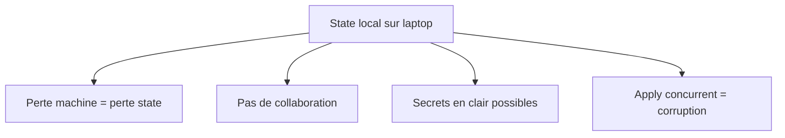
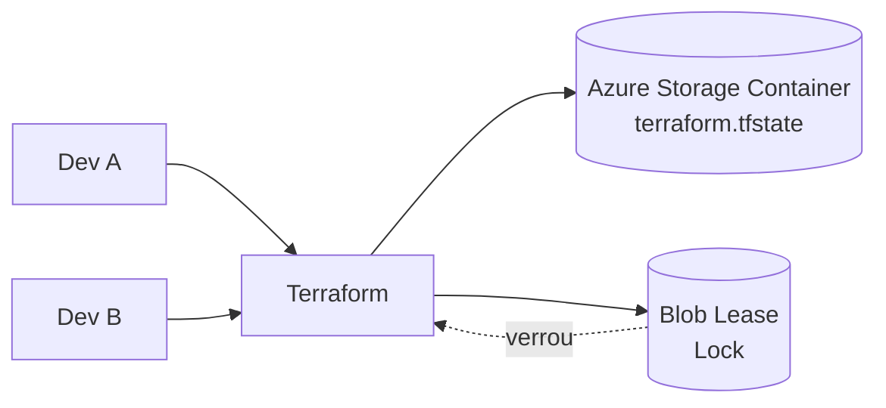
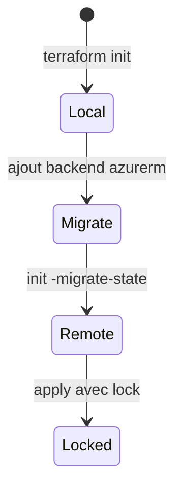

# Module 2 — Slides : Gestion du State

---

## Slide 1 — Titre

**Module 2 : State Management**  
*Durée : 2h*

---

## Slide 2 — Qu'est-ce que le State ?

- Fichier JSON `.tfstate` (ou distant)
- Mappe adresses Terraform ↔ IDs réels Snowflake
- Contient métadonnées, outputs, dépendances

> **Sans state**, Terraform ne sait pas qu'il a déjà créé `DB_RAW_DEV`.

---

## Slide 3 — Anatomy du .tfstate

```json
{
  "resources": [{
    "type": "snowflake_database",
    "name": "raw",
    "instances": [{
      "attributes": {
        "id": "DB_RAW_DEV",
        "name": "DB_RAW_DEV"
      }
    }]
  }]
}
```

---

## Slide 4 — Risques du state local



---

## Slide 5 — Backend distant Azure Blob Storage (azurerm)



---

## Slide 6 — State Locking

| Sans lock | Avec lock |
|-----------|-----------|
| 2 apply simultanés | 2e apply **bloqué** |
| State corrompu | Intégrité garantie |

Message typique : `Error acquiring the state lock`

---

## Slide 7 — Migration state local → distant



---

## Slide 8 — Atelier M2

Migration vers backend Azure Blob sécurisé
→ Lab : [lab.md](lab.md)

---

## Slide 9 — Règles d'or

1. **Ne jamais** committer `.tfstate` dans Git
2. Chiffrer le Storage Account Azure (SSE-CMK ou Microsoft-managed)
3. RBAC least privilege sur le Storage Account (Storage Blob Data Contributor)
4. Activer le versioning des blobs (recovery)
5. Backup régulier du state

---

## Patterns State

| Pattern | Application |
|---------|-------------|
| Remote State | Azure Blob Storage (azurerm) = partagé + lock |
| Isolation | Clé de blob par environnement |
| Migration | `init -migrate-state` (jamais manuel) |
| Composition | `terraform_remote_state` en lecture seule |

