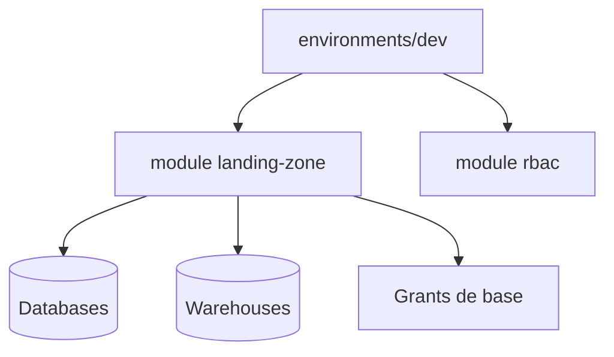
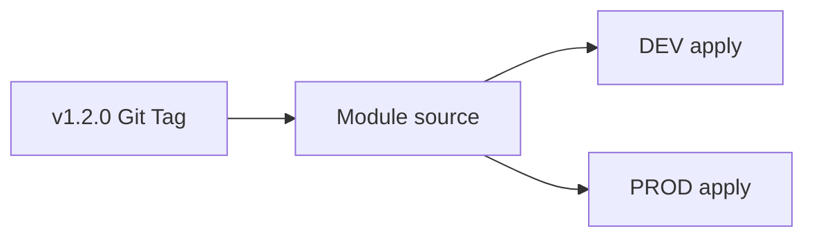

# Module 5 ? Slides : Création de Modules

**Durée : 2h** ? Module Snowflake Landing Zone

---

## Slide 1 ? Pourquoi modulariser ?

- DRY (Don't Repeat Yourself)
- Test unitaire par module
- Versionnement Git (`source = "git::..."`)
- Séparation Landing Zone / RBAC / Ingestion



---

## Slide 2 ? Structure module

```
modules/landing-zone/
??? main.tf
??? variables.tf
??? outputs.tf
??? README.md
```

---

## Slide 3 ? Appel module

```hcl
module "landing_zone" {
  source      = "../../modules/landing-zone"
  environment = "DEV"
  warehouses  = { etl = "X-SMALL", analytics = "SMALL" }
}
```

---

## Slide 4 ? Versionnement Git

```hcl
source = "git::https://github.com/org/tf-modules.git//landing-zone?ref=v1.2.0"
```



---

## Atelier ? [lab.md](lab.md)

---

## Patterns Modules

| Pattern | Application |
|---------|-------------|
| DRY | Module unique, N environnements |
| Contrat | inputs (variables) / outputs (outputs) |
| Versionnement | Git tag SemVer (`v1.2.0`) |
| Composition | Module parent appelle modules enfants |

