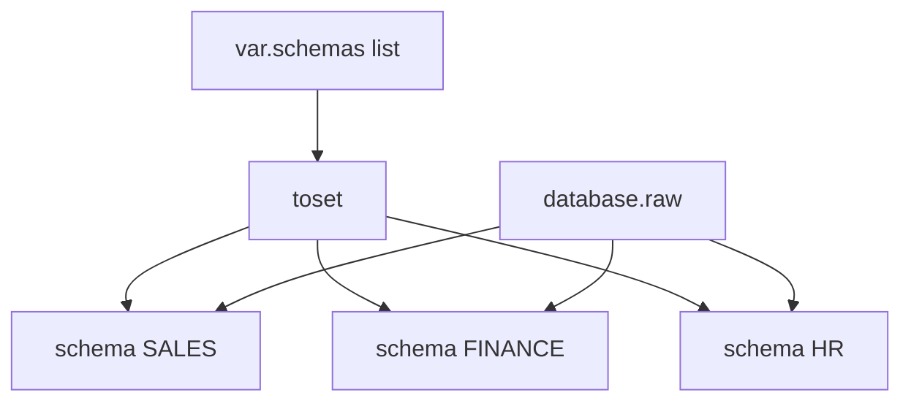

# Module 6 ? Slides : Logique Dynamique

**for_each ? count ? dynamic blocks**

---

## Slide 1 ? count vs for_each

| | count | for_each |
|---|-------|----------|
| Clé | Index 0,1,2 | Map/set string |
| Suppression milieu | Recréation cascade | Ciblé par clé |
| Usage | Liste ordonnée | **Recommand?** (schemas, rôles) |

```hcl
resource "snowflake_schema" "this" {
  for_each = toset(var.schemas)
  name     = each.key
  database = snowflake_database.raw.name
}
```

---

## Slide 2 ? dynamic blocks

```hcl
dynamic "tag" {
  for_each = var.tags
  content {
    name  = tag.key
    value = tag.value
  }
}
```

---

## Slide 3 ? Flux for_each



---

## Atelier ? [lab.md](lab.md)

---

## Patterns Dynamique

| Pattern | Application |
|---------|-------------|
| for_each > count | Identit? stable par clé, modifications chirurgicales |
| toset() | Garantit l'unicité pour `for_each` sur list(string) |
| for expressions | Transformations puissantes dans outputs |
| dynamic blocks | Blocs nested optionnels, code <= données |

