# 🎓 Atelier Jour 3 — Factoriser : modules réutilisables et logique dynamique

## *Du copier-coller au composant versionné — modules, `for_each`, `for`, `dynamic` et `count`*

> **Parcours :** Industrialisation d'une Data Platform · **Jour 3 / 5**
> **Modules couverts :** M05 (Module Landing Zone) + M06 (Metadata-driven IaC)
> **Durée :** 6 heures (2 h de concepts guidés · 4 h de pratique)
> **Prérequis :** Jours 1 et 2 terminés — vous savez écrire, appliquer, et gérer le state
> **Alignement certification :** HashiCorp *Terraform Associate (003)* — Objectifs 5, 6, 8

---

## 📖 Rappel de la convention de lecture

| Pictogramme | Signification |
|:---:|---|
| 🧠 | **Concept** — théorie, modèle mental, diagramme |
| ❓ | **La question de l'apprenant** |
| 🔬 | **Sous le capot** |
| 📝 | **Action** |
| ✅ | **Checkpoint** |
| ⚠️ | **Piège classique** |
| 🔒 | **Sécurité** |
| 💰 | **Coût (FinOps)** |
| 🎓 | **Point d'examen** |

---

## 🧭 Le fil directeur de la journée

Depuis trois jours, vous répétez le même bloc de code dans chaque lab : une database, un schema, un warehouse. Aujourd'hui, **ce copier-coller s'arrête**.

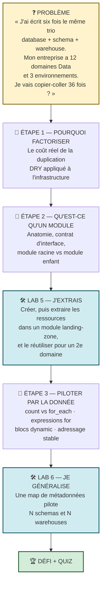

**La promesse de fin de journée :** ajouter un nouveau domaine Data à votre plateforme ne coûtera plus **six blocs de code**, mais **trois lignes dans une map**. Et vous saurez expliquer pourquoi `for_each` est la norme d'entreprise alors que `count` est un piège.

---
---

# PARTIE A — 🧠 LES CONCEPTS

*Durée : 2 h*

---

## A.1 — Pourquoi factoriser ? Le coût réel de la duplication

### A.1.1 Comptons

Reprenez mentalement vos labs. Le bloc « landing zone » fait environ 20 lignes de HCL. Maintenant, projetons-le à l'échelle d'une entreprise réelle.

| Contexte | Occurrences | Lignes dupliquées |
|---|---:|---:|
| Vos labs M01 → M04 | 4 | 80 |
| 12 domaines Data × 3 environnements | 36 | 720 |
| + une évolution de la convention de nommage | 36 modifications | 36 endroits à ne pas oublier |

**Le problème n'est pas d'écrire 720 lignes.** Un copier-coller prend cinq minutes. Le problème arrive **six mois plus tard** :

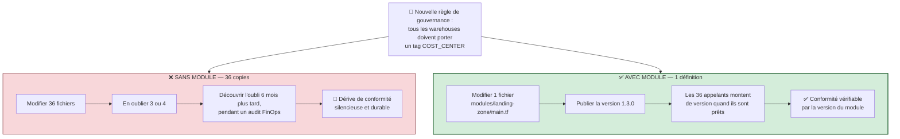

> 🧠 **La formule à retenir.** Un module ne fait pas gagner du temps à l'écriture — il en fait gagner **à la maintenance**, et il transforme une règle de gouvernance en **quelque chose de vérifiable**. « Tous nos domaines utilisent `landing-zone` v1.3.0 ou supérieur » est une phrase auditable. « J'espère que tout le monde a pensé à ajouter le tag » ne l'est pas.

### A.1.2 Les trois niveaux de maturité d'une plateforme IaC

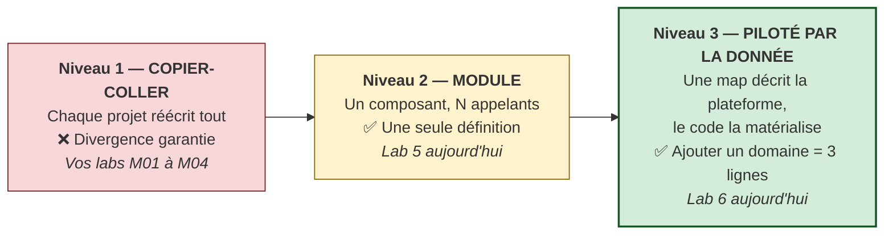

> 🧠 **Le saut conceptuel du niveau 3.** Au niveau 2, ajouter un domaine signifie **écrire du code** (un nouveau bloc `module`). Au niveau 3, cela signifie **ajouter une entrée de données** dans une map. Le code devient une **machine à interpréter des métadonnées**. C'est ce que font toutes les plateformes Data industrialisées : le catalogue des domaines est une donnée, pas du code.

---

## A.2 — Qu'est-ce qu'un module Terraform ?

### A.2.1 La définition qui surprend tout le monde

> 🔬 **Un module Terraform, c'est simplement un dossier contenant des fichiers `.tf`.**
>
> Il n'y a **aucune** syntaxe spéciale, aucun mot-clé « module » à écrire dans le module lui-même, aucun format d'empaquetage. Si vous avez un dossier avec des `.tf` dedans, vous avez un module.

**Conséquence immédiate :** vous écrivez des modules depuis le Jour 1 sans le savoir.

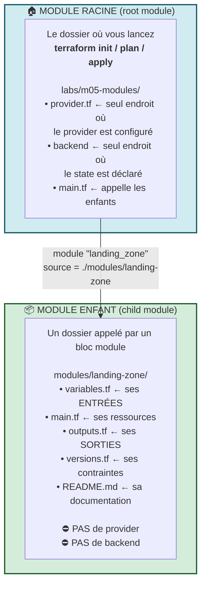

### A.2.2 ❓ « Pourquoi un module n'a-t-il ni `provider` ni `backend` ? »

C'est la question qui revient systématiquement. La réponse tient en une phrase :

> **Un module décrit *quoi* créer. Le module racine décide *où* et *avec quelle identité*.**

| Élément | Où il vit | Pourquoi |
|---|---|---|
| `backend` | **Module racine uniquement** | Il n'y a qu'un seul state par exécution. Un module enfant ne peut pas avoir son propre state |
| `provider` (configuration) | **Module racine** | Le module hérite automatiquement du provider configuré par son appelant |
| `required_providers` | **Les deux** | Le module **déclare** de quels providers il a besoin, sans les configurer |

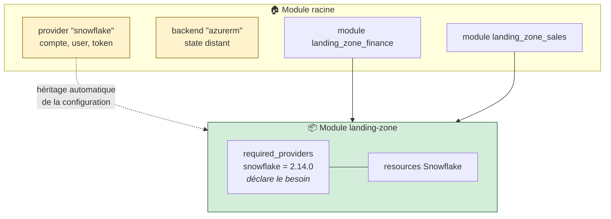

> 🎓 **Point d'examen.** Un module enfant **hérite** du provider de son appelant. Pour lui en passer un autre (par exemple un second compte Snowflake), on utilise le méta-argument `providers` du bloc `module` :
> ```hcl
> module "landing_zone_eu" {
>   source    = "./modules/landing-zone"
>   providers = { snowflake = snowflake.europe }
> }
> ```
> C'est le mécanisme du **multi-région** ou du **multi-compte**.

> ⚠️ **Piège classique n°13.** Déclarer un bloc `provider` dans un module enfant fonctionne encore techniquement, mais c'est **fortement déconseillé** : le module devient impossible à réutiliser avec `count` ou `for_each`, et Terraform émet un avertissement. Un module réutilisable ne configure jamais son provider.

### A.2.3 L'anatomie complète d'un module publiable

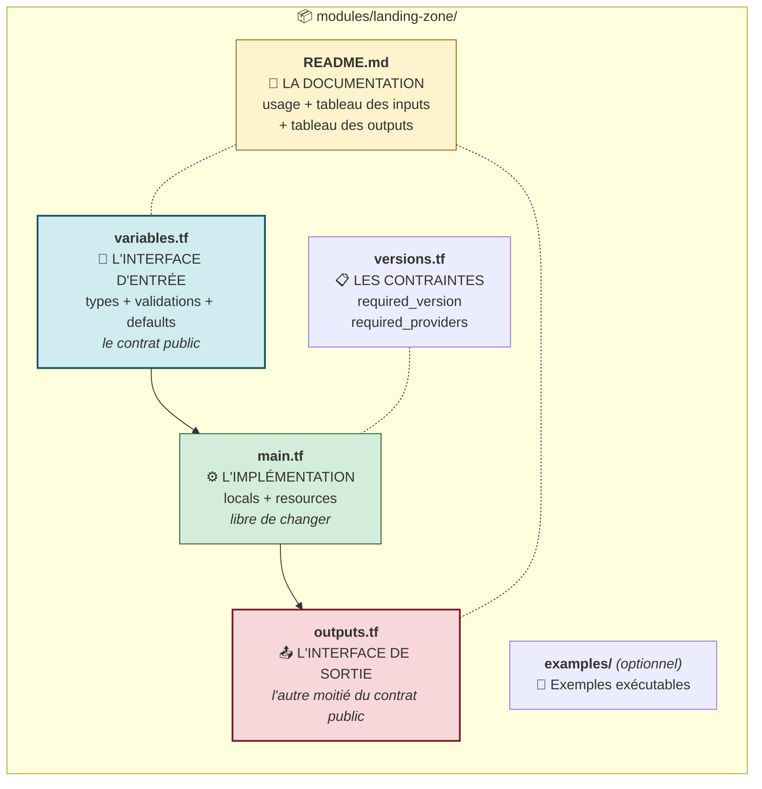

> 🧠 **La règle d'or du module : `variables` + `outputs` = le contrat public. Tout le reste est un détail d'implémentation.**
>
> Vous pouvez réécrire entièrement `main.tf` sans casser personne, **tant que** les entrées et les sorties ne changent pas. Inversement, renommer un seul output casse tous les appelants en cascade — vous le vérifierez au Chaos Lab du Lab 5.

### A.2.4 Les sources de modules

```hcl
module "landing_zone" {
  source = "./modules/landing-zone"    # ← chemin local
}
```

| Type de source | Écriture | Usage |
|---|---|---|
| **Chemin local** | `./modules/landing-zone` | 🎓 **Notre cas** — développement, monorepo |
| Terraform Registry | `terraform-aws-modules/vpc/aws` | Modules publics communautaires |
| Registry privé | `app.terraform.io/org/module/provider` | Catalogue interne d'entreprise |
| Git générique | `git::https://dev.azure.com/org/proj/_git/tf-modules//landing-zone?ref=v1.3.0` | 🏆 **Cible entreprise** |
| GitHub | `github.com/org/repo//sous-dossier?ref=v1.2.0` | Open source |
| Archive HTTP | `https://example.com/module.zip` | Rare |

> 🎓 **Point d'examen — le `ref` est obligatoire en production.** Sans lui, `source = "git::…"` prend la branche par défaut : votre infrastructure change **sans que vous ayez modifié une ligne**, dès qu'un collègue pousse sur `main`. Un module de production **s'épingle sur un tag Git immuable** (`?ref=v1.3.0`). Le double slash `//` sépare le dépôt du sous-dossier.

> 🔬 **Sous le capot.** `terraform init` copie les modules **distants** dans `.terraform/modules/`. Les modules **locaux** (`./…`) ne sont pas copiés : ils sont référencés en place. C'est pourquoi modifier un module local prend effet immédiatement, alors que modifier un module Git exige `terraform init -upgrade`.

### A.2.5 L'adressage des ressources dans un module

C'est le point qui déroute au premier `terraform state list` après extraction.

```text
   AVANT extraction (ressource dans le module racine)
   ────────────────────────────────────────────────────
   snowflake_database.raw

   APRÈS extraction (ressource dans un module enfant)
   ────────────────────────────────────────────────────
   module.landing_zone.snowflake_database.raw
   └──────┬───────────┘ └──────────┬──────────┘
          │                        │
          │                        └── l'adresse DANS le module
          └─────────────────────── le nom du bloc module dans l'appelant

   Avec for_each sur le module :
   ────────────────────────────────────────────────────
   module.landing_zone["finance"].snowflake_database.raw

   Avec for_each dans le module :
   ────────────────────────────────────────────────────
   module.landing_zone.snowflake_schema.this["ingestion"]
```

> ⚠️ **Piège classique n°14 — LE piège de la journée.** Extraire des ressources existantes dans un module **change leur adresse**. Pour Terraform, une adresse qui disparaît = une destruction, une adresse qui apparaît = une création. Le plan affichera `3 to add, 3 to destroy` — c'est-à-dire **la perte de vos données**.
>
> **La solution est le bloc `moved`**, découvert au Jour 2 :
> ```hcl
> moved {
>   from = snowflake_database.raw
>   to   = module.landing_zone.snowflake_database.raw
> }
> ```
> Vous le pratiquerez à l'étape 5.3 du Lab 5. **C'est le geste qui sépare un refactoring réussi d'un incident de production.**

### A.2.6 Le versionnement d'un module

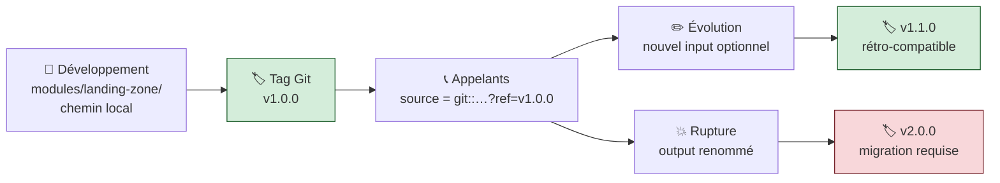

**Le versionnement sémantique appliqué à un module :**

| Changement | Version | Impact sur les appelants |
|---|---|---|
| Nouvel input **avec** `default` | **mineure** (1.1.0) | Aucun — ils montent quand ils veulent |
| Nouvel output | **mineure** (1.1.0) | Aucun |
| Correction interne sans changement d'interface | **correctif** (1.0.1) | Aucun |
| Nouvel input **sans** `default` | **majeure** (2.0.0) | 🔴 Ils doivent le fournir |
| Output renommé ou supprimé | **majeure** (2.0.0) | 🔴 Ils cassent |
| Renommage d'une ressource interne | **majeure** (2.0.0) | 🔴 Sauf si un `moved` est fourni **dans** le module |

> 🧠 **Le module fournit ses propres blocs `moved`.** C'est une pratique avancée mais élégante : quand vous renommez une ressource **à l'intérieur** de votre module, vous laissez un bloc `moved` dans le module lui-même. Les appelants montent de version et leur state se réaligne tout seul, sans qu'ils aient rien à écrire.

---

## A.3 — Piloter par la donnée : `count`, `for_each`, `for`, `dynamic`

### A.3.1 Les quatre outils, et leur rôle exact

Ces quatre mots-clés sont souvent confondus. Ils font **quatre choses différentes**.

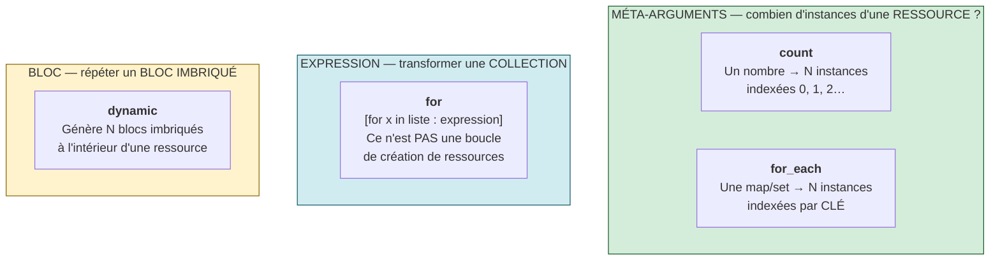

| Mot-clé | Ce qu'il multiplie | Exemple mental |
|---|---|---|
| `count` | Des **ressources** | « je veux 0 ou 1 schema de monitoring » |
| `for_each` | Des **ressources** ou des **modules** | « je veux un schema par entrée de ma map » |
| `for` | Rien — il **transforme une valeur** | « donne-moi la liste des noms depuis ma map » |
| `dynamic` | Des **blocs imbriqués** | « génère un bloc `tag` par entrée de ma map de tags » |

### A.3.2 🎓 `count` vs `for_each` : la comparaison qui tombe à l'examen

**Le scénario du désastre.** Vous gérez trois couches de données avec `count` :

```hcl
variable "layers" {
  default = ["RAW", "CLEAN", "CURATED"]
}

resource "snowflake_schema" "layers" {
  count = length(var.layers)
  name  = var.layers[count.index]
  # …
}
```

Le state contient :

```text
snowflake_schema.layers[0]  →  RAW
snowflake_schema.layers[1]  →  CLEAN
snowflake_schema.layers[2]  →  CURATED
```

Maintenant, **retirez `CLEAN` du milieu** :

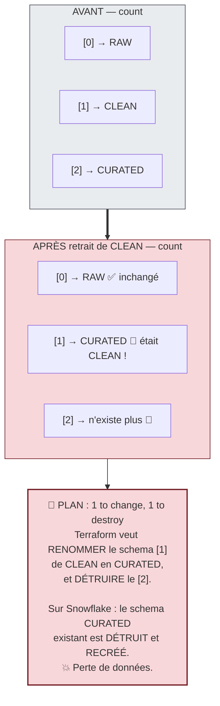

**Le même scénario avec `for_each` :**

```hcl
variable "layers" {
  default = {
    RAW     = { comment = "Raw data" }
    CLEAN   = { comment = "Cleaned data" }
    CURATED = { comment = "Curated data" }
  }
}

resource "snowflake_schema" "layers" {
  for_each = var.layers
  name     = each.key
  comment  = each.value.comment
  # …
}
```

Le state contient :

```text
snowflake_schema.layers["RAW"]
snowflake_schema.layers["CLEAN"]
snowflake_schema.layers["CURATED"]
```

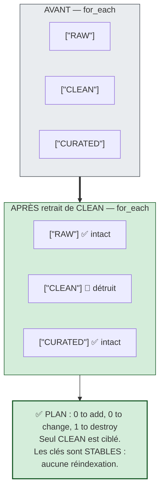

**Le tableau de décision :**

| Critère | `count` | `for_each` |
|---|---|---|
| Type d'entrée | `number` | `map(…)` ou `set(string)` |
| Référence à l'itération | `count.index` | `each.key` et `each.value` |
| Adresse dans le state | `res[0]`, `res[1]` | `res["clé"]` |
| Retrait d'un élément du **milieu** | 🔴 **Réindexe tout ce qui suit** | ✅ Ne touche que la clé visée |
| Réordonner la collection | 🔴 Recrée tout | ✅ Aucun effet |
| Bon usage | **Activer / désactiver** (0 ou 1) | **Collections nommées** |

> 🎓 **La règle professionnelle, à retenir mot pour mot :**
> **`for_each` par défaut. `count` uniquement pour un interrupteur booléen** (`count = var.enabled ? 1 : 0`).
>
> Question classique à l'examen : *« Vous devez créer des ressources à partir d'une liste susceptible de changer. Quel méta-argument ? »* → `for_each`, à cause de la stabilité de l'adressage.

> ⚠️ **Piège classique n°15.** `for_each` n'accepte pas une `list`. Si vous avez une liste, convertissez-la : `for_each = toset(var.ma_liste)`. Avec un `set`, `each.key` et `each.value` sont **identiques** (la valeur elle-même). Avec une `map`, `each.key` est la clé et `each.value` la valeur.

> 🔬 **Sous le capot — la contrainte des clés.** Les clés de `for_each` doivent être **connues au moment du plan**. Elles ne peuvent pas dépendre d'un attribut calculé par une autre ressource (`known after apply`). Sinon Terraform échoue avec `The "for_each" value depends on resource attributes that cannot be determined until apply`. La parade est de piloter `for_each` par des **données statiques** (variables, locals), jamais par des sorties de ressources.

### A.3.3 Les expressions `for` : transformer, pas créer

> ⚠️ **La confusion n°1.** `for_each` **crée des ressources**. Une expression `for` **transforme une valeur**. Ce sont deux mondes différents qui partagent trois lettres.

```hcl
# Liste → liste
[for nom in var.noms : upper(nom)]
# ["raw", "clean"]  →  ["RAW", "CLEAN"]

# Map → liste
[for k, v in var.schemas : v.name]
# { ingestion = {name="INGESTION"} }  →  ["INGESTION"]

# Map → map  (noter les accolades et la flèche =>)
{ for k, v in var.schemas : k => snowflake_schema.this[k].name }
# → { ingestion = "INGESTION", staging = "STAGING" }

# Avec un filtre
[for k, v in var.warehouses : k if v.size == "X-SMALL"]
```

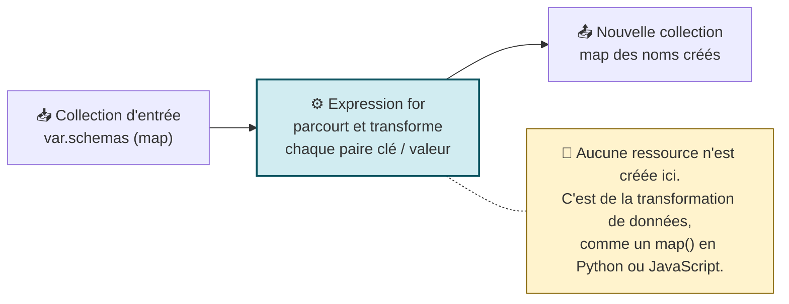

| Forme | Délimiteurs | Produit |
|---|---|---|
| `[for … : expr]` | crochets | une **liste** (ou un `tuple`) |
| `{for … : clé => valeur}` | accolades + `=>` | une **map** (ou un `object`) |
| `[for … : expr if cond]` | + `if` | une liste **filtrée** |

> 🎓 **Point d'examen.** Les délimiteurs déterminent le type de sortie : `[]` → liste, `{}` avec `=>` → map. Une erreur fréquente est d'écrire `{for k, v in m : v}` sans `=>` — Terraform refuse.

### A.3.4 Les blocs `dynamic` : répéter un bloc imbriqué

`dynamic` sert quand un **bloc imbriqué** doit être répété à l'intérieur d'une ressource — pas la ressource elle-même.

```hcl
resource "exemple" "x" {
  name = "demo"

  dynamic "tag" {                    # ← le nom du bloc à générer
    for_each = var.tags              # ← la collection source
    content {                        # ← le contenu du bloc généré
      key   = tag.key                # ← <nom_du_bloc>.key
      value = tag.value              # ← <nom_du_bloc>.value
    }
  }
}
```

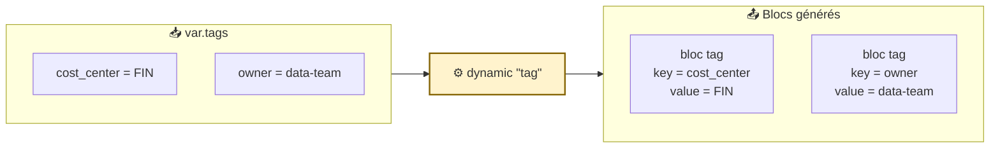

**Anatomie d'un bloc `dynamic` :**

| Élément | Rôle |
|---|---|
| `dynamic "nom"` | Le **nom du bloc imbriqué** à générer, imposé par le schéma de la ressource |
| `for_each` | La collection à parcourir |
| `iterator = alias` | *(optionnel)* renomme la variable d'itération ; par défaut, elle porte le nom du bloc |
| `content { }` | Le corps du bloc généré |
| `nom.key` / `nom.value` | La clé et la valeur de l'itération courante |

> ⚠️ **Piège classique n°16.** `dynamic` ne fonctionne **que** sur des blocs imbriqués, jamais sur des arguments simples ni sur des méta-arguments (`lifecycle` reste possible, mais pas `depends_on` ni `provider`). Et surtout : **n'en abusez pas.** Trois blocs écrits en clair sont plus lisibles qu'un `dynamic` qui en génère trois. La règle est : `dynamic` quand le **nombre** de blocs est réellement variable, jamais pour « faire plus court ».

### A.3.5 `for_each` sur un **module** : la combinaison la plus puissante

Le méta-argument `for_each` fonctionne aussi sur un bloc `module`. C'est ce qui permet le niveau 3 de maturité.

```hcl
variable "domains" {
  type = map(object({
    warehouse_size = string
    retention_days = number
  }))
  default = {
    finance = { warehouse_size = "X-SMALL", retention_days = 7 }
    sales   = { warehouse_size = "X-SMALL", retention_days = 1 }
    hr      = { warehouse_size = "X-SMALL", retention_days = 30 }
  }
}

module "landing_zone" {
  source   = "./modules/landing-zone"
  for_each = var.domains

  learner_prefix      = "${var.learner_prefix}${upper(each.key)}"
  environment         = var.environment
  warehouse_size      = each.value.warehouse_size
  data_retention_days = each.value.retention_days
}
```

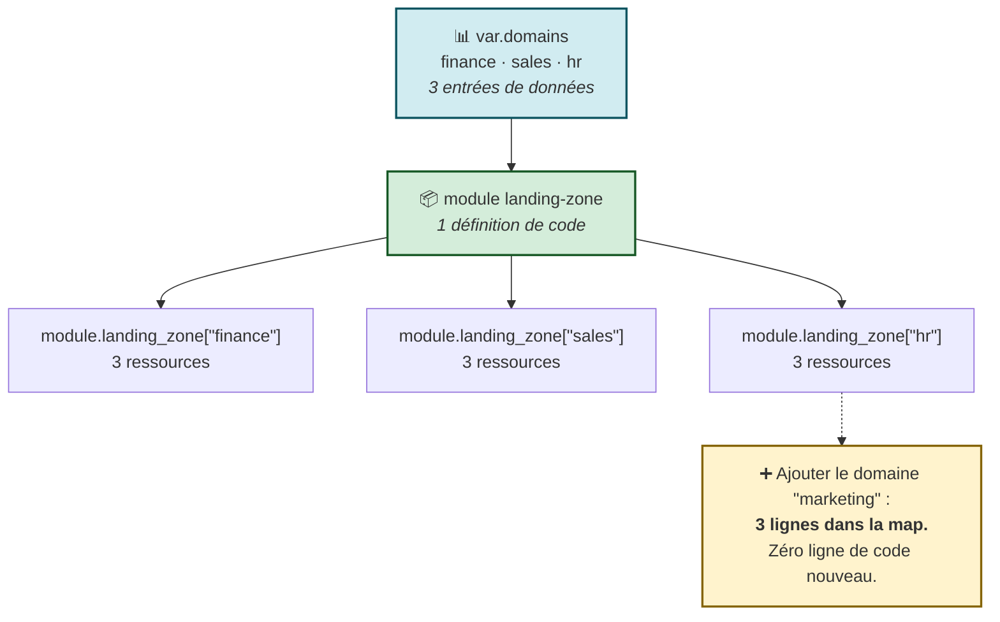

**Pour lire les outputs d'un module multiplié, on utilise une expression `for` :**

```hcl
output "all_databases" {
  value = { for k, m in module.landing_zone : k => m.database_name }
}
# → { finance = "APP01FINANCE_RAW_DEV", sales = "…", hr = "…" }
```

> 🧠 **Vous venez de voir la boucle complète.** Une **map** de métadonnées (donnée) + un **module** (code) + `for_each` (multiplication) + une expression `for` (agrégation des sorties) = une plateforme pilotée par les données. C'est exactement l'architecture des plateformes Data industrialisées.

---

## A.4 — Récapitulatif visuel de la Partie A

```mermaid
mindmap
  root((Modules et<br/>logique dynamique))
    Pourquoi
      Coût de la duplication
      DRY appliqué à l'infra
      Gouvernance auditable
      3 niveaux de maturité
    Module
      Un dossier de fichiers .tf
      Module racine vs enfant
      Pas de provider ni backend
      variables + outputs = contrat
      README obligatoire
      Sources — local · Git · Registry
      ref = tag immuable
      Versionnement sémantique
    Adressage
      module.nom.type.local
      module.nom["clé"].type.local
      moved obligatoire à l'extraction
    Multiplier
      count — un nombre
      for_each — map ou set
      for_each sur un module
      Réindexation — le piège de count
      toset pour une liste
      Clés connues au plan
    Transformer
      for — liste
      for avec => — map
      for avec if — filtre
    Répéter un bloc
      dynamic
      for_each + content
      nom.key et nom.value
```

**Auto-évaluation avant la pratique :**

1. Qu'est-ce qu'un module Terraform, techniquement ?
2. Pourquoi un module enfant ne contient-il ni `provider` ni `backend` ?
3. Que se passe-t-il si j'extrais des ressources dans un module sans bloc `moved` ?
4. Pourquoi `for_each` est-il préféré à `count` pour une collection nommée ?
5. Quelle est la différence entre `for_each` et une expression `for` ?

*(Réponses en Partie D.)*

---
---
# PARTIE B — 🛠️ LABORATOIRE 5

## *Extraire un module `landing-zone` et le réutiliser pour un second domaine*

> **Module source :** M05 — `labs/m05-modules/` · **Durée : 2 h** · Piste `[CORE]`

| Élément | Valeur |
|---|---|
| **Workspace** | `$HOME/Data2AI-Labs/data-platform` (le clone) |
| **Dossier de travail** | `labs/m05-modules/` |
| **Coût** | 💰 2 warehouses X-SMALL, initialement suspendus |
| **Cleanup** | `terraform destroy -auto-approve` à la fin |
| **Ressources créées** | 6 (2 domaines × 3) |

---

## B.0 — Mission métier

> **En tant que :** Data Platform Engineer
> **Je veux :** extraire les ressources Snowflake dans un module Terraform réutilisable
> **Afin de :** provisionner plusieurs domaines Data sans duplication de code

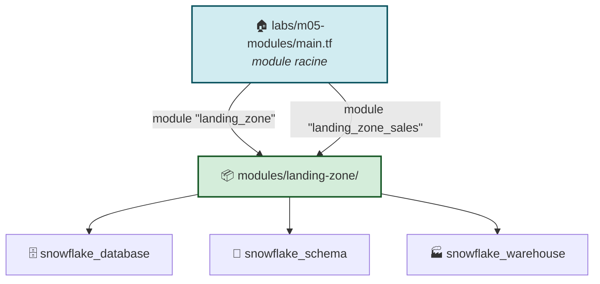

**La progression pédagogique du lab — en trois temps :**

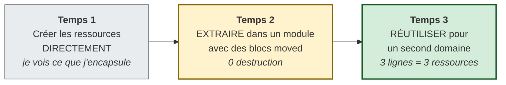

> 🧠 **Pourquoi ne pas écrire le module directement ?** Parce que c'est **le scénario réel**. Personne ne commence un projet en écrivant des modules : on écrit d'abord ce qui marche, puis on factorise quand la duplication devient douloureuse. Le refactoring **sur une infrastructure vivante** est la compétence rare — et c'est exactement ce que vous allez pratiquer.

**Objectifs pédagogiques vérifiables :**

- ✅ créer les ressources directement, puis les extraire dans un module ;
- ✅ créer un module Terraform avec une **interface typée** ;
- ✅ appeler le module depuis `labs/m05-modules/` **sans destruction** ;
- ✅ versionner le module avec un `README.md` et des `outputs` ;
- ✅ réutiliser le module pour un second domaine.

---

## B.1 — 🚦 Pre-flight

<details open>
<summary>🪟 <b>Windows (PowerShell)</b></summary>

```powershell
cd "$HOME\Data2AI-Labs\data-platform"
.\scripts\Learner-Login.ps1 -LearnerPrefix APP01
.\scripts\Reset-Lab.ps1 -LearnerPrefix APP01 -Lab M05
cd labs\m05-modules
..\..\scripts\Test-TerraformReady.ps1
```
</details>

<details>
<summary>🐧 <b>Linux/macOS (Bash)</b></summary>

```bash
cd "$HOME/Data2AI-Labs/data-platform"
source ./scripts/learner-login.sh APP01
./scripts/reset-lab.sh APP01 M05
cd labs/m05-modules
../../scripts/test-terraform-ready.sh
```
</details>

✅ **Checkpoint 0 :** `READY`.

**Les fichiers fournis dans le dossier :**

| Fichier | Rôle |
|---|---|
| `provider.tf` | Provider Snowflake (lit le PAT depuis `../../secrets/`) |
| `versions.tf` | Contraintes Terraform et provider |
| `variables.tf` | Variables de base (`snowflake_*`, `learner_prefix`, `environment`) |
| `terraform.tfvars.example` | Modèle à copier |
| `main.tf` | Vide — à écrire |
| `outputs.tf` | Vide — à écrire |

---

## B.2 — Étape 1 : préparer le module racine

### 📝 Action 1.1 — Créer `terraform.tfvars`

<details open>
<summary>🪟 <b>Windows (PowerShell)</b></summary>

```powershell
Copy-Item terraform.tfvars.example terraform.tfvars
code terraform.tfvars
```
</details>

<details>
<summary>🐧 <b>Linux/macOS (Bash)</b></summary>

```bash
cp terraform.tfvars.example terraform.tfvars
code terraform.tfvars
```
</details>

```hcl
learner_prefix = "APP01"
environment    = "DEV"

# Snowflake connection (from .env)
snowflake_organization = "ZVFXOZW"
snowflake_account      = "PM71247"
snowflake_user         = "DATA2AI"
```

**Remplacez `APP01` par votre préfixe apprenant.**

### 📝 Action 1.2 — Ajouter les variables du lab

Dans `variables.tf`, **ajoutez à la fin** :

```hcl
variable "warehouse_size" {
  type        = string
  description = "Warehouse size"
  default     = "X-SMALL"

  validation {
    condition     = contains(["X-SMALL", "SMALL", "MEDIUM"], var.warehouse_size)
    error_message = "warehouse_size must be X-SMALL, SMALL or MEDIUM."
  }
}

variable "data_retention_days" {
  type        = number
  description = "Time travel retention in days"
  default     = 1

  validation {
    condition     = var.data_retention_days >= 0 && var.data_retention_days <= 90
    error_message = "data_retention_days must be between 0 and 90."
  }
}

variable "auto_suspend_seconds" {
  type        = number
  description = "Warehouse auto-suspend in seconds"
  default     = 60

  validation {
    condition     = var.auto_suspend_seconds >= 60 && var.auto_suspend_seconds <= 3600
    error_message = "auto_suspend_seconds must be between 60 and 3600."
  }
}
```

> 🧠 **Ces trois variables vont voyager.** Elles sont aujourd'hui dans le module racine ; à l'étape 2, vous en créerez les **jumelles** dans le module enfant. Ce dédoublement est normal et voulu : le module racine collecte les valeurs, le module enfant définit son **contrat**.

---

## B.3 — Étape 2 : créer les ressources **directement** (temps 1)

### 📝 Action 2.1 — Créer `locals.tf`

```hcl
locals {
  database_name  = "${var.learner_prefix}_M05_RAW_${var.environment}"
  schema_name    = "INGESTION"
  warehouse_name = "WH_${var.learner_prefix}_M05_ETL_${var.environment}"
  common_comment = "Managed by Terraform | Landing Zone | ${var.learner_prefix}"
}
```

### 📝 Action 2.2 — Créer `main.tf`

```hcl
resource "snowflake_database" "raw" {
  name                        = local.database_name
  comment                     = local.common_comment
  data_retention_time_in_days = var.data_retention_days
}

resource "snowflake_schema" "ingestion" {
  database = snowflake_database.raw.name
  name     = local.schema_name
  comment  = local.common_comment
}

resource "snowflake_warehouse" "etl" {
  name                = local.warehouse_name
  comment             = local.common_comment
  warehouse_size      = var.warehouse_size
  auto_suspend        = var.auto_suspend_seconds
  auto_resume         = true
  initially_suspended = true
}
```

### 📝 Action 2.3 — Créer `outputs.tf`

```hcl
output "database_name" {
  value       = snowflake_database.raw.name
  description = "RAW database name"
}

output "schema_name" {
  value       = snowflake_schema.ingestion.name
  description = "Ingestion schema name"
}

output "warehouse_name" {
  value       = snowflake_warehouse.etl.name
  description = "ETL warehouse name"
}
```

### 📝 Action 2.4 — Déployer

```powershell
terraform fmt
terraform init
terraform validate
terraform plan -out "m05.tfplan"
```

✅ **Checkpoint 1 :** `Plan: 3 to add, 0 to change, 0 to destroy.`

```powershell
terraform apply m05.tfplan
```

✅ **Checkpoint 2 :** `Apply complete! Resources: 3 added, 0 changed, 0 destroyed.`

### 📝 Action 2.5 — 🔬 Noter les adresses AVANT extraction

```powershell
terraform state list
```

```text
snowflake_database.raw
snowflake_schema.ingestion
snowflake_warehouse.etl
```

> 🛑 **Notez ces trois lignes. Copiez-les dans un fichier texte.** Elles vont changer à l'étape suivante, et c'est **exactement** le point critique du lab.

**Vérifiez côté Snowflake :**

```powershell
snow sql -c training -q "SHOW DATABASES LIKE 'APP01_M05_RAW_DEV'"
snow sql -c training -q "SHOW WAREHOUSES LIKE 'WH_APP01_M05_ETL_DEV'"
```

---

## B.4 — Étape 3 : extraire le module (temps 2)

### 📝 Action 3.1 — Créer le dossier

<details open>
<summary>🪟 <b>Windows (PowerShell)</b></summary>

```powershell
New-Item -ItemType Directory -Force -Path "modules\landing-zone" | Out-Null
```
</details>

<details>
<summary>🐧 <b>Linux/macOS (Bash)</b></summary>

```bash
mkdir -p modules/landing-zone
```
</details>

> 🧠 **Rappel de la Partie A.** Vous venez de créer un module. C'est juste un dossier. Il n'y a rien de magique.

### 📝 Action 3.2 — `modules/landing-zone/variables.tf` — le contrat d'entrée

```hcl
variable "learner_prefix" {
  type        = string
  description = "Unique uppercase prefix assigned to the learner or domain"

  validation {
    condition     = can(regex("^[A-Z][A-Z0-9]{2,9}$", var.learner_prefix))
    error_message = "learner_prefix must contain 3-10 uppercase letters or digits."
  }
}

variable "environment" {
  type        = string
  description = "Deployment environment"
  default     = "DEV"

  validation {
    condition     = contains(["DEV", "UAT", "PROD"], var.environment)
    error_message = "environment must be DEV, UAT or PROD."
  }
}

variable "warehouse_size" {
  type        = string
  description = "Warehouse size"
  default     = "X-SMALL"

  validation {
    condition     = contains(["X-SMALL", "SMALL", "MEDIUM"], var.warehouse_size)
    error_message = "warehouse_size must be X-SMALL, SMALL or MEDIUM."
  }
}

variable "data_retention_days" {
  type        = number
  description = "Time travel retention in days"
  default     = 1

  validation {
    condition     = var.data_retention_days >= 0 && var.data_retention_days <= 90
    error_message = "data_retention_days must be between 0 and 90."
  }
}

variable "auto_suspend_seconds" {
  type        = number
  description = "Warehouse auto-suspend in seconds"
  default     = 60

  validation {
    condition     = var.auto_suspend_seconds >= 60 && var.auto_suspend_seconds <= 3600
    error_message = "auto_suspend_seconds must be between 60 and 3600."
  }
}
```

> ⚠️ **Regardez attentivement la regex de `learner_prefix` : `^[A-Z][A-Z0-9]{2,9}$`.**
> Elle accepte **3 à 10 caractères**, alors que celle du module racine s'arrête à 5. Ce n'est pas une erreur : à l'étape 5, vous appellerez le module avec `"${var.learner_prefix}SAL"` — soit `APP01SAL`, **8 caractères**. Une regex trop stricte dans le module ferait échouer la réutilisation.
>
> 🧠 **La leçon de conception :** un module réutilisable doit être **plus permissif** que ses appelants. Le module définit ce qui est *possible* ; l'appelant définit ce qui est *souhaité*. Un module trop contraint n'est pas réutilisable.

### 📝 Action 3.3 — `modules/landing-zone/main.tf` — l'implémentation

```hcl
locals {
  database_name  = "${var.learner_prefix}_M05_RAW_${var.environment}"
  schema_name    = "INGESTION"
  warehouse_name = "WH_${var.learner_prefix}_M05_ETL_${var.environment}"
  common_comment = "Managed by Terraform | Landing Zone | ${var.learner_prefix}"
}

resource "snowflake_database" "raw" {
  name                        = local.database_name
  comment                     = local.common_comment
  data_retention_time_in_days = var.data_retention_days
}

resource "snowflake_schema" "ingestion" {
  database = snowflake_database.raw.name
  name     = local.schema_name
  comment  = local.common_comment
}

resource "snowflake_warehouse" "etl" {
  name                = local.warehouse_name
  comment             = local.common_comment
  warehouse_size      = var.warehouse_size
  auto_suspend        = var.auto_suspend_seconds
  auto_resume         = true
  initially_suspended = true
}
```

> 🔬 **Observez : c'est un copier-coller quasi exact de votre `main.tf` + `locals.tf` racine.** C'est normal, et c'est la définition même de l'extraction : **le code ne change pas, sa localisation change.** Le seul mot qui compte ici est *quasi* — les noms locaux (`raw`, `ingestion`, `etl`) doivent rester **identiques**, sinon les blocs `moved` de l'étape suivante ne fonctionneront pas.

### 📝 Action 3.4 — `modules/landing-zone/outputs.tf` — le contrat de sortie

```hcl
output "database_name" {
  value       = snowflake_database.raw.name
  description = "RAW database name"
}

output "schema_name" {
  value       = snowflake_schema.ingestion.name
  description = "Ingestion schema name"
}

output "warehouse_name" {
  value       = snowflake_warehouse.etl.name
  description = "ETL warehouse name"
}
```

### 📝 Action 3.5 — `modules/landing-zone/versions.tf` — les contraintes

```hcl
terraform {
  required_version = ">= 1.14.0, < 2.0.0"

  required_providers {
    snowflake = {
      source  = "snowflakedb/snowflake"
      version = "= 2.14.0"
    }
  }
}
```

> 🎓 **Point d'examen — pourquoi une contrainte SOUPLE dans le module ?**
> Comparez avec le module racine, qui épingle `= 1.14.5`.
>
> | | Module racine | Module réutilisable |
> |---|---|---|
> | Contrainte | `= 1.14.5` (stricte) | `>= 1.14.0, < 2.0.0` (souple) |
> | Raison | Reproductibilité exacte de **ce** déploiement | **Compatibilité** avec le plus grand nombre d'appelants |
>
> Un module qui exige `= 1.14.5` est inutilisable par une équipe en 1.15. **Le module déclare un intervalle de compatibilité ; le module racine choisit une version exacte à l'intérieur de cet intervalle.**
>
> ⚠️ Notez aussi ce qui **n'est pas** dans ce fichier : ni bloc `provider`, ni bloc `backend`. Le module déclare qu'il *a besoin* du provider Snowflake ; il ne le *configure* pas.

### 📝 Action 3.6 — `modules/landing-zone/README.md` — la documentation

> 🧠 **Un module sans README n'est pas réutilisable.** L'appelant ne doit pas avoir à lire `variables.tf` pour savoir comment vous appeler. Le README **est** l'interface visible du module.

Créez `modules/landing-zone/README.md` :

````markdown
# landing-zone

Creates a RAW database, an INGESTION schema and a cost-controlled ETL warehouse.

## Usage

```hcl
module "landing_zone" {
  source              = "./modules/landing-zone"
  learner_prefix      = "ABC"
  environment         = "DEV"
  warehouse_size      = "X-SMALL"
  data_retention_days = 1
}
```

## Inputs

| Name | Type | Default | Required | Description |
|---|---|---|:---:|---|
| learner_prefix | string | — | ✅ | 3-10 uppercase letters or digits |
| environment | string | `DEV` | | DEV, UAT or PROD |
| warehouse_size | string | `X-SMALL` | | X-SMALL, SMALL or MEDIUM |
| data_retention_days | number | `1` | | Time travel days, 0-90 |
| auto_suspend_seconds | number | `60` | | Auto-suspend seconds, 60-3600 |

## Outputs

| Name | Description |
|---|---|
| database_name | RAW database name |
| schema_name | Ingestion schema name |
| warehouse_name | ETL warehouse name |

## Cost

One X-SMALL warehouse, initially suspended, auto-suspend after 60s.
````

> 🔬 **Astuce professionnelle : `terraform-docs`.** Cet outil génère automatiquement les tableaux *Inputs* et *Outputs* à partir de vos `variables.tf` et `outputs.tf`. En CI, on vérifie que le README est à jour — le rendant impossible à laisser dériver. C'est le standard de fait pour les modules publiés.

### 📝 Action 3.7 — Valider le module isolément

> ⚠️ **Créez d'abord LES QUATRE fichiers** (`variables.tf`, `main.tf`, `outputs.tf`, `versions.tf`). Si l'un manque, `terraform validate` échouera avec des erreurs de référence.

<details open>
<summary>🪟 <b>Windows (PowerShell)</b></summary>

```powershell
cd modules\landing-zone
terraform init
terraform fmt
terraform validate
```
</details>

<details>
<summary>🐧 <b>Linux/macOS (Bash)</b></summary>

```bash
cd modules/landing-zone
terraform init
terraform fmt
terraform validate
```
</details>

✅ **Checkpoint 3 :** `Success! The configuration is valid.`

> 🔬 **Vous venez de valider un module comme s'il était un projet à part entière.** C'est possible parce qu'un module *est* un dossier de `.tf`. `terraform init` télécharge le provider pour permettre la validation des types de ressources ; il ne configure aucun backend, puisqu'il n'y en a pas.
>
> 🧠 **La bonne pratique associée :** valider chaque module **isolément** en CI, avant de valider les projets qui l'utilisent. Cela détecte les erreurs à la source plutôt que dans 36 appelants.

> ⚠️ **Ne lancez PAS `terraform init` dans `labs/m05-modules/` avant d'avoir terminé toute l'étape 4.** Un `main.tf` qui référence un module tout en gardant les anciens outputs provoquera des erreurs `Reference to undeclared resource`.

---

## B.5 — Étape 4 : appeler le module SANS rien détruire

> 🛑 **C'est l'étape la plus délicate du Jour 3.** Faites les actions 4.1 à 4.4 **en entier** avant de lancer la moindre commande Terraform.

### 🧠 Ce qui va se passer dans le state

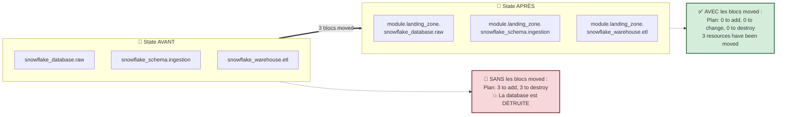

### 📝 Action 4.1 — Réécrire `main.tf`

<details open>
<summary>🪟 <b>Windows (PowerShell)</b></summary>

```powershell
cd ..\..
code main.tf
```
</details>

<details>
<summary>🐧 <b>Linux/macOS (Bash)</b></summary>

```bash
cd ../..
code main.tf
```
</details>

**Remplacez tout le contenu** de `main.tf` par :

```hcl
moved {
  from = snowflake_database.raw
  to   = module.landing_zone.snowflake_database.raw
}

moved {
  from = snowflake_schema.ingestion
  to   = module.landing_zone.snowflake_schema.ingestion
}

moved {
  from = snowflake_warehouse.etl
  to   = module.landing_zone.snowflake_warehouse.etl
}

module "landing_zone" {
  source               = "./modules/landing-zone"
  learner_prefix       = var.learner_prefix
  environment          = var.environment
  warehouse_size       = var.warehouse_size
  data_retention_days  = var.data_retention_days
  auto_suspend_seconds = var.auto_suspend_seconds
}
```

**Lecture guidée du bloc `module` :**

```text
  module   "landing_zone"   {
     ▲            ▲
     │            └── 2. NOM LOCAL de l'instance (vous le choisissez)
     │                 C'est lui qui apparaît dans les adresses :
     │                 module.landing_zone.…
     └─────────────── 1. TYPE DE BLOC

    source               = "./modules/landing-zone"   ← OÙ trouver le code
    learner_prefix       = var.learner_prefix         ┐
    environment          = var.environment            │ Les ARGUMENTS
    warehouse_size       = var.warehouse_size         │ correspondent aux
    data_retention_days  = var.data_retention_days    │ variables du module
    auto_suspend_seconds = var.auto_suspend_seconds   ┘
```

> ❓ **« Pourquoi `learner_prefix = var.learner_prefix` ? C'est redondant. »**
> Non, ce sont **deux variables différentes** qui portent le même nom :
> - à **gauche** : `learner_prefix`, l'**entrée du module enfant** (déclarée dans `modules/landing-zone/variables.tf`) ;
> - à **droite** : `var.learner_prefix`, la **variable du module racine**.
>
> C'est exactement comme appeler une fonction : `ma_fonction(prefix = mon_prefix)`. Les deux espaces de noms sont **totalement séparés**. Vous pourriez écrire `learner_prefix = "XYZ"` en dur, ou `learner_prefix = upper(var.domaine)`.

### 📝 Action 4.2 — Supprimer `locals.tf`

Les locals ne servaient qu'aux ressources directes, qui vivent maintenant dans le module.

<details open>
<summary>🪟 <b>Windows (PowerShell)</b></summary>

```powershell
Remove-Item locals.tf
```
</details>

<details>
<summary>🐧 <b>Linux/macOS (Bash)</b></summary>

```bash
rm locals.tf
```
</details>

### 📝 Action 4.3 — Réécrire `outputs.tf`

**Remplacez tout le contenu** par :

```hcl
output "database_name" {
  value       = module.landing_zone.database_name
  description = "RAW database name"
}

output "schema_name" {
  value       = module.landing_zone.schema_name
  description = "Ingestion schema name"
}

output "warehouse_name" {
  value       = module.landing_zone.warehouse_name
  description = "ETL warehouse name"
}

output "resource_summary" {
  value = {
    database  = module.landing_zone.database_name
    schema    = module.landing_zone.schema_name
    warehouse = module.landing_zone.warehouse_name
  }
  description = "Consolidated view of the landing zone"
}
```

> 🧠 **La syntaxe `module.<nom>.<output>` est le seul moyen de lire dans un module.**
> Vous ne pouvez **pas** écrire `module.landing_zone.snowflake_database.raw.name` : les ressources internes d'un module sont **encapsulées**. Seuls les `outputs` déclarés sont visibles.
>
> C'est exactement le même principe que `terraform_remote_state` au Jour 2 : **les outputs sont l'API publique**. Ce qui n'est pas exposé est un détail d'implémentation.

### 📝 Action 4.4 — Formater et initialiser

```powershell
terraform fmt -recursive
terraform init
```

**Observez la sortie :**

```text
Initializing the backend...
Initializing modules...
- landing_zone in modules/landing-zone
Initializing provider plugins...
```

> 🔬 **La ligne `Initializing modules...` est nouvelle.** Terraform vient de découvrir un module. Pour un module **local**, il ne copie rien : il enregistre simplement le chemin dans `.terraform/modules/modules.json`. Ouvrez ce fichier si vous êtes curieux.

> ⚠️ **`terraform init` est OBLIGATOIRE après l'ajout ou la modification d'un bloc `module`.** C'est la même règle que pour un provider ou un backend. Oublier cette étape produit `Module not installed`.

### 📝 Action 4.5 — 🏆 Le moment de vérité

```powershell
terraform plan
```

✅ **Checkpoint 4 :**

```text
Terraform will perform the following actions:

  # snowflake_database.raw has moved to module.landing_zone.snowflake_database.raw
    resource "snowflake_database" "raw" {
        id   = "APP01_M05_RAW_DEV"
        name = "APP01_M05_RAW_DEV"
        # (2 unchanged attributes hidden)
    }

  # snowflake_schema.ingestion has moved to module.landing_zone.snowflake_schema.ingestion
    …

  # snowflake_warehouse.etl has moved to module.landing_zone.snowflake_warehouse.etl
    …

Plan: 0 to add, 0 to change, 0 to destroy.
```

> 🏆 **`0 to destroy`.** Vous venez de refactorer une infrastructure **vivante** en la réorganisant complètement dans le code, **sans détruire une seule ressource**. C'est la compétence qui fait la différence entre un tutoriel et un projet réel.

> ⚠️ **Si vous voyez `3 to add, 3 to destroy`, ARRÊTEZ.** Ne tapez pas `yes`. Vérifiez :
> 1. les trois blocs `moved` sont-ils bien présents dans `main.tf` ?
> 2. les noms locaux du module (`raw`, `ingestion`, `etl`) sont-ils **identiques** à ceux d'avant ?
> 3. les valeurs passées au module produisent-elles les **mêmes noms** (`APP01_M05_RAW_DEV`) ?

### 📝 Action 4.6 — Appliquer et vérifier le nouveau state

```powershell
terraform apply
terraform state list
```

✅ **Checkpoint 5 :**

```text
module.landing_zone.snowflake_database.raw
module.landing_zone.snowflake_schema.ingestion
module.landing_zone.snowflake_warehouse.etl
```

> 🔬 **Comparez avec ce que vous aviez noté à l'action 2.5.** Les adresses ont changé ; les objets Snowflake, eux, n'ont **jamais** été touchés. Le refactoring est purement une réorganisation du state.

### 📝 Action 4.7 — Supprimer les blocs `moved`

Une fois le déplacement appliqué, les blocs `moved` ne servent plus. **Supprimez-les de `main.tf`.**

```powershell
terraform fmt
terraform validate
terraform plan
```

✅ **Checkpoint 6 :** `No changes.`

> 🧠 **Le cycle de vie complet d'un `moved`, rappelé :** écrire → commiter → laisser tous les collègues et la CI appliquer → supprimer au sprint suivant. En formation, vous êtes seul : vous pouvez le supprimer immédiatement.

---

## B.6 — Étape 5 : réutiliser le module (temps 3)

> 🧠 **C'est ici que le module montre sa valeur.** Vous allez créer une seconde landing zone pour le domaine « Sales » — **sans écrire une seule ressource**.

### 📝 Action 5.1 — Ajouter un second appel dans `main.tf`

```hcl
module "landing_zone_sales" {
  source               = "./modules/landing-zone"
  learner_prefix       = "${var.learner_prefix}SAL"
  environment          = var.environment
  warehouse_size       = "X-SMALL"
  data_retention_days  = var.data_retention_days
  auto_suspend_seconds = var.auto_suspend_seconds
}
```

**Ce qui change par rapport au premier appel :**

| Argument | Premier appel | Second appel | Pourquoi |
|---|---|---|---|
| nom du bloc | `landing_zone` | `landing_zone_sales` | 🔑 **Doit être unique** — c'est l'adresse dans le state |
| `source` | identique | identique | Le **même code** est instancié deux fois |
| `learner_prefix` | `var.learner_prefix` → `APP01` | `"${var.learner_prefix}SAL"` → `APP01SAL` | 🔑 Produit des **noms différents**, donc pas de collision |
| `warehouse_size` | `var.warehouse_size` | `"X-SMALL"` en dur | Chaque appelant décide **ses** paramètres |

> ⚠️ **Piège classique n°17.** Si les deux appels produisaient le **même** `database_name`, l'`apply` échouerait avec `Object already exists`. Terraform ne le détecte **pas** au plan : les deux ressources ont des adresses différentes, donc le plan semble valide. L'erreur ne survient qu'à l'exécution, côté Snowflake.
>
> **La règle :** deux instances d'un même module doivent recevoir des paramètres qui garantissent des **noms distincts**. C'est le rôle du suffixe `SAL` ici.

> 🔬 **C'est ici que la regex permissive du module (3-10 caractères) prend tout son sens.** `APP01SAL` fait 8 caractères. Avec la regex stricte du module racine (`{2,4}`, soit 3-5 caractères), cet appel échouerait à la validation. Vous mesurez concrètement pourquoi *« un module doit être plus permissif que ses appelants »*.

### 📝 Action 5.2 — Ajouter l'output correspondant

Dans `outputs.tf` :

```hcl
output "sales_database_name" {
  value       = module.landing_zone_sales.database_name
  description = "Sales RAW database name"
}
```

### 📝 Action 5.3 — Planifier

```powershell
terraform fmt
terraform plan
```

✅ **Checkpoint 7 :**

```text
Plan: 3 to add, 0 to change, 0 to destroy.
```

> 🧠 **Lisez ce chiffre.** `3 to add` — la database, le schema et le warehouse du domaine Sales. `0 to change, 0 to destroy` — **le domaine existant n'est pas touché**. Deux instances du même module, totalement indépendantes.

### 📝 Action 5.4 — Appliquer

```powershell
terraform apply
terraform state list
```

✅ **Checkpoint 8 :** six adresses, réparties en deux groupes :

```text
module.landing_zone.snowflake_database.raw
module.landing_zone.snowflake_schema.ingestion
module.landing_zone.snowflake_warehouse.etl
module.landing_zone_sales.snowflake_database.raw
module.landing_zone_sales.snowflake_schema.ingestion
module.landing_zone_sales.snowflake_warehouse.etl
```

> 🏆 **Vingt lignes de code réutilisées deux fois. Six ressources. Une seule définition à maintenir.**
>
> Faites le calcul mental : ajouter un troisième domaine coûte désormais **7 lignes** (un bloc `module`), et non 20. Ajouter un attribut à tous les domaines coûte **1 modification**, et non N.

### 📝 Action 5.5 — Vérification non destructive dans Snowsight

1. Ouvrez **[app.snowflake.com](https://app.snowflake.com)** avec vos identifiants apprenant ;
2. **Data → Databases** : vérifiez la présence de `APP01_M05_RAW_DEV` **et** `APP01SAL_M05_RAW_DEV` ;
3. Vérifiez que vos bases des labs précédents (M01, M04) sont **toujours intactes** ;
4. **Admin → Warehouses** : les deux warehouses sont présents, statut `Suspended`.

> 🧠 **La preuve visuelle du refactoring non destructif.** Rien n'a été recréé : la migration de code ne détruit rien quand les adresses de ressources sont correctement gérées.

---

## B.7 — 🐛 Chaos Lab : casser le contrat d'interface

> *Que se passe-t-il quand un mainteneur de module renomme un output sans prévenir ?*

### Symptôme — injecter la rupture

Dans `modules/landing-zone/outputs.tf`, renommez `database_name` en `db_name` :

```hcl
output "db_name" {          # ← renommé
  value       = snowflake_database.raw.name
  description = "RAW database name"
}
```

### Diagnostic

```powershell
terraform validate
```

```text
Error: Unsupported attribute

  on outputs.tf line 2, in output "database_name":
   2:   value = module.landing_zone.database_name

This object does not have an attribute named "database_name".
```

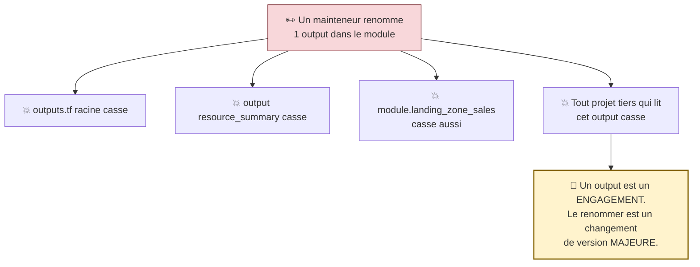

> 🧠 **La leçon.** Le contrat d'interface d'un module est un **engagement contractuel**. Modifier un output casse tous les appelants **en cascade** — y compris ceux que vous ne connaissez pas. C'est pourquoi :
> - un renommage d'output = **version majeure** (2.0.0) ;
> - la bonne pratique est de **déprécier progressivement** : ajouter `db_name`, garder `database_name` pendant une version, puis retirer l'ancien à la majeure suivante ;
> - `moved` ne fonctionne **pas** sur les outputs — il ne gère que les adresses de ressources.

### Remédiation

Restaurez le nom `database_name`, puis :

```powershell
terraform fmt -recursive
terraform validate
terraform plan
```

✅ `No changes.`

---

## B.8 — 🤖 Validation automatisée

```powershell
cd "$HOME\Data2AI-Labs\data-platform"
.\scripts\SelfPacedLab.ps1 -Module 5 -All -Report
```

✅ **Résultat attendu :**

```text
[PASS] T1 Module directory structure
[PASS] T2 Module inputs/outputs contract
[PASS] T3 Root module instantiation
[PASS] T4 terraform fmt & validate
[PASS] T5 Multiple module instances
Result: 5/5 Tasks Passed.
```

---

## B.9 — 🏆 Défi autonome

> **Scénario :** ajoutez au module une variable `schemas` (liste ou map) qui crée **plusieurs** schemas dans la même database avec `for_each`.
>
> **Contraintes :**
> - `terraform validate` réussit ;
> - `terraform plan` crée les schemas supplémentaires ;
> - **le module reste utilisable sans modification par l'appelant existant** ;
> - `terraform plan` reste sans changement pour l'appel `landing_zone_sales` qui ne passe pas ce paramètre.

<details>
<summary>💡 <b>Indice n°1</b></summary>

La contrainte « reste utilisable sans modification par l'appelant existant » impose une chose précise sur votre nouvelle variable. Laquelle ?
</details>

<details>
<summary>💡 <b>Indice n°2</b></summary>

Il faut un `default` qui reproduise **exactement** le comportement actuel : un seul schema `INGESTION`. Sinon les appelants existants verraient leur schema détruit.
Attention aussi à l'adresse : passer de `snowflake_schema.ingestion` à `snowflake_schema.this["ingestion"]` change l'adresse — il vous faut un bloc `moved`.
</details>

<details>
<summary>✅ <b>Solution de référence</b></summary>

**`modules/landing-zone/variables.tf` — ajoutez :**

```hcl
variable "schemas" {
  type = map(object({
    name    = string
    comment = optional(string, "Managed by Terraform")
  }))
  description = "Map of schemas to create in the RAW database"
  default = {
    ingestion = {
      name    = "INGESTION"
      comment = "Ingestion schema"
    }
  }
}
```

**`modules/landing-zone/main.tf` — remplacez le bloc schema :**

```hcl
resource "snowflake_schema" "this" {
  for_each = var.schemas

  database = snowflake_database.raw.name
  name     = each.value.name
  comment  = each.value.comment
}

moved {
  from = snowflake_schema.ingestion
  to   = snowflake_schema.this["ingestion"]
}
```

**`modules/landing-zone/outputs.tf` — adaptez :**

```hcl
output "schema_name" {
  value       = snowflake_schema.this["ingestion"].name
  description = "Ingestion schema name (retro-compatible)"
}

output "schema_names" {
  value       = { for k, v in var.schemas : k => snowflake_schema.this[k].name }
  description = "Map of all created schema names"
}
```

**Test de rétro-compatibilité :**

```powershell
terraform fmt -recursive
terraform init
terraform plan
```

Le plan doit afficher `2 resources have been moved` (une par instance du module) et `No changes.`

**Test d'extension — dans `main.tf`, ajoutez au premier module :**

```hcl
  schemas = {
    ingestion = { name = "INGESTION", comment = "Ingestion schema" }
    staging   = { name = "STAGING", comment = "Staging schema" }
  }
```

```powershell
terraform plan   # → 1 to add
```

> 🏆 **Ce que vous venez de démontrer :** une évolution **rétro-compatible** d'un module. Le `default` préserve le comportement existant ; le bloc `moved` **livré dans le module** réaligne le state de tous les appelants automatiquement. C'est une **version mineure** (1.1.0), pas une majeure.
>
> 🔬 Le type `optional(string, "…")` (Terraform ≥ 1.3) rend un attribut d'objet facultatif avec une valeur par défaut — indispensable pour faire évoluer un type `object` sans casser les appelants.
</details>

| Critère d'évaluation | Points |
|---|---:|
| Syntaxe HCL et respect des standards | 30 |
| Preuve d'exécution fonctionnelle | 30 |
| Idempotence (`0 to add, 0 to change, 0 to destroy`) | 20 |
| Respect des budgets FinOps & Sécurité | 20 |
| **Total** | **100** |

---

## B.10 — 🧹 Nettoyage

Détruisez les ressources des **deux** domaines :

```powershell
cd "$HOME\Data2AI-Labs\data-platform\labs\m05-modules"
terraform destroy -auto-approve
```

✅ **Checkpoint cleanup :**

```text
Destroy complete! Resources: 6 destroyed.
```

> 💡 Alternative : `.\scripts\Reset-Lab.ps1 -LearnerPrefix APP01 -Lab M05` depuis la racine.

---
---

# PARTIE C — 🛠️ LABORATOIRE 6

## *Piloter la plateforme par les métadonnées : `for_each`, `for`, `dynamic`, `count`*

> **Module source :** M06 — `labs/m06-dynamic-logic/` · **Durée : 2 h** · Piste `[CORE]`

| Élément | Valeur |
|---|---|
| **Dossier de travail** | `labs/m06-dynamic-logic/` |
| **Autonomie** | ✅ Indépendant de M05 (préfixe `M06`) |
| **Coût** | 💰 2 warehouses X-SMALL suspendus |
| **Cleanup** | `terraform destroy -auto-approve` à la fin |

---

## C.0 — Mission métier

> **En tant que :** Data Platform Engineer
> **Je veux :** piloter la création de ressources Snowflake par métadonnées avec `for_each` et `dynamic`
> **Afin de :** absorber de nouveaux domaines sans duplication de code

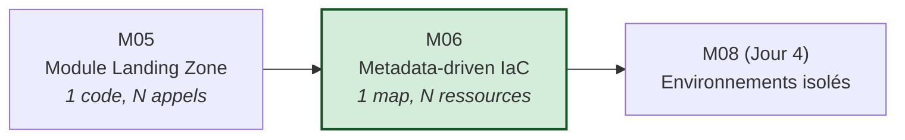

**Objectifs vérifiables :**

- ✅ créer un module `landing-zone` avec une interface typée ;
- ✅ utiliser `for_each` pour créer plusieurs ressources à partir d'une map ;
- ✅ utiliser des expressions `for` pour transformer des collections ;
- ✅ comprendre la différence entre `count` et `for_each` — **et la prouver** ;
- ✅ utiliser `count` correctement, comme interrupteur.

---

## C.1 — Étape 1 : le module de base

### 📝 Action 1.1 — Pre-flight et `terraform.tfvars`

<details open>
<summary>🪟 <b>Windows (PowerShell)</b></summary>

```powershell
cd "$HOME\Data2AI-Labs\data-platform"
.\scripts\Learner-Login.ps1 -LearnerPrefix APP01
.\scripts\Reset-Lab.ps1 -LearnerPrefix APP01 -Lab M06
cd labs\m06-dynamic-logic
Copy-Item terraform.tfvars.example terraform.tfvars
code terraform.tfvars
```
</details>

<details>
<summary>🐧 <b>Linux/macOS (Bash)</b></summary>

```bash
cd "$HOME/Data2AI-Labs/data-platform"
source ./scripts/learner-login.sh APP01
./scripts/reset-lab.sh APP01 M06
cd labs/m06-dynamic-logic
cp terraform.tfvars.example terraform.tfvars
code terraform.tfvars
```
</details>

```hcl
learner_prefix = "APP01"
environment    = "DEV"

# Snowflake connection (from .env)
snowflake_organization = "ZVFXOZW"
snowflake_account      = "PM71247"
snowflake_user         = "DATA2AI"
```

### 📝 Action 1.2 — Ajouter la variable du lab

Dans `variables.tf`, **ajoutez à la fin** :

```hcl
variable "data_retention_days" {
  type        = number
  description = "Time travel retention in days"
  default     = 1

  validation {
    condition     = var.data_retention_days >= 0 && var.data_retention_days <= 90
    error_message = "data_retention_days must be between 0 and 90."
  }
}
```

### 📝 Action 1.3 — Créer le module

<details open>
<summary>🪟 <b>Windows (PowerShell)</b></summary>

```powershell
New-Item -ItemType Directory -Force -Path "modules\landing-zone" | Out-Null
```
</details>

<details>
<summary>🐧 <b>Linux/macOS (Bash)</b></summary>

```bash
mkdir -p modules/landing-zone
```
</details>

**`modules/landing-zone/variables.tf` :**

```hcl
variable "learner_prefix" {
  type        = string
  description = "Unique uppercase prefix assigned to the learner"

  validation {
    condition     = can(regex("^[A-Z][A-Z0-9]{2,9}$", var.learner_prefix))
    error_message = "learner_prefix must contain 3-10 uppercase letters or digits."
  }
}

variable "environment" {
  type        = string
  description = "Deployment environment"
  default     = "DEV"

  validation {
    condition     = contains(["DEV", "UAT", "PROD"], var.environment)
    error_message = "environment must be DEV, UAT or PROD."
  }
}

variable "data_retention_days" {
  type        = number
  description = "Time travel retention in days"
  default     = 1

  validation {
    condition     = var.data_retention_days >= 0 && var.data_retention_days <= 90
    error_message = "data_retention_days must be between 0 and 90."
  }
}
```

**`modules/landing-zone/main.tf` :**

```hcl
locals {
  database_name  = "${var.learner_prefix}_M06_RAW_${var.environment}"
  common_comment = "Managed by Terraform | Landing Zone | ${var.learner_prefix}"
}

resource "snowflake_database" "raw" {
  name                        = local.database_name
  comment                     = local.common_comment
  data_retention_time_in_days = var.data_retention_days
}

resource "snowflake_schema" "ingestion" {
  database = snowflake_database.raw.name
  name     = "INGESTION"
  comment  = local.common_comment
}

resource "snowflake_warehouse" "etl" {
  name                = "WH_${var.learner_prefix}_M06_ETL_${var.environment}"
  comment             = local.common_comment
  warehouse_size      = "X-SMALL"
  auto_suspend        = 60
  auto_resume         = true
  initially_suspended = true
}
```

**`modules/landing-zone/outputs.tf` :**

```hcl
output "database_name" {
  value       = snowflake_database.raw.name
  description = "RAW database name"
}

output "schema_name" {
  value       = snowflake_schema.ingestion.name
  description = "Ingestion schema name"
}

output "warehouse_name" {
  value       = snowflake_warehouse.etl.name
  description = "ETL warehouse name"
}
```

**`modules/landing-zone/versions.tf` :**

```hcl
terraform {
  required_version = ">= 1.14.0, < 2.0.0"

  required_providers {
    snowflake = {
      source  = "snowflakedb/snowflake"
      version = "= 2.14.0"
    }
  }
}
```

### 📝 Action 1.4 — Valider le module isolément

```powershell
cd modules\landing-zone
terraform init
terraform fmt
terraform validate
cd ..\..
```

✅ **Checkpoint 1 :** `Success! The configuration is valid.`

### 📝 Action 1.5 — Appeler le module et déployer

**`main.tf` :**

```hcl
module "landing_zone" {
  source              = "./modules/landing-zone"
  learner_prefix      = var.learner_prefix
  environment         = var.environment
  data_retention_days = var.data_retention_days
}
```

**`outputs.tf` :**

```hcl
output "database_name" {
  value = module.landing_zone.database_name
}

output "schema_name" {
  value = module.landing_zone.schema_name
}

output "warehouse_name" {
  value = module.landing_zone.warehouse_name
}
```

```powershell
terraform fmt -recursive
terraform init
terraform validate
terraform plan -out "m06.tfplan"
terraform apply m06.tfplan
```

✅ **Checkpoint 2 :** `Apply complete! Resources: 3 added, 0 changed, 0 destroyed.`

> 🧠 **Point de départ posé.** Une database, **un** schema, **un** warehouse — tous en dur. Les trois étapes suivantes vont transformer chacune de ces valeurs figées en **donnée pilotable**.

---

## C.2 — Étape 2 : `for_each` pour les schemas

### 🧠 Le problème

Aujourd'hui, ajouter un schema `STAGING` exige d'**écrire un nouveau bloc `resource`** dans le module. Demain, `CURATED`, `ARCHIVE`, `SANDBOX`… Le module grossit à chaque besoin. C'est le niveau 2 de maturité, et il plafonne.

**L'objectif :** que la **liste des schemas** devienne une **entrée** du module.

### 📝 Action 2.1 — Ajouter la variable `schemas` au module

Dans `modules/landing-zone/variables.tf`, ajoutez :

```hcl
variable "schemas" {
  type = map(object({
    name    = string
    comment = string
  }))
  description = "Map of schemas to create in the RAW database"
  default = {
    ingestion = {
      name    = "INGESTION"
      comment = "Ingestion schema"
    }
  }
}
```

**Décomposition du type :**

```text
   map(object({ name = string, comment = string }))
   │    │        │              │
   │    │        └──────────────┴── les ATTRIBUTS de chaque entrée,
   │    │                            avec leur type
   │    └── chaque valeur est un OBJET structuré
   └── la collection est une MAP : chaque entrée a une CLÉ

   Exemple de valeur conforme :
   {
     ingestion = { name = "INGESTION", comment = "Ingestion schema" }
     staging   = { name = "STAGING",   comment = "Staging schema" }
   }
     ▲            ▲
     │            └── la VALEUR (un objet)
     └── la CLÉ (elle deviendra l'index dans le state)
```

> 🧠 **Pourquoi une `map` et pas une `list` ?** Parce que la clé de la map devient l'**index dans le state** : `snowflake_schema.this["ingestion"]`. Avec une liste, l'index serait numérique et **instable** — c'est exactement le piège de `count` vu en Partie A. La map donne des **identités stables**.

### 📝 Action 2.2 — Remplacer la ressource par un `for_each`

Dans `modules/landing-zone/main.tf`, **remplacez** le bloc `snowflake_schema.ingestion` par :

```hcl
resource "snowflake_schema" "this" {
  for_each = var.schemas

  database = snowflake_database.raw.name
  name     = each.value.name
  comment  = each.value.comment
}
```

**Anatomie du `for_each` :**

```text
   resource "snowflake_schema" "this" {
     for_each = var.schemas        ← LA COLLECTION à parcourir

     database = snowflake_database.raw.name
     name     = each.value.name    ← each.value = l'OBJET de l'itération
     comment  = each.value.comment
   }
                                    ← each.key  = la CLÉ ("ingestion")

   Adresses produites dans le state :
     snowflake_schema.this["ingestion"]
     snowflake_schema.this["staging"]
```

> 🧠 **Le nom local devient `"this"`.** C'est une **convention communautaire** : quand une ressource est multipliée par `for_each`, son nom local perd son sens singulier (« ingestion ») puisqu'elle en représente N. `"this"` signale « la ressource principale de ce module ». Vous le verrez dans presque tous les modules du Terraform Registry.

### 📝 Action 2.3 — Adapter l'output du module

Dans `modules/landing-zone/outputs.tf`, **remplacez** `schema_name` par :

```hcl
output "schema_names" {
  value       = { for k, v in var.schemas : k => snowflake_schema.this[k].name }
  description = "Map of created schema names"
}
```

**Décomposition de l'expression `for` :**

```text
   { for k, v in var.schemas : k => snowflake_schema.this[k].name }
   │     │  │       │          │              │
   │     │  │       │          │              └── la VALEUR de sortie
   │     │  │       │          └── la CLÉ de sortie
   │     │  │       └── la collection parcourue
   │     │  └── v = la valeur courante (non utilisée ici)
   │     └── k = la clé courante
   └── accolades + "=>" ⟹ produit une MAP

   Résultat :
     { ingestion = "INGESTION", staging = "STAGING" }
```

> ⚠️ **Piège classique n°18 — l'output d'une ressource multipliée.** Vous ne pouvez plus écrire `snowflake_schema.this.name` : `this` n'est pas **une** ressource, c'est une **collection**. Il faut soit indexer (`this["ingestion"].name`), soit agréger avec une expression `for`. C'est la conséquence directe de `for_each`, et la source d'erreur n°1 quand on migre une ressource simple vers `for_each`.

### 📝 Action 2.4 — Passer deux schemas depuis l'appelant

Dans `main.tf` :

```hcl
module "landing_zone" {
  source              = "./modules/landing-zone"
  learner_prefix      = var.learner_prefix
  environment         = var.environment
  data_retention_days = var.data_retention_days

  schemas = {
    ingestion = {
      name    = "INGESTION"
      comment = "Ingestion schema"
    }
    staging = {
      name    = "STAGING"
      comment = "Staging schema for raw data"
    }
  }
}
```

Dans `outputs.tf`, **remplacez** `schema_name` par :

```hcl
output "schema_names" {
  value       = module.landing_zone.schema_names
  description = "Map of created schema names"
}
```

### 📝 Action 2.5 — Gérer le changement d'adresse

> ⚠️ **Attention.** L'adresse est passée de `snowflake_schema.ingestion` à `snowflake_schema.this["ingestion"]`. **Sans bloc `moved`, Terraform détruira et recréera le schema.**

Ajoutez dans `modules/landing-zone/main.tf` :

```hcl
moved {
  from = snowflake_schema.ingestion
  to   = snowflake_schema.this["ingestion"]
}
```

> 🎓 **Point d'examen.** `moved` gère aussi le passage d'une ressource simple vers `count` ou `for_each` : `res` → `res["clé"]` ou `res` → `res[0]`. C'est l'un de ses usages les plus fréquents en refactoring réel.

### 📝 Action 2.6 — Planifier et appliquer

```powershell
terraform fmt -recursive
terraform init
terraform validate
terraform plan
```

✅ **Checkpoint 3 :**

```text
  # snowflake_schema.ingestion has moved to snowflake_schema.this["ingestion"]
  …
  # module.landing_zone.snowflake_schema.this["staging"] will be created
  + resource "snowflake_schema" "this" { … }

Plan: 1 to add, 0 to change, 0 to destroy.
```

> 🏆 **`1 to add, 0 to destroy`.** Le schema existant est **déplacé** dans le state, pas recréé ; seul `STAGING` est nouveau. C'est la signature d'un refactoring propre.

```powershell
terraform apply
terraform output schema_names
```

✅ `{ "ingestion" = "INGESTION", "staging" = "STAGING" }`

**Supprimez ensuite le bloc `moved`** du module, puis vérifiez : `terraform plan` → `No changes.`

---

## C.3 — Étape 3 : `for_each` pour les warehouses

> 🧠 **Le même geste, appliqué à une autre ressource.** Cette fois, allez plus vite — c'est la répétition qui ancre.

### 📝 Action 3.1 — Ajouter la variable `warehouses`

Dans `modules/landing-zone/variables.tf` :

```hcl
variable "warehouses" {
  type = map(object({
    size         = string
    auto_suspend = number
    comment      = string
  }))
  description = "Map of warehouses to create"
  default = {
    etl = {
      size         = "X-SMALL"
      auto_suspend = 60
      comment      = "ETL warehouse"
    }
  }

  validation {
    condition = alltrue([
      for k, v in var.warehouses : contains(["X-SMALL", "SMALL"], v.size)
    ])
    error_message = "All warehouses must be X-SMALL or SMALL (FinOps policy)."
  }
}
```

> 💰 **Regardez cette validation — c'est de la FinOps as code appliquée à une collection.**
> ```hcl
> alltrue([for k, v in var.warehouses : contains(["X-SMALL", "SMALL"], v.size)])
> ```
> L'expression `for` produit une **liste de booléens** (un par warehouse), et `alltrue()` exige qu'ils soient **tous** vrais. Un seul warehouse `MEDIUM` dans la map fait échouer le plan entier, **localement**, avant tout appel réseau.
>
> 🎓 Les fonctions sœurs à connaître : `anytrue()`, `alltrue()`, `length()`, `distinct()`, `merge()`, `lookup()`, `coalesce()`, `try()`.

### 📝 Action 3.2 — Remplacer la ressource warehouse

Dans `modules/landing-zone/main.tf`, **remplacez** `snowflake_warehouse.etl` par :

```hcl
resource "snowflake_warehouse" "this" {
  for_each = var.warehouses

  name                = "WH_${var.learner_prefix}_M06_${upper(each.key)}_${var.environment}"
  comment             = each.value.comment
  warehouse_size      = each.value.size
  auto_suspend        = each.value.auto_suspend
  auto_resume         = true
  initially_suspended = true
}

moved {
  from = snowflake_warehouse.etl
  to   = snowflake_warehouse.this["etl"]
}
```

> 🧠 **Notez l'usage de `each.key` dans le nom.**
> ```hcl
> name = "WH_${var.learner_prefix}_M06_${upper(each.key)}_${var.environment}"
> ```
> La clé `etl` devient `ETL` dans le nom : `WH_APP01_M06_ETL_DEV`. La clé `bi` donnera `WH_APP01_M06_BI_DEV`. **La donnée pilote le nommage** — c'est cela, l'IaC pilotée par métadonnées.

### 📝 Action 3.3 — Adapter l'output du module

Dans `modules/landing-zone/outputs.tf`, **remplacez** `warehouse_name` par :

```hcl
output "warehouse_names" {
  value       = { for k, v in var.warehouses : k => snowflake_warehouse.this[k].name }
  description = "Map of created warehouse names"
}
```

### 📝 Action 3.4 — Déclarer deux warehouses

Dans `main.tf` :

```hcl
module "landing_zone" {
  source              = "./modules/landing-zone"
  learner_prefix      = var.learner_prefix
  environment         = var.environment
  data_retention_days = var.data_retention_days

  schemas = {
    ingestion = { name = "INGESTION", comment = "Ingestion schema" }
    staging   = { name = "STAGING", comment = "Staging schema" }
  }

  warehouses = {
    etl = { size = "X-SMALL", auto_suspend = 60, comment = "ETL warehouse" }
    bi  = { size = "X-SMALL", auto_suspend = 120, comment = "BI warehouse" }
  }
}
```

Dans `outputs.tf`, **remplacez** `warehouse_name` par :

```hcl
output "warehouse_names" {
  value       = module.landing_zone.warehouse_names
  description = "Map of created warehouse names"
}
```

### 📝 Action 3.5 — Appliquer

```powershell
terraform fmt -recursive
terraform validate
terraform plan
```

✅ **Checkpoint 4 :** `1 to add` — le warehouse `WH_APP01_M06_BI_DEV`, avec le `moved` sur `etl`.

```powershell
terraform apply
terraform output warehouse_names
```

Puis **supprimez le bloc `moved`** et vérifiez `No changes.`

> 💰 **Note FinOps.** Le warehouse BI a `auto_suspend = 120` au lieu de 60 : les requêtes analytiques sont plus espacées, un redémarrage à chaque question serait contre-productif. **Chaque valeur de la map est une décision métier**, désormais visible et documentée.

---

## C.4 — Étape 4 : expressions `for` pour un output consolidé

### 📝 Action 4.1 — Créer un output d'inventaire

Dans `modules/landing-zone/outputs.tf`, ajoutez :

```hcl
output "all_resources" {
  value = {
    database   = snowflake_database.raw.name
    schemas    = [for k, v in var.schemas : snowflake_schema.this[k].name]
    warehouses = [for k, v in var.warehouses : snowflake_warehouse.this[k].name]
  }
  description = "Consolidated inventory of all resources"
}
```

Dans `outputs.tf` racine :

```hcl
output "all_resources" {
  value       = module.landing_zone.all_resources
  description = "Consolidated inventory"
}
```

### 📝 Action 4.2 — Vérifier

```powershell
terraform fmt -recursive
terraform apply -auto-approve
terraform output all_resources
```

✅ **Checkpoint 5 :**

```text
{
  "database" = "APP01_M06_RAW_DEV"
  "schemas" = [
    "INGESTION",
    "STAGING",
  ]
  "warehouses" = [
    "WH_APP01_M06_BI_DEV",
    "WH_APP01_M06_ETL_DEV",
  ]
}
```

> 🧠 **Deux formes d'expression `for` dans le même bloc :**
> - `[for … : …]` → une **liste** (crochets) : `schemas` et `warehouses` ;
> - `{for … : k => …}` → une **map** (accolades + `=>`) : vos outputs `schema_names`.
>
> Choisissez selon l'usage : une **liste** si seules les valeurs comptent, une **map** si l'appelant doit pouvoir chercher par clé.

> 🔬 **Testez vos expressions dans `terraform console`.** C'est le meilleur outil d'apprentissage du langage :
> ```powershell
> terraform console
> ```
> ```
> > var.schemas
> > [for k, v in var.schemas : upper(v.name)]
> > { for k, v in var.schemas : k => length(v.name) }
> > keys(var.warehouses)
> > alltrue([for k, v in var.warehouses : v.auto_suspend >= 60])
> ```
> Tapez `exit` pour sortir. Aucune ressource n'est touchée.

---

## C.5 — Étape 5 : `count` — le bon usage

> 🧠 **`count` n'est pas mauvais. Il est mal utilisé.** Son bon usage est **binaire** : créer, ou ne pas créer.

### 📝 Action 5.1 — Ajouter un interrupteur

Dans `modules/landing-zone/variables.tf` :

```hcl
variable "enable_monitoring_schema" {
  type        = bool
  description = "Create an additional MONITORING schema"
  default     = false
}
```

Dans `modules/landing-zone/main.tf` :

```hcl
resource "snowflake_schema" "monitoring" {
  count = var.enable_monitoring_schema ? 1 : 0

  database = snowflake_database.raw.name
  name     = "MONITORING"
  comment  = "Monitoring schema"
}
```

**Anatomie du patron « interrupteur » :**

```text
   count = var.enable_monitoring_schema ? 1 : 0
           └────────────┬─────────────┘   │   │
                        │                 │   └── faux → 0 instance
                        │                 └────── vrai → 1 instance
                        └── expression ternaire : condition ? si_vrai : si_faux

   Adresse produite quand actif :
     snowflake_schema.monitoring[0]      ← ⚠️ TOUJOURS indexée, même à 1 !
```

> ⚠️ **Piège classique n°19.** Une ressource avec `count` est **toujours** indexée, même quand `count = 1`. Pour la référencer, il faut écrire `snowflake_schema.monitoring[0].name`. Et si `count = 0`, cette référence **échoue**. Le patron sûr pour un output conditionnel :
> ```hcl
> output "monitoring_schema" {
>   value = var.enable_monitoring_schema ? snowflake_schema.monitoring[0].name : null
> }
> ```
> Ou, plus élégant, avec une expression `for` qui gère naturellement le cas vide :
> ```hcl
> value = one(snowflake_schema.monitoring[*].name)
> ```
> La fonction `one()` renvoie l'unique élément d'une liste, ou `null` si elle est vide. `[*]` est l'**opérateur splat**, qui extrait un attribut de toutes les instances.

### 📝 Action 5.2 — Activer et tester

Dans `main.tf`, ajoutez au bloc `module` :

```hcl
  enable_monitoring_schema = true
```

```powershell
terraform fmt -recursive
terraform plan
```

✅ **Checkpoint 6 :** `1 to add` — le schema `MONITORING`.

```powershell
terraform apply
terraform state list
```

Observez la différence d'adressage :

```text
module.landing_zone.snowflake_schema.monitoring[0]        ← count : index NUMÉRIQUE
module.landing_zone.snowflake_schema.this["ingestion"]    ← for_each : index par CLÉ
module.landing_zone.snowflake_schema.this["staging"]
module.landing_zone.snowflake_warehouse.this["bi"]
module.landing_zone.snowflake_warehouse.this["etl"]
```

> 🎓 **Cette sortie est un résumé visuel de toute la Partie A.** `[0]` contre `["ingestion"]` : la première est fragile, la seconde est stable. Gardez cette image.

### 📝 Action 5.3 — Vérification dans Snowsight

1. Ouvrez **[app.snowflake.com](https://app.snowflake.com)** ;
2. **Data → Databases → `APP01_M06_RAW_DEV`** ;
3. Vérifiez la présence des schemas `INGESTION`, `STAGING` et `MONITORING` ;
4. **Admin → Warehouses** : `WH_APP01_M06_ETL_DEV` et `WH_APP01_M06_BI_DEV`, tous deux `Suspended` ;
5. Vérifiez les commentaires : ils viennent directement de votre map.

> 🧠 **Six ressources Snowflake pilotées par environ quinze lignes de métadonnées.** Faites l'exercice mental : combien de lignes de HCL auraient été nécessaires en écriture directe ? Environ quarante.

---

## C.6 — 🐛 Chaos Lab : `for_each` ne réindexe pas

> *Le lab le plus important de la journée. Vous allez prouver expérimentalement ce que la Partie A affirmait.*

### Symptôme — retirer une entrée du **milieu**

Dans `main.tf`, commentez le schema `staging` — c'est-à-dire une entrée **au milieu** de la map :

```hcl
  schemas = {
    ingestion = { name = "INGESTION", comment = "Ingestion schema" }
    # staging = { name = "STAGING", comment = "Staging schema" }   ← retiré
  }
```

### Diagnostic

```powershell
terraform plan
```

✅ **Observez :**

```text
  # module.landing_zone.snowflake_schema.this["staging"] will be destroyed
  # (because key ["staging"] is not in for_each map)
  - resource "snowflake_schema" "this" {
      - name = "STAGING" -> null
    }

Plan: 0 to add, 0 to change, 1 to destroy.
```

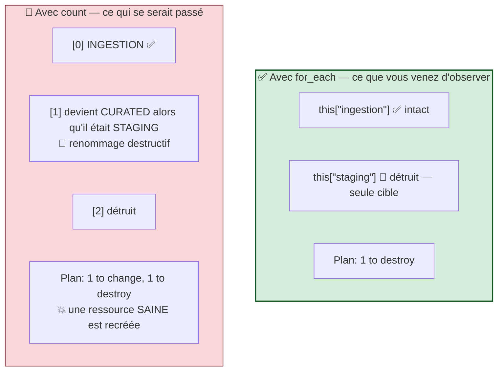

> 🧠 **La démonstration est faite.** `for_each` cible la clé `"staging"` et **uniquement** elle. Les clés sont des **identités stables** : retirer, ajouter, réordonner n'a aucun effet sur les autres entrées.
>
> Avec `count`, la même opération aurait décalé tous les index suivants, provoquant la **destruction et la recréation de ressources parfaitement saines**. Sur une database contenant des données, cela signifie une perte.
>
> **C'est pourquoi `for_each` est la norme en entreprise, et pourquoi cette question tombe à l'examen.**

### Remédiation

Rétablissez `staging` dans la map :

```powershell
terraform plan
```

✅ `1 to add` — puis `terraform apply` et `No changes.`

---

## C.7 — 🤖 Validation automatisée

```powershell
cd "$HOME\Data2AI-Labs\data-platform"
.\scripts\SelfPacedLab.ps1 -Module 6 -All -Report
```

✅ **Résultat attendu :**

```text
[PASS] T1 for_each on map variable
[PASS] T2 Dynamic blocks usage
[PASS] T3 Conditional expressions (ternary)
[PASS] T4 terraform fmt & validate
[PASS] T5 Stable resource addressing
Result: 5/5 Tasks Passed.
```

---

## C.8 — 🏆 Défi autonome

> **Scénario :** ajoutez une variable `tags` (map de strings) au module et propagez-la sur toutes les ressources qui l'acceptent. Utilisez un bloc `dynamic` là où le provider expose un bloc imbriqué répétable.
>
> **Contraintes :**
> - `terraform validate` réussit ;
> - `terraform plan` n'affiche **aucun** changement quand `tags = {}` (valeur par défaut) ;
> - les tags s'appliquent quand ils sont fournis ;
> - l'appelant existant continue de fonctionner sans modification.

<details>
<summary>💡 <b>Indice n°1</b></summary>

La contrainte « aucun changement quand `tags = {}` » impose que le `default` soit une map vide, et que le mécanisme n'émette **rien** dans ce cas. C'est exactement le comportement naturel de `dynamic` : `for_each` sur une collection vide génère **zéro bloc**.
</details>

<details>
<summary>💡 <b>Indice n°2</b></summary>

Le provider `snowflakedb/snowflake` 2.14.0 n'expose pas partout un bloc `tag` imbriqué. Vérifiez la documentation du Registry pour chaque ressource. Si aucun bloc répétable n'est disponible, deux solutions de repli restent parfaitement valides — et la seconde reste dans l'esprit de l'exercice :
1. sérialiser les tags dans l'attribut `comment` avec `jsonencode()` ;
2. créer des ressources `snowflake_tag` et `snowflake_tag_association` avec `for_each`.
</details>

<details>
<summary>✅ <b>Solution de référence (variante « comment enrichi »)</b></summary>

**`modules/landing-zone/variables.tf` :**

```hcl
variable "tags" {
  type        = map(string)
  description = "Governance tags applied to all resources"
  default     = {}

  validation {
    condition = alltrue([
      for k, v in var.tags : can(regex("^[a-z_]+$", k))
    ])
    error_message = "Tag keys must be lowercase letters and underscores only."
  }
}
```

**`modules/landing-zone/main.tf` — enrichir le local :**

```hcl
locals {
  database_name  = "${var.learner_prefix}_M06_RAW_${var.environment}"
  base_comment   = "Managed by Terraform | Landing Zone | ${var.learner_prefix}"
  tag_suffix     = length(var.tags) > 0 ? " | ${jsonencode(var.tags)}" : ""
  common_comment = "${local.base_comment}${local.tag_suffix}"
}
```

**Appel avec tags, dans `main.tf` racine :**

```hcl
  tags = {
    cost_center = "FIN-042"
    owner       = "data-platform-team"
  }
```

**Vérification de la rétro-compatibilité :**

```powershell
terraform fmt -recursive
terraform plan        # SANS tags → No changes.
# puis, après ajout des tags :
terraform plan        # → 6 to change (les commentaires)
```

> 🧠 Le local `tag_suffix` est le cœur de la solution : quand `var.tags` est vide, il vaut `""` et le commentaire reste **strictement identique** à l'existant. **Zéro changement, donc rétro-compatibilité parfaite.**

**Variante `dynamic` — si le provider expose un bloc répétable :**

```hcl
resource "exemple" "x" {
  dynamic "tag" {
    for_each = var.tags
    content {
      key   = tag.key
      value = tag.value
    }
  }
}
```

Avec `var.tags = {}`, `for_each` parcourt une collection vide et **aucun bloc n'est généré** — la ressource est identique à ce qu'elle était.
</details>

| Critère d'évaluation | Points |
|---|---:|
| Syntaxe HCL et respect des standards | 30 |
| Preuve d'exécution fonctionnelle | 30 |
| Idempotence (`0 to add, 0 to change, 0 to destroy`) | 20 |
| Respect des budgets FinOps & Sécurité | 20 |
| **Total** | **100** |

---

## C.9 — 🧹 Nettoyage

```powershell
cd "$HOME\Data2AI-Labs\data-platform\labs\m06-dynamic-logic"
terraform destroy -auto-approve
```

✅ **Checkpoint cleanup :** `Destroy complete!` — toutes les ressources M06 sont supprimées.

> 💡 Alternative : `.\scripts\Reset-Lab.ps1 -LearnerPrefix APP01 -Lab M06`.

---
---
# PARTIE D — 📚 CONSOLIDATION

---

## D.1 — 🎓 Quiz de fin de journée (style Terraform Associate 003)

---

**Q1.** Qu'est-ce qu'un module Terraform, techniquement ?

- A. Un fichier `.tfmodule` compilé
- B. Un dossier contenant des fichiers `.tf`
- C. Un paquet publié obligatoirement sur le Terraform Registry
- D. Un bloc `module {}` dans `main.tf`

---

**Q2.** Un module enfant peut-il contenir un bloc `backend` ?

- A. Oui, chaque module a son propre state
- B. Non — le state est déclaré uniquement dans le module racine
- C. Oui, mais seulement pour les backends locaux
- D. Oui, si le module est publié sur un Registry

---

**Q3.** Quelle est l'adresse d'une ressource `snowflake_database.raw` déclarée dans un module appelé `landing_zone` ?

- A. `landing_zone.snowflake_database.raw`
- B. `module.landing_zone.snowflake_database.raw`
- C. `snowflake_database.landing_zone.raw`
- D. `module["landing_zone"].snowflake_database.raw`

---

**Q4.** Vous extrayez trois ressources existantes dans un module, **sans** bloc `moved`. Que montre le plan ?

- A. `No changes.`
- B. `3 to change`
- C. `3 to add, 3 to destroy`
- D. Une erreur de validation

---

**Q5.** Vous gérez trois schemas avec `count` et retirez celui du milieu. Que se passe-t-il ?

- A. Seul le schema retiré est détruit
- B. Les index suivants sont décalés, provoquant un renommage destructif
- C. Terraform refuse le plan
- D. Rien, `count` gère les clés

---

**Q6.** `for_each` accepte :

- A. un `number`
- B. une `list(string)` uniquement
- C. une `map` ou un `set`
- D. n'importe quel type

---

**Q7.** Comment convertir une liste pour l'utiliser avec `for_each` ?

- A. `for_each = tolist(var.x)`
- B. `for_each = toset(var.x)`
- C. `for_each = tomap(var.x)`
- D. Ce n'est pas possible

---

**Q8.** Que produit `{ for k, v in var.m : k => upper(v.name) }` ?

- A. Une liste
- B. Une map
- C. Un set
- D. Une chaîne de caractères

---

**Q9.** À quoi sert un bloc `dynamic` ?

- A. À créer plusieurs ressources
- B. À générer plusieurs blocs imbriqués à l'intérieur d'une ressource
- C. À transformer une collection
- D. À rendre une ressource conditionnelle

---

**Q10.** Quel est le bon usage de `count` ?

- A. Créer N ressources à partir d'une liste nommée
- B. Activer ou désactiver une ressource (`count = var.enabled ? 1 : 0`)
- C. Itérer sur une map
- D. `count` est déprécié

---

**Q11.** Comment un module enfant obtient-il sa configuration de provider ?

- A. Il la déclare lui-même dans un bloc `provider`
- B. Il l'hérite automatiquement de son appelant
- C. Elle est lue depuis les variables d'environnement
- D. Elle est stockée dans le state

---

**Q12.** Pourquoi épingler `?ref=v1.3.0` sur une source de module Git ?

- A. Pour accélérer le téléchargement
- B. Pour éviter que l'infrastructure change quand quelqu'un pousse sur la branche par défaut
- C. C'est obligatoire syntaxiquement
- D. Pour activer le cache local

---

**Q13.** Un module ajoute un nouvel input **sans** valeur par défaut. Quelle version publier ?

- A. Correctif (1.0.1)
- B. Mineure (1.1.0)
- C. Majeure (2.0.0)
- D. Aucune, ce n'est pas un changement d'interface

---

**Q14.** Comment lire une ressource interne d'un module depuis l'appelant ?

- A. `module.x.snowflake_database.raw.name`
- B. Uniquement via un `output` déclaré par le module
- C. Avec `terraform state show`
- D. Avec `data "terraform_remote_state"`

---

**Q15.** Une ressource déclarée avec `count = 1` s'adresse :

- A. `res.name`
- B. `res[0].name`
- C. `res["0"].name`
- D. `res.0.name`

---

**Q16.** Quelle contrainte de version convient à un module **réutilisable** ?

- A. `= 1.14.5`
- B. `>= 1.14.0, < 2.0.0`
- C. Aucune contrainte
- D. `~> 1.14.5`

---

### ✅ Corrigé détaillé

| # | Réponse | Explication |
|:---:|:---:|---|
| **1** | **B** | Aucune syntaxe spéciale : un dossier de `.tf` est un module. Le module racine en est un aussi. |
| **2** | **B** | Il n'y a qu'un state par exécution, déclaré dans le module racine. Un module enfant n'a jamais de backend. |
| **3** | **B** | Préfixe `module.<nom_du_bloc>` suivi de l'adresse interne. Avec `for_each` sur le module : `module.landing_zone["clé"].…`. |
| **4** | **C** | Le changement d'adresse est lu comme une destruction plus une création. `moved` est indispensable. |
| **5** | **B** | `count` indexe numériquement ; retirer un élément décale tous les suivants et détruit/recrée des ressources saines. |
| **6** | **C** | `map(…)` ou `set(string)`. Une `list` doit être convertie. |
| **7** | **B** | `toset()`. Sur un set, `each.key` et `each.value` sont identiques. |
| **8** | **B** | Accolades + `=>` → map. Crochets `[for … : …]` → liste. |
| **9** | **B** | `dynamic` répète un **bloc imbriqué**, pas une ressource. Ne pas confondre avec `for_each`. |
| **10** | **B** | Interrupteur binaire. Pour les collections nommées, `for_each`. |
| **11** | **B** | Héritage automatique. Le méta-argument `providers` permet d'en passer un autre explicitement. |
| **12** | **B** | Sans `ref`, la branche par défaut est suivie : l'infra change sans modification de votre code. |
| **13** | **C** | Un input obligatoire nouveau casse tous les appelants → version majeure. |
| **14** | **B** | Les ressources internes sont encapsulées. Seuls les `outputs` sont l'API publique. |
| **15** | **B** | `count` indexe **toujours**, même à 1. D'où `res[0]`. |
| **16** | **B** | Un intervalle souple maximise la compatibilité. L'épinglage strict appartient au module racine. |

**Barème :** 13/16 ou plus → prêt pour le Jour 4. Moins de 11 → relisez les sections A.2 et A.3.

---

### ✅ Réponses aux 5 questions d'auto-évaluation de la Partie A

1. **Un module** est un dossier contenant des fichiers `.tf`. Aucune syntaxe ni empaquetage particulier.
2. **Ni `provider` ni `backend`** : il n'y a qu'un state par exécution (module racine), et le module hérite du provider de son appelant. Un module qui configure son provider n'est plus réutilisable avec `count`/`for_each`.
3. **Sans `moved`** : le plan affiche `N to add, N to destroy` — les adresses changent, Terraform lit cela comme une destruction suivie d'une création. Perte de données.
4. **`for_each` plutôt que `count`** : les clés sont des identités stables. Retirer un élément du milieu ne réindexe rien ; avec `count`, tous les index suivants sont décalés.
5. **`for_each` crée des ressources ; une expression `for` transforme une valeur.** Deux mécanismes distincts qui partagent trois lettres.

---

## D.2 — 🃏 Anti-sèche Jour 3

### Les blocs

```hcl
# ── Appeler un module ────────────────────────────────────────
module "landing_zone" {
  source               = "./modules/landing-zone"   # local
  # source = "git::https://.../tf-modules//landing-zone?ref=v1.3.0"
  learner_prefix       = var.learner_prefix
  environment          = var.environment
}

# ── Appeler un module N fois ─────────────────────────────────
module "landing_zone" {
  source   = "./modules/landing-zone"
  for_each = var.domains

  learner_prefix = upper(each.key)
  warehouse_size = each.value.warehouse_size
}
# → module.landing_zone["finance"].snowflake_database.raw

# ── Lire un output de module ─────────────────────────────────
module.landing_zone.database_name
{ for k, m in module.landing_zone : k => m.database_name }

# ── Multiplier une ressource par une map ─────────────────────
resource "snowflake_schema" "this" {
  for_each = var.schemas
  name     = each.value.name       # each.value = l'objet
  comment  = each.value.comment    # each.key   = la clé
}
# → snowflake_schema.this["ingestion"]

# ── Interrupteur binaire ─────────────────────────────────────
resource "snowflake_schema" "monitoring" {
  count = var.enabled ? 1 : 0
}
# → snowflake_schema.monitoring[0]   (toujours indexé)

# ── Répéter un bloc imbriqué ─────────────────────────────────
dynamic "tag" {
  for_each = var.tags
  content {
    key   = tag.key
    value = tag.value
  }
}

# ── Refactorer sans détruire ─────────────────────────────────
moved { from = snowflake_database.raw
        to   = module.landing_zone.snowflake_database.raw }
moved { from = snowflake_schema.ingestion
        to   = snowflake_schema.this["ingestion"] }
```

### Les expressions `for`

```hcl
[for x in liste : upper(x)]                       # liste → liste
[for k, v in map : v.name]                        # map → liste
{ for k, v in map : k => v.name }                 # map → map
[for k, v in map : k if v.size == "X-SMALL"]      # avec filtre
alltrue([for k, v in map : v.days <= 90])         # validation collective
res[*].name                                        # splat : tous les noms
one(res[*].name)                                   # l'unique, ou null
```

### `count` vs `for_each`

| | `count` | `for_each` |
|---|---|---|
| Entrée | `number` | `map` / `set` |
| Itérateur | `count.index` | `each.key`, `each.value` |
| Adresse | `res[0]` | `res["clé"]` |
| Retrait au milieu | 🔴 réindexe | ✅ cible seule la clé |
| Usage | interrupteur 0/1 | collections nommées |

### Les commandes

```bash
terraform init                    # OBLIGATOIRE après tout changement de module
terraform init -upgrade           # re-télécharge les modules distants
terraform fmt -recursive          # formate aussi les sous-dossiers
terraform validate                # à lancer AUSSI dans chaque module
terraform get                     # installe les modules sans toucher au backend
terraform console                 # tester for, alltrue, keys, values…
terraform state list              # voir les adresses module.x.type.nom["clé"]
```

---

## D.3 — 🔧 Troubleshooting Jour 3

| Symptôme | Cause probable | Solution |
|---|---|---|
| `Module not installed` | Bloc `module` ajouté sans `init` | `terraform init` |
| `Unsupported argument` sur un bloc `module` | L'argument ne correspond à aucune `variable` du module | Vérifiez `modules/<x>/variables.tf` |
| `Missing required argument` | Une variable du module sans `default` n'est pas fournie | Ajoutez l'argument, ou un `default` dans le module |
| `Unsupported attribute: module.x.y` | L'output `y` n'existe pas dans le module | Vérifiez `modules/<x>/outputs.tf` |
| Plan affiche `N to add, N to destroy` après extraction | Blocs `moved` manquants | Ajoutez un `moved` par ressource déplacée |
| `Object already exists` à l'apply, plan valide | Deux instances de module produisent le même nom | Différenciez les paramètres (préfixe, suffixe) |
| `Invalid value for variable` sur `learner_prefix` dans le module | Regex du module trop stricte pour un préfixe composé | Élargissez la regex du module (3-10 caractères) |
| `The "for_each" value depends on resource attributes…` | `for_each` piloté par une valeur `known after apply` | Pilotez `for_each` par des variables/locals statiques |
| `Invalid for_each argument` sur une liste | `for_each` n'accepte pas `list` | `for_each = toset(var.x)` |
| `Cannot index a value of type object` | Référence `res.name` sur une ressource `for_each` | `res["clé"].name` ou expression `for` |
| `Invalid index` avec `count = 0` | Référence `res[0]` alors qu'aucune instance n'existe | Utilisez `one(res[*].x)` ou un ternaire |
| `Reference to undeclared resource` après refactoring | `outputs.tf` référence encore l'ancienne adresse | Mettez à jour **toutes** les références |
| `terraform validate` OK dans le module, KO à la racine | `init` non relancé à la racine | `terraform init` à la racine |
| Modification d'un module Git sans effet | Le module est en cache | `terraform init -upgrade` |

> 🔬 **Méthode de diagnostic propre à cette journée.** Quand un refactoring dérape, **validez de l'intérieur vers l'extérieur** :
> 1. `cd modules/landing-zone && terraform init && terraform validate` — le module est-il correct **en lui-même** ?
> 2. `cd ../.. && terraform init && terraform validate` — l'appel est-il correct ?
> 3. `terraform plan` — le state est-il aligné ?
>
> 90 % des erreurs se révèlent à l'étape 1 ou 2, avant tout appel réseau.

---

## D.4 — 📖 Glossaire Jour 3 (FR / EN)

| Terme | Définition |
|---|---|
| **Module** | Un dossier contenant des fichiers `.tf` |
| **Module racine** (*root module*) | Le dossier où l'on lance `terraform` ; seul endroit avec `provider` et `backend` |
| **Module enfant** (*child module*) | Un module appelé par un bloc `module` |
| **Contrat d'interface** | L'ensemble `variables` + `outputs` d'un module — son API publique |
| **Encapsulation** | Les ressources internes d'un module ne sont pas accessibles de l'extérieur |
| **`source`** | L'emplacement du code d'un module : chemin local, Git, Registry |
| **`ref`** | Le tag ou la branche Git épinglés dans une source Git |
| **Versionnement sémantique** | majeure.mineure.correctif — la majeure signale une rupture d'interface |
| **`for_each`** | Méta-argument multipliant une ressource ou un module par une map/set |
| **`count`** | Méta-argument multipliant une ressource par un nombre |
| **`each.key` / `each.value`** | La clé et la valeur de l'itération `for_each` courante |
| **`count.index`** | L'index numérique de l'itération `count` courante |
| **Réindexation** | Décalage des index `count` quand un élément est retiré — cause de destructions |
| **Expression `for`** | Transformation d'une collection en une autre collection |
| **Bloc `dynamic`** | Génération de blocs imbriqués répétés |
| **Opérateur splat `[*]`** | Extraction d'un attribut sur toutes les instances : `res[*].name` |
| **`toset()`** | Conversion d'une liste en set, pour `for_each` |
| **`alltrue()` / `anytrue()`** | Agrégation d'une liste de booléens — utile en validation |
| **`one()`** | Renvoie l'unique élément d'une collection, ou `null` |
| **`optional()`** | Rend un attribut d'un type `object` facultatif, avec valeur par défaut |
| **`terraform-docs`** | Outil générant la documentation d'un module depuis son code |
| **Metadata-driven IaC** | Architecture où une structure de données décrit la plateforme, le code l'interprète |
| **DRY** | *Don't Repeat Yourself* — une seule source de vérité par concept |

---

## D.5 — ✅ Definition of Done du Jour 3

- [ ] Je sais expliquer qu'un module est **un dossier de fichiers `.tf`**, sans syntaxe particulière.
- [ ] Je sais dire **pourquoi** un module enfant n'a ni `provider` ni `backend`.
- [ ] J'ai créé un module avec `variables.tf`, `main.tf`, `outputs.tf`, `versions.tf` **et** `README.md`.
- [ ] J'ai validé un module **isolément** avec `terraform init && terraform validate`.
- [ ] J'ai extrait des ressources vivantes dans un module et obtenu `0 to destroy` grâce aux blocs `moved`.
- [ ] J'ai réutilisé le même module pour un **second domaine** avec des paramètres différents.
- [ ] J'ai constaté qu'un output renommé casse **tous** les appelants (Chaos Lab 5).
- [ ] J'ai converti une ressource simple en `for_each` avec un `moved` vers `res["clé"]`.
- [ ] J'ai écrit une expression `for` produisant une **liste**, et une autre produisant une **map**.
- [ ] J'ai utilisé `alltrue([for …])` comme validation FinOps sur une collection.
- [ ] J'ai utilisé `count` **uniquement** comme interrupteur, et je sais que `res[0]` est toujours indexé.
- [ ] J'ai retiré une entrée du **milieu** d'une map `for_each` et prouvé que seule cette clé est détruite.
- [ ] `SelfPacedLab.ps1 -Module 5` et `-Module 6` affichent `5/5 Tasks Passed`.
- [ ] J'ai obtenu au moins 13/16 au quiz.

---

## D.6 — 🧠 Synthèse : où en est votre plateforme après trois jours

```mermaid
flowchart TB
    subgraph J1["📅 JOUR 1 — Écrire"]
        A["📜 Configuration HCL<br/>versions · provider · variables<br/>locals · main · outputs"]
    end

    subgraph J2["📅 JOUR 2 — Posséder"]
        B["📄 State distant Azure<br/>verrouillé · chiffré · partagé<br/>import · drift · moved"]
    end

    subgraph J3["📅 JOUR 3 — Factoriser"]
        C["📦 Modules réutilisables<br/>+ pilotage par métadonnées<br/>1 map → N ressources"]
    end

    D["☁️ Snowflake + Azure"]

    A --> B --> D
    C --> A

    style A fill:#d4edda,stroke:#155724
    style B fill:#fff3cd,stroke:#856404
    style C fill:#e7e4f9,stroke:#5c4ee5,stroke-width:3px
    style D fill:#d1ecf1,stroke:#0c5460
```

**Les cinq vérités du Jour 3 :**

| # | Vérité |
|:---:|---|
| 1 | Un module est **un dossier de `.tf`**. Le module racine en est un aussi. |
| 2 | `variables` + `outputs` = le **contrat public**. Le reste est libre de changer. |
| 3 | Extraire dans un module **change les adresses**. Sans `moved`, c'est une destruction. |
| 4 | `for_each` indexe par **clé stable** ; `count` indexe par **position fragile**. |
| 5 | Au niveau de maturité 3, ajouter un domaine coûte **des données**, pas du code. |

---

## D.7 — 🔮 Ce que le Jour 3 laisse en suspens

```mermaid
flowchart TB
    Q1["❓ <b>Mon module est prêt.<br/>Mais comment le déployer<br/>en DEV, UAT ET PROD<br/>sans que l'un casse l'autre ?</b><br/>Un state ? Trois states ?<br/>Workspaces ou répertoires ?"]
    Q2["❓ <b>Et si ce n'était plus MOI<br/>qui lançais terraform apply ?</b><br/>Comment un pipeline obtient-il<br/>le PAT ? Qui approuve un apply<br/>en production ?"]

    J4["📅 <b>JOUR 4</b><br/>Environnements isolés DEV/UAT/PROD<br/>+ Pipeline CI/CD Azure DevOps<br/>plan immuable · gates d'approbation<br/>audit de dérive"]

    Q1 --> J4
    Q2 --> J4

    style Q1 fill:#fff3cd,stroke:#856404
    style Q2 fill:#fff3cd,stroke:#856404
    style J4 fill:#d4edda,stroke:#155724,stroke-width:3px
```

---

## D.8 — 📚 Pour aller plus loin

| Ressource | Pourquoi la consulter |
|---|---|
| *HashiCorp Developer — Modules Overview* | Les concepts de module racine, enfant, et composition |
| *HashiCorp Developer — Module Sources* | La syntaxe complète des sources Git, Registry, HTTP |
| *HashiCorp Developer — Standard Module Structure* | La convention de fichiers attendue pour un module publiable |
| *HashiCorp Developer — `for_each` and `count`* | La documentation de référence des méta-arguments |
| *HashiCorp Developer — `for` Expressions* | Toutes les formes d'expressions `for` |
| *HashiCorp Developer — `dynamic` Blocks* | Y compris `iterator` et les cas limites |
| *`terraform-docs`* | Génération automatique du README d'un module |
| *Terraform Registry — modules publics* | Lire du code de module professionnel : la meilleure école |

> 🎓 **Préparation à la certification.** Le Jour 3 couvre l'objectif **5** (*Interact with Terraform modules* : sources, entrées/sorties, versionnement) et complète l'objectif **8** (*Read, generate, and modify configuration* : méta-arguments, expressions, blocs dynamiques). Ces sujets représentent une part significative des questions de l'examen.

---

## Navigation

[← Jour 2 — Le State](../day-02/atelier-jour-02.md) · **Jour 3 — Modules et logique dynamique** · [Jour 4 — Environnements et CI/CD →](../day-04/atelier-jour-04.md)

*Ateliers sources : `labs/m05-modules/lab.md` · `labs/m06-dynamic-logic/lab.md`*
