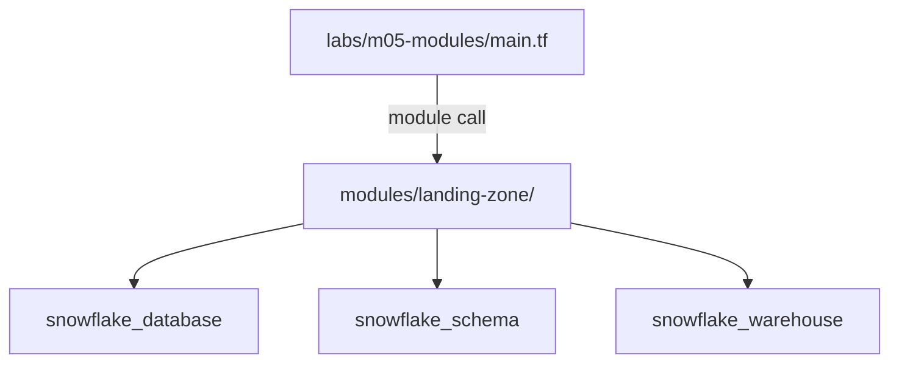

# 🧪 Lab M5 — Module Landing Zone réutilisable

> [<- Jour 3](../README.md) · [<- Jour 2](../../day-02/README.md) · **Module 05** · [Module suivant ->](../module-06-dynamic-logic/lab.md)

| Élément | Valeur |
|---|---|
| **Durée** | 60 min |
| **Piste** | `[CORE]` |
| **Workspace** | `$HOME/Data2AI-Labs/data-platform` (le clone) |
| **Dossier de travail** | `labs/m05-modules/` |
| **Coût** | Warehouses X-SMALL |
| **Cleanup** | `terraform destroy -auto-approve` à la fin |

> `[IMPORTANT]` Avant de commencer, vous devez etre dans la racine du clone
> et avoir execute `Learner-Login.ps1 -SnowflakeOnly` dans **cette session** :
>
> ```powershell
> cd "$HOME\Data2AI-Labs\data-platform"
> .\scripts\Learner-Login.ps1 -LearnerPrefix APP01 -SnowflakeOnly
> ```
>
> Cela set `TF_VAR_snowflake_token` (depuis `secrets/snowflake_pat.txt`)
> et `LEARNER_PREFIX`. Aucun login Azure n'est requis pour ce lab (state local).
>
> Réinitialisez le lab pour partir d'un état propre :
>
> ```powershell
> .\scripts\Reset-Lab.ps1 -LearnerPrefix APP01 -Lab M05
> ```
>
> Puis placez-vous dans le dossier du lab et verifiez que tout est pret :
>
> ```powershell
> cd labs\m05-modules
> ..\..\scripts\Test-TerraformReady.ps1
> ```
>
> Si le pre-flight affiche `READY`, lancez `terraform plan -out "m05.tfplan"`.
> Sinon, suivez les corrections indiquees.

## 🎯 1. Mission Métier & User Story

Les domaines Data ont besoin d'une plateforme cohérente sans copier des centaines de ressources. Vous allez d'abord créer les ressources directement, puis les extraire dans un module réutilisable `landing-zone`, et enfin appeler ce module pour un second domaine.

> **En tant que :** Data Platform Engineer  
> **Je veux :** extraire les ressources Snowflake dans un module Terraform réutilisable  
> **Afin de :** provisionner plusieurs domaines Data sans duplication de code
> **Votre persona GlobalBank :** appliquez ce lab sur les objets de votre équipe — 🔵 Platform, 🟢 Data Engineering, 🟠 Business Data, 🟣 BI (voir [personas-globalbank.md](../../../shared/docs/personas-globalbank.md)).


---

## 🏗️ 2. Architecture & Modèle Mental

```mermaid
flowchart LR
    M4[M4 — Contrats typés] --> M5[M5 — Module Landing Zone]
    M5 --> M6[M6 — Metadata-driven IaC]
```





## 🎯 3. Objectifs Pédagogiques Vérifiables

- créer un module Terraform avec une interface typée;
- créer les ressources directement, puis les extraire dans un module;
- appeler le module depuis `labs/m05-modules/`;
- versionner le module avec un `README.md` et des `outputs`;
- réutiliser le module pour un second domaine.

## � 4. Pre-Flight Diagnostic (Vérification Initiale)

### Prérequis

- [ ] Jour 0 terminé : `Toolchain status: READY`;
- [ ] `snow sql -q 'SELECT 1' -c training` réussit;
- [ ] le clone `data-platform-starter` existe sous `$HOME/Data2AI-Labs/data-platform`.

## 📝 5. Étapes d'Implémentation Pas-à-Pas (80% Hands-On)

### 📝 Étape 5.0 — Préparer le dossier du lab

#### Découvrir les fichiers fournis

Le dossier `labs/m05-modules/` contient déjà les fichiers de base :

| Fichier | Rôle |
|---|---|
| `provider.tf` | Provider Snowflake (lit le PAT depuis `../../secrets/`) |
| `versions.tf` | Contraintes de version Terraform et provider |
| `variables.tf` | Variables de base (snowflake_*, learner_prefix, environment) |
| `terraform.tfvars.example` | Modèle de fichier tfvars à copier |
| `main.tf` | Vide — créé par l'apprenant |
| `outputs.tf` | Vide — créé par l'apprenant |

#### Créer `terraform.tfvars`

Copiez le modèle et adaptez les valeurs :

<details>
<summary>🪟 <b>Windows (PowerShell)</b></summary>

```powershell
cd "$HOME\Data2AI-Labs\data-platform\labs\m05-modules"
Copy-Item terraform.tfvars.example terraform.tfvars
code terraform.tfvars
```
</details>

<details>
<summary>🐧 <b>Linux/macOS (Bash)</b></summary>

```bash
cd $HOME/Data2AI-Labs/data-platform/labs/m05-modules
cp terraform.tfvars.example terraform.tfvars
code terraform.tfvars
```
</details>

```hcl
learner_prefix         = "APP01"
environment            = "DEV"

# Snowflake connection (from .env)
snowflake_organization = "ZVFXOZW"
snowflake_account      = "PM71247"
snowflake_user         = "DATA2AI"
```

Remplacez `APP01` par votre préfixe apprenant.

#### Ajouter les variables spécifiques au lab

Dans `variables.tf`, ajoutez à la fin du fichier :

```hcl
variable "warehouse_size" {
  type        = string
  description = "Warehouse size"
  default     = "X-SMALL"

  validation {
    condition     = contains(["X-SMALL", "SMALL", "MEDIUM"], var.warehouse_size)
    error_message = "warehouse_size must be X-SMALL, SMALL or MEDIUM."
  }
}

variable "data_retention_days" {
  type        = number
  description = "Time travel retention in days"
  default     = 1

  validation {
    condition     = var.data_retention_days >= 0 && var.data_retention_days <= 90
    error_message = "data_retention_days must be between 0 and 90."
  }
}

variable "auto_suspend_seconds" {
  type        = number
  description = "Warehouse auto-suspend in seconds"
  default     = 60

  validation {
    condition     = var.auto_suspend_seconds >= 60 && var.auto_suspend_seconds <= 3600
    error_message = "auto_suspend_seconds must be between 60 and 3600."
  }
}
```

### 📝 Étape 5.1 — Créer les ressources directement

Avant d'extraire un module, vous allez créer les ressources directement dans `main.tf`. Cela vous permettra de voir exactement ce que le module encapsulera.

#### Créer `locals.tf`

```hcl
locals {
  database_name  = "${var.learner_prefix}_M05_RAW_${var.environment}"
  schema_name    = "INGESTION"
  warehouse_name = "WH_${var.learner_prefix}_M05_ETL_${var.environment}"
  common_comment = "Managed by Terraform | Landing Zone | ${var.learner_prefix}"
}
```

> 💡 **Note** : Le préfixe `M05` dans les noms isole les ressources de ce lab de celles des autres labs.

#### Créer `main.tf`

```hcl
resource "snowflake_database" "raw" {
  name                        = local.database_name
  comment                     = local.common_comment
  data_retention_time_in_days = var.data_retention_days
}

resource "snowflake_schema" "ingestion" {
  database = snowflake_database.raw.name
  name     = local.schema_name
  comment  = local.common_comment
}

resource "snowflake_warehouse" "etl" {
  name                = local.warehouse_name
  comment             = local.common_comment
  warehouse_size      = var.warehouse_size
  auto_suspend        = var.auto_suspend_seconds
  auto_resume         = true
  initially_suspended = true
}
```

#### Créer `outputs.tf`

```hcl
output "database_name" {
  value       = snowflake_database.raw.name
  description = "RAW database name"
}

output "schema_name" {
  value       = snowflake_schema.ingestion.name
  description = "Ingestion schema name"
}

output "warehouse_name" {
  value       = snowflake_warehouse.etl.name
  description = "ETL warehouse name"
}
```

#### Formater, valider, planifier

```bash
terraform fmt
terraform init
terraform validate
terraform plan -out "m05.tfplan"
```

✅ **Checkpoint** : `Plan: 3 to add, 0 to change, 0 to destroy.`

#### Appliquer

```bash
terraform apply m05.tfplan
```

✅ **Checkpoint** : `Apply complete! Resources: 3 added, 0 changed, 0 destroyed.`

#### Vérifier dans Snowflake

```powershell
snow sql -c training -q "SHOW DATABASES LIKE 'APP01_M05_RAW_DEV'"
snow sql -c training -q "SHOW WAREHOUSES LIKE 'WH_APP01_M05_ETL_DEV'"
```

> Remplacez `APP01` par votre préfixe.

### 📝 Étape 5.2 — Extraire les ressources dans un module

Maintenant que les ressources existent, vous allez les extraire dans un module réutilisable.

#### Créer les dossiers

```bash
New-Item -ItemType Directory -Force -Path "modules/landing-zone" | Out-Null
```

#### Créer `modules/landing-zone/variables.tf`

```hcl
variable "learner_prefix" {
  type        = string
  description = "Unique uppercase prefix assigned to the learner"

  validation {
    condition     = can(regex("^[A-Z][A-Z0-9]{2,4}$", var.learner_prefix))
    error_message = "learner_prefix must contain 3-5 uppercase letters or digits."
  }
}

variable "environment" {
  type        = string
  description = "Deployment environment"
  default     = "DEV"

  validation {
    condition     = contains(["DEV", "UAT", "PROD"], var.environment)
    error_message = "environment must be DEV, UAT or PROD."
  }
}

variable "warehouse_size" {
  type        = string
  description = "Warehouse size"
  default     = "X-SMALL"

  validation {
    condition     = contains(["X-SMALL", "SMALL", "MEDIUM"], var.warehouse_size)
    error_message = "warehouse_size must be X-SMALL, SMALL or MEDIUM."
  }
}

variable "data_retention_days" {
  type        = number
  description = "Time travel retention in days"
  default     = 1

  validation {
    condition     = var.data_retention_days >= 0 && var.data_retention_days <= 90
    error_message = "data_retention_days must be between 0 and 90."
  }
}

variable "auto_suspend_seconds" {
  type        = number
  description = "Warehouse auto-suspend in seconds"
  default     = 60

  validation {
    condition     = var.auto_suspend_seconds >= 60 && var.auto_suspend_seconds <= 3600
    error_message = "auto_suspend_seconds must be between 60 and 3600."
  }
}
```

> 💡 **Note** : La validation du module accepte jusqu'à 10 caractères pour `learner_prefix`,
> afin de permettre des préfixes composés comme `APP01SAL` (domaine Sales).

#### Créer `modules/landing-zone/main.tf`

```hcl
locals {
  database_name  = "${var.learner_prefix}_M05_RAW_${var.environment}"
  schema_name    = "INGESTION"
  warehouse_name = "WH_${var.learner_prefix}_M05_ETL_${var.environment}"
  common_comment = "Managed by Terraform | Landing Zone | ${var.learner_prefix}"
}

resource "snowflake_database" "raw" {
  name                        = local.database_name
  comment                     = local.common_comment
  data_retention_time_in_days = var.data_retention_days
}

resource "snowflake_schema" "ingestion" {
  database = snowflake_database.raw.name
  name     = local.schema_name
  comment  = local.common_comment
}

resource "snowflake_warehouse" "etl" {
  name                = local.warehouse_name
  comment             = local.common_comment
  warehouse_size      = var.warehouse_size
  auto_suspend        = var.auto_suspend_seconds
  auto_resume         = true
  initially_suspended = true
}
```

#### Créer `modules/landing-zone/outputs.tf`

```hcl
output "database_name" {
  value       = snowflake_database.raw.name
  description = "RAW database name"
}

output "schema_name" {
  value       = snowflake_schema.ingestion.name
  description = "Ingestion schema name"
}

output "warehouse_name" {
  value       = snowflake_warehouse.etl.name
  description = "ETL warehouse name"
}
```

#### Créer `modules/landing-zone/versions.tf`

```hcl
terraform {
  required_version = ">= 1.14.0, < 2.0.0"

  required_providers {
    snowflake = {
      source  = "snowflakedb/snowflake"
      version = "= 2.14.0"
    }
  }
}
```

#### Créer `modules/landing-zone/README.md`

```markdown
# landing-zone

Creates a RAW database, an INGESTION schema and an ETL warehouse.

## Usage

\`\`\`hcl
module "landing_zone" {
  source             = "./modules/landing-zone"
  learner_prefix     = "ABC"
  environment        = "DEV"
  warehouse_size     = "X-SMALL"
}
\`\`\`

## Inputs

| Name | Type | Default | Description |
|---|---|---|---|
| learner_prefix | string | — | 3-10 uppercase letters |
| environment | string | DEV | DEV, UAT or PROD |
| warehouse_size | string | X-SMALL | Warehouse size |
| data_retention_days | number | 1 | Time travel days |
| auto_suspend_seconds | number | 60 | Auto-suspend seconds |

## Outputs

| Name | Description |
|---|---|
| database_name | RAW database name |
| schema_name | Ingestion schema name |
| warehouse_name | ETL warehouse name |
```

#### Initialiser, formater et valider le module

> `[IMPORTANT]` Vous devez créer **tous les fichiers du module** (variables.tf, main.tf,
> outputs.tf, versions.tf) **avant** cette étape. Si un fichier manque, `terraform validate`
> échouera avec des erreurs de référence.

```bash
cd modules/landing-zone
terraform init
terraform fmt
terraform validate
```

✅ **Checkpoint** : `The configuration is valid.`

> 💡 **Note** : Un module n'a pas de `provider` block ni de `backend` block. Il déclare seulement les contraintes et les ressources. `terraform init` télécharge le provider pour permettre la validation.

> ⚠️ **IMPORTANT** : Ne lancez **pas** `terraform init` dans `labs/m05-modules/` tant que
> la Partie 3 n'est pas terminée. Un module incomplet référencé depuis `main.tf`
> provoquera des erreurs `Reference to undeclared resource`.

### 📝 Étape 5.3 — Appeler le module depuis main.tf

> `[IMPORTANT]` Cette partie modifie `main.tf`, `locals.tf` ET `outputs.tf`.
> Vous devez faire **toutes les étapes 3.1 à 3.3** avant de lancer `terraform init`.
> Si vous lancez `terraform init` après seulement l'étape 3.1, Terraform détectera
> le module mais les anciens outputs référenceront des ressources qui n'existent plus.

#### Réécrire `main.tf`

**Remplacez tout le contenu** de `main.tf` par :

```hcl
module "landing_zone" {
  source               = "./modules/landing-zone"
  learner_prefix       = var.learner_prefix
  environment          = var.environment
  warehouse_size       = var.warehouse_size
  data_retention_days  = var.data_retention_days
  auto_suspend_seconds = var.auto_suspend_seconds
}
```

#### Ajouter les blocs `moved`

Sans blocs `moved`, Terraform verrait les ressources du module comme **nouvelles** et proposerait de détruire puis recréer la database, le schema et le warehouse (`3 to add, 3 to destroy`). Ajoutez en haut de `main.tf` pour déplacer les ressources existantes dans le state sans les recréer :

```hcl
moved {
  from = snowflake_database.raw
  to   = module.landing_zone.snowflake_database.raw
}

moved {
  from = snowflake_schema.ingestion
  to   = module.landing_zone.snowflake_schema.ingestion
}

moved {
  from = snowflake_warehouse.etl
  to   = module.landing_zone.snowflake_warehouse.etl
}
```

> Les ressources (database, schema, warehouse) sont maintenant dans le module.
> `main.tf` ne contient plus que l'appel du module et les blocs `moved`.
> Une fois le move appliqué (`terraform apply`), vous pouvez supprimer les blocs `moved`.

#### Supprimer `locals.tf`

Les locals n'étaient utilisés que par les ressources directes qui sont maintenant dans le module.

<details>
<summary>🪟 <b>Windows (PowerShell)</b></summary>

```powershell
Remove-Item locals.tf
```
</details>

<details>
<summary>🐧 <b>Linux/macOS (Bash)</b></summary>

```bash
rm locals.tf
```
</details>

#### Remplacer `outputs.tf`

**Remplacez tout le contenu** de `outputs.tf` par :

```hcl
output "database_name" {
  value       = module.landing_zone.database_name
  description = "RAW database name"
}

output "schema_name" {
  value       = module.landing_zone.schema_name
  description = "Ingestion schema name"
}

output "warehouse_name" {
  value       = module.landing_zone.warehouse_name
  description = "ETL warehouse name"
}

output "resource_summary" {
  value = {
    database  = module.landing_zone.database_name
    schema    = module.landing_zone.schema_name
    warehouse = module.landing_zone.warehouse_name
  }
}
```

#### Formater et initialiser

```bash
cd ..
terraform fmt
terraform init
```

Terraform télécharge le module local.

#### Planifier

```bash
terraform plan
```

✅ **Checkpoint** : `No changes.` — les ressources existent déjà et le module produit la même configuration.

> 💡 **Note** : Si Terraform propose de recréer les ressources, c'est que les noms ou attributs diffèrent. Vérifiez vos variables.

### 📝 Étape 5.4 — Réutiliser le module pour un second domaine

#### Ajouter un second appel dans `main.tf`

```hcl
module "landing_zone_sales" {
  source               = "./modules/landing-zone"
  learner_prefix       = "${var.learner_prefix}SAL"
  environment          = var.environment
  warehouse_size       = "X-SMALL"
  data_retention_days  = var.data_retention_days
  auto_suspend_seconds = var.auto_suspend_seconds
}
```

#### Ajouter les outputs

```hcl
output "sales_database_name" {
  value       = module.landing_zone_sales.database_name
  description = "Sales RAW database name"
}
```

#### Planifier

```bash
terraform fmt
terraform plan
```

✅ **Checkpoint** : `3 to add` — le second module crée une nouvelle database, un nouveau schema et un nouveau warehouse.

#### Appliquer

```bash
terraform apply
```

✅ **Checkpoint** : `3 added, 0 changed, 0 destroyed.`

#### Vérification Non-Destructive dans Snowflake Snowsight

1. Ouvrez **[app.snowflake.com](https://app.snowflake.com)** avec vos identifiants apprenant.
2. Naviguez dans **Data > Databases** et vérifiez que vos bases originales (créées au M01/M04) existent toujours intactes à côté de la nouvelle base `SALES`.
3. Le refactoring en module n'a provoqué aucune recréation : la migration de code ne détruit rien si les adresses de ressources sont correctement gérées.

---

## 🐛 6. Incident Contrôlé (*Chaos Engineering Lab*)

*Que se passe-t-il quand vous modifiez un output dans un module sans adapter l'appelant ?*

### Symptôme & Injection

Dans `modules/landing-zone/outputs.tf`, renommez `database_name` en `db_name` :

```hcl
output "db_name" {  # ← renommé
  value = snowflake_database.raw.name
}
```

### Diagnostic & Observation

Lancez `terraform validate` :

```text
Error: Unsupported attribute
  module.landing_zone.database_name is not defined
```

Le contrat d'interface d'un module est un engagement. Modifier un output casse les appelants en cascade. Utilisez `moved` pour les renommages progressifs.

### Remédiation

Restaurez le nom original `database_name` et constatez le retour à la normale.

---

## 🤖 7. Validation Automatisée (*Check My Progress*)

```powershell
.\scripts\SelfPacedLab.ps1 -Module 5 -All -Report
```

✅ **Résultat attendu :**
```text
[PASS] T1 Module directory structure
[PASS] T2 Module inputs/outputs contract
[PASS] T3 Root module instantiation
[PASS] T4 terraform fmt & validate
[PASS] T5 Multiple module instances
Result: 5/5 Tasks Passed.
```

---

## 🏆 8. Défi Autonome (*Unguided Challenge*)

> **Scénario :** Ajoutez une variable `schemas` (list of strings) au module qui crée plusieurs schemas dans la même database avec `for_each`.
> **Contraintes :**
> - `terraform validate` réussit;
> - `terraform plan` crée les schemas supplémentaires;
> - le module reste réutilisable sans modification de l'appelant existant.

| Critère d'Évaluation | Points |
|---|---:|
| Syntaxe HCL et respect des standards | 30 pts |
| Preuve d'exécution fonctionnelle | 30 pts |
| Idempotence (`0 to add, 0 to change, 0 to destroy`) | 20 pts |
| Respect des budgets FinOps & Sécurité | 20 pts |
| **Total** | **100 pts** |

## 🧹 9. Nettoyage Contrôlé (*FinOps Teardown*)

Détruisez toutes les ressources créées dans ce lab (domaine principal + domaine Sales) :

```bash
terraform destroy -auto-approve
```

✅ **Checkpoint** : `Destroy complete! Resources: 6 destroyed.`

> 💡 **Note** : Vous pouvez aussi utiliser `.\scripts\Reset-Lab.ps1 -LearnerPrefix APP01 -Lab M05`
> pour nettoyer automatiquement.

---

## Navigation

[<- Lab M4](../../day-01/module-04-variables-outputs/lab.md) · [<- Jour 3](../README.md) · **Lab M5** · [Lab M6 ->](../module-06-dynamic-logic/lab.md)
