# 🧪 Lab M6 — Déploiement dynamique avec `for_each`, `for` et `dynamic`

> [<- Jour 3](../README.md) · [<- Module precedent](../module-05-modules/lab.md) · **Module 06** · [Module suivant ->](../../day-04/module-07-cicd-pipeline/lab.md)

| Élément | Valeur |
|---|---|
| **Durée** | 60 min |
| **Piste** | `[CORE]` |
| **Workspace** | `$HOME/Data2AI-Labs/data-platform` (le clone) |
| **Dossier de travail** | `labs/m06-dynamic-logic/` |
| **Coût** | Warehouses X-SMALL supplémentaires |
| **Cleanup** | `terraform destroy -auto-approve` à la fin |

> `[IMPORTANT]` Avant de commencer, vous devez etre dans la racine du clone
> et avoir execute `Learner-Login.ps1 -SnowflakeOnly` dans **cette session** :
>
> ```powershell
> cd "$HOME\Data2AI-Labs\data-platform"
> .\scripts\Learner-Login.ps1 -LearnerPrefix APP01 -SnowflakeOnly
> ```
>
> Cela set `TF_VAR_snowflake_token` (depuis `secrets/snowflake_pat.txt`)
> et `LEARNER_PREFIX`. Aucun login Azure n'est requis pour ce lab (state local).
>
> Réinitialisez le lab pour partir d'un état propre :
>
> ```powershell
> .\scripts\Reset-Lab.ps1 -LearnerPrefix APP01 -Lab M06
> ```
>
> Puis placez-vous dans le dossier du lab et verifiez que tout est pret :
>
> ```powershell
> cd labs\m06-dynamic-logic
> ..\..\scripts\Test-TerraformReady.ps1
> ```
>
> Si le pre-flight affiche `READY`, lancez `terraform plan -out "m06.tfplan"`.
> Sinon, suivez les corrections indiquees.

## 🎯 1. Mission Métier & User Story

La plateforme doit absorber de nouveaux schémas, warehouses et domaines sans dupliquer le code. Vous allez créer un module `landing-zone` piloté par métadonnées avec `for_each`, `for` et `dynamic`.

> **En tant que :** Data Platform Engineer  
> **Je veux :** piloter la création de ressources Snowflake par métadonnées avec `for_each` et `dynamic`  
> **Afin de :** absorber de nouveaux domaines sans duplication de code
> **Votre persona GlobalBank :** appliquez ce lab sur les objets de votre équipe — 🔵 Platform, 🟢 Data Engineering, 🟠 Business Data, 🟣 BI (voir [personas-globalbank.md](../../../shared/docs/personas-globalbank.md)).


---

## 🏗️ 2. Architecture & Modèle Mental

```mermaid
flowchart LR
    M5[M5 — Landing Zone] --> M6[M6 — Metadata-driven IaC]
    M6 --> M7[M7 — Pipeline GitOps]
```



## 🎯 3. Objectifs Pédagogiques Vérifiables

- créer un module `landing-zone` réutilisable avec une interface typée;
- utiliser `for_each` pour créer plusieurs ressources à partir d'une map;
- utiliser `for` pour transformer des collections;
- utiliser `dynamic` pour générer des blocs répétitifs;
- comprendre la différence entre `count` et `for_each`.

## � 4. Pre-Flight Diagnostic (Vérification Initiale)

### Prérequis

- [ ] Jour 0 terminé : `Toolchain status: READY`;
- [ ] `snow sql -q 'SELECT 1' -c training` réussit;
- [ ] le clone `data-platform-starter` existe sous `$HOME/Data2AI-Labs/data-platform`.

## 📝 5. Étapes d'Implémentation Pas-à-Pas (80% Hands-On)

### 📝 Étape 5.0 — Préparer le dossier du lab

#### Découvrir les fichiers fournis

Le dossier `labs/m06-dynamic-logic/` contient déjà les fichiers de base :

| Fichier | Rôle |
|---|---|
| `provider.tf` | Provider Snowflake (lit le PAT depuis `../../secrets/`) |
| `versions.tf` | Contraintes de version Terraform et provider |
| `variables.tf` | Variables de base (snowflake_*, learner_prefix, environment) |
| `terraform.tfvars.example` | Modèle de fichier tfvars à copier |
| `main.tf` | Vide — créé par l'apprenant |
| `outputs.tf` | Vide — créé par l'apprenant |

#### Créer `terraform.tfvars`

<details>
<summary>🪟 <b>Windows (PowerShell)</b></summary>

```powershell
cd "$HOME\Data2AI-Labs\data-platform\labs\m06-dynamic-logic"
Copy-Item terraform.tfvars.example terraform.tfvars
code terraform.tfvars
```
</details>

<details>
<summary>🐧 <b>Linux/macOS (Bash)</b></summary>

```bash
cd $HOME/Data2AI-Labs/data-platform/labs/m06-dynamic-logic
cp terraform.tfvars.example terraform.tfvars
code terraform.tfvars
```
</details>

```hcl
learner_prefix         = "APP01"
environment            = "DEV"

# Snowflake connection (from .env)
snowflake_organization = "ZVFXOZW"
snowflake_account      = "PM71247"
snowflake_user         = "DATA2AI"
```

#### Ajouter les variables spécifiques au lab

Dans `variables.tf`, ajoutez à la fin du fichier :

```hcl
variable "data_retention_days" {
  type        = number
  description = "Time travel retention in days"
  default     = 1

  validation {
    condition     = var.data_retention_days >= 0 && var.data_retention_days <= 90
    error_message = "data_retention_days must be between 0 and 90."
  }
}
```

### 📝 Étape 5.1 — Créer le module de base

#### Créer les dossiers

```bash
New-Item -ItemType Directory -Force -Path "modules/landing-zone" | Out-Null
```

#### Créer `modules/landing-zone/variables.tf`

```hcl
variable "learner_prefix" {
  type        = string
  description = "Unique uppercase prefix assigned to the learner"

  validation {
    condition     = can(regex("^[A-Z][A-Z0-9]{2,4}$", var.learner_prefix))
    error_message = "learner_prefix must contain 3-5 uppercase letters or digits."
  }
}

variable "environment" {
  type        = string
  description = "Deployment environment"
  default     = "DEV"

  validation {
    condition     = contains(["DEV", "UAT", "PROD"], var.environment)
    error_message = "environment must be DEV, UAT or PROD."
  }
}

variable "data_retention_days" {
  type        = number
  description = "Time travel retention in days"
  default     = 1

  validation {
    condition     = var.data_retention_days >= 0 && var.data_retention_days <= 90
    error_message = "data_retention_days must be between 0 and 90."
  }
}
```

#### Créer `modules/landing-zone/main.tf`

```hcl
locals {
  database_name  = "${var.learner_prefix}_M06_RAW_${var.environment}"
  common_comment = "Managed by Terraform | Landing Zone | ${var.learner_prefix}"
}

resource "snowflake_database" "raw" {
  name                        = local.database_name
  comment                     = local.common_comment
  data_retention_time_in_days = var.data_retention_days
}

resource "snowflake_schema" "ingestion" {
  database = snowflake_database.raw.name
  name     = "INGESTION"
  comment  = local.common_comment
}

resource "snowflake_warehouse" "etl" {
  name                = "WH_${var.learner_prefix}_M06_ETL_${var.environment}"
  comment             = local.common_comment
  warehouse_size      = "X-SMALL"
  auto_suspend        = 60
  auto_resume         = true
  initially_suspended = true
}
```

#### Créer `modules/landing-zone/outputs.tf`

```hcl
output "database_name" {
  value       = snowflake_database.raw.name
  description = "RAW database name"
}

output "schema_name" {
  value       = snowflake_schema.ingestion.name
  description = "Ingestion schema name"
}

output "warehouse_name" {
  value       = snowflake_warehouse.etl.name
  description = "ETL warehouse name"
}
```

#### Créer `modules/landing-zone/versions.tf`

```hcl
terraform {
  required_version = ">= 1.14.0, < 2.0.0"

  required_providers {
    snowflake = {
      source  = "snowflakedb/snowflake"
      version = "= 2.14.0"
    }
  }
}
```

#### Valider le module

```bash
cd modules/landing-zone
terraform init
terraform fmt
terraform validate
```

✅ **Checkpoint** : `The configuration is valid.`

#### Appeler le module depuis `main.tf`

Revenez dans le dossier du lab et créez `main.tf` :

```bash
cd ..
```

```hcl
module "landing_zone" {
  source              = "./modules/landing-zone"
  learner_prefix      = var.learner_prefix
  environment         = var.environment
  data_retention_days = var.data_retention_days
}
```

Créez `outputs.tf` :

```hcl
output "database_name" {
  value = module.landing_zone.database_name
}

output "schema_name" {
  value = module.landing_zone.schema_name
}

output "warehouse_name" {
  value = module.landing_zone.warehouse_name
}
```

#### Déployer

```bash
terraform fmt
terraform init
terraform validate
terraform plan -out "m06.tfplan"
terraform apply m06.tfplan
```

✅ **Checkpoint** : `Apply complete! Resources: 3 added, 0 changed, 0 destroyed.`

### 📝 Étape 5.2 — for_each pour les schemas

#### Ajouter une variable `schemas` au module

Dans `modules/landing-zone/variables.tf`, ajoutez :

```hcl
variable "schemas" {
  type = map(object({
    name    = string
    comment = string
  }))
  description = "Map of schemas to create in the RAW database"
  default = {
    ingestion = {
      name    = "INGESTION"
      comment = "Ingestion schema"
    }
  }
}
```

#### Remplacer la ressource schema par un for_each

Dans `modules/landing-zone/main.tf`, remplacez le bloc `snowflake_schema.ingestion` par :

```hcl
resource "snowflake_schema" "this" {
  for_each = var.schemas

  database = snowflake_database.raw.name
  name     = each.value.name
  comment  = each.value.comment
}
```

#### Mettre à jour les outputs du module

Dans `modules/landing-zone/outputs.tf`, remplacez l'output `schema_name` par :

```hcl
output "schema_names" {
  value       = { for k, v in var.schemas : k => snowflake_schema.this[k].name }
  description = "Map of created schema names"
}
```

#### Mettre à jour l'appelant

Dans `main.tf`, ajoutez le paramètre `schemas` :

```hcl
module "landing_zone" {
  source              = "./modules/landing-zone"
  learner_prefix      = var.learner_prefix
  environment         = var.environment
  data_retention_days = var.data_retention_days

  schemas = {
    ingestion = {
      name    = "INGESTION"
      comment = "Ingestion schema"
    }
    staging = {
      name    = "STAGING"
      comment = "Staging schema for raw data"
    }
  }
}
```

#### Mettre à jour les outputs de l'appelant

Dans `outputs.tf` :

```hcl
output "schema_names" {
  value       = module.landing_zone.schema_names
  description = "Map of created schema names"
}
```

#### Formater, valider, planifier, appliquer

```bash
terraform fmt
terraform init
terraform validate
terraform plan
```

✅ **Checkpoint** : `1 to add` — le nouveau schema `STAGING`.

```bash
terraform apply
```

### 📝 Étape 5.3 — for_each pour les warehouses

#### Ajouter une variable `warehouses`

Dans `modules/landing-zone/variables.tf` :

```hcl
variable "warehouses" {
  type = map(object({
    size         = string
    auto_suspend = number
    comment      = string
  }))
  description = "Map of warehouses to create"
  default = {
    etl = {
      size         = "X-SMALL"
      auto_suspend = 60
      comment      = "ETL warehouse"
    }
  }
}
```

#### Remplacer la ressource warehouse par un for_each

Dans `modules/landing-zone/main.tf`, remplacez le bloc `snowflake_warehouse.etl` par :

```hcl
resource "snowflake_warehouse" "this" {
  for_each = var.warehouses

  name                = "WH_${var.learner_prefix}_M06_${upper(each.key)}_${var.environment}"
  comment             = each.value.comment
  warehouse_size      = each.value.size
  auto_suspend        = each.value.auto_suspend
  auto_resume         = true
  initially_suspended = true
}
```

#### Mettre à jour les outputs du module

Dans `modules/landing-zone/outputs.tf`, remplacez l'output `warehouse_name` par :

```hcl
output "warehouse_names" {
  value       = { for k, v in var.warehouses : k => snowflake_warehouse.this[k].name }
  description = "Map of created warehouse names"
}
```

#### Mettre à jour l'appelant

```hcl
module "landing_zone" {
  source              = "./modules/landing-zone"
  learner_prefix      = var.learner_prefix
  environment         = var.environment
  data_retention_days = var.data_retention_days

  schemas = {
    ingestion = { name = "INGESTION", comment = "Ingestion schema" }
    staging   = { name = "STAGING",   comment = "Staging schema" }
  }

  warehouses = {
    etl = { size = "X-SMALL", auto_suspend = 60, comment = "ETL warehouse" }
    bi  = { size = "X-SMALL", auto_suspend = 120, comment = "BI warehouse" }
  }
}
```

#### Mettre à jour les outputs de l'appelant

Dans `outputs.tf`, remplacez l'output `warehouse_name` par :

```hcl
output "warehouse_names" {
  value       = module.landing_zone.warehouse_names
  description = "Map of created warehouse names"
}
```

#### Planifier et appliquer

```bash
terraform fmt
terraform validate
terraform plan
terraform apply
```

✅ **Checkpoint** : `1 to add` — le nouveau warehouse `WH_APP01_M06_BI_DEV`.

### 📝 Étape 5.4 — for expressions et dynamic

#### Utiliser for pour un output consolidé

Dans `modules/landing-zone/outputs.tf` :

```hcl
output "all_resources" {
  value = {
    database   = snowflake_database.raw.name
    schemas    = [for k, v in var.schemas : snowflake_schema.this[k].name]
    warehouses = [for k, v in var.warehouses : snowflake_warehouse.this[k].name]
  }
  description = "Consolidated list of all resources"
}
```

#### Vérifier

```bash
terraform output all_resources
```

✅ **Checkpoint** : un objet avec la database, la liste des schemas et la liste des warehouses.

### 📝 Étape 5.5 — count vs for_each

#### Comprendre la différence

| Critère | `count` | `for_each` |
|---|---|---|
| Type d'entrée | `number` | `map` ou `set` |
| Index | `count.index` | `each.key` et `each.value` |
| Suppression | décale tous les index | supprime uniquement la clé visée |
| Recommandé pour | activer/désactiver | collections nommées |

#### Exemple de count pour un feature flag

Ajoutez dans `modules/landing-zone/variables.tf` :

```hcl
variable "enable_monitoring_schema" {
  type        = bool
  description = "Create a monitoring schema"
  default     = false
}
```

Dans `modules/landing-zone/main.tf` :

```hcl
resource "snowflake_schema" "monitoring" {
  count = var.enable_monitoring_schema ? 1 : 0

  database = snowflake_database.raw.name
  name     = "MONITORING"
  comment  = "Monitoring schema"
}
```

#### Activer et tester

Dans `main.tf` :

```hcl
  enable_monitoring_schema = true
```

```bash
terraform fmt
terraform plan
terraform apply
```

✅ **Checkpoint** : `1 to add` — le schema `MONITORING`.

#### Vérification Dynamique dans Snowflake Snowsight

1. Ouvrez **[app.snowflake.com](https://app.snowflake.com)** avec vos identifiants apprenant.
2. Naviguez dans **Data > Databases** > Votre database M06.
3. Vérifiez la présence des schemas créés dynamiquement (`RAW`, `CLEAN`, `CURATED`, et le conditionnel `MONITORING`).
4. Cliquez sur chaque schema pour vérifier ses commentaires et la cohérence des attributs (retention, etc.).

---

## 🐛 6. Incident Contrôlé (*Chaos Engineering Lab*)

*Démontrez que `for_each` supprime uniquement la couche ciblée sans réindexer :*

### Symptôme & Injection

Dans votre `terraform.tfvars` ou votre variable `layers`, retirez la couche `CLEAN` du milieu :

```hcl
layers = {
  RAW     = { comment = "Raw data" }
  # CLEAN = { comment = "Cleaned data" }  ← retiré
  CURATED = { comment = "Curated data" }
}
```

### Diagnostic & Observation

Lancez `terraform plan` et observez :

```text
- snowflake_schema.layers["CLEAN"] will be destroyed
Plan: 0 to add, 0 to change, 1 to destroy.
```

Seul `CLEAN` est ciblé. `RAW` et `CURATED` sont intacts car `for_each` utilise les clés de la map et non des indices numériques.

Avec `count`, retirer un élément au milieu aurait décalé les indices et provoqué une recréation destructive de `CURATED`. C'est pourquoi `for_each` est la norme en entreprise.

### Remédiation

Rétablissez `CLEAN` dans la map, exécutez `terraform plan` et constatez `1 to add`.

---

## 🤖 7. Validation Automatisée (*Check My Progress*)

```powershell
.\scripts\SelfPacedLab.ps1 -Module 6 -All -Report
```

✅ **Résultat attendu :**
```text
[PASS] T1 for_each on map variable
[PASS] T2 Dynamic blocks usage
[PASS] T3 Conditional expressions (ternary)
[PASS] T4 terraform fmt & validate
[PASS] T5 Stable resource addressing
Result: 5/5 Tasks Passed.
```

---

## 🏆 8. Défi Autonome (*Unguided Challenge*)

> **Scénario :** Ajoutez une variable `tags` (map de strings) au module et utilisez `dynamic` pour appliquer ces tags à chaque ressource qui supporte les tags.
> **Contraintes :**
> - `terraform validate` réussit;
> - `terraform plan` n'affiche pas de changement si les tags sont vides;
> - les tags s'appliquent quand ils sont fournis.

| Critère d'Évaluation | Points |
|---|---:|
| Syntaxe HCL et respect des standards | 30 pts |
| Preuve d'exécution fonctionnelle | 30 pts |
| Idempotence (`0 to add, 0 to change, 0 to destroy`) | 20 pts |
| Respect des budgets FinOps & Sécurité | 20 pts |
| **Total** | **100 pts** |

## 🧹 9. Nettoyage Contrôlé (*FinOps Teardown*)

Détruisez toutes les ressources créées dans ce lab :

```bash
terraform destroy -auto-approve
```

✅ **Checkpoint** : `Destroy complete!` — toutes les ressources M06 sont supprimées.

> 💡 **Note** : Vous pouvez aussi utiliser `.\scripts\Reset-Lab.ps1 -LearnerPrefix APP01 -Lab M06`
> pour nettoyer automatiquement.

---

## Navigation

[<- Lab M5](../module-05-modules/lab.md) · [<- Jour 3](../README.md) · **Lab M6** · [Lab M7 ->](../../day-04/module-07-cicd-pipeline/lab.md)
