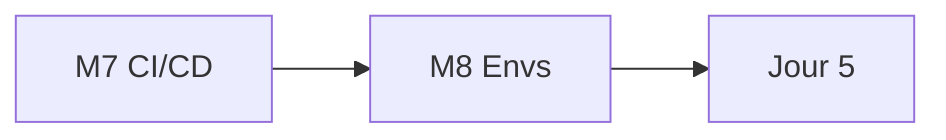
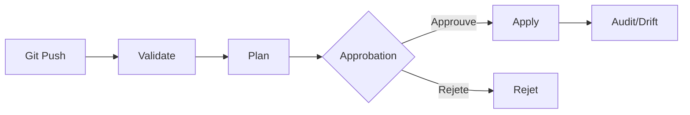

# Jour 4 — CI/CD et Environnements

**Objectif :** Pipeline GitOps et isolation multi-environnements.

> [<- Catalogue](../README.md) · [Jour 3](../day-03/README.md) · **Jour 4** · [Jour 5 ->](../day-05/README.md)

---

## Contexte GlobalBank

> **Email Sofia Almeida :**
>
> *"Le state vit sur 11 ordinateurs. Si un casse, la plateforme est orpheline.
> Inacceptable.*
>
> *Lundi, on va en production. Pas d'apply sans review et preuve."*

**Aujourd'hui :** vous separez l'execution du stockage. Le state va dans Azure
Blob Storage avec locking. La pipeline CI/CD valide, planifie, attend
l'approbation, puis applique. DEV, UAT et PROD sont isoles.

---

## Les 3 Axes d'Isolation

| Axe | DEV | UAT | PROD |
|-----|-----|-----|------|
| **State** | `tfstate-dev` | `tfstate-uat` | `tfstate-prod` |
| **Nommage** | `*_DEV` | `*_UAT` | `*_PROD` |
| **Identite** | SP dev | SP uat | SP prod |

> **Piege workspace :** `terraform workspace select prod` oublie → apply accidentel en prod.
> **Solution :** les repertoires isolent les trois axes, pas les workspaces.

---

## Progression



## Modules

| Module | Duree | Repertoire de travail | Lab | Course | Troubleshooting | Resultat attendu |
|---|---:|---|---|---|---|---|
| [M7 — CI/CD Pipeline](module-07-cicd-pipeline/lab.md) | 1h15 | `labs/m07-cicd-pipeline/` | [lab](module-07-cicd-pipeline/lab.md) | [cours](module-07-cicd-pipeline/course.md) | [guide](module-07-cicd-pipeline/troubleshooting.md) | [output](module-07-cicd-pipeline/expected-output.md) |
| [M8 — Environnements](module-08-environments/lab.md) | 50 min | `labs/m08-environments/` | [lab](module-08-environments/lab.md) | [cours](module-08-environments/course.md) | [guide](module-08-environments/troubleshooting.md) | [output](module-08-environments/expected-output.md) |

## Workflow du jour

1. **Lisez** le `course.md` du module (concepts, 15-20 min)
2. **Realisez** le `lab.md` pas a pas (creation de fichiers, execution, checkpoints)
3. **Comparez** avec `expected-output.md`
4. **Consultez** `troubleshooting.md` en cas d'erreur
5. **Passez** au module suivant

> Chaque module possede son propre repertoire de travail sous `labs/mXX-name/` (ex. `labs/m07-cicd-pipeline/` pour M7). Chaque lab est **autonome** : il demarre par `Reset-Lab.ps1` pour un environnement propre, possede ses propres fichiers template et se termine par `terraform destroy`. Les ressources sont nommees par module (ex. `APP01_M07_RAW_DEV`).

> `[WINDOWS]` Si l'execution de scripts `.ps1` est bloquee, autorisez les scripts locaux :
> ```powershell
> Set-ExecutionPolicy -Scope CurrentUser -ExecutionPolicy RemoteSigned
> ```

## Livrable du jour

Pipeline CI/CD avec quality gates sur Azure DevOps.
Environnements isoles (DEV/UAT/PROD) avec state et nommage séparés.

---

## Preuves individuelles

- [ ] Pipeline execute depuis l'agent (pas en local)
- [ ] States et noms distincts entre DEV et PROD
- [ ] Plan enregistre publie comme potentiellement sensible
- [ ] Vous pouvez expliquer la difference entre workspace et repertoire

---

## [CHAOS LAB] — State Lock (par paires)

> ⚠️ Exercice de rupture controlee. Deux personnes collaborent.

**Objectif :** Decouvrir le probleme de corruption du state.

1. Deux personnes partagent la meme cle de state (meme backend Azure Blob)
2. Personne A execute `terraform apply` en cours
3. Personne B execute `terraform apply` en meme temps
4. Observez : un des deux recoit un message de lock

**Question :** Que se passerait-il sans mechanisme de locking ?

---

## [DEFI] — Convergence de modules

**Temps :** 15 minutes

1. Le formateur presente 3 versions d'un meme module
2. En binome, choisissez la meilleure version
3. Votez et justifiez votre choix

**Enseignement :** La gouvernance de modules est un processus social, pas seulement technique.

---

## Anti-seche Jour 4

### Pipeline CI/CD GitOps



### Les 6 etapes d'un pipeline

| Etape | Controle | Bloquant ? |
|-------|----------|------------|
| Validate | fmt, validate, tflint | ✅ Oui |
| Plan | Plan Terraform | ✅ Oui |
| Approbation | Revue humaine | ✅ Oui |
| Apply | Application | ✅ Oui |
| Audit | Drift detection | ⚠️ Warning |

### Commandes essentielles

```bash
terraform plan -detailed-exitcode   # Exit 0 = pas de changement, 2 = changements
terraform output                    # Afficher les sorties
terraform state list                # Lister les ressources
```

## Point de convergence (15 min)

- Projection SQL montrant tous les objets
- Trois observations de la journee
- Justification du Jour 5

## Navigation

[<- Catalogue](../README.md) · [Jour 3](../day-03/README.md) · **Jour 4** · [Jour 5 ->](../day-05/README.md)
