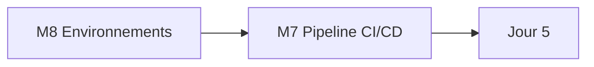
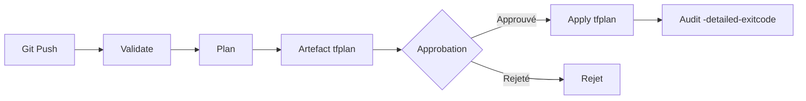

# Jour 4 — Environnements isolés et pipeline Terraform

**Objectif :** Isoler DEV/UAT/PROD par répertoires et exécuter Terraform via un pipeline Azure DevOps.
**Durée :** 6 heures (2 h concepts · 4 h pratique)

> [<- Catalogue](../README.md) · [Jour 3](../day-03/README.md) · **Jour 4** · [Jour 5 ->](../day-05/README.md)

---

## Contexte GlobalBank

> *"Le state vit sur 11 ordinateurs. Si un casse, la plateforme est orpheline. Inacceptable. Lundi, on va en production. Pas d'apply sans review et preuve."*

**Aujourd'hui :** vous séparez l'exécution du stockage. Le state distant est consommé (backend préconfiguré). La pipeline CI/CD valide, planifie, attend l'approbation, puis applique le **même** artefact de plan. DEV, UAT et PROD sont isolés par répertoires.

> Le projet Azure DevOps, l'agent et la connexion de service sont **préconfigurés par le formateur**. Vous n'administrez ni le projet, ni l'agent, ni les service connections. Le lab se concentre sur le pipeline Terraform.

---

## Les 3 axes d'isolation

| Axe | DEV | UAT | PROD |
|---|---|---|---|
| **State** | `tfstate-dev` | `tfstate-uat` | `tfstate-prod` |
| **Nommage** | `*_DEV` | `*_UAT` | `*_PROD` |
| **Identité** | fournie | fournie | fournie |

> **Piège workspace :** `terraform workspace select prod` oublié → apply accidentel en prod.
> **Solution :** les répertoires isolent les trois axes, pas les workspaces.

---

## Progression

> **Pourquoi M8 avant M7 ?** Un pipeline **promeut** un changement à travers des environnements. Sans environnements, il n'y a rien à promouvoir. On construit d'abord la route, ensuite le véhicule.

## Modules

| Module | Durée | Dossier de travail | Lab | Cours | Troubleshooting | Output attendu |
|---|---:|---|---|---|---|---|
| [M8 — Environnements](module-08-environments/lab.md) | 2 h | `labs/m08-environments/` | [lab](module-08-environments/lab.md) | [cours](module-08-environments/course.md) | [guide](module-08-environments/troubleshooting.md) | [output](module-08-environments/expected-output.md) |
| [M7 — CI/CD Pipeline](module-07-cicd-pipeline/lab.md) | 2 h | `labs/m07-cicd-pipeline/` | [lab](module-07-cicd-pipeline/lab.md) | [cours](module-07-cicd-pipeline/course.md) | [guide](module-07-cicd-pipeline/troubleshooting.md) | [output](module-07-cicd-pipeline/expected-output.md) |

## Workflow du jour

1. **Lisez** le `course.md` du module (concepts, 15–20 min)
2. **Réalisez** le `lab.md` pas à pas
3. **Comparez** avec `expected-output.md`
4. **Consultez** `troubleshooting.md` en cas d'erreur
5. **Passez** au module suivant

> Chaque lab est **autonome** : il démarre par `Reset-Lab.ps1` et se termine par un cleanup contrôlé. Les ressources sont nommées par module (ex. `APP01_M07_RAW_DEV`).

---

## Livrable du jour

Environnements isolés (DEV/UAT/PROD) avec states et nommages séparés. Pipeline Azure DevOps limité à Terraform : `fmt` → `validate` → `plan` → artefact → approbation → `apply` du même plan → audit.

---

## Preuves individuelles

- [ ] States et noms distincts entre DEV et PROD
- [ ] Le pipeline s'exécute depuis l'agent (pas en local)
- [ ] Une configuration invalide est bloquée par `validate`
- [ ] Le plan est publié comme artefact avant approbation
- [ ] L'apply exécute le **même** plan que celui approuvé
- [ ] Vous pouvez expliquer la différence entre workspace et répertoire

---

## [CHAOS LAB] — Validation délibérément cassée

> ⚠️ Exercice de rupture contrôlée.

**Objectif :** Vérifier que le pipeline bloque une configuration invalide.

1. Introduisez une erreur de syntaxe dans `main.tf` (ex. accolade manquante)
2. Poussez vers la branche du pipeline
3. Observez : le stage `Validate` échoue et bloque la PR

**Question :** Pourquoi `Validate` tourne-t-il sur les PR sans credentials ?

---

## Anti-sèche Jour 4

### Pipeline CI/CD Terraform

### Les étapes du pipeline

| Étape | Controle | Bloquant ? |
|---|---|---|
| Validate | `fmt -check`, `validate` | ✅ Oui |
| Plan | `plan -out=tfplan` + publication artefact | ✅ Oui |
| Approbation | Revue humaine du plan | ✅ Oui |
| Apply | `apply tfplan` (le plan approuvé) | ✅ Oui |
| Audit | `plan -detailed-exitcode` | ⚠️ Warning |

> 🔒 Le plan immuable garantit que ce qui est approuvé est exactement ce qui est appliqué. `terraform apply tfplan` ne replanifie pas.

### Codes de sortie `plan -detailed-exitcode`

| Code | Signification |
|---:|---|
| 0 | Aucun changement — pas de drift |
| 1 | Erreur |
| 2 | Changements en attente — drift détecté |

---

## Point de convergence (15 min)

- Projection SQL montrant tous les objets
- Trois observations de la journée
- Justification du Jour 5

## Navigation

[<- Catalogue](../README.md) · [Jour 3](../day-03/README.md) · **Jour 4** · [Jour 5 ->](../day-05/README.md)
