# 🎓 Atelier Jour 4 — Industrialiser : environnements isolés et pipeline CI/CD

## *DEV / UAT / PROD, promotion contrôlée, plan immuable et gates d'approbation*

> **Parcours :** Industrialisation d'une Data Platform · **Jour 4 / 5**
> **Modules couverts :** M08 (Multi-environnements) + M07 (Pipeline Azure DevOps)
> **Durée :** 6 heures (2 h de concepts guidés · 4 h de pratique)
> **Prérequis :** Jours 1 à 3 terminés — vous savez écrire, gérer le state et factoriser en modules
> **Alignement certification :** HashiCorp *Terraform Associate (003)* — Objectifs 4, 6, 7, 9 · Microsoft *AZ-400*

---

## 📖 Rappel de la convention de lecture

| Pictogramme | Signification |
|:---:|---|
| 🧠 | **Concept** — théorie, modèle mental, diagramme |
| ❓ | **La question de l'apprenant** |
| 🔬 | **Sous le capot** |
| 📝 | **Action** |
| ✅ | **Checkpoint** |
| ⚠️ | **Piège classique** |
| 🔒 | **Sécurité** |
| 💰 | **Coût (FinOps)** |
| 🎓 | **Point d'examen** |

---

## 🧭 Le fil directeur de la journée

Vous avez un module réutilisable. Il tourne sur **votre** poste, avec **votre** PAT, dans **un seul** environnement. Aujourd'hui, on retire les trois « votre ».

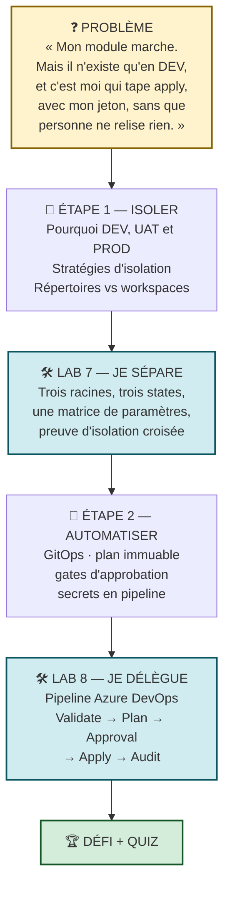

> 🧠 **Pourquoi M08 avant M07 ?** Un pipeline **promeut** un changement à travers des environnements. Sans environnements, il n'y a rien à promouvoir. On construit d'abord la route, ensuite le véhicule.

**La promesse de fin de journée :** plus personne — vous compris — ne tapera `terraform apply` sur la production depuis son poste. Un changement partira d'une *pull request*, sera validé par une machine, relu par un humain, appliqué par un plan figé, puis audité.

---
---

# PARTIE A — 🧠 LES CONCEPTS

*Durée : 2 h*

---

## A.1 — Pourquoi séparer les environnements ?

### A.1.1 Ce qu'un environnement est vraiment

Un environnement n'est pas « la même chose avec un autre nom ». C'est **le même code avec un profil de risque différent**.

| Dimension | DEV | UAT | PROD |
|---|---|---|---|
| **Qui casse ?** | Un développeur | Une équipe de test | 🔴 Les clients |
| **Fréquence de changement** | 20 fois par jour | 2 fois par semaine | 2 fois par mois |
| **Qui approuve ?** | Personne | Un tech lead | Un comité de changement |
| **Rétention des données** | 1 jour | 7 jours | 30 jours |
| **Taille du warehouse** | X-SMALL | X-SMALL | SMALL |
| **Coût toléré** | Minimal | Faible | 💰 Justifié |
| **Retour arrière** | On recrée | On restaure | 🔴 Procédure formelle |

> 🧠 **La conséquence.** Si DEV et PROD partagent quoi que ce soit — un state, un verrou, un jeton, une exécution — alors un incident en DEV **peut** atteindre la PROD. L'isolation n'est pas une préférence esthétique : c'est un **contrôle de risque**.

### A.1.2 Les trois axes d'isolation

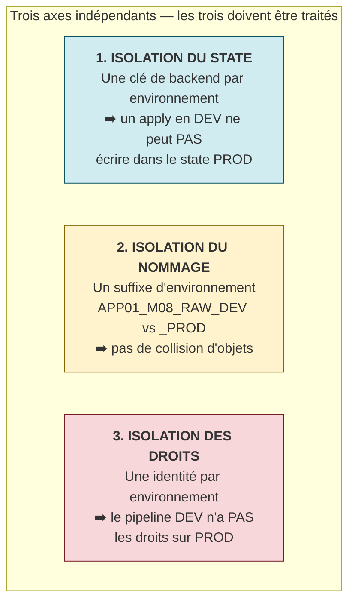

> ⚠️ **Piège classique n°20.** Beaucoup d'équipes traitent l'axe 2 (le nommage) et croient avoir isolé leurs environnements. C'est faux : avec un **state partagé**, un `terraform destroy` mal ciblé détruit tout. L'axe 1 est le seul qui offre une véritable barrière technique.
>
> Dans cette formation, vous traitez les axes **1 et 2** au Lab 7. L'axe 3 (identités distinctes, moindre privilège) relève du **Jour 5**.

### A.1.3 🎓 Répertoires vs workspaces : la question qui tombe à l'examen

Terraform propose deux mécanismes. **Ils ne sont pas équivalents.**

```mermaid
flowchart TB
    subgraph WS["🔀 WORKSPACES — terraform workspace new uat"]
        W1["📁 UN seul dossier de code"]
        W2["🗂️ UN seul backend<br/>clés générées automatiquement :<br/>env:/uat/terraform.tfstate"]
        W3["🔧 Différenciation par<br/>terraform.workspace dans le code"]
        W4["⚠️ Risque : oublier de changer<br/>de workspace avant un apply"]
        W1 --> W2 --> W3 --> W4
    end

    subgraph DIR["📂 RÉPERTOIRES — dev/ uat/ prod/"]
        D1["📁 UN dossier PAR environnement"]
        D2["🗂️ UNE clé de backend explicite<br/>par dossier"]
        D3["🔧 Différenciation par<br/>fichiers .tfvars ou arguments de module"]
        D4["✅ Impossible de se tromper :<br/>le cd EST le choix d'environnement"]
        D1 --> D2 --> D3 --> D4
    end

    style WS fill:#fff3cd,stroke:#856404
    style DIR fill:#d4edda,stroke:#155724,stroke-width:2px
```

| Critère | Workspaces | Répertoires |
|---|---|---|
| Emplacement du state | Même backend, préfixe `env:/` automatique | Backends avec **clés explicites** |
| Code | Un seul dossier | Un dossier par environnement |
| Différenciation | `terraform.workspace` dans le HCL | Fichiers `.tfvars` ou arguments explicites |
| Backend différent par env. ? | ❌ **Impossible** — un seul bloc `backend` | ✅ Oui — chaque dossier a le sien |
| Identité/droits différents ? | ❌ Difficile | ✅ Naturel |
| Risque d'erreur humaine | 🔴 Élevé (`workspace select` oublié) | ✅ Faible |
| Lisibilité en revue de code | Faible (le HCL est truffé de conditions) | ✅ Explicite |
| **Recommandé pour** | Expérimentation, branches éphémères | 🏆 **Production** |

> 🎓 **La position officielle de HashiCorp**, qu'il faut savoir citer : les workspaces conviennent à *« des déploiements multiples d'une même configuration au sein d'un même périmètre de responsabilité, avec les mêmes credentials »*. Ils **ne sont pas** recommandés pour séparer des environnements aux niveaux d'isolation différents — précisément parce qu'ils partagent le backend et les credentials.
>
> **La formulation à retenir :** *« Les workspaces isolent le state, pas les droits ni le backend. Les répertoires isolent les trois. »*

> ⚠️ **Piège classique n°21 — l'accident classique du workspace.**
> ```powershell
> terraform workspace select prod   # ← oublié
> terraform apply -auto-approve     # ← applique en DEV… ou en PROD ?
> ```
> Rien dans votre terminal ne vous rappelle où vous êtes. Avec des répertoires, `pwd` répond à la question. **C'est le meilleur argument pratique de tous.**

### A.1.4 L'anatomie d'une arborescence multi-environnements

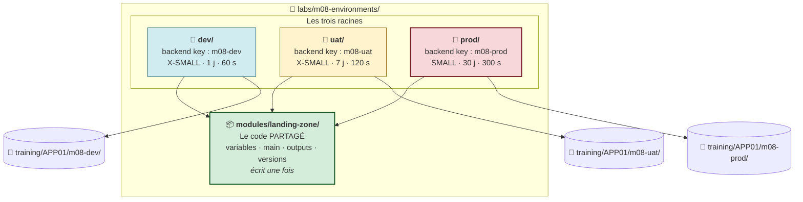

**Ce qui est partagé et ce qui ne l'est pas :**

| Élément | Partagé ? | Pourquoi |
|---|:---:|---|
| `modules/landing-zone/` | ✅ **Oui** | C'est le point du Jour 3 : une seule définition |
| `versions.tf` (le **backend**) | ❌ Non | Chaque environnement a **sa** clé de state |
| `main.tf` (les **arguments** du module) | ❌ Non | Chaque environnement a ses paramètres |
| `provider.tf` | ⚠️ Identique en formation | En production : identités distinctes |
| `variables.tf`, `terraform.tfvars` | ⚠️ Structure identique, valeurs propres | |

> ❓ **« C'est de la duplication ! Vous nous avez dit hier que c'était mal. »**
> Excellente objection, et elle mérite une réponse précise.
>
> **Ce qui est dupliqué ici, c'est le *câblage*, pas la *logique*.** Chaque racine fait une dizaine de lignes : un backend, un provider, un appel de module. Toute la logique métier — les ressources, les validations, le nommage — vit dans le module, écrite **une seule fois**.
>
> Cette duplication est **volontaire et souhaitable** : elle rend chaque environnement **explicitement lisible**. Un auditeur ouvre `prod/main.tf` et voit en dix lignes exactement ce qui est déployé en production. C'est le prix — très raisonnable — de l'auditabilité.
>
> 🔬 **La règle de conception :** *« Factorisez la logique, dupliquez le câblage. »*

### A.1.5 La matrice de paramétrage

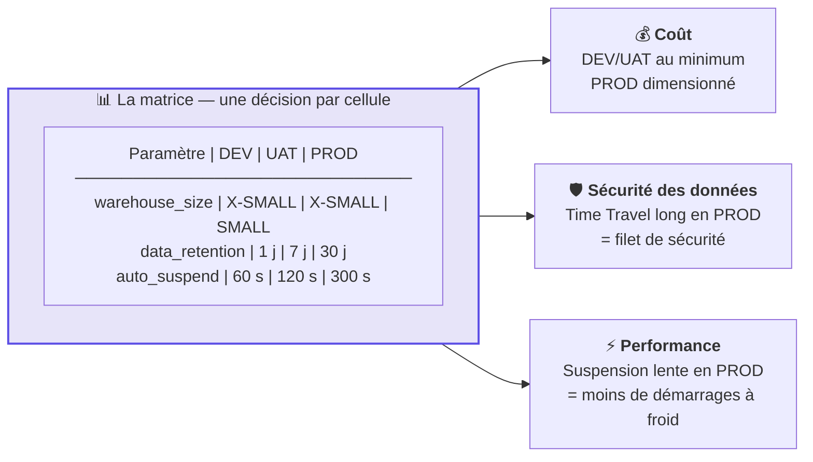

> 🧠 **Chaque cellule de cette matrice est une décision d'ingénierie**, justifiable devant un architecte :
> - **`data_retention` 1 j en DEV / 30 j en PROD** : le Time Travel Snowflake facture le **stockage historique**. En DEV, on ne restaure jamais. En PROD, 30 jours sont votre filet contre un `DELETE` accidentel ;
> - **`auto_suspend` 60 s en DEV / 300 s en PROD** : suspendre vite économise des crédits, mais chaque redémarrage coûte une latence. En PROD, les requêtes s'enchaînent : suspendre toutes les minute ferait redémarrer sans cesse ;
> - **`warehouse_size` X-SMALL / SMALL** : un SMALL coûte **le double** d'un X-SMALL par seconde. On ne le paie qu'où la charge le justifie.
>
> **Le tableau lui-même est le livrable.** Il documente vos arbitrages FinOps mieux qu'un long texte.

### A.1.6 La promotion entre environnements

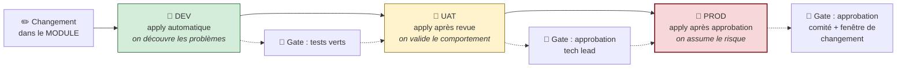

> 🧠 **Le même artefact traverse les trois environnements.** C'est le principe de la promotion : on ne réécrit pas le code entre DEV et PROD, on **fait avancer le même code** à travers des portes de plus en plus exigeantes. Ce qui change d'un environnement à l'autre, ce sont uniquement les **paramètres** — jamais la logique.
>
> C'est exactement ce que votre module rend possible. Sans lui, « le code de PROD » et « le code de DEV » divergeraient en quelques semaines.

---

## A.2 — Le pipeline CI/CD : pourquoi retirer l'`apply` de votre poste

### A.2.1 Les quatre problèmes du déploiement manuel

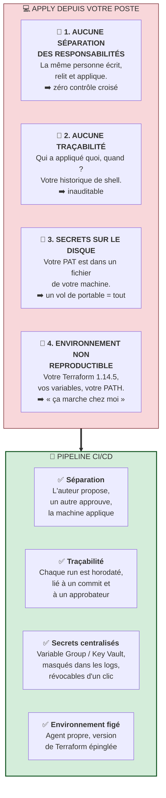

> 🧠 **La phrase à retenir pour un entretien :** *« Le pipeline n'automatise pas seulement le déploiement — il rend le déploiement **auditable**. »* La valeur n'est pas la vitesse : c'est la preuve.

### A.2.2 GitOps : Git comme source unique de vérité

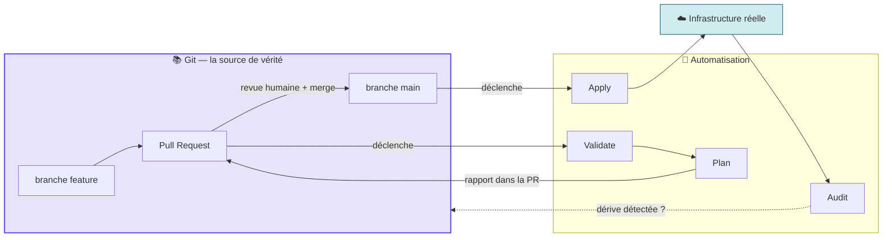

**Les quatre principes du GitOps appliqués à Terraform :**

| Principe | Traduction concrète |
|---|---|
| **Déclaratif** | L'état désiré est décrit en HCL, pas en scripts |
| **Versionné et immuable** | Chaque état désiré est un commit Git, avec un auteur et une date |
| **Tiré automatiquement** | Un merge sur `main` déclenche l'application, sans geste manuel |
| **Réconcilié en continu** | Un job d'audit détecte les dérives et alerte |

> 🧠 **La conséquence pratique.** Après le Jour 4, la question *« pourquoi le warehouse de PROD est-il en SMALL ? »* a une réponse : **la pull request qui l'a changé**, avec son auteur, sa date, sa description et son approbateur. C'est ce que le ClickOps ne pourra jamais offrir.

### A.2.3 L'anatomie d'un pipeline Terraform

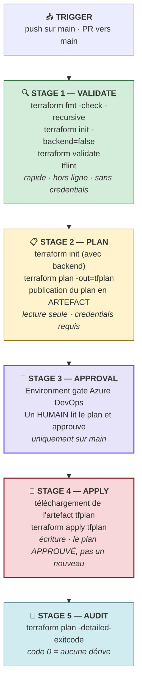

| Stage | Déclenché sur | Coût | Peut-il échouer ? |
|---|---|---|---|
| `Validate` | PR **et** `main` | Quelques secondes | ✅ **Doit** bloquer la PR |
| `Plan` | PR **et** `main` | ~1 min, appels API en lecture | ✅ Bloque la PR |
| `Approval` | `main` seulement | Temps humain | ⏸️ Attend |
| `Apply` | `main` seulement | Écriture réelle | 🔴 Incident si échec |
| `Audit` | `main` seulement | Lecture | ⚠️ Alerte, ne bloque pas |

> 🧠 **Pourquoi `Validate` tourne sur les PR mais pas `Apply`.** Le principe du *shift-left* : plus une erreur est détectée tôt, moins elle coûte. `Validate` ne demande **aucun credential** (`init -backend=false`) — il peut donc tourner sur n'importe quelle branche, y compris venant d'un contributeur externe, sans aucun risque.

### A.2.4 🎓 Le plan immuable : le concept le plus important du Lab 8

C'est le mécanisme qui garantit que **ce qui a été approuvé est exactement ce qui est appliqué**.

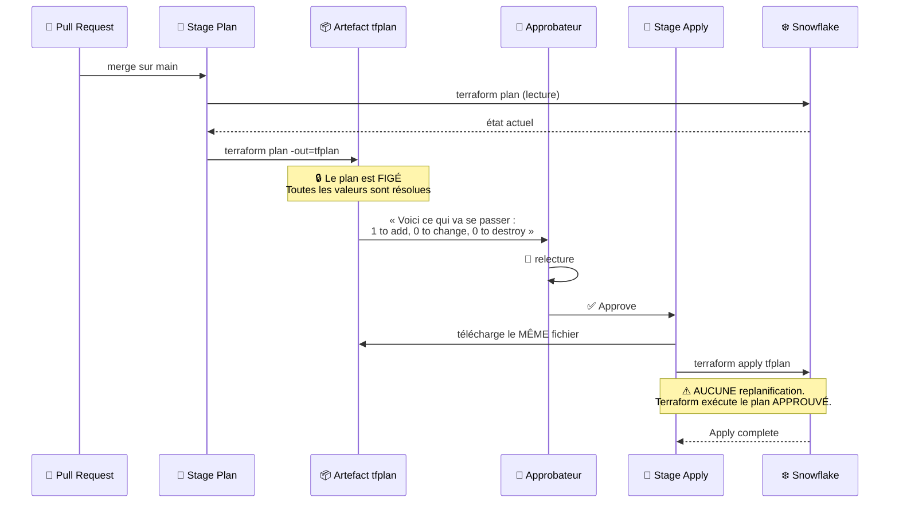

> 🔒 **Ce que le plan immuable empêche.** Sans lui, `terraform apply` **replanifie** au moment de l'exécution. Entre l'approbation et l'application, quelqu'un peut avoir modifié l'infrastructure : l'humain aurait approuvé un plan A et la machine exécuterait un plan B. Le plan figé rend cet écart impossible.
>
> 🔬 **Le détail qui compte :** si l'infrastructure a changé depuis la génération du plan, `terraform apply tfplan` **échoue** au lieu d'appliquer autre chose (*« Saved plan is stale »*). C'est le comportement souhaité : mieux vaut échouer et replanifier que d'appliquer une intention obsolète.

> 🎓 **Point d'examen.** Un fichier de plan (`-out=tfplan`) contient **toutes les valeurs résolues**, y compris les valeurs sensibles, en clair. Il **ne doit jamais** être commité ni exposé publiquement. Dans Azure DevOps, il transite comme *pipeline artifact*, dont l'accès suit les permissions du projet.

### A.2.5 `-detailed-exitcode` : l'audit de dérive automatisé

```powershell
terraform plan -detailed-exitcode
```

| Code de sortie | Signification | Réaction du pipeline |
|:---:|---|---|
| **0** | Aucun changement — l'infra correspond au code | ✅ Rien à faire |
| **1** | Erreur (authentification, syntaxe, réseau…) | 🔴 Échec du job |
| **2** | Des changements sont en attente — **dérive détectée** | ⚠️ Alerter, sans échouer |

> 🧠 **C'est ainsi qu'on programme une détection de dérive nocturne.** Un job planifié à 3 h du matin lance `terraform plan -detailed-exitcode` sur chaque environnement. Un code 2 déclenche une notification : *« quelqu'un a modifié la production hors processus »*. C'est la version industrialisée de ce que vous avez pratiqué au Jour 2 avec `-refresh-only`.
>
> 🎓 Retenez ces trois codes : ils tombent régulièrement à l'examen.

### A.2.6 🔒 Les secrets dans un pipeline

C'est le sujet où les erreurs coûtent le plus cher.

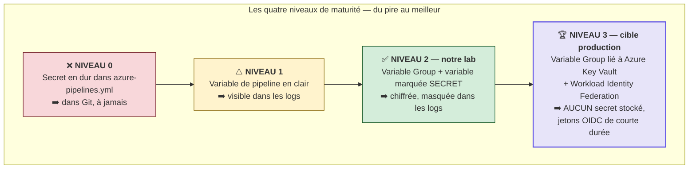

**Comment un secret atteint Terraform dans un pipeline :**

```yaml
- script: terraform plan -out=tfplan
  env:
    TF_VAR_snowflake_token: $(SNOWFLAKE_PAT)     # ← variable secrète
    ARM_SUBSCRIPTION_ID: $(ARM_SUBSCRIPTION_ID)
    ARM_TENANT_ID: $(ARM_TENANT_ID)
```

| Mécanisme | Rôle |
|---|---|
| `TF_VAR_<nom>` | Alimente une **variable Terraform** par l'environnement (rang 6 de la précédence — Jour 1) |
| `ARM_*` | Lu directement par le **backend `azurerm`** et le provider Azure |
| `env:` du step | 🔒 Injecte le secret **uniquement** dans ce step, pas dans tout le job |
| Marquage « secret » | Azure DevOps remplace la valeur par `***` dans les logs |

> ⚠️ **Piège classique n°22.** Une variable marquée secrète n'est **pas** exposée automatiquement comme variable d'environnement — c'est délibéré. Il faut la mapper explicitement avec `env:`. Beaucoup de pipelines échouent avec `token is empty` pour cette seule raison.

> 🔒 **Le masquage a des limites.** Azure DevOps masque les **correspondances exactes** de la valeur dans les logs. Un secret transformé (encodé en base64, découpé, réaffiché caractère par caractère) **n'est plus masqué**. Ne faites jamais `echo $(SNOWFLAKE_PAT)`, même « pour déboguer ». Et n'activez jamais `TF_LOG=DEBUG` dans un pipeline de production : les logs de niveau debug contiennent les en-têtes d'authentification.

> 🏆 **Le niveau 3, vers lequel tend cette formation.** Avec la **Workload Identity Federation**, Azure DevOps présente un jeton OIDC de courte durée à Azure AD, qui délivre un accès temporaire. **Aucun secret n'est stocké nulle part** — il n'y a plus rien à voler ni à faire tourner. C'est l'objectif du Jour 5, où le PAT Snowflake sera lui aussi remplacé par une identité JWT avec clé dans Key Vault.

### A.2.7 Les gates d'approbation

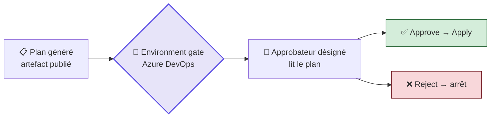

**Un gate d'approbation dans Azure DevOps repose sur un objet `Environment`** — c'est lui qui porte la liste des approbateurs, et non le fichier YAML :

```yaml
- stage: Approval
  jobs:
    - deployment: Approval
      environment: Approval      # ← l'objet Environment porte les approbateurs
      strategy:
        runOnce:
          deploy:
            steps:
              - script: echo "Waiting for manual approval"
```

| Type de contrôle | Ce qu'il vérifie |
|---|---|
| **Approvals** | Une ou plusieurs personnes désignées valident manuellement |
| **Business hours** | Le déploiement n'est autorisé que dans une fenêtre horaire |
| **Invoke REST API** | Un système externe (ITSM, ServiceNow) donne son feu vert |
| **Exclusive lock** | Un seul déploiement à la fois sur cet environnement |
| **Required template** | Le pipeline doit provenir d'un template approuvé |

> 🧠 **Le gate matérialise la séparation des responsabilités.** Dans une organisation soumise à un audit (SOX, ISO 27001, DORA), *« l'auteur d'un changement ne peut pas être celui qui l'approuve »* est une exigence formelle. L'`Environment` d'Azure DevOps est l'endroit où cette règle devient technique plutôt que déclarative.

> 🎓 **Point d'examen (AZ-400).** Un `Environment` Azure DevOps est **le seul** endroit où l'on définit des *approvals and checks*. Un `stage` ordinaire ne peut pas porter d'approbation : il faut un job de type `deployment` ciblant un `environment`.

### A.2.8 La qualité de code : `fmt`, `validate`, `tflint`

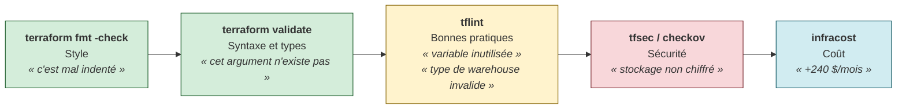

| Outil | Ce qu'il attrape | Dans le lab |
|---|---|---|
| `terraform fmt -check` | Formatage non canonique | ✅ Stage Validate |
| `terraform validate` | Syntaxe, types, références | ✅ Stage Validate |
| `tflint` | Variables inutilisées, valeurs d'attributs invalides, conventions | ✅ Stage Validate |
| `tfsec` / `checkov` | Anti-patterns de sécurité | 📅 Jour 5 |
| `infracost` | Estimation du coût d'un plan | 📅 Jour 5 |
| OPA / Sentinel | Policy as code organisationnelle | 📅 Jour 5 |

> 🧠 **Pourquoi `fmt -check` et non `fmt` en CI ?** `terraform fmt` **modifie** les fichiers. En CI, un agent qui modifie le code sans le commiter crée une divergence silencieuse. `-check` se contente d'**échouer** si le formatage n'est pas canonique — c'est au développeur de lancer `terraform fmt` sur son poste. Même logique que `prettier --check` ou `black --check`.

---

## A.3 — Récapitulatif visuel de la Partie A

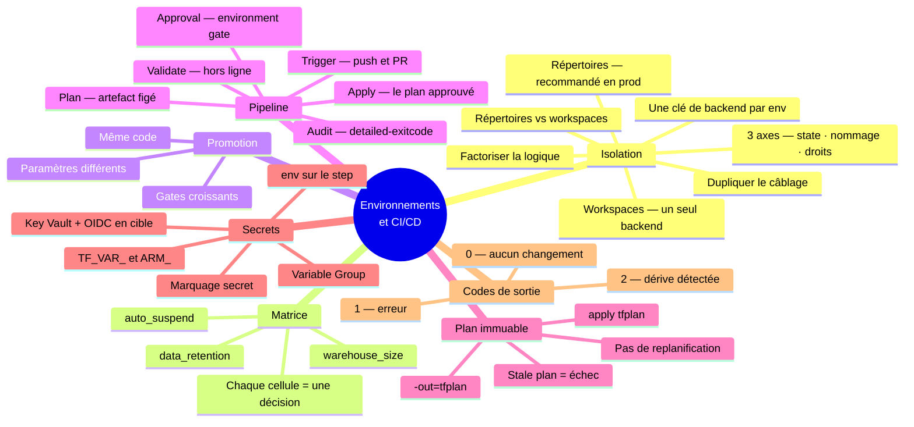

**Auto-évaluation avant la pratique :**

1. Citez les trois axes d'isolation d'un environnement.
2. Pourquoi les workspaces ne conviennent-ils pas pour séparer DEV et PROD ?
3. Que garantit exactement un plan enregistré avec `-out=tfplan` ?
4. Que signifie le code de sortie 2 de `terraform plan -detailed-exitcode` ?
5. Pourquoi utilise-t-on `fmt -check` et non `fmt` dans un pipeline ?

*(Réponses en Partie D.)*

---
---
# PARTIE B — 🛠️ LABORATOIRE 7

## *DEV, UAT et PROD : trois racines, trois states, une seule définition*

> **Module source :** M08 — `labs/m08-environments/` · **Durée : 2 h** · Piste `[CORE]`

| Élément | Valeur |
|---|---|
| **Dossiers de travail** | `labs/m08-environments/{dev,uat,prod}/` |
| **Code partagé** | `labs/m08-environments/modules/landing-zone/` |
| **Coût** | 💰 X-SMALL en DEV/UAT, **SMALL en PROD** — tous suspendus |
| **Cleanup** | `terraform destroy` dans chaque environnement |
| **Ressources créées** | 9 (3 environnements × 3) |

---

## B.0 — Mission métier

> **En tant que :** Data Platform Engineer
> **Je veux :** déployer un module Terraform dans DEV, UAT et PROD avec isolation de state
> **Afin de :** garantir qu'aucune modification d'un environnement n'impacte les autres

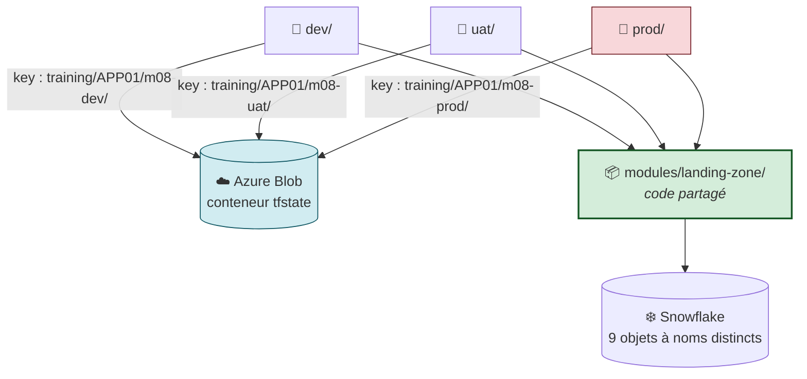

**Objectifs vérifiables :**

- ✅ créer un module `landing-zone` réutilisable ;
- ✅ déployer le module dans DEV, UAT et PROD ;
- ✅ isoler le state par environnement avec des **clés distinctes** ;
- ✅ définir et justifier une **matrice de paramètres** ;
- ✅ **prouver** l'isolation croisée entre environnements ;
- ✅ comprendre la différence entre workspaces et répertoires.

---

## B.1 — 🚦 Pre-flight

<details open>
<summary>🪟 <b>Windows (PowerShell)</b></summary>

```powershell
cd "$HOME\Data2AI-Labs\data-platform"
.\scripts\Learner-Login.ps1 -LearnerPrefix APP01
.\scripts\Reset-Lab.ps1 -LearnerPrefix APP01 -Lab M08
cd labs\m08-environments
..\..\scripts\Test-TerraformReady.ps1
```
</details>

<details>
<summary>🐧 <b>Linux/macOS (Bash)</b></summary>

```bash
cd "$HOME/Data2AI-Labs/data-platform"
source ./scripts/learner-login.sh APP01
./scripts/reset-lab.sh APP01 M08
cd labs/m08-environments
../../scripts/test-terraform-ready.sh
```
</details>

✅ **Checkpoint 0 :** `READY`.

**Prérequis supplémentaires du Jour 2 :** le Storage Account et le conteneur `tfstate` existent déjà (créés au Lab 3). Vérifiez :

```powershell
az storage container list `
    --account-name $env:ARM_STORAGE_ACCOUNT `
    --auth-mode login `
    --query "[].name" -o tsv
```

---

## B.2 — Étape 1 : le squelette

### 📝 Action 1.1 — Créer l'arborescence

<details open>
<summary>🪟 <b>Windows (PowerShell)</b></summary>

```powershell
New-Item -ItemType Directory -Force -Path "modules\landing-zone" | Out-Null
New-Item -ItemType Directory -Force -Path "dev", "uat", "prod" | Out-Null
Get-ChildItem -Directory
```
</details>

<details>
<summary>🐧 <b>Linux/macOS (Bash)</b></summary>

```bash
mkdir -p modules/landing-zone dev uat prod
ls -d */
```
</details>

✅ **Checkpoint 1 :**

```text
dev/
modules/
prod/
uat/
```

> 🧠 **Regardez cette arborescence.** Elle **est** l'architecture. `modules/` porte la logique, écrite une fois. `dev/`, `uat/`, `prod/` portent le câblage, dupliqué volontairement. Un auditeur qui ouvre `prod/` voit en dix lignes ce qui tourne en production.

---

## B.3 — Étape 2 : le module partagé

### 📝 Action 2.1 — `modules/landing-zone/variables.tf`

```hcl
variable "learner_prefix" {
  type        = string
  description = "Unique uppercase prefix assigned to the learner"

  validation {
    condition     = can(regex("^[A-Z][A-Z0-9]{2,9}$", var.learner_prefix))
    error_message = "learner_prefix must contain 3-10 uppercase letters or digits."
  }
}

variable "environment" {
  type        = string
  description = "Deployment environment"

  validation {
    condition     = contains(["DEV", "UAT", "PROD"], var.environment)
    error_message = "environment must be DEV, UAT or PROD."
  }
}

variable "warehouse_size" {
  type        = string
  description = "Warehouse size"
  default     = "X-SMALL"

  validation {
    condition     = contains(["X-SMALL", "SMALL", "MEDIUM"], var.warehouse_size)
    error_message = "warehouse_size must be X-SMALL, SMALL or MEDIUM."
  }
}

variable "data_retention_days" {
  type        = number
  description = "Time travel retention in days"
  default     = 1

  validation {
    condition     = var.data_retention_days >= 0 && var.data_retention_days <= 90
    error_message = "data_retention_days must be between 0 and 90."
  }
}

variable "auto_suspend_seconds" {
  type        = number
  description = "Warehouse auto-suspend in seconds"
  default     = 60

  validation {
    condition     = var.auto_suspend_seconds >= 60 && var.auto_suspend_seconds <= 3600
    error_message = "auto_suspend_seconds must be between 60 and 3600."
  }
}
```

> 🧠 **Notez la différence avec le module du Jour 3 : `environment` n'a PAS de `default`.**
>
> C'est un **choix de conception délibéré**. Une variable sans `default` est **obligatoire** : chaque racine **doit** déclarer explicitement son environnement. Impossible de déployer en PROD par accident parce qu'on aurait oublié de préciser l'environnement et hérité d'un `default = "DEV"`.
>
> 🔬 **La règle générale :** *un paramètre dont l'oubli serait dangereux ne doit jamais avoir de valeur par défaut.* La friction est ici une fonctionnalité.

### 📝 Action 2.2 — `modules/landing-zone/main.tf`

```hcl
locals {
  database_name  = "${var.learner_prefix}_M08_RAW_${var.environment}"
  schema_name    = "INGESTION"
  warehouse_name = "WH_${var.learner_prefix}_M08_ETL_${var.environment}"
  common_comment = "Managed by Terraform | Landing Zone | ${var.learner_prefix} | ${var.environment}"
}

resource "snowflake_database" "raw" {
  name                        = local.database_name
  comment                     = local.common_comment
  data_retention_time_in_days = var.data_retention_days
}

resource "snowflake_schema" "ingestion" {
  database = snowflake_database.raw.name
  name     = local.schema_name
  comment  = local.common_comment
}

resource "snowflake_warehouse" "etl" {
  name                = local.warehouse_name
  comment             = local.common_comment
  warehouse_size      = var.warehouse_size
  auto_suspend        = var.auto_suspend_seconds
  auto_resume         = true
  initially_suspended = true
}
```

> 🧠 **`${var.environment}` apparaît dans le nom de la database ET du warehouse.** C'est **l'axe 2 de l'isolation** (le nommage). Sans lui, les trois environnements se disputeraient les mêmes objets Snowflake et le second `apply` échouerait avec `Object already exists`.

### 📝 Action 2.3 — `modules/landing-zone/outputs.tf`

```hcl
output "database_name" {
  value       = snowflake_database.raw.name
  description = "RAW database name"
}

output "schema_name" {
  value       = snowflake_schema.ingestion.name
  description = "Ingestion schema name"
}

output "warehouse_name" {
  value       = snowflake_warehouse.etl.name
  description = "ETL warehouse name"
}
```

### 📝 Action 2.4 — `modules/landing-zone/versions.tf`

```hcl
terraform {
  required_version = ">= 1.14.0, < 2.0.0"

  required_providers {
    snowflake = {
      source  = "snowflakedb/snowflake"
      version = "= 2.14.0"
    }
  }
}
```

### 📝 Action 2.5 — Valider le module isolément

```powershell
cd modules\landing-zone
terraform init
terraform fmt
terraform validate
cd ..\..
```

✅ **Checkpoint 2 :** `Success! The configuration is valid.`

---

## B.4 — Étape 3 : la racine DEV

> 🧠 **Vous allez écrire six fichiers.** Prenez le temps : les racines UAT et PROD en seront des copies avec **trois** différences seulement. Comprendre DEV, c'est comprendre les trois.

### 📝 Action 3.1 — `dev/versions.tf` — LE fichier qui isole

```powershell
cd dev
```

```hcl
terraform {
  required_version = "= 1.14.5"

  required_providers {
    snowflake = {
      source  = "snowflakedb/snowflake"
      version = "= 2.14.0"
    }
  }

  backend "azurerm" {
    resource_group_name  = "rg-data2ai-tf-state"
    storage_account_name = "sadata2aitfstatemsn"
    container_name       = "tfstate"
    key                  = "training/APP01/m08-dev/terraform.tfstate"
    use_azuread_auth     = true
  }
}
```

**Remplacez `APP01` par votre préfixe.** Adaptez `resource_group_name` et `storage_account_name` à votre `.env`.

> 🔑 **La ligne `key` est LA ligne de ce lab.**
>
> ```text
>   key = "training/APP01/m08-dev/terraform.tfstate"
>                      │      │
>                      │      └── L'ENVIRONNEMENT ← la seule chose qui change
>                      └───────── votre préfixe apprenant
> ```
>
> Elle réalise **l'axe 1 de l'isolation**. Trois clés = trois blobs = trois states = trois verrous indépendants. Un `terraform destroy` lancé dans `dev/` ne peut **techniquement pas** toucher le state PROD : il ne sait même pas qu'il existe.

> 🎓 **Rappel du Jour 2.** Le bloc `backend` n'accepte **aucune variable**. C'est précisément pourquoi on duplique ce fichier au lieu de le paramétrer. La seule alternative est le *backend partiel* + `-backend-config="dev.hcl"` — équivalent en isolation, mais moins lisible pour un auditeur.

### 📝 Action 3.2 — `dev/provider.tf`

```hcl
locals {
  # Depuis labs/m08-environments/dev/, ../../../ = racine du projet
  pat_file        = "${path.module}/../../../secrets/snowflake_pat.txt"
  snowflake_token = try(trim(file(local.pat_file), "\n\r"), var.snowflake_token, "")
}

provider "snowflake" {
  organization_name = var.snowflake_organization
  account_name      = var.snowflake_account
  user              = var.snowflake_user
  authenticator     = "PROGRAMMATIC_ACCESS_TOKEN"
  token             = local.snowflake_token
}
```

> ⚠️ **Piège classique n°23 — le chemin relatif.** Comptez les niveaux :
>
> ```text
>   labs/m08-environments/dev/     ← vous êtes ici
>        ▲              ▲    ▲
>        │              │    └── ../     = labs/m08-environments/
>        │              └─────── ../../  = labs/
>        └────────────────────── ../../../ = racine du projet ✅
> ```
>
> Aux Jours 1 à 3, les labs étaient à `labs/mXX/`, soit `../../secrets/`. Ici vous êtes **un niveau plus profond** : `../../../secrets/`. Une erreur ici produit `token is empty` ou une demande interactive de `var.snowflake_token`.

> 🔒 **En production réelle, ce fichier différerait entre environnements** : un utilisateur de service par environnement, avec des rôles Snowflake distincts. C'est **l'axe 3 de l'isolation**, traité au Jour 5.

### 📝 Action 3.3 — `dev/variables.tf`

```hcl
variable "snowflake_organization" {
  type        = string
  description = "Snowflake organization name (from .env)"
}

variable "snowflake_account" {
  type        = string
  description = "Snowflake account name (from .env)"
}

variable "snowflake_user" {
  type        = string
  description = "Snowflake user name (from .env)"
}

variable "snowflake_token" {
  type        = string
  description = "Snowflake PAT (passed via TF_VAR_snowflake_token)"
  sensitive   = true
  default     = ""
}

variable "learner_prefix" {
  type        = string
  description = "Unique uppercase prefix assigned to the learner"

  validation {
    condition     = can(regex("^[A-Z][A-Z0-9]{2,9}$", var.learner_prefix))
    error_message = "learner_prefix must contain 3-10 uppercase letters or digits."
  }
}
```

> 🧠 **Ce fichier est identique dans les trois racines.** Il ne contient **pas** `environment`, `warehouse_size`, `data_retention_days` ni `auto_suspend_seconds` : ces valeurs ne sont pas des *paramètres* de la racine, ce sont des **décisions figées** de l'environnement, écrites en dur dans `main.tf`.
>
> 🔬 **Pourquoi ce choix ?** Parce qu'on ne veut **pas** pouvoir lancer `terraform apply -var "warehouse_size=4X-LARGE"` en production. Une valeur figée dans le code, versionnée dans Git, passe par une pull request. Une variable surchargeable ne passe par rien.

### 📝 Action 3.4 — `dev/main.tf` — les paramètres DEV

```hcl
module "landing_zone" {
  source               = "../modules/landing-zone"
  learner_prefix       = var.learner_prefix
  environment          = "DEV"
  warehouse_size       = "X-SMALL"
  data_retention_days  = 1
  auto_suspend_seconds = 60
}
```

> 🧠 **Dix lignes. C'est toute la définition de l'environnement DEV.** Lisible d'un coup d'œil, versionnée, auditable. Comparez avec ce que serait un fichier de 200 lignes truffé de `terraform.workspace == "dev" ? … : …`.

> ⚠️ Notez `source = "../modules/landing-zone"` — un seul `../`, car `dev/` est frère de `modules/`.

### 📝 Action 3.5 — `dev/outputs.tf`

```hcl
output "database_name" {
  value       = module.landing_zone.database_name
  description = "RAW database for this environment"
}

output "warehouse_name" {
  value       = module.landing_zone.warehouse_name
  description = "ETL warehouse for this environment"
}
```

### 📝 Action 3.6 — `dev/terraform.tfvars`

```hcl
snowflake_organization = "ZVFXOZW"
snowflake_account      = "PM71247"
snowflake_user         = "DATA2AI"
learner_prefix         = "APP01"
```

**Remplacez `APP01` par votre préfixe.**

### 📝 Action 3.7 — Déployer DEV

```powershell
terraform fmt
terraform init
terraform validate
terraform plan -out "m08-dev.tfplan"
```

✅ **Checkpoint 3 :** `Plan: 3 to add, 0 to change, 0 to destroy.`

> 🔬 **Observez la sortie de `terraform init`** — deux lignes nouvelles par rapport aux labs précédents :
> ```text
> Initializing the backend...
> Successfully configured the backend "azurerm"!
> Initializing modules...
> - landing_zone in ../modules/landing-zone
> ```
> Backend distant **et** module : les deux compétences des Jours 2 et 3 se combinent ici.

```powershell
terraform apply "m08-dev.tfplan"
terraform output
```

✅ **Checkpoint 4 :** `Apply complete! Resources: 3 added.`

**Vérification Snowflake :**

```powershell
snow sql -c training -q "SHOW DATABASES LIKE 'APP01_M08_RAW_DEV'"
```

---

## B.5 — Étape 4 : la racine UAT

> 🧠 **Trois différences avec DEV. Repérez-les avant de taper.**

### 📝 Action 4.1 — Copier la structure

<details open>
<summary>🪟 <b>Windows (PowerShell)</b></summary>

```powershell
cd ..\uat
Copy-Item ..\dev\provider.tf, ..\dev\variables.tf, ..\dev\outputs.tf, ..\dev\terraform.tfvars .
```
</details>

<details>
<summary>🐧 <b>Linux/macOS (Bash)</b></summary>

```bash
cd ../uat
cp ../dev/provider.tf ../dev/variables.tf ../dev/outputs.tf ../dev/terraform.tfvars .
```
</details>

> ⚠️ **Ne copiez PAS `versions.tf` ni `main.tf`.** Ce sont exactement les deux fichiers qui doivent différer. Une copie de `versions.tf` non modifiée écraserait le state DEV — l'erreur la plus coûteuse de ce lab.

### 📝 Action 4.2 — `uat/versions.tf` — différence n°1 : la clé de state

```hcl
terraform {
  required_version = "= 1.14.5"

  required_providers {
    snowflake = {
      source  = "snowflakedb/snowflake"
      version = "= 2.14.0"
    }
  }

  backend "azurerm" {
    resource_group_name  = "rg-data2ai-tf-state"
    storage_account_name = "sadata2aitfstatemsn"
    container_name       = "tfstate"
    key                  = "training/APP01/m08-uat/terraform.tfstate"
    use_azuread_auth     = true
  }
}
```

> 🔑 `m08-dev` → **`m08-uat`**. C'est la seule modification de ce fichier, et c'est celle qui garantit l'isolation.

### 📝 Action 4.3 — `uat/main.tf` — différences n°2 et 3 : les paramètres

```hcl
module "landing_zone" {
  source               = "../modules/landing-zone"
  learner_prefix       = var.learner_prefix
  environment          = "UAT"
  warehouse_size       = "X-SMALL"
  data_retention_days  = 7
  auto_suspend_seconds = 120
}
```

| Paramètre | DEV | UAT | Justification |
|---|---|---|---|
| `environment` | `DEV` | **`UAT`** | Isolation du nommage |
| `data_retention_days` | 1 | **7** | 💰 Une semaine de Time Travel : on peut restaurer après un test destructif du vendredi |
| `auto_suspend_seconds` | 60 | **120** | ⚡ Les campagnes de test enchaînent les requêtes : suspendre moins vite évite des démarrages à froid |
| `warehouse_size` | X-SMALL | X-SMALL | 💰 Inchangé : la charge de test ne le justifie pas |

### 📝 Action 4.4 — Déployer UAT

```powershell
terraform fmt
terraform init
terraform validate
terraform plan -out "m08-uat.tfplan"
terraform apply "m08-uat.tfplan"
```

✅ **Checkpoint 5 :** `Apply complete! Resources: 3 added.`

```powershell
snow sql -c training -q "SHOW DATABASES LIKE 'APP01_M08_RAW_UAT'"
```

---

## B.6 — Étape 5 : la racine PROD

> 🔴 **Ralentissez.** Même en formation, prenez l'habitude de traiter `prod/` avec une attention particulière. C'est un réflexe professionnel qui se construit ici.

### 📝 Action 5.1 — Copier la structure

<details open>
<summary>🪟 <b>Windows (PowerShell)</b></summary>

```powershell
cd ..\prod
Copy-Item ..\dev\provider.tf, ..\dev\variables.tf, ..\dev\outputs.tf, ..\dev\terraform.tfvars .
```
</details>

<details>
<summary>🐧 <b>Linux/macOS (Bash)</b></summary>

```bash
cd ../prod
cp ../dev/provider.tf ../dev/variables.tf ../dev/outputs.tf ../dev/terraform.tfvars .
```
</details>

### 📝 Action 5.2 — `prod/versions.tf`

```hcl
terraform {
  required_version = "= 1.14.5"

  required_providers {
    snowflake = {
      source  = "snowflakedb/snowflake"
      version = "= 2.14.0"
    }
  }

  backend "azurerm" {
    resource_group_name  = "rg-data2ai-tf-state"
    storage_account_name = "sadata2aitfstatemsn"
    container_name       = "tfstate"
    key                  = "training/APP01/m08-prod/terraform.tfstate"
    use_azuread_auth     = true
  }
}
```

### 📝 Action 5.3 — `prod/main.tf`

```hcl
module "landing_zone" {
  source               = "../modules/landing-zone"
  learner_prefix       = var.learner_prefix
  environment          = "PROD"
  warehouse_size       = "SMALL"
  data_retention_days  = 30
  auto_suspend_seconds = 300
}
```

> 💰 **`warehouse_size = "SMALL"` : la seule ligne facturée deux fois plus cher de tout le parcours.**
>
> Un warehouse SMALL consomme **2 crédits/heure** contre 1 pour un X-SMALL. Combiné à `auto_suspend = 300` (5 minutes au lieu de 1), le coût potentiel est notablement supérieur.
>
> **C'est volontaire et justifié :** en production, la latence d'un démarrage à froid dégrade l'expérience utilisateur, et la charge réelle justifie la capacité. **Chaque euro dépensé doit répondre à une question métier.** Ici, la réponse est : *« la production sert des utilisateurs, DEV sert un développeur. »*
>
> ⚠️ **En formation :** `initially_suspended = true` (hérité du module) garantit que ce warehouse **naît endormi**. Le coût réel de ce lab reste inférieur à 0,01 $. Mais prenez conscience de ce que cette ligne signifierait sur un vrai compte.

### 📝 Action 5.4 — Déployer PROD

```powershell
terraform fmt
terraform init
terraform validate
terraform plan -out "m08-prod.tfplan"
```

> 🛑 **Rituel professionnel — avant tout apply en production, trois questions :**
> 1. Le plan affiche-t-il bien `3 to add, 0 to change, 0 to destroy` ?
> 2. Les noms contiennent-ils bien `_PROD` et **mon** préfixe ?
> 3. La `key` du backend contient-elle bien `m08-prod` ?

```powershell
terraform apply "m08-prod.tfplan"
```

✅ **Checkpoint 6 :** `Apply complete! Resources: 3 added.`

```powershell
snow sql -c training -q "SHOW DATABASES LIKE 'APP01_M08_RAW_PROD'"
snow sql -c training -q "SHOW WAREHOUSES LIKE 'WH_APP01_M08_ETL_PROD'"
```

---

## B.7 — Étape 6 : la matrice et les preuves d'isolation

### 📝 Action 6.1 — La matrice de paramétrage

| Paramètre | DEV | UAT | PROD |
|---|---|---|---|
| Warehouse size | X-SMALL | X-SMALL | **SMALL** |
| Data retention | 1 jour | 7 jours | **30 jours** |
| Auto-suspend | 60 s | 120 s | **300 s** |
| State key | `training/APP01/m08-dev/…` | `training/APP01/m08-uat/…` | `training/APP01/m08-prod/…` |
| Database | `APP01_M08_RAW_DEV` | `APP01_M08_RAW_UAT` | `APP01_M08_RAW_PROD` |
| Warehouse | `WH_APP01_M08_ETL_DEV` | `WH_APP01_M08_ETL_UAT` | `WH_APP01_M08_ETL_PROD` |

> 🧠 **Ce tableau est un livrable en soi.** Dans un dossier d'architecture, il documente vos arbitrages FinOps et de résilience mieux qu'une page de prose. Placez-le dans le `README.md` du dossier `m08-environments/`.

### 📝 Action 6.2 — Preuve 1 : trois blobs distincts

<details open>
<summary>🪟 <b>Windows (PowerShell)</b></summary>

```powershell
az storage blob list `
    --account-name $env:ARM_STORAGE_ACCOUNT `
    --container-name $env:ARM_CONTAINER `
    --auth-mode login `
    --query "[?contains(name, 'm08')].name" -o tsv
```
</details>

<details>
<summary>🐧 <b>Linux/macOS (Bash)</b></summary>

```bash
az storage blob list \
    --account-name "$ARM_STORAGE_ACCOUNT" \
    --container-name "$ARM_CONTAINER" \
    --auth-mode login \
    --query "[?contains(name, 'm08')].name" -o tsv
```
</details>

✅ **Checkpoint 7 :**

```text
training/APP01/m08-dev/terraform.tfstate
training/APP01/m08-uat/terraform.tfstate
training/APP01/m08-prod/terraform.tfstate
```

> 🏆 **Trois fichiers physiquement séparés.** Aucune modification ne peut cascader de l'un à l'autre. C'est l'axe 1 de l'isolation, prouvé.

### 📝 Action 6.3 — Preuve 2 : chaque state ne connaît que son environnement

```powershell
cd ..\dev
terraform state list
terraform output database_name
```

```powershell
cd ..\prod
terraform state list
terraform output database_name
```

> 🧠 **Chaque state contient exactement trois ressources**, aux adresses **identiques** (`module.landing_zone.snowflake_database.raw`) mais pointant vers des **objets Snowflake différents**. Les adresses Terraform sont locales à un state ; il n'y a aucune ambiguïté.

### 📝 Action 6.4 — Preuve 3 : vérification visuelle

**Portail Azure (`portal.azure.com`) :**

1. Compte de stockage → **Conteneurs** → `tfstate` ;
2. Naviguez dans `training/APP01/` ;
3. Constatez les **trois dossiers** `m08-dev/`, `m08-uat/`, `m08-prod/`, chacun avec son `terraform.tfstate` ;
4. Cliquez sur celui de PROD : notez son *Lease status*, sa taille, sa date.

**Snowsight (`app.snowflake.com`) :**

1. **Data → Databases** : les trois bases coexistent avec des suffixes distincts ;
2. Cliquez sur `APP01_M08_RAW_PROD` → onglet **Details** : vérifiez `Retention time = 30` ;
3. Comparez avec `APP01_M08_RAW_DEV` : `Retention time = 1` ;
4. **Admin → Warehouses** : `WH_APP01_M08_ETL_PROD` est en **SMALL**, les deux autres en **X-SMALL**.

> 🏆 **La matrice de paramétrage est visible dans l'interface Snowflake.** Vos décisions d'ingénierie ont produit des différences observables. C'est la preuve que le paramétrage par environnement fonctionne réellement, et pas seulement dans le code.

---

## B.8 — Étape 7 : workspaces vs répertoires, en pratique

### 📝 Action 7.1 — Constater ce que les workspaces auraient donné

```powershell
cd ..\dev
terraform workspace list
```

```text
* default
```

> 🔬 **Vous n'avez jamais utilisé de workspace.** Chaque racine tourne dans le workspace `default`, et c'est très bien : l'isolation vient des **clés de backend**, pas des workspaces.
>
> Si vous aviez choisi l'approche workspace, vous auriez **un seul** dossier, **un seul** backend, et des states nommés automatiquement `env:/uat/…`. La différenciation des paramètres se ferait par des expressions conditionnelles dans le HCL :
>
> ```hcl
> # ❌ Ce que vous auriez dû écrire avec des workspaces
> warehouse_size = terraform.workspace == "prod" ? "SMALL" : "X-SMALL"
> data_retention_days = terraform.workspace == "prod" ? 30 : (
>   terraform.workspace == "uat" ? 7 : 1
> )
> auto_suspend_seconds = terraform.workspace == "prod" ? 300 : (
>   terraform.workspace == "uat" ? 120 : 60
> )
> ```
>
> Comparez avec vos dix lignes de `prod/main.tf`. **Laquelle des deux versions relisez-vous en confiance à 23 h, avant un déploiement en production ?**

### 📝 Action 7.2 — Le tableau de décision

| Critère | Workspaces | Répertoires *(votre choix)* |
|---|---|---|
| State | Même backend, préfixe `env:/` | ✅ Clés explicites et distinctes |
| Code | Un seul dossier | Un dossier par environnement |
| Variables | `terraform.workspace` dans le HCL | ✅ Arguments explicites |
| Backend différent par env. | ❌ Impossible | ✅ Oui |
| Identité différente par env. | ❌ Difficile | ✅ Naturel |
| Erreur humaine possible | 🔴 `workspace select` oublié | ✅ `pwd` répond |
| Lisibilité en revue de code | Faible | ✅ Élevée |
| **Recommandé pour** | Expérimentation | 🏆 **Production** |

> 🎓 **La phrase à retenir pour l'examen et les entretiens :**
> *« Les workspaces isolent le state. Les répertoires isolent le state, le backend, les droits et la lecture. »*

---

## B.9 — 🐛 Chaos Lab : prouver que DEV ne peut pas atteindre PROD

> *Vous allez démontrer expérimentalement l'isolation — pas la supposer.*

### Symptôme — modifier DEV

```powershell
cd ..\dev
```

Dans `dev/main.tf`, changez un paramètre :

```hcl
  auto_suspend_seconds = 90     # ← était 60
```

```powershell
terraform plan
```

✅ Le plan propose `1 to change` — uniquement le warehouse DEV.

```powershell
terraform apply -auto-approve
```

### Diagnostic — vérifier PROD

```powershell
cd ..\prod
terraform plan
```

✅ **Checkpoint 8 :**

```text
No changes. Your infrastructure matches the configuration.
```

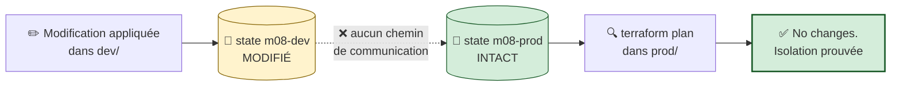

> 🧠 **Pourquoi cette isolation est totale.** Le state PROD est un **blob différent**, avec un **verrou différent**. Le processus Terraform lancé dans `dev/` n'a jamais ouvert le blob PROD ; il ne sait littéralement pas qu'il existe. Ce n'est pas une convention respectée par discipline : c'est une **barrière technique**.
>
> **Avec des workspaces, ce test serait moins rassurant** : les deux states vivent dans le même conteneur, sous le même compte, atteints avec les mêmes credentials. Un `terraform workspace select` mal placé suffirait à franchir la frontière.

### Remédiation

Remettez `auto_suspend_seconds = 60` dans `dev/main.tf` :

```powershell
cd ..\dev
terraform apply -auto-approve
terraform plan
```

✅ `No changes.`

---

## B.10 — 🤖 Validation automatisée

```powershell
cd "$HOME\Data2AI-Labs\data-platform"
.\scripts\SelfPacedLab.ps1 -Module 8 -All -Report
```

✅ **Résultat attendu :**

```text
[PASS] T1 Directory-based layout (dev/uat/prod)
[PASS] T2 Isolated backend keys
[PASS] T3 Environment-specific variables
[PASS] T4 terraform fmt & validate
[PASS] T5 Cross-environment isolation verified
Result: 5/5 Tasks Passed.
```

---

## B.11 — 🏆 Défi autonome

> **Scénario :** auditez l'isolation des trois environnements et **prouvez** qu'aucune quatrième clé de state n'a été créée par erreur.
>
> **Contraintes :**
> - `terraform init` réussit dans `dev/`, `uat/` et `prod/` ;
> - chaque backend contient `use_azuread_auth = true` ;
> - la liste des blobs Azure (obtenue avec `--auth-mode login`) contient **uniquement** les trois clés attendues pour M08 ;
> - les databases s'appellent `APP01_M08_RAW_DEV`, `_UAT` et `_PROD` ;
> - produisez un **rapport d'audit** reproductible.

<details>
<summary>💡 <b>Indice</b></summary>

Un audit doit être **rejouable par quelqu'un d'autre**. Écrivez-le sous forme de script, pas de suite de commandes tapées à la main. C'est exactement ce que fera votre pipeline au Lab 8.
</details>

<details>
<summary>✅ <b>Solution de référence</b></summary>

Créez `labs/m08-environments/Audit-Isolation.ps1` :

```powershell
param([string]$LearnerPrefix = "APP01")

$ErrorActionPreference = "Stop"
$envs = @("dev", "uat", "prod")
$expected = $envs | ForEach-Object { "training/$LearnerPrefix/m08-$_/terraform.tfstate" }

Write-Host "`n=== 1. Backends declares ===" -ForegroundColor Cyan
foreach ($e in $envs) {
    $content = Get-Content "$e\versions.tf" -Raw
    $key  = if ($content -match 'key\s*=\s*"([^"]+)"') { $Matches[1] } else { "ABSENT" }
    $auth = $content -match 'use_azuread_auth\s*=\s*true'
    $ok   = ($key -eq "training/$LearnerPrefix/m08-$e/terraform.tfstate") -and $auth
    $tag  = if ($ok) { "[PASS]" } else { "[FAIL]" }
    Write-Host "$tag $e -> $key (azuread=$auth)"
}

Write-Host "`n=== 2. Blobs Azure reellement presents ===" -ForegroundColor Cyan
$blobs = az storage blob list `
    --account-name $env:ARM_STORAGE_ACCOUNT `
    --container-name $env:ARM_CONTAINER `
    --auth-mode login `
    --query "[?contains(name, 'm08')].name" -o tsv

$found = @($blobs -split "`n" | Where-Object { $_ })
foreach ($b in $found) {
    $tag = if ($expected -contains $b) { "[PASS]" } else { "[FAIL] INATTENDU" }
    Write-Host "$tag $b"
}

Write-Host "`n=== 3. Comptage ===" -ForegroundColor Cyan
if ($found.Count -eq 3) {
    Write-Host "[PASS] Exactement 3 states M08" -ForegroundColor Green
} else {
    Write-Host "[FAIL] $($found.Count) states trouves, 3 attendus" -ForegroundColor Red
}

Write-Host "`n=== 4. Objets Snowflake ===" -ForegroundColor Cyan
foreach ($e in $envs) {
    $db = "${LearnerPrefix}_M08_RAW_$($e.ToUpper())"
    $r = snow sql -c training -q "SHOW DATABASES LIKE '$db'" 2>$null
    $tag = if ($r -match $db) { "[PASS]" } else { "[FAIL]" }
    Write-Host "$tag $db"
}
```

```powershell
cd "$HOME\Data2AI-Labs\data-platform\labs\m08-environments"
.\Audit-Isolation.ps1 -LearnerPrefix APP01
```

> 🏆 **Vous venez d'écrire un contrôle de conformité automatisé.** Au Lab 8, ce type de script devient un **stage de pipeline** : la conformité n'est plus une vérification ponctuelle, elle est **vérifiée à chaque changement**.
</details>

| Critère d'évaluation | Points |
|---|---:|
| Syntaxe HCL et respect des standards | 30 |
| Preuve d'exécution fonctionnelle | 30 |
| Idempotence | 20 |
| Respect des budgets FinOps & Sécurité | 20 |
| **Total** | **100** |

---

## B.12 — 🧹 Nettoyage

> 🧠 **Détruisez du plus risqué au moins risqué.** C'est un réflexe professionnel : si quelque chose se passe mal, mieux vaut que ce soit sur l'environnement dont vous venez de traiter la destruction en pleine attention.

```powershell
cd "$HOME\Data2AI-Labs\data-platform\labs\m08-environments\prod"
terraform destroy -auto-approve

cd ..\uat
terraform destroy -auto-approve

cd ..\dev
terraform destroy -auto-approve
```

✅ **Checkpoint cleanup :** `Destroy complete! Resources: 3 destroyed.` pour chaque environnement.

> 💡 Alternative par script :
> ```powershell
> .\scripts\Reset-Lab.ps1 -LearnerPrefix APP01 -Lab M08
> .\scripts\Reset-Lab.ps1 -LearnerPrefix APP01 -Lab M08 -Environment UAT
> .\scripts\Reset-Lab.ps1 -LearnerPrefix APP01 -Lab M08 -Environment PROD
> ```
>
> ⚠️ Les **blobs de state** restent dans Azure. Supprimez-les manuellement si nécessaire avec `az storage blob delete`.

---
---

# PARTIE C — 🛠️ LABORATOIRE 8

## *Le pipeline Azure DevOps : Validate → Plan → Approval → Apply → Audit*

> **Module source :** M07 — `labs/m07-cicd-pipeline/` · **Durée : 2 h** · Piste `[CORE]`

| Élément | Valeur |
|---|---|
| **Dossier de travail** | `labs/m07-cicd-pipeline/` |
| **Coût** | 💰 Aucun — agent Microsoft hébergé, quota gratuit |
| **Cleanup** | Aucune ressource Terraform créée par ce lab lui-même |
| **Prérequis particulier** | Un projet Azure DevOps avec accès au dépôt |

---

## C.0 — Mission métier

> **En tant que :** Data Platform Engineer
> **Je veux :** configurer un pipeline CI/CD Azure DevOps pour Terraform
> **Afin de :** garantir la séparation des responsabilités et l'approbation avant déploiement

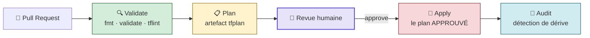

**Objectifs vérifiables :**

- ✅ créer et **comprendre** le pipeline `azure-pipelines.yml` ;
- ✅ configurer un Variable Group avec des secrets masqués ;
- ✅ exécuter un plan sur une pull request ;
- ✅ appliquer **après approbation**, avec un plan immuable ;
- ✅ comprendre et configurer les gates d'environnement ;
- ✅ prouver qu'un code invalide **bloque** la pull request.

---

## C.1 — 🚦 Pre-flight

### Prérequis

- [ ] Jour 0 terminé : `Toolchain status: READY` ;
- [ ] un **projet Azure DevOps** avec accès au dépôt Git ;
- [ ] le droit de créer un Variable Group et un Environment dans ce projet ;
- [ ] le lab M06 (Jour 3) **déployé**, car le pipeline agira sur `labs/m06-dynamic-logic/`.

```powershell
cd "$HOME\Data2AI-Labs\data-platform"
.\scripts\Learner-Login.ps1 -LearnerPrefix APP01
.\scripts\Reset-Lab.ps1 -LearnerPrefix APP01 -Lab M07
cd labs\m07-cicd-pipeline
```

> 🧠 **Ce lab ne crée aucune ressource Snowflake par lui-même.** Il crée l'**usine** qui déploiera vos ressources. Le pipeline pointe vers `labs/m06-dynamic-logic/`, qui contient un module et des ressources réelles.

---

## C.2 — Étape 1 : écrire le pipeline

### 📝 Action 1.1 — Créer `azure-pipelines.yml`

Créez le fichier dans `labs/m07-cicd-pipeline/` :

```yaml
# Azure DevOps pipeline for Terraform CI/CD
# Dans un projet réel, ce fichier vit à la RACINE du dépôt.
# Ici il reste dans le dossier du lab pour rester auto-contenu.

trigger:
  branches:
    include:
      - main

pr:
  branches:
    include:
      - main

pool:
  vmImage: 'ubuntu-latest'

variables:
  - group: data-platform-secrets
  - name: TF_VERSION
    value: '1.14.5'
  - name: TF_WORKING_DIR
    value: 'labs/m06-dynamic-logic'

stages:
  # ─────────────────────────────────────────────────────────
  - stage: Validate
    displayName: 'Validate — qualité de code'
    jobs:
      - job: Validate
        steps:
          - task: TerraformInstaller@1
            displayName: 'Install Terraform'
            inputs:
              terraformVersion: '$(TF_VERSION)'

          - script: |
              cd $(TF_WORKING_DIR)
              terraform fmt -check -recursive
            displayName: 'terraform fmt -check'

          - script: |
              cd $(TF_WORKING_DIR)
              terraform init -backend=false
              terraform validate
            displayName: 'terraform validate'

          - script: |
              curl -s https://raw.githubusercontent.com/terraform-linters/tflint/master/install_linux.sh | bash
              cd $(TF_WORKING_DIR)
              tflint --recursive
            displayName: 'tflint'
            continueOnError: true

  # ─────────────────────────────────────────────────────────
  - stage: Plan
    displayName: 'Plan — aperçu immuable'
    dependsOn: Validate
    jobs:
      - job: Plan
        steps:
          - task: TerraformInstaller@1
            displayName: 'Install Terraform'
            inputs:
              terraformVersion: '$(TF_VERSION)'

          - script: |
              cd $(TF_WORKING_DIR)
              terraform init
              terraform plan -out=tfplan -input=false
            displayName: 'Terraform Plan'
            env:
              TF_VAR_snowflake_token: $(SNOWFLAKE_PAT)
              ARM_SUBSCRIPTION_ID: $(ARM_SUBSCRIPTION_ID)
              ARM_TENANT_ID: $(ARM_TENANT_ID)

          - task: PublishPipelineArtifact@1
            displayName: 'Publish tfplan'
            inputs:
              targetPath: '$(TF_WORKING_DIR)/tfplan'
              artifact: tfplan

  # ─────────────────────────────────────────────────────────
  - stage: Approval
    displayName: 'Approval — gate humain'
    dependsOn: Plan
    condition: and(succeeded(), eq(variables['Build.SourceBranch'], 'refs/heads/main'))
    jobs:
      - deployment: Approval
        environment: Approval
        strategy:
          runOnce:
            deploy:
              steps:
                - script: echo "Plan approuve par un humain"
                  displayName: 'Manual approval gate'

  # ─────────────────────────────────────────────────────────
  - stage: Apply
    displayName: 'Apply — exécution du plan approuvé'
    dependsOn: Approval
    condition: and(succeeded(), eq(variables['Build.SourceBranch'], 'refs/heads/main'))
    jobs:
      - job: Apply
        steps:
          - task: TerraformInstaller@1
            displayName: 'Install Terraform'
            inputs:
              terraformVersion: '$(TF_VERSION)'

          - task: DownloadPipelineArtifact@2
            displayName: 'Download tfplan'
            inputs:
              artifact: tfplan
              targetPath: '$(TF_WORKING_DIR)/'

          - script: |
              cd $(TF_WORKING_DIR)
              terraform init
              terraform apply tfplan -input=false
            displayName: 'Terraform Apply'
            env:
              TF_VAR_snowflake_token: $(SNOWFLAKE_PAT)
              ARM_SUBSCRIPTION_ID: $(ARM_SUBSCRIPTION_ID)
              ARM_TENANT_ID: $(ARM_TENANT_ID)

  # ─────────────────────────────────────────────────────────
  - stage: Audit
    displayName: 'Audit — détection de dérive'
    dependsOn: Apply
    condition: and(succeeded(), eq(variables['Build.SourceBranch'], 'refs/heads/main'))
    jobs:
      - job: Audit
        steps:
          - task: TerraformInstaller@1
            displayName: 'Install Terraform'
            inputs:
              terraformVersion: '$(TF_VERSION)'

          - script: |
              cd $(TF_WORKING_DIR)
              terraform init
              terraform plan -detailed-exitcode -input=false
            displayName: 'Drift detection'
            env:
              TF_VAR_snowflake_token: $(SNOWFLAKE_PAT)
              ARM_SUBSCRIPTION_ID: $(ARM_SUBSCRIPTION_ID)
              ARM_TENANT_ID: $(ARM_TENANT_ID)
```

### 🧠 Lecture guidée, section par section

#### Les déclencheurs

```yaml
trigger:            # push sur main → pipeline complet (jusqu'à Apply)
  branches:
    include: [main]

pr:                 # PR vers main → Validate + Plan seulement
  branches:
    include: [main]
```

> 🧠 **Deux déclencheurs, deux comportements.** Une PR obtient une **relecture automatique** (Validate + Plan) mais ne peut **rien appliquer** — les stages Apply et Audit sont conditionnés à `refs/heads/main`. C'est le principe : la PR informe, le merge agit.

#### Les variables

```yaml
variables:
  - group: data-platform-secrets     # ← Variable Group Azure DevOps
  - name: TF_VERSION
    value: '1.14.5'
  - name: TF_WORKING_DIR
    value: 'labs/m06-dynamic-logic'
```

| Élément | Rôle |
|---|---|
| `group:` | Importe **toutes** les variables d'un Variable Group, secrets compris |
| `TF_VERSION` | 🔑 La version épinglée — la **même** que votre `required_version` |
| `TF_WORKING_DIR` | Le dossier ciblé, défini **une fois** et réutilisé partout |

> 🧠 **`TF_VERSION` en variable est un choix professionnel.** Monter de version Terraform devient une modification d'**une seule ligne**, visible en pull request, appliquée uniformément aux cinq stages. Sans cela, la version serait dispersée en cinq endroits.

#### Le stage `Validate` — pourquoi `-backend=false`

```yaml
terraform init -backend=false
terraform validate
```

> 🔑 **`-backend=false` initialise les providers SANS se connecter au backend distant.**
>
> Conséquence majeure : ce stage n'a besoin **d'aucun credential**. Il peut donc s'exécuter sur n'importe quelle branche, y compris une contribution externe, sans exposer le moindre secret. C'est le *shift-left* poussé jusqu'à sa conclusion logique : **la validation la moins chère est aussi la moins risquée**.

> 🧠 **Pourquoi `continueOnError: true` sur `tflint` ?** Parce que `tflint` remonte aussi des **avertissements de style**. En début de projet, échouer sur chaque avertissement décourage l'équipe. La progression professionnelle est : `continueOnError: true` → observer quelques semaines → corriger le fond → passer à `false` et rendre la règle bloquante.

#### Le stage `Plan` — le cœur du dispositif

```yaml
terraform plan -out=tfplan -input=false
# puis
- task: PublishPipelineArtifact@1
  inputs:
    targetPath: '$(TF_WORKING_DIR)/tfplan'
    artifact: tfplan
```

| Élément | Rôle |
|---|---|
| `-out=tfplan` | 🔑 **Fige** le plan dans un fichier binaire |
| `-input=false` | 🔑 **Interdit** toute question interactive — sinon le job resterait bloqué indéfiniment |
| `PublishPipelineArtifact` | Publie le plan comme artefact, consommable par un stage ultérieur |

> ⚠️ **Piège classique n°24.** Sans `-input=false`, une variable manquante fait attendre Terraform sur `Enter a value:` — dans un agent CI, personne ne répondra jamais. Le job tourne jusqu'au timeout (souvent 60 minutes) et consomme du quota pour rien. **`-input=false` sur toutes les commandes Terraform en CI, sans exception.**

> 🔒 **L'artefact `tfplan` contient toutes les valeurs résolues, y compris les secrets.** Dans Azure DevOps, l'accès aux artefacts suit les permissions du projet. Sur un dépôt public, cette approche demanderait un chiffrement supplémentaire.

#### Le stage `Approval` — le gate humain

```yaml
- deployment: Approval          # ← un job de type "deployment", pas "job"
  environment: Approval         # ← l'objet Environment porte les approbateurs
  strategy:
    runOnce:
      deploy:
        steps:
          - script: echo "Plan approuve par un humain"
```

> 🎓 **Point d'examen (AZ-400).** Un gate d'approbation **ne se déclare pas dans le YAML**. Le YAML **cible** un `Environment` ; c'est dans l'interface Azure DevOps que l'on attache les *approvals and checks* à cet Environment. Un `job:` ordinaire ne peut jamais porter d'approbation — il faut un `deployment:` avec `environment:`.
>
> 🧠 Le `script: echo` semble inutile — et il l'est fonctionnellement. **C'est un prétexte** : ce stage existe uniquement pour matérialiser le point d'attente. Toute la valeur est dans le gate attaché à l'Environment.

#### Le stage `Apply` — le plan approuvé, pas un nouveau

```yaml
- task: DownloadPipelineArtifact@2
  inputs:
    artifact: tfplan
    targetPath: '$(TF_WORKING_DIR)/'
# puis
terraform apply tfplan -input=false
```

> 🔑 **`terraform apply tfplan` — c'est LA ligne du lab.**
>
> Terraform exécute le plan **téléchargé**, sans replanifier. Ce qui a été affiché à l'approbateur est **exactement** ce qui est exécuté. Sans cet artefact, `terraform apply` recalculerait un plan à l'instant T, potentiellement différent de celui approuvé — et la signature humaine perdrait tout sens.
>
> 🔬 Si l'infrastructure a changé entre le plan et l'apply, Terraform **échoue** avec *« Saved plan is stale »*. C'est le comportement voulu : mieux vaut échouer que d'appliquer une intention obsolète.

#### Le stage `Audit`

```yaml
terraform plan -detailed-exitcode -input=false
```

| Code | Signification | Effet dans le pipeline |
|:---:|---|---|
| 0 | Aucune dérive | ✅ Job vert |
| 1 | Erreur | 🔴 Job rouge |
| 2 | Dérive détectée | ⚠️ Job rouge → investiguer |

> 🧠 **Ce stage tourne juste après l'apply, donc il doit renvoyer 0.** S'il renvoie 2 immédiatement après un apply réussi, c'est le symptôme d'une **ressource non idempotente** : le provider renvoie systématiquement une différence. C'est un bug à corriger, pas un aléa à ignorer.
>
> 🔬 **En production, ce stage devient un pipeline planifié**, exécuté chaque nuit sur tous les environnements. Un code 2 déclenche une alerte : *« quelqu'un a modifié la production hors processus »*. C'est la version industrialisée du `-refresh-only` du Jour 2.

### 📝 Action 1.2 — Le tableau récapitulatif des stages

| Stage | Déclenché sur | Credentials ? | Rôle |
|---|---|:---:|---|
| `Validate` | PR **et** `main` | ❌ Aucun | `fmt -check`, `validate`, `tflint` |
| `Plan` | PR **et** `main` | ✅ Lecture | `plan -out=tfplan` + artefact |
| `Approval` | `main` seulement | ❌ | Gate manuel |
| `Apply` | `main` seulement | ✅ Écriture | `apply tfplan` |
| `Audit` | `main` seulement | ✅ Lecture | `plan -detailed-exitcode` |

---

## C.3 — Étape 2 : configurer Azure DevOps

### 📝 Action 2.1 — Créer le Variable Group

1. Azure DevOps → **Pipelines → Library** ;
2. **+ Variable group** ;
3. Nom : **`data-platform-secrets`** (il doit correspondre exactement au `group:` du YAML) ;
4. Ajoutez les variables :

| Variable | Valeur | Secret ? |
|---|---|:---:|
| `ARM_SUBSCRIPTION_ID` | Votre ID de souscription | ❌ |
| `ARM_TENANT_ID` | Votre ID de tenant | ❌ |
| `SNOWFLAKE_CONNECTION` | `training` | ❌ |
| `SNOWFLAKE_PAT` | Votre PAT Snowflake | 🔒 **✅ OUI** |

5. Cliquez sur **l'icône cadenas** à côté de `SNOWFLAKE_PAT` ;
6. **Save** ;
7. Onglet **Pipeline permissions** → autorisez votre pipeline.

> 🔒 **Le cadenas fait trois choses :** la valeur est chiffrée au repos, elle devient illisible dans l'interface après enregistrement (même pour vous), et Azure DevOps remplace ses occurrences par `***` dans les logs.
>
> ⚠️ **Le masquage ne couvre que les correspondances exactes.** Un secret encodé, découpé ou transformé n'est plus masqué. Ne faites jamais `echo $(SNOWFLAKE_PAT)`, et n'activez jamais `TF_LOG=DEBUG` en pipeline.

> 🏆 **Le niveau supérieur.** Un Variable Group peut être **lié à un Azure Key Vault** : les secrets ne sont plus stockés dans Azure DevOps, ils sont lus à la volée depuis le coffre, avec rotation centralisée et journal d'accès. C'est la cible du **Jour 4 du programme** (identité JWT + Key Vault).

### 📝 Action 2.2 — Créer l'Environment et son gate

1. **Pipelines → Environments → New environment** ;
2. Nom : **`Approval`** (il doit correspondre au `environment:` du YAML) ;
3. Resource : **None** → **Create** ;
4. Sur l'environnement créé : **⋮ → Approvals and checks** ;
5. **+ → Approvals** ;
6. Ajoutez-vous comme approbateur (en salle : un binôme, pour vivre la séparation des rôles) ;
7. *(optionnel)* décochez **Allow approvers to approve their own runs** ;
8. **Create**.

> 🎓 **L'option « Allow approvers to approve their own runs » est LE réglage de conformité.** Décochée, l'auteur d'un changement ne peut pas l'approuver lui-même. C'est l'implémentation technique de la séparation des responsabilités exigée par SOX, ISO 27001 ou DORA.
>
> 🧠 **En formation, gardez-la cochée** (vous êtes seul), mais **sachez qu'elle existe** : c'est une question d'entretien fréquente.

### 📝 Action 2.3 — Connecter le pipeline

1. **Pipelines → Pipelines → New pipeline** ;
2. Sélectionnez votre dépôt Git ;
3. **Existing Azure Pipelines YAML file** ;
4. Chemin : `/labs/m07-cicd-pipeline/azure-pipelines.yml` ;
5. **Continue → Run**.

✅ **Checkpoint 1 :** le pipeline s'exécute. Les stages `Validate` et `Plan` doivent passer au vert.

> ⚠️ **Si `Plan` échoue avec `token is empty`** : le Variable Group n'est pas lié au pipeline (Library → Pipeline permissions), ou `SNOWFLAKE_PAT` n'est pas mappée dans le bloc `env:` du step.

---

## C.4 — Étape 3 : le cycle complet d'une pull request

> 🧠 **C'est ici que tout se connecte.** Vous allez faire vivre un changement d'infrastructure du clavier jusqu'à Snowflake, en passant par toutes les portes.

### 📝 Action 3.1 — Créer une branche

```bash
cd "$HOME/Data2AI-Labs/data-platform"
git checkout -b feature/add-archive-schema
```

### 📝 Action 3.2 — Faire un changement significatif

Dans `labs/m06-dynamic-logic/main.tf`, ajoutez un schema à la map :

```hcl
  schemas = {
    ingestion = { name = "INGESTION", comment = "Ingestion schema" }
    staging   = { name = "STAGING", comment = "Staging schema" }
    archive   = { name = "ARCHIVE", comment = "Archive schema" }
  }
```

> 🧠 **Trois mots ajoutés dans une map de métadonnées.** C'est exactement le niveau 3 de maturité du Jour 3 : ajouter une ressource ne demande **aucun code nouveau**. Et grâce à `for_each`, cet ajout **ne touchera** ni `ingestion` ni `staging`.

### 📝 Action 3.3 — Commiter et pousser

```bash
cd "$HOME/Data2AI-Labs/data-platform/labs/m06-dynamic-logic"
terraform fmt -recursive
cd "$HOME/Data2AI-Labs/data-platform"
git add labs/m06-dynamic-logic/main.tf
git commit -m "feat: add ARCHIVE schema to landing zone"
git push origin feature/add-archive-schema
```

> ⚠️ **Lancez `terraform fmt` AVANT de commiter.** Le stage `Validate` exécute `fmt -check` : un fichier mal formaté fait échouer la PR. C'est volontaire — le formatage se corrige chez le développeur, jamais par la CI.

### 📝 Action 3.4 — Créer la pull request

1. **[dev.azure.com](https://dev.azure.com)** → votre projet ;
2. **Repos → Pull requests → New pull request** ;
3. Source `feature/add-archive-schema` → cible `main` ;
4. Titre : `feat: add archive schema to landing zone` ;
5. **Create**.

### 📝 Action 3.5 — Observer la validation automatique

Dans la PR, section **Checks / Builds** :

1. Le pipeline se déclenche automatiquement ;
2. Cliquez sur le build en cours ;
3. Suivez `Validate` : `fmt -check` → `validate` → `tflint` ;
4. Puis `Plan`.

✅ **Checkpoint 2 :** dans les logs du stage `Plan` :

```text
Terraform will perform the following actions:

  # module.landing_zone.snowflake_schema.this["archive"] will be created
  + resource "snowflake_schema" "this" {
      + comment  = "Archive schema"
      + database = "APP01_M06_RAW_DEV"
      + name     = "ARCHIVE"
    }

Plan: 1 to add, 0 to change, 0 to destroy.
```

> 🏆 **Lisez ce que vous venez d'obtenir.** Sans quitter votre navigateur, sans credentials sur votre poste, un relecteur voit **exactement** ce qui va changer en production. `1 to add, 0 to change, 0 to destroy` : la preuve, avant le merge, que les schemas existants ne sont pas touchés.
>
> 🧠 **C'est la valeur centrale du GitOps.** La revue de code d'infrastructure n'est plus « je lis du HCL et j'imagine » : c'est « je lis le plan calculé et je vérifie ».

> ⚠️ **Notez que les stages `Approval`, `Apply` et `Audit` sont SKIPPED.** La condition `eq(variables['Build.SourceBranch'], 'refs/heads/main')` est fausse sur une branche de feature. **Une PR ne peut rien appliquer** — c'est la barrière de sécurité.

### 📝 Action 3.6 — Approuver et fusionner

1. Dans la PR : **Approve** ;
2. **Complete** → sélectionnez *Merge (no fast-forward)* → **Complete merge**.

### 📝 Action 3.7 — Observer le gate d'approbation

1. **Pipelines → Pipelines** → la dernière exécution sur `main` ;
2. `Validate` puis `Plan` s'exécutent ;
3. Le stage `Approval` passe en **Waiting for approval** ;
4. Cliquez sur **Review → Approve**.

> 🛑 **Avant d'approuver, faites le geste professionnel :** ouvrez les logs du stage `Plan` et relisez le diff. **Approuver sans lire le plan, c'est signer un chèque en blanc.** L'approbation n'a de valeur que si elle est éclairée.

✅ **Checkpoint 3 :** le stage `Apply` démarre après votre approbation.

### 📝 Action 3.8 — Observer l'apply et l'audit

1. Stage `Apply` : observez le téléchargement de l'artefact `tfplan`, puis `terraform apply tfplan` ;
2. ✅ `Apply complete! Resources: 1 added, 0 changed, 0 destroyed.` ;
3. Stage `Audit` : `terraform plan -detailed-exitcode`.

✅ **Checkpoint 4 :**

```text
No changes. Your infrastructure matches the configuration.
```

> 🏆 **Le cycle est bouclé.** Un changement est parti d'un commit, a été validé par une machine, relu par un humain via un plan, appliqué par un plan **figé**, puis audité — sans qu'aucun humain n'ait tapé `terraform apply`.

### 📝 Action 3.9 — Vérifier dans Snowsight

1. **[app.snowflake.com](https://app.snowflake.com)** ;
2. **Data → Databases → `APP01_M06_RAW_DEV`** ;
3. Le schema `ARCHIVE` est présent, avec son commentaire `Archive schema` ;
4. `INGESTION` et `STAGING` sont **intacts**.

> 🧠 **Personne n'a touché Snowflake directement.** Le seul geste humain a été : écrire trois mots dans un fichier, ouvrir une PR, et cliquer sur *Approve*. **C'est la définition opérationnelle du GitOps.**

---

## C.5 — Étape 4 : les gates par environnement

### 🧠 Le modèle cible

| Environnement | Gate | Qui approuve | Fenêtre |
|---|---|---|---|
| **DEV** | Automatique | — | 24/7 |
| **UAT** | Approbation manuelle | Tech lead | Heures ouvrées |
| **PROD** | Approbation manuelle **+** fenêtre | Comité de changement | Fenêtre de changement |

### 📝 Action 4.1 — Étendre le pipeline (concept)

En combinant avec le Lab 7, le pipeline devient :

```yaml
- stage: PlanUAT
  dependsOn: ApplyDev
  jobs:
    - job: PlanUAT
      steps:
        - script: |
            cd labs/m08-environments/uat
            terraform init
            terraform plan -out=tfplan -input=false
          displayName: 'Terraform Plan UAT'

- stage: ApplyUAT
  dependsOn: PlanUAT
  condition: and(succeeded(), eq(variables['Build.SourceBranch'], 'refs/heads/main'))
  jobs:
    - deployment: ApplyUAT
      environment: UAT             # ← Environment distinct = approbateurs distincts
      strategy:
        runOnce:
          deploy:
            steps:
              - script: |
                  cd labs/m08-environments/uat
                  terraform apply tfplan -input=false
```

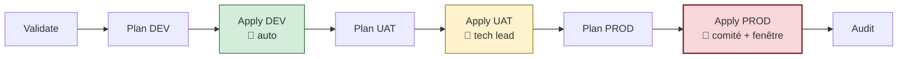

> 🧠 **Un `Environment` Azure DevOps par environnement Terraform.** Chacun porte ses propres approbateurs, ses propres fenêtres horaires, son propre verrou exclusif. **La rigueur croît avec le risque** — c'est exactement la matrice du Lab 7, transposée dans la chaîne de livraison.
>
> 🔒 **Et à terme, une identité par environnement** (axe 3 de l'isolation) : le service connection de DEV n'a **aucun droit** sur PROD. Même un pipeline compromis en DEV ne peut pas atteindre la production. C'est le Jour 5.

---

## C.6 — 🐛 Chaos Lab : le garde-fou bloque une PR

> *Éprouvez votre garde-fou : un code invalide doit être impossible à fusionner.*

### Symptôme — injecter une erreur

```bash
cd "$HOME/Data2AI-Labs/data-platform"
git checkout main
git pull
git checkout -b feature/broken-syntax
```

Dans `labs/m06-dynamic-logic/main.tf`, introduisez délibérément une erreur — une accolade non fermée :

```hcl
module "landing_zone" {
  source              = "./modules/landing-zone"
  learner_prefix      = var.learner_prefix
  environment         = var.environment
# ← accolade fermante manquante
```

```bash
git commit -am "test: introduce syntax error"
git push origin feature/broken-syntax
```

### Diagnostic

Ouvrez la pull request sur Azure DevOps :

1. Le stage `Validate` passe en **rouge (Failed)** en quelques secondes ;
2. Logs : `Error: Argument or block definition required` ;
3. Le stage `Plan` est **skipped** — `dependsOn: Validate` a échoué ;
4. La PR affiche un check en échec.

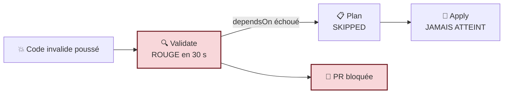

> 🧠 **Trois observations qui valent le détour :**
> 1. **Le coût de l'échec est minuscule** — 30 secondes de calcul, aucun appel Snowflake, aucun credential utilisé. C'est tout l'intérêt du *shift-left* ;
> 2. **`dependsOn` protège la chaîne** — un stage rouge arrête tout ce qui suit. `Apply` n'est jamais atteint ;
> 3. **Le blocage est technique, pas humain** — personne n'a eu à repérer l'erreur. La machine l'a fait, en trente secondes, avant qu'un relecteur ne perde son temps.

> 🎓 **Pour rendre le blocage contractuel**, Azure DevOps propose les **Branch Policies** : Repos → Branches → `main` → **Branch policies** → *Build validation*. Le pipeline devient alors une **condition obligatoire** de fusion. Sans cette politique, un administrateur pourrait fusionner malgré un check rouge.

### Remédiation

```bash
# corrigez l'accolade dans main.tf
cd labs/m06-dynamic-logic && terraform fmt && cd ../..
git commit -am "fix: restore valid syntax"
git push origin feature/broken-syntax
```

✅ Le pipeline se relance automatiquement et repasse au vert.

```bash
git checkout main
git branch -D feature/broken-syntax
git push origin --delete feature/broken-syntax
```

---

## C.7 — 🤖 Validation automatisée

```powershell
cd "$HOME\Data2AI-Labs\data-platform"
.\scripts\SelfPacedLab.ps1 -Module 7 -All -Report
```

✅ **Résultat attendu :**

```text
[PASS] T1 azure-pipelines.yml exists
[PASS] T1 Multi-stage pipeline declared (Validate, Plan, Apply)
[PASS] T2 Approval gate environment configured
[PASS] T3 terraform fmt & validate passed
[PASS] T4 Git branch hygiene compliant
Result: 5/5 Tasks Passed.
```

---

## C.8 — 🏆 Défi autonome

> **Scénario :** rendez `tflint` **bloquant** et ajoutez une règle de conformité personnalisée au stage `Validate`.
>
> **Contraintes :**
> - le stage `Validate` exécute `tflint` sur `labs/m06-dynamic-logic/` **et** ses modules ;
> - le pipeline **échoue** si `tflint` remonte des erreurs (plus de `continueOnError`) ;
> - un fichier `.tflint.hcl` configure au moins une règle ;
> - le pipeline repasse au vert après correction.

<details>
<summary>💡 <b>Indice n°1</b></summary>

`continueOnError: true` est ce qui empêche actuellement `tflint` de bloquer. Retirez-le… mais lancez `tflint` en local **d'abord**, sinon vous découvrirez trente avertissements en pleine PR.
</details>

<details>
<summary>💡 <b>Indice n°2</b></summary>

`tflint` se configure avec un fichier `.tflint.hcl` à la racine du dossier analysé. La règle `terraform_unused_declarations` détecte les variables déclarées mais jamais utilisées — un excellent premier filet.
</details>

<details>
<summary>✅ <b>Solution de référence</b></summary>

**`labs/m06-dynamic-logic/.tflint.hcl` :**

```hcl
plugin "terraform" {
  enabled = true
  preset  = "recommended"
}

rule "terraform_required_version" {
  enabled = true
}

rule "terraform_required_providers" {
  enabled = true
}

rule "terraform_unused_declarations" {
  enabled = true
}

rule "terraform_naming_convention" {
  enabled = true
  format  = "snake_case"
}
```

**Dans `azure-pipelines.yml`, remplacez le step `tflint` :**

```yaml
          - script: |
              curl -s https://raw.githubusercontent.com/terraform-linters/tflint/master/install_linux.sh | bash
              cd $(TF_WORKING_DIR)
              tflint --init
              tflint --recursive --format compact
            displayName: 'tflint (blocking)'
            # continueOnError retiré → le stage échoue si tflint sort en erreur
```

**Test en local, AVANT de pousser :**

```powershell
cd "$HOME\Data2AI-Labs\data-platform\labs\m06-dynamic-logic"
tflint --init
tflint --recursive --format compact
```

**Test du blocage — ajoutez une variable inutilisée :**

```hcl
variable "unused_test" {
  type    = string
  default = "test"
}
```

Poussez : `tflint` remonte `variable "unused_test" is declared but not used` et le pipeline **échoue**. Retirez la variable, le pipeline repasse au vert.

> 🏆 **Ce que vous venez de construire.** `terraform validate` vérifie que le code est **valide**. `tflint` vérifie qu'il est **bon**. La différence entre les deux est exactement la différence entre « ça compile » et « ça passe la revue de code ». En rendant `tflint` bloquant, vous avez transformé une convention d'équipe en **contrainte technique**.
>
> 🔬 **Les étages suivants**, au Jour 5 : `tfsec`/`checkov` (sécurité), `infracost` (coût), OPA/Sentinel (policy as code organisationnelle).
</details>

| Critère d'évaluation | Points |
|---|---:|
| Syntaxe HCL et respect des standards | 30 |
| Preuve d'exécution fonctionnelle | 30 |
| Idempotence (`0 to add, 0 to change, 0 to destroy`) | 20 |
| Respect des budgets FinOps & Sécurité | 20 |
| **Total** | **100** |

---

## C.9 — 🧹 Nettoyage

Ce lab ne crée **aucune ressource Snowflake** par lui-même. Il n'y a pas de `terraform destroy` à exécuter ici.

> 💡 Si vous avez appliqué des changements **via le pipeline** (étape 3), nettoyez les ressources M06 :
> ```powershell
> cd "$HOME\Data2AI-Labs\data-platform"
> .\scripts\Reset-Lab.ps1 -LearnerPrefix APP01 -Lab M06
> ```
>
> 🧹 Dans Azure DevOps, vous pouvez conserver le pipeline, le Variable Group et l'Environment : ils resserviront au Jour 5. 💰 Un pipeline au repos ne coûte rien.

---
---
# PARTIE D — 📚 CONSOLIDATION

---

## D.1 — 🎓 Quiz de fin de journée (Terraform Associate 003 + AZ-400)

---

**Q1.** Quels sont les trois axes d'isolation d'un environnement ?

- A. Code, tests, documentation
- B. State, nommage, droits
- C. DEV, UAT, PROD
- D. Backend, provider, module

---

**Q2.** Pourquoi les workspaces Terraform ne conviennent-ils pas pour séparer DEV et PROD ?

- A. Ils sont dépréciés
- B. Ils partagent le même backend et les mêmes credentials
- C. Ils ne supportent pas les modules
- D. Ils ne fonctionnent qu'avec HCP Terraform

---

**Q3.** Peut-on écrire `key = "training/${var.env}/terraform.tfstate"` dans un bloc `backend` ?

- A. Oui, depuis Terraform 1.5
- B. Non — le bloc `backend` n'accepte aucune variable ni expression
- C. Oui, si la variable a un `default`
- D. Oui, avec `TF_VAR_env`

---

**Q4.** Que garantit `terraform apply tfplan` par rapport à `terraform apply` ?

- A. C'est plus rapide
- B. Terraform exécute exactement le plan approuvé, sans replanifier
- C. Cela évite d'avoir besoin de credentials
- D. Cela ignore le verrou du state

---

**Q5.** `terraform plan -detailed-exitcode` renvoie 2. Que cela signifie-t-il ?

- A. Deux ressources ont été créées
- B. Une erreur d'authentification
- C. Des changements sont en attente — une dérive est détectée
- D. Le plan a réussi sans changement

---

**Q6.** Pourquoi utiliser `terraform fmt -check` plutôt que `terraform fmt` en CI ?

- A. `-check` est plus rapide
- B. `fmt` modifierait les fichiers sur l'agent sans les commiter, créant une divergence silencieuse
- C. `fmt` nécessite des credentials
- D. Il n'y a pas de différence

---

**Q7.** À quoi sert `terraform init -backend=false` dans un stage de validation ?

- A. À accélérer l'initialisation
- B. À initialiser les providers sans se connecter au backend — donc sans aucun credential
- C. À désactiver le verrouillage
- D. À utiliser un state local

---

**Q8.** Où se configurent les approbateurs d'un gate Azure DevOps ?

- A. Dans le fichier `azure-pipelines.yml`
- B. Sur l'objet `Environment`, dans l'interface Azure DevOps
- C. Dans le Variable Group
- D. Dans les Branch Policies

---

**Q9.** Pourquoi `-input=false` est-il indispensable en CI ?

- A. Pour désactiver les logs
- B. Pour interdire toute question interactive, qui bloquerait le job jusqu'au timeout
- C. Pour ignorer `terraform.tfvars`
- D. Pour forcer le mode non verbeux

---

**Q10.** Une variable de pipeline marquée « secret » est-elle automatiquement disponible comme variable d'environnement ?

- A. Oui, toujours
- B. Non — elle doit être mappée explicitement dans le bloc `env:` du step
- C. Oui, si elle commence par `TF_VAR_`
- D. Uniquement dans les jobs de type `deployment`

---

**Q11.** Dans un pipeline, quel stage peut s'exécuter **sans aucun credential** ?

- A. `Plan`
- B. `Apply`
- C. `Validate` (avec `init -backend=false`)
- D. `Audit`

---

**Q12.** Pourquoi les stages `Apply` et `Audit` sont-ils conditionnés à `refs/heads/main` ?

- A. Pour économiser du quota d'agent
- B. Pour qu'une pull request ne puisse jamais modifier l'infrastructure
- C. Parce que Terraform ne fonctionne pas sur les branches
- D. Pour éviter les conflits de verrou

---

**Q13.** Dans une arborescence `dev/ uat/ prod/ modules/`, qu'est-ce qui est partagé ?

- A. Le backend
- B. Le module — la logique métier
- C. Le fichier `terraform.tfvars`
- D. Le state

---

**Q14.** Pourquoi la variable `environment` du module n'a-t-elle pas de `default` ?

- A. C'est une erreur de conception
- B. Pour forcer chaque racine à déclarer explicitement son environnement
- C. Parce que les `string` n'acceptent pas de `default`
- D. Pour permettre la surcharge par `-var`

---

**Q15.** Que contient un fichier de plan produit par `-out=tfplan` ?

- A. Uniquement le résumé textuel
- B. Toutes les valeurs résolues, y compris les valeurs sensibles, en clair
- C. Le code HCL source
- D. Le state complet

---

**Q16.** Le stage `Audit` renvoie 2 immédiatement après un `Apply` réussi. Que faut-il en conclure ?

- A. C'est normal, il faut ignorer
- B. Une ressource n'est pas idempotente — le provider signale toujours une différence
- C. Le state est corrompu
- D. Le verrou n'a pas été relâché

---

**Q17.** Quel réglage Azure DevOps implémente la séparation des responsabilités ?

- A. `continueOnError: false`
- B. Décocher « Allow approvers to approve their own runs »
- C. Marquer les variables comme secrètes
- D. `dependsOn`

---

### ✅ Corrigé détaillé

| # | Réponse | Explication |
|:---:|:---:|---|
| **1** | **B** | State (barrière technique), nommage (évite les collisions), droits (limite le rayon d'explosion). Le nommage seul ne suffit pas. |
| **2** | **B** | Un seul bloc `backend`, un seul jeu de credentials. Les workspaces isolent le state, pas les droits. |
| **3** | **B** | Le backend est initialisé avant l'évaluation des variables. La solution est le backend partiel + `-backend-config`. |
| **4** | **B** | Le plan immuable garantit que l'humain a approuvé exactement ce qui sera exécuté. Un plan périmé fait échouer l'apply. |
| **5** | **C** | 0 = pas de changement, 1 = erreur, 2 = changements en attente. C'est la base de la détection de dérive automatisée. |
| **6** | **B** | Un agent CI ne doit jamais modifier le code. `-check` échoue et laisse la correction au développeur. |
| **7** | **B** | Sans backend, aucun secret n'est nécessaire : la validation peut tourner sur n'importe quelle branche sans risque. |
| **8** | **B** | Le YAML **cible** un `Environment` ; les *approvals and checks* s'attachent à cet objet dans l'interface. |
| **9** | **B** | Sans lui, Terraform attend `Enter a value:` indéfiniment et consomme du quota jusqu'au timeout. |
| **10** | **B** | C'est délibéré. Le mapping explicite via `env:` limite la portée du secret à un seul step. |
| **11** | **C** | `init -backend=false` n'ouvre aucune connexion distante. C'est le *shift-left* poussé au maximum. |
| **12** | **B** | Une PR informe (Validate + Plan) mais n'applique rien. C'est la barrière de sécurité principale. |
| **13** | **B** | La logique est factorisée dans le module ; le câblage (backend, paramètres) est dupliqué volontairement, pour l'auditabilité. |
| **14** | **B** | Un paramètre dont l'oubli serait dangereux ne doit jamais avoir de valeur par défaut. La friction est une fonctionnalité. |
| **15** | **B** | D'où la règle : ne jamais commiter un `.tfplan`, ni l'exposer publiquement. |
| **16** | **B** | Après un apply réussi, l'audit doit renvoyer 0. Un 2 immédiat signale un bug d'idempotence à corriger. |
| **17** | **B** | Décochée, l'auteur d'un changement ne peut pas l'approuver lui-même — exigence SOX / ISO 27001 / DORA. |

**Barème :** 14/17 ou plus → prêt pour le Jour 5. Moins de 12 → relisez les sections A.1 et A.2.

---

### ✅ Réponses aux 5 questions d'auto-évaluation de la Partie A

1. **Les trois axes :** isolation du **state** (clés de backend distinctes), du **nommage** (suffixe d'environnement), des **droits** (identité par environnement).
2. **Les workspaces** partagent le même backend et les mêmes credentials. Ils isolent le state, mais ni le backend, ni les droits, ni la lisibilité. Un `workspace select` oublié suffit à franchir la frontière.
3. **`-out=tfplan`** fige toutes les valeurs résolues. `apply tfplan` exécute ce plan **sans replanifier** : l'humain approuve exactement ce qui sera fait. Un plan périmé fait échouer l'apply plutôt que d'appliquer autre chose.
4. **Code 2** = des changements sont en attente, donc une **dérive** est détectée. (0 = rien à faire, 1 = erreur.)
5. **`fmt -check`** échoue sans modifier les fichiers. Un agent CI qui reformate le code sans le commiter crée une divergence silencieuse entre le dépôt et ce qui a été validé.

---

## D.2 — 🃏 Anti-sèche Jour 4

### Arborescence multi-environnements

```text
labs/m08-environments/
├── modules/landing-zone/       ← LA LOGIQUE, écrite une fois
│   ├── variables.tf                 (environment SANS default = obligatoire)
│   ├── main.tf
│   ├── outputs.tf
│   └── versions.tf                  (contrainte SOUPLE : >= 1.14.0, < 2.0.0)
├── dev/                        ← LE CÂBLAGE, dupliqué volontairement
│   ├── versions.tf                  key = training/APP01/m08-dev/…   ← DIFFÈRE
│   ├── provider.tf                  ../../../secrets/  (3 niveaux !)
│   ├── variables.tf                 identique aux autres
│   ├── main.tf                      paramètres DEV                   ← DIFFÈRE
│   ├── outputs.tf                   identique aux autres
│   └── terraform.tfvars             identique aux autres
├── uat/                        ← idem, key m08-uat, params UAT
└── prod/                       ← idem, key m08-prod, params PROD
```

### Matrice de paramétrage type

| Paramètre | DEV | UAT | PROD |
|---|---|---|---|
| `warehouse_size` | X-SMALL | X-SMALL | SMALL |
| `data_retention_days` | 1 | 7 | 30 |
| `auto_suspend_seconds` | 60 | 120 | 300 |
| backend `key` | `…/m08-dev/…` | `…/m08-uat/…` | `…/m08-prod/…` |

### Commandes CI/CD

```bash
# ── Toujours en CI ───────────────────────────────────────────
terraform init -backend=false       # valider sans credentials
terraform fmt -check -recursive     # échoue si mal formaté
terraform validate
terraform plan -out=tfplan -input=false
terraform apply tfplan -input=false # le plan APPROUVÉ
terraform plan -detailed-exitcode -input=false   # 0 / 1 / 2

# ── Backend partiel (alternative aux répertoires dupliqués) ──
terraform init -backend-config="dev.hcl"
terraform init -reconfigure -backend-config="prod.hcl"

# ── Workspaces (à connaître, pas à utiliser en prod) ─────────
terraform workspace list
terraform workspace new uat
terraform workspace select prod
terraform workspace show
# dans le HCL : terraform.workspace
```

### Squelette de pipeline

```yaml
trigger:  { branches: { include: [main] } }
pr:       { branches: { include: [main] } }
pool:     { vmImage: 'ubuntu-latest' }

variables:
  - group: data-platform-secrets      # secrets masqués
  - name: TF_VERSION
    value: '1.14.5'

stages:
  - stage: Validate     # PR + main · sans credentials
  - stage: Plan         # PR + main · -out=tfplan + artefact
  - stage: Approval     # main seul · deployment + environment
  - stage: Apply        # main seul · apply tfplan
  - stage: Audit        # main seul · -detailed-exitcode

# Condition « main uniquement »
condition: and(succeeded(), eq(variables['Build.SourceBranch'], 'refs/heads/main'))

# Injection d'un secret sur UN step
env:
  TF_VAR_snowflake_token: $(SNOWFLAKE_PAT)
  ARM_SUBSCRIPTION_ID: $(ARM_SUBSCRIPTION_ID)
```

### Codes de sortie de `terraform plan -detailed-exitcode`

| 0 | Aucun changement | ✅ |
| 1 | Erreur | 🔴 |
| 2 | Dérive détectée | ⚠️ |
|---|---|---|

---

## D.3 — 🔧 Troubleshooting Jour 4

### Environnements (Lab 7)

| Symptôme | Cause probable | Solution |
|---|---|---|
| `token is empty` / demande interactive de `snowflake_token` | Chemin `../../../secrets/` erroné | Depuis `m08-environments/dev/`, c'est **trois** niveaux |
| Le plan UAT veut détruire les ressources DEV | `versions.tf` copié sans changer la `key` | Corrigez la `key`, puis `terraform init -reconfigure` |
| `Object already exists` à l'apply | `environment` identique entre deux racines | Vérifiez `environment = "UAT"` dans `uat/main.tf` |
| `Backend configuration changed` | `key` modifiée après un `init` | `terraform init -reconfigure` (nouveau state) ou `-migrate-state` (copier) |
| `Module not installed` | `init` non lancé après création de la racine | `terraform init` dans chaque racine |
| `source = "../modules/landing-zone"` introuvable | Mauvais nombre de `../` | `dev/` est **frère** de `modules/` : un seul `../` |
| `AuthorizationPermissionMismatch` | Le SP n'a pas le rôle sur le Storage Account | `Storage Blob Data Contributor` |
| Quatre states au lieu de trois | Un `init` lancé à la racine `m08-environments/` | Supprimez le blob orphelin |

### Pipeline (Lab 8)

| Symptôme | Cause probable | Solution |
|---|---|---|
| `Variable group 'data-platform-secrets' not found` | Nom différent, ou permissions non accordées | Library → Pipeline permissions → autoriser le pipeline |
| `token is empty` dans le stage Plan | `SNOWFLAKE_PAT` non mappée dans `env:` | Ajoutez `TF_VAR_snowflake_token: $(SNOWFLAKE_PAT)` |
| Le job reste bloqué puis expire | `-input=false` oublié | Ajoutez-le à **toutes** les commandes Terraform |
| `Environment 'Approval' not found` | L'Environment n'existe pas | Pipelines → Environments → New environment |
| Le stage Approval ne demande rien | Aucun *approval check* attaché | Environment → ⋮ → Approvals and checks |
| `Saved plan is stale` | L'infra a changé entre le plan et l'apply | Relancez le pipeline (comportement voulu) |
| `Artifact 'tfplan' not found` | `PublishPipelineArtifact` absent ou chemin erroné | Vérifiez `targetPath` et le nom de l'artefact |
| `fmt -check` échoue en CI, pas en local | `fmt` non lancé avant commit, ou `-recursive` oublié | `terraform fmt -recursive` puis re-commit |
| Apply s'exécute sur une branche de feature | Condition `Build.SourceBranch` absente | Ajoutez la condition à Apply et Audit |
| `tflint: command not found` | Installation absente ou échouée | Vérifiez le step d'installation |
| Le stage Audit renvoie 2 après un Apply réussi | Ressource non idempotente | Investiguez le provider : c'est un bug, pas un aléa |
| Une PR est fusionnée malgré un check rouge | Aucune Branch Policy | Repos → Branches → `main` → Build validation |

> 🔒 **Ne jamais faire, dans un pipeline :**
> - `echo $(SNOWFLAKE_PAT)` — le masquage ne couvre que les correspondances exactes ;
> - `TF_LOG=DEBUG` — les logs contiennent les en-têtes d'authentification ;
> - `terraform apply -auto-approve` sans plan figé — l'approbation perd son sens ;
> - commiter un `.tfplan` — il contient tout en clair.

---

## D.4 — 📖 Glossaire Jour 4 (FR / EN)

| Terme | Définition |
|---|---|
| **Environnement** | Un déploiement du même code avec un profil de risque distinct |
| **Isolation du state** | Une clé de backend par environnement — barrière technique |
| **Workspace** | Mécanisme Terraform de states multiples sur un même backend |
| **Répertoire** (*directory-based layout*) | Un dossier racine par environnement — recommandé en production |
| **Matrice de paramétrage** | Le tableau des valeurs par environnement — un livrable d'architecture |
| **Promotion** | Faire avancer le même code de DEV vers UAT puis PROD |
| **Backend partiel** | Bloc `backend` incomplet, complété par `-backend-config` |
| **GitOps** | Git comme source unique de vérité, réconciliation automatique |
| **Pipeline** | Chaîne automatisée déclenchée par un événement Git |
| **Stage** | Étape d'un pipeline, pouvant dépendre d'une autre (`dependsOn`) |
| **Plan immuable** | Plan enregistré (`-out`) puis appliqué tel quel (`apply tfplan`) |
| **Artefact** | Fichier produit par un stage et consommé par un autre |
| **Stale plan** | Plan devenu obsolète — l'apply échoue plutôt que d'appliquer autre chose |
| **Gate** / **Environment gate** | Point d'arrêt exigeant une approbation ou une condition |
| **Environment** (Azure DevOps) | Objet portant les *approvals and checks* d'un déploiement |
| **Variable Group** | Ensemble de variables partagées, dont des secrets chiffrés |
| **Branch policy** | Règle rendant un check obligatoire avant fusion |
| **Séparation des responsabilités** | L'auteur d'un changement ne peut pas l'approuver |
| **`-detailed-exitcode`** | Codes 0 / 1 / 2 pour l'automatisation de la détection de dérive |
| **`-input=false`** | Interdit toute question interactive — obligatoire en CI |
| **`-backend=false`** | Initialise les providers sans le backend — permet une validation sans credentials |
| **Shift-left** | Détecter les erreurs au plus tôt, au coût le plus faible |
| **`tflint`** | Linter Terraform : bonnes pratiques, variables inutilisées, conventions |
| **Workload Identity Federation** | Authentification par jeton OIDC de courte durée, sans secret stocké |
| **Détection de dérive** (*drift detection*) | Job planifié comparant l'infra réelle au code |

---

## D.5 — ✅ Definition of Done du Jour 4

**Lab 7 — environnements**

- [ ] Je sais citer les **trois axes** d'isolation et dire lequel est une barrière technique.
- [ ] Je sais expliquer pourquoi les workspaces ne conviennent pas pour DEV/PROD.
- [ ] J'ai créé trois racines partageant **un seul** module.
- [ ] Chaque racine a une **clé de backend distincte** et j'ai vu les trois blobs dans Azure.
- [ ] Je peux justifier chaque cellule de la matrice de paramétrage.
- [ ] J'ai modifié DEV et prouvé que PROD affiche `No changes.`
- [ ] Je sais pourquoi la variable `environment` du module n'a **pas** de `default`.

**Lab 8 — pipeline**

- [ ] J'ai écrit un pipeline à cinq stages et je sais expliquer le rôle de chacun.
- [ ] Je sais pourquoi `Validate` peut tourner **sans credentials**.
- [ ] J'ai créé un Variable Group avec un secret **masqué**.
- [ ] J'ai créé un Environment avec un **gate d'approbation**.
- [ ] J'ai vu un plan s'afficher **dans une pull request**.
- [ ] J'ai constaté que `Apply` est **skipped** sur une branche de feature.
- [ ] J'ai approuvé un gate **après avoir lu le plan**.
- [ ] Je sais pourquoi `apply tfplan` (et non `apply`) est indispensable.
- [ ] Je connais les trois codes de `-detailed-exitcode`.
- [ ] J'ai poussé un code invalide et vu la PR **bloquée** en 30 secondes.
- [ ] `SelfPacedLab.ps1 -Module 8` et `-Module 7` affichent `5/5 Tasks Passed`.
- [ ] J'ai obtenu au moins 14/17 au quiz.

---

## D.6 — 🧠 Synthèse : la plateforme après quatre jours

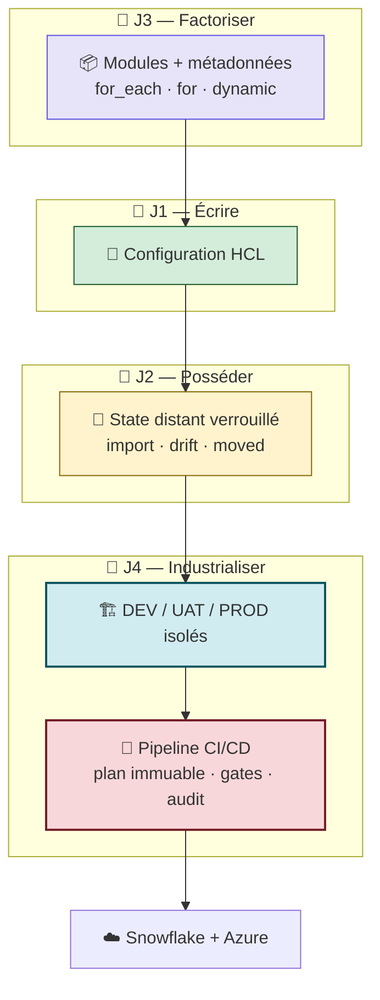

**Les six vérités du Jour 4 :**

| # | Vérité |
|:---:|---|
| 1 | L'isolation a **trois axes**. Le nommage seul n'isole rien. |
| 2 | Les workspaces isolent le state ; les **répertoires** isolent aussi le backend, les droits et la lecture. |
| 3 | **Factorisez la logique, dupliquez le câblage.** Dix lignes lisibles valent mieux qu'une cascade de ternaires. |
| 4 | Un pipeline n'automatise pas le déploiement : il le rend **auditable**. |
| 5 | Le **plan immuable** est ce qui donne un sens à la signature de l'approbateur. |
| 6 | La validation **la moins chère** (`init -backend=false`) est aussi la **moins risquée**. |

---

## D.7 — 🔮 Ce que le Jour 4 laisse en suspens

```mermaid
flowchart TB
    Q1["❓ <b>Mon pipeline a un PAT<br/>avec les droits SYSADMIN.</b><br/>Comment appliquer le moindre<br/>privilège dans Snowflake ?<br/>Et comment supprimer<br/>le dernier secret stocké ?"]
    Q2["❓ <b>Mon pipeline valide la SYNTAXE.</b><br/>Comment lui faire refuser<br/>un warehouse trop cher,<br/>ou un bucket non chiffré ?"]
    Q3["❓ <b>Comment prouver que<br/>la plateforme coûte ce qu'elle<br/>doit coûter ?</b><br/>Et comment livrer<br/>un Data Product gouverné ?"]

    J5["📅 <b>JOUR 5 — Le capstone</b><br/>RBAC as Code · identité JWT + Key Vault<br/>Policy as Code (tfsec · infracost · OPA)<br/>FinOps sur ACCOUNT_USAGE avec dbt<br/>Data Products · soutenance"]

    Q1 --> J5
    Q2 --> J5
    Q3 --> J5

    style Q1 fill:#fff3cd,stroke:#856404
    style Q2 fill:#fff3cd,stroke:#856404
    style Q3 fill:#fff3cd,stroke:#856404
    style J5 fill:#d4edda,stroke:#155724,stroke-width:3px
```

---

## D.8 — 📚 Pour aller plus loin

| Ressource | Pourquoi la consulter |
|---|---|
| *HashiCorp Developer — Managing Workspaces* | La position officielle sur workspaces vs répertoires |
| *HashiCorp Developer — Partial Backend Configuration* | L'alternative `-backend-config` par environnement |
| *HashiCorp Developer — Running Terraform in Automation* | Le guide de référence : `-input=false`, plan immuable, codes de sortie |
| *HashiCorp Developer — Automate Terraform with GitHub Actions* | Le même patron, transposable à Azure DevOps |
| *Microsoft Learn — Azure Pipelines : Environments* | Approvals and checks, exclusive lock, business hours |
| *Microsoft Learn — Variable groups & Key Vault linking* | Le passage du niveau 2 au niveau 3 pour les secrets |
| *Microsoft Learn — Workload Identity Federation* | Supprimer le dernier secret stocké |
| *`tflint` — Rules reference* | Le catalogue des règles activables |

> 🎓 **Préparation aux certifications.** Le Jour 4 couvre l'objectif **4** (*Use Terraform CLI outside core workflow* : workspaces, `-detailed-exitcode`) et l'objectif **6** (*Terraform workflow* : plan enregistré, automatisation) du **Terraform Associate 003**. Côté **AZ-400**, il couvre *Design and implement a strategy for managing infrastructure as code*, *Implement a secure development process* (secrets, gates) et *Design and implement pipelines*.

---

## Navigation

[← Jour 3 — Modules et logique dynamique](../day-03/atelier-jour-03.md) · **Jour 4 — Environnements et CI/CD** · [Jour 5 — Sécurité, FinOps et capstone →](../day-05/atelier-jour-05.md)

*Ateliers sources : `labs/m08-environments/lab.md` · `labs/m07-cicd-pipeline/lab.md`*
