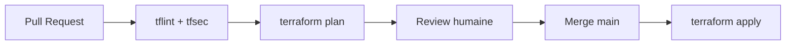

# Module 7 – Slides : Pipeline CI/CD

---

## Slide 1 – Workflow GitOps Terraform

---

## Slide 2 – Outils de qualité

| Outil | Rôle |
|-------|------|
| `terraform fmt -check` | Formatage |
| `terraform validate` | Syntaxe |
| `tflint` | Bonnes pratiques |
| `tfsec` | Sécurité (storage public, etc.) |

---

## Slide 3 – Secrets et variables en CI

- GitHub Secrets / Azure DevOps Variable Groups
- `SNOWFLAKE_PRIVATE_KEY` : encodé en base64, écrit dynamiquement sur l'agent.
- Clés d'accès Cloud (Azure) pour le remote state (Azure Blob).

---

## Slide 4 – Alternative Azure DevOps Server

- Même logique : `Validate` → `Plan` (sur PR) → `Apply` (sur main).
- Utilisation de `azure-pipelines.yml` à la racine.
- Approbation manuelle avec les **Environnements** Azure DevOps.

---

## Atelier – [lab.md](lab.md) + CI/CD configuré

---

## Patterns CI/CD

| Pattern | Application |
|---------|-------------|
| **Plan-on-PR** | `terraform plan` sur chaque Pull Request. |
| **Apply-on-Main** | Déploiement automatique après fusion sur `main`. |
| **Validate First** | `fmt` → `init -backend=false` → `validate` → `tflint`. |
| **Secrets en CI** | Clés privées/accès injectées via secrets de pipeline. |
| **Plan Artifacts** | Plan binaire conservé en artefact pour l'apply. |

