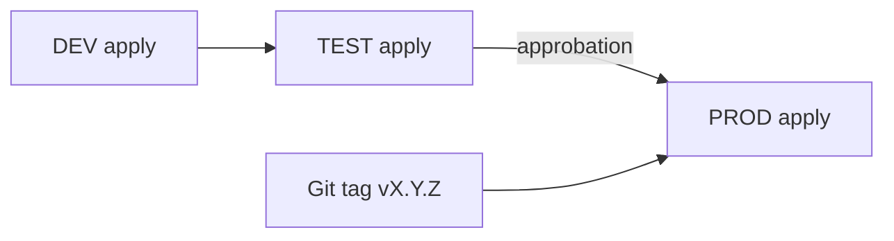

# Module 8 ? Slides : Gestion des environnements

---

## Slide 1 ? Workspaces vs répertoires

| Approche | Avantages | Inconvénients |
|----------|-----------|---------------|
| **Workspaces** | Un code, N states | Même backend key prefix, confusion |
| **Répertoires** (`environments/`) | Clarté, tfvars dédiés | Duplication légère |
| **Terragrunt** | DRY backends | Complexité additionnelle |

**Recommandé formation :** répertoires par env

---

## Slide 2 ? Promotion DEV ? PROD



---

## Slide 3 ? State par environnement

```
azure://container/snowflake/dev/terraform.tfstate
azure://container/snowflake/test/terraform.tfstate
azure://container/snowflake/prod/terraform.tfstate
```

---

## Atelier ? [lab.md](lab.md)

---

## Patterns Environments

| Pattern | Application |
|---------|-------------|
| Directory-based > Workspaces | Dossiers séparés pour DEV/TEST/PROD |
| State Isolation | Clés Azure Blob distinctes par environnement |
| Promotion Flow | DEV → rc → TEST → v → approbation → PROD |
| Matrice de Paramètres | Tableau documentant les différences entre envs |

