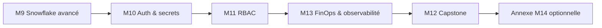

# Jour 5 — Snowflake avancé, sécurité et capstone

**Objectif :** Connecter, sécuriser, gouverner et prouver la plateforme Snowflake de bout en bout.
**Durée :** 6 heures (2 h concepts · 4 h pratique)

> [<- Catalogue](../README.md) · [Jour 4](../day-04/README.md) · **Jour 5** · [Fin de formation ->](../README.md)

---

## Contexte GlobalBank

> *"Lundi, on va en production. Pas d'apply sans review et preuve. Les clés ne voyagent plus sur Slack. Nous devons justifier chaque crédit consommé."*

**Aujourd'hui :** c'est le jour de la mise en production. Vous connectez Snowflake à un stockage externe (préparé par le formateur), passez du PAT à l'authentification RSA/JWT, définissez le RBAC as code, ajoutez des garde-fous FinOps (resource monitors, tags de coût), assemblez le capstone et prouvez le zero-drift.

> **Votre équipe GlobalBank :** chaque équipe sécurise et instrumente ses propres objets — 🔵 resource monitors et rôles, 🟢 stages d'ingestion, 🟠 partages de domaine, 🟣 vues de reporting. Voir [personas-globalbank.md](../shared/docs/personas-globalbank.md).

> Les ressources Azure (storage account, Entra ID) nécessaires à l'external stage et à l'identité technique sont **préconfigurées par le formateur**. Vous consommez les paramètres fournis.

---

## Le capstone : votre preuve finale

Le capstone n'est pas un exercice supplémentaire. C'est la preuve que vous maîtrisez l'ensemble du parcours :

| Critère | Preuve |
|---|---|
| Zero drift | `terraform plan -detailed-exitcode` = 0 |
| RBAC | Action autorisée + action refusée |
| FinOps | Resource monitor attaché + tags de coût sur vos objets |
| Cleanup | Ressources détruites côté Snowflake, limitées au préfixe `APPxx` |
| Explication | Vous pouvez décrire l'architecture et ses limites |

---

## Progression



## Modules

| Module | Durée | Dossier de travail | Lab | Cours | Troubleshooting | Output attendu |
|---|---:|---|---|---|---|---|
| [M9 — Snowflake avancé](module-09-snowflake-advanced/lab.md) | 1 h 30 | `labs/m09-snowflake-advanced/` | [lab](module-09-snowflake-advanced/lab.md) | [cours](module-09-snowflake-advanced/course.md) | [guide](module-09-snowflake-advanced/troubleshooting.md) | [output](module-09-snowflake-advanced/expected-output.md) |
| [M10 — Auth & secrets](module-10-security-auth/lab.md) | 50 min | `labs/m10-security-auth/` | [lab](module-10-security-auth/lab.md) | [cours](module-10-security-auth/course.md) | [guide](module-10-security-auth/troubleshooting.md) | [output](module-10-security-auth/expected-output.md) |
| [M11 — RBAC as Code](module-11-rbac/lab.md) | 1 h | `labs/m11-rbac/` | [lab](module-11-rbac/lab.md) | [cours](module-11-rbac/course.md) | [guide](module-11-rbac/troubleshooting.md) | [output](module-11-rbac/expected-output.md) |
| [M13 — FinOps & observabilité](module-13-finops-observability/lab.md) | 50 min | `labs/m13-finops-observability/` | [lab](module-13-finops-observability/lab.md) | [cours](module-13-finops-observability/course.md) | [guide](module-13-finops-observability/troubleshooting.md) | [output](module-13-finops-observability/expected-output.md) |
| [M12 — Capstone](module-12-capstone/lab.md) | 1 h | `labs/m12-capstone/` | [lab](module-12-capstone/lab.md) | [cours](module-12-capstone/course.md) | [guide](module-12-capstone/troubleshooting.md) | [output](module-12-capstone/expected-output.md) |

### Annexe optionnelle (hors parcours 3+2)

| Module | Dossier de travail | Lab | Cours |
|---|---|---|---|
| [M14 — Data products](module-14-data-products/lab.md) | `labs/m14-data-products/` | [lab](module-14-data-products/lab.md) | [cours](module-14-data-products/course.md) |

> M14 est une **annexe facultative**. Elle n'est pas un critère de réussite du parcours 3+2 et peut être traitée après la formation ou en autonomie.

## Workflow du jour

1. **Lisez** le `course.md` du module (concepts, 15–20 min)
2. **Réalisez** le `lab.md` pas à pas
3. **Comparez** avec `expected-output.md`
4. **Consultez** `troubleshooting.md` en cas d'erreur
5. **Passez** au module suivant

> Chaque lab est **autonome** : il démarre par `Reset-Lab.ps1` et se termine par un cleanup contrôlé. Les ressources sont nommées par module (ex. `APP01_M09_RAW_DEV`).

---

## Livrable du jour

Plateforme Snowflake connectée, sécurisée par RSA/JWT, gouvernée par RBAC as code, instrumentée par des resource monitors et des tags de coût, validée par zero-drift et nettoyée. Capstone : soutenance avec preuves.

---

## Preuves individuelles

- [ ] `terraform plan -detailed-exitcode` = 0 (zero drift)
- [ ] Action autorisée ET action refusée testées via RBAC
- [ ] Un resource monitor est attaché à votre warehouse et des tags de coût à vos objets
- [ ] Cleanup vérifié côté Snowflake, limité au préfixe `APPxx`
- [ ] Vous pouvez expliquer l'architecture et ses limites
- [ ] Vous comprenez la différence entre PAT et RSA/JWT
- [ ] Aucun secret n'apparaît dans Git, les outputs ou les captures

---

## [DÉFI] — Capstone : déploiement complet

**Temps :** 1 h

1. Déployez la plateforme complète (landing zone + module + rôle/grant + ressource d'ingestion)
2. Validez le zero-drift avec `terraform plan -detailed-exitcode`
3. Présentez vos preuves au formateur
4. Détruisez uniquement vos ressources de formation

**Critères de succès :**
- Plan retourne exit code 0
- Aucune erreur de permission
- Cleanup complet et limité au préfixe `APPxx`

---

## Anti-sèche Jour 5

### Authentification Snowflake

| Méthode | Usage | Sécurité |
|---|---|---|
| PAT | Formation / démarrage | ✅ Acceptable |
| RSA Key Pair | Production | ✅ Recommandé |
| OAuth | Enterprise | ✅ Maximum |

> 🔒 Le PAT sert d'amorçage pédagogique. En production, l'authentification RSA/JWT remplace le PAT. Les clés privées ne sont jamais dans Git ni dans les outputs.

### RBAC — Principes

| Principe | Description |
|---|---|
| Least Privilege | Accorder uniquement les droits nécessaires |
| Separation of Duties | Pas de role ADMIN pour tout |
| Future Grants | Donner les droits sur les objets futurs |
| Role Hierarchy | Roles fonctionnels → roles d'accès |

> `ACCOUNTADMIN` n'est jamais une solution de dépannage. Les privilèges de formation sont documentés et bornés.

### Commandes finales

```bash
terraform plan -detailed-exitcode   # Zero drift verification
terraform destroy                   # Nettoyage final (après plan)
SHOW GRANTS LIKE 'APP01_M%';       # Preuve RBAC côté Snowflake
```

---

## Cleanup de fin de formation

```powershell
# Depuis la racine du dépôt — cleanup par lab et par préfixe
.\scripts\Reset-Lab.ps1 -LearnerPrefix APP01 -Lab M09
.\scripts\Reset-Lab.ps1 -LearnerPrefix APP01 -Lab M10
.\scripts\Reset-Lab.ps1 -LearnerPrefix APP01 -Lab M11
.\scripts\Reset-Lab.ps1 -LearnerPrefix APP01 -Lab M13
.\scripts\Reset-Lab.ps1 -LearnerPrefix APP01 -Lab M12
```

> Le cleanup ne détruit que les objets Snowflake associés au préfixe et au lab sélectionnés. Les ressources des autres apprenants et les ressources Azure préconfigurées ne sont pas affectées.

## Navigation

[<- Catalogue](../README.md) · [Jour 4](../day-04/README.md) · **Jour 5** · [Fin de formation ->](../README.md)
