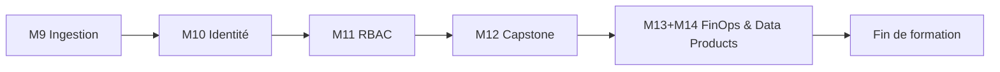

# Jour 5 — Snowflake Avancé, Sécurité, Capstone, FinOps & Data Products

**Objectif :** Composer la plateforme complète, sécuriser l'accès, livrer le capstone et les Data Products.

> [<- Catalogue](../README.md) · [Jour 4](../day-04/README.md) · **Jour 5** · [Fin de formation ->](../README.md)

---

## Contexte GlobalBank

> **Email Sofia Almeida :**
>
> *"Lundi, on va en production. Pas d'apply sans review et preuve.
> Les cles ne voyagent plus sur Slack.
> Nous devons justifier chaque credit consomme."*

**Aujourd'hui :** c'est le jour de la mise en production. Vous securisez
l'acces avec des cles RSA, definissez les droits RBAC, deployez la plateforme
complete avec zero-drift, et prouvez la conformite FinOps.

---

## Le Capstone : Votre Preuve Finale

Le capstone n'est pas un exercice supplementaire. C'est la preuve que vous maitrisez
l'ensemble du parcours :

| Critere | Preuve |
|---------|--------|
| Zero drift | `terraform plan -detailed-exitcode` = 0 |
| RBAC | Action autorisee + action refusee |
| Cleanup | Ressources detruites cote Snowflake ET cote Azure |
| Explication | Vous pouvez decrire l'architecture et ses limites |

---

## Progression



## Modules

| Module | Duree | Repertoire de travail | Lab | Course | Troubleshooting | Resultat attendu |
|---|---:|---|---|---|---|---|
| [M9 — Ingestion et ressources avancées](module-09-snowflake-advanced/lab.md) | 1h30 | `labs/m09-snowflake-advanced/` | [lab](module-09-snowflake-advanced/lab.md) | [cours](module-09-snowflake-advanced/course.md) | [guide](module-09-snowflake-advanced/troubleshooting.md) | [output](module-09-snowflake-advanced/expected-output.md) |
| [M10 — Identité technique et Key Vault](module-10-security-auth/lab.md) | 50 min | `labs/m10-security-auth/` | [lab](module-10-security-auth/lab.md) | [cours](module-10-security-auth/course.md) | [guide](module-10-security-auth/troubleshooting.md) | [output](module-10-security-auth/expected-output.md) |
| [M11 — RBAC as Code](module-11-rbac/lab.md) | 1h | `labs/m11-rbac/` | [lab](module-11-rbac/lab.md) | [cours](module-11-rbac/course.md) | [guide](module-11-rbac/troubleshooting.md) | [output](module-11-rbac/expected-output.md) |
| [M12 — Capstone](module-12-capstone/lab.md) | 1h | `labs/m12-capstone/` | [lab](module-12-capstone/lab.md) | [cours](module-12-capstone/course.md) | [guide](module-12-capstone/troubleshooting.md) | [output](module-12-capstone/expected-output.md) |
| [M13+M14 — FinOps & Data Products](module-13-finops-observability/lab.md) | 1h | `labs/m13-finops-observability/` · `labs/m14-data-products/` | [lab M13](module-13-finops-observability/lab.md) · [lab M14](module-14-data-products/lab.md) | [cours M13](module-13-finops-observability/course.md) · [cours M14](module-14-data-products/course.md) | [guide M13](module-13-finops-observability/troubleshooting.md) · [guide M14](module-14-data-products/troubleshooting.md) | [output M13](module-13-finops-observability/expected-output.md) · [output M14](module-14-data-products/expected-output.md) |

## Workflow du jour

1. **Lisez** le `course.md` du module (concepts, 15-20 min)
2. **Realisez** le `lab.md` pas a pas (creation de fichiers, execution, checkpoints)
3. **Comparez** avec `expected-output.md`
4. **Consultez** `troubleshooting.md` en cas d'erreur
5. **Passez** au module suivant

> Chaque module possede son propre repertoire de travail sous `labs/mXX-name/` (ex. `labs/m09-snowflake-advanced/` pour M9). Chaque lab est **autonome** : il demarre par `Reset-Lab.ps1` pour un environnement propre, possede ses propres fichiers template et se termine par `terraform destroy`. Les ressources sont nommees par module (ex. `APP01_M09_RAW_DEV`).

> `[WINDOWS]` Si l'execution de scripts `.ps1` est bloquee, autorisez les scripts locaux :
> ```powershell
> Set-ExecutionPolicy -Scope CurrentUser -ExecutionPolicy RemoteSigned
> ```

## Notes de trimming (Option C)

- **M12 Capstone** : durée réduite de 2h à 1h (focus sur le déploiement et la validation zero-drift).
- **M13 + M14** : modules fusionnés en une seule session de 1h (FinOps & Data Products combinés).

## Livrable du jour

Plateforme composee et evaluee, pipeline de qualite, indicateurs FinOps et Data Products gouvernes.
Capstone : soutenance avec zero-drift et cleanup verifie.

---

## Preuves individuelles

- [ ] `terraform plan -detailed-exitcode` = 0 (zero drift)
- [ ] Action autorisee et action refusee testees
- [ ] Cleanup verifie cote Snowique ET cote Azure
- [ ] Vous pouvez expliquer l'architecture et ses limites
- [ ] Vous comprenez la difference entre RBAC et security policies

---

## [DEFI] — Capstone : Deploiement Complet

**Temps :** 1h

1. Deployez la plateforme complete
2. Validez le zero-drift avec `terraform plan -detailed-exitcode`
3. Presentez vos preuves au formateur
4. Detruisez les ressources de formation

**Criteres de succes :**
- Plan retourne exit code 0
- Aucune erreur de permission
- Cleanup complet

---

## Anti-seche Jour 5

### Authentification Snowflake

| Methode | Usage | Securite |
|---------|-------|----------|
| PAT | Development/Training | ✅ Acceptable |
| RSA Key Pair | Production | ✅ Recommande |
| OAuth | Enterprise | ✅ Maximum |

### RBAC — Principes

| Principe | Description |
|----------|-------------|
| Least Privilege | Accorder uniquement les droits necessaires |
| Separation of Duties | Pas de role ADMIN pour tout |
| Future Grants | Donner les droits sur les objets futurs |
| Role Hierarchy | Roles fonctionnels → roles d'acces |

### FinOps — Indicateurs Cles

| Metrique | Description |
|----------|-------------|
| Credit Usage | Caux consommes par warehouse |
| Storage Cost | Stockage par database |
| Compute Efficiency | Ratio credits/requetes |

### Commandes finales

```bash
terraform plan -detailed-exitcode   # Zero drift verification
terraform destroy                   # Nettoyage final
```

## Navigation

[<- Catalogue](../README.md) · [Jour 4](../day-04/README.md) · **Jour 5** · [Fin de formation ->](../README.md)
