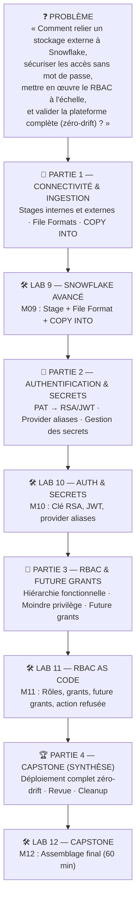

# 🎓 Atelier Jour 5 — Snowflake avancé, sécurité et capstone

## *Stages, COPY INTO, RSA/JWT, RBAC as code, capstone zero-drift et cleanup*

> **Parcours :** Industrialisation d'une Data Platform · **Jour 5 / 5**
> **Modules couverts :** M09 (Snowflake avancé) + M10 (Auth & secrets) + M11 (RBAC) + M12 (Capstone)
> **Annexes optionnelles :** M13 (FinOps) + M14 (Data products) — hors parcours 3+2
> **Durée :** 6 heures (2 h concepts · 4 h pratique)
> **Prérequis :** Jours 1 à 4 terminés — vous maîtrisez le workflow, le state, les modules, CI/CD et multi-environnements
> **Alignement certification :** HashiCorp *Terraform Associate (003)* — Objectifs 8, 9 · Snowflake *SnowPro Core* / *Data Engineer*

---

## 📖 Rappel de la convention de lecture

| Pictogramme | Signification |
|:---:|---|
| 🧠 | **Concept** — théorie, modèle mental, diagramme |
| ❓ | **La question de l'apprenant** |
| 🔬 | **Sous le capot** |
| 📝 | **Action** |
| ✅ | **Checkpoint** |
| ⚠️ | **Piège classique** |
| 🔒 | **Sécurité** |
| 💰 | **Coût (FinOps)** |
| 🎓 | **Point d'examen** |

---

## 🧭 Le fil directeur de la journée

Vous avez industrialisé les déploiements (modules, CI/CD, environnements). Le Jour 5 rassemble l'ensemble des compétences pour connecter, sécuriser et gouverner la plateforme Snowflake de bout en bout, puis valider le capstone zero-drift.



> M13 (FinOps) et M14 (Data products) sont des **annexes optionnelles**, hors parcours 3+2.

---

## ⏱️ Emploi du temps équilibré (6H)

| Créneau | Durée | Type | Contenu |
|---|:---:|:---:|---|
| 09:00 - 09:45 | 45 min | 🧠 Concept | Snowflake avancé (M09) & Auth RSA/JWT (M10) |
| 09:45 - 11:15 | 1h30 | 🛠️ Pratique | **Lab M09** — Stages, File Formats, COPY INTO (1h30) |
| 11:15 - 12:05 | 50 min | 🛠️ Pratique | **Lab M10** — RSA/JWT, Provider aliases, Secrets (50 min) |
| 12:05 - 12:35 | 30 min | 🧠 Concept | RBAC scalable, hiérarchies et Future Grants (M11) |
| *12:35 - 13:35* | *1h00* | 🥪 *Pause déjeuner* | |
| 13:35 - 14:35 | 1h00 | 🛠️ Pratique | **Lab M11** — RBAC as Code et Future Grants (60 min) |
| 14:35 - 15:35 | 1h00 | 🏆 Synthèse | **Lab M12** — Capstone Plateforme complète & Zéro-Drift (60 min) |
| 15:35 - 16:55 | 1h20 | 🎯 Clôture | Soutenances, Q&A certification, cleanup final |
| *Optionnel* | *1h00* | � Annexe | M13 FinOps / M14 Data products (hors parcours 3+2) |

**Total : 6h nettes** (2h concepts/synthèse · 4h pratique).

---

## 1. Modules & Travaux Pratiques

### M09 — Ressources Snowflake avancées & Ingestion
- **Cours :** [courses/day-05/module-09-snowflake-advanced/course.md](module-09-snowflake-advanced/course.md)
- **Lab :** [courses/day-05/module-09-snowflake-advanced/lab.md](module-09-snowflake-advanced/lab.md)
- **Dossier de travail :** `labs/m09-snowflake-advanced/`

### M10 — Sécurité, Identité & Azure Key Vault
- **Cours :** [courses/day-05/module-10-security-auth/course.md](module-10-security-auth/course.md)
- **Lab :** [courses/day-05/module-10-security-auth/lab.md](module-10-security-auth/lab.md)
- **Dossier de travail :** `labs/m10-security-auth/`

### M11 — RBAC Scalable & Future Grants
- **Cours :** [courses/day-05/module-11-rbac/course.md](module-11-rbac/course.md)
- **Lab :** [courses/day-05/module-11-rbac/lab.md](module-11-rbac/lab.md)
- **Dossier de travail :** `labs/m11-rbac/`

### M12 — Projet Capstone (Synthèse)
- **Cours :** [courses/day-05/module-12-capstone/course.md](module-12-capstone/course.md)
- **Lab :** [courses/day-05/module-12-capstone/lab.md](module-12-capstone/lab.md)
- **Dossier de travail :** `labs/m12-capstone/`
- **Objectif :** Déploiement complet, audit `terraform plan -detailed-exitcode` = 0 (zéro drift).

### M13 + M14 — FinOps, Observabilité & Data Products (Annexes optionnelles)

> Ces modules sont **hors parcours 3+2**. Ils peuvent être traités en autonomie après la formation.

- **Cours FinOps :** [courses/day-05/module-13-finops-observability/course.md](module-13-finops-observability/course.md)
- **Lab FinOps :** [courses/day-05/module-13-finops-observability/lab.md](module-13-finops-observability/lab.md)
- **Cours Data Products :** [courses/day-05/module-14-data-products/course.md](module-14-data-products/course.md)
- **Lab Data Products :** [courses/day-05/module-14-data-products/lab.md](module-14-data-products/lab.md)
- **Dossier de travail :** `labs/m13-finops-observability/` & `labs/m14-data-products/`

---

## 🧹 Procédure de fin de formation (Cleanup)

À l'issue du Capstone :

```powershell
cd "$HOME\Data2AI-Labs\data-platform"
# Exécuter les resets lab par lab pour chaque apprenant
.\scripts\Reset-Lab.ps1 -LearnerPrefix APP01 -Lab M09
.\scripts\Reset-Lab.ps1 -LearnerPrefix APP01 -Lab M10
.\scripts\Reset-Lab.ps1 -LearnerPrefix APP01 -Lab M11
.\scripts\Reset-Lab.ps1 -LearnerPrefix APP01 -Lab M12
```

> Le cleanup ne détruit que les objets Snowflake associés au préfixe et au lab sélectionnés. Les ressources des autres apprenants et les ressources Azure préconfigurées ne sont pas affectées.

---

## Navigation

[← Jour 4 — Environnements et CI/CD](../day-04/atelier-jour-04.md) · **Jour 5 — Snowflake avancé, sécurité et capstone** · [Fin de formation (Catalogue) →](../README.md)

*Ateliers sources : `labs/m09-snowflake-advanced/lab.md` · `labs/m10-security-auth/lab.md` · `labs/m11-rbac/lab.md` · `labs/m12-capstone/lab.md` · `labs/m13-finops-observability/lab.md` · `labs/m14-data-products/lab.md` (annexes optionnelles)*
