# 🎓 Atelier Jour 5 — Sécurité avancée, Capstone, FinOps & Data Products

## *Ingestion Azure, Key Vault, RBAC granulaire, Capstone zéro-drift et gouvernance FinOps*

> **Parcours :** Industrialisation d'une Data Platform · **Jour 5 / 5**
> **Modules couverts :** M09 (Ingestion/Stages) + M10 (Key Vault & Auth) + M11 (RBAC & Grants) + M12 (Capstone) + M13/M14 (FinOps & Data Products)
> **Durée :** 6 heures (2 h concepts · 4 h pratique — Option C : Capstone 1h, M13+M14 1h)
> **Prérequis :** Jours 1 à 4 terminés — vous maîtrisez le workflow, le state, les modules, CI/CD et multi-environnements
> **Alignement certification :** HashiCorp *Terraform Associate (003)* — Objectifs 8, 9 · Snowflake *SnowPro Core* / *Data Engineer* · Microsoft *AZ-400*

---

## 📖 Rappel de la convention de lecture

| Pictogramme | Signification |
|:---:|---|
| 🧠 | **Concept** — théorie, modèle mental, diagramme |
| ❓ | **La question de l'apprenant** |
| 🔬 | **Sous le capot** |
| 📝 | **Action** |
| ✅ | **Checkpoint** |
| ⚠️ | **Piège classique** |
| 🔒 | **Sécurité** |
| 💰 | **Coût (FinOps)** |
| 🎓 | **Point d'examen** |

---

## 🧭 Le fil directeur de la journée

Vous avez industrialisé les déploiements (modules, CI/CD, environnements). Le Jour 5 rassemble l'ensemble des compétences pour construire et sécuriser la plateforme de bout en bout, passer la soutenance Capstone, et activer l'observabilité FinOps ainsi que la distribution en Data Products.

```mermaid
flowchart TD
    Q0["❓ PROBLÈME<br/>« Comment relier Azure Storage à Snowflake,<br/>sécuriser les accès sans mot de passe,<br/>mettre en œuvre le RBAC à l'échelle,<br/>valider la plateforme complète (zéro-drift),<br/>et piloter les coûts et data products ? »"]

    Q1["🧠 PARTIE 1 — INGESTION & SÉCURITÉ<br/>Storage Integration Azure · File Formats · Pipes<br/>Key Vault · Clés RSA · Rôles système Snowflake"]
    Q2["🛠️ LABS 9 & 10 — INGESTION & IDENTITÉ<br/>M09 : Stage externe Azure + Copy/Pipe<br/>M10 : Azure Key Vault + Service Principal + JWT"]

    Q3["🧠 PARTIE 2 — RBAC SCALABLE & FUTURE GRANTS<br/>Hiérarchie fonctionnelle · Moindre privilège<br/>Future grants sur schemas et tables"]
    Q4["🛠️ LAB 11 — RBAC AS CODE<br/>M11 : Déploiement des rôles, grants et privilèges futurs"]

    Q5["🏆 PARTIE 3 — CAPSTONE (SYNTHÈSE)<br/>Déploiement complet zéro-drift<br/>Revue d'architecture · Validation automatique"]
    Q6["🛠️ LAB 12 — CAPSTONE PLATFORME<br/>M12 : Assemblage final (60 min)"]

    Q7["📊 PARTIE 4 — FINOPS & DATA PRODUCTS<br/>dbt sur ACCOUNT_USAGE · Resource Monitors<br/>Contrats de données et distribution Medallion"]
    Q8["🛠️ LABS 13+14 — OBSERVABILITÉ & PRODUITS<br/>M13+M14 : Modèles FinOps + Data Products (60 min)"]

    Q0 --> Q1 --> Q2 --> Q3 --> Q4 --> Q5 --> Q6 --> Q7 --> Q8
```



---

## ⏱️ Emploi du temps équilibré (6H — Option C)

| Créneau | Durée | Type | Contenu |
|---|:---:|:---:|---|
| 09:00 - 09:45 | 45 min | 🧠 Concept | Ingestion avancée (M09) & Sécurité Key Vault/JWT (M10) |
| 09:45 - 11:15 | 1h30 | 🛠️ Pratique | **Lab M09** — Ingestion Azure Blob & Stage Snowflake (1h30) |
| 11:15 - 12:05 | 50 min | 🛠️ Pratique | **Lab M10** — Azure Key Vault & Authentification JWT (50 min) |
| 12:05 - 12:35 | 30 min | 🧠 Concept | Modèle RBAC scalable, hiérarchies et Future Grants (M11) |
| *12:35 - 13:35* | *1h00* | 🥪 *Pause déjeuner* | |
| 13:35 - 14:35 | 1h00 | 🛠️ Pratique | **Lab M11** — RBAC as Code et Future Grants (60 min) |
| 14:35 - 15:35 | 1h00 | 🏆 Synthèse | **Lab M12** — Capstone Plateforme complète & Zéro-Drift (60 min) |
| 15:35 - 15:55 | 20 min | 🧠 Concept | FinOps as Code & Data Products (M13+M14) |
| 15:55 - 16:55 | 1h00 | 🛠️ Pratique | **Labs M13+M14** — Observabilité FinOps dbt & Data Products (60 min) |
| 16:55 - 17:05 | 10 min | 🎯 Clôture | Bilan de formation, Q&A certification, cleanup final |

**Total : 6h05 nettes** (2h05 concepts/synthèse · 4h00 pratique).

---

## 1. Modules & Travaux Pratiques

### M09 — Ressources Snowflake avancées & Ingestion
- **Cours :** [courses/day-05/module-09-snowflake-advanced/course.md](module-09-snowflake-advanced/course.md)
- **Lab :** [courses/day-05/module-09-snowflake-advanced/lab.md](module-09-snowflake-advanced/lab.md)
- **Dossier de travail :** `labs/m09-snowflake-advanced/`

### M10 — Sécurité, Identité & Azure Key Vault
- **Cours :** [courses/day-05/module-10-security-auth/course.md](module-10-security-auth/course.md)
- **Lab :** [courses/day-05/module-10-security-auth/lab.md](module-10-security-auth/lab.md)
- **Dossier de travail :** `labs/m10-security-auth/`

### M11 — RBAC Scalable & Future Grants
- **Cours :** [courses/day-05/module-11-rbac/course.md](module-11-rbac/course.md)
- **Lab :** [courses/day-05/module-11-rbac/lab.md](module-11-rbac/lab.md)
- **Dossier de travail :** `labs/m11-rbac/`

### M12 — Projet Capstone (Synthèse)
- **Cours :** [courses/day-05/module-12-capstone/course.md](module-12-capstone/course.md)
- **Lab :** [courses/day-05/module-12-capstone/lab.md](module-12-capstone/lab.md)
- **Dossier de travail :** `labs/m12-capstone/`
- **Objectif :** Déploiement complet, audit `terraform plan -detailed-exitcode` = 0 (zéro drift).

### M13 + M14 — FinOps, Observabilité & Data Products
- **Cours FinOps :** [courses/day-05/module-13-finops-observability/course.md](module-13-finops-observability/course.md)
- **Lab FinOps :** [courses/day-05/module-13-finops-observability/lab.md](module-13-finops-observability/lab.md)
- **Cours Data Products :** [courses/day-05/module-14-data-products/course.md](module-14-data-products/course.md)
- **Lab Data Products :** [courses/day-05/module-14-data-products/lab.md](module-14-data-products/lab.md)
- **Dossier de travail :** `labs/m13-finops-observability/` & `labs/m14-data-products/`

---

## 🧹 Procédure de fin de formation (Cleanup)

À l'issue des présentations du Capstone et des exercices FinOps :

```powershell
cd "$HOME\Data2AI-Labs\data-platform"
# Exécuter les resets de chaque lab ou détruire l'environnement global
terraform -chdir=environments/dev destroy -auto-approve
```

---

## Navigation

[← Jour 4 — Environnements et CI/CD](../day-04/atelier-jour-04.md) · **Jour 5 — Sécurité, FinOps et Capstone** · [Fin de formation (Catalogue) →](../README.md)

*Ateliers sources : `labs/m09-snowflake-advanced/lab.md` · `labs/m10-security-auth/lab.md` · `labs/m11-rbac/lab.md` · `labs/m12-capstone/lab.md` · `labs/m13-finops-observability/lab.md` · `labs/m14-data-products/lab.md`*
