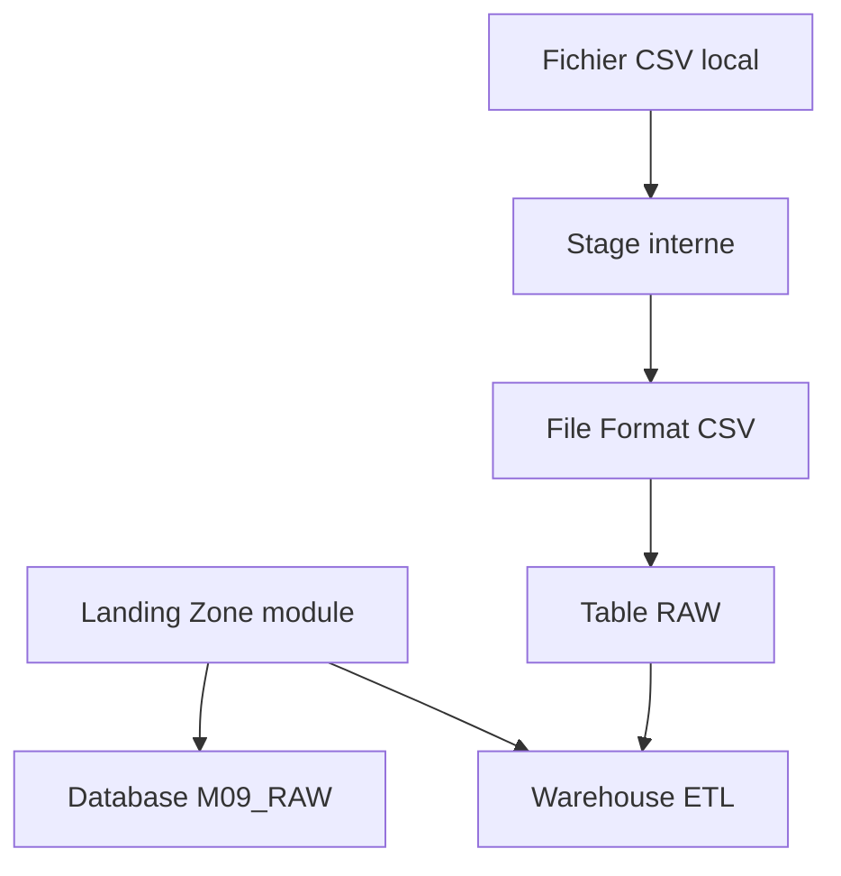

# 🧪 Lab M9 — Ressources Snowflake avancées : Stages, File Formats, Pipes

> [<- Jour 5](../README.md) · [<- Jour 4](../../day-04/README.md) · **Module 09** · [Module suivant ->](../module-10-security-auth/lab.md)

|| Élément | Valeur |
||---|---|
|| **Durée** | 90 min |
|| **Piste** | `[CORE]` |
|| **Workspace** | `$HOME/Data2AI-Labs/data-platform` (le clone) |
|| **Dossier de travail** | `labs/m09-snowflake-advanced/` |
|| **Coût** | Warehouse X-SMALL pour COPY |
|| **Cleanup** | `terraform destroy -auto-approve` à la fin |

> `[IMPORTANT]` Avant de commencer, vous devez etre dans la racine du clone
> et avoir execute `Learner-Login.ps1 -SnowflakeOnly` dans **cette session** :
>
> ```powershell
> cd "$HOME\Data2AI-Labs\data-platform"
> .\scripts\Learner-Login.ps1 -LearnerPrefix APP01 -SnowflakeOnly
> ```
>
> Cela set `TF_VAR_snowflake_token` (depuis `secrets/snowflake_pat.txt`)
> et `LEARNER_PREFIX`. Aucun login Azure n'est requis pour ce lab (state local).
>
> Ensuite, réinitialisez le lab pour partir d'un état propre :
>
> ```powershell
> .\scripts\Reset-Lab.ps1 -LearnerPrefix APP01 -Lab M09
> ```
>
> Puis placez-vous dans le dossier du lab et vérifiez que tout est prêt :
>
> ```powershell
> cd labs\m09-snowflake-advanced
> ..\..\scripts\Test-TerraformReady.ps1
> ```
>
> Si le pre-flight affiche `READY`, lancez `terraform plan -out "m09.tfplan"`.
> Sinon, suivez les corrections indiquees.

## 🎯 1. Mission Métier & User Story

La valeur Data commence quand les fichiers arrivent de façon fiable dans Snowflake. Vous allez créer un module d'ingestion avec un stage interne, un file format CSV et une table cible, le tout dans un lab auto-contenu qui crée également sa propre base de données.

> **En tant que :** Data Engineer  
> **Je veux :** créer un module d'ingestion Snowflake avec stage, file format et table  
> **Afin de :** charger des fichiers CSV de façon fiable et auditable
> **Votre persona GlobalBank :** appliquez ce lab sur les objets de votre équipe — 🔵 Platform, 🟢 Data Engineering, 🟠 Business Data, 🟣 BI (voir [personas-globalbank.md](../../../shared/docs/personas-globalbank.md)).


---

## 🏗️ 2. Architecture & Modèle Mental

```mermaid
flowchart LR
    M8[M8 — Environments] --> M9[M9 — Ingestion]
    M9 --> M10[M10 — Security]
```





## 🎯 3. Objectifs Pédagogiques Vérifiables

- créer un module `landing-zone` avec une base de données et un warehouse;
- créer un module `ingestion` avec stage, file format et table;
- comprendre la différence entre stage interne et externe;
- configurer un file format CSV;
- charger un fichier de test via `snow sql`;
- vérifier les données chargées.

## � 4. Pre-Flight Diagnostic (Vérification Initiale)

### Prérequis

- [ ] Jour 0 terminé : `Toolchain status: READY`;
- [ ] `snow sql -q 'SELECT 1' -c training` réussit;
- [ ] le clone `data-platform-starter` existe sous `$HOME/Data2AI-Labs/data-platform`;
- [ ] vous connaissez votre préfixe unique (variable `LEARNER_PREFIX` dans `.env`).

## 📝 5. Étapes d'Implémentation Pas-à-Pas (80% Hands-On)

### 📝 Étape 5.1 — Créer le module landing-zone

Ce lab est auto-contenu : il crée sa propre base de données avec un nom spécifique au module (`APP01_M09_RAW_DEV`). Le module `landing-zone` est identique à celui du M5, mais avec une variable `lab_id` pour produire des noms uniques par lab.

#### Créer la structure

```bash
cd $HOME/Data2AI-Labs/data-platform/labs/m09-snowflake-advanced
New-Item -ItemType Directory -Force -Path "modules/landing-zone" | Out-Null
```

#### Créer `modules/landing-zone/variables.tf`

```hcl
variable "learner_prefix" {
  type        = string
  description = "Unique uppercase prefix assigned to the learner"

  validation {
    condition     = can(regex("^[A-Z][A-Z0-9]{2,4}$", var.learner_prefix))
    error_message = "learner_prefix must contain 3-5 uppercase letters or digits."
  }
}

variable "lab_id" {
  type        = string
  description = "Lab identifier for resource naming (e.g. M09)"
}

variable "environment" {
  type        = string
  description = "Deployment environment"
  default     = "DEV"

  validation {
    condition     = contains(["DEV", "UAT", "PROD"], var.environment)
    error_message = "environment must be DEV, UAT or PROD."
  }
}

variable "warehouse_size" {
  type        = string
  description = "Warehouse size"
  default     = "X-SMALL"

  validation {
    condition     = contains(["X-SMALL", "SMALL", "MEDIUM"], var.warehouse_size)
    error_message = "warehouse_size must be X-SMALL, SMALL or MEDIUM."
  }
}

variable "data_retention_days" {
  type        = number
  description = "Time travel retention in days"
  default     = 1
}

variable "auto_suspend_seconds" {
  type        = number
  description = "Warehouse auto-suspend in seconds"
  default     = 60
}
```

#### Créer `modules/landing-zone/main.tf`

```hcl
locals {
  database_name  = "${var.learner_prefix}_${var.lab_id}_RAW_${var.environment}"
  schema_name    = "INGESTION"
  warehouse_name = "WH_${var.learner_prefix}_${var.lab_id}_ETL_${var.environment}"
  common_comment = "Managed by Terraform | Landing Zone | ${var.learner_prefix} | ${var.lab_id}"
}

resource "snowflake_database" "raw" {
  name                        = local.database_name
  comment                     = local.common_comment
  data_retention_time_in_days = var.data_retention_days
}

resource "snowflake_schema" "ingestion" {
  database = snowflake_database.raw.name
  name     = local.schema_name
  comment  = local.common_comment
}

resource "snowflake_warehouse" "etl" {
  name                = local.warehouse_name
  comment             = local.common_comment
  warehouse_size      = var.warehouse_size
  auto_suspend        = var.auto_suspend_seconds
  auto_resume         = true
  initially_suspended = true
}
```

> 💡 **Note** : La variable `lab_id` produit le nom `APP01_M09_RAW_DEV` au lieu de `APP01_RAW_DEV`. Cela isole les ressources de ce lab de celles des autres labs.

#### Créer `modules/landing-zone/outputs.tf`

```hcl
output "database_name" {
  value       = snowflake_database.raw.name
  description = "RAW database name"
}

output "schema_name" {
  value       = snowflake_schema.ingestion.name
  description = "Ingestion schema name"
}

output "warehouse_name" {
  value       = snowflake_warehouse.etl.name
  description = "ETL warehouse name"
}
```

#### Créer `modules/landing-zone/versions.tf`

```hcl
terraform {
  required_version = ">= 1.14.0, < 2.0.0"

  required_providers {
    snowflake = {
      source  = "snowflakedb/snowflake"
      version = "= 2.14.0"
    }
  }
}
```

#### Formater et valider

```bash
cd modules/landing-zone
terraform init
terraform fmt
terraform validate
```

✅ **Checkpoint** : `The configuration is valid.`

### 📝 Étape 5.2 — Créer le module ingestion

#### Créer la structure

```bash
cd $HOME/Data2AI-Labs/data-platform/labs/m09-snowflake-advanced
New-Item -ItemType Directory -Force -Path "modules/ingestion" | Out-Null
```

#### Créer `modules/ingestion/variables.tf`

```hcl
variable "database" {
  type        = string
  description = "Target database name"
}

variable "schema" {
  type        = string
  description = "Target schema name"
  default     = "INGESTION"
}

variable "table_name" {
  type        = string
  description = "Target table name"
  default     = "RAW_CUSTOMERS"
}

variable "stage_name" {
  type        = string
  description = "Internal stage name"
  default     = "STG_RAW_CUSTOMERS"
}
```

#### Créer `modules/ingestion/main.tf`

```hcl
resource "snowflake_file_format" "csv" {
  name        = "FF_CSV"
  database    = var.database
  schema      = var.schema
  format_type = "CSV"

  field_delimiter              = ","
  skip_header                  = 1
  null_if                      = ["", "NULL"]
  field_optionally_enclosed_by = "\""
  empty_field_as_null          = true
  error_on_column_count_mismatch = true
}

resource "snowflake_stage" "raw" {
  name        = var.stage_name
  database    = var.database
  schema      = var.schema
  comment     = "Internal stage for raw customer files"

  file_format = "FORMAT_NAME = ${snowflake_file_format.csv.fully_qualified_name}"
}

resource "snowflake_table" "raw_customers" {
  name     = var.table_name
  database = var.database
  schema   = var.schema
  comment  = "Raw customer data loaded from stage"

  column {
    name = "ID"
    type = "NUMBER(38,0)"
  }

  column {
    name = "FIRST_NAME"
    type = "VARCHAR(100)"
  }

  column {
    name = "LAST_NAME"
    type = "VARCHAR(100)"
  }

  column {
    name = "EMAIL"
    type = "VARCHAR(255)"
  }

  column {
    name    = "LOADED_AT"
    type    = "TIMESTAMP_NTZ(9)"
    default = "CURRENT_TIMESTAMP()"
  }
}
```

#### Créer `modules/ingestion/outputs.tf`

```hcl
output "stage_name" {
  value = snowflake_stage.raw.name
}

output "file_format_name" {
  value = snowflake_file_format.csv.name
}

output "table_name" {
  value = snowflake_table.raw_customers.name
}
```

#### Créer `modules/ingestion/versions.tf`

```hcl
terraform {
  required_version = ">= 1.14.0, < 2.0.0"

  required_providers {
    snowflake = {
      source  = "snowflakedb/snowflake"
      version = "= 2.14.0"
    }
  }
}
```

#### Formater et valider

```bash
cd modules/ingestion
terraform fmt
terraform validate
```

### 📝 Étape 5.3 — Appeler les modules depuis le lab

#### Ajouter les variables lab-specific dans `variables.tf`

Les fichiers `provider.tf`, `versions.tf` et `variables.tf` existent déjà dans `labs/m09-snowflake-advanced/`. Ajoutez ces variables à la fin de `variables.tf` :

```hcl
variable "lab_id" {
  type        = string
  description = "Lab identifier for resource naming"
  default     = "M09"
}

variable "warehouse_size" {
  type        = string
  description = "Training warehouse size"
  default     = "X-SMALL"

  validation {
    condition     = contains(["X-SMALL", "SMALL"], var.warehouse_size)
    error_message = "Training warehouses must be X-SMALL or SMALL."
  }
}
```

#### Créer `terraform.tfvars`

Copiez le fichier d'exemple et complétez-le :

```powershell
Copy-Item terraform.tfvars.example terraform.tfvars
```

Vérifiez que `learner_prefix = "APP01"` (ou votre préfixe) et `environment = "DEV"`.

#### Écrire `main.tf`

**Remplacez tout le contenu** de `main.tf` par :

```hcl
module "landing_zone" {
  source               = "./modules/landing-zone"
  learner_prefix       = var.learner_prefix
  lab_id               = var.lab_id
  environment          = var.environment
  warehouse_size       = var.warehouse_size
  data_retention_days  = 1
  auto_suspend_seconds = 60
}

module "ingestion" {
  source     = "./modules/ingestion"
  database   = module.landing_zone.database_name
  schema     = module.landing_zone.schema_name
  table_name = "RAW_CUSTOMERS"
  stage_name = "STG_RAW_CUSTOMERS"
}
```

> � **Note** : Les modules sont référencés avec `./modules/...` car ils se trouvent dans le même dossier de lab (`labs/m09-snowflake-advanced/modules/`).

#### Écrire `outputs.tf`

**Remplacez tout le contenu** de `outputs.tf` par :

```hcl
output "database_name" {
  value = module.landing_zone.database_name
}

output "warehouse_name" {
  value = module.landing_zone.warehouse_name
}

output "ingestion_stage" {
  value = module.ingestion.stage_name
}

output "ingestion_table" {
  value = module.ingestion.table_name
}
```

#### Planifier et appliquer

```bash
cd $HOME/Data2AI-Labs/data-platform/labs/m09-snowflake-advanced
terraform fmt
terraform init
terraform validate
terraform plan -out "m09.tfplan"
```

✅ **Checkpoint** : `6 to add` — database, schema, warehouse, file format, stage et table.

```bash
terraform apply m09.tfplan
```

✅ **Checkpoint** : `Apply complete! Resources: 6 added, 0 changed, 0 destroyed.`

#### Vérifier dans Snowflake

```bash
snow sql -c training -q "SHOW DATABASES LIKE 'APP01_M09_RAW_DEV'"
snow sql -c training -q "SHOW WAREHOUSES LIKE 'WH_APP01_M09_ETL_DEV'"
```

Remplacez `APP01` par votre préfixe.

### 📝 Étape 5.4 — Charger un fichier de test

#### Créer un fichier CSV de test

```powershell
@'
ID,FIRST_NAME,LAST_NAME,EMAIL
1,Alice,Smith,alice@example.com
2,Bob,Jones,bob@example.com
3,Charlie,Brown,charlie@example.com
'@ | Set-Content "$env:TEMP\customers.csv"
```

#### Uploader le fichier vers le stage

```powershell
$csvPath = (Resolve-Path "$env:TEMP\customers.csv").Path -replace '\\','/'
snow sql -c training -q "PUT file:///$csvPath @APP01_M09_RAW_DEV.INGESTION.STG_RAW_CUSTOMERS AUTO_COMPRESS=TRUE"
```

Remplacez `APP01` par votre préfixe.

#### Charger les données dans la table

```bash
snow sql -c training -q "COPY INTO APP01_M09_RAW_DEV.INGESTION.RAW_CUSTOMERS (ID, FIRST_NAME, LAST_NAME, EMAIL) FROM @APP01_M09_RAW_DEV.INGESTION.STG_RAW_CUSTOMERS FILE_FORMAT = (FORMAT_NAME = APP01_M09_RAW_DEV.INGESTION.FF_CSV) ON_ERROR = 'ABORT_STATEMENT'"
```

#### Vérifier les données dans le terminal

```bash
snow sql -c training -q "SELECT COUNT(*) FROM APP01_M09_RAW_DEV.INGESTION.RAW_CUSTOMERS"
snow sql -c training -q "SELECT * FROM APP01_M09_RAW_DEV.INGESTION.RAW_CUSTOMERS LIMIT 5"
```

✅ **Checkpoint** : 3 lignes avec les données du fichier CSV.

#### Prévisualisation Visuelle dans Snowflake Snowsight

1. Ouvrez votre navigateur sur **[app.snowflake.com](https://app.snowflake.com)**.
2. Naviguez vers **Data > Databases > APP01_M09_RAW_DEV > INGESTION > Tables > RAW_CUSTOMERS**.
3. Cliquez sur l'onglet **Data Preview** :
   - Constatez l'affichage graphique des 3 enregistrements (`ID`, `FIRST_NAME`, `LAST_NAME`, `EMAIL`).
4. Cliquez sur **Worksheets > + SQL Worksheet** et observez l'historique des requêtes (*Query History*) pour visualiser le graphe d'exécution de votre commande `COPY INTO`.

---

### 📝 Étape 5.5 — Ingestion Hybride Externe ADLS Gen2 (Pattern Enterprise)

#### Comprendre la différence Architectural

| Critère | Stage interne | Stage externe Azure ADLS Gen2 |
|---|---|---|
| Stockage physique | Dans le compte Snowflake | Compte Azure Blob / ADLS Gen2 managé |
| Gestion des fichiers | Commandes `PUT` Snowflake | Azure Storage Explorer, API, Pipelines Azure |
| Coût de conservation | Facturation Snowflake | Facturation Azure Blob (très économique) |
| Cas d'usage recommandé | Développements & petits volumes | **Production d'entreprise, Data Lakes** |

#### Déclaration de la Storage Integration Azure

En entreprise, la délégation d'identité repose sur un Principal de Service Microsoft Entra ID (*Zero Shared Secrets*) :

```hcl
resource "snowflake_storage_integration" "azure" {
  name                      = "APP01_INT_ADLS_GEN2"
  type                      = "AZURE_BLOB_STORAGE"
  azure_tenant_id           = var.arm_tenant_id
  enabled                   = true
  storage_allowed_locations = ["azure://${var.arm_storage_account}.blob.core.windows.net/data-raw/"]
}
```

---

## 🐛 6. Incident Contrôlé (*Chaos Engineering Lab*)

*En production, les fichiers sources contiennent parfois des formats anormaux. Vous allez tester le comportement défensif de Snowflake.*

### Symptôme & Injection

Créez un fichier contenant un champ texte au lieu d'un ID numérique :

```powershell
@'
ID,FIRST_NAME,LAST_NAME,EMAIL
NON_NUMERIQUE,Daniel,Faussaire,daniel@bad.com
'@ | Set-Content "$env:TEMP\bad_customers.csv"
```

Upload vers le stage :

```powershell
$badCsvPath = (Resolve-Path "$env:TEMP\bad_customers.csv").Path -replace '\\','/'
snow sql -c training -q "PUT file:///$badCsvPath @APP01_M09_RAW_DEV.INGESTION.STG_RAW_CUSTOMERS"
```

### Diagnostic & Observation

Exécution du COPY INTO :

```bash
snow sql -c training -q "COPY INTO APP01_M09_RAW_DEV.INGESTION.RAW_CUSTOMERS FROM @APP01_M09_RAW_DEV.INGESTION.STG_RAW_CUSTOMERS/bad_customers.csv FILE_FORMAT = (FORMAT_NAME = APP01_M09_RAW_DEV.INGESTION.FF_CSV) ON_ERROR = 'ABORT_STATEMENT'"
```

Snowflake rejette la transaction entière :

```text
Numeric value 'NON_NUMERIQUE' is not recognized. File 'bad_customers.csv.gz', line 2, character 1.
```

### Remédiation FinOps

Utilisez `ON_ERROR = 'CONTINUE'` ou `VALIDATION_MODE = 'RETURN_ERRORS'` pour auditer les rejets sans interrompre le pipeline d'ingestion.

---

## 🤖 7. Validation Automatisée (*Check My Progress*)

Exécutez le script d'évaluation pour valider l'ensemble du module d'ingestion :

```powershell
.\scripts\SelfPacedLab.ps1 -Module 9 -All -Report
```

✅ **Résultat attendu :**
```text
[PASS] T1 Landing zone module instantiated
[PASS] T2 Ingestion module declared (Stage, Format, Table)
[PASS] T3 terraform fmt & validate passed
[PASS] T4 Resources deployed to Snowflake
[PASS] T5 Data ingestion verified via COPY INTO
Result: 5/5 Tasks Passed.
```

---

## 🏆 8. Défi Autonome (*Unguided Challenge*)

> **Scénario :** Ajoutez une seconde table `RAW_ORDERS` avec 4 colonnes (ORDER_ID, CUSTOMER_ID, AMOUNT, ORDER_DATE) et chargez un fichier de test.
> **Contraintes :**
> - `terraform plan` crée la nouvelle table;
> - le chargement `COPY INTO` réussit;
> - `SELECT COUNT(*)` retourne le bon nombre de lignes.

| Critère d'Évaluation | Points |
|---|---:|
| Syntaxe HCL et respect des standards | 30 pts |
| Preuve d'exécution fonctionnelle | 30 pts |
| Idempotence (`0 to add, 0 to change, 0 to destroy`) | 20 pts |
| Respect des budgets FinOps & Sécurité | 20 pts |
| **Total** | **100 pts** |

## 🧹 9. Nettoyage Contrôlé (*FinOps Teardown*)

Détruisez toutes les ressources créées par ce lab :

```bash
cd $HOME/Data2AI-Labs/data-platform/labs/m09-snowflake-advanced
terraform destroy -auto-approve
```

> 💡 **Note** : Vous pouvez aussi utiliser `.\scripts\Reset-Lab.ps1 -LearnerPrefix APP01 -Lab M09` depuis la racine du clone pour nettoyer le state Terraform **et** les ressources Snowflake restantes.

---

## Navigation

[<- Lab M8](../../day-04/module-08-environments/lab.md) · [<- Jour 5](../README.md) · **Lab M9** · [Lab M10 ->](../module-10-security-auth/lab.md)
