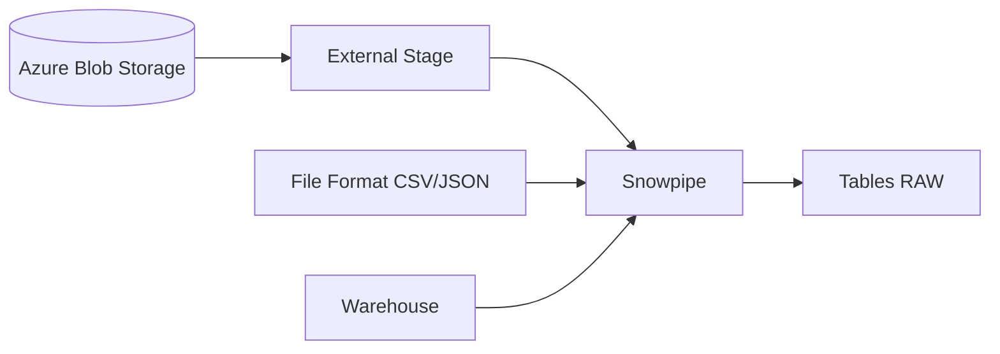

# Module 9 ? Slides : Ressources Snowflake avancées

---

## Slide 1 ? Stack Data Ingestion



---

## Slide 2 ? Warehouses avancés

```hcl
resource "snowflake_warehouse" "etl" {
  warehouse_size                    = "SMALL"
  auto_suspend                      = 60
  auto_resume                       = true
  initially_suspended               = true
  max_cluster_count                 = 2
  min_cluster_count                 = 1
  scaling_policy                    = "STANDARD"
}
```

---

## Slide 3 ? Ressources clés

| Ressource TF | Snowflake |
|--------------|-----------|
| `snowflake_stage` | Stage externe |
| `snowflake_file_format` | CSV, JSON, Parquet |
| `snowflake_pipe` | Snowpipe |
| `snowflake_storage_integration` | Trust Azure Blob/S3 |

---

## Atelier ? [lab.md](lab.md)

---

## Patterns Ingestion

| Pattern | Application |
|---------|-------------|
| Pipeline Ingestion | Stage → Pipe → RAW → CURATED |
| Storage Integration | Pont sécurisé Azure Blob ? Snowflake (sans clés d'accès) |
| File Format | Centralisé, réutilisable par plusieurs stages |
| Scaling Policy | STANDARD (perf) vs ECONOMY (coût) |
| FinOps | `initially_suspended = true`, `auto_suspend` court |

