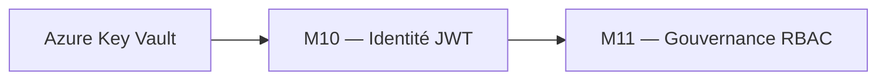
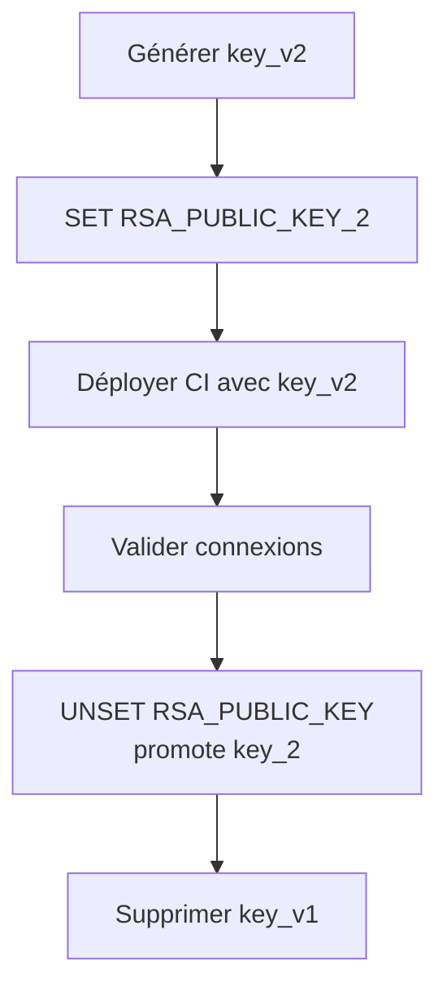
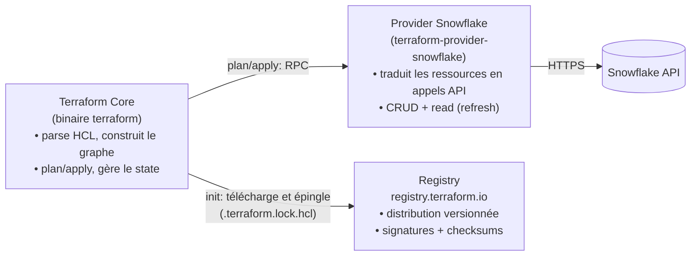
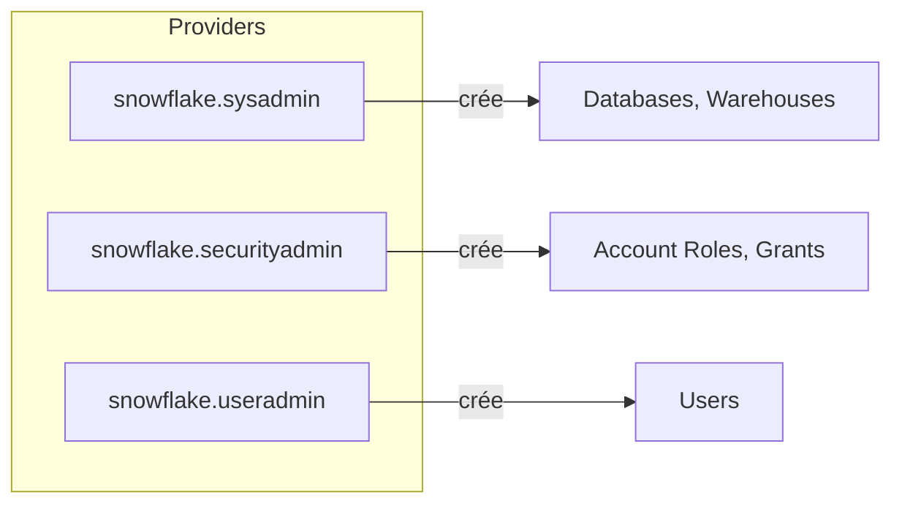

# Module 10 ? Cours : Sécurité et Authentification

> [<- Jour 5](../README.md) · [<- Module precedent](../module-09-snowflake-advanced/lab.md) · **Module 10** · [Module suivant ->](../module-11-rbac/lab.md)

## Contexte métier

Une identité partagée avec mot de passe empêche l'attribution des actions et augmente le risque de compromission. JWT, Key Vault et rotation séparent identité, secret et autorisation.

> Le Key Vault Azure et l'identité technique Entra ID sont **préconfigurés par le formateur**. L'apprenant génère ses clés RSA localement (hors Git) et apprend à les injecter sans les exposer.

## Contexte architecture



| Référentiel | Alignement |
|---|---|
| Pattern | Workload Identity with Key Rotation |
| Azure Well-Architected | Sécurité, Fiabilité |
| Azure CAF | Govern |
| Platform Engineering | Identités techniques et séparation des rôles |

## Pattern d'entreprise

Le pattern **Workload Identity with Key Rotation** élimine les mots de passe permanents, prend en charge deux clés publiques et rend la rotation indépendante du code métier.

---

## 1. Key Pair JWT

Le provider Snowflake (`authenticator = "SNOWFLAKE_JWT"`) utilise une clé privée PKCS#8.

**Avantages vs mot de passe** :

- Pas de secret rotatif en clair
- Compatible CI/CD (secret GitHub)
- Audit trail par utilisateur de service

## 2. Procédure rotation



## 3. Gestion secrets Terraform

- `sensitive = true` sur variables
- Backend state chiffré
- Pas de `private_key` inline dans `.tf`

## 4. Gouvernance Réseau (Network Policies)

La sécurisation réseau s'implémente via la ressource `snowflake_network_policy`. Elle permet de restreindre l'accès à Snowflake à des plages d'adresses IP spécifiques (VPN d'entreprise, adresses IP publiques des exécuteurs de pipelines CI/CD).

```hcl
resource "snowflake_network_policy" "api_restrictions" {
  name            = "NP_STRICT_INGRESS"
  comment         = "Restreint l'accès aux runners CI et au VPN"
  allowed_ip_list = ["192.168.1.0/24", "10.0.0.0/8"]
  blocked_ip_list = []
}
```

## 5. Masquage Dynamique des Données (Column-Level Security)

Pour être conforme aux réglementations sur la protection des données (RGPD), la gouvernance des données exige le masquage des informations personnelles (PII) :
- **Masking Policies** : Configuration de masques dynamiques basés sur le rôle de l'utilisateur (ex: l'analyste voit les emails masqués, le rôle RH les voient en clair).
- **Ressource Terraform** : Déclarée à l'aide de scripts SQL associés ou de ressources spécifiques de gestion de politiques de masquage.

---

## 6. Provider Aliases (Multi-Rôle Snowflake)

### 6.0 Architecture plugin : comment Terraform parle à Snowflake

Terraform est découpé en deux processus qui communiquent par RPC :



Points clés :
- **`terraform init`** résout `required_providers`, télécharge le binaire provider dans `.terraform/providers/` et fige version + checksums dans `.terraform.lock.hcl`.
- **Un provider = un processus plugin** : plusieurs configs (aliases) = plusieurs instances du même binaire.
- **Debug** : `TF_LOG=DEBUG` montre les échanges core↔provider ; `terraform providers` liste les providers requis.
- En environnement fermé : `terraform providers mirror` permet un registry local.

Le provider Snowflake supporte les **aliases** pour opérer avec différents rôles dans la même exécution Terraform. Cela permet de séparer les préoccupations (SYSADMIN pour infrastructure, SECURITYADMIN pour rôles, USERADMIN pour utilisateurs).

```hcl
provider "snowflake" {
  alias             = "sysadmin"
  organization_name = var.snowflake_organization
  account_name      = var.snowflake_account
  user              = var.snowflake_user
  role              = "SYSADMIN"
  authenticator     = "SNOWFLAKE_JWT"
  private_key       = file(var.private_key_path)
}

provider "snowflake" {
  alias             = "securityadmin"
  organization_name = var.snowflake_organization
  account_name      = var.snowflake_account
  user              = var.snowflake_user
  role              = "SECURITYADMIN"
  authenticator     = "SNOWFLAKE_JWT"
  private_key       = file(var.private_key_path)
}

provider "snowflake" {
  alias             = "useradmin"
  organization_name = var.snowflake_organization
  account_name      = var.snowflake_account
  user              = var.snowflake_user
  role              = "USERADMIN"
  authenticator     = "SNOWFLAKE_JWT"
  private_key       = file(var.private_key_path)
}
```

Utilisation dans les ressources :

```hcl
# Databases et warehouses créés par SYSADMIN
resource "snowflake_database" "raw" {
  provider = snowflake.sysadmin
  name     = "DB_RAW_${var.environment}"
}

# Rôles créés par SECURITYADMIN
resource "snowflake_account_role" "analyst" {
  provider = snowflake.securityadmin
  name     = "RL_DATA_ANALYST_${var.environment}"
}

# Utilisateurs créés par USERADMIN
resource "snowflake_user" "svc_user" {
  provider = snowflake.useradmin
  name     = "SVC_${var.environment}_USER"
}
```



> **Best Practice :** En production, utiliser des provider aliases pour respecter le principe de séparation des duties. Chaque rôle ne gère que ce qui est dans son périmètre.

---

## 7. Design Patterns & Best Practices

| Pattern | Application | Pilier Well-Architected |
|---------|-------------|-------------------------|
| **Key Pair JWT** | Authentification sans mot de passe. JWT auto-renouvelé par le client toutes les 60 min. | Sécurité |
| **Rotation sans Interruption** | Utiliser `RSA_PUBLIC_KEY` et `RSA_PUBLIC_KEY_2` simultanément pour basculer sans interruption. | Sécurité / Fiabilité |
| **Network Policies** | `snowflake_network_policy` appliquée pour restreindre les connexions aux agents CI et réseaux internes. | Sécurité |
| **Moindre Privilège** | Rôle Terraform dédié avec droits minimaux indispensables. Éviter d'utiliser `ACCOUNTADMIN` dans la CI. | Sécurité |
| **Sensitive Variables** | Configurer `sensitive = true` sur les variables sensibles pour exclure les secrets des logs. | Sécurité |
| **Dynamic Data Masking** | Appliquer des politiques de masquage pour cacher les données sensibles (PII) aux rôles non autorisés. | Sécurité |
| **Provider Aliases** | Utiliser des aliases (`snowflake.sysadmin`, `snowflake.securityadmin`, `snowflake.useradmin`) pour séparer les duties. | Sécurité |

### Lab associé

Voir [lab.md](./lab.md) pour la mise en pratique complète.

---

## Navigation

[<- Course M9](../module-09-snowflake-advanced/course.md) · [<- Jour 5](../README.md) · **Course M10** · [Course M11 ->](../module-11-rbac/course.md)


