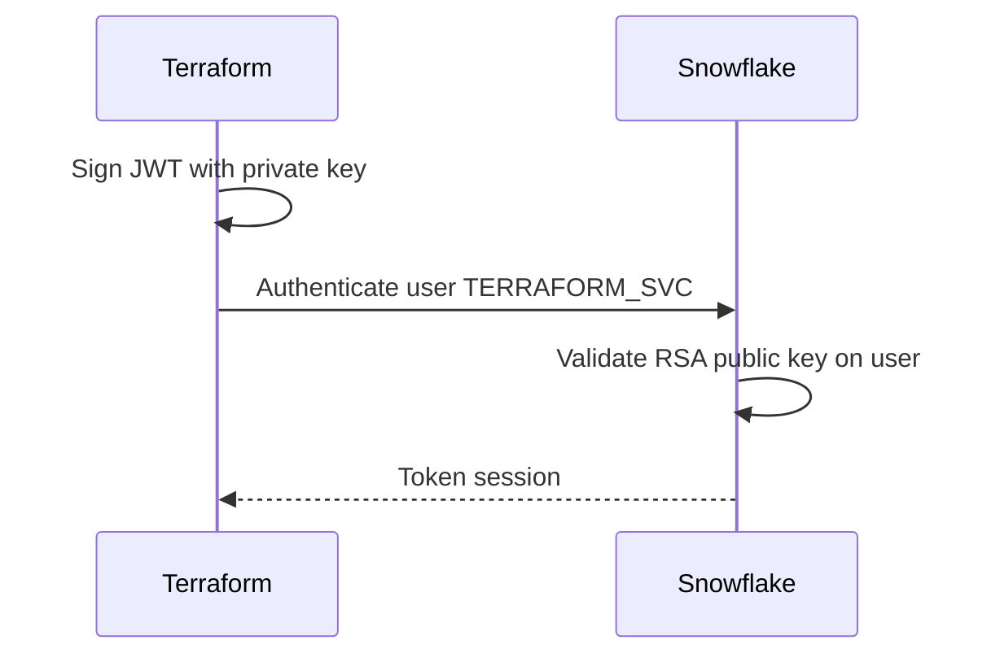

# Module 10 ? Slides : Sécurité et Authentification

---

## Slide 1 ? Key Pair Authentication

---

## Slide 2 ? Rotation des clés

1. Générer nouvelle paire clés
2. `ALTER USER SET RSA_PUBLIC_KEY_2='...'`
3. Mettre ? jour CI/CD
4. Supprimer ancienne clé (`RSA_PUBLIC_KEY`)

---

## Slide 3 ? Moindre privilège

| Rôle CI | Droits |
|---------|--------|
| Plan (PR) | SECURITYADMIN read + metadata |
| Apply PROD | Rôle custom limité |

Éviter ACCOUNTADMIN en production.

---

## Atelier ? [lab.md](lab.md)

---

## Patterns Security

| Pattern | Application |
|---------|-------------|
| Key Pair JWT | Auth sans mot de passe, rotation via `RSA_PUBLIC_KEY_2` |
| Moindre Privilège | Rôle Terraform dédi? avec droits minimaux |
| Sensitive | `sensitive = true` sur les variables de secrets |
| Network Policy | Restriction IP pour le compte et les utilisateurs CI |

