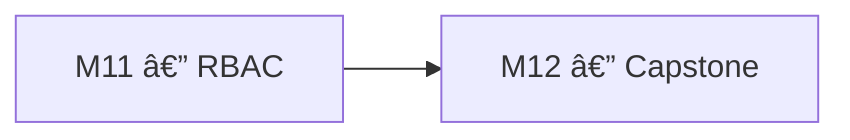
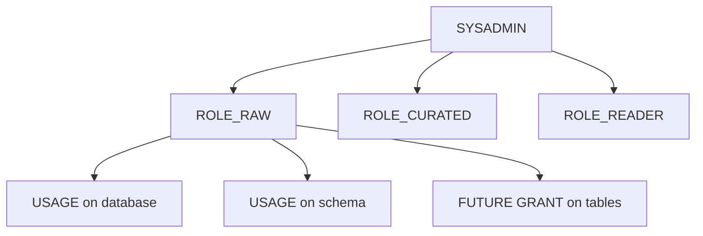

# 🧪 Lab M11 — Modèle RBAC scalable avec Future Grants

> [<- Jour 5](../README.md) · [<- Jour 4](../../day-04/README.md) · **Module 11** · [Module suivant ->](../module-12-capstone/lab.md)

|| Élément | Valeur |
||---|---|
|| **Durée** | 60 min |
|| **Piste** | `[CORE]` |
|| **Workspace** | `$HOME/Data2AI-Labs/data-platform` (le clone) |
|| **Dossier de travail** | `labs/m11-rbac/` |
|| **Coût** | Aucun |
|| **Cleanup** | `terraform destroy -auto-approve` à la fin |

> `[IMPORTANT]` Avant de commencer, vous devez etre dans la racine du clone
> et avoir execute `Learner-Login.ps1 -SnowflakeOnly` dans **cette session** :
>
> ```powershell
> cd "$HOME\Data2AI-Labs\data-platform"
> .\scripts\Learner-Login.ps1 -LearnerPrefix APP01 -SnowflakeOnly
> ```
>
> Cela set `TF_VAR_snowflake_token` (depuis `secrets/snowflake_pat.txt`)
> et `LEARNER_PREFIX`. Aucun login Azure n'est requis pour ce lab (state local).
>
> Ensuite, réinitialisez le lab pour partir d'un état propre :
>
> ```powershell
> .\scripts\Reset-Lab.ps1 -LearnerPrefix APP01 -Lab M11
> ```
>
> Puis placez-vous dans le dossier du lab et vérifiez que tout est pret :
>
> ```powershell
> cd "$HOME\Data2AI-Labs\data-platform\labs\m11-rbac"
> ..\..\scripts\Test-TerraformReady.ps1
> ```
>
> Si le pre-flight affiche `READY`, lancez `terraform plan -out "m11.tfplan"`.
> Sinon, suivez les corrections indiquees.

## 🎯 1. Mission Métier & User Story

L'accès aux données doit suivre les fonctions métier sans tickets manuels. Vous allez créer une hiérarchie de rôles, appliquer le moindre privilège avec des grants ciblés et configurer des Future Grants pour les nouvelles tables.

> **En tant que :** Data Platform Engineer  
> **Je veux :** créer une hiérarchie de rôles Snowflake avec Future Grants  
> **Afin de :** automatiser l'accès aux nouvelles tables selon le principe du moindre privilège
> **Votre persona GlobalBank :** appliquez ce lab sur les objets de votre équipe — 🔵 Platform, 🟢 Data Engineering, 🟠 Business Data, 🟣 BI (voir [personas-globalbank.md](../../../shared/docs/personas-globalbank.md)).


---

## 🏗️ 2. Architecture & Modèle Mental





## 🎯 3. Objectifs Pédagogiques Vérifiables

- créer une hiérarchie de rôles Snowflake avec Terraform;
- accorder des privilèges ciblés par rôle;
- configurer des Future Grants pour les nouvelles tables;
- auditer les grants avec une requête SQL.

## � 4. Pre-Flight Diagnostic (Vérification Initiale)

### Prérequis

- [ ] `terraform plan` affiche `No changes` dans `labs/m11-rbac/`.
- [ ] Le dossier `labs/m11-rbac/` contient `provider.tf`, `versions.tf`, `variables.tf` et `terraform.tfvars.example` (fournis).

## 📝 5. Étapes d'Implémentation Pas-à-Pas (80% Hands-On)

### 📝 Étape 5.1 — Créer le module RBAC

#### Créer la structure

```bash
cd $HOME/Data2AI-Labs/data-platform/labs/m11-rbac
New-Item -ItemType Directory -Force -Path "modules/rbac" | Out-Null
```

#### Créer `modules/rbac/variables.tf`

```hcl
variable "learner_prefix" {
  type        = string
  description = "Learner prefix for role naming"
}

variable "environment" {
  type        = string
  description = "Deployment environment"
  default     = "DEV"
}

variable "database_name" {
  type        = string
  description = "RAW database name"
}

variable "schema_name" {
  type        = string
  description = "Schema name for grants"
  default     = "INGESTION"
}
```

#### Créer `modules/rbac/main.tf`

```hcl
locals {
  role_raw     = "ROLE_${var.learner_prefix}_M11_RAW_${var.environment}"
  role_curated = "ROLE_${var.learner_prefix}_M11_CUR_${var.environment}"
  role_reader  = "ROLE_${var.learner_prefix}_M11_RDR_${var.environment}"
}

# ------------------------------------------------------------------
# Role hierarchy: SYSADMIN > RAW > CURATED > READER
# ------------------------------------------------------------------

resource "snowflake_account_role" "raw" {
  name    = local.role_raw
  comment = "RAW access role for ${var.learner_prefix} M11"
}

resource "snowflake_account_role" "curated" {
  name    = local.role_curated
  comment = "Curated access role for ${var.learner_prefix} M11"
}

resource "snowflake_account_role" "reader" {
  name    = local.role_reader
  comment = "Read-only role for ${var.learner_prefix} M11"
}

# Grant hierarchy
resource "snowflake_grant_privileges_to_account_role" "curated_to_raw" {
  privileges        = ["USAGE"]
  account_role_name = snowflake_account_role.raw.name
  on_account_role   = snowflake_account_role.curated.name
}

resource "snowflake_grant_privileges_to_account_role" "reader_to_curated" {
  privileges        = ["USAGE"]
  account_role_name = snowflake_account_role.curated.name
  on_account_role   = snowflake_account_role.reader.name
}

# ------------------------------------------------------------------
# Database and schema grants
# ------------------------------------------------------------------

resource "snowflake_grant_privileges_to_account_role" "raw_db" {
  privileges        = ["USAGE"]
  account_role_name = snowflake_account_role.raw.name

  on_schema {
    schema_name = "${var.database_name}.${var.schema_name}"
  }
}

# ------------------------------------------------------------------
# Future Grants: new tables in the schema get SELECT automatically
# ------------------------------------------------------------------

resource "snowflake_grant_privileges_to_account_role" "future_tables" {
  privileges        = ["SELECT", "INSERT", "UPDATE"]
  account_role_name = snowflake_account_role.raw.name

  on_schema_object {
    future {
      database_name = var.database_name
      schema_name   = var.schema_name
      object_type   = "TABLE"
    }
  }
}

resource "snowflake_grant_privileges_to_account_role" "reader_future" {
  privileges        = ["SELECT"]
  account_role_name = snowflake_account_role.reader.name

  on_schema_object {
    future {
      database_name = var.database_name
      schema_name   = var.schema_name
      object_type   = "TABLE"
    }
  }
}
```

#### Créer `modules/rbac/outputs.tf`

```hcl
output "role_raw" {
  value = snowflake_account_role.raw.name
}

output "role_curated" {
  value = snowflake_account_role.curated.name
}

output "role_reader" {
  value = snowflake_account_role.reader.name
}
```

#### Créer `modules/rbac/versions.tf`

```hcl
terraform {
  required_version = ">= 1.14.0, < 2.0.0"

  required_providers {
    snowflake = {
      source  = "snowflakedb/snowflake"
      version = "= 2.14.0"
    }
  }
}
```

#### Formater et valider

```bash
cd modules/rbac
terraform fmt
terraform validate
```

### 📝 Étape 5.2 — Appeler le module depuis le lab

#### Créer la database et le schema dans `main.tf`

Ce lab est autonome : il crée sa propre database et son schema avant d'appliquer les grants RBAC.

Éditez `labs/m11-rbac/main.tf` :

```hcl
# ------------------------------------------------------------------
# Database and schema (self-contained for this lab)
# ------------------------------------------------------------------

resource "snowflake_database" "raw" {
  name    = "${var.learner_prefix}_M11_RAW_${var.environment}"
  comment = "RAW database for M11 RBAC lab"
}

resource "snowflake_schema" "ingestion" {
  database = snowflake_database.raw.name
  name     = "INGESTION"
  comment  = "Ingestion schema for M11 RBAC lab"
}

# ------------------------------------------------------------------
# RBAC module
# ------------------------------------------------------------------

module "rbac" {
  source         = "./modules/rbac"
  learner_prefix = var.learner_prefix
  environment    = var.environment
  database_name  = snowflake_database.raw.name
  schema_name    = "INGESTION"
}
```

#### Ajouter les outputs dans `outputs.tf`

```hcl
output "rbac_roles" {
  value = {
    raw     = module.rbac.role_raw
    curated = module.rbac.role_curated
    reader  = module.rbac.role_reader
  }
  description = "RBAC role hierarchy"
}

output "database_name" {
  value = snowflake_database.raw.name
}
```

#### Planifier et appliquer

```bash
cd labs/m11-rbac
terraform fmt
terraform init
terraform validate
terraform plan -out "m11.tfplan"
terraform apply "m11.tfplan"
```

✅ **Checkpoint** : 3 rôles créés + grants + database + schema.

### 📝 Étape 5.3 — Auditer les grants

#### Lister les rôles

```bash
snow sql -c training -q "SHOW ROLES LIKE 'ROLE_APP01_M11_%'"
```

Remplacez `APP01` par votre préfixe.

#### Vérifier les Future Grants

```bash
snow sql -c training -q "SHOW FUTURE GRANTS IN SCHEMA APP01_M11_RAW_DEV.INGESTION"
```

✅ **Checkpoint** : des lignes avec `GRANT SELECT` et `GRANT INSERT` pour les futures tables.

#### Tester le Future Grant

Créez une table manuellement et vérifiez que les grants s'appliquent automatiquement :

```bash
snow sql -c training -q "CREATE TABLE APP01_M11_RAW_DEV.INGESTION.TEST_FUTURE (ID INT)"
snow sql -c training -q "SHOW GRANTS ON TABLE APP01_M11_RAW_DEV.INGESTION.TEST_FUTURE"
```

✅ **Checkpoint** : les grants SELECT et INSERT sont déjà présents grâce au Future Grant.

#### Nettoyer la table de test

```bash
snow sql -c training -q "DROP TABLE APP01_M11_RAW_DEV.INGESTION.TEST_FUTURE"
```

### 📝 Étape 5.4 — Principe du moindre privilège

#### Vérifier la séparation des rôles

| Rôle | Privilèges | Usage |
|---|---|---|
| `ROLE_APP01_M11_RAW_DEV` | USAGE schema, INSERT, UPDATE, SELECT | Ingestion ETL |
| `ROLE_APP01_M11_CUR_DEV` | USAGE schema, SELECT | Transformation dbt |
| `ROLE_APP01_M11_RDR_DEV` | USAGE schema, SELECT | Lecture BI |

#### Attribuer le rôle à un utilisateur technique

Ajoutez dans `labs/m11-rbac/main.tf` :

```hcl
# ------------------------------------------------------------------
# Technical user (self-contained for this lab)
# ------------------------------------------------------------------

resource "snowflake_user" "tech" {
  name              = "TF_${var.learner_prefix}_M11_SVC"
  default_role      = module.rbac.role_raw
  default_warehouse = null
  must_change_password = false
}

resource "snowflake_grant_account_role" "tech_raw" {
  role_name = module.rbac.role_raw
  user_name = snowflake_user.tech.name
}
```

#### Planifier et appliquer

```bash
terraform plan -out "m11.tfplan"
terraform apply "m11.tfplan"
```

#### Vérifier

```bash
snow sql -c training -q "SHOW GRANTS TO USER TF_APP01_M11_SVC"
```

✅ **Checkpoint** : le rôle `ROLE_APP01_M11_RAW_DEV` est attribué à l'utilisateur technique.

#### Test Interactif des Rôles dans Snowflake Snowsight

Pour ressentir concrètement l'effet de votre politique de moindre privilège :

1. Ouvrez votre navigateur sur **[app.snowflake.com](https://app.snowflake.com)**.
2. Cliquez sur votre profil en haut à droite et changez de rôle actif : sélectionnez votre rôle fonctionnel `ROLE_APP01_M11_RAW_DEV` (ou un analyste auquel vous avez hérité les droits).
3. Ouvrez une **SQL Worksheet** et exécutez un test de lecture :
   ```sql
   SELECT * FROM APP01_M11_RAW_DEV.INGESTION.TEST_TABLE LIMIT 5;
   ```
   ✅ **Résultat attendu :** Requête exécutée avec succès (droit `SELECT` accordé).
4. Tentez maintenant une opération destructive interdite :
   ```sql
   DROP TABLE APP01_M11_RAW_DEV.INGESTION.TEST_TABLE;
   ```
   🛑 **Résultat attendu :** Échec immédiat avec erreur Snowflake :
   `SQL access control error: Insufficient privileges to operate on table 'TEST_TABLE'`.

---

## 🐛 6. Incident Contrôlé (*Chaos Engineering Lab*)

*Une erreur classique en production est d'accorder des droits sur une table ou un schema sans accorder le droit USAGE sur la base de données parente.*

### Symptôme & Injection

Dans votre code Terraform `main.tf`, commentez temporairement le bloc attribuant le privilège `USAGE` sur la database :

```hcl
# Privilège USAGE commenté
```

Appliquez la modification :

```powershell
terraform apply -auto-approve
```

### Diagnostic & Observation

Dans Snowsight, basculez sur le rôle utilisateur. Bien que le rôle possède encore des droits sur les tables, la base de données entière a disparu de l'arborescence graphique !

*Principe Snowflake : Sans USAGE sur le conteneur parent, aucun objet enfant n'est accessible.*

### Remédiation

Décommentez le grant `USAGE`, appliquez avec `terraform apply`, et vérifiez la réapparition instantanée de la base dans Snowsight.

---

## 🤖 7. Validation Automatisée (*Check My Progress*)

Exécutez le script d'auto-évaluation pour vérifier la conformité de votre modèle RBAC :

```powershell
.\scripts\SelfPacedLab.ps1 -Module 11 -All -Report
```

✅ **Résultat attendu :**
```text
[PASS] T1 Access roles declared (AR_*)
[PASS] T2 Functional roles declared (FR_*)
[PASS] T3 Future grants defined
[PASS] T4 terraform fmt & validate passed
[PASS] T5 Least privilege compliance verified
Result: 5/5 Tasks Passed.
```

---

## 🏆 8. Défi Autonome (*Unguided Challenge*)

> **Scénario :** Ajoutez un rôle `ROLE_APP01_M11_ADMIN_DEV` qui a le droit de créer des schemas dans la database, et attribuez-le à un utilisateur `ADMIN_APP01_M11`.
> **Contraintes :**
> - `terraform plan` crée le rôle et le grant;
> - `SHOW GRANTS TO USER ADMIN_APP01_M11` affiche le rôle;
> - le rôle peut créer un schema de test.

| Critère d'Évaluation | Points |
|---|---:|
| Syntaxe HCL et respect des standards | 30 pts |
| Preuve d'exécution fonctionnelle | 30 pts |
| Idempotence (`0 to add, 0 to change, 0 to destroy`) | 20 pts |
| Respect des budgets FinOps & Sécurité | 20 pts |
| **Total** | **100 pts** |

## 🧹 9. Nettoyage Contrôlé (*FinOps Teardown*)

Détruisez toutes les ressources créées dans ce lab :

```bash
cd labs/m11-rbac
terraform destroy -auto-approve
```

> Vous pouvez aussi utiliser `.\scripts\Reset-Lab.ps1 -LearnerPrefix APP01 -Lab M11` depuis la racine du clone pour nettoyer automatiquement.

---

## Navigation

[<- Lab M10](../module-10-security-auth/lab.md) · [<- Jour 5](../README.md) · **Lab M11** · [Lab M12 ->](../module-12-capstone/lab.md)
