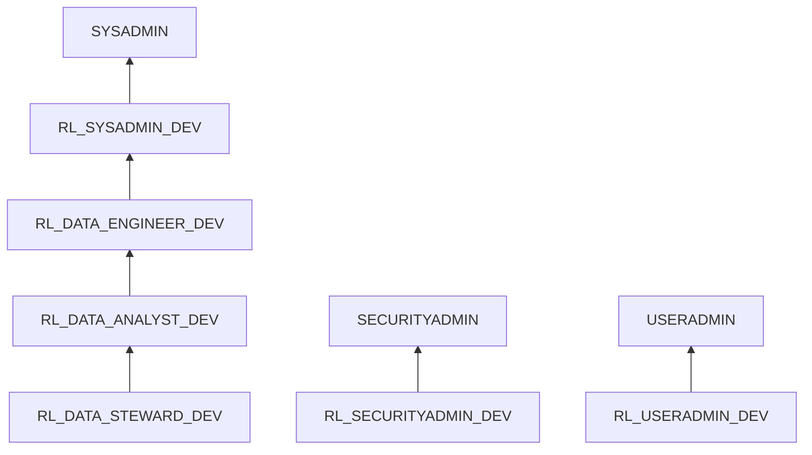

# Module 11 — Slides : RBAC Scalable

---

## Slide 1 — Hiérarchie des rôles



---

## Slide 2 — Rôles techniques vs métier

| Type | Exemple | Usage |
|------|---------|-------|
| Technique | RL_SYSADMIN_DEV | Gestion infrastructure |
| Technique | RL_SECURITYADMIN_DEV | Gestion sécurité |
| Technique | RL_USERADMIN_DEV | Gestion utilisateurs |
| Métier | RL_DATA_ENGINEER_DEV | Pipelines, ETL, écriture |
| Métier | RL_DATA_ANALYST_DEV | BI, SELECT curated |
| Métier | RL_DATA_STEWARD_DEV | Gouvernance, qualité |

---

## Slide 3 — Future Grants

```hcl
resource "snowflake_grant_privileges_to_account_role" "analyst_future_select" {
  account_role_name = snowflake_account_role.analyst.name
  privileges        = ["SELECT"]

  on_schema_object {
    future {
      object_type_plural = "TABLES"
      in_database        = var.curated_database_name
    }
  }
}
```

→ Nouveau schema/table hérite automatiquement

---

## Atelier — [lab.md](lab.md)

---

## Patterns RBAC

| Pattern | Application |
|---------|-------------|
| Role Hierarchy | SYSADMIN → RL_SYSADMIN → RL_DATA_ENGINEER → RL_DATA_ANALYST → RL_DATA_STEWARD |
| Moindre Privilège | Chaque rôle = droits strictement nécessaires |
| Future Grants | Bloc `future` dans `snowflake_grant_privileges_to_account_role` |
| Naming | `RL_{DOMAIN}_{ENV}` (ex: `RL_DATA_ENGINEER_DEV`) |
| Audit | `SHOW GRANTS` + `SHOW FUTURE GRANTS` |

