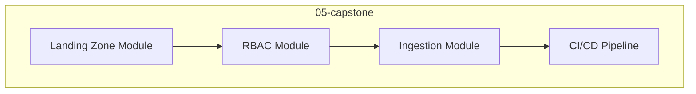

# Module 12 — Slides : Projet Fil Rouge

---

## Slide 1 — Objectif Capstone

**De repo vide ? plateforme Data gouvernée**



---

## Slide 2 — Checklist finale

- [ ] Backend Azure Blob + lock
- [ ] Modules versionnés
- [ ] 3 environnements paramétrés
- [ ] RBAC + future grants
- [ ] Stage + file format
- [ ] FinOps (Resource Monitors + ACCOUNT_USAGE)
- [ ] Snow CLI (Data Products)
- [ ] Pipeline CI vert
- [ ] `terraform plan` = 0 changes

---

## Slide 3 — Audit post-déploiement

```powershell
terraform plan
terraform state list
tfsec .
tflint
```

---

## Atelier ? [lab.md](lab.md)

