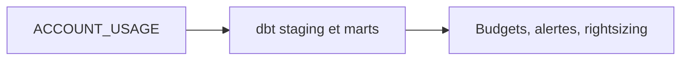

# Slides M13 — Observabilité et FinOps as Code

---

## Problème métier

- Qui consomme les crédits ?
- Quel warehouse est surdimensionné ?
- Quel budget risque d'être dépassé ?

---

## Architecture

---

## Pattern

- **Metadata-Driven Observability**
- **WAF :** Cost Optimization, Operational Excellence
- **CAF :** Manage

---

## Contrôle préventif et explicatif

- Resource Monitor : stoppe ou alerte immédiatement
- dbt FinOps : attribue, historise et explique

---

## Validation

- `dbt build`
- Cinq marts testés
- Latence `ACCOUNT_USAGE` explicitée
- Exécution identique dans le pipeline Audit

