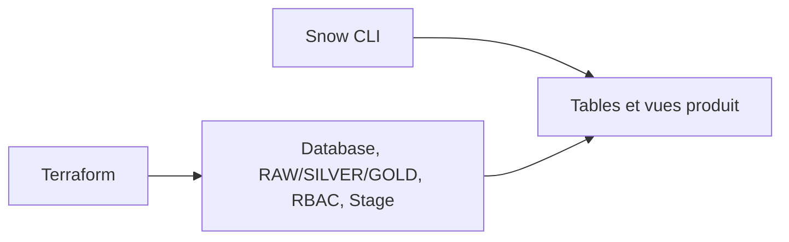

# 🧪 Lab M14 — Data Products as Code avec Terraform et Snow CLI

> [<- Jour 5](../README.md) · [<- Module precedent](../module-13-finops-observability/lab.md) · **Module 14** · [Fin ->](../../README.md)

|| Élément | Valeur |
||---|---|
|| **Durée** | 30 min (Option C fusionnée M13+M14) |
|| **Piste** | `[EXTENSION]` |
|| **Workspace** | `$HOME/Data2AI-Labs/data-platform` (le clone) |
|| **Dossier de travail** | `labs/m14-data-products/` |
|| **Coût** | Warehouses X-SMALL |
|| **Cleanup** | `terraform destroy -auto-approve` à la fin |

> `[IMPORTANT]` Avant de commencer, vous devez etre dans la racine du clone
> et avoir execute `Learner-Login.ps1` dans **cette session** :
>
> ```powershell
> cd "$HOME\Data2AI-Labs\data-platform"
> .\scripts\Learner-Login.ps1 -LearnerPrefix APP01
> ```
>
> Cela set `TF_VAR_snowflake_token` (depuis `secrets/snowflake_pat.txt`)
> et les variables `ARM_*` pour Terraform.
>
> Ensuite, réinitialisez le lab pour partir d'un état propre :
>
> ```powershell
> .\scripts\Reset-Lab.ps1 -LearnerPrefix APP01 -Lab M14
> ```
>
> Puis placez-vous dans le dossier du lab et vérifiez que tout est pret :
>
> ```powershell
> cd "$HOME\Data2AI-Labs\data-platform\labs\m14-data-products"
> ..\..\scripts\Test-TerraformReady.ps1
> ```
>
> Si le pre-flight affiche `READY`, lancez `terraform plan -out "m14.tfplan"`.
> Sinon, suivez les corrections indiquees.

## 🎯 1. Mission Métier & User Story

Les domaines SALES et FINANCE doivent livrer des données avec autonomie sans contourner sécurité, coûts et standards. Vous allez créer un module `data-product` qui déploie la structure (database, schemas RAW/SILVER/GOLD, rôles, stage) et publier le contenu SQL avec Snow CLI.

> **En tant que :** Data Product Owner  
> **Je veux :** déployer des data products avec un module Terraform réutilisable et Snow CLI  
> **Afin de :** livrer des données en autonomie tout en respectant sécurité, coûts et standards

---

## 🏗️ 2. Architecture & Modèle Mental



## 🎯 3. Objectifs Pédagogiques Vérifiables

- créer un module `data-product` réutilisable;
- déployer deux domaines (SALES et FINANCE) avec `for_each`;
- implémenter l'architecture Medallion (RAW, SILVER, GOLD);
- publier le contenu SQL avec Snow CLI, pas avec `local-exec`;
- vérifier ownership, rôles, Future Grants et zero-drift.

## � 4. Pre-Flight Diagnostic (Vérification Initiale)

### Prérequis

- [ ] `snow sql -c training` fonctionne.
- [ ] Le dossier `labs/m14-data-products/` contient `provider.tf`, `versions.tf`, `variables.tf` et `terraform.tfvars.example` (fournis).
- [ ] Le sous-dossier `labs/m14-data-products/modules/data-product/` existe (avec `versions.tf` fourni).

## 📝 5. Étapes d'Implémentation Pas-à-Pas (80% Hands-On)

### 📝 Étape 5.1 — Créer le module data-product

#### Créer la structure

```bash
cd $HOME/Data2AI-Labs/data-platform/labs/m14-data-products
New-Item -ItemType Directory -Force -Path "modules/data-product" | Out-Null
```

#### Créer `modules/data-product/variables.tf`

```hcl
variable "learner_prefix" {
  type        = string
  description = "Learner prefix"
}

variable "environment" {
  type        = string
  description = "Deployment environment"
  default     = "DEV"
}

variable "domain" {
  type        = string
  description = "Domain name (e.g. SALES, FINANCE)"
}

variable "owner" {
  type        = string
  description = "Domain owner email"
}

variable "warehouse_size" {
  type        = string
  default     = "X-SMALL"
}
```

#### Créer `modules/data-product/main.tf`

```hcl
locals {
  db_name   = "${var.learner_prefix}_M14_${var.domain}_${var.environment}"
  wh_name   = "WH_${var.learner_prefix}_M14_${var.domain}_${var.environment}"
  role_prod = "ROLE_${var.learner_prefix}_M14_${var.domain}_PROD_${var.environment}"
  role_read = "ROLE_${var.learner_prefix}_M14_${var.domain}_RDR_${var.environment}"
  comment   = "Data Product | ${var.domain} | Owner: ${var.owner}"
}

# Database
resource "snowflake_database" "this" {
  name    = local.db_name
  comment = local.comment
}

# Medallion schemas
resource "snowflake_schema" "raw" {
  database = snowflake_database.this.name
  name     = "RAW"
  comment  = local.comment
}

resource "snowflake_schema" "silver" {
  database = snowflake_database.this.name
  name     = "SILVER"
  comment  = local.comment
}

resource "snowflake_schema" "gold" {
  database = snowflake_database.this.name
  name     = "GOLD"
  comment  = local.comment
}

# Warehouse
resource "snowflake_warehouse" "this" {
  name                = local.wh_name
  warehouse_size      = var.warehouse_size
  auto_suspend        = 60
  auto_resume         = true
  initially_suspended = true
  comment             = local.comment
}

# Roles
resource "snowflake_account_role" "producer" {
  name    = local.role_prod
  comment = "Producer role for ${var.domain}"
}

resource "snowflake_account_role" "reader" {
  name    = local.role_read
  comment = "Reader role for ${var.domain}"
}

# Grants
resource "snowflake_grant_privileges_to_account_role" "producer_db" {
  privileges        = ["USAGE"]
  account_role_name = snowflake_account_role.producer.name
  on_database       = snowflake_database.this.name
}

resource "snowflake_grant_privileges_to_account_role" "producer_schemas" {
  for_each = toset(["RAW", "SILVER", "GOLD"])

  privileges        = ["USAGE", "CREATE TABLE", "CREATE VIEW"]
  account_role_name = snowflake_account_role.producer.name
  on_schema {
    schema_name = "${snowflake_database.this.name}.${each.value}"
  }
}

resource "snowflake_grant_privileges_to_account_role" "reader_db" {
  privileges        = ["USAGE"]
  account_role_name = snowflake_account_role.reader.name
  on_database       = snowflake_database.this.name
}

# Future Grants: new tables in GOLD get SELECT for reader
resource "snowflake_grant_privileges_to_account_role" "reader_future_gold" {
  privileges        = ["SELECT"]
  account_role_name = snowflake_account_role.reader.name
  on_schema_object {
    future {
      database_name = snowflake_database.this.name
      schema_name   = "GOLD"
      object_type   = "TABLE"
    }
  }
}

# Stage for raw ingestion
resource "snowflake_stage" "raw" {
  name     = "STG_RAW"
  database = snowflake_database.this.name
  schema   = "RAW"
  comment  = local.comment
}
```

#### Créer `modules/data-product/outputs.tf`

```hcl
output "database_name" {
  value = snowflake_database.this.name
}

output "warehouse_name" {
  value = snowflake_warehouse.this.name
}

output "role_producer" {
  value = snowflake_account_role.producer.name
}

output "role_reader" {
  value = snowflake_account_role.reader.name
}

output "stage_name" {
  value = snowflake_stage.raw.name
}
```

#### Formater et valider

```bash
cd modules/data-product
terraform fmt
terraform validate
```

### 📝 Étape 5.2 — Déployer deux domaines avec for_each

#### Écrire `labs/m14-data-products/main.tf`

```hcl
locals {
  data_products = {
    SALES = {
      owner = "sales@data2ai.com"
    }
    FINANCE = {
      owner = "finance@data2ai.com"
    }
  }
}

module "data_product" {
  source   = "./modules/data-product"
  for_each = local.data_products

  learner_prefix = var.learner_prefix
  environment    = var.environment
  domain         = each.key
  owner          = each.value.owner
  warehouse_size = "X-SMALL"
}
```

#### Ajouter les outputs dans `outputs.tf`

```hcl
output "data_products" {
  value = {
    for k, v in module.data_product : k => {
      database  = v.database_name
      warehouse = v.warehouse_name
      producer  = v.role_producer
      reader    = v.role_reader
    }
  }
  description = "Deployed data products"
}
```

#### Planifier et appliquer

```bash
cd labs/m14-data-products
terraform fmt
terraform init
terraform validate
terraform plan -out "m14.tfplan"
terraform apply "m14.tfplan"
```

✅ **Checkpoint** : 2 databases, 6 schemas, 2 warehouses, 4 rôles, 2 stages, grants.

#### Vérifier

```bash
snow sql -c training -q "SHOW DATABASES LIKE 'APP01_M14_SALES_DEV'"
snow sql -c training -q "SHOW DATABASES LIKE 'APP01_M14_FINANCE_DEV'"
snow sql -c training -q "SHOW SCHEMAS IN DATABASE APP01_M14_SALES_DEV"
```

### 📝 Étape 5.3 — Publier le contenu SQL avec Snow CLI

#### Créer les fichiers SQL

```bash
cd labs/m14-data-products
New-Item -ItemType Directory -Force -Path "sql/sales", "sql/finance" | Out-Null
```

`sql/sales/orders.sql` :

```sql
CREATE OR REPLACE TABLE APP01_M14_SALES_DEV.SILVER.ORDERS AS
SELECT
  1 AS ORDER_ID,
  '2026-01-01' AS ORDER_DATE,
  100.00 AS AMOUNT
UNION ALL
SELECT 2, '2026-01-02', 200.00;

CREATE OR REPLACE VIEW APP01_M14_SALES_DEV.GOLD.DAILY_REVENUE AS
SELECT
  ORDER_DATE,
  SUM(AMOUNT) AS TOTAL_REVENUE
FROM APP01_M14_SALES_DEV.SILVER.ORDERS
GROUP BY ORDER_DATE;
```

`sql/finance/ledger.sql` :

```sql
CREATE OR REPLACE TABLE APP01_M14_FINANCE_DEV.SILVER.LEDGER AS
SELECT
  1 AS ENTRY_ID,
  '2026-01-01' AS ENTRY_DATE,
  'REVENUE' AS TYPE,
  300.00 AS AMOUNT;
```

#### Exécuter le SQL avec Snow CLI

```bash
snow sql -c training -f sql/sales/orders.sql
snow sql -c training -f sql/finance/ledger.sql
```

#### Vérifier

```bash
snow sql -c training -q "SELECT * FROM APP01_M14_SALES_DEV.GOLD.DAILY_REVENUE"
snow sql -c training -q "SELECT * FROM APP01_M14_FINANCE_DEV.SILVER.LEDGER"
```

#### Prouver le zero-drift

```bash
terraform plan -detailed-exitcode
```

✅ **Checkpoint** : code 0 — le SQL publié ne modifie pas la structure gérée par Terraform.

> C'est la séparation des responsabilités : Terraform gère la structure, Snow CLI gère le contenu.

### 📝 Étape 5.4 — Vérifier les Future Grants

#### Lister les Future Grants

```bash
snow sql -c training -q "SHOW FUTURE GRANTS IN SCHEMA APP01_M14_SALES_DEV.GOLD"
```

✅ **Checkpoint** : `GRANT SELECT ON FUTURE TABLES TO ROLE ROLE_APP01_M14_SALES_RDR_DEV`.

#### Tester le Future Grant

Créez une table manuellement dans GOLD :

```bash
snow sql -c training -q "CREATE TABLE APP01_M14_SALES_DEV.GOLD.TEST_FUTURE (ID INT)"
snow sql -c training -q "SHOW GRANTS ON TABLE APP01_M14_SALES_DEV.GOLD.TEST_FUTURE"
```

✅ **Checkpoint** : le rôle reader a déjà SELECT grâce au Future Grant.

#### Nettoyer

```bash
snow sql -c training -q "DROP TABLE APP01_M14_SALES_DEV.GOLD.TEST_FUTURE"
```

#### Vérification Graphique du Data Mesh & Masquage dans Snowsight

1. Ouvrez **Snowflake Snowsight (`https://app.snowflake.com`)**.
2. Naviguez vers **Data > Databases > APP01_M14_SALES_DEV > GOLD**.
3. Cliquez sur la table `DAILY_REVENUE` :
   - Observez les métadonnées et l'onglet **Tags** : vérifiez la présence des tags de gouvernance (`Domain = SALES`, `Confidentiality = HIGH`).
4. Ouvrez une **SQL Worksheet** et exécutez la requête avec le rôle `SYSADMIN` :
   ```sql
   SELECT * FROM APP01_M14_SALES_DEV.GOLD.DAILY_REVENUE LIMIT 5;
   ```
   Les données sensibles apparaissent en clair pour l'administrateur.
5. Basculez sur le rôle reader `ROLE_APP01_M14_SALES_RDR_DEV` et ré-exécutez la requête :
   Les colonnes protégées par la politique de masquage dynamique sont automatiquement masquées (`***`).

---

## 🐛 6. Incident Contrôlé (*Chaos Engineering Lab*)

*Pour garantir l'intégrité de votre catalogue de données d'entreprise :*

### Symptôme & Injection

Dans Snowsight, modifiez manuellement la valeur d'un tag sur la table `DAILY_REVENUE` (ex: passez `Confidentiality` de `HIGH` à `PUBLIC`).

### Diagnostic & Observation

Détection au terminal :

```powershell
terraform plan
```

Observez le diff détecté par Terraform sur l'association de tags :

```text
~ tag_value = "PUBLIC" -> "HIGH"
```

### Remédiation

Lancez `terraform apply -auto-approve` pour réaligner immédiatement la gouvernance sur la politique officielle as-code.

---

## 🤖 7. Validation Automatisée (*Check My Progress*)

Exécutez le script d'auto-évaluation pour valider le module Data Products :

```powershell
.\scripts\SelfPacedLab.ps1 -Module 14 -All -Report
```

✅ **Résultat attendu :**
```text
[PASS] T1 Domain databases created
[PASS] T2 Governance tags assigned
[PASS] T3 Dynamic masking policy active
[PASS] T4 terraform fmt & validate passed
[PASS] T5 Future grants verified
Result: 5/5 Tasks Passed.
```

---

## 🏆 8. Défi Autonome (*Unguided Challenge*)

> **Scénario :** Ajoutez un troisième domaine `MARKETING` avec un owner et un warehouse dédié. Publiez une vue `CAMPAIGN_PERFORMANCE` dans le schema GOLD.
> **Contraintes :**
> - `terraform plan` crée les ressources MARKETING;
> - `snow sql -f` publie la vue;
> - `terraform plan -detailed-exitcode` retourne 0;
> - le Future Grant est configuré pour le reader.

| Critère d'Évaluation | Points |
|---|---:|
| Syntaxe HCL et respect des standards | 30 pts |
| Preuve d'exécution fonctionnelle | 30 pts |
| Idempotence (`0 to add, 0 to change, 0 to destroy`) | 20 pts |
| Respect des budgets FinOps & Sécurité | 20 pts |
| **Total** | **100 pts** |

## 🧹 9. Nettoyage Contrôlé (*FinOps Teardown*)

Détruisez toutes les ressources créées dans ce lab :

```bash
cd labs/m14-data-products
terraform destroy -auto-approve
```

> Vous pouvez aussi utiliser `.\scripts\Reset-Lab.ps1 -LearnerPrefix APP01 -Lab M14` depuis la racine du clone pour nettoyer automatiquement.

---

## Navigation

[<- Lab M13](../module-13-finops-observability/lab.md) · [<- Jour 5](../README.md) · **Lab M14** · [Fin de formation ->](../../README.md)
