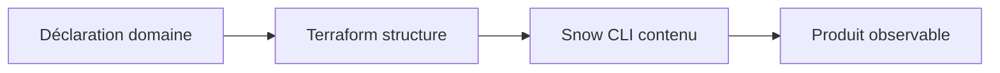

# Slides M14 — Data Products as Code

---

## Vision

Un domaine livre un produit gouverné, pas une collection de tables.

---

## Golden Path

---

## Patterns

- Data Product
- Data Mesh fédéré
- Medallion RAW / SILVER / GOLD
- Future Grants

---

## Frontière

- Terraform : objets à cycle long et autorisations
- Snow CLI : SQL produit à cycle rapide
- Azure DevOps : orchestration et preuve

---

## Done

- Structure validée
- SQL publié
- Rôles testés
- Zero-drift prouvé
- Coût attribuable

