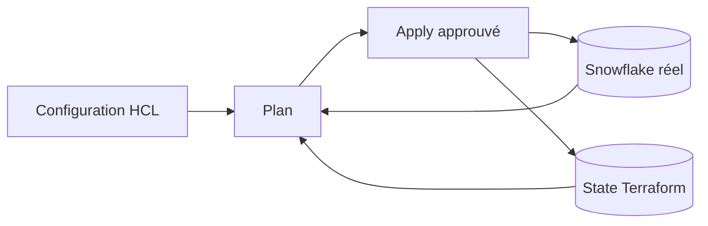

# Cours M1 — Premier déploiement Terraform Snowflake

> [<- Jour 1](../README.md) · [<- Jour 0](../../day-00/README.md) · **Module 1** · [Module suivant ->](../module-02-state-management/lab.md)

**Durée de lecture :** 20 minutes

**Piste :** `[CORE]`

## Scénario professionnel

Une plateforme Data doit transformer une intention versionnée en changement prévisible. Terraform décrit l’état désiré, interroge Snowflake, présente un plan, puis exécute uniquement le changement approuvé.

## Objectifs

- distinguer configuration, provider, ressource et state;
- expliquer le workflow Terraform;
- reconnaître une dépendance implicite;
- protéger les credentials grâce au profil Snowflake CLI;
- expliquer l’idempotence.

## Modèle mental



- **Configuration** : état désiré écrit dans les fichiers `.tf`;
- **Provider** : plugin qui traduit les ressources en appels Snowflake;
- **State** : correspondance entre adresses Terraform et objets distants;
- **Plan** : différence calculée avant modification;
- **Apply** : exécution du plan revu.

## Fichiers du premier projet

| Fichier | Responsabilité |
|---|---|
| `versions.tf` | versions Terraform et providers |
| `provider.tf` | profil de connexion local |
| `variables.tf` | interface et validations |
| `locals.tf` | noms calculés cohérents |
| `main.tf` | ressources désirées |
| `outputs.tf` | informations utiles après apply |
| `terraform.tfvars` | valeurs locales propres à l’apprenant |

Terraform charge tous les fichiers `.tf` du dossier comme une configuration unique. Leur séparation sert la lisibilité, pas l’ordre d’exécution.

## Dépendances

La ligne suivante crée une dépendance implicite :

```hcl
database = snowflake_database.raw.name
```

Terraform construit un graphe et crée le schema après la database. La position des blocs dans `main.tf` n’impose pas l’ordre.

## Authentification

Le provider utilise :

```hcl
provider "snowflake" {
  profile = var.snowflake_profile
}
```

Le credential reste dans la configuration locale Snowflake CLI préparée au M0. Le projet ne contient ni password, ni PAT, ni clé privée. Cette simplification est adaptée au premier lab; les identités de service et JWT sont approfondis au Jour 4.

## Idempotence

Après un `apply` réussi, un nouveau `plan` doit afficher `No changes` si le code et l’infrastructure n’ont pas évolué. Ce résultat prouve la convergence, mais pas à lui seul la sécurité ou la qualité de l’architecture.

## Sécurité et coûts

- préfixe unique pour éviter les collisions;
- warehouse `X-SMALL`;
- `auto_suspend = 60`;
- `initially_suspended = true`;
- aucun rôle `ACCOUNTADMIN` codé dans Terraform;
- plan revu avant apply;
- ressources conservées uniquement parce que M2 les réutilise.

## Training versus Production

| Training | Production |
|---|---|
| profil CLI local | workload identity/JWT/OAuth selon standard |
| state local pédagogique | backend distant chiffré et contrôlé |
| apply manuel | pipeline avec approbation |
| préfixe apprenant | naming standard et tags obligatoires |

## Synthèse

Le workflow professionnel est `écrire → formater → initialiser → valider → planifier → revoir → appliquer → prouver → replanifier`. Une destruction inattendue dans un plan impose un arrêt et une analyse, jamais une approbation automatique.

---

## Navigation

[<- Course M00](../../day-00/module-00-setup/course.md) · [<- Jour 1](../README.md) · **Course M1** · [Course M2 ->](../module-02-state-management/course.md)
