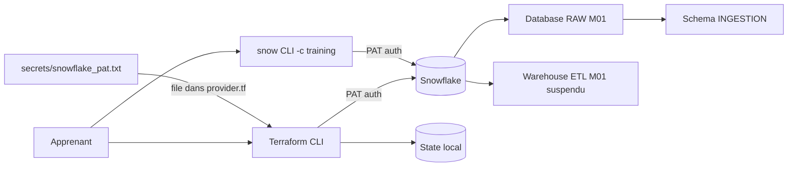

> _Fichier genere a partir de `courses/day-XX/module-YY/` — les liens relatifs internes pointent vers l'arborescence source._

# 🧪 Lab M1 — Créer votre premier projet Terraform Snowflake

> [<- Jour 1](../README.md) · [<- Jour 0](../../day-00/README.md) · **Module 1** · [Module suivant ->](../module-04-variables-outputs/lab.md)

| Élément | Valeur |
|---|---|
| **Durée** | 3 heures |
| **Piste** | `[CORE]` |
| **Workspace** | `$HOME/Data2AI-Labs/data-platform` (le clone du Jour 0) |
| **Dossier de travail** | `labs/m01-iac-workflow/` dans le clone |
| **Coût** | Warehouse X-SMALL, initialement suspendu |
| **Cleanup** | Conserver — `Reset-Lab.ps1` nettoie au redémarrage |

> `[IMPORTANT]` **Avant de commencer, vous devez etre dans la racine du clone
> et avoir execute `Learner-Login.ps1 -SnowflakeOnly` dans **cette session** (nouveau terminal).**
> Les variables d'environnement ne persistent pas entre les sessions.
>
> ```powershell
> cd "$HOME\Data2AI-Labs\data-platform"
> .\scripts\Learner-Login.ps1 -LearnerPrefix APP01 -SnowflakeOnly
> ```
>
> Cela set `TF_VAR_snowflake_token` (depuis `secrets/snowflake_pat.txt`)
> et `LEARNER_PREFIX`. **Aucun login Azure n'est requis pour les Jours 1 a 3** —
> l'infrastructure Azure (backend, Key Vault) est preconfiguree par le formateur
> et ne devient necessaire qu'au Jour 4.
>
> ```bash
> # macOS / Linux (Git Bash)
> cd ~/Data2AI-Labs/data-platform
> source ./scripts/learner-login.sh APP01 --snowflake-only
> ```
>
> Ensuite, réinitialisez le lab pour partir d'un état propre :
>
> ```powershell
> .\scripts\Reset-Lab.ps1 -LearnerPrefix APP01 -Lab M01
> ```
>
> Avant `terraform plan`, verifiez que tout est pret :
>
> ```powershell
> cd labs\m01-iac-workflow
> ..\..\scripts\Test-TerraformReady.ps1
> ```
>
> Si le pre-flight affiche `READY`, lancez `terraform init` puis `terraform plan -out "m01.tfplan"`.
> Sinon, suivez les corrections indiquees.
>
> `[NOTE]` Si `Test-TerraformReady.ps1` affiche `[WARN] TF_VAR_snowflake_token not set`,
> c'est **normal** : `provider.tf` lit le PAT directement depuis le fichier.
> Le WARN n'empeche pas `terraform plan` de fonctionner.

## 🎯 1. Mission Métier & User Story

Vous êtes Data Platform Engineer. Votre équipe vous demande une zone RAW minimale composée d'une database, d'un schema d'ingestion et d'un warehouse économique. Le changement doit être relisible avant exécution et reproductible sans exposer de credential.

> **En tant que :** Data Platform Engineer  
> **Je veux :** créer une zone RAW minimale (database + schema + warehouse) via Terraform  
> **Afin de :** garantir un déploiement reproductible, relisible et sans credential exposé
> **Votre persona GlobalBank :** appliquez ce lab sur les objets de votre équipe — 🔵 Platform, 🟢 Data Engineering, 🟠 Business Data, 🟣 BI (voir [personas-globalbank.md](../../shared/docs/personas-globalbank.md)).


---

## 🏗️ 2. Architecture & Modèle Mental




## 🎯 3. Objectifs Pédagogiques Vérifiables

- ✅ créer une configuration Terraform depuis le clone du projet type;
- ✅ authentifier le provider Snowflake avec un PAT sans placer de secret dans le code;
- ✅ expliquer les blocs `terraform`, `required_providers`, `provider` et `resource`;
- ✅ lire un plan avant application;
- ✅ prouver la création des trois ressources;
- ✅ vérifier l'idempotence avec un second plan.

## 🚀 4. Pre-Flight Diagnostic (Vérification Initiale)

### Prérequis

- [ ] Jour 0 terminé : `Toolchain status: READY`;
- [ ] `snow sql -q 'SELECT 1' -c training` réussit;
- [ ] le clone `data-platform-starter` existe sous `$HOME/Data2AI-Labs/data-platform`;
- [ ] vous connaissez votre préfixe unique (variable `LEARNER_PREFIX` dans `.env`);
- [ ] `Learner-Login.ps1 -SnowflakeOnly` a été exécuté dans **cette session** (les variables d'environnement ne persistent pas) ;
- [ ] `Test-TerraformReady.ps1` affiche `READY` (les éventuels `[WARN] ARM_*` sont normaux en Jours 1-3).

### Initialisation de session

✅ **Checkpoint 0 :** La commande affiche `Toolchain: READY`, `Snowflake Connection: READY`, `Workspace: CLEAN`.

> `[IMPORTANT]` Si `Test-TerraformReady.ps1` affiche `[FAIL] LEARNER_PREFIX not set`,
> c'est que `Learner-Login.ps1 -SnowflakeOnly` n'a pas été exécuté
> dans **ce terminal**. Retournez à la racine du projet et relancez-le :
> ```powershell
> cd "$HOME\Data2AI-Labs\data-platform"
> .\scripts\Learner-Login.ps1 -LearnerPrefix APP01 -SnowflakeOnly
> ```

---

## 📝 5. Étapes d'Implémentation Pas-à-Pas (80% Hands-On)

### 📝 Étape 5.1 — Se placer dans le bon dossier

Tous les fichiers de M1 vont dans `labs/m01-iac-workflow/` du clone. Ce dossier contient déjà des fichiers modèle (`provider.tf`, `versions.tf`, `variables.tf`, `terraform.tfvars.example`) que vous n'avez **pas** à créer — vous les examinerez à la Partie 2.

<details>
<summary>🪟 <b>Windows (PowerShell)</b></summary>

```powershell
cd "$HOME\Data2AI-Labs\data-platform"
cd labs\m01-iac-workflow
```
</details>

<details>
<summary>🐧 <b>Linux/macOS (Bash)</b></summary>

```bash
cd $HOME/Data2AI-Labs/data-platform
cd labs/m01-iac-workflow
```
</details>

Vérifiez que le dossier contient les fichiers modèle :

<details>
<summary>🪟 <b>Windows (PowerShell)</b></summary>

```powershell
Get-ChildItem -Force
```
</details>

<details>
<summary>🐧 <b>Linux/macOS (Bash)</b></summary>

```bash
ls -la
```
</details>

✅ **Checkpoint 1** : `provider.tf`, `versions.tf`, `variables.tf`, `terraform.tfvars.example`, `main.tf` (stub), `outputs.tf` (stub), `.gitignore`. Les fichiers `provider.tf`, `versions.tf` et `variables.tf` sont **pré-remplis** — vous ne les créez pas.

### 📝 Étape 5.2 — Examiner les fichiers modèle

Le dossier `labs/m01-iac-workflow/` contient déjà trois fichiers Terraform pré-remplis. Vous allez les examiner, puis initialiser Terraform.

#### Examiner `versions.tf`

Ouvrez `versions.tf` :

```powershell
code versions.tf
```

Il contient :

```hcl
terraform {
  required_version = "= 1.14.5"

  required_providers {
    snowflake = {
      source  = "snowflakedb/snowflake"
      version = "= 2.14.0"
    }
  }
}
```

- `required_version` épingle exactement la version Terraform de la politique;
- `source` identifie le provider officiel;
- `= 2.14.0` épingle exactement la version du provider, sans accepter de correctif non testé.

> 💡 **Note** : Pourquoi pas `~> 2.14.0` ? Voir [docs/version-policy.md](../../../docs/version-policy.md). Une contrainte souple autorise des versions différentes entre apprenants.

#### Examiner `provider.tf`

Ouvrez `provider.tf` :

```powershell
code provider.tf
```

Il contient un bloc `locals` qui lit le PAT depuis le fichier `secrets/snowflake_pat.txt`, puis un bloc `provider` :

```hcl
locals {
  pat_file = "${path.module}/../../secrets/snowflake_pat.txt"
  snowflake_token = try(trim(file(local.pat_file), "\n\r"), var.snowflake_token, "")
}

provider "snowflake" {
  organization_name = var.snowflake_organization
  account_name      = var.snowflake_account
  user              = var.snowflake_user
  authenticator     = "PROGRAMMATIC_ACCESS_TOKEN"
  token             = local.snowflake_token
}
```

- `organization_name` et `account_name` identifient le compte Snowflake (lus depuis `.env`) ;
- `authenticator = "PROGRAMMATIC_ACCESS_TOKEN"` indique au provider d'utiliser le PAT ;
- `token` reçoit la valeur du PAT lue directement depuis `secrets/snowflake_pat.txt` (deux niveaux au-dessus du dossier du lab). Aucun secret n'est écrit dans un fichier `.tf`.

> 🔒 **Security** : Le PAT est lu depuis le fichier `secrets/snowflake_pat.txt` créé au Jour 0. Le chemin `${path.module}/../../secrets/snowflake_pat.txt` remonte depuis `labs/m01-iac-workflow/` jusqu'à la racine du projet. Vous n'avez **pas** à charger le PAT manuellement — `provider.tf` s'en charge.

#### Examiner `variables.tf`

Ouvrez `variables.tf` :

```powershell
code variables.tf
```

Il contient les variables de base partagées entre tous les labs :

- `snowflake_organization`, `snowflake_account`, `snowflake_user` : connexion Snowflake;
- `snowflake_token` : PAT (sensible, avec un `default = ""` car `provider.tf` lit le fichier directement);
- `learner_prefix` : préfixe apprenant avec validation regex;
- `environment` : environnement avec validation (`DEV`, `UAT`, `PROD`).

> 💡 **Note** : Ce fichier est **pré-rempli**. Vous n'avez pas à le recréer, mais vous y ajouterez des variables spécifiques au lab (voir Étape 3.1).

#### Initialiser et valider

```powershell
terraform fmt
terraform init
terraform validate
```

✅ **Checkpoint 2** : `The configuration is valid.`

### 📝 Étape 5.3 — Créer les variables et les noms

#### Ajouter `warehouse_size` dans `variables.tf`

Le fichier `variables.tf` est pré-rempli avec les variables de base (examinées à l'Étape 5.2). **Ajoutez à la fin du fichier** (ne modifiez pas les variables existantes) :

```hcl
variable "warehouse_size" {
  type        = string
  description = "Training warehouse size"
  default     = "X-SMALL"

  validation {
    condition     = contains(["X-SMALL", "SMALL"], var.warehouse_size)
    error_message = "Training warehouses must be X-SMALL or SMALL."
  }
}
```

La validation empêche les warehouses trop grands pour ce lab.

#### Créer `locals.tf`

```powershell
code locals.tf
```

Ajoutez :

```hcl
locals {
  database_name  = "${var.learner_prefix}_M01_RAW_${var.environment}"
  schema_name    = "INGESTION"
  warehouse_name = "WH_${var.learner_prefix}_M01_ETL_${var.environment}"
  common_comment = "Managed by Terraform | Training | ${var.learner_prefix}"
}
```

> 💡 **Note** : Le préfixe `M01` dans les noms de ressources isole ce lab des autres. Chaque lab utilise son propre préfixe (`M02`, `M03`, etc.) pour éviter les conflits.

#### Créer `terraform.tfvars`

Copiez le fichier d'exemple puis complétez-le :

<details>
<summary>🪟 <b>Windows (PowerShell)</b></summary>

```powershell
Copy-Item terraform.tfvars.example terraform.tfvars
code terraform.tfvars
```
</details>

<details>
<summary>🐧 <b>Linux/macOS (Bash)</b></summary>

```bash
cp terraform.tfvars.example terraform.tfvars
code terraform.tfvars
```
</details>

Ajoutez la ligne `warehouse_size` à la fin :

```hcl
snowflake_organization = "ZVFXOZW"
snowflake_account      = "PM71247"
snowflake_user         = "DATA2AI"
learner_prefix         = "APP01"
environment            = "DEV"
warehouse_size         = "X-SMALL"
```

Remplacez `APP01` par votre préfixe (celui de votre `.env`). Adaptez les valeurs Snowflake à votre `.env` si nécessaire. Le fichier est ignoré par Git.

> ⚠️ **IMPORTANT** : Terraform lit les variables depuis `terraform.tfvars`, **pas** depuis `.env`.
> Si vous changez votre `LEARNER_PREFIX` dans `.env`, vous devez **aussi** le changer dans
> `terraform.tfvars`. Sinon le plan utilisera l'ancien préfixe.

> 💡 **Note** : La variable `snowflake_token` (le PAT) n'est **pas** dans `terraform.tfvars`. Elle est lue automatiquement par `provider.tf` depuis `secrets/snowflake_pat.txt`.

#### Formater et valider

```powershell
terraform fmt
terraform validate
```

✅ **Checkpoint 3** : `The configuration is valid.`

### 📝 Étape 5.4 — Créer les ressources

#### Créer `main.tf`

Remplacez le contenu du stub `main.tf` par :

```hcl
resource "snowflake_database" "raw" {
  name                        = local.database_name
  comment                     = local.common_comment
  data_retention_time_in_days = 1
}

resource "snowflake_schema" "ingestion" {
  database = snowflake_database.raw.name
  name     = local.schema_name
  comment  = local.common_comment
}

resource "snowflake_warehouse" "etl" {
  name                = local.warehouse_name
  comment             = local.common_comment
  warehouse_size      = var.warehouse_size
  auto_suspend        = 60
  auto_resume         = true
  initially_suspended = true
}
```

La référence `snowflake_database.raw.name` crée une dépendance implicite : Terraform doit créer la database avant son schema. Le warehouse est indépendant et peut être créé en parallèle.

#### Créer `outputs.tf`

Remplacez le contenu du stub `outputs.tf` par :

```hcl
output "database_name" {
  value       = snowflake_database.raw.name
  description = "Database created by the learner"
}

output "schema_name" {
  value       = snowflake_schema.ingestion.name
  description = "Schema created inside the database"
}

output "warehouse_name" {
  value       = snowflake_warehouse.etl.name
  description = "Cost-controlled training warehouse"
}
```

#### Formater et valider

```powershell
terraform fmt
terraform validate
```

✅ **Checkpoint 4** : `The configuration is valid.`

### 📝 Étape 5.5 — Planifier sans modifier

#### Vérifier le pre-flight

Le PAT est lu automatiquement par `provider.tf` — vous n'avez pas à le charger manuellement. Vérifiez simplement que tout est prêt :

```powershell
..\..\scripts\Test-TerraformReady.ps1
```

✅ **Checkpoint** : le pre-flight affiche `READY`.

> `[NOTE]` Si le pre-flight affiche `[WARN] TF_VAR_snowflake_token not set`, c'est **normal** :
> `provider.tf` lit le PAT directement depuis `secrets/snowflake_pat.txt`. Le WARN n'empeche
> pas `terraform plan` de fonctionner.
>
> `[NOTE]` Si le pre-flight affiche `[FAIL] LEARNER_PREFIX not set`,
> retournez à la racine du projet et relancez `Learner-Login.ps1 -SnowflakeOnly` :
> ```powershell
> cd ..\..
> .\scripts\Learner-Login.ps1 -LearnerPrefix APP01 -SnowflakeOnly
> cd labs\m01-iac-workflow
> ..\..\scripts\Test-TerraformReady.ps1
> ```
>
> `[NOTE]` Si le pre-flight affiche `[FAIL] Terraform found but 'terraform version' failed`,
> verifiez que terraform est bien installe :
> ```powershell
> & "$HOME\.data2ai\bin\terraform.exe" version
> ```
> Si cela fonctionne, le probleme vient du PATH. Relancez `Learner-Login.ps1` qui met a jour
> le PATH pour la session.
>
> 🔒 **Security** : Le PAT est lu depuis `secrets/snowflake_pat.txt` par `provider.tf`. Il n'apparaît ni dans le code, ni dans les logs, ni dans le state.

#### Planifier

<details>
<summary>🪟 <b>Windows (PowerShell)</b></summary>

```powershell
terraform plan -out "m01.tfplan"
```
</details>

<details>
<summary>🐧 <b>Linux/macOS (Bash)</b></summary>

```bash
terraform plan -out=m01.tfplan
```
</details>

> 💡 **Note** : Sur PowerShell, utilisez `-out "m01.tfplan"` (espace + guillemets) au lieu de `-out=m01.tfplan` pour éviter une erreur de parsing.

Le plan attendu contient exactement :

- `snowflake_database.raw`;
- `snowflake_schema.ingestion`;
- `snowflake_warehouse.etl`.

Il doit afficher `3 to add`, aucune modification et aucune destruction.

> 🔒 **Security** : Le plan contient des données de configuration. Il est ignoré par `*.tfplan`. Ne le commitez pas.

✅ **Checkpoint 5** : `Plan: 3 to add, 0 to change, 0 to destroy.`

### 📝 Étape 5.6 — Appliquer après revue

Avant de continuer, relisez le plan et confirmez votre préfixe. L'application crée trois objets dans le compte Snowflake.

```powershell
terraform apply m01.tfplan
```

✅ **Checkpoint 6** :

```text
Apply complete! Resources: 3 added, 0 changed, 0 destroyed.
```

### 📝 Étape 5.7 — Prouver le résultat & Vérification Graphique

#### Preuve Terraform

```powershell
terraform output
terraform state list
```

✅ **Checkpoint** : 3 ressources listées.

#### Preuve Snowflake (CLI)

La connexion `training` lit le PAT depuis le fichier automatiquement (configuré au Jour 0). Remplacez `APP01` par votre préfixe :

```powershell
snow sql -c training -q "SHOW DATABASES LIKE 'APP01_M01_RAW_DEV'"
snow sql -c training -q "SHOW SCHEMAS LIKE 'INGESTION' IN DATABASE APP01_M01_RAW_DEV"
snow sql -c training -q "SHOW WAREHOUSES LIKE 'WH_APP01_M01_ETL_DEV'"
```

#### Preuve Snowflake (interface web)

Connectez-vous à l'interface Snowflake (https://app.snowflake.com) avec votre
**username + password individuel** (fourni par le formateur, différent du PAT).

Vérifiez que vos ressources apparaissent dans chaque section :

**1. Database** — Allez dans **Data > Databases** et cherchez votre database :


> La database `APP01_M01_RAW_DEV` doit apparaître avec le schema `INGESTION`.

**2. Schema** — Cliquez sur votre database, puis vérifiez le schema :


> Le schema `INGESTION` doit exister sous votre database.

**3. Warehouse** — Allez dans **Admin > Warehouses** :


> Le warehouse `WH_APP01_M01_ETL_DEV` doit apparaître avec le statut `Suspended` (initialement suspendu).

> 💡 **Note** : Remplacez `APP01` par votre `LEARNER_PREFIX`. Si les ressources n'apparaissent pas, vérifiez que vous êtes sur le bon compte Snowflake (organisation + account).

#### Preuve d'idempotence

```powershell
terraform plan
```

✅ **Checkpoint 7** : `No changes. Your infrastructure matches the configuration.`

## 🐛 6. Incident Contrôlé (*Chaos Engineering Lab*)

*En entreprise, des modifications manuelles hors Terraform sont parfois faites par erreur dans l'interface graphique. Vous allez simuler ce scénario réel.*

### Symptôme & Injection de Dérive Manuelle (via Snowsight UI)
1. Dans votre navigateur sur **Snowflake Snowsight**, rendez-vous dans **Admin > Warehouses**.
2. Cliquez sur votre warehouse `WH_APP01_M01_ETL_DEV` > **... (Options)** > **Edit**.
3. Modifiez le champ **Comment** en saisissant : `'Modifié manuellement hors Terraform'`.
4. Cliquez sur **Save**.

### Diagnostic & Observation
1. Revenez dans votre terminal et exécutez un plan de détection :
   ```powershell
   terraform plan
   ```
2. Observez le diff généré :
   ```text
   ~ comment = "Modifié manuellement hors Terraform" -> "Managed by Terraform for APP01"
   Plan: 0 to add, 1 to change, 0 to destroy.
   ```
   Terraform a détecté que l'état réel ne correspond plus au code versionné !

### Remédiation
1. Exécutez :
   ```powershell
   terraform apply -auto-approve
   ```
2. Rafraîchissez votre navigateur dans Snowsight : le commentaire a été immédiatement restauré à sa valeur officielle sans interruption de service.

---

## 🤖 7. Validation Automatisée (*Check My Progress*)

Exécutez le script d'évaluation pour valider toutes les étapes du module :

```powershell
.\scripts\SelfPacedLab.ps1 -Module 1 -All -Report
```

✅ **Résultat attendu :**
```text
[PASS] T1 versions.tf exists
[PASS] T1 Snowflake provider pinned
[PASS] T1 provider.tf uses profile
[PASS] T2 Required variables
[PASS] T3 Database resource
[PASS] T3 Schema resource
[PASS] T3 Cost-controlled warehouse
[PASS] T4 terraform fmt & validate
[PASS] T5 Idempotent plan evidence
Result: 5/5 Tasks Passed.
```

---

## 🏆 8. Défi Autonome (*Unguided Challenge*)

> **Scénario :** Ajoutez un output `resource_summary` contenant les trois noms dans un objet.
> **Contraintes :**
> - `terraform fmt -check` réussit;
> - `terraform validate` réussit;
> - `terraform output resource_summary` affiche vos trois noms;
> - `terraform plan` reste sans changement;
> - aucun credential n'est présent dans les fichiers `.tf` ou `.tfvars`.

```hcl
output "resource_summary" {
  value = {
    database  = snowflake_database.raw.name
    schema    = snowflake_schema.ingestion.name
    warehouse = snowflake_warehouse.etl.name
  }
}
```

| Critère d'Évaluation | Points |
|---|---:|
| Syntaxe HCL et respect des standards | 30 pts |
| Preuve d'exécution fonctionnelle | 30 pts |
| Idempotence (`0 to add, 0 to change, 0 to destroy`) | 20 pts |
| Respect des budgets FinOps & Sécurité | 20 pts |
| **Total** | **100 pts** |

## 🧹 9. Nettoyage Contrôlé (*FinOps Teardown*)

> **M01 est un module de conservation.** Les ressources créées servent de base pour M02 (State Management). N'exécutez pas `terraform destroy` maintenant.

### Point de reprise

Conservez le workspace et les ressources. Pour reprendre :

<details>
<summary>🪟 <b>Windows (PowerShell)</b></summary>

```powershell
cd "$HOME\Data2AI-Labs\data-platform\labs\m01-iac-workflow"
terraform init
terraform plan
```
</details>

<details>
<summary>🐧 <b>Linux/macOS (Bash)</b></summary>

```bash
cd $HOME/Data2AI-Labs/data-platform/labs/m01-iac-workflow
terraform init
terraform plan
```
</details>

> ⚠️ **WARNING** : N'exécutez pas encore `terraform destroy`. Pour repartir d'un état propre au début du lab, utilisez `.\scripts\Reset-Lab.ps1 -LearnerPrefix APP01 -Lab M01` depuis la racine du projet.

## 🔧 Troubleshooting

| Symptôme | Cause | Solution |
|---|---|---|
| `Unsupported argument: connection_name` | Le provider 2.14.0 n'a pas d'argument `connection_name` | Utilisez `organization_name`, `account_name`, `user`, `authenticator`, `token` (voir `provider.tf`) |
| `Password is empty` | Le PAT n'est pas chargé | Vérifiez que `secrets/snowflake_pat.txt` existe à la racine du projet. `provider.tf` le lit automatiquement. |
| `Invalid account identifier` | L'identifiant de compte est mal formé | Vérifiez `snowflake_organization` et `snowflake_account` dans `terraform.tfvars` |
| `Insufficient privileges` | Le rôle n'a pas les droits de création | Vérifiez que `SNOWFLAKE_ROLE=SYSADMIN` dans `.env` |
| `snow sql` échoue hors du script | La connexion `training` n'existe pas | Relancez `New-SnowflakeConnection.ps1` |
| `Private Key authentication requires authenticator set to SNOWFLAKE_JWT` | La variable `SNOWFLAKE_PRIVATE_KEY_FILE` est définie dans la session | Voir `troubleshooting.md` entree 33 (Jour 0). Supprimez-la : `Remove-Item Env:\SNOWFLAKE_PRIVATE_KEY_FILE` |
| `[FAIL] LEARNER_PREFIX not set` dans Test-TerraformReady | `Learner-Login.ps1 -SnowflakeOnly` n'a pas été exécuté dans ce terminal | Retournez à la racine et relancez `Learner-Login.ps1 -SnowflakeOnly` |
| `[WARN] ARM_* not set` dans Test-TerraformReady | Normal en Jours 1-3 — Azure n'est requis qu'au Jour 4 (backend distant) | Aucune action |
| `[FAIL] Terraform found but 'terraform version' failed` | Terraform n'est pas dans le PATH de la session courante | Relancez `Learner-Login.ps1 -SnowflakeOnly` (met à jour le PATH) ou utilisez `& "$HOME\.data2ai\bin\terraform.exe"` |
| `Reset-Lab.ps1` : erreur parse `Le terminateur ' est manquant` | Ancienne version du script avec caractères non-ASCII | `git pull` pour obtenir la version corrigée |
| `terraform plan` demande `var.snowflake_token` | PAT file manquant ou vide | Voir section dédiée dans `troubleshooting.md` ci-dessous |

---

## Navigation

[<- Lab M00](../../day-00/module-00-setup/lab.md) · [<- Jour 1](../README.md) · **Lab M1** · [Lab M4 ->](../module-04-variables-outputs/lab.md)
