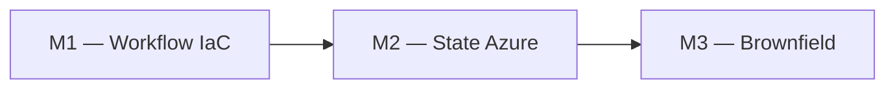
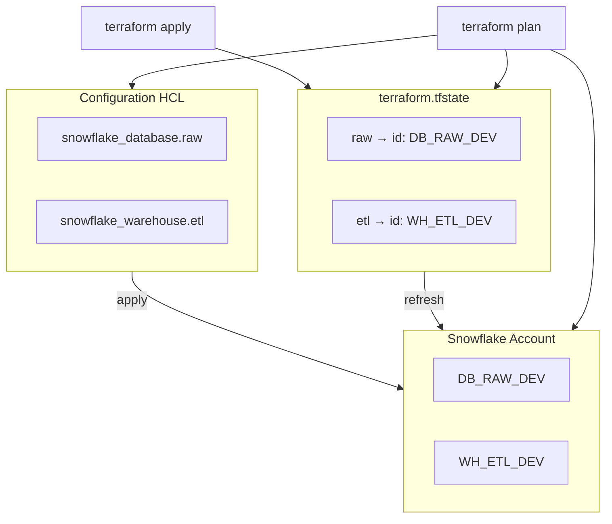
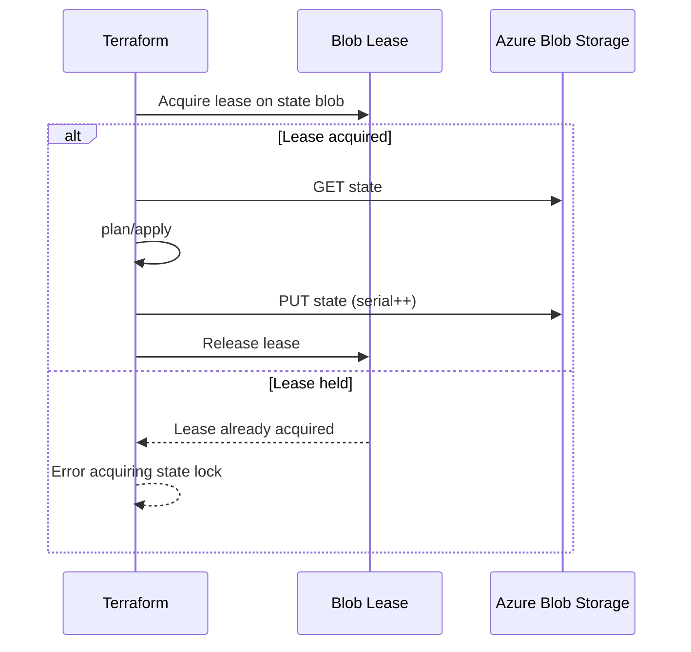
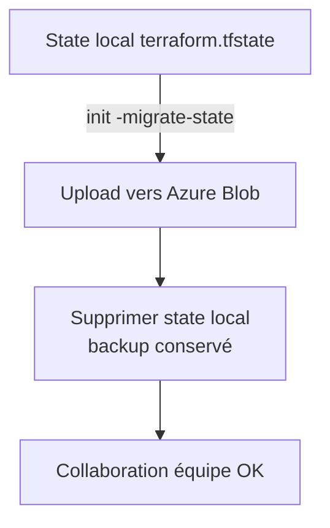
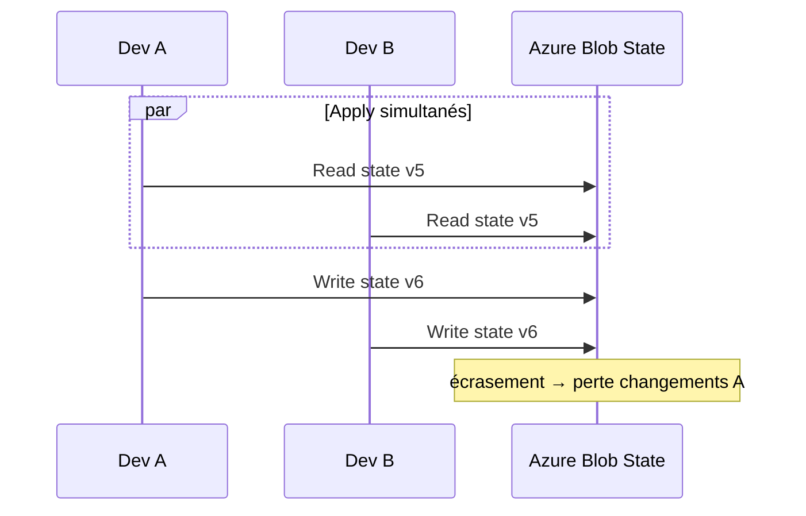

# Module 2 : Cours : Gestion du State

> [<- Jour 1](../README.md) · [<- Module precedent](../module-01-iac-workflow/lab.md) · **Module 2** · [Module suivant ->](../module-03-import-brownfield/lab.md)

## Contexte métier

Un state local crée un point de défaillance et autorise des applications concurrentes. Azure Blob Storage fournit une source de vérité partagée, chiffrée et verrouillée pour l'équipe plateforme.

## Contexte architecture



| Référentiel | Alignement |
|---|---|
| Pattern | Remote State |
| Azure Well-Architected | Fiabilité, Sécurité |
| Azure CAF | Ready |
| Platform Engineering | État partagé et verrouillage natif |

## Pattern d'entreprise

Le pattern **Remote State** centralise la correspondance code-réalité, utilise un Blob Lease contre les écritures concurrentes et isole chaque environnement par clé de state.

---

## 1. Rôle du state Terraform

Le state est la **mémoire** de Terraform. Il enregistre :

- Les identifiants des ressources créées
- Les relations de dépendance matérialisées
- Les valeurs des outputs
- Le serial et lineage (détection de forks)



### 1.1 Refresh et plan

Lors d'un `plan`, Terraform :

1. Lit le state
2. **Refresh** : interroge l'API pour l'état réel
3. Compare code vs réel
4. Produit le plan de changements

---

## 2. Structure du fichier state

```json
{
  "version": 4,
  "terraform_version": "1.14.5",
  "serial": 3,
  "lineage": "abc-123-def",
  "outputs": {
    "raw_database_name": {
      "value": "DB_RAW_DEV",
      "type": "string"
    }
  },
  "resources": [...]
}
```

| Champ | Signification |
|-------|---------------|
| `serial` | Incrémenté à chaque écriture |
| `lineage` | UUID unique du state (détecte remplacement accidentel) |
| `resources[].module` | Chemin module (racine = absent) |

---

## 3. Backends distants

### 3.1 Comparaison

| Backend | Locking | Usage typique |
|---------|---------|---------------|
| `local` | Non | Dev solo, labs |
| `azurerm` | Blob lease | Azure, standard entreprise |
| `s3` | DynamoDB | AWS |
| `gcs` | GCS native | GCP |
| `remote` (HCP Terraform) | Natif | équipes HashiCorp |

### 3.2 Configuration Azure Blob Storage (azurerm)

```hcl
terraform {
  backend "azurerm" {
    resource_group_name  = "rg-data2ai-tf-state"
    storage_account_name = "sadata2aitfstatemsn"
    container_name       = "tfstate"
    key                  = "training/APP01/dev/terraform.tfstate"
    use_azuread_auth     = true
  }
}
```



### 3.3 Infrastructure backend (bootstrap)

Paradoxe : le Storage Account Azure qui stocke le state doit exister **avant** le backend.

Solution : dossier `project/00-bootstrap/` créé manuellement ou via pipeline séparé (sans backend remote).

---

## 4. Migration local à distant

```powershell
# 1. Ajouter bloc backend dans versions.tf
# 2. Réinitialiser avec migration
terraform init -migrate-state

# Terraform demande :
# Do you want to copy existing state to the new backend?
# Enter "yes"
```



**Important** : sauvegarder le state local avant migration :

```powershell
Copy-Item terraform.tfstate terraform.tfstate.backup
```

---

## 5. State locking en détail

### 5.1 Scénario sans lock



### 5.2 Force unlock (urgence)

```powershell
terraform force-unlock LOCK_ID
```

À utiliser uniquement si apply interrompu (crash) et lock orphelin.

---

## 6. Sensibilité et Sécurité du State (Pilier Sécurité)

Le fichier d'état (`terraform.tfstate`) est hautement sensible car il peut contenir :
- La topologie complète de votre infrastructure.
- Les identifiants, configurations et variables d'environnement.
- Des secrets techniques générés dynamiquement.

### Recommandations de sécurité (Well-Architected) :
- **Chiffrement At-Rest & In-Transit** : Configurer le Storage Account Azure pour utiliser le chiffrement côté serveur avec des clés managées par Microsoft ou par le client (CMK) et forcer l'utilisation de TLS 1.2+ via les paramètres du compte de stockage.
- **Blocage de l'accès public** : Activer `container_access_type = "private"` sur le conteneur de state et configurer les règles de pare-feu du Storage Account pour restreindre l'accès aux réseaux autorisés.
- **Principe de moindre privilège** : Autoriser l'accès au Storage Account uniquement via l'identité managée (Managed Identity) utilisée par le pipeline CI/CD et aux administrateurs Cloud (RBAC `Storage Blob Data Contributor`).
- **Chiffrement du Storage Account** : Le chiffrement au repos est activé par défaut sur Azure Storage. Les Blob Leases utilisent le même chiffrement.
- **Pas de secret dans Git** : Ignorer systématiquement les fichiers `terraform.tfstate` locaux via le fichier `.gitignore`.

---


## 7. Commandes state avancées (aperçu)

| Commande | Usage |
|----------|-------|
| `terraform state list` | Lister ressources |
| `terraform state show` | Détail une ressource |
| `terraform state mv` | Renommer dans state |
| `terraform state rm` | Retirer du state (sans destroy) |
| `terraform state pull` | Exporter state JSON |

Module 3 couvrira `import` et `-generate-config-out`.

---

## 8. Synthèse

Le backend distant + locking est le **socle** de toute industrialisation Terraform multi-développeurs. Sans cela, pas de CI/CD fiable ni de collaboration sécurisée.

---

## 9. Design Patterns & Best Practices

| Pattern | Application |
|---------|-------------|
| **Remote State** | Azure Blob Storage (azurerm) = state partagé + locking. Standard de production. |
| **State Isolation** | Une clé de blob par environnement (`.../dev/...`, `.../prod/...`). |
| **Bootstrapping** | Premier apply en local pour créer le backend, puis migration. |
| **Sensitive State** | Chiffrement Azure Storage (SSE-CMK), RBAC restrictif, pas de state dans Git. |
| **State Composition** | `terraform_remote_state` pour lire le state d'un autre projet. |

### Lab associé

Voir [lab.md](./lab.md) pour la mise en pratique complète.

---

## Navigation

[<- Course M1](../module-01-iac-workflow/course.md) · [<- Jour 1](../README.md) · **Course M2** · [Course M3 ->](../module-03-import-brownfield/course.md)


