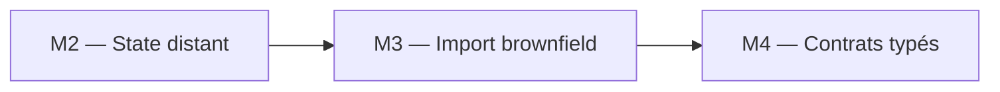
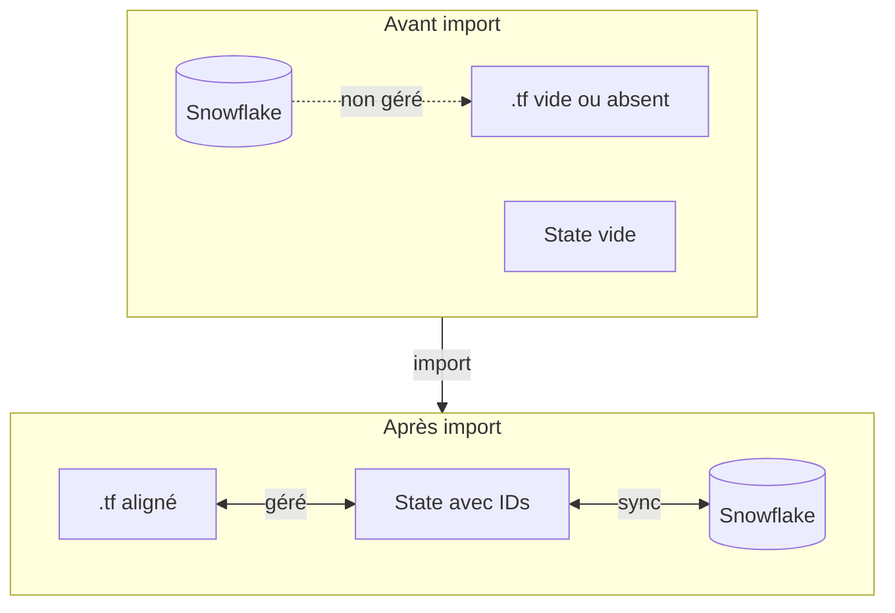
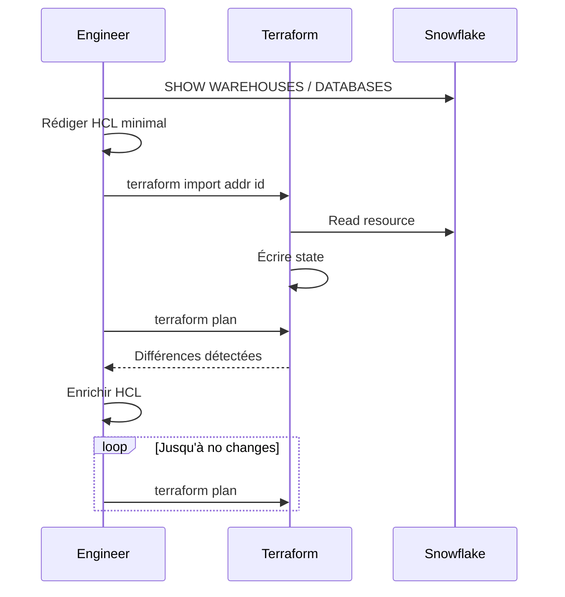
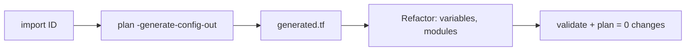

# Module 3 : Cours : Import Brownfield

> [<- Jour 1](../README.md) · [<- Module precedent](../module-02-state-management/lab.md) · **Module 3** · [Module suivant ->](../module-04-variables-outputs/lab.md)

## Contexte métier

Une entreprise ne remplace pas une plateforme Snowflake existante pour adopter Terraform. Elle l'intègre sans interruption, sans recréation et avec une trajectoire de retour arrière explicite.

## Contexte architecture



| Référentiel | Alignement |
|---|---|
| Pattern | Brownfield Import and Safe Refactoring |
| Azure Well-Architected | Fiabilité, Excellence opérationnelle |
| Azure CAF | Adopt |
| Platform Engineering | Adoption incrémentale sans interruption |

## Pattern d'entreprise

Le pattern **Brownfield Import** adopte les ressources existantes dans le state avant tout changement et utilise `moved` ou `state mv` pour refactorer sans destruction.

---

## 1. Contexte brownfield

La plupart des entreprises possèdent déjà une plateforme Snowflake créée manuellement. L'objectif n'est pas de tout recréer, mais d'**adopter** les ressources existantes dans Terraform sans interruption.



---

## 2. Workflow d'import recommandé



---

## 3. terraform import (manuel)

### 3.1 Syntaxe

```bash
terraform import [options] ADDRESS ID
```

Exemples Snowflake :

```bash
terraform import snowflake_database.raw DB_RAW_DEV
terraform import snowflake_warehouse.analytics WH_ANALYTICS_DEV
```

### 3.2 Configuration minimale préalable

Avant import, déclarer une ressource **vide** ou minimale :

```hcl
resource "snowflake_database" "raw" {
  # config complétée après premier plan
}
```

Sans bloc `resource`, Terraform refuse l'import.

---

## 4. Génération automatique de config (Terraform 1.5+)

### 4.1 Plan avec generate-config-out

Pour une ressource déjà dans le state ou après import partiel :

```bash
terraform plan -generate-config-out=generated.tf
```

Terraform génère un fichier avec les attributs observés.

### 4.2 Workflow combiné



---

## 5. Alignement configuration au réel

Après import, le premier `plan` montre souvent des **drifts** :

```
~ snowflake_warehouse.analytics
    auto_suspend: 60 -> 300
    comment: null -> "Legacy warehouse"
```

**Action** : mettre à jour le HCL pour refléter la réalité **ou** accepter le changement si normalisation souhaitée.

> **Règle d'or** : en brownfield, viser d'abord `plan = 0 changes`, puis refactoriser.

---

## 6. Import en masse

Pour de nombreuses ressources :

```bash
# Script PowerShell exemple
$databases = @("DB_RAW_DEV", "DB_CURATED_DEV")
foreach ($db in $databases) {
  terraform import "snowflake_database.dbs[\`"$db\`"]" $db
}
```

Combiner avec `for_each` dans le HCL.

---

## 7. state rm vs destroy

| Commande | Effet Snowflake | Effet State |
|----------|-----------------|-------------|
| `terraform destroy` | Supprime ressource | Retire du state |
| `terraform state rm` | **Aucun** | Retire du state seulement |

Utiliser `state rm` pour **démissionner** une ressource de Terraform sans la détruire.

---

## 8. moved{} block et state mv

### 8.1 moved{} block (Terraform 1.1+)

Le bloc `moved{}` permet de déclarer un renommage de ressource **sans détruire/recréer** :

```hcl
moved {
  from = snowflake_database.raw
  to   = snowflake_database.landing_raw
}
```

Terraform met à jour le state automatiquement lors du prochain `plan`/`apply`.

### 8.2 terraform state mv

Pour les renommages manuels (non déclarés dans le code) :

```bash
terraform state mv snowflake_database.raw snowflake_database.landing_raw
```

| Méthode | Avantage | Inconvénient |
|---------|----------|-------------|
| `moved{}` | Déclaratif, versionné, reproductible | Nécessite Terraform 1.1+ |
| `state mv` | Immediate, fonctionne sur state existant | Non versionné, manuel |

> **Best Practice :** Préférer `moved{}` pour tous les renommages. Réserver `state mv` aux cas urgents ou aux imports complexes.

---

## 9. Synthèse

L'import est la passerelle obligatoire vers Snowflake as Code en environnement existant. Patience et itération plan/HCL jusqu'à convergence zero-diff.

---

## 10. Design Patterns & Best Practices

| Pattern | Application |
|---------|-------------|
| **Brownfield Import** | Ressource existante → `terraform import` → `-generate-config-out` → alignment loop. |
| **Zero-Downtime Import** | `import` ne modifie ni ne détruit la ressource. Séquence safe. |
| **Alignment Loop** | `plan` → ajuster HCL → `plan` jusqu'à `No changes`. |
| **State rm vs Destroy** | `state rm` = retrait du state sans toucher Snowflake. `destroy` = suppression. |
| **-generate-config-out** | (Terraform ≥ 1.5) Génération automatique du HCL depuis le state importé. |
| **moved{} block** | (Terraform ≥ 1.1) Renommage déclaratif et versionné. Préférer à `state mv`. |

### Lab associé

Voir [lab.md](./lab.md) pour la mise en pratique complète.

---

## Navigation

[<- Course M2](../module-02-state-management/course.md) · [<- Jour 1](../README.md) · **Course M3** · [Course M4 ->](../module-04-variables-outputs/course.md)


