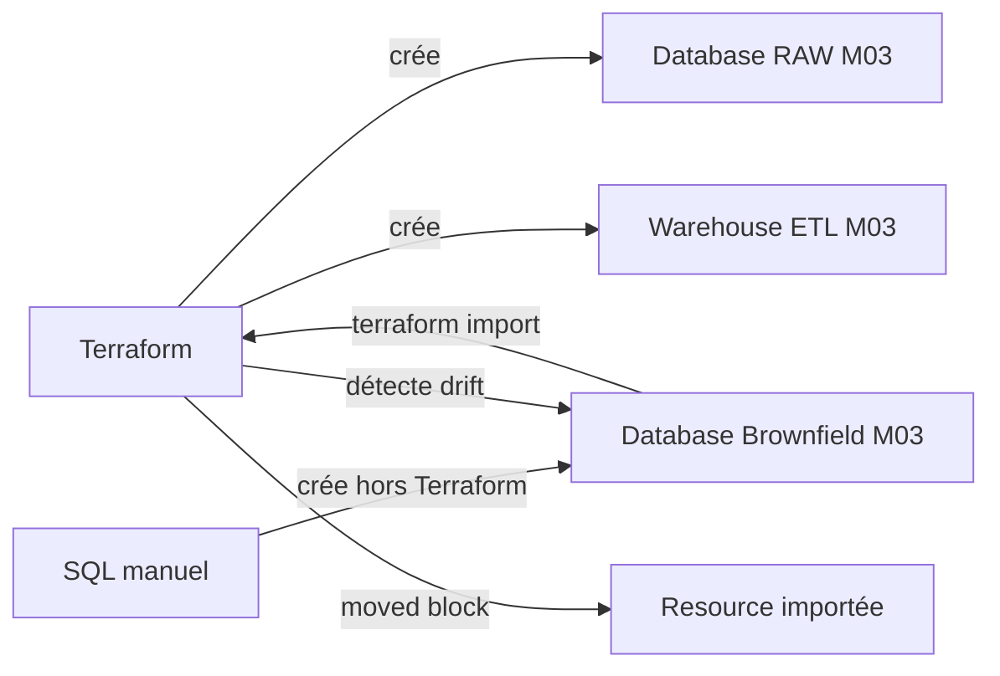

# 🧪 Lab M3 — Import brownfield et alignement Terraform

> [<- Jour 1](../README.md) · [<- Module precedent](../module-02-state-management/lab.md) · **Module 3** · [Module suivant ->](../module-04-variables-outputs/lab.md)

| Élément | Valeur |
|---|---|
| **Durée** | 60 min |
| **Piste** | `[CORE]` |
| **Workspace** | `$HOME/Data2AI-Labs/data-platform` (le clone) |
| **Dossier de travail** | `labs/m03-import-brownfield/` dans le clone |
| **Coût** | Aucune nouvelle ressource persistante |
| **Cleanup** | `terraform destroy -auto-approve` à la fin |

> `[IMPORTANT]` Avant de commencer, vous devez etre dans la racine du clone
> et avoir execute `Learner-Login.ps1` dans **cette session** :
>
> ```powershell
> cd "$HOME\Data2AI-Labs\data-platform"
> .\scripts\Learner-Login.ps1 -LearnerPrefix APP01
> ```
>
> Cela set `TF_VAR_snowflake_token` (depuis `secrets/snowflake_pat.txt`)
> et les variables `ARM_*` pour Terraform.
>
> Ensuite, réinitialisez le lab pour partir d'un état propre :
>
> ```powershell
> .\scripts\Reset-Lab.ps1 -LearnerPrefix APP01 -Lab M03
> ```
>
> Avant `terraform plan`, verifiez que tout est pret :
>
> ```powershell
> cd labs\m03-import-brownfield
> ..\..\scripts\Test-TerraformReady.ps1
> ```
>
> Si le pre-flight affiche `READY`, lancez `terraform plan -out "m03.tfplan"`.
> Sinon, suivez les corrections indiquees.

## 🎯 1. Mission Métier & User Story

Une entreprise ne remplace pas une plateforme Snowflake existante pour adopter Terraform. Elle l'intègre sans interruption. Vous allez créer des ressources Terraform, puis importer une ressource Snowflake existante (brownfield) dans le state Terraform, et corriger la dérive.

> **En tant que :** Data Platform Engineer  
> **Je veux :** importer une ressource Snowflake existante (brownfield) dans Terraform  
> **Afin de :** aligner l'infrastructure réelle avec le code versionné sans interruption de service

---

## 🏗️ 2. Architecture & Modèle Mental



## 🎯 3. Objectifs Pédagogiques Vérifiables

- ✅ créer des ressources Snowflake avec Terraform (state local);
- ✅ importer une ressource Snowflake existante dans Terraform;
- ✅ générer la configuration à partir de l'import;
- ✅ détecter et corriger une dérive intentionnelle;
- ✅ utiliser un bloc `moved` pour refactorer sans destruction.

## � 4. Pre-Flight Diagnostic (Vérification Initiale)

### Prérequis

- [ ] Jour 0 terminé : `Toolchain status: READY`;
- [ ] `snow sql -q 'SELECT 1' -c training` réussit;
- [ ] le clone `data-platform-starter` existe sous `$HOME/Data2AI-Labs/data-platform`;
- [ ] vous connaissez votre préfixe unique (variable `LEARNER_PREFIX` dans `.env`).

## 📝 5. Étapes d'Implémentation Pas-à-Pas (80% Hands-On)

### 📝 Étape 5.1 — Créer les ressources Snowflake (state local)

Ce lab est **autonome** : il ne dépend pas de M1 ou M2. Vous allez créer vos propres ressources avec un préfixe `M03`, puis importer une database brownfield.

#### Se placer dans le dossier du lab

<details>
<summary>🪟 <b>Windows (PowerShell)</b></summary>

```powershell
cd "$HOME\Data2AI-Labs\data-platform\labs\m03-import-brownfield"
Get-ChildItem -Force
```
</details>

<details>
<summary>🐧 <b>Linux/macOS (Bash)</b></summary>

```bash
cd "$HOME/Data2AI-Labs/data-platform/labs/m03-import-brownfield"
ls -la
```
</details>

✅ **Checkpoint** : `provider.tf`, `versions.tf`, `variables.tf`, `terraform.tfvars.example`, `main.tf` (stub), `outputs.tf` (stub), `.gitignore`.

#### Ajouter `warehouse_size` dans `variables.tf`

Le fichier `variables.tf` est pré-rempli avec les variables de base. **Ajoutez à la fin du fichier** :

```hcl
variable "warehouse_size" {
  type        = string
  description = "Training warehouse size"
  default     = "X-SMALL"

  validation {
    condition     = contains(["X-SMALL", "SMALL"], var.warehouse_size)
    error_message = "Training warehouses must be X-SMALL or SMALL."
  }
}
```

#### Créer `locals.tf`

```powershell
code locals.tf
```

```hcl
locals {
  database_name  = "${var.learner_prefix}_M03_RAW_${var.environment}"
  schema_name    = "INGESTION"
  warehouse_name = "WH_${var.learner_prefix}_M03_ETL_${var.environment}"
  common_comment = "Managed by Terraform | Training | ${var.learner_prefix}"
}
```

#### Créer `terraform.tfvars`

<details>
<summary>🪟 <b>Windows (PowerShell)</b></summary>

```powershell
Copy-Item terraform.tfvars.example terraform.tfvars
code terraform.tfvars
```
</details>

<details>
<summary>� <b>Linux/macOS (Bash)</b></summary>

```bash
cp terraform.tfvars.example terraform.tfvars
code terraform.tfvars
```
</details>

Ajoutez la ligne `warehouse_size` à la fin :

```hcl
snowflake_organization = "ZVFXOZW"
snowflake_account      = "PM71247"
snowflake_user         = "DATA2AI"
learner_prefix         = "APP01"
environment            = "DEV"
warehouse_size         = "X-SMALL"
```

Remplacez `APP01` par votre préfixe.

#### Créer `main.tf`

Remplacez le contenu du stub `main.tf` par :

```hcl
resource "snowflake_database" "raw" {
  name                        = local.database_name
  comment                     = local.common_comment
  data_retention_time_in_days = 1
}

resource "snowflake_schema" "ingestion" {
  database = snowflake_database.raw.name
  name     = local.schema_name
  comment  = local.common_comment
}

resource "snowflake_warehouse" "etl" {
  name                = local.warehouse_name
  comment             = local.common_comment
  warehouse_size      = var.warehouse_size
  auto_suspend        = 60
  auto_resume         = true
  initially_suspended = true
}
```

#### Créer `outputs.tf`

Remplacez le contenu du stub `outputs.tf` par :

```hcl
output "database_name" {
  value       = snowflake_database.raw.name
  description = "Database created by the learner"
}

output "schema_name" {
  value       = snowflake_schema.ingestion.name
  description = "Schema created inside the database"
}

output "warehouse_name" {
  value       = snowflake_warehouse.etl.name
  description = "Cost-controlled training warehouse"
}
```

#### Initialiser, planifier, appliquer

```powershell
terraform fmt
terraform init
terraform validate
terraform plan -out "m03.tfplan"
terraform apply m03.tfplan
```

✅ **Checkpoint 1** :

```text
Apply complete! Resources: 3 added, 0 changed, 0 destroyed.
```

```powershell
terraform state list
```

✅ **Checkpoint** : 3 ressources listées (`snowflake_database.raw`, `snowflake_schema.ingestion`, `snowflake_warehouse.etl`).

> 🔒 **Security** : n'affichez jamais `ARM_CLIENT_SECRET`, `SNOWFLAKE_PAT` ou `TF_VAR_snowflake_token`.

### 📝 Étape 5.2 — Créer une ressource hors Terraform

#### Créer une database manuellement dans Snowflake

Chaque apprenant utilise son préfixe pour éviter les conflits de noms dans le compte Snowflake partagé. Remplacez `APP01` par votre préfixe.

<details>
<summary>🪟 <b>Windows (PowerShell)</b></summary>

```powershell
$brownfieldDb = "DB_${env:LEARNER_PREFIX}_M03_BROWNFIELD_DEV"
snow sql -c training -q "CREATE DATABASE $brownfieldDb COMMENT = 'Created manually outside Terraform'"
```
</details>

<details>
<summary>🐧 <b>Linux/macOS (Bash)</b></summary>

```bash
brownfield_db="DB_${LEARNER_PREFIX}_M03_BROWNFIELD_DEV"
snow sql -c training -q "CREATE DATABASE ${brownfield_db} COMMENT = 'Created manually outside Terraform'"
```
</details>

> 💡 **Note** : Avec le préfixe `APP01`, la database s'appelle `DB_APP01_M03_BROWNFIELD_DEV`. Utilisez le même nom dans toutes les étapes suivantes.

#### Vérifier

<details>
<summary>🪟 <b>Windows (PowerShell)</b></summary>

```powershell
snow sql -c training -q "SHOW DATABASES LIKE 'DB_${env:LEARNER_PREFIX}_M03_BROWNFIELD_DEV'"
```
</details>

<details>
<summary>🐧 <b>Linux/macOS (Bash)</b></summary>

```bash
snow sql -c training -q "SHOW DATABASES LIKE 'DB_${LEARNER_PREFIX}_M03_BROWNFIELD_DEV'"
```
</details>

✅ **Checkpoint 2** : une ligne avec votre database (par exemple `DB_APP01_M03_BROWNFIELD_DEV`).

> 💡 **Note** : Cette ressource existe dans Snowflake mais **pas** dans le state Terraform. C'est une ressource brownfield.

### 📝 Étape 5.3 — Importer dans Terraform

#### Ajouter un bloc resource vide

Dans `labs/m03-import-brownfield/main.tf`, ajoutez à la fin du fichier. Remplacez `APP01` par votre préfixe :

```hcl
resource "snowflake_database" "brownfield" {
  name = "DB_APP01_M03_BROWNFIELD_DEV"
}
```

> 💡 **Note** : Utilisez le nom exact de la database créée à l'étape 2.1. Si vous l'avez personnalisée, adaptez la valeur.

#### Formater et valider

<details>
<summary>🪟 <b>Windows (PowerShell)</b></summary>

```powershell
terraform fmt
terraform validate
```
</details>

<details>
<summary>🐧 <b>Linux/macOS (Bash)</b></summary>

```bash
terraform fmt
terraform validate
```
</details>

✅ **Checkpoint** : `Success! The configuration is valid.`

#### Importer la ressource

<details>
<summary>🪟 <b>Windows (PowerShell)</b></summary>

```powershell
terraform import snowflake_database.brownfield "DB_${env:LEARNER_PREFIX}_M03_BROWNFIELD_DEV"
```
</details>

<details>
<summary>🐧 <b>Linux/macOS (Bash)</b></summary>

```bash
terraform import snowflake_database.brownfield "DB_${LEARNER_PREFIX}_M03_BROWNFIELD_DEV"
```
</details>

✅ **Checkpoint 3** :

```text
Import successful!
```

#### Vérifier le state

<details>
<summary>🪟 <b>Windows (PowerShell)</b></summary>

```powershell
terraform state list
```
</details>

<details>
<summary>🐧 <b>Linux/macOS (Bash)</b></summary>

```bash
terraform state list
```
</details>

✅ **Checkpoint** : la liste contient `snowflake_database.brownfield` en plus des ressources M03.

#### Générer la configuration

<details>
<summary>🪟 <b>Windows (PowerShell)</b></summary>

```powershell
terraform plan -generate-config-out=generated.tf
```
</details>

<details>
<summary>🐧 <b>Linux/macOS (Bash)</b></summary>

```bash
terraform plan -generate-config-out=generated.tf
```
</details>

Terraform compare le state et la configuration, puis génère un fichier avec les attributs réels de la ressource.

✅ **Checkpoint** : un fichier `generated.tf` est créé avec la configuration complète de la database.

#### Intégrer la configuration générée

Ouvrez `generated.tf`, copiez les attributs pertinents dans `main.tf` (dans le bloc `snowflake_database.brownfield`), puis supprimez `generated.tf` :

<details>
<summary>🪟 <b>Windows (PowerShell)</b></summary>

```powershell
Remove-Item generated.tf
```
</details>

<details>
<summary>🐧 <b>Linux/macOS (Bash)</b></summary>

```bash
rm generated.tf
```
</details>

Votre `main.tf` devrait maintenant contenir (avec votre préfixe) :

```hcl
resource "snowflake_database" "brownfield" {
  name                        = "DB_APP01_M03_BROWNFIELD_DEV"
  comment                     = "Created manually outside Terraform"
  data_retention_time_in_days = 1
}
```

#### Formater, valider, planifier

<details>
<summary>🪟 <b>Windows (PowerShell)</b></summary>

```powershell
terraform fmt
terraform validate
terraform plan
```
</details>

<details>
<summary>🐧 <b>Linux/macOS (Bash)</b></summary>

```bash
terraform fmt
terraform validate
terraform plan
```
</details>

✅ **Checkpoint 4** : `No changes. Your infrastructure matches the configuration.`

### 📝 Étape 5.4 — Détecter et corriger une dérive

#### Modifier la ressource hors Terraform

<details>
<summary>🪟 <b>Windows (PowerShell)</b></summary>

```powershell
snow sql -c training -q "ALTER DATABASE DB_${env:LEARNER_PREFIX}_M03_BROWNFIELD_DEV SET COMMENT = 'Modified outside Terraform'"
```
</details>

<details>
<summary>🐧 <b>Linux/macOS (Bash)</b></summary>

```bash
snow sql -c training -q "ALTER DATABASE DB_${LEARNER_PREFIX}_M03_BROWNFIELD_DEV SET COMMENT = 'Modified outside Terraform'"
```
</details>

#### Détecter la dérive

<details>
<summary>🪟 <b>Windows (PowerShell)</b></summary>

```powershell
terraform plan
```
</details>

<details>
<summary>🐧 <b>Linux/macOS (Bash)</b></summary>

```bash
terraform plan
```
</details>

✅ **Checkpoint** : Terraform détecte que le `comment` a changé et propose de le remettre à la valeur de la configuration.

#### Corriger la dérive

<details>
<summary>🪟 <b>Windows (PowerShell)</b></summary>

```powershell
terraform apply
```
</details>

<details>
<summary>🐧 <b>Linux/macOS (Bash)</b></summary>

```bash
terraform apply
```
</details>

✅ **Checkpoint** : Terraform remet le `comment` à la valeur définie dans `main.tf`.

#### Vérifier l'idempotence

<details>
<summary>🪟 <b>Windows (PowerShell)</b></summary>

```powershell
terraform plan
```
</details>

<details>
<summary>🐧 <b>Linux/macOS (Bash)</b></summary>

```bash
terraform plan
```
</details>

✅ **Checkpoint 5** : `No changes.`

### 📝 Étape 5.5 — Refactorer avec un bloc moved

#### Renommer la ressource dans main.tf

Renommez `snowflake_database.brownfield` en `snowflake_database.imported` :

```hcl
resource "snowflake_database" "imported" {
  name                        = "DB_APP01_M03_BROWNFIELD_DEV"
  comment                     = "Created manually outside Terraform"
  data_retention_time_in_days = 1
}
```

#### Ajouter un bloc moved

Ajoutez en haut de `main.tf` :

```hcl
moved {
  from = snowflake_database.brownfield
  to   = snowflake_database.imported
}
```

#### Planifier

<details>
<summary>🪟 <b>Windows (PowerShell)</b></summary>

```powershell
terraform plan
```
</details>

<details>
<summary>🐧 <b>Linux/macOS (Bash)</b></summary>

```bash
terraform plan
```
</details>

✅ **Checkpoint** : `1 resource has been moved.` et `No changes.` — Terraform a déplacé la ressource dans le state sans la recréer.

#### Appliquer

<details>
<summary>🪟 <b>Windows (PowerShell)</b></summary>

```powershell
terraform apply
```
</details>

<details>
<summary>🐧 <b>Linux/macOS (Bash)</b></summary>

```bash
terraform apply
```
</details>

#### Supprimer le bloc moved

Une fois le move appliqué, supprimez le bloc `moved` de `main.tf`. Il n'est plus nécessaire.

<details>
<summary>🪟 <b>Windows (PowerShell)</b></summary>

```powershell
terraform fmt
terraform validate
terraform plan
```
</details>

<details>
<summary>🐧 <b>Linux/macOS (Bash)</b></summary>

```bash
terraform fmt
terraform validate
terraform plan
```
</details>

✅ **Checkpoint 6** : `No changes.`

## 🐛 6. Incident Contrôlé (*Chaos Engineering Lab*)

*Snowflake est sensible à la casse uniquement pour les identifiants quotés. Vous allez le constater en conditions réelles.*

### Symptôme & Injection

Dans votre bloc `import {}`, modifiez l'identifiant en minuscules :

```hcl
import {
  to = snowflake_database.brownfield
  id = "app01_m03_brownfield_dev"  # ← minuscules
}
```

### Diagnostic & Observation

Lancez `terraform plan`. Snowflake ne retrouve pas la ressource car les identifiants non quotés sont stockés en majuscules.

L'erreur retournée contient `Error: Cannot import non-existent remote object`.

### Remédiation

Rétablissez les majuscules (`APP01_M03_BROWNFIELD_DEV`), relancez et constatez le plan d'import réussi.

---

## 🤖 7. Validation Automatisée (*Check My Progress*)

```powershell
.\scripts\SelfPacedLab.ps1 -Module 3 -All -Report
```

✅ **Résultat attendu :**
```text
[PASS] T1 import block declared
[PASS] T2 generated config cleaned
[PASS] T3 Drift detected and corrected
[PASS] T4 moved block used (zero destroy)
[PASS] T5 terraform fmt & validate
Result: 5/5 Tasks Passed.
```

---

## 🏆 8. Défi Autonome (*Unguided Challenge*)

> **Scénario :** Importez le warehouse créé dans ce lab dans une nouvelle ressource `snowflake_warehouse.imported_etl` avec un bloc `moved`.
> **Contraintes :**
> - `terraform import` réussit;
> - `terraform plan` affiche `No changes` après alignement;
> - le bloc `moved` déplace la ressource sans destruction;
> - `terraform state list` affiche le nouveau nom.

| Critère d'Évaluation | Points |
|---|---:|
| Syntaxe HCL et respect des standards | 30 pts |
| Preuve d'exécution fonctionnelle | 30 pts |
| Idempotence (`0 to add, 0 to change, 0 to destroy`) | 20 pts |
| Respect des budgets FinOps & Sécurité | 20 pts |
| **Total** | **100 pts** |

## 🧹 9. Nettoyage Contrôlé (*FinOps Teardown*)

Détruisez toutes les ressources créées dans ce lab (y compris la database brownfield importée) :

<details>
<summary>🪟 <b>Windows (PowerShell)</b></summary>

```powershell
cd "$HOME\Data2AI-Labs\data-platform\labs\m03-import-brownfield"
terraform destroy -auto-approve
```
</details>

<details>
<summary>🐧 <b>Linux/macOS (Bash)</b></summary>

```bash
cd "$HOME/Data2AI-Labs/data-platform/labs/m03-import-brownfield"
terraform destroy -auto-approve
```
</details>

✅ **Checkpoint cleanup** :

```text
Destroy complete! Resources: 4 destroyed.
```

> 💡 **Note** : `terraform destroy` supprime la database RAW, le schema, le warehouse et la database brownfield importée. Pour repartir d'un état propre, vous pouvez aussi utiliser `.\scripts\Reset-Lab.ps1 -LearnerPrefix APP01 -Lab M03` depuis la racine du projet.

---

## Navigation

[<- Lab M2](../module-02-state-management/lab.md) · [<- Jour 1](../README.md) · **Lab M3** · [Lab M4 ->](../module-04-variables-outputs/lab.md)
