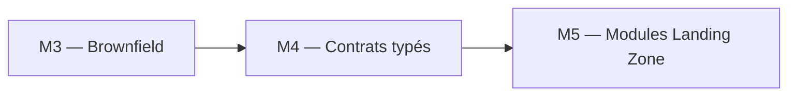
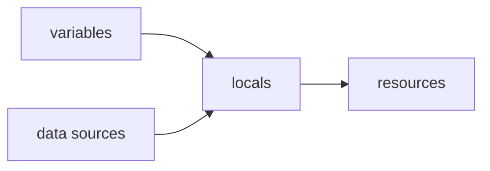

# Module 4 : Cours : Variables et Outputs

> [<- Jour 1](../README.md) · [<- Module precedent](../module-03-import-brownfield/lab.md) · **Module 4** · [Jour 2 ->](../../day-02/README.md)

## Contexte métier

Des valeurs dispersées et non validées rendent les environnements incohérents. Variables, validations, locals et outputs constituent le contrat stable consommé par les équipes et les modules.

## Contexte architecture



| Référentiel | Alignement |
|---|---|
| Pattern | Typed Configuration Contract |
| Azure Well-Architected | Fiabilité, Excellence opérationnelle |
| Azure CAF | Ready |
| Platform Engineering | Interface stable et validée |

## Pattern d'entreprise

Le pattern **Typed Configuration Contract** rejette les configurations invalides avant le plan et découple les consommateurs de l'implémentation interne.

---

## 1. Variables d'entrée

Les variables rendent le code **réutilisable** entre environnements sans duplication.

```hcl
variable "environment" {
  type        = string
  description = "Target environment"
  default     = "DEV"

  validation {
    condition     = can(regex("^(DEV|TEST|PROD)$", var.environment))
    error_message = "environment must be DEV, TEST, or PROD."
  }
}

variable "warehouse_size" {
  type    = string
  default = "X-SMALL"
}
```

### 1.1 Types courants

| Type HCL | Exemple |
|----------|---------|
| `string` | `"DEV"` |
| `number` | `60` |
| `bool` | `true` |
| `list(string)` | `["SALES", "FINANCE"]` |
| `map(string)` | `{ Env = "DEV" }` |
| `object({...})` | Struct typée |

### 1.2 Fichiers tfvars

```hcl
# environments/dev.tfvars
environment     = "DEV"
warehouse_size  = "X-SMALL"
snowflake_role  = "ACCOUNTADMIN"
```

```powershell
terraform plan -var-file="environments/dev.tfvars"
```

---

## 2. Locals

```hcl
locals {
  name_prefix = "${var.project}_${var.environment}"
  database_raw_name = "DB_RAW_${var.environment}"

  common_comment = "Managed by Terraform | ${var.environment}"
}
```



**Quand utiliser locals vs variables ?**

- **Variable** : valeur configurable de l'extérieur
- **Local** : dérivée, non exposée en input

---

## 3. Outputs

```hcl
output "raw_database_name" {
  value       = snowflake_database.raw.name
  description = "Raw layer database"
}

output "connection_hint" {
  value     = "USE DATABASE ${snowflake_database.raw.name};"
  sensitive = false
}
```

### 3.1 Chaînage entre modules

```hcl
module "landing_zone" {
  source = "./modules/landing-zone"
  environment = var.environment
}

output "warehouse_names" {
  value = module.landing_zone.warehouse_names
}
```

---

## 4. Ordre de priorité des valeurs

| Priorité (haute à basse) | Source |
|--------------------------|--------|
| 1 | `-var` / `-var-file` CLI |
| 2 | `TF_VAR_name` environnement |
| 3 | `terraform.tfvars` / `*.auto.tfvars` |
| 4 | `default` dans variable |

---

## 5. Sensitive values

```hcl
variable "private_key_path" {
  type      = string
  sensitive = true
}

output "debug" {
  value     = var.private_key_path
  sensitive = true
}
```

Les valeurs sensitives sont masquées dans les logs CI.

---

## 6. depends_on et lifecycle

### 6.1 depends_on (dépendance explicite)

Quand Terraform ne peut pas détecter une dépendance implicite :

```hcl
resource "snowflake_database" "raw" {
  name = "DB_RAW_DEV"
}

resource "snowflake_schema" "ingestion" {
  database   = snowflake_database.raw.name
  name       = "INGESTION"
  depends_on = [snowflake_database.raw]
}
```

### 6.2 lifecycle (méta-arguments)

Le bloc `lifecycle` contrôle le comportement de la ressource :

```hcl
resource "snowflake_database" "raw" {
  name = "DB_RAW_DEV"

  lifecycle {
    prevent_destroy       = true   # Empêche terraform destroy
    ignore_changes        = [comment]  # Ignore les drifts sur ces attributs
    create_before_destroy = true   # Crée le nouveau avant de détruire l'ancien
  }
}
```

| Argument | Effet | Cas d'usage |
|----------|-------|-------------|
| `prevent_destroy` | Bloque `terraform destroy` | Bases de données PROD, ressources critiques |
| `ignore_changes` | Ignore les drifts sur certains attributs | Tags gérés par un autre outil |
| `create_before_destroy` | Ordre création puis destruction | Ressources avec contraintes d'unicité |

> **Best Practice :** Utiliser `prevent_destroy` sur les bases de données en production. `ignore_changes` avec parcimonie (masque des drifts).

---

## 7. Synthèse

Variables + locals + outputs = contrat clair entre modules et environnements. Base du pattern multi-env (Module 8).

---

## 8. Design Patterns & Best Practices

| Pattern | Application |
|---------|-------------|
| **Variable Validation** | `validation { condition = contains(...) }` pour du type-checking avancé. |
| **Locals pour Naming** | Centraliser les conventions (`local.db_raw_name = "DB_RAW_${var.environment}"`). |
| **Outputs comme Contrat** | Les outputs sont l'interface publique d'un module. Documenter chaque output. |
| **Sensitive Outputs** | `sensitive = true` pour les secrets. Masqué dans les logs CI. |
| **Précédence des Valeurs** | `default < tfvars < TF_VAR_* < -var`. Tester dans l'ordre. |
| **tfvars par Environnement** | `environments/dev.tfvars`, `environments/test.tfvars` = paramétrage sans duplication. |
| **lifecycle prevent_destroy** | Protéger les ressources critiques (DB PROD) contre `terraform destroy`. |
| **lifecycle ignore_changes** | Ignorer les drifts sur les attributs gérés externement (tags, comments). |
| **depends_on explicite** | Forcer l'ordre quand Terraform ne détecte pas la dépendance. |

### Lab associé

Voir [lab.md](./lab.md) pour la mise en pratique complète.

---

## Navigation

[<- Course M3](../module-03-import-brownfield/course.md) · [<- Jour 1](../README.md) · **Course M4** · [Course M5 ->](../../day-02/module-05-modules/course.md)


