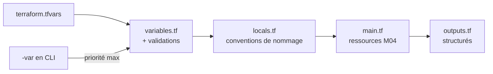

# 🧪 Lab M4 — Variables, locals, outputs et lifecycle

> [<- Jour 1](../README.md) · [<- Module precedent](../module-03-import-brownfield/lab.md) · **Module 4** · [Jour 2 ->](../../day-02/README.md)

| Élément | Valeur |
|---|---|
| **Durée** | 50 min |
| **Piste** | `[CORE]` |
| **Workspace** | `$HOME/Data2AI-Labs/data-platform` (le clone) |
| **Dossier de travail** | `labs/m04-variables-outputs/` dans le clone |
| **Coût** | Aucune nouvelle ressource persistante |
| **Cleanup** | Conserver — `Reset-Lab.ps1` nettoie au redémarrage |

> `[IMPORTANT]` Avant de commencer, vous devez etre dans la racine du clone
> et avoir execute `Learner-Login.ps1` dans **cette session** :
>
> ```powershell
> cd "$HOME\Data2AI-Labs\data-platform"
> .\scripts\Learner-Login.ps1 -LearnerPrefix APP01
> ```
>
> Cela set `TF_VAR_snowflake_token` (depuis `secrets/snowflake_pat.txt`)
> et les variables `ARM_*` pour Terraform.
>
> Ensuite, réinitialisez le lab pour partir d'un état propre :
>
> ```powershell
> .\scripts\Reset-Lab.ps1 -LearnerPrefix APP01 -Lab M04
> ```
>
> Avant `terraform plan`, verifiez que tout est pret :
>
> ```powershell
> cd labs\m04-variables-outputs
> ..\..\scripts\Test-TerraformReady.ps1
> ```
>
> Si le pre-flight affiche `READY`, lancez `terraform plan -out "m04.tfplan"`.
> Sinon, suivez les corrections indiquees.

## 🎯 1. Mission Métier & User Story

Des valeurs dispersées et non validées rendent les environnements incohérents. Vous allez structurer les variables, ajouter des validations, créer des outputs exploitables et tester la précédence des variables.

> **En tant que :** Data Platform Engineer  
> **Je veux :** structurer les variables Terraform avec validations, locals et outputs exploitables  
> **Afin de :** garantir des environnements cohérents et reproductibles

---

## 🏗️ 2. Architecture & Modèle Mental



## 🎯 3. Objectifs Pédagogiques Vérifiables

- ✅ créer des ressources Snowflake avec Terraform (state local);
- ✅ ajouter des validations de variables pour rejeter les configurations invalides;
- ✅ utiliser des `locals` pour centraliser les conventions de nommage;
- ✅ exposer des outputs exploitables par d'autres modules;
- ✅ comprendre la précédence des variables avec `-var`;
- ✅ tester `lifecycle` et `prevent_destroy`.

## � 4. Pre-Flight Diagnostic (Vérification Initiale)

### Prérequis

- [ ] Jour 0 terminé : `Toolchain status: READY`;
- [ ] `snow sql -q 'SELECT 1' -c training` réussit;
- [ ] le clone `data-platform-starter` existe sous `$HOME/Data2AI-Labs/data-platform`;
- [ ] vous connaissez votre préfixe unique (variable `LEARNER_PREFIX` dans `.env`).

## 📝 5. Étapes d'Implémentation Pas-à-Pas (80% Hands-On)

### 📝 Étape 5.1 — Créer les ressources Snowflake (state local)

Ce lab est **autonome** : il ne dépend pas de M1, M2 ou M3. Vous allez créer vos propres ressources avec un préfixe `M04`, puis les enrichir avec des variables validées et des outputs structurés.

#### Se placer dans le dossier du lab

<details>
<summary>🪟 <b>Windows (PowerShell)</b></summary>

```powershell
cd "$HOME\Data2AI-Labs\data-platform\labs\m04-variables-outputs"
Get-ChildItem -Force
```
</details>

<details>
<summary>🐧 <b>Linux/macOS (Bash)</b></summary>

```bash
cd "$HOME/Data2AI-Labs/data-platform/labs/m04-variables-outputs"
ls -la
```
</details>

✅ **Checkpoint** : `provider.tf`, `versions.tf`, `variables.tf`, `terraform.tfvars.example`, `main.tf` (stub), `outputs.tf` (stub), `.gitignore`.

#### Ajouter `warehouse_size` dans `variables.tf`

Le fichier `variables.tf` est pré-rempli avec les variables de base. **Ajoutez à la fin du fichier** :

```hcl
variable "warehouse_size" {
  type        = string
  description = "Training warehouse size"
  default     = "X-SMALL"

  validation {
    condition     = contains(["X-SMALL", "SMALL"], var.warehouse_size)
    error_message = "Training warehouses must be X-SMALL or SMALL."
  }
}
```

#### Créer `locals.tf`

```powershell
code locals.tf
```

```hcl
locals {
  database_name  = "${var.learner_prefix}_M04_RAW_${var.environment}"
  schema_name    = "INGESTION"
  warehouse_name = "WH_${var.learner_prefix}_M04_ETL_${var.environment}"
  common_comment = "Managed by Terraform | Training | ${var.learner_prefix}"
}
```

#### Créer `terraform.tfvars`

<details>
<summary>🪟 <b>Windows (PowerShell)</b></summary>

```powershell
Copy-Item terraform.tfvars.example terraform.tfvars
code terraform.tfvars
```
</details>

<details>
<summary>🐧 <b>Linux/macOS (Bash)</b></summary>

```bash
cp terraform.tfvars.example terraform.tfvars
code terraform.tfvars
```
</details>

Ajoutez la ligne `warehouse_size` à la fin :

```hcl
snowflake_organization = "ZVFXOZW"
snowflake_account      = "PM71247"
snowflake_user         = "DATA2AI"
learner_prefix         = "APP01"
environment            = "DEV"
warehouse_size         = "X-SMALL"
```

Remplacez `APP01` par votre préfixe.

#### Créer `main.tf`

Remplacez le contenu du stub `main.tf` par :

```hcl
resource "snowflake_database" "raw" {
  name                        = local.database_name
  comment                     = local.common_comment
  data_retention_time_in_days = 1
}

resource "snowflake_schema" "ingestion" {
  database = snowflake_database.raw.name
  name     = local.schema_name
  comment  = local.common_comment
}

resource "snowflake_warehouse" "etl" {
  name                = local.warehouse_name
  comment             = local.common_comment
  warehouse_size      = var.warehouse_size
  auto_suspend        = 60
  auto_resume         = true
  initially_suspended = true
}
```

#### Créer `outputs.tf`

Remplacez le contenu du stub `outputs.tf` par :

```hcl
output "database_name" {
  value       = snowflake_database.raw.name
  description = "Database created by the learner"
}

output "schema_name" {
  value       = snowflake_schema.ingestion.name
  description = "Schema created inside the database"
}

output "warehouse_name" {
  value       = snowflake_warehouse.etl.name
  description = "Cost-controlled training warehouse"
}
```

#### Initialiser, planifier, appliquer

```powershell
terraform fmt
terraform init
terraform validate
terraform plan -out "m04.tfplan"
terraform apply m04.tfplan
```

✅ **Checkpoint 1** :

```text
Apply complete! Resources: 3 added, 0 changed, 0 destroyed.
```

```powershell
terraform state list
```

✅ **Checkpoint** : 3 ressources listées (`snowflake_database.raw`, `snowflake_schema.ingestion`, `snowflake_warehouse.etl`).

### 📝 Étape 5.2 — Enrichir les variables

#### Ajouter des variables dans `variables.tf`

Ouvrez `labs/m04-variables-outputs/variables.tf` et **ajoutez à la fin du fichier** ces nouvelles variables (ne modifiez pas les variables existantes) :

```hcl
variable "data_retention_days" {
  type        = number
  description = "Number of days to retain data for time travel"
  default     = 1

  validation {
    condition     = var.data_retention_days >= 0 && var.data_retention_days <= 90
    error_message = "data_retention_days must be between 0 and 90."
  }
}

variable "auto_suspend_seconds" {
  type        = number
  description = "Seconds of inactivity before the warehouse auto-suspends"
  default     = 60

  validation {
    condition     = var.auto_suspend_seconds >= 60 && var.auto_suspend_seconds <= 3600
    error_message = "auto_suspend_seconds must be between 60 and 3600."
  }
}

variable "tags" {
  type        = map(string)
  description = "Resource tags for cost allocation"
  default = {
    project     = "data-platform"
    managed_by  = "terraform"
    environment = "DEV"
  }
}
```

#### Remplacer le contenu de `locals.tf`

**Remplacez tout le contenu** de `labs/m04-variables-outputs/locals.tf` par :

```hcl
locals {
  database_name  = "${var.learner_prefix}_M04_RAW_${var.environment}"
  schema_name    = "INGESTION"
  warehouse_name = "WH_${var.learner_prefix}_M04_ETL_${var.environment}"
  common_comment = "Managed by Terraform | Training | ${var.learner_prefix}"

  retention = var.data_retention_days
  suspend   = var.auto_suspend_seconds
}
```

> Les deux nouveaux locals (`retention` et `suspend`) référencent les nouvelles variables validées.

#### Remplacer le contenu de `main.tf`

**Remplacez tout le contenu** de `labs/m04-variables-outputs/main.tf` par :

```hcl
resource "snowflake_database" "raw" {
  name                        = local.database_name
  comment                     = local.common_comment
  data_retention_time_in_days = local.retention
}

resource "snowflake_schema" "ingestion" {
  database = snowflake_database.raw.name
  name     = local.schema_name
  comment  = local.common_comment
}

resource "snowflake_warehouse" "etl" {
  name                = local.warehouse_name
  comment             = local.common_comment
  warehouse_size      = var.warehouse_size
  auto_suspend        = local.suspend
  auto_resume         = true
  initially_suspended = true
}
```

> Les valeurs en dur (`data_retention_time_in_days = 1` et `auto_suspend = 60`) sont remplacées par les locals `retention` et `suspend`.

#### Formater, valider, planifier

```powershell
terraform fmt
terraform validate
terraform plan
```

✅ **Checkpoint 2** : `No changes.` — les valeurs par défaut (`data_retention_days = 1`, `auto_suspend_seconds = 60`) correspondent aux valeurs précédentes.

> Si le plan montre des changements, vérifiez que les `default` des nouvelles variables correspondent aux anciennes valeurs en dur (1 et 60).

### 📝 Étape 5.3 — Enrichir les outputs

#### Remplacer le contenu de `outputs.tf`

**Remplacez tout le contenu** de `labs/m04-variables-outputs/outputs.tf` par :

```hcl
output "database_name" {
  value       = snowflake_database.raw.name
  description = "Database created by the learner"
}

output "schema_name" {
  value       = snowflake_schema.ingestion.name
  description = "Schema created inside the database"
}

output "warehouse_name" {
  value       = snowflake_warehouse.etl.name
  description = "Cost-controlled training warehouse"
}

output "resource_summary" {
  value = {
    database  = snowflake_database.raw.name
    schema    = snowflake_schema.ingestion.name
    warehouse = snowflake_warehouse.etl.name
  }
  description = "Summary of all created resources"
}

output "connection_info" {
  value = {
    organization = var.snowflake_organization
    account      = var.snowflake_account
    user         = var.snowflake_user
    role         = "SYSADMIN"
  }
  description = "Snowflake connection used for this deployment"
  sensitive   = false
}
```

#### Formater et valider

```powershell
terraform fmt
terraform validate
terraform output
```

✅ **Checkpoint 3** : `resource_summary` et `connection_info` s'affichent avec les valeurs de vos ressources.

### 📝 Étape 5.4 — Tester la précédence des variables

La précédence des variables Terraform est :

1. `-var` en ligne de commande (le plus fort);
2. `-var-file` en ligne de commande;
3. `terraform.tfvars` dans le dossier;
4. `*.auto.tfvars`;
5. Variables d'environnement `TF_VAR_*`;
6. `default` dans la déclaration (le plus faible).

#### Tester la priorité de `-var`

Testez dans `labs/m04-variables-outputs/` :

```powershell
terraform plan -var "warehouse_size=SMALL"
```

✅ **Checkpoint** : le plan propose de modifier le warehouse en `SMALL` (priorité du `-var`).

#### Tester la priorité de `-var` sur `data_retention_days`

```powershell
terraform plan -var "data_retention_days=7"
```

✅ **Checkpoint** : le plan propose de modifier `data_retention_time_in_days` à `7`.

#### Vérifier le retour à la normale

```powershell
terraform plan
```

✅ **Checkpoint 4** : le plan revient à `No changes` (valeurs du fichier `terraform.tfvars` de DEV).

> 💡 **Note** : La création de fichiers `.tfvars` pour UAT et PROD se fera au **M8** (environments). Ici, vous testez uniquement la précédence avec `-var` en ligne de commande.

### 📝 Étape 5.5 — lifecycle et depends_on

#### Ajouter un lifecycle au warehouse

Dans `labs/m04-variables-outputs/main.tf`, **ajoutez un bloc `lifecycle`** au resource `snowflake_warehouse.etl` :

```hcl
resource "snowflake_warehouse" "etl" {
  name                = local.warehouse_name
  comment             = local.common_comment
  warehouse_size      = var.warehouse_size
  auto_suspend        = local.suspend
  auto_resume         = true
  initially_suspended = true

  lifecycle {
    prevent_destroy = true
  }
}
```

#### Tester prevent_destroy

```powershell
terraform plan -destroy
```

✅ **Checkpoint** : Terraform affiche une erreur `prevent_destroy` et refuse de planifier la destruction du warehouse.

> 💡 **Note** : En production, `prevent_destroy` protège les ressources critiques contre une destruction accidentelle.

#### Retirer prevent_destroy pour la formation

Retirez le bloc `lifecycle` du warehouse pour permettre le cleanup en fin de formation :

```hcl
resource "snowflake_warehouse" "etl" {
  name                = local.warehouse_name
  comment             = local.common_comment
  warehouse_size      = var.warehouse_size
  auto_suspend        = local.suspend
  auto_resume         = true
  initially_suspended = true
}
```

```powershell
terraform fmt
terraform validate
terraform plan
```

✅ **Checkpoint 5** : `No changes.` — le lifecycle est retiré, le plan est propre.

## 🐛 6. Incident Contrôlé (*Chaos Engineering Lab*)

*La gouvernance FinOps exige que les tailles de warehouse soient contraintes dès la déclaration, sans jamais interroger l'API Snowflake :*

### Symptôme & Injection

Depuis le terminal, lancez la commande suivante :

```powershell
terraform plan -var="warehouse_size=MEDIUM"
```

### Diagnostic & Observation

Terraform bloque immédiatement **avant** tout appel réseau vers Snowflake :

```text
Error: Invalid value for variable

  on variables.tf line X:
  X: variable "warehouse_size" {

Politique FinOps: Seules les tailles XSMALL et SMALL sont admises.
```

Les blocs `validation {}` agissent comme des gardes-fous locaux. Aucun crédit Snowflake n'est consommé et aucune requête API n'est émise. C'est la base de la gouvernance FinOps as-code.

### Remédiation & Vérification complémentaire

Testez avec un nom d'environnement invalide :

```powershell
terraform plan -var="environment=STAGING"
```

La regex rejette toute valeur hors de `DEV`, `UAT`, `PROD`.

---

## 🤖 7. Validation Automatisée (*Check My Progress*)

```powershell
.\scripts\SelfPacedLab.ps1 -Module 4 -All -Report
```

✅ **Résultat attendu :**
```text
[PASS] T1 variables.tf with strict types
[PASS] T2 Validation blocks (warehouse_size, environment)
[PASS] T3 locals.tf naming convention
[PASS] T4 outputs.tf structured
[PASS] T5 terraform fmt & validate
Result: 5/5 Tasks Passed.
```

---

## 🏆 8. Défi Autonome (*Unguided Challenge*)

> **Scénario :** Ajoutez une variable `enable_monitoring` (booléen, défaut `false`) et un output `monitoring_enabled` qui reflète sa valeur. Ajoutez une validation qui refuse `true` en PROD si le warehouse est `X-SMALL`.
> **Contraintes :**
> - `terraform validate` réussit;
> - `terraform output monitoring_enabled` affiche `false` en DEV;
> - `terraform plan -var enable_monitoring=true` fonctionne en DEV;
> - la validation refuse `enable_monitoring=true` avec `warehouse_size=X-SMALL` en PROD.

| Critère d'Évaluation | Points |
|---|---:|
| Syntaxe HCL et respect des standards | 30 pts |
| Preuve d'exécution fonctionnelle | 30 pts |
| Idempotence (`0 to add, 0 to change, 0 to destroy`) | 20 pts |
| Respect des budgets FinOps & Sécurité | 20 pts |
| **Total** | **100 pts** |

## 🧹 9. Nettoyage Contrôlé (*FinOps Teardown*)

Conservez les ressources pour inspection.

Pour repartir d'un état propre au début du lab, utilisez :

```powershell
cd "$HOME\Data2AI-Labs\data-platform"
.\scripts\Reset-Lab.ps1 -LearnerPrefix APP01 -Lab M04
```

---

## Navigation

[<- Lab M3](../module-03-import-brownfield/lab.md) · [<- Jour 1](../README.md) · **Lab M4** · [Lab M5 ->](../../day-02/module-05-modules/lab.md)
