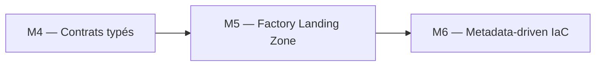
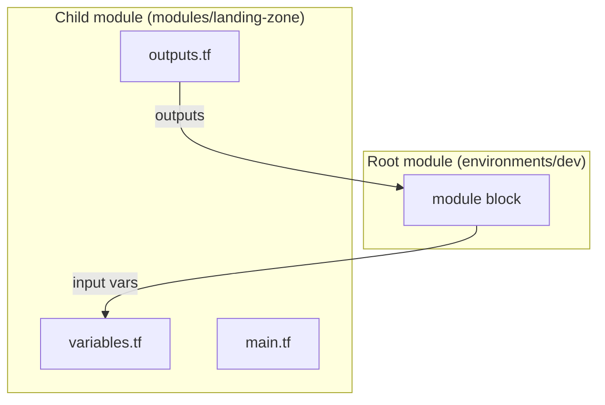

# Module 5 ? Cours : Création de Modules

> [<- Jour 2](../README.md) · [<- Jour 1](../../day-01/README.md) · **Module 05** · [Module suivant ->](../module-06-dynamic-logic/lab.md)

## Contexte métier

Les domaines Data ont besoin d'une plateforme cohérente sans copier des centaines de ressources. Un module Landing Zone transforme les standards d'architecture en produit réutilisable et versionné.

## Contexte architecture



| Référentiel | Alignement |
|---|---|
| Pattern | Reusable Landing Zone Module |
| Azure Well-Architected | Excellence opérationnelle, Optimisation des coûts |
| Azure CAF | Adopt |
| Platform Engineering | Produit plateforme composable |

## Pattern d'entreprise

Le pattern **Reusable Landing Zone Module** encode les garde-fous de nommage, rétention, monitoring et tagging dans une interface réutilisable.

---

## 1. Anatomie d'un module

Un module Terraform est un dossier contenant des fichiers `.tf`. Le **root module** est le répertoire où vous exécutez `terraform apply`.



## 2. Module Landing Zone

Responsabilités :

| Ressource | Rôle |
|-----------|------|
| `snowflake_database` | RAW, CURATED |
| `snowflake_warehouse` | ETL, Analytics |
| `snowflake_grant` | USAGE de base |

## 3. Contrat module (variables/outputs)

**Entrées typiques** :

```hcl
variable "environment" { type = string }
variable "warehouses" {
  type = map(string)  # name_suffix => size
}
```

**Sorties typiques** :

```hcl
output "database_names" {
  value = { raw = snowflake_database.raw.name, ... }
}
```

## 4. Source Git versionnée

```hcl
module "landing_zone" {
  source = "git::https://github.com/myorg/terraform-snowflake-modules.git//landing-zone?ref=v1.0.0"
}
```

| ref | Usage |
|-----|-------|
| `v1.0.0` | Production (pin strict) |
| `main` | Dev uniquement (instable) |

## 5. Bonnes pratiques

- Un module = une responsabilité
- README avec exemple d'usage
- Semver sur tags Git
- `terraform validate` dans CI par module

---

## 6. Design Patterns & Best Practices

| Pattern | Application | Pilier Well-Architected |
|---------|-------------|-------------------------|
| **Modularisation (DRY)** | `environments/dev` et `test` appellent le même module sans duplication. | Excellence Opérationnelle |
| **Contrat d'Interface** | `variables.tf` = entrée, `outputs.tf` = sortie. Le module est une boîte noire. | Excellence Opérationnelle |
| **Versionnement** | `source = "git::...?ref=v1.2.0"` pour les modules partagés entre projets. | Fiabilité |
| **Isolation par Environnement** | State séparé par environnement. Module inchangé, paramètres distincts. | Fiabilité / Sécurité |
| **Outputs Structurés** | `map` / `object` au lieu de outputs plats. Plus facile à chaîner entre modules. | Excellence Opérationnelle |
| **Gouvernance intégrée** | Le module `landing-zone` inclut désormais les Resource Monitors et les Tags. | Optimisation des Coûts |

### Lab associé

Voir [lab.md](./lab.md) pour la mise en pratique complète.

---

## Navigation

[<- Course M4](../../day-01/module-04-variables-outputs/course.md) · [<- Jour 2](../README.md) · **Course M5** · [Course M6 ->](../module-06-dynamic-logic/course.md)


